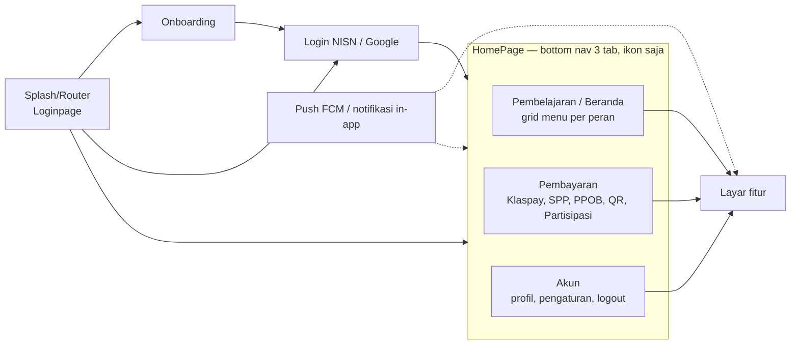

# 01 — Peta Fitur, Cakupan Migrasi & Rencana Kerja

Gambaran besar aplikasi lama `android-portal` v2.1.40: peran pengguna, struktur navigasi, **modul mana
yang benar-benar bisa dijangkau pengguna hari ini**, dan urutan migrasi yang disarankan ke
`Diskola-App-New`. Detail tiap modul ada di dokumen 02–10.

## Daftar isi
1. [Peran pengguna](#1-peran-pengguna)
2. [Struktur navigasi tingkat atas](#2-struktur-navigasi-tingkat-atas)
3. [Inventaris modul & status keterjangkauan](#3-inventaris-modul--status-keterjangkauan)
4. [Keputusan cakupan](#4-keputusan-cakupan)
5. [Prasyarat lintas fitur sebelum rilis](#5-prasyarat-lintas-fitur-sebelum-rilis)
6. [Urutan migrasi yang disarankan](#6-urutan-migrasi-yang-disarankan)
7. [Pemetaan teknologi lama → baru](#7-pemetaan-teknologi-lama--baru)
8. [Rangkuman keputusan ❓ terpenting](#8-rangkuman-keputusan--terpenting)

---

## 1. Peran pengguna

Peran ditentukan backend (`rule.is_student`, `rule.is_teacher`, `rule.is_librarian`) dan disimpan di
SharedPreferences; di-refresh setiap tab Beranda tampil (dokumen 02 §9, 03 §3.1).

| Peran | Penanda | Keterangan |
|---|---|---|
| Siswa | `is_student=true` | Menu: Materi, Tugas, Presensi, Jurnal, Asesmen, Poin, Magang |
| Guru / staf | `is_teacher=true` | Menu: Materi, Tugas, Presensi, Jurnal, Agenda Mingguan, Poin; banner absensi kantor; presensi dinas luar |
| Tamu (Guest) | bukan siswa/guru (mis. login Google tanpa data sekolah) | Semua menu **terkunci** (`is_having_class=false`); popup "Anda Masuk sebagai Tamu"; tombol "Verifikasi Data" |
| Belum punya kelas | `is_having_class=false` | Semua menu terkunci: dialog "Fitur ini terkunci" |

Tidak ada peran **orang tua** khusus di kode (README lama menyebutnya, tetapi alurnya tidak ada).
`is_librarian` dibaca dari response tetapi tidak dipakai UI. Flag produk `onklas_pro`/`has_store`
hanya dipakai modul Toko, yang tidak terjangkau (§3).

## 2. Struktur navigasi tingkat atas

- Back di tab mana pun **menutup aplikasi** (tab tidak ditumpuk). Pindah tab membuat ulang layar dan
  memuat ulang data (dokumen 03 §2.2, §2.6).
- Aplikasi selalu tema terang dan portrait. Tidak ada dark mode (dokumen 03 §10.7, 10 §8).
- Gerbang global di Home: tanggal/zona waktu wajib otomatis, izin notifikasi Android 13+, dialog
  email/ganti password (dokumen 02 §8, 03 §2.4).

## 3. Inventaris modul & status keterjangkauan

Status: ✅ **Aktif** (terjangkau pengguna v2.1.40) · 🟡 **Sebagian** · ⛔ **Tidak terjangkau** (kode ada
tapi titik masuknya dikomentari/tidak ada) · 🧩 **Stub** (layar ada tapi isinya dikomentari).

| Modul | Pengguna | Titik masuk | Status | Dokumen |
|---|---|---|---|---|
| Splash, onboarding, login NISN, login Google, reset password | Semua | Launcher | ✅ | 02 |
| Shell Home + Beranda (grid menu, kartu kelas, check-in QR siswa, banner absensi kantor) | Semua | Setelah login | ✅ | 03 |
| Akun: profil, pengaturan profil, foto (guru), kartu pelajar (siswa), ubah password, tentang/kebijakan, logout | Semua | Tab Akun | ✅ | 03 |
| Perangkat terhubung (`DevicesPage`) | — | Hanya dari drawer Home yang tidak bisa dibuka | ⛔ | 03 §2.5, §6.5 |
| Notifikasi in-app + push FCM + deep link | Semua (list notifikasi butuh Klaspay aktif) | Lonceng Beranda, tray | ✅ | 03 |
| Materi (siswa & guru) | Siswa, guru | Menu "Materi" | ✅ | 05 |
| Tugas/PR (siswa & guru) | Siswa, guru | Menu "Tugas" | ✅ | 05 |
| Agenda Mingguan | Guru | Menu "Agenda Mingguan" | ✅ | 05 |
| Poin (guru & siswa) | Siswa, guru | Menu "Poin", notifikasi | ✅ | 05 |
| Perpustakaan | — | Tidak ada pemanggil | ⛔ | 05 |
| Asesmen/AKM (ujian sekolah) | Siswa | Menu "Asesmen" | ✅ | 06 |
| Try Out | Siswa | Hanya sebagai tujuan "kembali" dari layar AKM | 🟡 | 06 §19 |
| Ujian lama (legacy) | Siswa | Notifikasi `COURSE/ASSIGNMENT`, worker | 🟡 | 06 §20 |
| Presensi (onsite, offsite guru, rekap, izin) | Siswa, guru | Menu "Presensi" (+ feature gate server) | ✅ | 07 |
| Jurnal KBM (+ capture foto) | Siswa, guru | Menu "Jurnal" (+ feature gate), tombol "Isi Jurnal" | ✅ | 07 |
| Magang | Siswa | Menu "Magang" | ✅ | 07 |
| Verifikasi / pengajuan data akun | Tamu / belum berkelas | Tombol "Verifikasi Data" di Beranda | ✅ | 07 §13 |
| Prokes (screening kesehatan) | — | Pemanggil dikomentari | ⛔ | 07 §12 |
| Pembayaran: aktivasi Klaspay (2 langkah PIN), top up & transfer, riwayat, Tagihanku, bayar SPP, PIN (lupa/atur ulang), QR Pay kantin & My QR, PPOB, dana partisipasi | Semua (sebagian besar butuh Klaspay aktif) | Tab Pembayaran, notifikasi, deep link reset PIN | ✅ | 08 |
| Sub-fitur pembayaran yang tersembunyi: riwayat SPP, WebView payment gateway, promo, tab "Sudah Dibayar", filter riwayat, periode BPJS, detail kegiatan partisipasi, halaman listrik/air lama | — | Pemanggil dikomentari / `gone` | ⛔ | 08 §13 |
| Feed sekolah, buat post/e-book, jelajah | — | Tab "Sekolah"/"Jelajah" dikomentari | ⛔ / 🧩 | 04 §0 |
| Komentar post, daftar penyuka, post per tagar | Semua | Notifikasi `feed-detail`, profil | ✅ | 04 |
| Chat | — | Notifikasi chat + "Balas" dari notifikasi; `ChatPage` isinya dikomentari (layar kosong) | 🧩 | 04 §6 |
| Pengumuman | — | Pemanggil dikomentari | ⛔ | 04 §7 |
| Toko sekolah & kewirausahaan (marketplace) | — | Tab "Toko" & tile dikomentari | ⛔ | 09 §0 |

Angka pendukung (dokumen 10): 162 Activity, 618 layout XML, 314 endpoint aktif (+3 di `ApiService2`),
93 entity Room, ±50 key SharedPreferences, 10 Worker.

## 4. Keputusan cakupan

> **Keputusan (30-09-2026):** **Tidak** dibangun — lihat `docs/FLOW_QUESTIONS.md` entri
> "2026-09-30 — Keputusan atas seluruh dokumen migrasi" bagian A. Final, bukan usulan lagi.

Karena target migrasi adalah **fitur tetap seperti sekarang**, modul ⛔/🧩 tidak dilihat pengguna saat
ini — dan **tidak akan dibangun** di app baru sampai ada keputusan baru:

| Modul | Keputusan final | Alasan |
|---|---|---|
| Marketplace (Toko/KWU) | **Tidak dibangun.** Kalau nanti diaktifkan, taruh di balik feature flag default `false` | Tidak terjangkau; banyak data dummy & bug (dokumen 09 §0) |
| Feed, buat post, jelajah, pengumuman | **Tidak dibangun** | Tidak terjangkau / stub (dokumen 04 §0) |
| Layar Chat (`ChatPage`) | **Tidak dibangun** (tetap seperti kode lama: stub/kosong). Notifikasi chat + **balas dari notifikasi** (`DirectReplyChat`) **tetap dipertahankan** — itu sudah terjangkau & berfungsi di v2.1.40, terpisah dari layar chat itu sendiri | Layar chat tidak terjangkau; balas-dari-notifikasi terjangkau |
| Komentar/penyuka/tagar | Dibangun | Terjangkau dari notifikasi & profil |
| Perpustakaan, Prokes, Perangkat terhubung | **Tidak dibangun** | Tidak terjangkau |
| Try Out & ujian lama | Dibangun sebatas titik masuk yang ada | Terjangkau sebagian |

Semua keputusan dicatat di `docs/FLOW_QUESTIONS.md`.

## 5. Prasyarat lintas fitur sebelum rilis

Bagian ini **wajib** diputuskan sebelum app Compose menggantikan app lama di Play Store (detail di
dokumen 02 §13 dan 10 §1, §5):

1. **Update in-place**: `applicationId` sama (`id.diskola.app`), tetapi `versionCode` app baru saat ini
   `1` → harus **> 79** dan ditandatangani dengan **keystore yang sama** dengan app lama.
2. **Sesi pengguna — ✅ Diputuskan (30-09-2026, 02 Q9):** migrasikan sesi. Baca ulang SharedPreferences
   lama (file `id.diskola.app`, key sama, mis. lewat `SharedPreferencesMigration`) agar pengguna tetap
   login setelah update, bukan paksa login ulang. App baru **saat ini** masih membaca status login
   dari file lain (`user_session`) sehingga semua pengguna akan ter-logout — ini harus diperbaiki
   mengikuti keputusan ini (dokumen 02a S3).
3. **Database — ❓ belum diputuskan (`docs/FLOW_QUESTIONS.md` 30-09-2026 bagian B):** app lama menaruh
   `MemoryDB` (v46) dan `PersistentDB` (v6) di satu file `diskola.db` dengan fallback destruktif.
   Belum diputuskan apakah data lama (terutama jawaban AKM yang belum terunggah) dipindahkan, atau
   app lama harus menyelesaikan sinkronisasi dulu sebelum update — putuskan lagi mendekati fase rilis.
4. **Penanganan 401 & logout — ✅ Diputuskan (30-09-2026, 02 Q6 + 06 §23.3#2):** 401 ditangani
   **terpusat** (bukan per-layar seperti app lama), tetapi logout yang dipicunya **wajib** lewat satu
   fungsi logout yang mengecek dulu apakah ada ujian AKM (belum dikumpulkan **atau** FINISHED-belum-
   terunggah) sebelum menghapus database — lihat dokumen 02 §9/§14 dan 06 §15. App baru **saat ini**
   masih menghapus database untuk setiap 401 tanpa pengecekan itu (dokumen 02a R10) — harus diperbaiki.
5. **Topik FCM & payload notifikasi — ✅ Diputuskan (30-09-2026, 02 Q7):** kelola subscribe/unsubscribe
   topik FCM dari **satu titik** berdasarkan status sesi (bukan tersebar seperti app lama); nama topik
   dan format payload `page` tetap dipertahankan sama persis agar notifikasi dari backend tetap bisa
   dirutekan (dokumen 03 §7–8).
6. **Logging — ✅ Diputuskan (30-09-2026, 08 Q14):** jangan tiru pencatatan body HTTP (termasuk PIN)
   dan token di build release milik app lama (dokumen 10 §9.2 #10) — matikan di build release.

## 6. Urutan migrasi yang disarankan

| Fase | Isi | Dokumen | Catatan |
|---|---|---|---|
| 0 | Fondasi: session store (kompatibel dengan prefs lama), network + error mapping, Room, topik FCM, router notifikasi, komponen dialog global | 02, 03 §10, 10 | Sebagian sudah ada di app baru |
| 1 | Auth lengkap: splash/router, onboarding, login NISN, Google SSO, reset password, dialog keamanan, validasi sesi, logout | 02, 02a | Perbaiki daftar di 02a dulu |
| 2 | Shell Home + Beranda + Akun + Notifikasi | 03 | Grid menu per peran, feature gate |
| 3 | Presensi + Jurnal KBM + izin | 07 | Butuh lokasi, kamera, QR |
| 4 | Materi + Tugas + Agenda Mingguan + Poin | 05 | |
| 5 | Asesmen/AKM (+ Try Out, ujian lama) | 06 | Paling kompleks: offline, lockdown, pelanggaran |
| 6 | Pembayaran: Klaspay, SPP, PIN, QR, PPOB, partisipasi | 08 | Aktivasi Klaspay juga dipakai alur SSO (fase 1) |
| 7 | Magang, verifikasi data, komentar/penyuka/tagar | 07, 04 | |
| 8 | (Opsional) modul ⛔ sesuai keputusan §4 | 04, 05, 07, 09 | |

Tiap fase selesai bila checklist paritas dokumennya tercentang di perangkat nyata, berdampingan dengan
app lama.

## 7. Pemetaan teknologi lama → baru

Ringkasan (tabel lengkap per dependency di dokumen 10 §1.7 dan §9.1):

| Area | `android-portal` | `Diskola-App-New` |
|---|---|---|
| UI | 162 Activity + Fragment, XML, DataBinding/ViewBinding | Single Activity, Jetpack Compose + Material 3 |
| Navigasi | Navigation Fragment + SafeArgs, `startActivity`, extra `goto` | Navigation Compose type-safe (`@Serializable`) |
| DI | Dagger 2 (satu komponen raksasa) | Hilt |
| State | LiveData | `StateFlow` + `collectAsStateWithLifecycle` |
| Jaringan | Retrofit + OkHttp + Moshi & Gson | Retrofit + OkHttp + satu library JSON |
| Data lokal | Room (kapt), SharedPreferences | Room (KSP), DataStore/SharedPreferences bertipe |
| Paging | Paging 2 + BoundaryCallback | Paging 3 / manual |
| Gambar | Glide | Coil |
| Izin | Dexter | Activity Result API / Accompanist Permissions |
| Kamera & QR | CameraView, ZXing embedded | CameraX + ML Kit Barcode |
| Login Google | Smart Lock + GoogleSignIn | Credential Manager |
| Background | WorkManager + `GlobalScope` + IntentService | WorkManager (`@HiltWorker`) + scope terkelola |

## 8. Rangkuman keputusan ❓ terpenting

Sudah **dijawab** oleh user pada 30-09-2026 — rujukan lengkap & final di `docs/FLOW_QUESTIONS.md`
entri "2026-09-30 — Keputusan atas seluruh dokumen migrasi". Ringkasan:

| Sumber | Pertanyaan | Keputusan final |
|---|---|---|
| 01 §4 | Modul tidak terjangkau (toko, feed, pengumuman, perpustakaan, prokes, chat) ikut dibangun atau tidak | **Tidak** dibangun (kecuali komentar/penyuka/tagar & balas-chat-dari-notifikasi, yang tetap dibangun karena terjangkau) |
| 01 §5 | Migrasi sesi & database pengguna lama saat update in-place | Sesi: **migrasi** (final). Database Room/AKM: **belum diputuskan**, tanya lagi mendekati rilis |
| 02 Q1 | Kondisi tampil dialog "lanjutkan sebagai tamu" pada login Google | **Tiru persis** logika lama (termasuk race condition-nya); kapan persisnya terjadi masih perlu diverifikasi di HP saat implementasi |
| 02 Q2 | `ssoSchool` objek kosong → tombol "daftar" aktif walau sekolah belum dipilih | **Deviasi:** wajib pilih sekolah dulu sebelum "daftar" aktif |
| 02 Q6 / 02a R10 | Penanganan 401: per layar seperti app lama, atau terpusat | **Terpusat**, tapi logout-nya tetap wajib cek blokir ujian AKM dulu (lihat §5 poin 4 di atas) |
| 02 Q7 | Topik FCM tersebar & tidak konsisten | **Deviasi:** kelola di satu titik berdasarkan status sesi |
| 02 Q8 | FCM `"logout"` tidak menavigasi ke Login | **Deviasi:** setelah bersih-bersih, navigasi juga ke Login |
| 03 Q6, Q7 | Izin notifikasi & waktu otomatis tetap memblokir aplikasi | **Belum diputuskan** |
| 06 §23.3 #1 | `exam_lock_mode` bila key tidak dikirim server | Default tetap **`false`** (mode ketat off) — dijadikan aturan resmi |
| 06 §23.3 #2 | Logout saat ujian FINISHED menunggu unggah | **Perbaiki:** blokir logout juga untuk kasus ini (perluasan dari aturan blokir logout yang sudah ada) |
| 07 Q1 | Lokasi latar belakang selalu wajib di presensi/magang | Pertahankan (tiru) |
| 07 Q5 | Tidak ada deteksi mock location/root | **Tambahan baru:** implementasikan deteksi mock location |
| 08 Q3 | Tombol "SALIN" menyalin nominal tanpa biaya admin | **Perbaiki:** salin `total_amount` |
| 08 Q8 | Transfer gagal tetap tampil halaman sukses, `nominal=0` | **Perbaiki:** kirim nominal asli; gagal ya tampil gagal |
| 08 Q10 | Notifikasi SPP/tagihan yang crash atau membuka layar kosong | **Asumsi sementara: perbaiki** (belum ada jawaban eksplisit — konfirmasi ulang) |
| 08 Q14 / 10 §9.2 #10 | Log PIN, token, dan body HTTP di build release | **Perbaiki** (jangan ditiru) |
| — | Kompatibilitas Android 8.1 (`minSdk 27`) & larangan kode spaghetti | Aturan kerja permanen — lihat `docs/rules-global.md` §5 |
