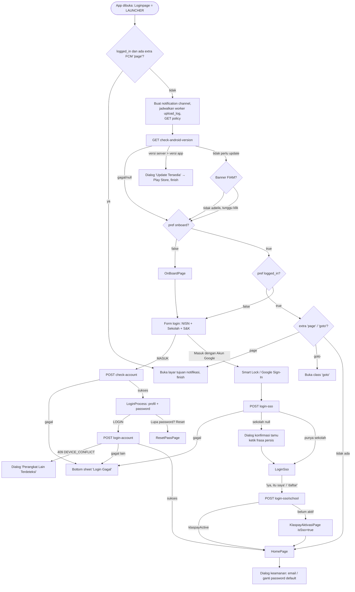

# 02 — Auth: Splash, Onboarding, Login, Google SSO, Reset Password, Sesi & Logout

Spesifikasi perilaku seluruh alur autentikasi aplikasi lama `android-portal` (v2.1.40 / versionCode 79),
dari aplikasi dibuka sampai pengguna masuk ke Home, termasuk validasi sesi berkala dan logout. Dokumen
ini menjadi acuan agar alur login di `Diskola-App-New` (Compose) **identik** dengan aplikasi saat ini.

> Singkatan path: `@/` = `android-portal/app/src/main/java/id/diskola/app/`,
> `res/` = `android-portal/app/src/main/res/`. Nomor baris mengacu ke kode per 29-09-2026.

## Daftar isi
1. [Gambaran alur](#1-gambaran-alur)
2. [Splash & router awal (`Loginpage`)](#2-splash--router-awal-loginpage)
3. [Onboarding](#3-onboarding)
4. [Login NISN/NIK + password](#4-login-nisnnik--password)
5. [Login Google (SSO)](#5-login-google-sso)
6. [Aktivasi Klaspay setelah SSO](#6-aktivasi-klaspay-setelah-sso)
7. [Reset password](#7-reset-password)
8. [Setelah masuk Home: dialog keamanan & verifikasi email](#8-setelah-masuk-home-dialog-keamanan--verifikasi-email)
9. [Validasi sesi berkala](#9-validasi-sesi-berkala)
10. [Logout](#10-logout)
11. [Kontrak API](#11-kontrak-api)
12. [Data lokal (SharedPreferences & Room)](#12-data-lokal-sharedpreferences--room)
13. [Catatan migrasi Compose](#13-catatan-migrasi-compose)
14. [❓ Keputusan yang perlu dikonfirmasi](#14--keputusan-yang-perlu-dikonfirmasi)
15. [Selisih dengan dokumen lama](#15-selisih-dengan-dokumen-lama)
16. [Checklist paritas](#16-checklist-paritas)

---

## 1. Gambaran alur

---

## 2. Splash & router awal (`Loginpage`)

`Loginpage` (`@/pages/login/Loginpage.kt`) adalah Activity LAUNCHER sekaligus splash, router awal,
dan host form login.

**Manifest** (`android-portal/app/src/main/AndroidManifest.xml:233-245`): `exported=true`,
`resizeableActivity=false`, `theme=@style/LoginTheme`, `windowSoftInputMode=adjustResize`, intent-filter
`MAIN` + `VIEW` + `LAUNCHER`. `LoginTheme` (`res/values/styles.xml:42`) memakai
`windowBackground=@drawable/splash_drawable` (latar putih + logo `ic_logo_label` di tengah). Jadi
"splash" = window background, sampai `setContentView` dipanggil (atau Activity pindah). Semua Activity
turunan `BasePage` dipaksa **portrait** (`@/pages/BasePage.kt:100`).

### 2.1 Urutan `onCreate`
| # | Langkah | Rujukan |
|---|---|---|
| 1 | Tangkap extra `page` (payload FCM) dari intent ke `pendingNotifPage` | `Loginpage.kt:66,177-182` |
| 2 | Jika `logged_in` **dan** ada `page` yang valid → langsung buka layar tujuan, `finish()`, **tanpa** cek versi/banner | `Loginpage.kt:68` |
| 3 | Buat 3 notification channel (API 26+): id=`app_name` (DEFAULT), id=`fcm_default_channel_id` (DEFAULT), id=`"<app_name>.silent"` (MIN, tanpa suara/lampu/getar) | `Loginpage.kt:72-112` |
| 4 | Jadwalkan `PeriodicWork` unik `"upload_log"` (`LogUploader`, tiap 6 jam, `KEEP`) | `Loginpage.kt:115-120` |
| 5 | `GET mobile/app/policy` (hasil disimpan ke `policyText` tapi **tidak pernah dipakai**) | `Loginpage.kt:122` |
| 6 | `GET mobile/app/config/check-android-version` → bandingkan versi | `Loginpage.kt:125-163` |
| 7 | Jika cek versi gagal (null) → `goNext()`; jika tidak perlu update → `checkBanner()` | `Loginpage.kt:162-163` |

`App.onCreate` (Application) juga berjalan sebelumnya: subscribe topik FCM `unlogged`, simpan
`firebase_id` & `token` (FCM) ke pref, dan memanggil `checkForUpdate()` (in-app update IMMEDIATE Play
Core). **Update Play Core itu tidak pernah tampil**: ia butuh `currentAct`, tetapi `App` tidak pernah
mendaftarkan dirinya sebagai `ActivityLifecycleCallbacks` (hanya `examLockdownLeakGuard`), sehingga
`currentAct` selalu null (`@/App.kt:48,71-93,192-207`). Satu-satunya mekanisme update yang aktif adalah
dialog §2.2.

### 2.2 Cek versi
- Response: `data.setting_globals_value` adalah **string JSON** yang di-parse ke `CheckVersion{version}`
  (`@/viewmodels/GeneralViewModel.kt:21-31`). Gagal parse/jaringan → `null` → langsung `goNext()`.
- Perbandingan: `latest.split(".").map(toInt)` di-`zip` dengan `BuildConfig.VERSION_NAME` → segmen
  pertama yang berbeda menentukan; perlu update jika segmen server lebih besar (`Loginpage.kt:126-132`).
  Karena `zip`, panjang segmen berbeda hanya dibandingkan sepanjang yang terpendek.
- Perlu update → dialog **tidak bisa dibatalkan**: judul `"Update Tersedia"`, pesan
  `"Silahkan update ke versi terbaru aplikasi"`, tombol `"Update"` → buka `market://details?id=<pkg>`
  (fallback `https://play.google.com/store/apps/details?id=<pkg>`), lalu `finish()` (`Loginpage.kt:134-161`).

### 2.3 Gerbang banner Firebase In-App Messaging (FIAM)
`checkBanner()` meng-observe `SharedPageViewModel.bannerData` (`Loginpage.kt:184-193`):
- `first` kosong → `goNext()`.
- `first` tidak kosong & `second` tidak kosong → `goNext(second)` (nilai `second` diteruskan sebagai extra
  `bannerData` ke Home; `"ppob"` membuat Home membuka tab Pembayaran, `@/pages/home/HomePage.kt:237`).
- `BasePage.onCreate` men-set `("","")` (`@/pages/BasePage.kt:98`); saat FIAM tampil diset
  `("BannerData","")` → router **menunggu** sampai banner diklik (klik → `goNext2(value)`,
  `BasePage.kt:89-96`).

### 2.4 `goNext(bannerData)` — keputusan tujuan
(`Loginpage.kt:225-272`)
1. Sudah navigasi dari notifikasi → berhenti.
2. `pref onboard == false` → `OnBoardPage`, `finish()`.
3. `pref logged_in == true` → coba buka notifikasi (`openNotifPageIfAny`); jika tidak ada, coba
   `Class.forName(intent.getStringExtra("goto"))`; jika gagal → `HomePage` (+extra `bannerData`); `finish()`.
4. Selain itu → `setContentView(login_page)` dan pasang tautan S&K di checkbox.

`onNewIntent`: tangkap ulang `page`; jika `logged_in` → `openNotifPageIfAny()` (`Loginpage.kt:168-175`).

`openNotifPageIfAny()` (`Loginpage.kt:199-223`): parse `page` via `NotifRouter.parsePage`; menu `""`,
`"logout"`, `"email_verified"` **tidak** dinavigasi; menu lain → `NotifRouter.intentFor(menu, id, subId, uuid)`.
Tabel routing lengkap ada di `03-home-navigasi-akun-notifikasi.md`.

---

## 3. Onboarding

`OnBoardPage` (`@/pages/onboard/OnBoardPage.kt`), layout `onboard_page.xml`, `ViewPager` 3 halaman
(`OnBoardItem` fragment):

| # | Gambar | Judul | Deskripsi |
|---|---|---|---|
| 1 | `img_onboard_1` | `"pembelajaran"` | `"Kemudahan belajar kapan saja dan dimana saja, kerjakan tugas kamu hanya dalam genggaman"` |
| 2 | `img_onboard_2` | `"kewirausahaan"` | `"Kemudahan berbelanja dalam lingkup sekolah"` |
| 3 | `img_onboard_3` | `"dompet digital"` | `"Praktis pembayaran disekolah dengan saldo wallet, bayar apapun kini ga perlu ribet pakai uang cash"` |

- Tombol kanan: `"berikutnya"`, di halaman terakhir `"selesai"`. Tombol kiri `"kembali"` disembunyikan
  di halaman pertama (`OnBoardPage.kt` `onPageSelected`). Footer teks `"PT. Era Baru Digitama"`.
- `"selesai"` → buka `Loginpage`, set `pref onboard=true`, `finish()`.
- Status bar terang (light) + layout fullscreen.
- Onboarding hanya tampil sekali: logout **mempertahankan** `onboard=true` (lihat §10).

---

## 4. Login NISN/NIK + password

Host: `login_page.xml` = logo `ic_logo_label_horizontal` di atas, `NavHostFragment` `form_container`
(graph `res/navigation/login_nav.xml`, start `loginForm`), logo `ic_logo_label_only` di bawah.
Ketiga fragment memakai **satu** `LoginViewModel` level Activity (`activityViewModels`).

### 4.1 `LoginForm` — isi NISN & sekolah
`@/pages/login/LoginForm.kt`, `res/layout/login_form.xml`

| Elemen | Detail |
|---|---|
| Judul | `"login akun"` (allCaps → **LOGIN AKUN**, bold) |
| Field NISN | ikon `ic_nis`, hint `"Ketikkan NISN/NIS/NIK"`, `inputType=number`, two-way ke `nisn` |
| Pilih sekolah | ikon `ic_school_login`, hint `"Pilih Sekolah"`, teks = `school.name`, caret kanan; tap → `ListSekolahPage` |
| Label error (tersembunyi, tidak pernah ditampilkan kode) | `"NIS/NIK Anda tidak terdaftar"`, `"Sekolah tujuan tidak sesuai"` |
| Checkbox S&K | `"Dengan ini saya membaca, memahami dan menyetujui hal-hal yang tercantum pada Syarat dan Ketentuan dan Kebijakan Privasi yang berlaku"`; potongan `"Syarat dan Ketentuan dan Kebijakan Privasi"` bergaris bawah & bisa diklik |
| Tombol utama | `"masuk"` (MaterialButton, tampil **MASUK**), `backgroundTint=@color/form_button_color`, radius 24sdp |
| Pemisah | `"atau"` |
| Tombol Google | `"Masuk dengan Akun Google"` (outlined, stroke abu 1dp, ikon `ic_google`, **tidak** allCaps) |

**Aturan tombol MASUK aktif** (`LoginForm.kt:287-291`): `nisn` tidak blank **dan** `school != null`
**dan** `termsChecked != false` (awal `false` → wajib centang).

**Tautan S&K** (`Loginpage.kt:275-337`): klik → dialog berisi `WebView` yang memuat HTML
`GET mobile/app/policy` → `data.content`; tombol `"SAYA PAHAM"` (warna `colorPrimary`) → centang
checkbox otomatis. Error memuat → toast pesan exception.

**Aksi MASUK** (`LoginForm.kt:85-100`):
1. `ProgressDialog` judul `"Mohon Tunggu"`, pesan `"Sedang mencari data pengguna..."`.
2. `POST mobile/app/authentication/check-account` body `{ "nisn_nik": <nisn>, "school_id": <school.uuid> }`
   (jika nisn kosong hanya `school_id`) (`@/utils/ApiWrapper.kt:47-71`).
3. Sukses → navigasi ke `LoginProcess`. Gagal → **bottom sheet** `ErrorUiModel` judul `"Login Gagal"`,
   deskripsi pesan backend (fallback `"Terjadi kesalahan saat login. Silakan coba lagi."`), tombol
   `"Coba Lagi"` (`LoginForm.kt:103-114`).

**Efek samping check-account** (`LoginViewModel.kt:94-115`, `ApiWrapper.kt:47-71`):
- pref `default_pass` = `using_default_password == "Y"` (top-level, fallback `data.using_default_password`),
  ditulis dengan `commit()`.
- Jika pref `user` sudah ada: perbarui field nama/email/nis/username/avatar & tulis ulang pref `user`
  dan `school`.
- pref `user_id` = `data.id`, `is_active` = `is_active`.
- LiveData: `user`, `role_label` = `data.roles.first().name`, `student`/`teacher` sesuai `rule`.
- `uuid` disimpan di ViewModel (dipakai login). Sekolah di-insert ke tabel Room `school`.

### 4.2 `ListSekolahPage` — pemilih sekolah
`@/pages/login/ListSekolahPage.kt` (`PageDialogFragment` layar penuh), `list_sekolah_page.xml`

- Toolbar judul `"Pilih Sekolah"` + tombol up (tutup). Field cari hint `"Cari sekolah"`, debounce
  **500 ms**. `SwipeRefreshLayout`. Loader + teks `"Loading..."` saat pertama.
- Item: nama sekolah; kota (`city_name`) ditampilkan hanya jika tidak kosong. Tap → kirim sekolah ke
  pemanggil, tutup dialog.
- **Sumber data = cache Room** (`school`, di `MemoryDB`) via Paging 2:
  `SELECT * FROM school WHERE name LIKE '%q%' ORDER BY name ASC`, page size 20
  (`@/pages/login/LoginDao.kt:28-29`, `LoginViewModel.kt:57-72`).
- Boundary callback: list kosong & tanpa query → `fetchSchool(0)`; scroll mentok & tanpa query & masih
  ada halaman → `fetchSchool(count)`. `fetchSchool(start)`:
  `GET mobile/app/authentication/schools?take=20&skip=<start>&name=` (param `name` **selalu kosong**);
  `start==0` → hapus semua cache sekolah dulu; `hasNext = data.size >= 20` (`LoginViewModel.kt:74-92`).
- Konsekuensi: **pencarian hanya memfilter sekolah yang sudah ter-cache lokal** — sekolah di halaman
  yang belum di-scroll tidak ketemu. (Lihat ❓ Q3.)
- Pull-to-refresh → reset paging, `fetchSchool(0)`.

### 4.3 `LoginProcess` — konfirmasi profil & password
`@/pages/login/LoginProcess.kt`, `login_process.xml`

| Elemen | Detail |
|---|---|
| Tombol back | ikon `ic_back_primary` → kembali ke `LoginForm` (navigate action, state tetap di VM) |
| Judul | `"masuk sebagai"` (allCaps, bold) |
| Kartu profil | avatar lingkaran `user.user_avatar_image`, nama (bold) `user.name`, tag = `role_label`, kelas = `user.student.student_class.class_room.name`, nomor = `user.nis_nik` |
| Field password | ikon `ic_lock`, hint `"Masukkan Password"`, `textPassword`, toggle lihat password. Keyboard **otomatis muncul** saat layar terbuka (fokus + `WindowInsetsControllerCompat.show(ime)`, dicoba lagi setelah 200 ms, `LoginProcess.kt:154-165`) |
| Label error (tersembunyi, tak dipakai) | `"Password tidak sesuai"` |
| Tautan reset | `"Lupa password? **Reset**"` — kata `Reset` bisa diklik (warna primary, tanpa underline) → `ResetPassPage` |
| Tombol | `"login"` (tampil **LOGIN**), aktif jika password tidak kosong |
| Info bawah | `"NISN/NIK terdaftar bukan milik Anda?"` + baris baru **`"Hubungi Kami"`** (klik) → WhatsApp `6287887219649`, fallback panggilan telepon ke nomor yang sama (`LoginProcess.kt:111-128`) |

**Aksi LOGIN** (`LoginProcess.kt:74-91`, `LoginViewModel.kt:263-312`):
1. Loading `BasePage.loading("Proses login akun")`.
2. `POST mobile/app/authentication/login-account` body
   `{ "uuid": <uuid dari check-account>, "password": <password>, "device_id": <ANDROID_ID> }`.
   `device_id` = `Settings.Secure.ANDROID_ID` (`@/utils/DeviceFingerprint.kt`).
3. Sukses → tulis pref (tabel di bawah), `Firebase.analytics.setUserId(id)`, `POST sosmed/setting/setup-user-fcm`
   `{uuid, user_fcm_token: pref token}` (error diabaikan).
4. Jika `default_pass` → **notifikasi lokal** (channel id `app_name`) judul `"Ganti Password"`, isi
   `"Perhatian, {kamu|Anda} masih menggunakan password default, silahkan ubah password akun {kamu|Anda} untuk meningkatkan keamanan data"`
   (`kamu` jika siswa, `Anda` selain itu), tap → `ChangePassPage` (`LoginProcess.kt:194-224`).
5. Buka `HomePage`, `finish()` Loginpage.

**Pref yang ditulis saat login sukses** (`LoginViewModel.kt:268-303`):

| Key | Nilai |
|---|---|
| `isSso` | `false` |
| `user_id` | `data.id` |
| `user_uuid` | uuid |
| `is_student` / `is_teacher` | dari `rule` |
| `is_having_class` | siswa: `student_class.id > 0`; guru: `true` |
| `student` / `teacher` | JSON `StudentItem` / `TeacherItem`. Nama kelas kosong diganti `"Tidak memiliki kelas"` |
| `class_id` | `student.student_class.class_room.id` (siswa) |
| `roles` | `rule_label` |
| `school` / `school_uuid` | JSON `SekolahItem` dari response / uuid sekolah yang dipilih |
| `user_token` | `meta.token` (dipakai header `Authorization: Bearer`) |
| `logged_in` | `true` |
| `is_verified`, `is_email_verified`, `klaspayActive` | dari response |
| `onklas_lite`, `onklas_pro`, `klastime` | dari `product_school` (default `true`/`false`/`false`) |
| `user` | JSON `UserTable` (id, uuid, nama, email, nisn_nik, nis_nik, phone, avatar, username, school_id) (`ApiWrapper.kt:129-145`) |

**Penanganan error login** (`LoginViewModel.kt:117-183`):
| Kondisi | Tampilan |
|---|---|
| HTTP **400** dengan `message`/`error` berisi `"Detail login tidak bisa digunakan"` (case-insensitive, titik akhir diabaikan) | Bottom sheet `"Login Gagal"` dengan deskripsi **`"Password yang anda masukkan salah"`** |
| `error_code == "DEVICE_CONFLICT"` (409, fitur 1 akun 1 perangkat) | **Dialog** judul `"Perangkat Lain Terdeteksi"`, deskripsi pesan backend (fallback `"Akun sedang aktif di perangkat lain. Silakan logout dari perangkat tersebut terlebih dahulu."`), note `"Catatan: Silahkan hubungi admin sekolah untuk menjalankan reset perangkat pengguna"`, tombol `"Mengerti"` |
| HTTP 422 dengan `errors.device_id` | Hanya di-log (indikasi bug app); tampil sebagai error umum |
| Lainnya | Bottom sheet `"Login Gagal"`: `ApiException.message` → atau parse body `message`/`error` (gabung `"<message>. <error>"`) → atau `e.message` → fallback `"Terjadi kesalahan saat login. Silakan coba lagi."` |
| Tanpa internet | `ApiException("Terjadi gangguan pada koneksi internet Anda, silahkan ulangi beberapa saat lagi")` dari `RequestInterceptor` |

---

## 5. Login Google (SSO)

### 5.1 Memperoleh akun Google (`LoginForm.kt:116-205`)
1. Tap `"Masuk dengan Akun Google"` → **Smart Lock for Passwords**
   `Credentials.getClient().request(CredentialRequest(passwordLoginSupported=true))`.
   - Sukses → `credential.id` (email), `name`, `profilePictureUri` → `checkEmail`.
   - Gagal `ApiException.statusCode == 4` (SIGN_IN_REQUIRED) dan Play Services tersedia → `googleSignIn()`;
     status lain / Play Services tidak ada → toast `"Gagal memuat layanan"`.
2. `googleSignIn()`: `GoogleSignInOptions.DEFAULT_SIGN_IN` + `requestIdToken(BuildConfig.CLIENT_ID)` +
   email + profile + `requestServerAuthCode(CLIENT_ID)`; **signOut dulu** agar pemilih akun selalu muncul.
   - OK → `account.email/displayName/photoUrl` → `checkEmail`.
   - `ApiException` → toast `"Error during sign-in: <statusCode>"`; dibatalkan → `"Login email gagal"`;
     lainnya → `"Login gagal"`.
   - **ID token / server auth code tidak dikirim ke backend** — backend hanya menerima email, nama, foto.

### 5.2 Cek email (`LoginForm.kt:207-236`, `LoginViewModel.kt:186-261`)
1. `ProgressDialog` `"Mohon Tunggu"` / `"Sedang mencari data pengguna..."`.
2. `POST mobile/app/authentication/login-sso` body
   `{ "email", "name", "image", "device_id": <ANDROID_ID> }` → `{ data?: UserSsoData, token, message }`.
3. ViewModel:
   - `data.is_student` → `role_label="Student"`, bentuk `StudentItem(id, nisn, name=username, student_class=current_class)`.
   - `data.is_teacher` → `role_label="Teacher"`, `TeacherItem(id, nik=nisn, name=username)`.
   - selain itu / `data == null` → `role_label="Guest"`, `userSso` diganti data sintetis `id=1`,
     username/email/image dari Google.
   - `ssoSchool` = `data.school ?: SekolahItem()` (objek kosong, **bukan null**, bila data ada tapi sekolah null).
   - Pref: `role_label`, `user_id` (`data.id` atau 0), `klaspayActive` = `data.is_klaspay_activated`,
     `is_email_verified=true`, `user_token` = `token` (**token sudah dipakai untuk request berikutnya**).
   - `ApiWrapper.checkEmail` juga menulis pref `user` (UserTable) & `school` (`ApiWrapper.kt:73-127`).
4. Hasil:
   - `DEVICE_CONFLICT` → dialog "Perangkat Lain Terdeteksi" (sama seperti §4.3).
   - Gagal lain → bottom sheet `"Login Gagal"`.
   - Sukses & `userSso.data.school == null` → **dialog konfirmasi tamu** (`res/layout/dialog_sso.xml`,
     tidak bisa di-cancel):
     - Judul `"Pemberitahuan"`, ikon `ic_googlesso`
     - Pesan `"Email Anda belum terdaftar di sistem Diskola.\nJika dilanjutkan, akun akan dibuat dengan level Guest (bukan siswa/guru)."`
     - `"Untuk melanjutkan, ketik teks berikut secara sama persis:"` + frasa
       **`lanjutkan sebagai tamu dulu bukan siswa/guru`**
     - Input hint `"Ketik teks konfirmasi"`; tombol `"Tutup"` (merah) & `"Lanjutkan"` (nonaktif sampai
       input **sama persis, case-sensitive**). `"Lanjutkan"` → `LoginSso`.
   - Sukses & punya sekolah → langsung `LoginSso`.
   - ⚠️ Lihat ❓ Q1: penentuan "punya sekolah" membaca `LiveData.value` tepat setelah `postValue` →
     kemungkinan besar selalu membaca nilai lama (`null`) sehingga dialog tamu bisa muncul untuk semua akun.

### 5.3 `LoginSso` — konfirmasi & pilih sekolah
`@/pages/login/LoginSso.kt`, `res/layout/login_sso.xml`

| Elemen | Kondisi tampil |
|---|---|
| Back `ic_back_primary`, judul `"masuk sebagai"` | selalu |
| Avatar `userSso.data.image`, nama `username` (bold), tag `role_label`, `nisn` | selalu |
| Kelas `current_class.class_room.name` (+divider) | jika nama kelas tidak kosong |
| Nama sekolah (+divider) | jika `school.name` tidak kosong |
| Pemilih sekolah `"Pilih Sekolah"` (buka `ListSekolahPage`) | jika `school.name` kosong |
| Tombol `"iya, itu saya"` (primary) & `"tidak, bukan saya"` (abu) | jika `school.name` **tidak** kosong |
| Tombol `"daftar"` (aktif jika `ssoSchool != null`) | jika `school.name` kosong |

Aksi (`LoginSso.kt:73-131`, `LoginViewModel.kt:314-365`):
- `"iya, itu saya"` / `"daftar"` → loading `"Proses login akun"` →
  `POST mobile/app/authentication/login-sso/school` body `{ "school_id": <ssoSchool.uuid> }`
  (Authorization = token dari §5.2).
- Pref saat sukses: `isSso=true`, `user_id`, `user_uuid`=`data.uuid`, flag siswa/guru/tamu
  (tamu: `is_student=is_teacher=is_having_class=false`), `roles` = `"Student"|"Teacher"|"Guest"`,
  `school` (dari `userSso.data.school` jika bernama, selain itu `ssoSchool`), `school_uuid`,
  `user_token` (token §5.2), `logged_in=true`, `is_active=true`, `is_verified=false`,
  `is_email_verified=true`, `klaspayActive = (data.is_klaspay_activated == 1)`.
  **Jika Klaspay belum aktif → `logged_in=false` dan `is_active=false`** (baru di-true-kan setelah aktivasi).
  Lalu `updateFcm`.
- Tidak menulis `onklas_lite/onklas_pro/klastime` maupun `default_pass` (lihat ❓ Q5).
- Navigasi sukses:
  - `"iya, itu saya"`: jika `default_pass` → notifikasi ganti password (hanya jika izin
    `POST_NOTIFICATIONS` sudah diberikan). `klaspayActive` → `HomePage` + finish; selain itu →
    `KlaspayAktivasiPage(isSso=true)` **tanpa** finish Loginpage.
  - `"daftar"`: `klaspayActive` → `HomePage`; selain itu → `KlaspayAktivasiPage(isSso=true)`; keduanya
    finish Loginpage.
- Gagal → bottom sheet `"Login Gagal"`.
- `"tidak, bukan saya"` / back → kembali ke `LoginForm`.

---

## 6. Aktivasi Klaspay setelah SSO

Detail lengkap di `08-keuangan-pembayaran-klaspay-ppob.md`; bagian yang terkait login:
- `KlaspayAktivasiPage` dengan extra `isSso=true` langsung menampilkan alert judul
  `"Aktivasi Pin Wallet"`, pesan `"Proses aktivasi wallet dibutuhkan untuk keperluan transaksi anda selama di aplikasi"`,
  tombol `"SIAP"` (`@/pages/klaspay/aktivasi/KlaspayAktivasiPage.kt:35-48`).
- Alur yang benar-benar tampil **2 langkah**: `KlaspayAktivasiPin` (buat PIN 6 digit) →
  `KlaspayAktivasiPinConfirm` (konfirmasi). Graph `klaspay_aktivasi_nav.xml` masih memuat
  `KlaspayAktivasiAkun` (langkah password), tetapi `startDestination` = `KlaspayAktivasiPin`
  (`res/navigation/klaspay_aktivasi_nav.xml:6`), sehingga langkah password tidak pernah tampil dan
  body aktivasi dikirim dengan `password = ""` (`KlaspayAktivasiPinConfirm.kt:71-74`,
  `KlaspayAktivasiViewmodel.kt:20,61-63`).
- Sukses aktivasi (`KlaspayAktivasiViewmodel.kt:61-69`): `klaspayActive=true`; jika SSO:
  `logged_in=true`, `is_active=true`.
- Dialog sukses: tombol top-up → `KlaspayTopupPage` + finish; tombol nanti → jika SSO `HomePage`
  + finish, selain itu hanya finish (`KlaspayAktivasiPinConfirm.kt:83-104`).

---

## 7. Reset password

Hanya bisa dibuka dari `LoginProcess` (setelah check-account, karena butuh `user_id`).
`ResetPassPage` (`@/pages/resetpass/`), toolbar `"Reset Password"` + back, graph `reset_pass_nav.xml`.

1. **`FormResetPage`**: teks `"Kami akan mengirimkan link pemulihan ke email terdaftar"`, label
   `"email pemulihan"`, input hint `"Ketikkan email"` (`textEmailAddress`), tombol `"kirim sekarang"`
   aktif jika panjang teks **> 3**. Tap → `ProgressDialog` `"mengirimkan kode reset"` →
   `POST mobile/app/authentication/reset-password` `{ "user_id": pref user_id, "email": <email> }`.
   Sukses → `SuccessResetPage` (arg `emailArg`). Gagal → toast pesan error.
2. **`SuccessResetPage`**: judul `"link pemulihan terkirim"`, teks
   `"Link reset password telah dikirimkan, cek email <b>{email}</b>"`, tombol kirim ulang dengan
   countdown **3 menit**: label `"kirim ulang m:s"` (tanpa nol di depan detik, mis. `2:5`), selesai →
   `"kirim ulang"`. Tap → API yang sama → nonaktifkan tombol & ulang timer.
   Catatan: selama countdown pertama tombol **tidak** dinonaktifkan (hanya setelah kirim ulang).

---

## 8. Setelah masuk Home: dialog keamanan & verifikasi email

### 8.1 Pemeriksaan saat `HomePage` dibuka (bagian yang terkait sesi)
- Jika `klaspayActive`: `GET` wallet Klaspay → pref `klaspay_id`, `isToppers`, `toppersStatus`
  (`@/pages/home/HomePage.kt:93-172`).
  - HTTP 500 → alert `"Layanan Klaspay Bermasalah"` / `"Gagal memuat e-wallet. Silakan coba beberapa saat lagi."`.
  - HTTP 401 → jika ada ujian belum dikumpulkan: alert `"Perhatian"` (teks blokir ujian, §10) → `AkmPage`;
    selain itu alert `"Pemberitahuan"` / `"Akses Payment tidak valid. Silakan login ulang."` / `"Oke"` →
    Google signOut + logout.
- Cek tanggal & zona waktu otomatis di `onResume` (detail di dokumen 03).

### 8.2 Dialog keamanan (`@/pages/home/dialogs/HomeDialog.kt:56-95`)
Dipanggil di akhir `HomePage.onCreate`, **setiap kali** pref `default_pass`, `klaspayActive`,
`is_email_verified`, `is_email_verifying` berubah (listener SharedPreferences, `HomePage.kt:72-86,381`),
dan di `AkunPage2.onStart`. Tidak menumpuk (cek tag fragment).

Prioritas:
1. `!is_email_verified` → `EmailSettingDialog`; setelah ditutup, jika `default_pass` → `ChangePasswordDialog`.
2. `is_email_verifying` → `EmailConfirmDialog`; setelah ditutup, jika `default_pass` → `ChangePasswordDialog`.
3. `default_pass` → `ChangePasswordDialog`.

`ChangePasswordDialog` **cancelable = `!klaspayActive`** — jika wallet aktif, dialog wajib (tombol
`"Nanti Saja"` disembunyikan).

**`EmailSettingDialog`** (`email_setting_dialog.xml`): judul `"Masukkan Email"`, deskripsi
`"Daftarkan email Anda, fitur Pembayaran hanya akan berjalan dengan email yang terverifikasi"`,
input `"Masukkan Email"`, catatan `"Silahkan menghubungi admin untuk memperabarui email anda!"`,
tombol `"Verifikasi Sekarang"` & `"Nanti Saja"`. Tombol edit email → Google Sign-In (signOut dulu)
untuk memilih email → mengisi field. `"Verifikasi Sekarang"` (email valid `Patterns.EMAIL_ADDRESS`) →
loading `"Mengirimkan verifikasi..."` → `PUT mobile/app/accounts/user/{uuid}/change-profile` → lalu
`GET mobile/email/verify` (set `is_email_verifying=true`) → buka `EmailConfirmDialog`. Gagal → dialog
`"PEMBERITAHUAN"` / `"Email sudah digunakan oleh akun:"` + pesan / `" Tutup "` dan email dikembalikan.

**`EmailConfirmDialog`**: `"Verifikasi Email Sekarang"`,
`"Email verifikasi telah dikirimkan, silahkan cek email yang telah didaftarkan"`,
`"Ok Saya Konfirmasi Dulu"`, `"Ubah Email"` (hanya jika dibuka dari cabang `is_email_verifying`).

**`ChangePasswordDialog`** (`@/pages/home/dialogs/password/ChangePasswordDialog.kt`):
- Judul `"Ubah Password"`, deskripsi `"Password belum diperbarui, untuk keamanan akun Anda, silahkan ganti password lama Anda"`,
  field `"Password lama"`/`"Masukkan password lama"`, `"Password baru"`/`"Masukkan password baru"`,
  `"Konfirmasi password"`/`"Konfirmasi password baru"`, tombol `"Buat Password Baru"` & `"Nanti Saja"`.
- Aktif bila ketiga field terisi. Validasi: baru ≠ konfirmasi → toast `"Kkonfirmasi password baru tidak sesuai"`
  (typo "Kk" asli); baru == lama → `"Password baru tidak boleh sama dengan password lama"`.
- Konfirmasi: `"Ubah Password Sekarang?"` / `"Perubahan password baru akan segera diproses, Anda yakin untuk memperbarui password Anda?"`
  / `"Ketik Ulang"` / `"Saya Yakin"` → loading `"mohon tunggu"` →
  `PUT mobile/app/accounts/user/{uuid}/change-password` `{old_password, new_password}` → `default_pass=false`
  → dialog `"Password Diperbarui"` / `"Selamat, passwordmu berhasil diperbarui, sekarang kamu bisa login dengan password baru"` / `"Ok, Kembali"`.

### 8.3 Penyelesaian verifikasi email
- **Deep link** `https://portal.diskola.id/verify-email?url=<url-encoded>` (juga host `dev.portal.diskola.id`,
  `autoVerify=true`) → `DeepLinkPage` (`@/pages/DeepLinkPage.kt:24-60`): loading `"memverifikasi email Anda"` →
  `GET <url yang di-decode>` → pref `is_email_verified=true`, `is_email_verifying=false` → dialog
  `"Email Terverifikasi"` / `"Selamat, email sudah terverifikasi oleh sistem kami, silahkan menggunakan layanan Diskola"` / `"Ok"`
  → `goNext()` (onboard → login/home, sama seperti §2.4 tanpa FCM). Gagal → dialog `"Perhatian"` + pesan
  error + `"Tutup"` → `goNext()`.
- Deep link `https://dev.api.diskola.id/api/payment/reset-pin/token/...` → reset PIN Klaspay (dokumen 08).
- `GET mobile/gmail/verify/{google_token}` dari Home/Akun (`HomePage.kt:444-460`).
- Push FCM menu `"email_verified"` → set pref **`is_verified`** (bukan `is_email_verified`)
  (`@/services/NotifService.kt:163`).

### 8.4 Topik FCM
Di-subscribe setiap `HomePage.onCreate` (`@/pages/home/HomePage.kt:221-234`):
`school-leave-request-approved-{user_uuid}`, `school-leave-request-rejected-{user_uuid}`,
`topics/diskola-notification-user-{user_uuid}` **dan** `diskola-notification-user-{user_uuid}`,
`diskola-notification-school-{school_uuid}`, `diskola-notification-theory-{class_id}`,
`diskola-notification-task-{class_id}`, `Klaspay-US-{user_id}`, `attendance-{class_id}`, `loggedin`;
lalu unsubscribe `unlogged`. `AkunPage2` mengulang sebagian besar daftar ini
(`@/pages/akun/AkunPage2.kt:74-84`, tanpa `topics/…`, `theory`, `task`).
`App.onCreate` selalu subscribe `unlogged` di setiap start aplikasi (lihat ❓ Q7). Detail routing
push per topik ada di dokumen 03 §8.6.

---

## 9. Validasi sesi berkala

> Bagian ini mendeskripsikan perilaku **kode lama apa adanya** (rujukan implementasi). Untuk app
> baru, keputusan final (401 ditangani **terpusat**, bukan per-layar seperti di bawah) ada di §14 Q6
> dan §13.2 — jangan mengimplementasikan tabel di bawah ini per-layar secara literal.

Tidak ada penanganan 401 global — tiap layar menanganinya sendiri. Mekanisme yang ada:

| Mekanisme | Dipanggil di | Perilaku |
|---|---|---|
| **Refresh check-account** `SosmedViewModel.checkUser()` (`@/pages/sekolah/SosmedViewModel.kt:276-361`) | `PembelajaranPage.loadData()` (tiap resume), `AkunPage2.onStart` | Memperbarui `default_pass`, `is_verified`, `is_email_verified`, `is_email_verifying = !is_email_verified`, `is_active`, flag peran, `is_having_class`, `has_student_class`, `student`/`teacher`, `class_id`, `role_label`, `user`, `school`, `klaspayActive`. `is_active == false` → Pembelajaran: alert `"Peringatan"` / `"Akun anda tidak aktif, hubungi admin sekolah untuk aktivasi"` / `"Baik"` → logout; Akun: logout langsung. Error → hanya log/`errorString`. Guest → popup info tamu di Pembelajaran (dokumen 05). |
| **`verifyCurrentUserSession()`** (`@/pages/SessionGuard.kt`) | `AkunPage2.onStart`, `PembelajaranPage.loadData()`, `PembayaranPage` | `GET mobile/app/authentication/current-user`. Jika `single_device_login_enabled && device_id != null && device_id != ANDROID_ID` → dialog `"Perangkat Lain Terdeteksi"` / `"Akun Anda sedang aktif di perangkat lain. Silakan logout dari perangkat tersebut terlebih dahulu."` + note admin / `"Mengerti"` → logout. HTTP 401 → dialog `"Sesi Berakhir"` / `"Sesi Anda telah berakhir. Silakan login kembali."` / `"Masuk Kembali"` → logout. `device_id == null` (token lama) **bukan** konflik. |
| **Sekolah tidak terdaftar** (`@/pages/pembayaran/PembayaranPage.kt:130-150,440-452`) | tab Pembayaran | `school.uuid` kosong → dialog `"PEMBERITAHUAN"` / `"Mohon maaf, Sekolah anda sudah tidak terdaftar \n anda akan dikeluarkan dari aplikasi "` / `"Oke"` → logout (`NEW_TASK or CLEAR_TASK`). ⚠️ Observer yang sama menampilkan dialog logout untuk **setiap** `errorString` dari ViewModel itu (❓ Q6). |
| Klaspay 401 | Home (§8.1), `EntrepreneursPembelian` (`klaspayUnauthorized`) | logout |
| Push FCM menu `"logout"` | `NotifService.kt:162` | `intentUtil.logOut(context)` → bersihkan data di background **tanpa** navigasi ke Login (❓ Q8) |

**Interceptor jaringan** (detail di dokumen 10):
- `RequestInterceptor`: tanpa internet → `ApiException("Terjadi gangguan pada koneksi internet Anda, silahkan ulangi beberapa saat lagi", 0)`;
  header `Accept: application/json`, `Authorization: Bearer <user_token>` (selalu dikirim, termasuk
  `"Bearer "` kosong sebelum login) (`@/api/RequestInterceptor.kt`).
- `ResponseInterceptor` (`@/api/ResponseInterceptor.kt`): 2xx dengan `status != "success"` →
  `ApiException(message)`. 503/504 → dialog `"Perbaikan Sistem"` /
  `"Kami sedang melakukan perbaikan sistem untuk meningkatkan layanan kami kepada Anda. Kami akan segera kembali."` / `"OK"`.
  401, 403, 500 → diteruskan (jadi `HttpException` Retrofit). Lainnya → `ApiException(pesan "message. error"
  fallback "Mohon maaf, terjadi kesalahan", responseCode, errorTypes = keys dari "errors", data, Retry-After, error_code)`.

---

## 10. Logout

### 10.1 Pemicu
| Pemicu | Konfirmasi | Blokir ujian? |
|---|---|---|
| Tab Akun → tombol Logout (`AkunPage2.kt:222-252`) | Dialog `"Logout"` / `"Anda yakin akan keluar dari aplikasi?"` / `"Logout"` / `"Batal"` | Ya — `db.akm().hasUnfinishedUjian()` → prettyAlert `"Perhatian"` / `"Masih terdapat ujian yang belum diselesaikan, silahkan kumpulkan ujian terlebih dahulu agar nilai ujian terproses"` / `"OK"` (gambar `ujiandone`) → `AkmPage(isSchoolScope=true)` |
| Drawer Home → Logout (`HomePage.kt:305-340`) | Sama; loading `"Keluar dari aplikasi"` | Ya (alert biasa, teks sama) |
| Klaspay 401 di Home | Alert `"Akses Payment tidak valid..."` | Ya |
| Sesi 401 / perangkat lain (SessionGuard) | Dialog | Tidak |
| `is_active == false` | Alert (Pembelajaran) / langsung (Akun) | Tidak |
| Sekolah tidak terdaftar (Pembayaran) | Dialog | Tidak |
| FCM `"logout"` | — | Tidak |

Sebelum logout dari tombol, dipanggil `GoogleSignInClient.signOut()`.

> **Keputusan app baru (30-09-2026, `docs/FLOW_QUESTIONS.md` bagian E):** kolom "Blokir ujian?" di
> atas mendeskripsikan kode lama (hanya blokir bila ada ujian **belum diselesaikan/diunduh**). Di app
> baru, aturan blokir **diperluas**: logout juga harus diblokir bila ada ujian berstatus **FINISHED**
> yang jawabannya belum terkonfirmasi terunggah ke server (detail & alasan di dokumen 06 §15, §23.3#2).
> Ini berlaku untuk **semua** baris di atas, termasuk jalur yang di kode lama "Tidak" diblokir (Sesi
> 401, `is_active==false`, sekolah tidak terdaftar, FCM `"logout"`) — satu fungsi logout, satu
> pengecekan, dipakai oleh semua pemicu.

### 10.2 Prosedur `logOutAndNavigateToLogin` (`@/utils/IntentUtil.kt:512-597`)
1. `logged_in=false` (commit).
2. Start `Loginpage` dengan `CLEAR_TOP | SINGLE_TOP`, lalu `finishAffinity()` (menutup seluruh Activity
   lama, termasuk layar AKM).
3. Di background (`GlobalScope`, jeda 300 ms) `performLogout`:
   1. `MemoryDB.clearAllTables()` dan `PersistentDB.clearAllTables()`.
   2. FCM unsubscribe: `school-leave-request-approved-{uuid}`, `school-leave-request-rejected-{uuid}`,
      `diskola-notification-user-{uuid}`, `Klaspay-US-{user_id}`, `attendance-{class_id}`, `loggedin`;
      subscribe `unlogged`. (`diskola-notification-school-{school_uuid}`, `-theory-{class_id}`,
      `-task-{class_id}`, dan `topics/diskola-notification-user-{uuid}` **tidak** di-unsubscribe.)
   3. `DELETE logout` jika sebelumnya login (error diabaikan).
   4. `SharedPreferences.clear()` lalu tulis ulang `url_api = BuildConfig.API_URL`, `onboard = true`
      (+`check_vc = true` bila dipanggil dari `logOut(context)`).
   5. Putus socket, batalkan semua notifikasi, `WorkManager.cancelAllWork()`.

---

## 11. Kontrak API

| Method | Path | Body / Query | Field response yang dipakai | Kapan |
|---|---|---|---|---|
| GET | `mobile/app/config/check-android-version` | — | `data.setting_globals_value` (string JSON `{"version":"x.y.z"}`) | Splash |
| GET | `mobile/app/policy` | — | `data.content` (HTML) | Splash (tak dipakai) & dialog S&K |
| GET | `mobile/app/authentication/schools` | `take`, `skip`, `name` (selalu `""`) | `data[]`: `id, uuid, name, image, address, city_name, coordinate_radius, coordinate_latitude, coordinate_longitude` | Pemilih sekolah (paging) |
| POST | `mobile/app/authentication/check-account` | `{nisn_nik?, school_id: uuid}` | `data{id, uuid, name, email, nis_nik, nisn_nik, user_avatar_image, user_username, student, teacher, school, roles[]}`, `rule{is_student,is_teacher,is_librarian}`, `using_default_password`, `is_active`, `is_verified`, `is_email_verified`, `is_klaspay_activated`, `userProgress`, `current_subject` | Tombol MASUK; refresh sesi |
| POST | `mobile/app/authentication/login-account` | `{uuid, password, device_id}` | `data{...}`, `meta.token`, `rule`, `rule_label`, `is_verified`, `is_email_verified`, `is_klaspay_activated`, `product_school{onklas_lite, onklas_pro, klastime}` | Tombol LOGIN |
| POST | `mobile/app/authentication/login-sso` | `{email, name, image, device_id}` | `data?{id, username, email, nisn, image, is_student, is_teacher, is_klaspay_activated, school?, current_class?}`, `token` | Setelah pilih akun Google |
| POST | `mobile/app/authentication/login-sso/school` | `{school_id: uuid}` | `data{id, uuid, name, email, avatar, school_id, is_klaspay_activated: Int}` | `"iya, itu saya"` / `"daftar"` |
| GET | `mobile/app/authentication/current-user` | — | `id, uuid, device_id?, single_device_login_enabled` | Validasi sesi |
| POST | `mobile/app/authentication/reset-password` | `{user_id, email}` | — | Reset password |
| POST | `sosmed/setting/setup-user-fcm` | `{uuid, user_fcm_token}` | — | Setelah login / SSO |
| PUT | `mobile/app/accounts/user/{uuid}/change-password` | `{old_password, new_password}` | — | Dialog ganti password |
| PUT | `mobile/app/accounts/user/{uuid}/change-profile` | `{phone, email, username}` | — | Dialog email |
| GET | `mobile/email/verify` | — | — | Kirim email verifikasi |
| GET | `mobile/gmail/verify/{google_token}` | — | — | Verifikasi email via Google |
| GET | `<url dari deep link>` | — | — | Konfirmasi verifikasi email |
| DELETE | `logout` | — | — | Logout |

Kode error khusus: 400 + `"Detail login tidak bisa digunakan"` (password salah), 409 + `error_code: "DEVICE_CONFLICT"`,
422 + `errors.device_id`, 401 (sesi habis), 503/504 (maintenance).
Endpoint terkait yang dipakai modul lain: `login-sso/classes`, `mobile/app/roles`, `login-sso/check-nisn`,
`login-sso/verification`, `requesting-student`, `requesting-teacher` (verifikasi, dokumen 07);
`sessions`, `sessions/{id}`, `sessions/others` (perangkat, dokumen 03).

---

## 12. Data lokal (SharedPreferences & Room)

SharedPreferences tunggal bernama **`context.packageName`** (`@/di/modules/PreferenceModule.kt:14`),
dibungkus `PreferenceClass`. Key yang berperan di auth (daftar lengkap semua key ada di dokumen 10):

| Key | Tipe | Ditulis oleh | Arti |
|---|---|---|---|
| `onboard` | Boolean | Onboarding, logout | Onboarding sudah dilihat |
| `logged_in` | Boolean | Login, SSO, aktivasi Klaspay (SSO), logout | Gerbang router §2.4 |
| `user_token` | String | Login (`meta.token`), SSO (`token`) | Bearer token |
| `user_id` / `user_uuid` | Int / String | check-account, login, SSO | Identitas user |
| `isSso` | Boolean | Login (`false`), SSO (`true`) | Jalur login |
| `is_student`, `is_teacher`, `is_having_class`, `has_student_class` | Boolean | Login, SSO, checkUser | Peran & kelas |
| `student`, `teacher` | String JSON | Login, SSO, checkUser | Data peran |
| `class_id` | Int | Login, SSO, checkUser | `class_room.id` (topik `attendance-{id}`) |
| `roles` | String | Login (`rule_label`), SSO | Label peran dari backend |
| `role_label` | String | SSO, checkUser (`Student`/`Teacher`/`Guest`) | Dipakai deteksi tamu |
| `school`, `school_uuid` | String JSON / String | check-account, login, SSO | Sekolah aktif |
| `user` | String JSON (`UserTable`) | check-account, login, SSO, profil | Profil ringkas |
| `is_active`, `is_verified`, `is_email_verified`, `is_email_verifying` | Boolean | check-account, login, SSO, dialog email, deep link | Status akun |
| `klaspayActive` | Boolean | Login, SSO, checkUser, aktivasi | Wallet aktif |
| `default_pass` | Boolean | check-account (`commit`), ganti password | Masih password default |
| `onklas_lite`, `onklas_pro`, `klastime` | Boolean | Login | Produk sekolah (gating menu) |
| `token`, `firebase_id` | String | `App.onCreate` | Token FCM & Installation ID |
| `url_api` | String | Logout | Base URL |
| `check_vc` | Boolean | Logout via `logOut(context)` | (makna belum terverifikasi — tidak ada pembaca di kode) |

Room: tabel `school` (+`role`, `class`, `sessions`) di `MemoryDB` (`@/pages/login/LoginDao.kt`). Logout
mengosongkan **seluruh** tabel `MemoryDB` dan `PersistentDB` (termasuk data ujian AKM — itu sebabnya
logout diblokir bila ada ujian belum dikumpulkan).

---

## 13. Catatan migrasi Compose

**Struktur yang diusulkan** (single Activity, Navigation Compose type-safe):

| Route (`@Serializable`) | Composable / ViewModel | Pengganti dari |
|---|---|---|
| `Splash` (atau `installSplashScreen().setKeepOnScreenCondition`) | `SplashViewModel` → `StartDestination` | `Loginpage` bagian router |
| `Onboarding` | `OnboardingScreen` (`HorizontalPager`) | `OnBoardPage` |
| `Login` | `LoginScreen` + `LoginViewModel` (`LoginUiState`) | `LoginForm` |
| `SchoolPicker` (full-screen dialog/bottom sheet) | `SchoolPickerSheet` (Paging 3 + Room `RemoteMediator`) | `ListSekolahPage` |
| `LoginPassword` | `PasswordScreen` | `LoginProcess` |
| `LoginSso` | `SsoScreen` | `LoginSso` |
| `ResetPassword`, `ResetPasswordSent(email)` | `ResetPasswordScreen` | `ResetPassPage` |
| `KlaspayActivation(isSso)` | (dokumen 08) | `KlaspayAktivasiPage` |

Rekomendasi teknis:
- **Satu `SessionRepository`** (DataStore) yang memegang semua key §12 dan mengekspos `Flow<Session>`;
  router Splash membaca `onboard`/`logged_in` dari sini. Semua jalur logout memanggil satu fungsi
  `SessionManager.logout(reason)` yang: navigasi `popUpTo(graph){inclusive=true}` ke Login, lalu
  cleanup di `applicationScope` (bukan `GlobalScope`).
- **Migrasi data pengguna yang meng-update aplikasi (✅ Q9 — final untuk sesi):** `applicationId` tetap
  `id.diskola.app`, jadi pengguna yang update dari Play Store membawa SharedPreferences `id.diskola.app`
  & database Room lama. **Wajib** pakai `SharedPreferencesMigration(context, "id.diskola.app")` dengan
  **nama key yang sama** agar pengguna tetap login (diputuskan: migrasi, bukan paksa login ulang).
  Migrasi Room (terutama jawaban AKM yang belum tersinkron) **masih belum diputuskan** — jangan
  diasumsikan, tanyakan lagi mendekati rilis (`docs/FLOW_QUESTIONS.md` bagian B).
- **Google Sign-In**: Smart Lock (`Credentials.getClient`) dan `GoogleSignIn` sudah deprecated. Ganti
  dengan **Credential Manager** (`GetGoogleIdOption(serverClientId = WEB_CLIENT_ID, filterByAuthorizedAccounts=false)`
  atau `GetSignInWithGoogleOption`), ambil `email`/`displayName`/`profilePictureUri` dari
  `GoogleIdTokenCredential`, kirim body **yang sama** ke `login-sso`. Sign-out → `clearCredentialState()`.
  Library sudah terpasang di `Diskola-App-New` (`androidx.credentials`, `googleid`).
- **Hasil aksi dikembalikan langsung** (sealed `LoginResult`/`AuthError`: `InvalidPassword`,
  `DeviceConflict(message)`, `Network`, `Server(message)`) — jangan membaca state setelah `postValue`
  seperti akar bug Q1. **Tapi** karena keputusan Q1 = tiru persis kapan dialog tamu muncul di kode
  lama, jangan otomatis mengganti kondisinya jadi `data == null || data.school == null` — implementasi
  balik logika lama itu (baca `LoginViewModel.kt:191-246`) dengan arsitektur baru yang bersih (`Result`/
  state yang benar), verifikasi di HP dulu kapan tepatnya dialog tamu tampil di app lama, baru cocokkan.
- **Error UI**: satu komponen `AppErrorSheet` (bottom sheet) dan `AppErrorDialog` (dengan `note`) sesuai
  `ErrorUiModel` lama (`BOTTOM_SHEET` untuk "Login Gagal", `DIALOG` untuk konflik perangkat / sesi).
- **Keyboard otomatis** di layar password: `FocusRequester` + `LaunchedEffect` +
  `LocalSoftwareKeyboardController.show()`.
- **S&K**: `AnnotatedString` dengan `LinkAnnotation.Clickable` → dialog berisi `AndroidView(WebView)`
  (HTML dari `mobile/app/policy`); cukup satu fetch saat dialog dibuka.
- **Notifikasi ganti password**: minta izin `POST_NOTIFICATIONS` (API 33+) secara konsisten; channel id
  tetap `app_name` agar kompatibel dengan channel yang sudah dibuat versi lama.
- **Cek sesi (✅ Q6 — final: terpusat):** pindahkan `checkUser` + `current-user` ke satu use case
  `RefreshSessionUseCase` yang dipanggil dari Home (bukan dari 3 tab terpisah), dan tangani 401 secara
  terpusat di satu interceptor/event bus → alur "Sesi Berakhir" → satu fungsi logout. Fungsi logout itu
  **wajib** mengecek dulu blokir ujian AKM (unfinished **atau** FINISHED-belum-terunggah, lihat 06 §15)
  sebelum menghapus database — jangan sampai 401 otomatis menghapus jawaban ujian offline.
- **Topik FCM (✅ Q7 — final: satu titik):** kelola subscribe/unsubscribe seluruh topik (§8.4) dari satu
  fungsi berdasarkan status sesi (dipanggil saat login sukses & saat logout), bukan tersebar di
  beberapa layar seperti kode lama. Saat logout, **unsubscribe semua** topik milik sesi tersebut
  (termasuk yang di kode lama luput: `-school-*`, `-theory-*`, `-task-*`).
- **FCM `"logout"` (✅ Q8 — final: navigasi juga):** setelah data lokal dibersihkan, tetap navigasikan
  ke layar Login (mis. `Intent` `NEW_TASK|CLEAR_TASK`), jangan hanya membersihkan data di background.
- **Validasi SSO (✅ Q2):** di `SsoScreen`, tombol `"daftar"` (jalur akun tanpa sekolah) hanya `enabled`
  bila sekolah sudah dipilih (`selectedSchool != null && selectedSchool.uuid.isNotBlank()`) — **jangan**
  tiru bug lama yang membiarkannya aktif dengan `school_id=""`.
- **Orientasi**: kunci portrait di Activity tunggal (paritas dengan `BasePage`).
- **Update aplikasi**: pertahankan cek versi custom (`check-android-version`) + dialog wajib. In-app
  update Play Core di aplikasi lama tidak pernah aktif (§2.1); menambahkannya di app baru berarti
  perilaku baru (❓ opsional).

Anti-pattern di kode lama yang jangan diulang: fetch `policy` dua kali (splash + dialog); dua listener
checkbox S&K (`Loginpage` dan `LoginForm`); `ProgressDialog` deprecated; `GlobalScope`; logika bisnis
(pembentukan session, pemilihan tujuan navigasi) di Fragment; key pref berupa string tersebar.

---

## 14. ❓ Keputusan yang perlu dikonfirmasi — ✅ SUDAH DIJAWAB (30-09-2026)

Semua pertanyaan di bawah sudah dijawab user. Rujukan lengkap:
`docs/FLOW_QUESTIONS.md` entri "2026-09-30 — Keputusan atas seluruh dokumen migrasi", bagian C.
Tabel ini dipertahankan (bukan dihapus) agar analisis bug asli tetap terbaca; kolom **Keputusan**
adalah yang final dipakai untuk implementasi.

| # | Temuan | Dampak | Opsi | Keputusan final |
|---|---|---|---|---|
| Q1 | `LoginForm.checkEmail` menentukan "belum punya sekolah" dari `viewmodel.userSso.value` **tepat setelah** `postValue` di ViewModel (`LoginForm.kt:219-220` vs `LoginViewModel.kt:191-246`). `postValue` asinkron, jadi nilai yang terbaca kemungkinan masih `null` (di-reset di awal) → dialog konfirmasi tamu bisa muncul **untuk semua** login Google, termasuk siswa/guru terdaftar. (Hasil analisis kode, belum diuji di perangkat.) | Paritas UX login Google | (a) Tiru persis (dialog muncul kapan pun perangkat lama memunculkannya — perlu dicek di HP); (b) tampilkan dialog tamu hanya jika `data == null \|\| data.school == null` (niat kode) | **(a) Tiru persis.** Replikasi logika lama apa adanya termasuk race condition-nya. Kapan persisnya dialog muncul **masih perlu diverifikasi di HP** dengan app lama sebelum implementasi final — ini jadi tugas verifikasi teknis, bukan keputusan produk lagi. |
| Q2 | Bila `data` ada tetapi `school == null`, `ssoSchool` diisi `SekolahItem()` kosong (bukan null) → tombol `"daftar"` langsung aktif walau sekolah belum dipilih, dan `login-sso/school` terkirim dengan `school_id=""`. | Validasi | (a) Tiru; (b) wajib pilih sekolah dulu | **(b) Wajib pilih sekolah dulu.** Deviasi disengaja dari kode lama — tombol `"daftar"` baru aktif setelah `ssoSchool` valid (`uuid` tidak kosong). Lihat bullet "Validasi SSO" di §13. |
| Q3 | Pencarian sekolah hanya memfilter cache lokal; param `name` API tidak dipakai. | Sekolah yang belum ter-load tidak bisa dicari | (a) Tiru; (b) pakai pencarian server `name=` | **(a) Tiru.** Pertahankan pencarian lokal-saja. |
| Q4 | Gerbang FIAM: jika banner FIAM tampil lalu ditutup **tanpa** diklik, router tidak punya jalan lanjut (tidak ada handler `onFiamDismiss`) → bisa tertahan di splash. Juga jika `setting_globals_value` berupa versi polos (contoh dokumen lama `"2.1.37"`), parse JSON gagal → cek versi & banner dilewati. | Startup | (a) Tiru; (b) lanjut juga saat banner ditutup / timeout | **(a) Tiru.** Pertahankan gerbang FIAM apa adanya. |
| Q5 | Jalur SSO tidak menulis `onklas_lite/onklas_pro/klastime` (gating menu) dan tidak me-reset `default_pass` (bisa tersisa dari percobaan NISN sebelumnya). | Menu yang tampil untuk pengguna SSO | (a) Tiru; (b) isi default eksplisit | **(a) Tiru.** Jangan tambah penulisan default yang tidak ada di kode lama. |
| Q6 | Tidak ada penanganan 401 global; `PembayaranPage` menampilkan dialog "Sekolah tidak terdaftar → logout" untuk **semua** `errorString`. | Pengguna bisa ter-logout karena error lain di tab Pembayaran | (a) Tiru; (b) hanya saat `school.uuid` kosong; (c) 401 terpusat | **(c) 401 terpusat.** Deviasi disengaja: satu penanganan 401 (interceptor/event bus → dialog "Sesi Berakhir" → logout) untuk seluruh app, bukan ditiru per-layar. Logout yang dipicunya **wajib** lewat fungsi logout yang sama, yang mengecek blokir ujian AKM dulu (lihat 06 §15 & butir E di FLOW_QUESTIONS) — 401 tidak boleh langsung menghapus database tanpa pengecekan itu. |
| Q7 | `App.onCreate` subscribe `unlogged` di setiap start, lalu `HomePage.onCreate` unsubscribe lagi (dua panggilan asinkron yang saling berlomba). Saat logout, topik `diskola-notification-school-*`, `-theory-*`, `-task-*`, dan `topics/diskola-notification-user-*` tidak di-unsubscribe, sehingga perangkat bisa tetap menerima notifikasi sekolah/kelas akun sebelumnya. | Notifikasi salah sasaran | (a) Tiru; (b) atur semua topik di satu tempat berdasarkan status sesi dan unsubscribe semuanya saat logout | **(b) Satu titik.** Deviasi disengaja: kelola subscribe/unsubscribe topik dari satu tempat (berdasarkan status sesi), unsubscribe semua topik saat logout. Nama topik & payload contract dipertahankan sama — yang berubah hanya *di mana* dieksekusi. |
| Q8 | FCM `"logout"` membersihkan data tanpa membawa pengguna ke layar Login. | Aplikasi berada di layar dengan sesi kosong | (a) Tiru; (b) sekaligus navigasi ke Login | **(b) Sekaligus navigasi ke Login.** Deviasi disengaja. |
| Q9 | Pengguna existing yang update ke aplikasi Compose: pertahankan sesi (migrasi SharedPreferences) atau paksa login ulang? Data AKM offline yang belum tersinkron? | Rilis | (a) Migrasi (disarankan); (b) paksa login ulang setelah memastikan tidak ada jawaban tertunda | **(a) Migrasi (final untuk sesi).** Migrasi data AKM/Room secara umum **masih belum diputuskan** — lihat `docs/FLOW_QUESTIONS.md` bagian B, tanyakan lagi mendekati rilis. |
| Q10 | Smart Lock (mencoba kredensial tersimpan dulu) tidak ada padanannya 1:1 di Credential Manager; tampilan pemilih akun akan berbeda. | Tampilan sistem | Terima perbedaan (tidak bisa dihindari) | **Diterima.** Satu-satunya opsi yang tersedia. |

---

## 15. Selisih dengan dokumen lama

Dibanding `docs/repo lama/api/01-auth-akun.md` dan `docs/repo lama/REBUILD_PROMPT.md` §5 (v2.1.37):
- **Baru**: `device_id` (ANDROID_ID) di `login-account` dan `login-sso`; error `DEVICE_CONFLICT` (409)
  + dialog "Perangkat Lain Terdeteksi"; endpoint `GET mobile/app/authentication/current-user` +
  `SessionGuard` (konflik perangkat & sesi 401).
- **Baru**: pemetaan pesan 400 `"Detail login tidak bisa digunakan"` → `"Password yang anda masukkan salah"`;
  error ditampilkan lewat bottom sheet/dialog `ErrorUiModel` (sebelumnya toast/alert).
- **Baru**: keyboard otomatis di layar password; frasa konfirmasi tamu kini case-sensitive persis
  `lanjutkan sebagai tamu dulu bukan siswa/guru`.
- Contoh response `check-android-version` di dokumen lama berupa string versi polos, sedangkan kode
  mem-parse string JSON `{"version": ...}` — pastikan format riil backend (❓ Q4).
- Dokumen lama belum mencatat gerbang banner FIAM, extra `goto`/`page`, blokir logout karena ujian,
  maupun daftar topik FCM.

---

## 16. Checklist paritas

> Status 30-09-2026 (lihat `02b-implementasi-auth-login-logout.md` untuk detail): dicentang bila
> sudah diuji langsung di device fisik. Baris dengan catatan *(kode ada, belum diuji)* berarti
> implementasinya sudah ada tapi jalur itu belum sempat dipicu di device sungguhan.

- [ ] Launcher menampilkan splash putih + logo; orientasi portrait. *(portrait sudah dikunci; splash
      tetap beranimasi sesuai desain Fase 1 — disengaja, bukan bug, lihat 02a S6)*
- [ ] Notifikasi FCM yang di-tap saat sudah login membuka layar tujuan tanpa menunggu cek versi. *(belum dikerjakan — 02a S4, bagian dokumen 03)*
- [ ] Cek versi: dialog "Update Tersedia" non-cancelable → Play Store → aplikasi ditutup. *(kode ada, belum terpicu — server dev tidak sedang minta update)*
- [x] Onboarding 3 slide hanya sekali; tetap tidak muncul lagi setelah logout. — diuji di device: onboarding tampil, "selesai" → login; setelah logout kembali ke login (bukan onboarding lagi).
- [x] Tombol MASUK nonaktif sampai NISN terisi, sekolah dipilih, dan S&K dicentang. — diuji di device.
- [ ] Tautan S&K membuka dialog HTML kebijakan; "SAYA PAHAM" mencentang checkbox. *(kode ada, belum diuji)*
- [x] Pemilih sekolah: cari (debounce 500 ms), pull-to-refresh, infinite scroll 20/halaman, kota tersembunyi jika kosong. — pencarian lokal diuji di device (cache Room, hasil real dari `dev.api.diskola.id`); pull-to-refresh/infinite-scroll belum sempat dipicu (daftar uji terlalu pendek).
- [ ] check-account gagal → bottom sheet "Login Gagal" + "Coba Lagi". *(kode ada, belum diuji — hanya jalur sukses yang dicoba)*
- [x] Layar password menampilkan avatar, nama, peran, kelas, NIS/NIK; keyboard langsung muncul. — diuji di device (data asli: "dev tts 5", STUDENT, TES TTS, NISN 202005).
- [ ] Password salah → "Password yang anda masukkan salah". *(kode ada, belum diuji)*
- [ ] Login di perangkat kedua → dialog "Perangkat Lain Terdeteksi" + catatan admin. *(kode ada, belum diuji)*
- [ ] "Hubungi Kami" → WhatsApp 6287887219649 (fallback telepon). *(kode ada, belum diuji)*
- [x] Password default → notifikasi lokal "Ganti Password" + dialog ganti password muncul setelah login. — diuji di device (akun uji memang masih pakai password default). **Belum** dipindah ke sistem prioritas dialog Home / gating "wajib jika Klaspay aktif" (02a P5, pekerjaan fase Home).
- [ ] Login Google → dialog tamu dengan frasa persis (kondisi tampil sesuai keputusan Q1) → layar "masuk sebagai". *(kode ada, belum diuji — butuh akun Google uji)*
- [ ] SSO dengan sekolah → "iya, itu saya"/"tidak, bukan saya"; tanpa sekolah → pilih sekolah + "daftar". *(kode ada, belum diuji)*
- [ ] SSO dengan Klaspay belum aktif → aktivasi wallet (alert "Aktivasi Pin Wallet") → Home. *(kode ada, belum diuji)*
- [ ] Reset password: tombol aktif > 3 karakter, halaman terkirim dengan countdown 3 menit "kirim ulang m:s". *(kode ada, belum diuji end-to-end)*
- [ ] Dialog email/verifikasi/ganti password muncul sesuai prioritas §8.2 dan muncul ulang saat flag berubah. *(belum dikerjakan — bagian fase Home, dokumen 03)*
- [ ] Deep link verify-email menandai email terverifikasi dan menampilkan dialog "Email Terverifikasi". *(belum dikerjakan — bagian fase Home)*
- [ ] Akun nonaktif / sesi 401 / perangkat lain / sekolah tidak terdaftar → logout dengan pesan masing-masing. *(401 terpusat sudah ada di kode — `SessionEvents`/dialog "Sesi Berakhir" — belum dipicu di device; is_active/sekolah tidak terdaftar masih bagian fase Home)*
- [ ] Logout diblokir jika ada ujian AKM belum dikumpulkan → diarahkan ke daftar ujian. *(diimplementasikan via proksi `akm_synced_exam`, 02a R3 — belum diuji karena belum ada ujian terunduh di akun uji)*
- [x] Logout: data lokal terhapus, topik FCM diganti ke `unlogged`, `DELETE logout` dipanggil, kembali ke form login (bukan onboarding). — **diuji penuh di device**: log jaringan menunjukkan `DELETE /api/logout` → 200, dialog konfirmasi "Anda yakin akan keluar dari aplikasi?" tampil, kembali ke Login (bukan onboarding).
- [ ] 503/504 → dialog "Perbaikan Sistem"; tanpa internet → pesan gangguan koneksi. *(belum dibuat — prioritas rendah, lihat 02a R9)*
