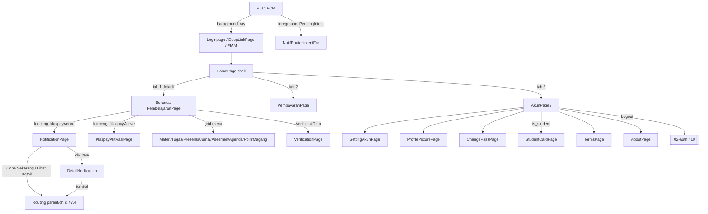
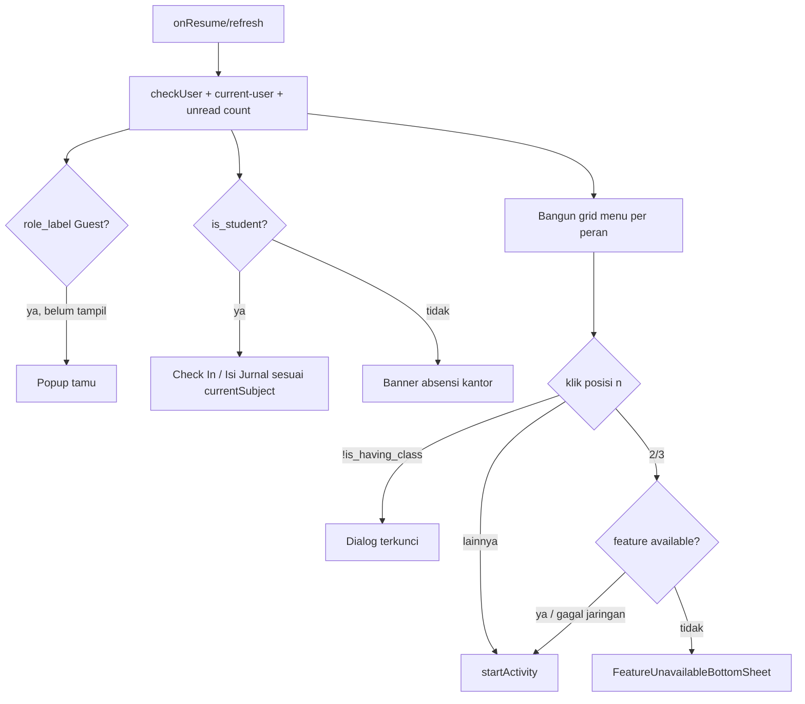

# 03 — Home Shell, Beranda, Akun, Notifikasi, Push FCM, Deep Link & Perilaku Global

Dokumen ini adalah spesifikasi perilaku untuk semua yang terjadi **setelah login**: shell `HomePage`
(bottom navigation 3 tab, drawer, dialog global, izin notifikasi, cek jam otomatis, topik FCM), halaman
**Beranda** (`PembelajaranPage`, termasuk tabel lengkap menu → tujuan → syarat tampil), tab **Akun** beserta
seluruh sub-layarnya (profil, foto profil, pengaturan profil, kontak, perangkat, ubah password, kartu
pelajar, tentang, kebijakan), **notifikasi in-app** (list + detail + routing `page.parent/child`), **push FCM**
(`NotifService`, `NotifRouter`, channel, topik, foreground vs background, chat direct reply), **deep link**, dan
**perilaku global** semua layar (`BasePage`, `BaseFragment`, `PageDialogFragment`, FIAM, `errorui`, feature gate,
in-app update/review). Alur login, dialog keamanan `HomeDialog` (email/password default), `SessionGuard`,
dan prosedur logout **sudah didokumentasikan di `02-auth-login-sesi.md`** — di sini hanya dirujuk.
Isi tab Pembayaran/Klaspay, Presensi, Materi, Tugas, AKM, Poin, Magang, Agenda Mingguan, feed/sosmed
didokumentasikan di dokumen fiturnya masing-masing; dokumen ini hanya mendefinisikan **titik masuknya**.

Konvensi rujukan: `@/` = `app/src/main/java/id/diskola/app/`, `res/` = `app/src/main/res/` (relatif
dari root `android-portal`). Teks UI dikutip persis (termasuk typo aslinya).

## Daftar isi
1. [Peta layar & navigasi global](#1-peta-layar--navigasi-global)
2. [Shell `HomePage`](#2-shell-homepage)
3. [Beranda (`PembelajaranPage`)](#3-beranda-pembelajaranpage)
4. [Tab Pembayaran (titik masuk saja)](#4-tab-pembayaran-titik-masuk-saja)
5. [Tab Akun (`AkunPage2`)](#5-tab-akun-akunpage2)
6. [Sub-layar Akun](#6-sub-layar-akun)
7. [Notifikasi in-app (`NotificationPage`, `DetailNotification`)](#7-notifikasi-in-app)
8. [Push FCM (`NotifService`, `NotifRouter`)](#8-push-fcm)
9. [Deep link (`DeepLinkPage`)](#9-deep-link-deeplinkpage)
10. [Perilaku global semua layar](#10-perilaku-global-semua-layar)
11. [Kontrak API](#11-kontrak-api)
12. [Data lokal](#12-data-lokal)
13. [Catatan migrasi Compose](#13-catatan-migrasi-compose)
14. [❓ Keputusan yang perlu dikonfirmasi](#14--keputusan-yang-perlu-dikonfirmasi)
15. [Selisih dengan dokumen lama](#15-selisih-dengan-dokumen-lama)
16. [Checklist paritas](#16-checklist-paritas)

---

## 1. Peta layar & navigasi global

| Layar | File | Layout | Jenis | Dibuka dari |
|---|---|---|---|---|
| Shell Home | `@/pages/home/HomePage.kt` | `res/layout/home_page.xml` (+ `home_menu_layout.xml` drawer) | Activity (`Privatepage`) | `Loginpage.goNext`, `DeepLinkPage.goNext`, `NotifRouter` default, FIAM |
| Beranda (tab 1) | `@/pages/pembelajaran/PembelajaranPage.kt` | `pembelajaran_page.xml`, item `pembelajaran_menu_item.xml`, banner `pembelajaran_attendance_banner.xml` | Fragment (`BaseFragment`) di `main_nav` | start destination |
| Pembayaran (tab 2) | `@/pages/pembayaran/PembayaranPage.kt` | `pembayaran_page.xml` | Fragment | bottom nav, extra `bannerData=ppob` |
| Akun (tab 3) | `@/pages/akun/AkunPage2.kt` | `akun_page_2.xml` | Fragment | bottom nav |
| Pengaturan Profil | `@/pages/akun/SettingAkunPage.kt` | `setting_akun_page.xml` | Activity | Akun, drawer |
| Kontak & Email | `@/pages/akun/SettingContactPage.kt` | `setting_contact_page.xml` | Activity | `KlaspayAktivasiAkun` (tombol di Akun/drawer disembunyikan) |
| Foto Profil (+crop uCrop) | `@/pages/akun/ProfilePicturePage.kt` | `profile_picture_page.xml` | Activity | avatar di Akun, `ProfilePage` |
| Profil publik (+3 tab) | `@/pages/akun/ProfilePage.kt`, `ProfilePostPage`, `ProfileMediaPage`, `ProfileEbookPage` | `profile_page.xml`, nav `profile_nav.xml` | Activity + Fragment | feed/komentar/like/jelajah (sosmed), notif `SETTING/PROFILE` |
| Perangkat Terhubung | `@/pages/akun/DevicesPage.kt` | `devices_page.xml`, `device_item.xml` | Activity | **hanya drawer (tidak terjangkau, §2.5)** |
| Ubah Password | `@/pages/changepass/ChangePassPage.kt` + `ChangePassForm`, `ChangePassSuccess` | `change_pass_page.xml`, nav `change_pass_nav.xml` | Activity + 2 Fragment | Akun, drawer, notif `SETTING/PASSWORD`, FCM `account-profile`, notifikasi lokal login/verifikasi |
| Kartu Pelajar | `@/pages/studentcard/StudentCardPage.kt` | `student_card_page.xml` | Activity | Akun (siswa), drawer, notif `SETTING/CARD` |
| Tentang Kami | `@/pages/AboutPage.kt` | `about_page.xml` | Activity | Akun, drawer |
| Kebijakan & Privasi | `@/pages/TermsPage.kt` | `checkout_result_page.xml` (dipakai ulang) | Activity (WebView) | Akun, drawer, notif `SETTING/POLICY` |
| Notifikasi (list) | `@/pages/notification/NotificationPage.kt` | `notification_page.xml`, `item_notification.xml` | Activity | lonceng Beranda |
| Detail Notifikasi | `@/pages/notification/DetailNotification.kt` | `detail_notification.xml` | Activity (**`AppCompatActivity`, bukan BasePage**) | item list, FCM `NOTIFICATION-USER` |
| Deep link | `@/pages/DeepLinkPage.kt` | `deep_link_page.xml` | Activity (`PublicPage`) | URL https (§9) |
| Fitur tidak tersedia | `@/feature/FeatureUnavailableBottomSheet.kt` | `bottom_sheet_feature_unavailable.xml` | BottomSheet | Presensi/Jurnal (§10.6) |

---

## 2. Shell `HomePage`

### 2.1 Ringkasan & titik masuk
Container utama setelah login untuk **semua peran** (siswa, guru, tamu). `HomePage : Privatepage`
(`@/pages/home/HomePage.kt:64`). Dibuka oleh `Loginpage.goNext()` (extra opsional `bannerData`, lihat
02-auth §2.4), `DeepLinkPage.goNext()`, `NotifRouter` (menu tak dikenal), `BasePage.goNext2()` (klik FIAM),
dan tombol back custom `NotificationPage` (§7.2). Tidak ada argumen wajib.

Extra yang dibaca: `bannerData` — jika `"ppob"` langsung navigate ke tab Pembayaran
(`HomePage.kt:237`). ⚠️ Item bottom nav yang ter-highlight tetap "Pembelajaran" (tidak di-update).

### 2.2 Struktur UI
`DrawerLayout` → `RelativeLayout` berisi `NavHostFragment` (`main_nav`) di atas `BottomNavigationView`
(`res/layout/home_page.xml:6-58`).

**Bottom navigation** (`res/menu/main_bot_menu.xml:19-46`, `home_page.xml:28-38`):

| Urutan | id | Label (title) | Ikon | Destinasi `main_nav` | Fragment |
|---|---|---|---|---|---|
| 1 | `menu_pembelajaran` | `"Pembelajaran"` | `@drawable/ic_pembelajaran` | `pembelajaranPage` (start) | `pages.pembelajaran.PembelajaranPage` |
| 2 | `menu_pembayaran` | `"Pembayaran"` | `@drawable/ic_pembayaran` | `pembayaranPage` | `pages.pembayaran.PembayaranPage` |
| 3 | `menu_akun` | `"Akun"` | `@drawable/ic_user` → diganti **foto profil bulat** | `accountPage` | `pages.akun.AkunPage2` |

- `labelVisibilityMode="unlabeled"` → **label tidak ditampilkan, ikon saja**; ukuran ikon `_24sdp`, tinggi bar
  `?android:actionBarSize`; warna ikon/teks `@color/main_bot_menu_color` (checked `colorPrimary #08A497`,
  lainnya `@color/gray`); ripple `colorPrimary`.
- Tab Jelajah, Sekolah (feed), Toko ter-comment di menu & nav graph (`main_nav.xml:8-24,54-62`) → **tidak ada**.
- Klik item (`HomePage.kt:243-260`): `navController.popBackStack()` lalu `navigate(action_global_…)` → back
  stack hanya berisi satu tab; setiap pindah tab Fragment **dibuat ulang** (state hilang, data di-fetch ulang).
  Tidak ada `OnItemReselectedListener`, sehingga tap tab yang sedang aktif juga memicu listener → tab di-recreate
  (efek "refresh"). Setelah navigate: status bar `colorPrimaryDark #026068`, ikon status bar terang.
- Ikon tab Akun (hanya **API ≥ 29**, `HomePage.kt:348-373`): observe `ProfileViewModel.myProfilePicture`
  (awal = `user.user_avatar_image` dari pref), Glide `circleCrop`, ukuran `_24sdp`, `iconTintBlendMode = DST`
  (tidak di-tint). API < 29 → ikon `ic_user` biasa.
- `setBottomNavVisibility(visible)` (`HomePage.kt:494-496`) hanya dipakai `SekolahPage` (tidak ada di graph) → mati.

**Toolbar**: tidak ada toolbar di shell; tiap tab punya header sendiri.

**Badge**: tidak ada badge di bottom nav. Badge notifikasi ada di Beranda (§3.3).

**Zoom gambar global**: `dispatchTouchEvent` diteruskan ke `MyImageZoom` (pinch-zoom gambar)
(`HomePage.kt:513-516`).

### 2.3 Urutan `onCreate` / `onResume`
1. `init { launchWhenCreated }` — jika `klaspayActive`: `GET payment/wallet` → pref `klaspay_id`
   (`wallet_id`), `isToppers`, `toppersStatus`; penanganan 500/401 → lihat **02-auth §8.1**
   (`HomePage.kt:99-179`).
2. Status bar `colorPrimaryDark`, light-status-bar = false (`HomePage.kt:217-218`).
3. Subscribe/unsubscribe topik FCM (§8.6) (`HomePage.kt:222-235`).
4. `bannerData == "ppob"` → tab Pembayaran.
5. Pasang listener bottom nav & tombol drawer.
6. `SosmedViewModel.errorString` → **toast** (mis. pesan gagal `check-account` dari Beranda; offline →
   `"Terjadi gangguan pada koneksi internet Anda, silahkan ulangi beberapa saat lagi"`) (`HomePage.kt:375`).
7. **Android 13+** → minta izin `POST_NOTIFICATIONS` (§2.4).
8. Daftarkan listener SharedPreferences untuk `default_pass`, `klaspayActive`, `is_email_verified`,
   `is_email_verifying` → `HomeDialog.showSecurityDialogsIfNeeded` (detail dialog: **02-auth §8.2**),
   lalu panggil sekali (`HomePage.kt:73-86,381-382,390-399`). Karena Beranda menulis ulang pref itu setiap
   resume (`checkUser`), dialog keamanan praktis **dievaluasi ulang setiap kali Beranda tampil** (tidak
   menumpuk: dicek via tag fragment).
9. `onResume` → **cek tanggal & zona waktu otomatis** (§2.4).

### 2.4 Dialog/gerbang global di Home

| Gerbang | Kondisi tampil | UI (teks persis) | Aksi | Rujukan |
|---|---|---|---|---|
| Tanggal & waktu otomatis | Setiap `onResume` jika `Settings.System.AUTO_TIME != 1` **atau** `AUTO_TIME_ZONE != 1` | Layout `presensi_izin_lokasi_dialog.xml` dengan judul diganti `"Peringatan"`, pesan `"Harap atur tanggal dan waktu ponsel ke \"Otomatis\""`, tombol `"Buka Pengaturan"` & `"Jangan Ubah"`; background `rounded_white`; **tidak bisa di-cancel** | `"Buka Pengaturan"` → tutup + `Settings.ACTION_DATE_SETTINGS`; `"Jangan Ubah"` → `finish()` HomePage (aplikasi tertutup) | `HomePage.kt:181-212`, `@/utils/DateUtil.kt:13-19` |
| Izin notifikasi (API 33+) | Setiap `onCreate` HomePage | Dexter meminta `POST_NOTIFICATIONS`. Jika ditolak → `AlertDialog` (`DialogTheme`) pesan `"Beberapa izin aplikasi diperlukan"`, satu tombol `"Settings"`, **non-cancelable** | `"Settings"` → `ACTION_APPLICATION_DETAILS_SETTINGS`; saat kembali → `dexter.check()` lagi → dialog muncul lagi bila masih ditolak (izin **wajib**, ❓ Q6). Error Dexter → toast nama error | `HomePage.kt:377-379,401-441` |
| Dialog keamanan email/password | `!is_email_verified` / `is_email_verifying` / `default_pass` | lihat 02-auth §8.2 | — | `@/pages/home/dialogs/HomeDialog.kt:55-97` |
| Klaspay wallet 500/401 | `klaspayActive` & wallet gagal | lihat 02-auth §8.1 | — | `HomePage.kt:119-176` |

`SetUsernameDialog` (`@/pages/home/dialogs/username/SetUsernameDialog.kt`) — judul `"Buat Username"`,
satu-satunya pemanggil (`CreatePostPage.kt:211`) ter-comment → **dead code**, tidak perlu dibangun.

### 2.5 Drawer kanan (`home_menu_layout.xml`)
Lebar = 70% lebar layar (`screen_x` di-cache ke pref), scrim transparan, konten bergeser saat drawer digeser
(`HomePage.kt:341-346,518-540`). **Drawer dikunci `LOCK_MODE_LOCKED_CLOSED` dan tidak ada kode yang
membukanya** (satu-satunya pemicu di toolbar `AkunPage2` ter-comment, `AkunPage2.kt:126-132`) → drawer
**tidak terjangkau pengguna**. Isinya (untuk referensi; mirip menu tab Akun):
`"Pengaturan Profil"` + badge merah `"Email belum terverifikasi"` (jika `!isEmailVerified`),
`"Kontak & Email"` (GONE), `"Ubah Password"`, `"Kartu Pelajar"` (hanya `is_student`), `"Kebijakan & Privasi"`,
`"Tentang Diskola"`, `"Perangkat Terhubung"` → `DevicesPage`, `"Logout"` (alur 02-auth §10.1), versi app
(`HomePage.kt:262-339`, `res/layout/home_menu_layout.xml:34-268`). ❓ Q1: bangun ulang atau buang.

### 2.6 Back & hasil Activity
- `onBackPressed` (`HomePage.kt:498-504`): `super.onBackPressed()` (tab tidak ditumpuk → Activity selesai)
  lalu `finishAffinity()` → **back di tab mana pun keluar aplikasi**; tidak kembali ke tab Pembelajaran.
- `onActivityResult(320, OK)` → `profileVm.myUsername = data["username"]` (`HomePage.kt:506-511`).
- `verifyEmail()` & `googleSignInResult` di HomePage tidak pernah di-`launch` (dead, `HomePage.kt:444-492`).

---

## 3. Beranda (`PembelajaranPage`)

### 3.1 Ringkasan
Halaman paling sering dilihat; start destination tab 1. Memuat header sekolah, lonceng notifikasi (badge),
kartu profil + kelas/kelas berlangsung, tombol presensi/jurnal siswa, tombol verifikasi data (tamu/belum
berkelas), banner absensi kantor (non-siswa), dan grid menu fitur. **Semua menu hardcoded di app** — tidak ada
menu dari server; satu-satunya kontrol server adalah feature gate `check-feature-availability` untuk Presensi &
Jurnal (§10.6). Flag yang dipakai semuanya dari SharedPreferences, di-refresh oleh `SosmedViewModel.checkUser()`
setiap resume (`@/pages/sekolah/SosmedViewModel.kt:276-361`; flag lain seperti `onklas_pro`, `has_store`,
`is_librarian` **tidak** dipakai di Home).

Flag peran hasil `checkUser` (ringkas; detail 02-auth §9):

| Kasus server | `is_student` | `is_teacher` | `is_having_class` | `has_student_class` | `role_label` | `class_id` |
|---|---|---|---|---|---|---|
| `rule.is_student` | true | *(tidak diubah)* | `student_class.id > 0` | `student_class.id > 0` | `"Student"` | `class_room.id` |
| `rule.is_teacher` | *(tidak diubah)* | true | **true** | *(tidak diubah)* | `"Teacher"` | *(tidak diubah)* |
| lainnya (tamu) | false | false | false | *(tidak diubah)* | `"Guest"` | *(tidak diubah)* |

⚠️ Cabang siswa tidak me-reset `is_teacher` dan cabang guru tidak me-reset `is_student` (❓ Q4).

### 3.2 Siklus data (`onResume` → `loadData()`, `PembelajaranPage.kt:78-82,108-272`)
Dipanggil setiap `onResume` dan tombol refresh (`btn_refresh`, ikon `ic_refresh`). Berurutan:
1. `PembelajaranVm.fetchUnreadNotificationsCount()` — hanya jika `klaspayActive`: `GET payment/wallet` →
   pakai `data.user_id` sebagai `wallet_id` → `GET mobile/notification/summary?wallet_id=` →
   `count_unread` (gagal → 0; gagal wallet → badge tidak berubah) (`@/pages/pembelajaran/PembelajaranVm.kt:49-75`).
2. `checkUser()` → `POST mobile/app/authentication/check-account` (memperbarui semua flag, `user`, `school`,
   `currentSubject`, `klaspayActive`, `is_active`).
3. `verifyCurrentUserSession()` → `GET …/current-user` (02-auth §9).
4. Popup tamu (§3.6), atur tombol kelas/verifikasi (§3.4), banner absensi (§3.5), bangun grid menu (§3.7),
   teks kelas.

Observer sekali pasang (`onActivityCreated`, `PembelajaranPage.kt:274-534`): `isActive == false` → prettyAlert
`"Peringatan"` / `"Akun anda tidak aktif, hubungi admin sekolah untuk aktivasi"` / `"Baik"` (gambar
`ic_config_account`, tanpa tombol batal) → logout (`PembelajaranPage.kt:283-298`); hasil QR (§3.4); badge (§3.3).

### 3.3 Header & lonceng (`res/layout/pembelajaran_page.xml:30-105`)
- Latar `img_bg_bayar`; logo sekolah (`school.image`), nama sekolah (`school.name`, teks putih).
- Lonceng (`btn_notification`, ikon `@drawable/notification`) + badge merah `circle_red`: tampil jika
  `count > 0`; teks `count` atau `"99+"` jika `count >= 100` (`PembelajaranPage.kt:84-93`).
- Klik lonceng (`PembelajaranPage.kt:343-357`):
  - `klaspayActive == true` → `NotificationPage` dengan extra `summary_count: Int` = nilai badge.
  - selain itu → toast `"Silahkan aktivasi wallet terlebih dahulu untuk mengunakan fitur notifikasi"` +
    buka `KlaspayAktivasiPage`. (Notifikasi terikat wallet Klaspay.)
- Error `PembelajaranVm.errorMessage` → toast (tidak pernah diisi saat ini).

### 3.4 Kartu profil & kelas (`pembelajaran_page.xml:110-345`)
Elemen atas ke bawah: tombol refresh, avatar bulat (`user.user_avatar_image`, fallback logo sekolah), nama
(`user.name`), sub-judul `title_class`, banner absensi (non-siswa), judul `"Kelas Berlangsung :"`, kartu kelas
berlangsung (ikon mapel fallback logo sekolah; nama mapel atau `"Tidak terdapat jadwal"`; jam
`"{plot_start_at} - {plot_end_at}"` hanya jika `plot_start_at` tidak kosong), tombol verifikasi, teks
`"Anda Belum Terdaftar di Kelas Manapun,\nSilakan Hubungi Admin!!"`, tombol `"Check In"`, tombol `"Isi Jurnal"`.
`btn_notif` `"Pemberitahuan Baru"`, `tab_ads` `"Edutainment"` dan carousel `rv_ads` (gambar lokal
`onklas_edu1..8`) **selalu GONE** (layout `visibility="gone"`, tidak pernah diubah).

**Sub-judul** (`PembelajaranPage.kt:262-268`): `is_teacher` → email user; lainnya → `student.student_class.class_room.name`
atau `"Belum memiliki kelas"` jika kosong (catatan: `checkUser` mengisi nama kosong dengan `"Tidak memiliki kelas"`).

**Tombol siswa "Check In" (`btn_attend`) / "Isi Jurnal" (`btn_add`)** (`PembelajaranPage.kt:129-155`), berdasar
`currentSubject` dari `check-account`:

| `is_student && is_having_class` | `currentSubject.id` | `attendance_id` | `status` | Check In | Isi Jurnal |
|---|---|---|---|---|---|
| false | — | — | — | GONE | GONE |
| true | `== 0` | — | — | GONE | GONE |
| true | `!= 0` | `!= null` | kosong/null | **VISIBLE** | GONE |
| true | `!= 0` | `!= null` | terisi | GONE | GONE |
| true | `!= 0` | `null` | — | GONE | **VISIBLE** |

(Default model `attendance_id = 0` bila field tidak dikirim → dianggap "ada attendance", `@/pages/login/LoginModels.kt:100-112`.)

- `"Isi Jurnal"` → `PresensiJurnalKelasPage` extra `ID_PLOT = currentSubject.id` (`PembelajaranPage.kt:387-391`).
- `"Check In"` siswa (`PembelajaranPage.kt:394-440`): hitung `isWithinSchedule` (jam sekarang `HH:mm` ≥ start dan
  < end), `isPresent = attendance_id != null`, `hasStatus`. Opsi: manual jika `(!hasStatus && isPresent)` atau
  `(isWithinSchedule && !isPresent)`; QR jika `(hasStatus && !isPresent && isWithinSchedule)` atau
  `(isWithinSchedule && !isPresent)`. Tidak ada opsi → toast `"Anda belum bisa melakukan presensi saat ini."`.
  Ada opsi → dialog `dialog_confirm_subject` (cancelable): judul `"Pilih Metode Presensi"`, pesan
  `"Silakan pilih metode yang ingin \n digunakan untuk presensi."`, tombol `"Verifikasi Jurnal"` (manual →
  bottom sheet `PresensiMasukKelasPage(attendance_id)`, callback `getSchedule()`) dan `"Scan QR"` (hanya yang
  tersedia yang tampil) (`PembelajaranPage.kt:549-598`).
- Scan QR (`PembelajaranPage.kt:536-547,818-865`): ZXing `IntentIntegrator`, format QR, prompt `"Scan QR Code"`,
  kamera belakang, beep, portrait (`PortraitCaptureActivity`). Isi QR di-split `_`; butuh ≥ 12 bagian; ambil
  indeks 2=`time_plot_id`, 4=`subject_id`, 6=`class_id`, 8=`teacher_id`, 10=`schedule_id` (Int) →
  `POST mobile/attendance/student/learning/qr`. QR tidak valid → hanya log (tanpa pesan UI). Hasil →
  prettyAlert sukses `"Presensi Berhasil"` / `"Selamat datang dan selamat belajar.\nBelajarlah dengan giat untuk mencapai masa depanmu!"` / `"Tutup"`,
  atau gagal `"Presensi Gagal"` / pesan server (fallback `"Presensi gagal."`) / `"Tutup"` (`PembelajaranPage.kt:300-327`).
  Detail bisnis presensi → dokumen Presensi.
- Cabang guru untuk `btn_attend`/`btn_add` (`PembelajaranPage.kt:442-493`, check-in dengan lokasi, dialog
  `"Absensi berhasil"`) **tidak pernah terlihat** karena kedua tombol selalu GONE untuk non-siswa (§3.5).

**Tombol verifikasi data (`btn_verify`) & kartu kelas** (`PembelajaranPage.kt:156-208`), berdasar
`approvalProgress = (userProgress.status, userProgress.message)`:

| Status progres | Kondisi tambahan | `btn_verify` | Kartu kelas | Lainnya |
|---|---|---|---|---|
| `approved` | — | GONE | VISIBLE | — |
| `""` (CLEAR) | `role_label == Guest` && `is_having_class` | VISIBLE, enabled, teks `"Verifikasi Data"`, tint `colorPrimary` | GONE | `title_Verif` GONE |
| `""` | `is_student && !has_student_class` | GONE | GONE | judul diganti `"Pemberitahuan"`, `title_Verif` VISIBLE |
| `""` | `!is_having_class` | VISIBLE, `"Verifikasi Data"` | GONE | — |
| `""` | lainnya | GONE | VISIBLE | — |
| `in_review` / `rejected` | `!is_having_class` | VISIBLE, **disabled**, teks = `userProgress.message`, tint abu (`rejected` → merah) | GONE | — |
| lainnya | — | GONE | VISIBLE | — |

Klik `"Verifikasi Data"` (`PembelajaranPage.kt:362-380`): prettyAlert (gambar gagal) `"VERIFIKASI DATA PENGGUNA"` /
`"Apakah NISN/NIS/NIK anda telah terdaftar disekolah anda?"`, `"Sudah"` → `VerificationPage`;
`"Belum"` → `VerificationPage` extra `requestApproval=true`.

### 3.5 Banner absensi kantor (non-siswa) (`PembelajaranPage.kt:867-978`)
- Siswa: banner GONE, judul `"Kelas Berlangsung :"` VISIBLE.
- Non-siswa (guru/tamu): judul, kartu kelas, Check In & Isi Jurnal **selalu disembunyikan**. Banner hanya
  diproses jika kartu kelas sebelumnya VISIBLE (hasil tabel §3.4); banner INVISIBLE selama memuat
  `GET mobile/attendance/setting/me/today` dan `GET mobile/attendance/staff/check` secara paralel, lalu VISIBLE;
  exception → GONE.
- Status dari `PresensiViewModel.resolveAttendanceBannerState` (`@/pages/presensi/PresensiViewModel.kt:948-1057`):

| State | Kondisi | Judul | Info card | CTA |
|---|---|---|---|---|
| `NO_AGENDA` | `today == null` / status kosong / `no_agenda` | `"Jadwal absensi belum diatur"` | `"Hubungi admin sekolah untuk mengatur jam atau kalender absensi."` | — |
| `HOLIDAY` | status `holiday` | `"Hari libur"` | nama event `day_off` pertama atau `"Libur"` | — |
| `OUTSIDE_HOURS` | `check == null`, atau tidak diizinkan & bukan "lengkap" | `"Di luar jam absensi"` | `"Absensi hanya bisa dilakukan pada jam yang ditentukan."` | — |
| `CHECK_IN` | `allow_attendance && type == checkin` | `"Wajib absen masuk sekarang"` | — | `"Presensi"` (tint `attendance_cta_in`) |
| `CHECK_OUT` | `allow_attendance && type != checkin` | `"Wajib absen pulang sekarang"` | — | `"Presensi"` (tint `attendance_cta_out`) |
| `COMPLETE` | tidak diizinkan & (`type` kosong atau teks respons berisi "lengkap"/"selesai"/"sudah absen"/"sudah melakukan") | `"Tidak perlu absen saat ini"` | (kosong → card tersembunyi) | — |

  Baris tambahan: jam kerja `"Jam kerja hari ini · HH:mm – HH:mm"` (start dari `schedule.start_at` → `jam_masuk`
  → event; end dari `schedule.end_at` → event), agenda `"Agenda · {nama event}"` (bukan saat libur), sumber
  `"Dari Kalender sekolah"` / `"Dari Pengaturan jam"` / `"Dari {source}"` (hanya CHECK_IN/OUT). Ikon per state:
  `ic_attendance_check_in`, `…check_out`, `…clock_off`, `…check`, `…calendar_off` (NO_AGENDA & HOLIDAY).
  CTA → `launchFeature(PRESENSI, PresensiPage)` (`PresensiViewModel.kt:1059-1100`).
- Tamu: kartu kelas GONE (tabel §3.4) → banner GONE.

### 3.6 Popup tamu
Jika `role_label == "Guest"` (case-insensitive), sekali per instance Fragment (`hasShownGuestInfo`): prettyAlert
gambar `undraw_guestsvg`, `"Anda Masuk sebagai Tamu"` / `"Beberapa fitur mungkin terbatas. Lakukan verifikasi data Jika Anda ingin menjadi guru atau siswa, untuk medapatkan akses penuh"` /
`"Oke, Terimakasi"`, tanpa tombol batal (`PembelajaranPage.kt:115-127`). Karena Fragment dibuat ulang tiap
pindah tab, popup muncul lagi setiap kembali ke tab Beranda.

### 3.7 Grid menu — tabel lengkap Menu → tujuan → syarat tampil
Grid 3 kolom (`rv_menu`, `GridSpacingItemDecoration(3, _8sdp)`). Item: ikon, label (bold `_11ssp`), badge merah
angka (`"9+"` jika > 9, hanya jika tidak terkunci & bukan soon), ikon gembok `ic_lock` (jika terkunci), label
`"SOON"` (praktis tidak pernah tampil: hanya untuk item yang dihapus bagi non-siswa)
(`@/pages/pembelajaran/MenuAdapter.kt:12-52`).

**Pembentukan daftar** (`PembelajaranPage.kt:212-259`): daftar dasar
`[Materi, Tugas, Presensi, Jurnal, Asesmen, Poin, Magang]`, semua `locked = !is_having_class`. Jika
`!is_student` → hapus Magang lalu Asesmen. Jika `is_teacher` → sisipkan `"Agenda Mingguan"` di indeks 4 dan
isi badge dari `GET mobile/attendance/staff/agendas/today` (`agenda_enabled ? summary.missing : 0`).

**Hasil per peran:**

| Peran (pref) | Urutan menu yang tampil |
|---|---|
| Siswa (`is_student`) | Materi, Tugas, Presensi, Jurnal, Asesmen, Poin, Magang |
| Guru (`is_teacher`, bukan siswa) | Materi, Tugas, Presensi, Jurnal, Agenda Mingguan, Poin |
| Tamu / lainnya | Materi, Tugas, Presensi, Jurnal, Poin (semua terkunci karena `is_having_class=false`) |

**Aksi klik — ditentukan oleh POSISI, bukan label** (`PembelajaranPage.kt:601-767`). Jika
`!is_having_class` → semua posisi 0–6 membuka dialog terkunci:

| Posisi | Label (siswa / guru / tamu) | Ikon | Tujuan | Extras | Syarat tambahan |
|---|---|---|---|---|---|
| 0 | Materi | `ic_matery` | siswa → `TheoryPage`; lainnya → `TheoryTeacherPage` | — | `is_having_class` |
| 1 | Tugas | `ic_tasks` | siswa → `HomeWorkPage`; lainnya → `HomeworkTeacherPage` | — | `is_having_class` |
| 2 | Presensi | `ic_presensi` | `PresensiPage` via **feature gate** `presensi` | — | `is_having_class` + server available |
| 3 | Jurnal | `ic_journal` | `JurnalPage` via **feature gate** `jurnal-kbm` | — | `is_having_class` + server available |
| 4 | Asesmen / Agenda Mingguan / Poin | `ic_test` / `ic_agenda` / `ic_council` | siswa → `AkmPage`; guru → `AgendaMingguanPage`; lainnya → `PoinPage` | — (AkmPage **tanpa** `isSchoolScope`) | `is_having_class` |
| 5 | Poin / Poin / — | `ic_council` | siswa → `PoinStudentPage`; lainnya → `PoinPage` | — | `is_having_class` |
| 6 | Magang / — / — | `ic_announcement` | `MagangPage` | — | `is_having_class` |
| ≥ 7 | — | — | dialog "dalam pengembangan" | — | — |

⚠️ Jika pref basi membuat `is_student && is_teacher` sama-sama true, daftar berisi 8 item dan label tidak cocok
dengan tujuan (posisi 4 "Agenda Mingguan" → AkmPage, dst.) — ❓ Q4.

**Dialog:**
- Terkunci (`locked_menu_dialog.xml`, `PembelajaranPage.kt:778-785`): gambar `ic_screening_class`,
  `"Fitur ini terkunci"`, `"Oops, nampaknya anda belum terdaftar di kelas manapun. Hubungi admin sekolah anda untuk mengakses fitur ini"`, `"Ok Deh"`.
- Dalam pengembangan (`coming_soon_dialog.xml`, `PembelajaranPage.kt:769-776`): gambar `img_development`,
  `"Fitur dalam pengembangan"`, `"Menu ini sedang dalam proses pembangunan, ditunggu updatenya yah..."`, `"Ok Deh"`.

### 3.8 Perilaku perangkat, bisnis & edge case
- Kamera untuk QR (ZXing). Lokasi hanya di cabang guru yang mati.
- Tidak ada pull-to-refresh; refresh via tombol.
- Loading: tidak ada indikator eksplisit di Beranda (`loadingAbsensi` tidak diikat ke view); feature gate
  menampilkan ProgressDialog `"Memeriksa ketersediaan fitur…"`.
- Offline: `check-account` gagal → toast pesan interceptor (dari HomePage); flag lama dari pref tetap dipakai.

---

## 4. Tab Pembayaran (titik masuk saja)
`PembayaranPage` (Fragment tab 2) — isi (wallet Klaspay, PPOB, SPP, QR bayar, dialog aktivasi, cek sekolah
terdaftar, dialog keamanan email/password via `HomeDialog`) didokumentasikan di dokumen Pembayaran/Klaspay.
Dari shell: dibuka via bottom nav atau `bannerData == "ppob"`. `PembayaranPage` juga memanggil
`verifyCurrentUserSession()` (02-auth §9).

---

## 5. Tab Akun (`AkunPage2`)

### 5.1 Ringkasan & titik masuk
Tab 3, semua peran. Fragment `AkunPage2 : BaseFragment` (`@/pages/akun/AkunPage2.kt:37`), layout
`res/layout/akun_page_2.xml`. Tidak ada argumen.

### 5.2 UI (atas ke bawah)
| Elemen | Isi | Rujukan |
|---|---|---|
| Avatar bulat (`img`, `_54sdp`) | `imgUrl ?? userData.data.user_avatar_image` (imgUrl = hasil ganti foto) | `akun_page_2.xml:58-66` |
| Baris nama (`@id/username`) | `userData.data.name` | `:69-83` |
| Baris NIS (`@id/name`) | `nis_nik` → `nisn_nik` → `"Belum memiliki NIS/NISN"` | `:86-97` |
| Chip peran (`tag`) | `userData.rule_label` atau `"-"` | `:100-116` |
| Kelas (`kelas`) | hanya `rule.is_student`; nama kelas atau `"Belum memiliki kelas"` | `:119-131` |
| `"Pengaturan Profil"` (ikon `ic_account_setting`) + badge merah `"Email belum terverifikasi"` **atau** badge `"Email terverifikasi"` | badge dikontrol observer `isEmailVerified` | `:159-221`, `AkunPage2.kt:92-101` |
| `"Kontak & Email"` | **selalu GONE** | `:227-245` |
| `"Ubah Password"` (`ic_change_pass`) | GONE jika NIS & NISN kosong | `:254-271`, `AkunPage2.kt:177-182` |
| `"Kartu Pelajar"` (`ic_student_card`) | hanya `is_student` | `:280-297`, `AkunPage2.kt:172-182` |
| `"Kebijakan & Privasi"` (`ic_terms`) | selalu | `:305-322` |
| `"Tentang Diskola"` (`ic_logo_notif`) | selalu | `:330-347` |
| `"Perangkat Terhubung"` | ter-comment (tidak ada) | `:355-372` |
| `"Logout"` (`ic_logout`) | selalu → 02-auth §10.1 | `:380-397`, `AkunPage2.kt:207-250` |
| Versi (`version`) | `BuildConfig.VERSION_NAME` (variabel `buildConfig` tidak di-set; nilai statis — belum terverifikasi tampil) | `:405-409` |

### 5.3 Data & siklus
- `onActivityCreated`: subscribe topik FCM (§8.6, `AkunPage2.kt:74-84`); `isActive != true` → **logout langsung**
  tanpa dialog (`:86-90`); `nisnNik` = `user.nisn_nik` atau `nis_nik` → `ProfileViewModel.getUserData()` =
  `POST check-account` → `userData` (mengisi layout, daftar `roles` = `data.roles[].name`) (`:111-124`,
  `@/pages/akun/ProfileViewModel.kt:79-85`).
- `onStart`: `checkUser()` (check-account **lagi**) → `verifyCurrentUserSession()` → `HomeDialog.showSecurityDialogsIfNeeded`
  (`AkunPage2.kt:344-362`). → 2× `check-account` per buka tab (fetch ganda).
- Aksi:
  - Avatar → `ProfilePicturePage` (`editable=true`, `path=user.user_avatar_image`), request 321, shared element
    `"profile"`; hasil OK → `myProfilePicture = data.data` (URI file) → avatar & ikon tab Akun berganti (`:134-149,286-294`).
  - `"Pengaturan Profil"` → `SettingAkunPage` extra `roles` = `List<String>.toString()` (mis. `"[Student]"`),
    request 320 (hasil tidak diproses Fragment) (`:151-157`).
  - `"Ubah Password"` → `ChangePassPage`; `"Kartu Pelajar"` → `StudentCardPage`; `"Kebijakan & Privasi"` →
    `TermsPage`; `"Tentang Diskola"` → `AboutPage`.
- `verifyEmail`/`googleSignInResult` di AkunPage2 tidak pernah di-launch (dead, `:296-341`).

---

## 6. Sub-layar Akun

### 6.1 Pengaturan Profil (`SettingAkunPage`)
**Titik masuk:** tab Akun / drawer; extra `roles: String?`. VM `SettingAkunViewmodel`
(`@/pages/akun/SettingAkunViewmodel.kt`), data awal dari pref `user` (`UserTable`).

**UI** (`res/layout/setting_akun_page.xml`): toolbar `"Pengaturan Profil"` + back; menu `"Simpan"`
(`menu_setting_akun.xml`, enabled hanya jika `hasChange()` = nama/username/email/telepon berbeda dari pref).
- `"NAMA"` + alert merah `"Harus diisi"` (jika kosong); baris `"Role :"` + label peran (⚠️ label memakai
  `tools:text="@{roles}"` → **selalu kosong**, ❓ Q9); input nama hint `"Ketik Nama lengkap"` **read-only**
  (`focusable=false`).
- `"Email Saya"` + tombol teks `"Edit Email"` (warna primary) / `"Batalkan"` (merah) saat `editEmail`;
  alert `"Harus diisi"`; input email (enabled hanya saat `editEmail`, hint `"Masukkan Email"`).
- Tombol outline `"Kirim verifikasi"` — tampil jika `!(isEmailVerified || isVerifying)`; label
  `"Belum Diverifikasi"` (jika `isVerifying`) / `"Terverifikasi"` (jika `isEmailVerified`). Saat email diubah dari
  nilai awal → ketiganya disembunyikan (`SettingAkunPage.kt:181-204`).
- `"NO TELEPON"` + input hint `"Masukkan Nomor Telepon"`, `inputType=phone` (bisa diedit bebas).

**Aksi** (`SettingAkunPage.kt:59-248`):
- `"Edit Email"`: jika email saat ini mengandung `"diskola-verified-"` (ignore case) → kunci field, set
  `isEmailVerified=true` lokal, prettyAlert gambar `verifed_email` `"Pemberitahuan"` /
  `"Email Anda sudah terverifikasi oleh Diskola dan tidak dapat diubah."` / `"Mengerti"`. Selain itu → Google
  Sign-In (signOut dulu, `requestEmail`) → email akun Google dimasukkan ke field & `editEmail=true`; email kosong →
  toast `"Gagal mendapatkan email"`; `ApiException` diam. **Email tidak bisa diketik manual; harus dari akun Google.**
- `"Batalkan"`: kembalikan email pref, kunci field.
- `"Kirim verifikasi"`: selalu prettyAlert `"Gagal"` / `"Mohon maaf, untuk saat ini belum dapat melakukan verifikasi email"` / `"Baik"` (fitur dimatikan).
- `"Simpan"`: loading `"Sedang mengupdate data"` → `PUT mobile/app/accounts/user/{user_uuid}/change-profile`
  body `{phone, email, username}` (**nama tidak dikirim**) → sukses: pref `user` diperbarui, toast
  `"Data berhasil diupdate"`, lalu popup (`dialog_absensi_berhasil.xml`, non-cancelable) gambar `undraw_email`,
  `"Data Berhasil Diubah"` / `"Selamat, Data anda berhasil diperbarui !!"` / `"Terimakasih"` → `setResult(OK)` +
  `finish`. Cabang `emailChanged() && sendEmail()` tidak pernah terpenuhi karena `userTable.email` sudah
  diperbarui sebelum dicek → `GET mobile/email/verify` **tidak pernah dipanggil** dari layar ini (❓ Q10).
  Gagal: jeda 100 ms → dialog `dialog_email_used.xml` `"PEMBERITAHUAN"` + pesan (`extractErrorMessage`: `message` →
  `error` → error field pertama → `localizedMessage`; fallback `"Email sudah digunakan"`) + `" Tutup "` → email
  dikembalikan (`SettingAkunViewmodel.kt:76-130`).
- Observer `isEmailVerified == true` → pref `is_email_verifying=false`.

### 6.2 Kontak & Email (`SettingContactPage`)
**Titik masuk:** hanya dari `KlaspayAktivasiAkun` (dialog `"Payment"` tombol `"Setting"` saat error `email`,
`@/pages/klaspay/aktivasi/KlaspayAktivasiAkun.kt:56-68`); tombol di Akun/drawer GONE. Memakai VM yang sama.
**UI** (`setting_contact_page.xml`): toolbar `"Kontak & Email"`; username (semua GONE); `"Email"` + toggle
`"edit"`/`"batal"`; input email (enabled saat edit); tombol `"Aktivasi"` (oranye, enabled) atau `"Terverifikasi"`
(putih, ikon `ic_check_green`, disabled) berdasar `isVerified` (= email sama dengan pref && pref `is_verified`);
`"No Telepon"` + toggle `"edit"`/`"batal"`; tombol `"simpan perubahan"`.
**Aksi** (`@/pages/akun/SettingContactPage.kt:36-108`):
- `"Aktivasi"` → ProgressDialog `"Mohon tunggu"` → `GET mobile/email/verify` → sukses dialog `"Perbarui Email"` /
  `"Permintaan perubahan telah dikirimkan, cek email yang baru didaftarkan untuk verifikasi"` / `"OK, Mengerti"`;
  gagal → toast pesan.
- `"simpan perubahan"` aktif jika email & telepon tidak kosong → loading `"Sedang mengupdate data"` →
  `PUT change-profile` → sukses toast `"Data berhasil diupdate"`, `setResult(OK, username=…)`, `finish`; gagal →
  toast `"Gagal mengupdate data, mohon ulangi beberapa saat lagi"` **dan** toast pesan error (dua toast).

### 6.3 Foto Profil (`ProfilePicturePage` + crop)
**Titik masuk:** avatar Akun (`editable=true`) atau avatar `ProfilePage` (`editable` = avatar yang dilihat sama
dengan avatar sendiri); extra `path: String`. Shared element `"profile"`.
**UI:** toolbar `"Foto Profil"` + back; gambar penuh (`imageUrl=@{image_path}`); menu `"Ubah"` (ikon edit,
hanya jika `editable`) & `"Simpan"` (`res/menu/menu_profile_picture.xml`).
**Aksi** (`@/pages/akun/ProfilePicturePage.kt:60-175`):
- `"Ubah"`: **siswa** → alert `"Informasi"` / `"Harap menghubungi admin sekolah untuk perubahan foto anda"`, tombol
  `"Tutup"` → tutup layar. **Non-siswa** → dialog `"Ambil gambar dari"` item `"Kamera"` / `"Galeri"`.
  - Kamera: jika izin belum ada → dialog `"Akses Kamera Diperlukan"` / `"Aplikasi ini membutuhkan akses ke kamera Anda untuk mengambil foto untuk profil, absensi, atau transaksi QR. Data ini hanya digunakan dalam aplikasi dan tidak akan dibagikan tanpa izin Anda."` /
    `"Setuju"` / `"Batal"` → Dexter CAMERA → ditolak toast `"Izin ditolak, fitur kamera tidak dapat digunakan"`;
    kamera `ACTION_IMAGE_CAPTURE` ke file `JPEG_{ts}_*.jpg` di `getExternalFilesDir(PICTURES)` via FileProvider
    `${applicationId}.provider` (`@/utils/IntentUtil.kt:201-261`).
  - Galeri: Photo Picker `PickVisualMedia(ImageOnly)`; fallback `GetContent("image/*")`.
  - Hasil → **uCrop**: output `cacheDir/{millis}.jpg`, JPEG kualitas 80, maks 640×640, rasio 1:1, overlay lingkaran,
    dimmed `#99FFFFFF`, grid & frame disembunyikan, toolbar putih judul `"Atur Gambar"`, kontrol aktif `colorPrimary`.
    Hasil crop → preview + `hasChange=true`.
- `"Simpan"` (jika ada perubahan) → loading `"menyimpan foto profil"` → `POST mobile/app/accounts/user/{user_uuid}/change-avatar`
  multipart `file` (`image/jpeg`) → pref `user.user_avatar_image = path file lokal` → `setResult(OK, data=uri)`
  → tutup dengan transisi. Gagal → toast `"gagal menyimpan gambar"` (`ProfilePicturePage.kt:114-127`,
  `@/utils/ApiWrapper.kt:164-175`).
- Back dengan perubahan & editable → `"Simpan perubahan?"` `"Ya"` (simpan) / `"tidak"` (keluar).

### 6.4 Profil publik (`ProfilePage` + tab)
**Titik masuk:** `ProfilePage.open(activity, nisn_nik, user_id, username)` dari feed/komentar/like/jelajah
(dokumen sosmed) dan notif `SETTING/PROFILE` (extra `child_id` diabaikan → profil sendiri).
**Perilaku** (`@/pages/akun/ProfilePage.kt:42-142`): toolbar `"Profil"`; `nisn_nik` (extra atau milik sendiri) →
ProgressDialog `"menampilkan profil"` → `POST check-account` dengan `nisn_nik`; `username` (tanpa `@`) →
`GET mobile/app/accounts/get-username/{username}` → nisn → check-account. Header: avatar, `"@{user_username}"`,
nama, `rule_label`, kelas (siswa). Pull-to-refresh aktif hanya saat AppBar ter-expand. 3 tab ikon (Post
`ic_create_post`, Media `ic_galery_*`, Ebook `ic_ebook_*`) dengan NavHost `profile_nav` (`ProfilePostPage` list
feed teks + like + `"Hapus Post"` / `"Anda yakin akan menghapus post?"` / `"Hapus"` / `"Batal"`, progress
`"menghapus post"`; `ProfileMediaPage` grid 3 kolom; `ProfileEbookPage` list ebook dengan tombol `"Lihat"` → PDF).
API: `GET mobile/app/accounts/user/{id}/feed-post|feed-image|feed-ebook` (paging 10). Detail feed → dokumen sosmed.
`PairingPage` (di `profile_nav`) tidak punya pemicu → **dead code**.

### 6.5 Perangkat Terhubung (`DevicesPage`)
**Terjangkau hanya via drawer (mati)** — ❓ Q1. Toolbar `"Device Terhubung"`, menu `"Logout Semua"`; list sesi
(`device_item.xml`: nama perangkat, `last_used_at`, tombol `"Logout Device"`), pull-to-refresh.
Data: Room `SessionData` (paging 10) + boundary callback `GET sessions?limit=10&take=10&skip=n`; refresh = hapus
tabel lalu fetch ulang. `"Logout Device"` → `"Anda yakin akan keluar dari device?"` `"Logout"`/`"Batal"` →
loading `"Mohon tunggu"` → `DELETE sessions/{id}` → hapus baris lokal. `"Logout Semua"` →
`"Anda yakin akan keluar dari semua device yang lain?"` → `DELETE sessions/others` → refresh. Error → toast
(`@/pages/akun/DevicesPage.kt:29-134`, `@/pages/akun/DeviceViewModel.kt:25-88`).

### 6.6 Ubah Password (`ChangePassPage`)
**Titik masuk:** Akun (`"Ubah Password"`), drawer, notif `SETTING/PASSWORD`, FCM `account-profile`, notifikasi
lokal "Ganti Password" dari login/verifikasi (dokumen 02). `onCreate` membatalkan notifikasi lokal id `4329`
(`@/pages/changepass/ChangePassPage.kt:14,23`).
**UI:** toolbar `"Ubah Password"`; `ChangePassForm`: teks `"Untuk keamanan akunmu mohon jangan beritahukan Password Anda kepada siapapun selain pemilik akun"`,
`"Password Lama"`, `"Password Baru"`, `"Konfirmasi Password Baru"` (semua hint `"Masukkan Password"`, toggle
lihat password), tombol `"simpan perubahan"` (aktif jika lama & baru terisi — konfirmasi tidak diwajibkan),
overlay `"Loading..."` saat proses.
**Validasi:** baru ≠ konfirmasi → toast `"Password baru tidak sesuai"`. (Tidak ada cek baru == lama di sini, beda
dengan dialog Home.)
**API:** `PUT mobile/app/accounts/user/{user_uuid}/change-password` `{old_password, new_password}` → pref
`default_pass=false` → `ChangePassSuccess`: `"Selamat passwordmu berhasil diperbarui, sekarang kamu bisa login dengan password baru"`,
tombol `"ok, kembali"` → tutup Activity. Gagal → dialog `"Perubahan Gagal"` + pesan + `"OK"` **dan** toast pesan
(observer ganda di Activity & Fragment) (`ChangePassForm.kt:39-60`, `ChangePassPage.kt:34`).

### 6.7 Kartu Pelajar (`StudentCardPage`)
Hanya siswa (tombol tampil jika `is_student`). **Tanpa panggilan API** — seluruh data dari pref `student`
& `user` (`@/pages/studentcard/StudentCardVM.kt:63-110`). Toolbar `"Kartu Pelajar"`, foto bulat
(`student.user.user_avatar_image` → `user.user_avatar_image`, placeholder `ic_baseline_account_circle_24`), nama,
kartu `"Data Pribadi"`: `"NIS"`, `"NISN"`, `"Nama Lengkap"`, `"Tempat, Tanggal Lahir"` (`"{tempat}, {tanggal}"`),
`"Jenis Kelamin"` (normalisasi `laki-laki/male/l` → `"Laki-laki"`, `perempuan/female/p` → `"Perempuan"`),
`"Angkatan"` (`student.class`), `"Alamat"`. Nilai kosong → `"-"`. `updateData()` (`POST mobile/app/accounts/user/student-card`)
tidak dipanggil (dead).

### 6.8 Tentang Kami (`AboutPage`) & Kebijakan (`TermsPage`)
- **AboutPage** (`@/pages/AboutPage.kt:18-57`, strings `about_*`): toolbar `"Tentang Kami"`, logo, `"Diskola"`,
  `"Versi Aplikasi: {VERSION_NAME}"`, `"Kontak Kami"` + paragraf helpdesk, baris `"Email"` `hello@diskola.id`
  (`mailto:`), `"Telepon"` `081779205008` (`ACTION_DIAL`), `"Ikuti Kami"` YouTube `https://www.youtube.com/@diskola`
  & Website `https://diskola.id` (Instagram ter-comment), `"Apa yang Baru"` 4 bullet statis. Tidak ada app
  pembuka → toast `"Tidak ada aplikasi yang dapat membuka tautan ini"`.
- **TermsPage** (`@/pages/TermsPage.kt:29-139`): toolbar `"Kebijakan & Privasi"`, WebView (JS on) memuat HTML
  `GET mobile/app/policy` → `data.content`; progress bar; `tel:` dibuka dialer; error →
  `"Perhatian"` / `"Gagal memuat halaman"` / `"Muat ulang"`; JS alert → dialog `"Perhatian"` / `"Ok"`.

---

## 7. Notifikasi in-app

### 7.1 Ringkasan & titik masuk
Kotak masuk notifikasi server per **wallet Klaspay** (semua peran yang wallet-nya aktif). Titik masuk: lonceng
Beranda (hanya jika `klaspayActive`, extra `summary_count`), FCM `NOTIFICATION-USER` → langsung `DetailNotification`.

### 7.2 `NotificationPage` (`@/pages/notification/NotificationPage.kt`)
**UI** (`notification_page.xml`, dalam `SwipeRefreshLayout`): header latar `img_bg_bayar`, tombol back
(`ic_back`), judul `"Notifikasi"`; filter chip `"Semua"` (awal terpilih: primary/putih) & `"Belum Dibaca"`
(border1/abu); list; footer `"Memuat data..."` saat paging; empty state gambar `ic_empty` + `"notifikasi tidak tersedia"`;
progress tengah saat load awal & list kosong.

**Item** (`item_notification.xml`, `AdapterNotification.kt:24-98`): ikon per `type` —
`"Announcement"` → `annaucement`, `"Message"` → `mail_notification`, `"Reminder"` → `remender`, lainnya →
`notification`; judul, pesan. Sudah dibaca → teks & ikon abu, tombol abu; belum → hitam & tombol primary.
Tombol per item: `page.child` kosong → panah `next_notif`; child ada & `child_id` kosong → `"Coba Sekarang"`;
child & `child_id` ada → `"Lihat Detail"`.

**Aksi:** klik item → tandai dibaca → `DetailNotification` extras `id`, `type`, `title`, `message`,
`image: ArrayList<String>`, `parent`, `child`, `child_id` (`:242-256`). Klik `"Coba Sekarang"` / `"Lihat Detail"` →
tandai dibaca → routing §7.4 (`:258-342`). Filter `"Belum Dibaca"` = `!is_read`. Tombol back header →
`HomePage` flag `CLEAR_TOP | NEW_TASK` + `finish` (HomePage dibuat ulang → tab kembali ke Beranda); back sistem =
`finish` biasa.

**Muat data** (`@/pages/notification/NotificationViewModel.kt`):
- Awal (`fetchAllNotifications(summaryCount)`, `:101-138`): jika Room kosong **atau** `summary_count > unread lokal`
  → API; selain itu tampilkan Room (urut `id` desc). API = `GET payment/wallet` (ambil `data.user_id`) →
  `GET mobile/notification?wallet_id=&page=1&limit=50` → simpan Room (REPLACE) → gabung & dedup. HTTP 500 →
  toast `"Server mengalami masalah. Silakan coba lagi nanti."` + empty state; error lain → Room.
- Paging (`:142-168`): scroll oleh drag sampai item terakhir-1 → halaman berikut (`hasMoreData = size >= 50`).
- Pull-to-refresh (`:282-326`): page=1 → wallet → list → pertahankan status baca lokal → **hapus tabel lalu
  simpan halaman 1** → coba halaman berikut. Error/kosong → empty state. (Indikator refresh berhenti seketika
  karena fungsi tidak `suspend`.)
- Tandai dibaca (`markAsRead`, `:244-275`): Room `is_read=1` (ambil detail API bila belum ada) → update list →
  `GET payment/wallet` → `POST mobile/notification/{id}` body `{wallet_id: user_id}`. Dipanggil 2–3× per klik
  (adapter + halaman) — cukup sekali di versi baru.

### 7.3 `DetailNotification` (`@/pages/notification/DetailNotification.kt`)
- Toolbar `"Notifikasi"` (ikon `ic_back_black`); klik → `NotificationPage` `CLEAR_TOP | SINGLE_TOP` + `finish`
  (dari FCM → membuat NotificationPage baru dengan `summary_count=0`).
- Extra `id` wajib (`-1` → `finish`). Extra lain default `"Notif Bar"` bila tidak ada (dari FCM).
- `markAsRead(id)`; `getNotificationDetail(id)`: Room dulu (tandai dibaca), jika tidak ada → `GET mobile/notification/{id}` →
  simpan dengan `is_read=true` (`NotificationViewModel.kt:59-85`). Nilai API menimpa extras.
- UI: ikon per type (sama dengan list), judul, slider gambar (`ViewPager2` + `CircleIndicator3`, Glide placeholder
  FIAM) jika `image` tidak kosong, pesan, tombol: parent & child terisi → `child_id` ada ? `"Lihat Detail"` :
  `"Coba Sekarang"`. `"Coba Sekarang"` merutekan dengan `childId=null`.
- ⚠️ Bukan `BasePage`: tidak dikunci portrait & tanpa listener FIAM (belum terverifikasi dampaknya).

### 7.4 Tabel routing `page.parent` / `page.child` → layar
Sama di `NotificationPage.navigateToPage` (`:258-342`) & `DetailNotification.navigateToPage` (`:144-222`), kecuali
baris bertanda †. Semua extras bernama `child_id` (String).

| parent | child | `child_id` ada | `child_id` kosong |
|---|---|---|---|
| `COURSE` | `THEORY` | `MateriDetailPage(child_id)` | `TheoryPage` |
| `COURSE` | `ASSIGNMENT` | `UjianDetailPage(child_id)` ⚠️ | `UjianPage` ⚠️ |
| `COURSE` | `EXAM` | `HomeworkDetailPage(child_id)` ⚠️ | `HomeWorkPage` ⚠️ |
| `COURSE` | `PRESENCE` | feature gate `presensi` → `PresensiPage(child_id)` | sama |
| `COURSE` | `POIN` | `PoinPage(child_id)` | sama |
| `COURSE` | `JOURNAL` | feature gate `jurnal-kbm` → `JurnalPage(child_id)` | sama |
| `PAYMENT` | `HISTORY` | `PaymentDetailPage(child_id)` | `KlaspayRiwayatPage` |
| `PAYMENT` | `SPP` | `SppHistoryDetailPage(child_id)` | † List: `HomeWorkPage` ⚠️ / Detail: `SppPaymentPage` |
| `PAYMENT` | `BILL` | `KlaspayTagihanDetailPage(child_id)` | `KlaspayTagihanPage` |
| `PAYMENT` | `TOPUP` / `PULSA` / `PLN` / `PDAM` / `INTERNET` / `GAME` / `BPJS` | `KlaspayTopupPage` / `PulsaPage` / `ListrikPage` / `AirPage` / `InternetPage` / `GamePage` / `BpjsPage` (+`child_id`) | sama |
| `SETTING` | `PROFILE` / `PASSWORD` / `CARD` / `POLICY` | `ProfilePage` / `ChangePassPage` / `StudentCardPage` / `TermsPage` (+`child_id` jika non-null) | sama |
| lainnya | — | tidak ada aksi (log) | — |

⚠️ ASSIGNMENT↔EXAM tampak tertukar dan SPP-tanpa-id di list membuka Tugas — ❓ Q2.

### 7.5 Model
`Notification{id:Int?, type, title, message, image: List<String>?, page: Page?{parent, child, child_id}, is_read}`
— juga entity Room `notification` (`NotificationModels.kt:21-41`).

---

## 8. Push FCM

### 8.1 Ringkasan
`NotifService : FirebaseMessagingService` (manifest `exported=false`, action `MESSAGING_EVENT`). Channel default
manifest `diskola_fcm` (`fcm_default_channel_id`), ikon default `ic_logo_notif`, warna `colorPrimary`
(`AndroidManifest.xml:674-697`).

### 8.2 Channel
| Channel id | Nama | Importance | Dibuat di |
|---|---|---|---|
| `Diskola` (`app_name`) | `Diskola` | DEFAULT | `NotifService.kt:91-95`, `Loginpage` |
| `diskola_fcm` | `Diskola` | DEFAULT | `NotifService.kt:96-104`, `Loginpage` — **dipakai notifikasi FCM** |
| `Diskola.silent` | `Diskola.silent` | MIN, tanpa suara/lampu/getar | `Loginpage` (worker/unduhan) |
Deskripsi channel di NotifService `"diskola desc"`. Notifikasi chat (`NotifUtil`) memakai channel `Diskola`.

### 8.3 Foreground vs background
- **Pesan dengan blok `notification`, app di background/mati**: `onMessageReceived` **tidak** dipanggil; sistem
  menampilkan notif di `diskola_fcm`; tap → launcher `Loginpage` dengan data FCM sebagai extras → Loginpage
  membaca extra **`page`** (JSON) → jika sudah login & `menu` bukan `""`/`logout`/`email_verified` →
  `NotifRouter.intentFor(...)` + `finish` (tanpa menunggu cek versi/FIAM) (`@/pages/login/Loginpage.kt:64-68,168-223`;
  detail router di 02-auth §2). Payload lama `menu=NOTIFICATION-USER` di level atas **tidak** dibaca Loginpage →
  mendarat di Home (❓ Q13).
- **Foreground, atau pesan data-only**: `onMessageReceived` membangun notif sendiri (§8.4).

### 8.4 `onMessageReceived` (`@/services/NotifService.kt:67-221`)
Judul = `notification.title ?: data.title`; isi = `notification.body ?: data.body`; `BigTextStyle`, `PRIORITY_HIGH`,
`autoCancel`, ikon `ic_logo_notif`. `data.data` disimpan ke pref `notif_data` (tidak pernah dibaca). Tidak
memposting apa pun jika izin `POST_NOTIFICATIONS` belum diberikan (API 33+) (`:223-230`).

| Urutan cek | Kondisi payload | Aksi | id notifikasi |
|---|---|---|---|
| 1 | `data.menu == "NOTIFICATION-USER"` | notif; klik → `DetailNotification(id = data.child_id)` | `child_id` |
| 2 | `data.page` tidak kosong → parse `NotifPage` (lenient) | `menu == "logout"` → `intentUtil.logOut(context)` (tanpa notif, tanpa navigasi — 02-auth ❓ Q8); `menu == "email_verified"` → pref `is_verified=true` (tanpa notif); lainnya → notif, klik → `NotifRouter` | `page.id` (Int, default 0) |
| 3 | `data.body` tidak kosong (chat) | parse `ChatResponse`; berhasil → WorkManager `ChatIncomingHandler` (network CONNECTED, unique `chat_incoming_handler_{chatId}`) yang membangun notif chat; gagal parse → notif biasa ke Home | 0 |
| 4 | lainnya | notif biasa → Home | 0 |
Parse `page` gagal → tidak ada notif (log saja).

`NotifPage` = `{id: String, menu: String, uuid: String?, subId: String, detail: String}`; `idInt`/`subIdInt` =
`toIntOrNull() ?: 0` (menerima angka maupun string) (`NotifService.kt:342-354`).

**PendingIntent** (`:278-311`): jika pref `logged_in` → `NotifRouter.intentFor(menu, id, subId, uuid)`; jika tidak →
`Loginpage` (`NEW_TASK|CLEAR_TOP|SINGLE_TOP`) dan pref `notif_goto = menu` (tidak pernah dibaca). Request code
`(menu.hashCode() xor id) & 0x7fffffff`, `FLAG_IMMUTABLE | FLAG_UPDATE_CURRENT`. Target dibuka langsung (tanpa
Home di back stack).

### 8.5 Tabel routing `menu` → layar (`@/services/NotifRouter.kt:50-109`)
Semua intent diberi `NEW_TASK | CLEAR_TOP | SINGLE_TOP`.

| `menu` | Layar tujuan | Extras |
|---|---|---|
| `feed-single`, `feed-detail` | `CommentPage` | `feed_id` = id |
| `new-spp` | `SppPaymentPage` | — |
| `spp` | `SppPaymentPage` | `page="paid"` |
| `presensi` | `PresensiPage` (gate `presensi` di `onCreate`; tidak tersedia → bottom sheet lalu `finish`) | — |
| `penilaian` | `HomeWorkPage` | — |
| `poin-student-calling` | `PoinStudentPage` | — |
| `NOTIFICATION-USER` | `DetailNotification` | `id` |
| `account-profile` | `ChangePassPage` | — |
| `theory` | `MateriDetailPage` | `id`, `subId` (Int) |
| `task` | `HomeWorkPage` | `id`, `isFinished=false` |
| `leave-request-approved` | `uuid` ada → `PresensiIzinDetailPage` (`extra_leave_request_uuid`); tidak → `PresensiIzinList` (`extra_izin_filter="approved"`) | |
| `leave-request-rejected` | sama, filter `"rejected"` | |
| `leave-request`, `izin` | sama, filter `"semua"` | |
| `logout`, `email_verified` | ditangani sebelum router (§8.4) | |
| lainnya / kosong | `HomePage` | — |

### 8.6 Topik
| Topik | Subscribe di | Unsubscribe saat logout (02-auth §10.2) |
|---|---|---|
| `unlogged` | `App.onCreate` (setiap start) | subscribe ulang |
| `school-leave-request-approved-{user_uuid}` | HomePage, AkunPage2 | ya |
| `school-leave-request-rejected-{user_uuid}` | HomePage, AkunPage2 | ya |
| `topics/diskola-notification-user-{user_uuid}` | HomePage | **tidak** (nama berisi `/` — kemungkinan gagal diam-diam, belum terverifikasi) |
| `diskola-notification-user-{user_uuid}` | HomePage, AkunPage2 | ya |
| `diskola-notification-school-{school_uuid}` | HomePage, AkunPage2 | **tidak** |
| `diskola-notification-theory-{class_id}` | HomePage | **tidak** |
| `diskola-notification-task-{class_id}` | HomePage | **tidak** |
| `Klaspay-US-{user_id}` | HomePage, AkunPage2 | ya |
| `attendance-{class_id}` | HomePage, AkunPage2 | ya |
| `loggedin` | HomePage, AkunPage2 | ya |
`unlogged` di-unsubscribe di HomePage & AkunPage2 (`HomePage.kt:222-235`, `AkunPage2.kt:74-84`). `class_id` guru/tamu
= 0 → topik bersama `attendance-0`, `…-theory-0`, `…-task-0` lintas sekolah (❓ Q12). Topik memakai nilai pref saat
HomePage dibuat; perubahan kelas tidak men-subscribe ulang/unsubscribe kelas lama.

### 8.7 Token
`App.onCreate` menyimpan token ke pref `token`; dikirim ke server hanya saat login
(`POST sosmed/setting/setup-user-fcm` `{uuid, user_fcm_token}`, `LoginViewModel.kt:305,360`). `onNewToken` hanya
menyimpan pref, **tidak mengirim ke server** (`NotifService.kt:313-319`).

### 8.8 Chat & `DirectReplyChat` (legacy)
Notif chat (`NotifUtil`, MessagingStyle, grup `chat_group`, klik → `ChatPage`) memiliki aksi `"Balas"` dengan
RemoteInput `reply_message` label `"Tulis pesan..."` (API 24+). Balasan → `DirectReplyChat` (`IntentService`,
`exported=false`) → baca teks & extra `with` → `chatId = md5("{klaspay_id}-{with}-{millis}")` → WorkManager
`ChatOutgoingHandler` (CONNECTED, backoff linear, unique `chat_outgoing_handler_{chatId}`)
(`@/services/DirectReplyChat.kt:18-53`, `@/utils/NotifUtil.kt:50-53,236-270`). Inisialisasi socket chat di Home
ter-comment; fitur chat di luar cakupan dokumen ini.

---

## 9. Deep link (`DeepLinkPage`)
Manifest (`AndroidManifest.xml:246-273`): `VIEW` + `DEFAULT` + `BROWSABLE`, `autoVerify=true`,
`parentActivityName=HomePage`.

| Skema/host | Path prefix | Logika | Tujuan |
|---|---|---|---|
| `https://portal.diskola.id`, `https://dev.portal.diskola.id` | `/verify-email` | host berakhiran `portal.diskola.id` **dan** query `url` tidak kosong → loading `"memverifikasi email Anda"` → `GET` URL hasil `URLDecoder.decode(url)` → pref `is_email_verified=true`, `is_email_verifying=false` → dialog `"Email Terverifikasi"` / `"Selamat, email sudah terverifikasi oleh sistem kami, silahkan menggunakan layanan Diskola"` / `"Ok"`; gagal → toast pesan + dialog `"Perhatian"` / pesan / `"Tutup"` | `goNext()` |
| `https://api.diskola.id`, `https://dev.api.diskola.id` | `/api/payment/reset-pin/token` | loading `"memproses permintaan Anda"` → `GET` URL penuh → `SetPinKlaspayPage` extra `token = lastPathSegment` | gagal → `goNext()` (detail reset PIN: dokumen Klaspay) |
| lainnya | — | — | `goNext()` |

`goNext()` (`@/pages/DeepLinkPage.kt:101-119`): `!onboard` → `OnBoardPage`; `logged_in` → `Class.forName(extra goto)`
atau `HomePage`; selain itu → `Loginpage`; lalu `finish`. Extra `goto` (nama kelas FQCN) juga dipakai worker AKM
lewat Loginpage/BasePage.

---

## 10. Perilaku global semua layar

### 10.1 Hierarki
- `BasePage : AppCompatActivity` (`@/pages/BasePage.kt:49`) — basis semua Activity. `Privatepage` = alias kosong
  untuk layar setelah login (`@/pages/Privatepage.kt`); `PublicPage` menambah light status bar + layout
  fullscreen/stable (`@/pages/PublicPage.kt:11-24`). Tidak ada guard login otomatis di `Privatepage`.
- `BaseFragment : Fragment` dan `PageDialogFragment : DialogFragment` (full-screen, style
  `AppThemeLightStatusBar`) menyediakan helper sama (`alert`, `prettyAlert`, `loading`, `toast`).

### 10.2 `BasePage.onCreate` (`BasePage.kt:86-125`)
1. Pasang FIAM listener (trigger → `bannerData=("BannerData","")`) & click listener: klik pesan in-app →
   `bannerData = (key pertama, value pertama)`; jika value tidak kosong → `goNext2(value)` = `!onboard` →
   OnBoard; `logged_in` → `goto` atau `HomePage(bannerData=value)` + **`finish()` Activity saat ini** (dari layar
   mana pun) (`BasePage.kt:52-75,92-101`). Value `"ppob"` → tab Pembayaran (§2.1). Detail gerbang FIAM di splash:
   02-auth §2.3.
2. `requestedOrientation = PORTRAIT` untuk semua BasePage.
3. Kecuali `HomePage`, `SuccessPayPage`, `KlaspayAktivasiPage`: status bar `colorPrimaryDark #026068`, ikon terang.
4. `onDestroy`: sembunyikan keyboard, tutup loading & alert.

### 10.3 Helper dialog (harus direplikasi sebagai komponen global)
| Helper | Tampilan | Default | Cancelable |
|---|---|---|---|
| `loading(title, msg)` | `ProgressDialog` | `"Mohon tunggu"` / `"Sedang memproses ..."` | ya (default ProgressDialog) |
| `alert(...)` | `MaterialAlertDialog` (`DialogTheme`) positive + neutral | judul `"Perhatian"`, `"Tutup"`, `"Batal"` | **tidak** |
| `prettyAlert(showImage, isSuccess, customImg, titleText, msg, note, okLabel, abortLabel)` | `pretty_alert_dialog.xml`, latar `rounded_white`; gambar default `img_pay_success` / `img_danger`; `note` kecil (hanya BasePage) | `"Tutup"` / `"Batal"`; label `""` → tombol disembunyikan | **ya** (tap luar/back menutup tanpa callback) |
| `alertSelect`, `alertSelectNew`, `prettyAlertt` | list / 2 tombol / `dialog_assesment.xml` | — | — |
| `toast(msg)` | Toast SHORT, abaikan kosong | — | — |
Hanya satu alert aktif per layar (`dismissAlert()` sebelum menampilkan yang baru). Hook `onDialogShown/Dismissed`
untuk layar ujian.

### 10.4 `errorui` (`@/pages/errorui/*`)
`BasePage.showError(model, rootView?, inlineTarget?, emptyStateView?, bannerView?)` memetakan
`ErrorUiModel.displayType`: `SNACKBAR` (LONG, aksi warna primary), `INLINE` (`TextInputLayout.error` / border
`border_input_error` + `InlineErrorView`), `BOTTOM_SHEET` (`ErrorBottomSheet`, gambar default
`ic_exclamation_mark`, tombol primer/sekunder), `DIALOG` (→ `prettyAlert` dengan `note`, label default
`"Tutup"`), `TOAST`, `EMPTY_STATE` (`EmptyStateView`, fallback dialog), `BANNER` (`BannerErrorView` merah
`red_fill`, bisa ditutup; fallback snackbar/toast), `SHIMMER_ERROR` (fallback empty/toast). Default model:
`TOAST`, `primaryActionLabel = "Coba Lagi"` (`ErrorUiModel.kt:1-27`, `ErrorUiDispatcher.kt`). Pemakai utama di
cakupan ini: `SessionGuard` (DIALOG, 02-auth §9).

### 10.5 Sesi, 401, offline, error jaringan
- **Tidak ada penanganan 401 global**; `GlobalErrorBus` (`@/utils/GlobalErrorBus.kt`) hanya di-import
  `ResponseInterceptor` dan **tidak pernah di-emit/di-collect** (mati). Validasi sesi per layar → 02-auth §9.
- Offline: `RequestInterceptor` melempar `ApiException` pesan koneksi; tiap layar menampilkan via toast/dialog
  masing-masing. Maintenance 503/504 → dialog `"Perbaikan Sistem"` dari interceptor (02-auth §9).
- `FLAG_SECURE` hanya di layar ujian AKM (dokumen AKM); layar Home/Akun/Notifikasi **tidak** secure.

### 10.6 Feature gate (`@/feature/FeatureGate.kt`)
- `launchFeature(key, intent)` (Activity & Fragment, `:19-78`): loading `"Memeriksa ketersediaan fitur…"` →
  `GET mobile/app/check-feature-availability?name={key}` → `available` → `startActivity`; **gagal jaringan =
  fail-open** (`@/viewmodels/GeneralViewModel.kt:48-60`); tidak tersedia → `FeatureUnavailableBottomSheet`.
- `guardFeatureOnCreate(key)` di `PresensiPage`/`JurnalPage` (untuk deep link/notif): tidak tersedia → bottom sheet
  dengan `finishHostOnDismiss=true`.
- Bottom sheet (`FeatureUnavailableBottomSheet.kt:33-136`): non-cancelable, tidak bisa di-drag, expanded; badge
  `"Sedang diperbarui"`, judul `"Fitur Belum Tersedia di Aplikasi"`, deskripsi = pesan API (guru) atau
  `"Fitur ini sedang diperbarui. Silakan coba lagi nanti."` (non-guru); pesan API kosong →
  `"Fitur ini sedang diperbarui. Silakan gunakan website terlebih dahulu."`; tombol `"Buka Website"` (hanya
  guru) → browser `https://portal.diskola.id` (release) / `https://dev.portal.diskola.id` + path
  `/jurnal-kbm/presensi-kelas` (jurnal) atau `/presensi/presensi-guru-staff/presensi` (presensi); `"Kembali"`.
  Kunci: `jurnal-kbm`, `presensi`.

### 10.7 Tema, in-app update, in-app review
- **Tidak ada pengaturan tema light/dark/system**; `AppTheme` turunan `Theme.MaterialComponents.Light.NoActionBar`,
  tanpa `values-night` → aplikasi selalu terang. Font `lato`. `windowOptOutEdgeToEdgeEnforcement=true` (API 35).
- In-app update IMMEDIATE di `App.checkForUpdate()` bergantung `currentAct`, tetapi callback lifecycle `App` tidak
  pernah didaftarkan → `currentAct` selalu null → **tidak pernah muncul** (`@/App.kt:71-93,192-207`). Update yang
  aktif hanya dialog `"Update Tersedia"` di splash (02-auth §2.2).
- In-app review (`@/utils/PlayInAppReview.kt`) hanya dipanggil `SuccessPayPage` & `PartisipasiSuccessPage` (dokumen
  fitur masing-masing); tidak ada di layar cakupan ini.
- `App` juga memasang `examLockdownLeakGuard` (melepas kunci layar ujian bila Activity non-ujian tampil) — dokumen AKM.

---

## 11. Kontrak API
Base URL & header → 02-auth/dokumen jaringan. Path persis dari `@/api/ApiService.kt`.

| Method | Path | Param/Body | Field dipakai UI | Kapan | Error khusus |
|---|---|---|---|---|---|
| POST | `mobile/app/authentication/check-account` | `{nisn_nik?, school_id}` | lihat 02-auth §9; `current_subject`, `userProgress{status,message}`, `rule`, `rule_label`, `data.roles[].name`, `data.name/nis_nik/nisn_nik/user_avatar_image/student.student_class.class_room.name` | Beranda tiap resume; Akun onStart (2×); ProfilePage | gagal → toast (Home) |
| GET | `mobile/app/authentication/current-user` | — | `single_device_login_enabled`, `device_id` | Beranda, Akun | 401 → dialog sesi (02) |
| GET | `payment/wallet` | — | `wallet_id`, `user_id`, `is_toppers`, `toppers_status` | Home init; unread count; list/refresh/paging/markRead notifikasi | 500/401 di Home (02) |
| GET | `mobile/notification/summary` | `wallet_id` (= wallet `user_id`) | `data.count_unread` | Beranda resume | gagal → 0 |
| GET | `mobile/notification` | `wallet_id`, `page`, `limit=50` | `data[]` Notification | buka list, paging, refresh | 500 → toast server |
| GET | `mobile/notification/{id}` | — | `data` Notification | detail (bila tidak ada di Room), markRead | — |
| POST | `mobile/notification/{id}` | `{wallet_id}` | — | tandai dibaca | diabaikan |
| GET | `mobile/app/check-feature-availability` | `name` (`presensi`/`jurnal-kbm`) | `data.available`, `data.message` | sebelum buka Presensi/Jurnal | gagal = available |
| GET | `mobile/attendance/setting/me/today` | — | `status`, `jam_masuk`, `events[]{name, day_off, start_time, end_time}` | Beranda non-siswa | exception → banner GONE |
| GET | `mobile/attendance/staff/check` | — | `allow_attendance`, `type_attendance`, `attendance_response_text`, `schedule{start_at,end_at,source}` | Beranda non-siswa | null → OUTSIDE_HOURS |
| GET | `mobile/attendance/staff/agendas/today` | — | `data.agenda_enabled`, `data.summary.missing` | Beranda guru (badge) | gagal → 0 |
| POST | `mobile/attendance/student/learning/qr` | `{time_plot_id, subject_id, class_id, teacher_id, schedule_id}` | status HTTP; error body → pesan | scan QR Beranda | gagal → dialog "Presensi Gagal" |
| PUT | `mobile/app/accounts/user/{userUuid}/change-profile` | `{phone, email, username}` | — | Simpan SettingAkun/Contact, EmailSettingDialog | pesan `message`/`error`/`errors` |
| GET | `mobile/email/verify` | — | — | SettingContact "Aktivasi", EmailSettingDialog | toast |
| POST (multipart) | `mobile/app/accounts/user/{userUuid}/change-avatar` | part `file` image/jpeg | — | Simpan foto | toast gagal |
| PUT | `mobile/app/accounts/user/{userUuid}/change-password` | `{old_password, new_password}` | — | ChangePassForm, dialog Home | dialog "Perubahan Gagal" |
| GET | `mobile/app/accounts/get-username/{username}` | — | `data.nisn_nik`, `data.nis_nik` | ProfilePage via username | — |
| GET | `mobile/app/accounts/user/{userId}/feed-post` · `feed-image` · `feed-ebook` | paging (10, start) | feed | tab Profil | — |
| GET | `mobile/app/policy` | — | `data.content` (HTML) | TermsPage | dialog muat ulang |
| GET | `sessions` | `limit=10, take=10, skip` | `data[]{id, name, last_used_at}` | DevicesPage | toast |
| DELETE | `sessions/{id}` · `sessions/others` | — | — | DevicesPage | toast |
| GET | `@Url` (`download`) | URL dari deep link | — | DeepLinkPage | dialog/goNext |
| POST | `sosmed/setting/setup-user-fcm` | `{uuid, user_fcm_token}` | — | hanya saat login (02) | — |

---

## 12. Data lokal

**SharedPreferences (`PreferenceClass`)**
| Key | Tipe | Baca/Tulis di cakupan ini |
|---|---|---|
| `is_student`, `is_teacher`, `is_having_class`, `has_student_class`, `role_label` | Bool/String | baca: Beranda (menu, tombol, popup), Akun (kartu pelajar), ProfilePicture (siswa), feature gate (`is_teacher`); tulis: `checkUser` |
| `klaspayActive` | Bool | lonceng, unread count, wallet Home, cancelable dialog password |
| `is_active` | Bool | observer Beranda/Akun |
| `is_email_verified`, `is_email_verifying`, `is_verified`, `default_pass` | Bool | badge email Akun, SettingAkun/Contact, dialog Home, deep link, FCM `email_verified` |
| `user` (JSON `UserTable`), `student`, `teacher`, `school` (JSON) | String | header Beranda, Akun, Setting, StudentCard; diperbarui update profil/avatar |
| `user_uuid`, `user_id`, `school_uuid`, `class_id` | String/Int | topik FCM, path API |
| `klaspay_id`, `isToppers`, `toppersStatus` | — | tulis Home init; `klaspay_id` dipakai chat |
| `logged_in`, `onboard` | Bool | PendingIntent FCM, DeepLink `goNext` |
| `token`, `firebase_id` | String | FCM |
| `screen_x`, `screen_y` | Int | lebar drawer |
| `notif_data`, `notif_goto` | String | ditulis FCM, **tidak pernah dibaca** |

**Room (`MemoryDB`)**: `notification` (`NotificationDao`: getAll desc, insert REPLACE, clearAll, update read,
unread count, by id) — cache kotak masuk; `SessionData` (sesi perangkat, `db.login()`); feed per user (profil);
`db.akm().hasUnfinishedUjian()` untuk blokir logout. Semua dibersihkan saat logout (02-auth §10.2).

**File**: foto kamera di `getExternalFilesDir(Pictures)`, hasil crop `cacheDir/{millis}.jpg`.

---

## 13. Catatan migrasi Compose

### 13.1 Route & layar (usulan)
| Route (`@Serializable`) | Composable / ViewModel / UiState | Catatan |
|---|---|---|
| `data object HomeRoute` (graph) dengan tab `BerandaTab`, `PembayaranTab`, `AkunTab` | `HomeScaffold` (`NavigationBar` 3 item ikon saja, tanpa label) | tab state disimpan per tab boleh, tetapi **refresh on resume** Beranda harus dipertahankan; back di Home = keluar app |
| `BerandaTab` | `BerandaScreen` / `BerandaViewModel` / `BerandaUiState(header, unreadBadge, profileCard, classCard, studentActions, verifyButton, attendanceBanner?, menu: List<MenuTile>)` | `MenuTile(id: MenuId, label, icon, locked, badge)` — **routing berdasar `MenuId`, bukan posisi**, tetapi hasil untuk peran normal harus identik tabel §3.7 |
| `AkunTab` | `AkunScreen` / `AkunViewModel` | satu kali check-account (hindari 2×) |
| `SettingAkunRoute(roles: String? = null)` | `SettingAkunScreen` | Google Sign-In → Credential Manager / `rememberLauncherForActivityResult` |
| `SettingContactRoute` | `SettingContactScreen` | |
| `ProfilePictureRoute(editable: Boolean, path: String)` | `ProfilePictureScreen` | Photo Picker + `TakePicture` + uCrop (atau `CropImage` Compose), hasil via `SavedStateHandle`/result |
| `ProfileRoute(nisnNik: String = "", username: String = "", userId: Int = 0)` | `ProfileScreen` + `HorizontalPager`/tab 3 | |
| `DevicesRoute` | `DevicesScreen` | ❓ Q1 |
| `ChangePasswordRoute` | `ChangePasswordScreen` (form + success state) | batalkan notif lokal 4329 saat dibuka |
| `StudentCardRoute`, `AboutRoute`, `TermsRoute` | … | Terms: `AndroidView(WebView)` |
| `NotificationListRoute(summaryCount: Int = 0)` | `NotificationListScreen` / `NotificationViewModel` | `LazyColumn` + `PullToRefreshBox` + paging (Paging 3 opsional) |
| `NotificationDetailRoute(id: Int, …opsional)` | `NotificationDetailScreen` | `HorizontalPager` untuk gambar |

### 13.2 Komponen global yang wajib ada
- `AppDialogHost` untuk `alert` (non-cancelable), `prettyAlert` (cancelable, gambar sukses/gagal, `note`), loading
  dialog; satu dialog aktif per layar.
- `ErrorUi` mapping (SNACKBAR/INLINE/BOTTOM_SHEET/DIALOG/TOAST/EMPTY_STATE/BANNER) sama dengan §10.4.
- `FeatureGate` use-case + `FeatureUnavailableSheet` (fail-open) dipakai tile Presensi/Jurnal, CTA banner,
  notifikasi, dan guard di layar tujuan.
- `HomeGates`: efek lifecycle `ON_RESUME` untuk cek waktu otomatis; izin notifikasi (Accompanist/`rememberPermissionState`)
  dengan perilaku ❓ Q6; dialog keamanan (02-auth).
- `NotificationRouter` tunggal (parent/child/child_id → route) dan `PushRouter` (`menu` → route), dipakai list,
  detail, FCM foreground (PendingIntent **ke MainActivity** dengan extra, hindari trampolin Android 12+) dan tap
  tray background (extra `page`). Pertahankan kontrak payload `page` JSON & `menu` top-level.
- Pertahankan `requestedOrientation` portrait global dan tema terang (tidak ada dark mode).

### 13.3 Anti-pattern/bug di kode lama (perbaiki tanpa mengubah perilaku pengguna)
- Menu dirutekan berdasar posisi (§3.7) → gunakan id.
- Fetch ganda: `check-account` 2× di Akun; `payment/wallet` dipanggil ulang di setiap operasi notifikasi → cache
  `wallet user_id` per sesi.
- `markAsRead` dipanggil 2–3× per klik → sekali.
- Indikator pull-to-refresh notifikasi berhenti seketika → tunggu selesai.
- `SettingContactPage` dua toast saat gagal; `ChangePass` toast + dialog saat gagal → pilih satu (❓ minor, ikut
  keputusan Q-list jika dianggap mengubah perilaku).
- Kode mati yang tidak perlu dibangun: drawer (❓ Q1), `SetUsernameDialog`, `PairingPage`, `verifyEmail`/Google
  result di Home & Akun, cabang guru Check In/Isi Jurnal Beranda, `rv_ads`/Edutainment, `btn_notif`,
  `GlobalErrorBus`, in-app update `App`, `StudentCardVM.updateData`, pref `notif_data`/`notif_goto`.
- `DetailNotification` bukan BasePage → di Compose semua layar otomatis mendapat perilaku global.

---

## 14. ❓ Keputusan yang perlu dikonfirmasi

> Status per 30-09-2026 (`docs/FLOW_QUESTIONS.md` bagian D): **Q6 dan Q7 sudah ditanyakan** ke user
> dan jawabannya **"belum tahu"** — tetap terbuka, jangan diimplementasikan salah satu arah dulu,
> tanyakan lagi sebelum menyentuh gerbang tanggal/izin notifikasi di `HomePage`. Q8 **sudah selesai**
> lewat keputusan `02-auth-login-sesi.md` Q8 (final: navigasi juga ke Login). Q1–Q5 & Q9–Q17 **belum
> ditanyakan** ke user — masih terbuka juga, jangan diasumsikan salah satu opsi.

| # | Temuan | Perilaku lama | Opsi |
|---|---|---|---|
| Q1 | Drawer Home (termasuk `"Perangkat Terhubung"`/DevicesPage) terkunci & tanpa pemicu | tidak terjangkau | buang / tampilkan Perangkat di tab Akun |
| Q2 | Routing notifikasi `ASSIGNMENT` → Ujian, `EXAM` → Tugas; `SPP` tanpa id di list → `HomeWorkPage` (detail → `SppPaymentPage`) | seperti tabel §7.4 | tiru persis / tukar sesuai makna / samakan SPP ke `SppPaymentPage` |
| Q3 | Lonceng notifikasi mensyaratkan `klaspayActive` | toast + buka aktivasi wallet | pertahankan |
| Q4 | `checkUser` tidak me-reset `is_teacher`/`is_student` silang → daftar menu 8 item & tujuan salah | bug laten | reset flag lawan (mengubah perilaku kasus tepi) |
| Q5 | Popup tamu tampil lagi tiap kembali ke tab Beranda | ya | sekali per sesi / tetap |
| Q6 | Izin notifikasi Android 13+ praktis **wajib** (dialog non-cancelable berulang) | memblokir | **❓ Belum tahu (ditanyakan 30-09-2026)** — pertahankan / boleh ditolak |
| Q7 | Waktu otomatis mati → `"Jangan Ubah"` menutup aplikasi, dicek tiap resume | memblokir | **❓ Belum tahu (ditanyakan 30-09-2026)** — pertahankan |
| Q8 | FCM `logout` hanya membersihkan data di background tanpa navigasi (02-auth Q8) | — | **✅ Selesai** — ikuti `02-auth-login-sesi.md` Q8: sekaligus navigasi ke Login |
| Q9 | Label `"Role :"` di Pengaturan Profil selalu kosong (`tools:text`) | kosong | tampilkan peran (mengubah UI) / sembunyikan baris |
| Q10 | Setelah ganti email di Pengaturan Profil, email verifikasi tidak pernah dikirim; tombol `"Kirim verifikasi"` selalu "Gagal" | popup sukses + tutup | tiru / kirim `GET mobile/email/verify` saat email berubah |
| Q11 | Siswa tidak bisa mengganti foto profil | alert hubungi admin | pertahankan (kemungkinan disengaja) |
| Q12 | Topik FCM `class_id=0` untuk guru/tamu, `topics/…` tidak valid, topik school/theory/task tidak di-unsubscribe saat logout | notif bocor lintas akun/sekolah | perbaiki (mengubah notif yang diterima) |
| Q13 | Tap notif tray (background) payload `menu=NOTIFICATION-USER` → Home, bukan Detail | Home | tambahkan dukungan `menu/child_id` di router launcher |
| Q14 | `onNewToken` tidak mengirim token ke server | token baru hilang sampai login ulang | kirim `setup-user-fcm` |
| Q15 | Dialog `"Sesi Berakhir"`/prettyAlert bisa ditutup tap luar | user tetap di layar | non-cancelable untuk dialog sesi |
| Q16 | Tombol back header NotificationPage membuat ulang HomePage (tab reset ke Beranda) | reset | popBackStack biasa |
| Q17 | Klik FIAM di layar mana pun men-`finish` layar itu dan membuka Home | ya | batasi ke splash/Home |

---

## 15. Selisih dengan dokumen lama
Terhadap `docs/repo lama/PAGE_UI_INVENTORY.md` (v2.1.37) & `endpoint-per-fitur.md`:
- Dokumen lama menyebut tab Akun, Pengaturan Akun, Kontak, Perangkat sudah **Compose** (`AkunHomeScreen`,
  `SettingAkunScreen`, `SettingContactScreen`, `DevicesScreen` di folder `compose/`). Kode 2.1.40: **tidak ada
  folder compose**; semuanya XML/DataBinding (`AkunPage2`, `SettingAkunPage`, dll.).
- Label berbeda: lama `"Pengaturan akun"`, `"Ubah kata sandi"`, `"Syarat & ketentuan"`, `"Keluar"`, row `"Kontak"`;
  sekarang `"Pengaturan Profil"`, `"Ubah Password"`, `"Kebijakan & Privasi"`, `"Logout"`, dan `"Kontak & Email"`
  disembunyikan. Badge `"Email terverifikasi"` (baru) juga ada.
- Lama: drawer & `"Perangkat Terhubung"` sebagai menu aktif; sekarang drawer tidak bisa dibuka, Perangkat
  ter-comment di tab Akun.
- Lama: Devices `"Perangkat"` + skeleton + empty state `"Belum ada perangkat"`; sekarang toolbar `"Device Terhubung"`,
  tanpa empty state.
- Lama: SettingContact `"Kontak"` dengan `"Kirim verifikasi email"` / `"Perbarui kontak"`; sekarang `"Kontak & Email"`,
  `"Aktivasi"`/`"Terverifikasi"`, `"simpan perubahan"`, dan hanya terjangkau dari aktivasi Klaspay.
- Lama: Dialog Verifikasi Email `"Nanti Saja"` disembunyikan jika wajib; sekarang tombol itu selalu ada (yang wajib
  hanya `ChangePasswordDialog` saat `klaspayActive`, lihat 02-auth §8.2).
- Lama Beranda: carousel iklan/edutainment & badge "segera" — sekarang carousel GONE dan label `"SOON"` praktis tidak
  pernah tampil; untuk guru, kartu kelas berlangsung + tombol diganti banner absensi kantor.
- Lama AboutPage: `"Hubungi Kami"`, `"Yang Baru"`; sekarang `"Kontak Kami"`, `"Apa yang Baru"`, toolbar `"Tentang Kami"`.
- `endpoint-per-fitur.md` menyebut `GET mobile/email/verify` "Verifikasi email" — sebenarnya **mengirim** email
  verifikasi; verifikasi sesungguhnya via deep link `verify-email?url=`.
- Routing FCM lama (payload v1, `TaskStackBuilder`, id Int) sudah diganti `NotifRouter` + `NotifPage` string
  (menu baru: `feed-detail`, `account-profile`, `leave-request*`, `izin`).

---

## 16. Checklist paritas
**Shell**
- [ ] Bottom nav 3 tab urutan Pembelajaran, Pembayaran, Akun; ikon saja (tanpa label); warna aktif `#08A497`, non-aktif abu.
- [ ] Ikon tab Akun = foto profil bulat (API ≥ 29) dan ikut berubah setelah ganti foto.
- [ ] Pindah/tap ulang tab memuat ulang isi tab; back di Home keluar aplikasi.
- [ ] Extra/FIAM `ppob` membuka tab Pembayaran.
- [ ] Dialog `"Peringatan"` waktu otomatis tiap resume; `"Buka Pengaturan"` → setelan tanggal; `"Jangan Ubah"` → tutup app.
- [ ] Android 13+: izin notifikasi diminta; ditolak → dialog `"Beberapa izin aplikasi diperlukan"` / `"Settings"` (sesuai Q6).
- [ ] Dialog keamanan email/password dievaluasi ulang saat pref berubah & saat Akun dibuka (02-auth).
- [ ] Error `check-account` tampil sebagai toast di Home.

**Beranda**
- [ ] Header logo & nama sekolah; badge lonceng `"99+"` bila ≥ 100; disembunyikan bila 0.
- [ ] Lonceng: wallet aktif → Notifikasi (+`summary_count`); tidak → toast + aktivasi Klaspay.
- [ ] Sub-judul: guru = email; lainnya = nama kelas / `"Belum memiliki kelas"`.
- [ ] Tabel Check In / Isi Jurnal siswa (§3.4) identik; dialog metode `"Verifikasi Jurnal"`/`"Scan QR"` sesuai jadwal.
- [ ] QR: parsing 12 segmen `_`, POST QR, dialog `"Presensi Berhasil"`/`"Presensi Gagal"`.
- [ ] Tombol `"Verifikasi Data"` & teks progres (abu/merah, disabled) sesuai tabel §3.4; dialog `"VERIFIKASI DATA PENGGUNA"` Sudah/Belum.
- [ ] Banner absensi non-siswa: 6 state, teks, ikon, CTA `"Presensi"` via feature gate.
- [ ] Popup tamu (`"Anda Masuk sebagai Tamu"`).
- [ ] Akun tidak aktif → alert `"Peringatan"` → logout.
- [ ] Grid menu per peran persis tabel §3.7; gembok bila belum berkelas → dialog `"Fitur ini terkunci"`.
- [ ] Badge Agenda Mingguan guru (`"9+"` bila > 9).
- [ ] Presensi & Jurnal lewat feature gate (loading `"Memeriksa ketersediaan fitur…"`, fail-open, bottom sheet, `"Buka Website"` hanya guru).

**Akun & sub-layar**
- [ ] Header Akun: avatar, nama, NIS/`"Belum memiliki NIS/NISN"`, peran/`"-"`, kelas (siswa).
- [ ] Badge `"Email belum terverifikasi"` / `"Email terverifikasi"`.
- [ ] `"Ubah Password"` hilang bila tanpa NIS/NISN; `"Kartu Pelajar"` hanya siswa; `"Kontak & Email"` & Perangkat tidak tampil.
- [ ] Logout dengan konfirmasi & blokir ujian (02-auth §10).
- [ ] Pengaturan Profil: nama read-only; email hanya via Google Sign-In; email `diskola-verified-` terkunci + dialog; Simpan → popup `"Data Berhasil Diubah"` → tutup; gagal → dialog `"PEMBERITAHUAN"`.
- [ ] Foto Profil: siswa → info hubungi admin; non-siswa → Kamera/Galeri → crop 1:1 640px JPEG 80 → upload; konfirmasi `"Simpan perubahan?"`.
- [ ] Ubah Password: validasi konfirmasi, sukses → layar sukses `"ok, kembali"`; gagal → `"Perubahan Gagal"`.
- [ ] Kartu Pelajar dari data lokal, `"-"` untuk kosong, normalisasi gender.
- [ ] Tentang: email/telepon/YouTube/website bisa dibuka; versi tampil.
- [ ] Kebijakan: WebView HTML policy; error `"Gagal memuat halaman"` / `"Muat ulang"`.

**Notifikasi & push**
- [ ] List: filter Semua/Belum Dibaca, cache Room + aturan fetch `summary_count > unread lokal`, paging 50, pull-to-refresh, empty `"notifikasi tidak tersedia"`, 500 → toast server.
- [ ] Ikon per type & tampilan dibaca/belum; tombol `"Coba Sekarang"`/`"Lihat Detail"`/panah sesuai `page`.
- [ ] Tandai dibaca lokal + `POST mobile/notification/{id}`.
- [ ] Detail: slider gambar, tombol sesuai `page`, back ke list.
- [ ] Routing parent/child identik tabel §7.4 (sesuai keputusan Q2).
- [ ] FCM: judul/isi dari blok notification atau data; channel `diskola_fcm`; ikon `ic_logo_notif`; routing `menu` identik §8.5; `logout`/`email_verified` tanpa notif.
- [ ] Tap tray saat background (extra `page`) membuka layar tujuan langsung bila login; belum login → Login.
- [ ] Subscribe/unsubscribe topik sesuai §8.6 (dengan keputusan Q12).
- [ ] Direct reply chat (jika fitur chat dipertahankan).

**Deep link & global**
- [ ] `verify-email?url=` (portal & dev.portal) → verifikasi + dialog `"Email Terverifikasi"`; reset PIN `api`/`dev.api` → SetPin.
- [ ] Semua layar portrait, tema terang, status bar `#026068`.
- [ ] Komponen alert/prettyAlert/loading/errorui berperilaku sama (cancelable sesuai §10.3).
- [ ] Klik FIAM mengikuti perilaku `goNext2` (sesuai keputusan Q17).
