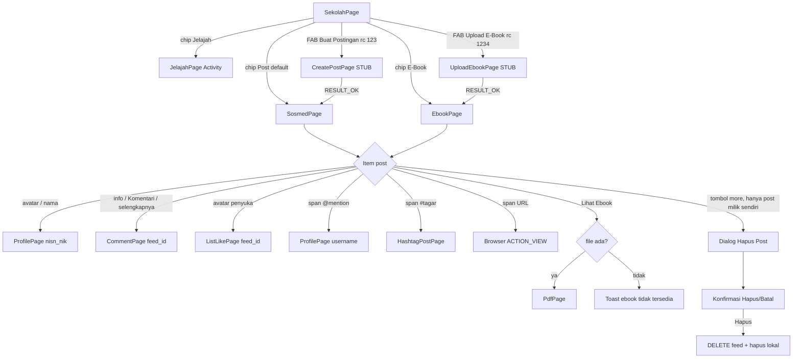
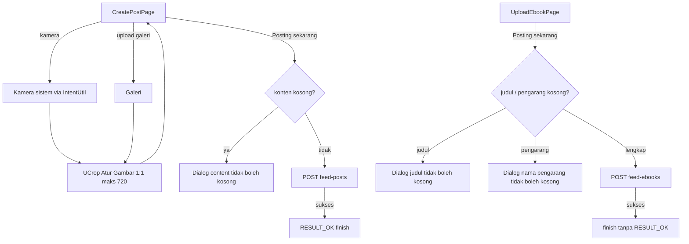
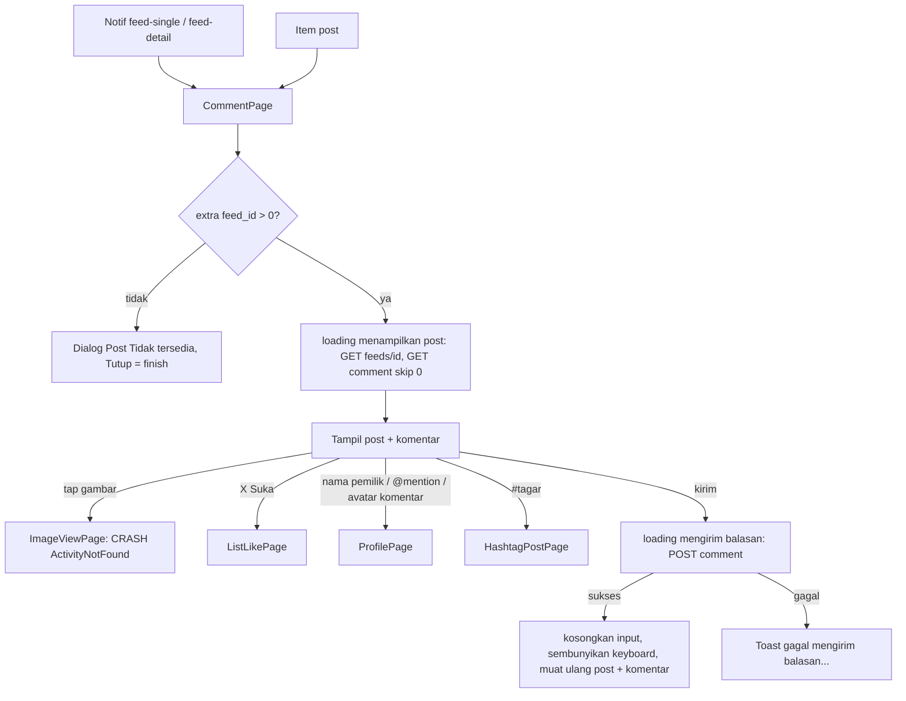
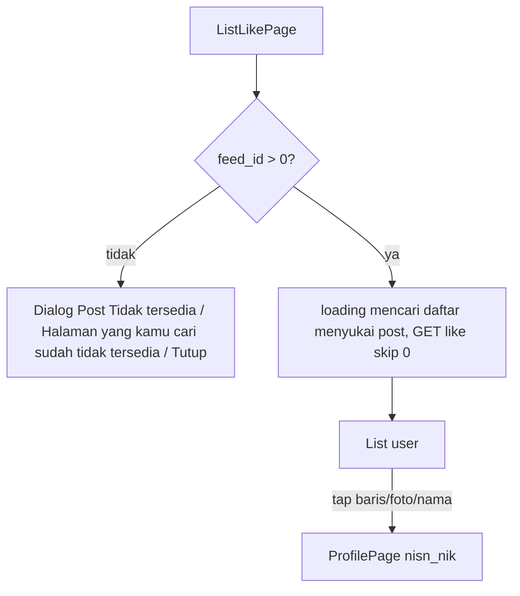
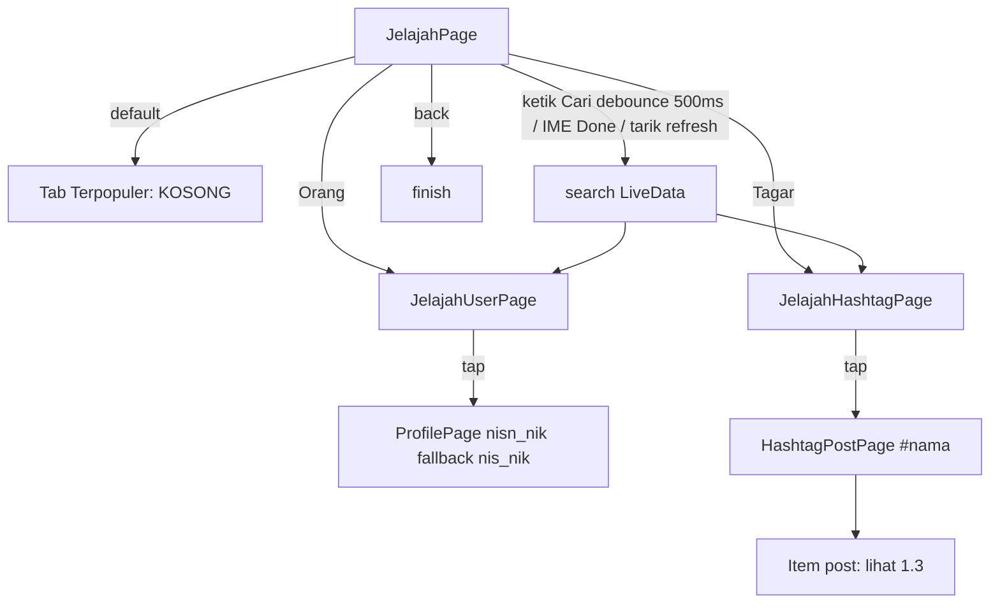
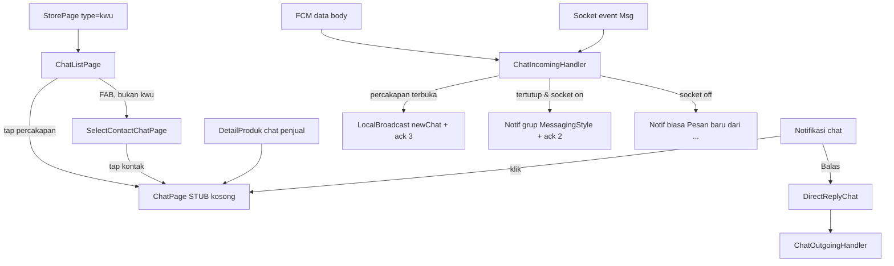
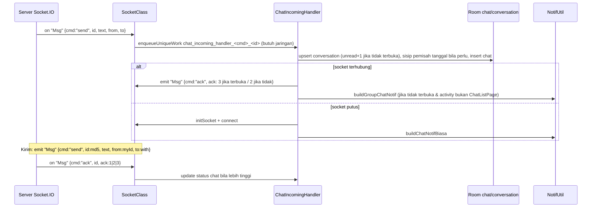
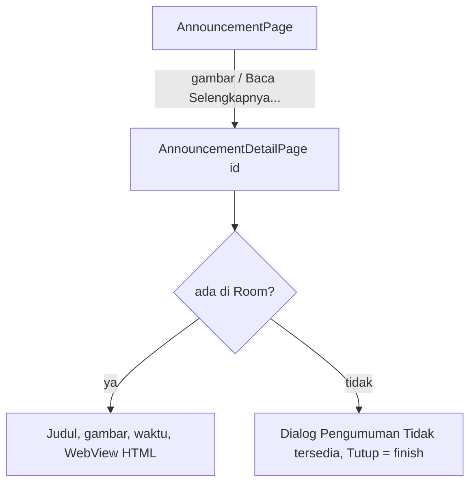

# Sosial: Feed Sekolah, Komentar/Like, Jelajah, Chat & Pengumuman

Dokumen ini adalah spesifikasi perilaku modul sosial aplikasi lama `android-portal` (v2.1.40 / versionCode 79): feed/timeline sekolah (tab Post & E-Book, jenis item post, like, hapus), pembuatan post/e-book/kamera (`createpost`), komentar, daftar penyuka, Jelajah (orang/tagar/post per tagar), chat berbasis Socket.IO (daftar obrolan, pilih kontak, layar obrolan, balas dari notifikasi, worker), dan Pengumuman. Termasuk util pendukung (span mention/hashtag/URL, zoom gambar + double-tap like, Paging 2 + Room `BoundaryCallback`, PDF viewer untuk e-book) dan cache Room. Bagian "beranda/tile menu" Home **tidak** dibahas di sini (didokumentasikan agent lain); `SosmedViewModel.checkUser()` juga milik dokumen Home/Login. Marketplace (`pages/sekolah/store/*`) milik agent lain, hanya disebut sebagai titik masuk chat. **Temuan paling penting: sebagian besar modul ini TIDAK terjangkau atau berupa stub di v2.1.40** — lihat §0 sebelum membangun apa pun.

Semua rujukan kode relatif terhadap root `android-portal`.

## Daftar isi

- [0. Status keterjangkauan (baca dulu)](#0-status-keterjangkauan-baca-dulu)
- [1. Feed Sekolah (SekolahPage, tab Post & E-Book)](#1-feed-sekolah-sekolahpage-tab-post--e-book)
- [2. Buat Postingan, Upload E-Book, Kamera (createpost)](#2-buat-postingan-upload-e-book-kamera-createpost)
- [3. Komentar Post (CommentPage, ImageViewPage)](#3-komentar-post-commentpage-imageviewpage)
- [4. Daftar Penyuka (ListLikePage)](#4-daftar-penyuka-listlikepage)
- [5. Jelajah & Post per Tagar (JelajahPage, HashtagPostPage)](#5-jelajah--post-per-tagar-jelajahpage-hashtagpostpage)
- [6. Chat (daftar obrolan, kontak, obrolan, Socket.IO, balas dari notifikasi)](#6-chat-daftar-obrolan-kontak-obrolan-socketio-balas-dari-notifikasi)
- [7. Pengumuman (AnnouncementPage, AnnouncementDetailPage)](#7-pengumuman-announcementpage-announcementdetailpage)
- [8. Komponen bersama](#8-komponen-bersama)
- [9. Ringkasan data lokal (Room)](#9-ringkasan-data-lokal-room)
- [10. Keputusan yang perlu diambil user](#10-keputusan-yang-perlu-diambil-user)
- [Selisih dengan dokumen lama](#selisih-dengan-dokumen-lama)
- [Checklist paritas](#checklist-paritas)

---

## 0. Status keterjangkauan (baca dulu)

| Layar | Kelas | Terdaftar di manifest/nav? | Terjangkau di v2.1.40? | Isi kode |
|---|---|---|---|---|
| SekolahPage (fragment induk feed) | `app/src/main/java/id/diskola/app/pages/sekolah/SekolahPage.kt` | Tidak di-host: entri `sekolahPage` di `app/src/main/res/navigation/main_nav.xml:8-15` dikomentari; item `menu_sekolah` di `app/src/main/res/menu/main_bot_menu.xml:6-8` dikomentari; mapping di `app/src/main/java/id/diskola/app/pages/home/HomePage.kt:247-251` dikomentari | **Tidak** | Lengkap & fungsional |
| SosmedPage (tab Post), EbookPage (tab E-Book) | `pages/sekolah/sosmed/SosmedPage.kt`, `pages/sekolah/ebook/EbookPage.kt` | `app/src/main/res/navigation/sekolah_nav.xml` (hanya di-host oleh `sekolah_page.xml:184`) | **Tidak** (hanya via SekolahPage) | Lengkap |
| CreatePostPage, UploadEbookPage, CameraPage | `pages/createpost/*.kt` | **Tidak terdaftar**: `app/src/main/AndroidManifest.xml:283-312` dikomentari | **Tidak** (pemanggil satu-satunya SekolahPage; bila dipanggil → `ActivityNotFoundException`) | **Stub**: badan kelas kosong, seluruh implementasi dikomentari (`CreatePostPage.kt:42`, `UploadEbookPage.kt:35-320`, `CameraPage.kt:31-143`) |
| CommentPage | `pages/comment/CommentPage.kt` | Ya, `AndroidManifest.xml:279` | **Ya** — via notifikasi FCM menu `"feed-single"`/`"feed-detail"` (`app/src/main/java/id/diskola/app/services/NotifRouter.kt:67-68`), dan dari item post di ProfilePage → ProfilePostPage (milik dokumen Akun; ProfilePage dibuka dari notifikasi `"PROFILE"`, `pages/notification/NotificationPage.kt:328`) | Fungsional |
| ImageViewPage | `pages/comment/ImageViewPage.kt` | **Tidak terdaftar** di manifest | Dipanggil dari CommentPage (tap gambar) → **crash** `ActivityNotFoundException` | Stub (isi dikomentari) |
| ListLikePage | `pages/listlike/ListLikePage.kt` | Ya, `AndroidManifest.xml:314` | Ya (dari CommentPage & item post) | Fungsional |
| JelajahPage (+ 3 tab) | `pages/jelajah/JelajahPage.kt` | Ya, `AndroidManifest.xml:317` | **Tidak** (pemanggil satu-satunya `SekolahPage.kt:169-171`) | Tab "Terpopuler" = fragment kosong (`JelajahPopularPage.kt:35-244` dikomentari) |
| HashtagPostPage | `pages/jelajah/HashtagPostPage.kt` | Ya, `AndroidManifest.xml:320` | Ya (span `#tagar` di CommentPage/item post) | Fungsional, ada bug argumen adapter |
| ChatListPage, SelectContactChatPage | `pages/chat/ChatListPage.kt`, `SelectContactChatPage.kt` | Ya, `AndroidManifest.xml:634,637` | **Praktis tidak**: pemanggil hanya `pages/sekolah/store/StorePage.kt:73-93` (StorePage hanya ada di `sekolah_nav.xml`, tak ter-host); `conversationPendingIntent` di `utils/NotifUtil.kt:215-222` tidak pernah dipakai | Fungsional |
| ChatPage | `pages/chat/ChatPage.kt` | Ya, `AndroidManifest.xml:641` | Ya — dari notifikasi chat (`utils/NotifUtil.kt:224-240`) dan tombol chat penjual `pages/sekolah/store/DetailProduk.kt:185-205` | **Stub**: seluruh isi dikomentari (`ChatPage.kt:38-386`) → layar kosong berlatar default |
| DirectReplyChat (IntentService) | `services/DirectReplyChat.kt` | Ya, `AndroidManifest.xml:686` | Ya (aksi "Balas" di notifikasi chat) | Fungsional (bug PendingIntent, lihat §6) |
| AnnouncementPage, AnnouncementDetailPage | `pages/announcement/*.kt` | Ya, `AndroidManifest.xml:360,363` | **Tidak** (pemanggil satu-satunya dikomentari `pages/pembelajaran/PembelajaranPage.kt:670`) | Fungsional |

Konsekuensi: yang benar-benar dialami pengguna v2.1.40 dari modul ini hanyalah **CommentPage → ListLikePage/HashtagPostPage/ProfilePage**, **notifikasi chat + balas dari notifikasi**, dan **ChatPage kosong**. Selebihnya kode mati yang tetap didokumentasikan lengkap agar bisa dibangun ulang bila diputuskan (lihat §10).

---

## 1. Feed Sekolah (SekolahPage, tab Post & E-Book)

### 1.1 Ringkasan
Timeline sosial per sekolah: post teks + maksimal 1 lampiran (gambar/file), dan daftar e-book (PDF). Pengguna: semua user login (siswa/guru/tamu) — tidak ada gating role/flag di kode feed; pemfilteran sekolah dilakukan server berdasarkan token. `SosmedViewModel` di-share (activity-scoped) antara HomePage, SekolahPage, SosmedPage, EbookPage (`pages/sekolah/SekolahPage.kt:30`, `pages/home/HomePage.kt:68`). Status: **tidak terjangkau** (§0).

### 1.2 Titik masuk
- Historis: tab bottom-nav "Sekolah" di HomePage (dikomentari, §0). Tidak ada extras.
- Adapter item post (`PostAdapter2` + `PostAdapterCallback.PostCallback`) juga dipakai ProfilePostPage (`pages/akun/ProfilePostPage.kt:34-40`, dokumen Akun) dan HashtagPostPage (§5).

### 1.3 Peta layar & alur

| Layar | File | Layout | Tujuan |
|---|---|---|---|
| SekolahPage (Fragment) | `pages/sekolah/SekolahPage.kt` | `sekolah_page.xml` | Header sekolah, chip tab, FAB, NavHost `sekolah_nav` |
| SosmedPage (Fragment) | `pages/sekolah/sosmed/SosmedPage.kt` | `sosmed_page.xml` | Timeline post (`feed_type = "text"`) |
| EbookPage (Fragment) | `pages/sekolah/ebook/EbookPage.kt` | `ebook_page.xml` | Daftar e-book (`feed_type = "ebook"`) |
| Dialog opsi post | `pages/sekolah/PostAdapterCallback.kt:60-74` | AlertDialog list | "Hapus Post" → konfirmasi |
| ProgressDialog | `pages/sekolah/SekolahPage.kt:205-208` | sistem | "menghapus post" |
| PdfPage (Activity, milik modul Materi) | `pages/theory/PdfPage.kt` | `pdf_page.xml` | Baca e-book |

### 1.4 Detail per layar

**SekolahPage** (`sekolah_page.xml`)
1. CollapsingToolbar: logo sekolah (`app:imageUrl="@{viewmodel.school.image}"`) dan nama sekolah (`@{viewmodel.school.name}`); `school` = JSON pref `"school"` (`pages/sekolah/SosmedViewModel.kt:46-53`).
2. Baris chip: "Post" (default aktif, background `border_form_login_primary`), "E-Book", "Jelajah" (keduanya `border_form_login_gray`), "Toko" (`visibility="gone"`) (`sekolah_page.xml:76-139`).
   - Tap "Post": chip E-Book jadi abu, `navigate(action_global_sosmedPage)`, chip Post jadi primer, FAB tampil, tombol Filter disembunyikan (`SekolahPage.kt:120-134`).
   - Tap "E-Book": simetris ke `action_global_ebookPage` (`SekolahPage.kt:136-150`).
   - Tap "Jelajah": `startActivity(JelajahPage)`; styling chip tidak berubah (`SekolahPage.kt:169-171`).
3. `FloatingActionsMenu` (label di kiri, hide-on-scroll): "Buat Postingan" (ikon `ic_create_post`) → `startActivityForResult(CreatePostPage, 123)`; "Upload E-Book" (ikon `ic_upload_ebook`) → `startActivityForResult(UploadEbookPage, 1234)`; menu di-collapse setelah tap (`SekolahPage.kt:106-118`, `sekolah_page.xml:185-214`).
4. Tombol "Filter" (`gone`, untuk Toko) — tidak dipakai.
5. `onActivityResult`: `RESULT_OK` & 123 → navigate ke tab Post; `RESULT_OK` & 1234 → navigate ke tab E-Book (`SekolahPage.kt:214-223`).

**SosmedPage** (`sosmed_page.xml`)
- `SwipeRefreshLayout` → `RecyclerView rv_post` (spasi 8sdp atas/bawah) + `include no_connection_layout` ("SINYAL KONEKSI HILANG" / "Waduh... sepertinya koneksi internetmu terputus, coba sambungkan kembali yah"), visibilitas via `errorLoadPost`.
- Buka layar: `init { launchWhenCreated { refreshTimeline() } }` → fetch `skip=0` (`SosmedPage.kt:108-112`). `rv_post.doOnLayout` menyimpan lebar RV ke `postRvWidth` (dipakai menghitung tinggi gambar) (`SosmedPage.kt:55-57`).
- Loading: `loadingPost` awal `true` → indikator refresh tampil sejak dibuka hingga fetch pertama selesai (`SosmedViewModel.kt:98`, `SosmedPage.kt:67-70`).
- Pull-to-refresh: `firstLoad=true`, `prevPost=-1`, `nextPostAvailable=true`, `refreshTimeline()` (`SosmedPage.kt:59-66`).
- Setelah `submitList`: jika `firstLoad` → scroll ke posisi 0 lalu `firstLoad=false`; selain itu pertahankan posisi item pertama yang terlihat penuh (`SosmedPage.kt:87-100`).
- Error: pesan `e.localizedMessage` di-post ke `errorString` kecuali `SocketTimeoutException` (sampai 3 level `cause`) (`SosmedViewModel.kt:180-186`); ditampilkan sebagai toast oleh observer di HomePage (`HomePage.kt:375`). `errorLoadPost` **tidak pernah di-set true** (kode dikomentari `SosmedViewModel.kt:188-192`) → layout "SINYAL KONEKSI HILANG" tidak pernah muncul.
- Empty state: tidak ada (list kosong saja).

**EbookPage** (`ebook_page.xml`): identik dengan SosmedPage tetapi memakai `listEbook`, `loadingEbook`, `prevEbook`, `nextEbookAvailable`, `ebookRvWidth`, `refreshTimeline("ebook")` (`EbookPage.kt:52-101`). Tombol "Galery E-Book" dan teks "Lihat Semua" `gone`. Catatan: visibilitas `rv_ebook` terikat ke `errorLoadPost` (bukan `errorLoadEbook`) (`ebook_page.xml`, grep `rv_ebook`), tanpa efek karena keduanya tak pernah true.

**Item post** — lihat §8.1 (tiga layout: teks, gambar tunggal, e-book). Aksi yang di-override SekolahPage (`SekolahPage.kt:183-212`):
- Like/unlike → `viewmodel.likePost(item, liked)` (optimistik, §1.8).
- "Lihat Ebook" → `intentUtil.openPdf(activity, files[0].path, feed.feed_body)`; bila tak ada file → Toast "ebook tidak tersedia, mohon ulangi beberapa saat lagi".
- Hapus (setelah konfirmasi) → `ProgressDialog.show("", "menghapus post")` → `deleteFeed(feed_id)` → dismiss. Tidak ada pesan sukses; gagal → toast `errorString`.
- Menu opsi (tombol `option`, ikon `ic_more`) hanya tampil jika `userTable.id == pref user_id` (`PostAdapter2.kt:54`, `PostTextViewholder.kt:73-78`). Isi: satu item "Hapus Post" → dialog pesan "Anda yakin akan menghapus post?", tombol positif "Hapus", netral "Batal" (`PostAdapterCallback.kt:60-74`). **Tidak ada** edit post, laporkan post, maupun share (`onClickShare` kosong, `PostAdapterCallback.kt:21`).

### 1.5 Kontrak API

| Method | Path (`ApiService.kt`) | Param/Body | Field response dipakai | Kapan |
|---|---|---|---|---|
| GET | `mobile/app/schools/feed-posts` (`app/src/main/java/id/diskola/app/api/ApiService.kt:263-264`) | `take=10`, `skip` | `data[]` → `FeedItem` (lihat bawah) | Buka tab, refresh, paging akhir list |
| GET | `mobile/app/schools/feed-ebooks` (`ApiService.kt:266-267`) | `take=10`, `skip` | idem | idem untuk tab E-Book |
| POST | `mobile/app/schools/feed-posts/send-like` (`ApiService.kt:286-287`) | JSON `{"user_id": pref user_id, "feed_id": id}` (`SosmedViewModel.kt:219-224`) | tidak dipakai | 1 detik setelah tap like |
| DELETE | `mobile/app/schools/feed-posts/{feedId}/unlike` (`ApiService.kt:289-290`) | path | tidak dipakai | 1 detik setelah tap unlike |
| DELETE | `mobile/app/schools/feeds/{feedId}` (`ApiService.kt:295-296`) | path | tidak dipakai | Konfirmasi hapus |

Field `FeedItem` (`pages/sekolah/sosmed/SosmedModels.kt:36-54`) yang dipakai: **nama JSON ditukar** — JSON `"id"` → properti `row_id`, JSON `"row_id"` → properti `id`; ID post = `row_id > 0 ? row_id : id` (`db/OnKlasDbUtil.kt:72`). Lainnya: `feed_type`, `created_at` (ISO, → epoch), `created_at_label` (label waktu tampil), `feed_body`, `feed_author`, `feed_thumbnail_image`, `users{id, uuid, name, email, user_username, nisn_nik, nis_nik, phone, user_avatar_image, is_verified}`, `file{feed_files_path, feed_files_size, feed_files_type, feed_files_name, feed_files_width, feed_files_height, feed_files_id}` (objek tunggal, bukan list), `count_comments`, `count_likes`, `likes[]{created_at_label, user}`, `comments[]{id, user, feed_comments_body, created_at_label}`, `is_likes`. `feed_title` **tidak** dipakai UI (judul e-book ditampilkan dari `feed_body`).

Base URL = `BuildConfig.API_URL` (`app/src/main/java/id/diskola/app/di/modules/ApiModules.kt:33`). Tidak ada penanganan kode HTTP khusus.

### 1.6 Data lokal
- Room `MemoryDB` (file `diskola.db`, versi 46, `fallbackToDestructiveMigration`) (`db/MemoryDB.kt:64-80`, `di/modules/DbModules.kt:100-105`): tabel `feed`, `feed_file`, `feed_like`, `feed_comment`, `user` (detail §9).
- Query tampil: `select * from feed where feed_type = :type order by feed_id desc` (`pages/sekolah/sosmed/FeedDao.kt:60-62`), relasi `FeedTimeline` = feed + files + userTable (owner) + likes (via junction `feed_like`) (`SosmedEntities.kt:161-173`).
- SharedPreferences dibaca: `"school"`, `"student"`, `"teacher"`, `"user"`, `"user_id"` (`SosmedViewModel.kt:46-80`, `SosmedPage.kt:38`).
- Semua tabel dikosongkan saat logout (`utils/IntentUtil.kt:563-568` `clearAllTables()`).

### 1.7 Perilaku perangkat/latar
Tidak ada permission. Gambar dimuat Glide (thumbnail 0.1, override lebar RV). Pinch-zoom & double-tap like memerlukan Activity host meneruskan `dispatchTouchEvent` ke `MyImageZoom` (HomePage melakukannya: `HomePage.kt:513-515`) — §8.3. Bottom-nav hide-on-scroll (`SekolahPage.onScroll`, `SekolahPage.kt:177-181`) tidak aktif (listener scroll dikomentari `SosmedPage.kt:80-85`).

### 1.8 Aturan bisnis & edge case
- **Paging** (Paging 2 + `BoundaryCallback`, `SosmedViewModel.kt:101-138`): page size 10. `onZeroItemsLoaded` → `fetchTimeline(0)`; `onItemAtEndLoaded` → jika `nextPostAvailable && countFeed(type) >= 10` → `fetchTimeline(skip = countFeed(type))`. `hasMore = processFeedItem sukses && data.size >= 10` (`SosmedViewModel.kt:171-179`).
- **Guard duplikat**: `fetchTimeline` return jika `start == prevPost` (atau `prevEbook`) (`SosmedViewModel.kt:148-150`). Karena itu `init` + `onZeroItemsLoaded` tidak double-fetch; refresh harus mereset `prev* = -1`.
- **Refresh**: data lama tipe itu dihapus (`nukeFeed(type)`) **setelah** response sukses (`SosmedViewModel.kt:168-169`) → saat offline cache lama tetap tampil. Yang dihapus hanya tabel `feed`; baris `feed_file`, `feed_like`, `feed_comment` lama tidak dibersihkan.
- **Tinggi gambar** dihitung saat simpan: `height = rvWidth * h / w` (w/h dari server; ≤0 atau gagal parse → `rvWidth`), `width` disimpan = `rvWidth`; untuk e-book tidak dihitung (`OnKlasDbUtil.kt:131-166`). Nilai tersimpan tetapi layout gambar memakai `SquareImageView` (1:1, `utils/SquareImageView.kt:15-17`) sehingga praktis selalu persegi.
- **Ukuran file** diformat `DecimalFormat("0.00")` + " Kb"/" Mb"/" Gb" (basis 1024) (`utils/FileUtils.kt:120-133`) — contoh "1,25 Mb" (locale perangkat).
- **Format waktu relatif**: klien **tidak** menghitung; teks waktu = `created_at_label` dari server apa adanya (`OnKlasDbUtil.kt:83`, `PostTextViewholder.kt:91`). `created_at` dikonversi `DateUtil.formatDate` (API ≥26: `OffsetDateTime.parse().toEpochSecond()` → **detik**; <26: `SimpleDateFormat("yyyy-MM-dd'T'HH:mm:ss")` → **milidetik**) (`utils/DateUtil.kt:21-30`); hanya dipakai urutan feed profil.
- **Like/unlike optimistik** (`SosmedViewModel.kt:203-247`, `PostTextViewholder.kt:97-104`):
  1. UI langsung: tombol berubah, teks info dihitung ulang `count_likes ± 1`.
  2. DB langsung: insert/delete `FeedUserCrossRef(feed_id, user_id)` + `update feed set isLike=1/0, count_likes=count_likes±1`.
  3. API didebounce: job per `feed_id` di-cancel bila ada tap baru, lalu `delay(1000)` → `send-like`/`unlike`. Tap cepat berulang → hanya status terakhir yang dikirim.
  4. **Tidak ada rollback** bila API gagal; exception di coroutine anak (`launch{ async{} }`) tidak tertangkap `try/catch` luar → berpotensi crash aplikasi saat jaringan gagal (berdasarkan semantik coroutine; belum diuji runtime).
- **Hapus**: `ApiWrapper.deleteFeed` sudah menghapus baris lokal (`utils/ApiWrapper.kt:291-292`), lalu `SosmedViewModel.deleteFeed` menghapus lagi (`SosmedViewModel.kt:262-271`) — redundan, tidak berbahaya.
- **Tipe item**: `feed_type=="text"` + ada file → gambar tunggal (1 file) / "multi-media" (>1 file); `"ebook"` → e-book; selain itu → teks (`PostAdapter2.kt:25-32`). Tipe "multi-media" **tidak punya viewholder** sehingga jatuh ke layout teks tanpa gambar (`PostAdapter2.kt:34-47`). Karena API hanya memberi satu `file`, >1 file hanya terjadi bila path file sebuah post berubah di server (baris lama tak terhapus).
- Lampiran non-gambar (mis. video) pada post teks tetap dirender viewholder gambar via Glide (belum terverifikasi hasilnya). Tidak ada tipe polling/link-preview; URL di teks hanya menjadi span klik (§8.2).

### 1.9 Catatan migrasi Compose
- Route: `Route.FeedSekolah` (layar dengan `PrimaryTabRow` Post/E-Book + aksi Jelajah) → `FeedSekolahScreen` + `FeedViewModel` (`FeedUiState(school, tab, posts: LazyPagingItems<FeedPost>, isRefreshing)`).
- Paging 2 + BoundaryCallback → Paging 3 `Pager` + `RemoteMediator` (Room sebagai single source of truth, `LoadType.REFRESH` menghapus `feed` tipe itu dalam transaksi yang sama dengan insert). Bungkus insert per halaman dalam `withTransaction` (kode lama insert satu-satu tanpa transaksi → invalidasi PagedList berkali-kali, `OnKlasDbUtil.kt:68,184` dikomentari).
- `SwipeRefreshLayout` → `PullToRefreshBox`; RecyclerView → `LazyColumn` dengan `key = feed_id`; Glide → Coil `AsyncImage`; FAB menu → `FloatingActionButton` + menu speed-dial.
- Like: pertahankan update optimistik + debounce 1 dtk per post; tangani error (log) tanpa crash. ❓ Perlu keputusan user: apakah rollback UI saat gagal (kode lama tidak rollback).
- Bug/anti-pattern: navigasi chip `navigate()` tanpa `popUpTo` menumpuk back stack tiap tap (`SekolahPage.kt:128,144`); `SosmedPage` mencari induk via `requireParentFragment().parentFragment as SekolahPage` (`SosmedPage.kt:30`) — rapuh; `errorLoadPost` tak pernah true (layout offline mati); tipe multi-media tanpa viewholder. ❓ Perlu keputusan user: tampilkan layout "SINYAL KONEKSI HILANG" saat gagal load awal atau tetap seperti sekarang (tidak pernah).

---

## 2. Buat Postingan, Upload E-Book, Kamera (createpost)

### 2.1 Ringkasan
Di v2.1.40 ketiga Activity adalah **stub kosong dan tidak terdaftar di manifest** (termasuk intent-filter `ACTION_SEND` untuk `image/*`, `text/plain`, `video/*` dan `application/pdf` yang ikut dikomentari, `AndroidManifest.xml:283-312`). Tidak ada fitur berbagi dari aplikasi lain. `CreatePostViewmodel.createPost/createEbook/searchUsername` masih ada tetapi tidak dipanggil. Di bawah ini desain yang **dinonaktifkan** (dari kode komentar) sebagai referensi jika fitur dihidupkan.

### 2.2 Titik masuk
FAB SekolahPage (§1.4), requestCode 123/1234. Historis: share sheet Android (`ACTION_SEND`).

### 2.3 Peta layar & alur (desain nonaktif)

| Layar | File | Layout | Status |
|---|---|---|---|
| CreatePostPage | `pages/createpost/CreatePostPage.kt` | `create_post_page.xml` | Stub |
| UploadEbookPage | `pages/createpost/UploadEbookPage.kt` | `upload_ebook_page.xml` | Stub |
| CameraPage | `pages/createpost/CameraPage.kt` | `camera_page.xml` | Stub |

### 2.4 Detail per layar (desain nonaktif)
**CreatePostPage** — toolbar "Buat Postingan" ikon close (`create_post_page.xml:31`); input hint "Tulis disini", `maxLength=1000` tetapi counter menampilkan "N/500" (inkonsisten) (`create_post_page.xml:52-55`, `CreatePostPage.kt:84-96`); counter & garis abu saat kosong, primer saat terisi; tombol "kamera", "upload galeri" (disembunyikan setelah ada media), "hapus gambar" (muncul setelah crop), "Posting sekarang" (enabled bila teks tak kosong ATAU ada media — dua observer saling menimpa, `CreatePostPage.kt:84-138`). Validasi: teks kosong → dialog "content tidak boleh kosong" tombol "Ok". Loading "sedang mengirim post". Sukses → `setResult(RESULT_OK)` + finish; gagal → toast `localizedMessage`. Media: UCrop JPEG kualitas 80, maks 720×720, rasio 1:1, judul "Atur Gambar", tanpa grid (`CreatePostPage.kt:331-349`). Autocomplete mention `@` (library Autocomplete) sudah dikomentari sejak sebelumnya (`CreatePostPage.kt:166-203`).

**UploadEbookPage** — toolbar "Upload E-Book"; "Judul e-book" hint "Ketik Judul disini" `maxLength=500` counter "0/500"; "Nama Pengarang" hint "Ketik nama disini" `maxLength=50` counter "0/50"; "Cover" tombol "Upload gambar"; tombol "Upload file", keterangan "File dalam format pdf", "Lampirkan File"; "Posting sekarang" enabled hanya jika judul, pengarang, cover, file semua terisi (`upload_ebook_page.xml:35-300`, `UploadEbookPage.kt:313-320`). Validasi pesan: "judul tidak boleh kosong", "nama pengarang tidak boleh kosong". Loading "mengupload ebook". PDF > 12 MB → toast "Ukuran maksimal file 12Mb"; cover di-resize 680×720 ke `filesDir/cover.jpg` (`UploadEbookPage.kt:274-305`). Info file: "`<nama>` (ukuran: `<x Mb>`)". Pemilih file (FilePicker) sudah dikomentari → tombol cover/file tidak melakukan apa pun bahkan di kode komentar terbaru (`UploadEbookPage.kt:102-123`).

**CameraPage** — CameraView (otaliastudios), mode "Kamera"/"Video", flash toggle, ganti kamera; foto → `toBitmap(760,760)` → crop persegi → file "Capture", loading "memproses gambar ...", gagal "gagal memproses gambar"; video maks 60 dtk dengan counter "0:SS" (`CameraPage.kt:56-143`). Tidak dipanggil siapa pun bahkan di kode komentar.

### 2.5 Kontrak API (ada di ApiService, tidak dipanggil)

| Method | Path | Body | Catatan |
|---|---|---|---|
| POST multipart | `mobile/app/schools/feed-posts` (`ApiService.kt:249-254`) | part `feed_body` (text/plain), part `file` opsional (MIME dari ekstensi) (`ApiWrapper.kt:206-218`) | Response `Any` |
| POST multipart | `mobile/app/schools/feed-ebooks` (`ApiService.kt:256-261`) | `feed_title`, `feed_author` (text/plain), part `file` (PDF) + part `cover` (`ApiWrapper.kt:220-244`) | Response `Any` |
| GET | `mobile/app/accounts/search-username` (`ApiService.kt:246-247`) | `params=<teks>` | `data[]` FeedUser → disimpan ke tabel `user` (`ApiWrapper.kt:160-162`) |

Model `CreatePostResponse`, `UploadPostResponse`, `LockKuotaError` (`pages/createpost/CreatePostModel.kt`, `LockKuotaError.java`) tidak dipakai.

### 2.6–2.8 Data lokal / perangkat / aturan
Tidak ada yang aktif. Desain lama: permission kamera & galeri via `IntentUtil.requestCameraPermission/requestGalleryPermission`, file sementara di `cacheDir/<millis>.jpg` & `filesDir`.

### 2.9 Catatan migrasi Compose
❓ Perlu keputusan user: fitur ini tidak ada di aplikasi produksi saat ini; untuk paritas **jangan** dibangun (dan jangan daftarkan intent-filter `ACTION_SEND`). Jika dihidupkan: `Route.CreatePost`, `Route.UploadEbook`; `rememberLauncherForActivityResult(PickVisualMedia / OpenDocument("application/pdf") / TakePicture)`; UCrop tetap atau pengganti; samakan counter vs `maxLength` (500 vs 1000) — perlu keputusan.

---

## 3. Komentar Post (CommentPage, ImageViewPage)

### 3.1 Ringkasan
Detail satu post + daftar komentar + kirim komentar. Semua user login. Satu-satunya layar feed yang benar-benar terjangkau (notifikasi FCM).

### 3.2 Titik masuk
- Notifikasi FCM `page.menu` = `"feed-single"` atau `"feed-detail"` → `Intent(CommentPage).putExtra("feed_id", id)` + flag `NEW_TASK|CLEAR_TOP|SINGLE_TOP` (`services/NotifRouter.kt:67-68,92-97`).
- `CommentPage.open(activity, feedId)` extra `"feed_id": Int` (`CommentPage.kt:50-59`) dari item post (info, "Komentari", " selengkapnya", gambar) (`PostAdapterCallback.kt:44-50`).
- `parentActivityName = HomePage` (`AndroidManifest.xml:279-282`), `windowSoftInputMode=adjustResize`.

### 3.3 Peta layar & alur

| Layar | File | Layout | Tujuan |
|---|---|---|---|
| CommentPage | `pages/comment/CommentPage.kt` | `comment_page.xml`, item `comment_item.xml` | Detail post + komentar |
| Dialog "Post Tidak tersedia" | `CommentPage.kt:245-257` | MaterialAlertDialog | feed_id tidak valid |
| Dialog opsi komentar | `CommentPage.kt:322-338` | list 1 item | Buka profil pengomentar |
| ImageViewPage | `pages/comment/ImageViewPage.kt` | `image_view_page.xml` | **Stub + tidak terdaftar → crash** |

### 3.4 Detail per layar
Urutan UI (`comment_page.xml`):
1. Toolbar "Komentar" + tombol back (`finish`).
2. `ScrollView` berisi: `content` = span `"<b>nama pemilik</b> isi post"` (nama bisa diklik → ProfilePage `nisn_nik` fallback `nis_nik`; hashtag & mention bisa diklik) (`CommentPage.kt:181-193`, `StringUtil.buildUserContentComment` §8.2). Isi tidak dipotong.
3. `image`: tampil hanya bila file pertama `type` mengandung "image" (case-insensitive), `imageFitUrl` (fitCenter). Tap → `ImageViewPage` dengan shared element `"image"` (`CommentPage.kt:159-179`) — **crash** (§0).
4. `time` = `post.feed.timeString` (label server).
5. `info` = `"<count_likes> Suka "` (span abu, klik → ListLikePage) + `"- <count_comments> Komentar"` — "Suka" selalu tampil walau 0 (beda dengan feed) (`CommentPage.kt:195-210`).
6. `rv_comments` (nested scrolling off, spasi 12sdp). Item (`comment_item.xml`): avatar bulat (klik → ProfilePage), `content` = span `"<b>nama</b> komentar"` (nama fallback "User" bila user tidak ada di cache), `time` = `created_at_label` server, tombol opsi `ic_more` → dialog satu item "Buka profil `<nama>`" (opsi "Laporkan konten"/"Lainnya" dikomentari) (`CommentPage.kt:297-340`).
7. Bar bawah: EditText hint "Beri komentar", multiline, `maxLines=4`, two-way ke `commentBody`; ikon kirim `img_reply` disabled saat kosong; saat terisi background `border_reply_2_primary` dan enabled (`CommentPage.kt:91-100`). Tidak ada trim — spasi saja dianggap terisi.

Aksi kirim (`CommentPage.kt:142-157`): loading (judul "Mohon tunggu", pesan "mengirim balasan") → `sendCommend()` → sukses: input dikosongkan, keyboard ditutup, observer komentar ditambah lagi, `init()` mem-post ulang `feedId` (memicu muat ulang post & komentar). Gagal → toast `localizedMessage` (dari `errorString`) + toast "gagal mengirim balasan, mohon ulangi beberapa saat lagi".

Buka layar (`CommentPage.kt:213-236`): jika extra valid → `NotificationManagerCompat.cancel(feedId)` lalu observer `feedId` → loading "menampilkan post" → `getPost` → reset `commentStart=-1, hasMoreComment=true` → `fetchComments()` → observe list komentar → dismiss loading. Jika tidak valid → dialog judul "Post Tidak tersedia", pesan `errorString.value ?: "Halaman yang kamu cari sudah tidak tersedia"`, non-cancelable, tombol "Tutup" → finish. **Bug**: `errorString` diinisialisasi `""` (`CommentViewModel.kt:29`) sehingga pesan dialog kosong, bukan teks default.

`getPost` (`CommentViewModel.kt:67-82`): API detail; bila gagal → fallback baca `feed` lokal; bila itu gagal → toast error. `feedId ≤ 0` → `"Post tidak tersedia"`.

### 3.5 Kontrak API

| Method | Path | Param/Body | Field dipakai | Kapan |
|---|---|---|---|---|
| GET | `mobile/app/schools/feeds/{feedId}` (`ApiService.kt:269-270`) | path | `data`: `row_id`(=JSON `id`), `created_at`, `feed_type`, `feed_body`, `users`, `count_comments`, `count_likes`, `created_at_label`, `is_likes`, `feed_thumbnail_image`, `feed_author`, `file{...}`, `likes[].user` (`CommentViewModel.kt:84-122`) | Buka layar, setelah kirim |
| GET | `mobile/app/schools/feeds/{feedId}/comment` (`ApiService.kt:272-277`) | `take=20`, `skip` | `data[]`: `id`, `feed_comments_body`, `user.id`, `created_at_label` (`ApiWrapper.kt:246-258`) | Buka, paging, setelah kirim |
| POST | `mobile/app/schools/feed-posts/{feedId}/comment` (`ApiService.kt:292-293`) | JSON `{"feed_comments_body": "<teks>"}` (`ApiWrapper.kt:287-289`) | tidak dipakai | Tap kirim |
| GET | `mobile/app/accounts/search-username` | `params` | — | Dipanggil `searchUsername` tetapi pemicunya (autocomplete) dikomentari → mati |

### 3.6 Data lokal
- `feed_comment` (insert REPLACE per `id` komentar), dibaca `select * from feed_comment where feed_id = :id order by cid` + relasi `user` via `commenter_id` (`FeedDao.kt:92-94`). Paging 20 (`CommentViewModel.kt:33-50`).
- `sendCommend` sukses → `update feed set count_comments = count_comments + 1` (`FeedDao.kt:118-119`, `CommentViewModel.kt:127`) — komentar baru **tidak** disisipkan lokal; muncul setelah re-fetch.
- Post detail **tidak** disimpan ke Room (hanya LiveData).
- `ApiWrapper.getFeedComment` **tidak menyimpan user pengomentar** ke tabel `user` → nama/avatar komentar hanya muncul jika user itu kebetulan sudah ada di cache (dari feed, jelajah, kontak chat); jika tidak → nama "User", avatar kosong.

### 3.7 Perilaku perangkat/latar
Membatalkan notifikasi dengan id = `feedId` saat dibuka. Keyboard `adjustResize`.

### 3.8 Aturan bisnis & edge case
- Paging komentar: `onZeroItemsLoaded` → `fetchComments(0)`; akhir list → jika `countFeed(feedId) >= 20 && hasMoreComment` → `fetchComments(count)`; guard `commentStart == start` (`CommentViewModel.kt:35-65`). RecyclerView di dalam ScrollView tanpa nested scrolling → semua item ter-layout sekaligus sehingga boundary "akhir" terpicu segera.
- Setiap kirim komentar menambah 2 observer baru (`observe` di `CommentPage.kt:150-151` dan di observer `feedId` `CommentPage.kt:220-222`) → submitList berulang/terduplikasi.
- Waktu = label server (tidak dihitung klien).

### 3.9 Catatan migrasi Compose
- Route `Route.FeedComment(feedId: Int)`; deep link dari notifikasi. `FeedCommentScreen` + `FeedCommentViewModel` (`UiState(post, comments: LazyPagingItems, input, isSending)`).
- Satu `LazyColumn` (header post + item komentar) menggantikan ScrollView+RecyclerView.
- Simpan user pengomentar ke cache saat fetch komentar (perbaikan data, tidak mengubah UI kecuali nama "User" hilang) — ❓ Perlu keputusan user karena kode lama menampilkan "User".
- ❓ Perlu keputusan user: tap gambar (lama = crash). Usul: buka viewer gambar layar penuh (desain komentar ImageViewPage: toolbar judul, menu simpan → DownloadManager ke `Downloads/diskola-post-<millis>.jpg`, toast "proses download gambar akan dimulai sesaat lagi", `ImageViewPage.kt:16-77`) atau nonaktifkan klik.
- ❓ Perlu keputusan user: pesan dialog "Post Tidak tersedia" (lama kosong karena bug) → usul pakai "Halaman yang kamu cari sudah tidak tersedia".
- Hindari re-observe; muat ulang via `refresh()` Paging.

---

## 4. Daftar Penyuka (ListLikePage)

### 4.1 Ringkasan
Daftar user yang menyukai sebuah post. Semua user login.

### 4.2 Titik masuk
`ListLikePage.open(activity, feedId)` extra `"feed_id": Int` (`ListLikePage.kt:27-34`) dari: avatar penyuka di item post (`PostTextViewholder.kt:80`, `PostAdapterCallback.kt:40-42`), teks "X Suka" di CommentPage (`CommentPage.kt:197-200`).

### 4.3 Peta layar & alur

| Layar | File | Layout |
|---|---|---|
| ListLikePage | `pages/listlike/ListLikePage.kt` | `list_like_page.xml`, item `list_like_item.xml` |

### 4.4 Detail per layar
Toolbar "Menyukai Postingan" + back. Loading (judul "Mohon tunggu", pesan "mencari daftar menyukai post") ditutup pada emisi list pertama (`ListLikePage.kt:53-69`). Item: avatar bulat (`imageCircleUrl`), nama; tap baris/foto/nama → `ProfilePage.open(nisn_nik = item.nisn_nik)` (tanpa fallback `nis_nik`, beda dengan layar lain) (`ListLikePage.kt:127-133`). Tidak ada empty state/refresh.

### 4.5 Kontrak API

| Method | Path | Param | Field dipakai | Kapan |
|---|---|---|---|---|
| GET | `mobile/app/schools/feeds/{feedId}/like` (`ApiService.kt:279-284`) | `take=20`, `skip=0` (**selalu 0**, `ListLikeViewModel.kt:53`) | `data[]`: `user{...}`, `created_at_label` → `user` & `feed_like` (`ApiWrapper.kt:260-270`) | Buka layar; boundary |

### 4.6 Data lokal
`feed_like` (PK `feed_id`+`id`) + relasi `user`; query `select * from feed_like where feed_id = :id` (`FeedDao.kt:96-101`). Paging 20.

### 4.7 Perilaku perangkat/latar
Tidak ada.

### 4.8 Aturan bisnis & edge case
- Bug paging: `fetchLike(feedId, start)` mengabaikan `start` dan selalu meminta `skip=0` → penyuka > 20 tidak pernah termuat (`ListLikeViewModel.kt:47-58`).
- Cache `feed_like` juga berisi like optimistik lokal (user sendiri) dan like lama yang tidak pernah dihapus → daftar bisa memuat penyuka yang sudah unlike.
- Tidak ada urutan eksplisit (urutan PK Room).

### 4.9 Catatan migrasi Compose
Route `Route.FeedLikes(feedId: Int)`, `FeedLikesScreen` + `FeedLikesViewModel`. ❓ Perlu keputusan user: perbaiki `skip` (mengubah perilaku: penyuka >20 jadi tampil) dan fallback `nis_nik`.

---

## 5. Jelajah & Post per Tagar (JelajahPage, HashtagPostPage)

### 5.1 Ringkasan
Pencarian post/orang/tagar di sekolah; HashtagPostPage menampilkan feed yang memuat tagar tertentu. Semua user login. JelajahPage **tidak terjangkau**; HashtagPostPage terjangkau via span tagar di CommentPage.

### 5.2 Titik masuk
- JelajahPage: chip "Jelajah" SekolahPage (`SekolahPage.kt:169-171`), tanpa extras.
- HashtagPostPage: `HashtagPostPage.open(activity, hashtag)` extra `"hashtag": String` berisi teks lengkap dengan `#` (mis. `"#pramuka"`) (`HashtagPostPage.kt:28-37`), dari span tagar (`PostAdapterCallback.kt:56-58`, `CommentPage.kt:191,319`) dan item Tagar di Jelajah (`JelajahHashtagPage.kt:99-108`).

### 5.3 Peta layar & alur

| Layar | File | Layout | Tujuan |
|---|---|---|---|
| JelajahPage (Activity) | `pages/jelajah/JelajahPage.kt` | `jelajah_page.xml` | Search bar + 3 tombol tab + NavHost `jelajah_nav` |
| JelajahPopularPage | `pages/jelajah/JelajahPopularPage.kt` | — (tanpa view) | **Kosong** (start destination, `navigation/jelajah_nav.xml:4`) |
| JelajahUserPage | `pages/jelajah/JelajahUserPage.kt` | `jelajah_rv_page.xml`, `jelajah_user_item.xml` | Hasil orang |
| JelajahHashtagPage | `pages/jelajah/JelajahHashtagPage.kt` | `jelajah_rv_page.xml`, `jelajah_hashtag_item.xml` | Hasil tagar |
| HashtagPostPage (Activity) | `pages/jelajah/HashtagPostPage.kt` | `coordinator_rv_page.xml` + item post | Feed per tagar |

### 5.4 Detail per layar
**JelajahPage** (`jelajah_page.xml`, `JelajahPage.kt`):
- EditText hint "Cari"; tiap perubahan teks → debounce 500 ms; IME Done atau tarik-refresh → 10 ms; aksi debounce: `search = teks`, set `loadingPopular/User/Hashtag = true` (`JelajahPage.kt:31-75`).
- Tombol outline: "Terpopuler" (berubah jadi "Post" bila `search` tidak kosong, `JelajahPage.kt:77-79`), "Orang", "Tagar". Tombol aktif: stroke & teks primer; lainnya abu (`JelajahPage.kt:101-111`). Navigasi `navigate(action_global_*)` tanpa popUpTo.
- SwipeRefresh berhenti ketika salah satu `loading*` menjadi false (`JelajahPage.kt:82-98`).
- Back → `finish()` langsung dari tab mana pun (`JelajahPage.kt:118-120`).
- `dispatchTouchEvent` diteruskan ke `MyImageZoom` (`JelajahPage.kt:113-116`).

**JelajahUserPage**: `jelajah_rv_page.xml` = ProgressBar + label "sedang mengambil data" saat `loadingUser` + RecyclerView (spasi 8sdp). Setiap perubahan `search` → observe `listUser(search)` + reset `hasMoreUser/isRequestUser` + `fetchUser(0, search)` (`JelajahUserPage.kt:53-60`). Item: avatar bulat; baris 1 = `"@" + username` atau `name` bila username kosong; baris 2 = `name` (hanya jika username tidak kosong) (`jelajah_user_item.xml:43-56`). Tap baris/foto/nama/username → `ProfilePage.open(nisn_nik = nisn_nik.ifEmpty { nis_nik })`.

**JelajahHashtagPage**: sama pola; item ikon `ic_hashtag`, `"#" + name`, `"<total> postingan"` (`jelajah_hashtag_item.xml:40-51`); tap → `HashtagPostPage.open("#" + name)`.

**JelajahPopularPage**: seluruh isi dikomentari → area konten kosong. Desain lama (komentar): tanpa kata kunci = grid staggered 3 kolom thumbnail (e-book pakai cover), tap → CommentPage; dengan kata kunci = list post (`JelajahPopularPage.kt:54-181`).

**HashtagPostPage** (`HashtagPostPage.kt`):
- Bila extra kosong → `setContentView` tidak dipanggil (layar kosong, tidak ada dialog) (`HashtagPostPage.kt:50`).
- Toolbar judul = tagar (mis. "#pramuka") + back. SwipeRefresh → reset guard + `fetchPopular(0, hashtag)` + `loadingPopular=true` (`HashtagPostPage.kt:64-71`).
- List = item post (§8.1) dari cache `feed` yang `feed_body LIKE %#tagar%` (tanpa filter `feed_type`) (`FeedDao.kt:64-66`, `JelajahViewModel.kt:41-56`). Refresh berhenti setelah `submitList`.
- Like → `sosmedVm.likePost` (GlobalScope); hapus → ProgressDialog "menghapus post" (`HashtagPostPage.kt:95-112`).

### 5.5 Kontrak API

| Method | Path | Param | Field dipakai | Kapan |
|---|---|---|---|---|
| GET | `mobile/app/schools/explore/feed` (`ApiService.kt:298-303`) | `take=20`, `skip`, `params=<kata/tagar>` | `FeedResponse` sama dengan §1.5 | HashtagPostPage buka/refresh/paging (Popular: mati) |
| GET | `mobile/app/schools/explore/user` (`ApiService.kt:305-310`) | `take=20`, `skip`, `params` | `data[]` FeedUser → tabel `user` | Tab Orang |
| GET | `mobile/app/schools/explore/hastag` (**ejaan "hastag" persis**) (`ApiService.kt:312-317`) | `take=20`, `skip`, `params` | `data[]`: `name` (tanpa `#`), `total` | Tab Tagar |

Error: `start == 0` → `errorString` di-post (`JelajahViewModel.kt:70,118,157`) tetapi **tidak ada observer** → gagal diam-diam.

### 5.6 Data lokal
- `user`: tab Orang membaca `select * from user where (name like :s or username like :s) and id > 0` (`FeedDao.kt:103-104`) → menampilkan **semua user di cache** (penulis feed, penyuka, kontak chat, hasil search), bukan hanya hasil server.
- `hashtag` (PK `name`) urut `total desc` (`FeedDao.kt:112-113`).
- `feed`: hasil explore disimpan lewat `processFeedItem(data, rvWidth)` dengan `isTimeline=true` default → masuk tabel `feed` timeline, bukan `explore_feed` (`JelajahViewModel.kt:67`, `OnKlasDbUtil.kt:73-104`). Tabel `explore_feed` & `JelajahDao` tidak pernah diisi/dibaca (mati).

### 5.7 Perilaku perangkat/latar
Handler debounce di main looper. Zoom gambar & double-tap like (§8.3).

### 5.8 Aturan bisnis & edge case
- Guard fetch: `if (isRequestX || !hasMoreX) return`; `hasMore = size >= 20` (`JelajahViewModel.kt:58-163`). Flag di-set di dalam suspend function (bukan sebelum `launch`) — pola race di `docs/rules-global.md` §1.3.
- Setiap perubahan `search` menambah observer LiveData baru tanpa melepas yang lama (`JelajahUserPage.kt:53-60`, `JelajahHashtagPage.kt:52-61`) → hasil query lama bisa menimpa hasil baru.
- **Bug HashtagPostPage**: `PostAdapter2(callback, glide, stringUtil, pref user_id)` — argumen ke-4 masuk ke `rvWidth`, `myUserId` tetap `-1` (`HashtagPostPage.kt:93-117` vs signature `PostAdapter2.kt:17-23`). Akibat: tombol opsi/hapus **tidak pernah tampil** di HashtagPostPage, dan gambar di-override ke lebar = angka user_id.
- Hasil explore mencemari cache timeline Post (tampil di tab Post sampai refresh berikutnya); post bertipe selain "text"/"ebook" (mis. "image") dirender sebagai item teks tanpa gambar (`PostAdapter2.kt:25-32`).
- Label tombol "Terpopuler" ↔ "Post" bergantung `search`.

### 5.9 Catatan migrasi Compose
- ❓ Perlu keputusan user: JelajahPage tidak terjangkau dan tab Terpopuler kosong; untuk paritas tidak dibangun. HashtagPostPage wajib ada (terjangkau): `Route.HashtagFeed(tag: String)`, `HashtagFeedScreen` + ViewModel dengan `RemoteMediator` explore.
- ❓ Perlu keputusan user: bug `myUserId=-1` (opsi hapus hilang) — memperbaiki mengubah perilaku.
- Simpan hasil explore terpisah dari timeline (atau per-query key) agar tidak mencemari feed.
- Debounce → `snapshotFlow { query }.debounce(500)` + `flatMapLatest` (menghapus bug multi-observer).

---

## 6. Chat (daftar obrolan, kontak, obrolan, Socket.IO, balas dari notifikasi)

### 6.1 Ringkasan
Pesan pribadi antar-dompet Klaspay (ID = `wallet_id`), termasuk chat dengan merchant marketplace ("kwu", ID mengandung huruf `M`) dan kartu produk. Transport: Socket.IO (event `Msg`, `Presence`) + FCM data sebagai fallback; penyimpanan Room. Pengguna: user dengan Klaspay aktif — `klaspay_id` hanya diisi bila pref `klaspayActive` true (`HomePage.kt:100-107`: `klaspayWallet().data.wallet_id` → pref `"klaspay_id"`). Status v2.1.40: layar obrolan (ChatPage) **stub kosong**; daftar obrolan praktis tak terjangkau; penerimaan pesan, notifikasi, dan balas dari notifikasi **aktif**.

### 6.2 Titik masuk

| Sumber | Tujuan | Extras |
|---|---|---|
| StorePage ikon chat toolbar (`pages/sekolah/store/StorePage.kt:73-93`) | ChatListPage | `"type" = "kwu"` |
| FAB ChatListPage (`ChatListPage.kt:61-63`) | SelectContactChatPage | — |
| Item ChatListPage (`ChatListPage.kt:126-133`) | ChatPage | `"with"`, `"name"`, `"image"` |
| Item SelectContactChatPage (`SelectContactChatPage.kt:132-140`) | ChatPage (+ `finish()`) | `"with"=wallet_id`, `"name"`, `"image"` |
| DetailProduk tombol chat (hanya jika `klaspayActive`) (`DetailProduk.kt:185-205`) | ChatPage | `with=resp.data.chat_id`, `name`, `image`, `payload_productId`, `payload_productName`, `payload_productImage`, `payload_productPrice` |
| Klik notifikasi chat (`NotifUtil.kt:224-240`) | ChatPage via TaskStackBuilder (parent stack) | `with`, `name`, `image` |
| Aksi "Balas" notifikasi (API ≥24) (`NotifUtil.kt:242-253`) | DirectReplyChat service | `"with"` + RemoteInput `"reply_message"` |
| FCM data dengan `body` JSON chat (`services/NotifService.kt:183-184,192-221`) | Worker ChatIncomingHandler | `resp` |

### 6.3 Peta layar & alur

| Layar/komponen | File | Layout | Tujuan |
|---|---|---|---|
| ChatListPage | `pages/chat/ChatListPage.kt` | `chat_list_page.xml`, `conversation_item.xml` | Daftar percakapan |
| SelectContactChatPage | `pages/chat/SelectContactChatPage.kt` | `select_contact_chat_page.xml`, `chat_contact_item.xml` | Pilih kontak baru |
| ChatPage | `pages/chat/ChatPage.kt` | `chat_page.xml` (tak dipakai) | **Stub** |
| ChatViewModel | `pages/chat/ChatViewModel.kt` | — | Logika bersama |
| SocketClass | `socket/SocketClass.kt` | — | Koneksi Socket.IO (singleton) |
| ChatIncomingHandler / ChatOutgoingHandler / ChatSender | `worker/*.kt` | — | Proses pesan masuk/keluar/kirim ulang |
| DirectReplyChat | `services/DirectReplyChat.kt` | — | Balas dari notifikasi |
| NotifUtil | `utils/NotifUtil.kt` | — | Notifikasi MessagingStyle |

### 6.4 Detail per layar

**ChatListPage** (`chat_list_page.xml`):
- Toolbar "Obrolan" + back. `ChatViewModel.init` memastikan socket: bila belum terhubung → `initSocket()` + `connect()` (`ChatViewModel.kt:36-41`).
- Saat dibuka: `closeAllChat()` (`is_open=0` semua), observe `conversation(type)`; setiap emisi membatalkan notifikasi id `numOnly(with)` untuk semua percakapan, `submitList`, `emptyConversation = list kosong`; lalu `fetchContact()` (`ChatListPage.kt:46-57`). `onResume` → `closeConversation()` lagi (`ChatListPage.kt:149-154`).
- Empty: teks "Belum ada obrolan" bila `emptyConversation` (`chat_list_page.xml:58-61`).
- FAB (ikon `ic_chat_create`) disembunyikan bila `type == "kwu"` (`ChatListPage.kt:59`).
- Item (`conversation_item.xml`): avatar bulat (`img_profile`, default `ic_launcher_round`); nama; tanggal = `StringUtil.conversationDateFormat(chat.date)`: hari ini → `"HH:mm"`, tahun sama → `"dd MMM"`, lain → `"dd MMM yyyy"` (Locale "id") (`utils/StringUtil.kt:219-236`); ikon status hanya untuk pesan terakhir milik saya: NEW → `ic_chat_pending`, SENT → `ic_chat_tick`, RECEIVED/READ → `ic_chat_double_tick`, tint primer bila READ; teks pesan terakhir hanya jika tipe pesan biasa; badge unread `"99+"` bila >99, tampil jika >0; nama/pesan/tanggal hitam & tebal bila unread >0.
- Tap → ChatPage (stub).

**SelectContactChatPage** (`select_contact_chat_page.xml`): toolbar "Pilih Kontak"; input hint "Cari kontak" debounce 250 ms; progress + "sedang mengambil data" sampai list pertama tersubmit; list kontak (spasi 8sdp): avatar, nama, `majors + " " + class_name` (`chat_contact_item.xml:30-43`). Saat dibuka: `fetchContact()` + query awal. Tap → ChatPage + `finish()`.

**ChatPage** — stub. Desain yang dikomentari (untuk referensi bila dihidupkan, `ChatPage.kt:38-386`): extras `with` (kosong → alert "Chat tidak valid" lalu finish), `name` (default "Nama Pengguna"), `image`, `payload_product*`; latar `img_chat_bg`, status bar putih; loading "memulai obrolan"; toolbar berisi percakapan + presence (`available`/`unavailable`/`composing`); list terbalik (terbaru di bawah) dengan tipe bubble masuk/keluar, kartu produk masuk/keluar, pemisah tanggal `"dd MMMM yyyy"`, info; jam bubble `"HH:mm"` (`ChatViewModel.kt:196-197`); tombol emoji (EmojiPopup), tombol kirim enabled bila teks tidak blank; onResume → `setConversation`, onPause → `closeConversation`, onDestroy → `closeConv()` (hapus chat produk yang belum diproses); jika `payload_productId > 0` → sisip kartu produk.

### 6.5 Kontrak API & Socket

REST:

| Method | Path | Param | Field dipakai | Kapan |
|---|---|---|---|---|
| GET | `dana-partisipasi/school/{schoolId}/student` (`ApiService.kt:1383-1384`) | path = pref `"school_uuid"` | `data_list[]`: `user_id`, `user_uuid`, `foto`, `wallet_id`, `name`, `kelas`, `jurusan` (`pages/chat/ChatModels.kt:104-117`) | Buka ChatListPage/SelectContact; saat kontak tak dikenal di worker/notifikasi |

Socket.IO (`socket/SocketClass.kt`):

| Aspek | Nilai |
|---|---|
| URL | `BuildConfig.SOCKET_URL` (`app/build.gradle:78` prod dari `SOCKET_URL`, `:88` dev dari `SOCKET_URL_DEV` di `local.properties`: `https://api.diskola.id/` / `https://dev.api.diskola.id/`) |
| Opsi | `path="/api/messenger/socket.io"`, transport WebSocket saja, `reconnection=true`, `auth={"token": pref user_token}` (`SocketClass.kt:48-60`) |
| Syarat init | `socket == null` dan `user_token` tidak kosong (`SocketClass.kt:39-42`) |
| on `connect` | kirim ulang chat saya berstatus NEW (`getUnsentChats`), kirim ulang antrean `socket_queue` belum diproses (tandai processed saat ack), daftarkan periodic work unik `"chat_sender"` 1 menit (KEEP) (`SocketClass.kt:63-91`) |
| on `Presence` | `{id, type}` → `update conversation set presence` (`SocketClass.kt:102-111`) |
| on `Msg` | parse `ChatResponse` → OneTimeWork `ChatIncomingHandler` unik `"chat_incoming_handler_<cmd>_<id>"`, REPLACE, butuh jaringan, backoff linear (`SocketClass.kt:113-143`) |
| emit | `socket.emit(event, arrayOf(jsonString), ack)`; jika socket null/putus → simpan ke `socket_queue`, init + connect (`SocketClass.kt:151-172`) |
| disconnect | Logout (`utils/IntentUtil.kt:594`, `pages/pembayaran/PaymentViewModel.kt:347`), `App.onTerminate` (off+disconnect, `App.kt:60-61`). Tidak ada connect saat app start (kode di `App.kt:33-46` & `HomePage.kt:114-117` dikomentari). |

Payload `ChatResponse` (`ChatModels.kt:79-100`), diserialisasi Moshi dengan semua field: `{"cmd","id","text","from","to","ack","event","created_t","type":"default","payload":""}`.
- Kirim pesan: `cmd="send"`, `id=md5("$myId-$with-$millis")`, `text`, `from=myId`, `to=with` (`ChatViewModel.kt:274-279`).
- Kirim kartu produk: `cmd="send"`, `id=` id chat produk, `text` = `payload` = JSON `{"productId","productName","productImage","productPrice"}` (`ChatViewModel.kt:245-271`).
- Ack: `cmd="ack"`, `ack` 1=terkirim, 2=diterima, 3=dibaca (`ChatIncomingHandler.kt:47-60`); saat membuka percakapan dikirim ack 3 untuk pesan masuk belum diproses (`ChatViewModel.kt:146-160`).

FCM: payload data tanpa `page` dan `menu != "NOTIFICATION-USER"` tetapi `body` tidak kosong → di-parse lenient sebagai `ChatResponse` → worker unik `"chat_incoming_handler_<id>"`; gagal parse → notifikasi biasa dengan intent default (`NotifService.kt:141-221`).

### 6.6 Data lokal
- `conversation` (PK `with`): `name`, `img_profile`, `last_chat_id`, `unread`, `last_update`, `presence`, `is_open`, `show_notif`, `type` ("" atau "kwu") (`ChatModels.kt:51-63`).
- `chat` (PK `id`, index `to`): `with`, `date`, `first`, `from`, `to`, `message`, `type` (0 pesan, 1 info, 2 tanggal, 3 produk, 4 trx KWU), `status` (0 baru, 1 terkirim, 2 diterima, 3 dibaca, 4 dihapus), `is_deleted`, `processed`, `show_notif`, `product_*` (`ChatModels.kt:9-43`).
- `socket_queue` (id auto, `event`, `data`, `processed`) (`socket/SocketModels.kt`).
- `user` dipakai sebagai buku kontak (`wallet_id`, `class_name`, `majors`); kontak diperbarui dari API tanpa menimpa nama (`ChatViewModel.kt:65-99`; versi NotifUtil juga memperbarui foto, `NotifUtil.kt:269-304`).
- Query kunci (`pages/chat/ChatDao.kt`): daftar percakapan `last_chat_id != '' and with != :myId and type = :type order by last_update desc` (:21); kontak `wallet_id != '' and wallet_id != :me and (name|majors|class_name|nis_nik|nisn_nik like :s) order by name, majors, class_name` (:70); chat `with = :w and is_deleted = 0 order by date desc` (:85).
- Pref: `"klaspay_id"` (myId), `"user_token"`, `"school_uuid"`, `"user"`, `"klaspayActive"`.

### 6.7 Perilaku perangkat/latar
- **WorkManager**: `ChatIncomingHandler` (masuk), `ChatOutgoingHandler` (balas notifikasi; jika socket putus → init/connect + `Result.retry()`), `ChatSender` (periodik, kirim ulang chat NEW; interval 1 menit diminta, WorkManager membulatkan ke minimum 15 menit). Semua dibatalkan saat logout (`IntentUtil.kt:596` `cancelAllWork`).
- **Notifikasi grup** (`NotifUtil.kt:59-150`): untuk tiap percakapan `show_notif=1` (kecuali myId): Person "Anda" vs kontak (avatar 64 px bulat via Glide sinkron), MessagingStyle judul = nama percakapan, pesan = chat `show_notif=1 & type=0`; channel id = `app_name` ("Diskola", dibuat di `pages/login/Loginpage.kt:79-87`); content text `"<unread> pesan baru"`; grup `"chat_group"`; aksi "Balas" + RemoteInput label "Tulis pesan..." (`NotifUtil.kt:52`); lalu **`cancelAll()` semua notifikasi aplikasi** dan menampilkan ulang notifikasi chat; id notifikasi = `numOnly(with)` (digit dari wallet id).
- **Notifikasi biasa** (socket putus): judul `"Pesan baru dari <nama>"`, teks = isi pesan, large icon avatar (`NotifUtil.kt:152-194`).
- **Balas dari notifikasi** (`services/DirectReplyChat.kt:18-53`): ambil `reply_message`, `with`; `chatId = md5("$myId-$with-$millis")`; enqueue `ChatOutgoingHandler` unik `"chat_outgoing_handler_<chatId>"` (butuh jaringan). Worker: sisip pemisah tanggal bila perlu, insert chat, conversation `unread=0,last_update,last_chat_id`, ack 3 untuk pesan masuk belum diproses, emit `send`, tambahkan balasan ke MessagingStyle notifikasi yang ada (atau bangun ulang grup) (`worker/ChatOutgoingHandler.kt:32-141`).
- LocalBroadcast `"<packageName>.newChat"` saat pesan masuk di percakapan terbuka (`ChatIncomingHandler.kt:241-244`) — penerimanya hanya di ChatPage yang dikomentari.

### 6.8 Aturan bisnis & edge case
- Percakapan baru dari pesan masuk: nama = nama kontak atau `from` mentah, `unread=1`, `type="kwu"` jika `from` mengandung `M`/`m` (`ChatIncomingHandler.kt:80-97`).
- Pemisah tanggal disisip bila chat terakhir null, bertipe info, atau `tahun_sekarang >= tahun_terakhir && hari_ke_sekarang > hari_ke_terakhir` — **gagal di pergantian tahun** (1 Jan vs 31 Des) (`ChatIncomingHandler.kt:127-146`, `ChatViewModel.kt:199-220`, `ChatOutgoingHandler.kt:43-60`).
- `clearNotif(from)` dijalankan setiap pesan masuk → notifikasi hanya memuat pesan terbaru per percakapan (`ChatIncomingHandler.kt:153`).
- `conv.show_notif = !isConvOpen` dihitung sebelum `isConvOpen` diisi → selalu true (`ChatIncomingHandler.kt:113-115`).
- Deteksi kartu produk masuk: `payload["productId"] as Int` — Moshi `Map<String, Any>` menghasilkan `Double` → `ClassCastException` tertelan → pesan produk tampil sebagai teks JSON (`ChatIncomingHandler.kt:186-211`; belum diuji runtime).
- `sendChat`: `first = type != MESSAGE || type != PRODUCT || from != myId` selalu true (`ChatViewModel.kt:237,301`).
- `numOnly(with)` = `replace("\\D","").toInt()` (`StringUtil.kt:217`) → `NumberFormatException` bila wallet id tanpa digit atau >10 digit (belum terverifikasi format wallet id).
- **PendingIntent**: reply memakai `FLAG_IMMUTABLE` (`NotifUtil.kt:249`) — di Android 12+ RemoteInput butuh `FLAG_MUTABLE`, sehingga teks balasan kemungkinan null → dikirim string `"null"` (`DirectReplyChat.kt:23-24` memakai `.toString()` pada null) (belum diuji di perangkat). Semua reply PendingIntent memakai requestCode 1 dan content intent requestCode 0 + `FLAG_UPDATE_CURRENT` → extras `with` tertimpa oleh percakapan terakhir yang dibangun; balasan/klik dari notifikasi lain bisa menuju percakapan yang salah.
- Singleton `SocketClass`/`NotifUtil` meng-cache `myId`, `userTable` (lazy) dan `disconnect()` tidak me-null-kan `socket` → setelah logout-login akun lain, socket lama (token lama) dipakai ulang (`SocketClass.kt:35,39-41,187-190`, `NotifUtil.kt:38-48`).
- `buildGroupChatNotif` `cancelAll()` ikut menghapus notifikasi non-chat (tugas, SPP, dsb.).

### 6.9 Catatan migrasi Compose
- ❓ Perlu keputusan user: apakah modul chat dibangun ulang. Paritas ketat v2.1.40 = tidak ada layar obrolan yang berfungsi; yang aktif hanya notifikasi pesan masuk + balas dari notifikasi.
- Jika dibangun: `Route.ChatList(type: String = "")`, `Route.SelectContact`, `Route.Chat(with, name, image, productId=0, ...)`; `ChatListScreen`/`ChatScreen` + `ChatViewModel` (`StateFlow` dari Room `Flow`), `LazyColumn(reverseLayout = true)`; SocketManager singleton dengan lifecycle eksplisit (connect saat login/foreground, `close()` + null saat logout); `DirectReplyChat` (IntentService deprecated) → `BroadcastReceiver` atau `CoroutineWorker` langsung; PendingIntent reply `FLAG_MUTABLE` + requestCode unik per percakapan; jangan `cancelAll()`.
- Perbaikan yang mengubah perilaku (pemisah tanggal akhir tahun, `show_notif`, deteksi produk, cancelAll) — tandai ❓ dan konfirmasi user.

---

## 7. Pengumuman (AnnouncementPage, AnnouncementDetailPage)

### 7.1 Ringkasan
Daftar berita/pengumuman sekolah + detail HTML. Semua user login. **Tidak terjangkau** (§0).

### 7.2 Titik masuk
Historis: menu di PembelajaranPage (`pages/pembelajaran/PembelajaranPage.kt:670`, dikomentari). Detail: `Intent(AnnouncementDetailPage).putExtra("id", Int)` + shared element `"announcement"` (`AnnouncementPage.kt:134-146`). Tidak ada route notifikasi.

### 7.3 Peta layar & alur

| Layar | File | Layout |
|---|---|---|
| AnnouncementPage | `pages/announcement/AnnouncementPage.kt` | `announcement_page.xml`, `announcement_item.xml` |
| AnnouncementDetailPage | `pages/announcement/AnnouncementDetailPage.kt` | `announcement_detail_page.xml` |

### 7.4 Detail per layar
**AnnouncementPage**: toolbar "Berita" + back; SwipeRefresh; list (spasi 12sdp atas/bawah); teks kosong "Tidak terdapat pengumuman" bila list kosong (`announcement_page.xml:23,51`, `AnnouncementPage.kt:82`). Item: gambar (`app:imageUrl`, clipToOutline), judul, `created_label`, isi `HtmlCompat.fromHtml(body, LEGACY)` maks 5 baris ellipsize, "Baca Selengkapnya..." (`announcement_item.xml:28-85`). Tap gambar/"Baca Selengkapnya..." → detail. Buka layar: `init { launchWhenCreated { fetchData() } }` (`AnnouncementPage.kt:30-34`) + boundary `onZeroItemsLoaded`. Refresh: `fetchData(0)` lalu `isRefreshing=false`; scroll ke atas setelah refresh.

**AnnouncementDetailPage**: CollapsingToolbar judul (default "Detail Pengumuman", diganti judul item), gambar centerCrop, `time` = `created_label`, `content` = WebView `loadData(body, "text/html; charset=utf-8", "UTF-8")` tanpa scrollbar & nested scroll (`AnnouncementDetailPage.kt:28-38`). Data dibaca **hanya dari Room** by id. Tidak ada → dialog "Pengumuman Tidak tersedia" / "Halaman yang kamu cari sudah tidak tersedia" / "Tutup" (non-cancelable). Back/up → `supportFinishAfterTransition()`.

### 7.5 Kontrak API

| Method | Path | Param | Field dipakai | Kapan |
|---|---|---|---|---|
| GET | `mobile/app/learning/announcements` (`ApiService.kt:319-323`) | `take=20`, `skip` | `data[]`: `id`, `title`, `body` (HTML), `image`, `created_at_label` (→ `created_label`); `created` tidak dipakai (`db/OnKlasDbUtil.kt:192-208`) | Buka, refresh, paging |

### 7.6 Data lokal
Tabel `announcement` (PK `id` dari server, kolom `title, body, image, created_label, img_res`) urut `id desc` (`pages/announcement/AnnouncementDao.kt:18-19`, `AnnouncementModels.kt:27-38`).

### 7.7 Perilaku perangkat/latar
WebView (tanpa JS diaktifkan eksplisit). Shared element transition.

### 7.8 Aturan bisnis & edge case
- Paging 20: akhir list → jika `nextDataAvailable && count >= 20` → `fetchData(count)`; `nextDataAvailable` = response tidak kosong (bukan `size >= 20`) (`AnnouncementViewmodel.kt:31-71`).
- Refresh tidak menghapus data lama → pengumuman yang dihapus server tetap tampil.
- Guard `isRun && prevStart == start` di dalam suspend → `init` + `onZeroItemsLoaded` bisa memicu 2 request paralel (race).
- `dataAvailable` diposting tetapi tak diobservasi; gagal fetch diam-diam.

### 7.9 Catatan migrasi Compose
❓ Perlu keputusan user: tidak terjangkau di v2.1.40 → untuk paritas tidak dibangun. Jika dibangun: `Route.Announcement`, `Route.AnnouncementDetail(id)`; `AnnouncementScreen` (LazyColumn + PullToRefreshBox), detail pakai `AndroidView(WebView)` atau renderer HTML; satu titik fetch.

---

## 8. Komponen bersama

### 8.1 Item post (`PostAdapter2` + viewholder)
`PostAdapter2(callback, glide, stringUtil, rvWidth, myUserId = -1)` extends `PagingAdapter` (`pages/sekolah/adapter/PostAdapter2.kt:17-67`). DiffUtil: sama jika `feed_id` sama; konten sama jika `timeString`, `count_comments`, `count_likes` sama; perubahan → payload → `holder.update()` saja (`adapter/FeedTimelineDiffUtil.kt:6-16`).

| Tipe | Kondisi | Layout | Viewholder |
|---|---|---|---|
| Teks | default | `post_item2.xml` | `adapter/PostTextViewholder.kt` |
| Gambar tunggal | `feed_type=="text"` & 1 file | `post_image_single_item.xml` | `adapter/PostImageSingleViewholder.kt` |
| Multi-media | `feed_type=="text"` & >1 file | `post_item2.xml` (tanpa gambar) | PostTextViewholder |
| E-book | `feed_type=="ebook"` | `post_ebook_item.xml` | `adapter/PostEbookViewholder2.kt` |

Elemen umum (atas→bawah, `PostTextViewholder.kt:36-148`):
1. Avatar bulat (override 100 px) + nama (`_13ssp`, ellipsize) → klik: `ProfilePage.open(nisn_nik.ifEmpty { nis_nik })` (`PostAdapterCallback.kt:31-38`).
2. `post_time` = `created_at_label` server.
3. Tombol opsi `ic_more` (hanya post milik sendiri) → §1.4.
4. `content` (sembunyi bila `feed_body` kosong): span dari `buildUserContentPost(body, maxLength=100)` → dipotong 100 karakter + " selengkapnya" (warna primer, klik → CommentPage); layout `maxLines=4` (`post_item2.xml:58-67`).
5. (Gambar tunggal) `SquareImageView` 1:1 di `image_layout`: Glide thumbnail 0.1, centerCrop, override `rvWidth`, placeholder `img_post_placeholder`, error `img_not_found`; setelah sukses → `ImageZoomHelper.setViewZoomable` (`PostImageSingleViewholder.kt:33-60`). Tap gambar tidak membuka apa pun.
6. (E-book) cover `feed_thumbnail_image` override 32×72 sdp; judul = `feed_body`; `ebook_info` = `feed_author`; `"Ukuran <size>"` (tampil bila ada file); "Lihat Ebook" → `onClickDownloadEbook` (`PostEbookViewholder2.kt:30-46`).
7. `img_like`: maks 3 avatar penyuka (24 sdp, bertumpuk geser ½ ukuran, latar `post_like_img_bg`); klik → ListLikePage (`PostTextViewholder.kt:122-148`).
8. `info`: `"<n> Suka - "` (hanya jika n>0) + `"<m> Komentar"`; klik → CommentPage.
9. Tombol `btn_like`: belum suka → "Sukai ini", tint `#F4F5F6`, ikon `ic_like`; sudah → "Saya suka", tint `#FFDFE4`, ikon `ic_liked` (`PostTextViewholder.kt:108-120`). `btn_comment` "Komentari" → CommentPage.

### 8.2 Span mention/hashtag/URL (`utils/StringUtil.kt`)
- Hashtag regex `(?<![a-zA-Z0-9_])#(?=[0-9a-zA-Z])[a-zA-Z0-9_]+` (:89); mention regex `@\S*` (:92); URL `Patterns.WEB_URL` (:143).
- Gaya: hashtag & mention tebal hitam tanpa garis bawah; URL hitam bergaris bawah → `ACTION_VIEW` (:143-164). Callback mention mengirim teks lengkap termasuk `@`; ProfilePage menghapus `@` (`pages/akun/ProfilePage.kt:96-98`). Hashtag dikirim lengkap dengan `#`.
- `buildUserContentComment`: `<b>nama</b>` (klik → profil) + `" " + isi`; hanya hashtag & mention, **tanpa URL** (:30-87).
- Bug posisi span: indeks memakai `indexOf(find) - 1` (kemunculan pertama, geser 1 karakter ke kiri) (:55,110,128,146) → tagar/mention yang muncul dua kali hanya span di kemunculan pertama, dan area klik mencakup 1 karakter sebelumnya. Pada komentar, `indexOf` dicari di teks gabungan (termasuk nama) sehingga bisa salah sasaran.
- Pemotongan 100 karakter dapat memotong di tengah tagar/URL.

### 8.3 Zoom gambar & double-tap like (`pages/sekolah/MyImageZoom.kt`)
Turunan `com.viven.imagezoom.ImageZoomHelper` (library, bukan `utils/ImageZoomHelper.kt`). Activity host harus meneruskan `dispatchTouchEvent` (HomePage, ProfilePage, JelajahPage, HashtagPostPage). Pinch-zoom pada view bertanda zoomable. Double-tap pada gambar zoomable: bila parent `FrameLayout` hanya punya 1 child (belum disukai) → `btn_like.performClick()` + animasi ikon `ic_heart` 32 sdp: alpha 0→1, skala 4× dalam 200 ms lalu fade-out 500 ms (`MyImageZoom.kt:23-70`). Penanda "sudah suka" = view dummy tambahan di `image_layout` (`PostImageSingleViewholder.kt:71-79`) → double-tap tidak bisa unlike.

### 8.4 Paging util
- `utils/PagedListBoundaryCallback.kt:5-12`: `onZeroItemsLoaded → onEmpty`, `onItemAtEndLoaded → onEnd`.
- `utils/PagingAdapter.kt`: `PagedListAdapter` dengan baris "load more" (`load_more_loading.xml`: progress, ikon info, label, tombol "Ulangi") yang hanya muncul lewat `setNetworkState()` — **tidak pernah dipanggil** di seluruh aplikasi → tidak ada indikator/retry paging.

### 8.5 PDF viewer untuk e-book
`IntentUtil.openPdf(activity, url, title)` → `PdfPage` extras `"file_path"`, `"title"` (`utils/IntentUtil.kt:460-466`). `PdfPage` (`pages/theory/PdfPage.kt`): judul default "Baca PDF"; jika path lokal ada → render; jika tidak, cek `filesDir/<lastPathSegment>.pdf` (nama bisa ber-akhiran ganda `.pdf.pdf`); jika belum ada → toast "Sedang membuka file", unduh via `GET @Url` (`ApiService.kt:82-84`), simpan, render. Pesan error "Gangguan koneksi ketika membuka file, silahkan ulangi beberapa saat lagi" hanya untuk exception sinkron — kegagalan unduh di dalam coroutine tidak tertangkap `try` luar (`PdfPage.kt:64-92`). Renderer `utils/pdfviewer` (Android `PdfRenderer`, RecyclerView vertikal zoomable, kualitas default 1080, max zoom 3×) (`utils/pdfviewer/PdfViewer.kt:100-160`). File e-book tersimpan permanen di `filesDir` (cache PDF, tidak dibersihkan logout).

### 8.6 Util dalam cakupan yang tidak dipakai fitur ini
- `utils/LinkPreview.kt` (kartu pratinjau link via Jsoup og:title/description/image) — dipakai modul Tugas/Materi, **tidak** di feed.
- `utils/ImagePostView.kt` — tidak dipakai di mana pun.
- `utils/ImageZoomHelper.kt` — salinan helper zoom, tidak dipakai (yang dipakai versi library).
- Legacy mati di `pages/sekolah/`: `PostAdapter.kt`, `PostViewholder.kt`, `PostMediaViewholder.kt`, `MediaAdapter.kt`, `MediaViewholder.kt` (carousel multi-media), `PostEbookViewholder.kt`, `Models.kt` (Person/PostItem), `PostDao.kt` (kosong). `pages/jelajah/JelajahDao.kt` + tabel `explore_feed` tidak pernah diisi.

---

## 9. Ringkasan data lokal (Room)

Semua di `MemoryDB` (`db/MemoryDB.kt:64`, file `diskola.db`, versi 46, destructive fallback). Catatan di luar cakupan (belum terverifikasi): `PersistentDB` memakai nama file yang sama `diskola.db` (`di/modules/DbModules.kt:102,110`).

| Tabel | Entity (file) | PK / index | Diisi oleh | Dibaca oleh |
|---|---|---|---|---|
| `feed` | `FeedTable` (`pages/sekolah/sosmed/SosmedEntities.kt:9-28`) | `feed_id`; idx `user_id_owner` | `processFeedItem` (timeline, e-book, explore, profil) | Tab Post/E-Book, HashtagPostPage, profil |
| `feed_file` | `FeedFileTable` (:30-52) | auto `feed_file_id`; unik (`feed_id`,`path`) | `processFeedItem` | relasi `FeedTimeline.files` |
| `feed_like` | `FeedUserCrossRef` (:128-153) | (`feed_id`,`id`) | `processFeedItem`, `getFeedLike`, like optimistik | `FeedTimeline.likes`, ListLikePage |
| `feed_comment` | `FeedCommentTable` (:54-73) | auto `cid` (diisi id server) | `processFeedItem`, `getFeedComment` | CommentPage |
| `user` | `UserTable` (:81-126) | `id`; unik (`uuid`,`id`) | feed, like, komentar (di feed), explore user, search-username, kontak Klaspay, `getUser`/`checkUser` | semua layar sosial + kontak chat |
| `hashtag` | `HashtagTable` (`SosmedModels.kt:122-128`) | `name` | explore hastag | Tab Tagar |
| `explore_feed` | `ExploreFeedTable` (`pages/jelajah/JelajahEntities.kt:8-26`) | `feed_id` | — (mati) | — |
| `announcement` | `AnnouncementTable` | `id` | announcements | Pengumuman |
| `conversation`, `chat` | `ConversationItem`, `ChatItem` (`pages/chat/ChatModels.kt`) | `with` / `id` | worker, ChatViewModel | ChatList, notifikasi |
| `socket_queue` | `SocketQueueItem` (`socket/SocketModels.kt`) | auto `id` | `emitData` saat offline | on connect |

Tidak ada TTL/kedaluwarsa; semua dihapus saat logout (`IntentUtil.kt:563-568`).

---

## 10. Keputusan yang perlu diambil user

1. ✅ **Diputuskan (30-09-2026, `docs/FLOW_QUESTIONS.md` bagian A / `01-peta-fitur-dan-rencana.md` §4).**
   Feed sekolah, Jelajah, buat post/e-book, dan pengumuman: **tidak dibangun**. Layar `ChatPage`
   (obrolan) sendiri: **tidak dibangun** (tetap stub seperti kode lama). Yang **tetap dibangun** karena
   memang terjangkau di v2.1.40: `CommentPage` (+ `ListLikePage`, `HashtagPostPage`, Profil) dan
   notifikasi chat + **balas dari notifikasi** (`DirectReplyChat`) — itu terpisah dari layar chat dan
   sudah berfungsi. Cakupan bagian §1–§5, §8 dari dokumen ini (feed/jelajah/post/pengumuman) tetap
   dipertahankan sebagai spesifikasi siap pakai untuk nanti, tidak perlu dikerjakan sekarang.
2. ❓ Tap gambar di CommentPage (lama: crash).
3. ❓ Tombol hapus di HashtagPostPage (lama: tidak pernah tampil karena bug argumen).
4. ❓ Paging daftar penyuka (lama: hanya 20 pertama).
5. ❓ Nama pengomentar "User" karena user tidak di-cache.
6. ❓ Rollback like saat API gagal; potensi crash lama.
7. ❓ Bug chat: PendingIntent reply immutable & requestCode sama, `cancelAll()`, pemisah tanggal akhir tahun, deteksi kartu produk.
8. ❓ Pesan dialog "Post Tidak tersedia" kosong.

---

## Selisih dengan dokumen lama

| Dokumen lama | Klaim | Kode v2.1.40 |
|---|---|---|
| `docs/repo lama/PAGE_UI_INVENTORY.md` (bagian "Lihat Gambar (ImageViewPage)") | "dibuka dari CommentPage tapi tidak menampilkan apa pun" | ImageViewPage **tidak terdaftar di manifest** → tap gambar di CommentPage crash `ActivityNotFoundException`, bukan layar kosong |
| `PAGE_UI_INVENTORY.md` (bagian "Chat") | Daftar Percakapan & Pilih Kontak didata seolah aktif | Pemanggil ChatListPage hanya StorePage yang tidak ter-host; praktis tak terjangkau. ChatPage kosong (sesuai) |
| `PAGE_UI_INVENTORY.md` (Catatan Dead Code) | "`SekolahPage`, `jelajah`, `createpost`, ..., `announcement` — mati total" | `jelajah/HashtagPostPage` **terjangkau** via span tagar di CommentPage; CommentPage/ListLikePage/HashtagPostPage memakai komponen feed yang masih hidup; `createpost` bukan hanya tak terjangkau tetapi kelasnya stub & tidak terdaftar |
| `PAGE_UI_INVENTORY.md` (Komentar Postingan) | "ringkasan 'X Suka - Y Komentar'" | Di CommentPage "Suka" selalu tampil walau 0 (`"0 Suka - 3 Komentar"`); di item feed bagian Suka disembunyikan bila 0 |
| `docs/repo lama/api/02-pembelajaran-tugas-feed.md` (explore feed contoh) | contoh `"feed_type": "image"` | Timeline hanya menampilkan `feed_type` "text"/"ebook"; tipe lain dirender teks tanpa gambar |
| `api/02-...` & `endpoint-per-fitur.md` §5 | Tidak menyebut penukaran nama `id`↔`row_id` | `FeedItem`: JSON `id` → `row_id`, JSON `row_id` → `id`; ID post = `row_id>0 ? row_id : id` |
| `endpoint-per-fitur.md` | Tidak memuat kanal chat | Chat memakai Socket.IO `SOCKET_URL` path `/api/messenger/socket.io` (event `Msg`, `Presence`) + `GET dana-partisipasi/school/{schoolId}/student` untuk kontak |
| `api/02-...` Feed "fitur legacy, sudah tidak aktif di UI produksi" | Seluruh feed tidak aktif | Sebagian aktif lewat notifikasi `feed-single`/`feed-detail` dan halaman Profil |

---

## Checklist paritas

**Komentar (terjangkau)**
- [ ] Notifikasi FCM `feed-single` dan `feed-detail` membuka layar komentar untuk `feed_id` tersebut dan membatalkan notifikasi ber-id `feed_id`.
- [ ] `feed_id` tidak ada/≤0 → dialog "Post Tidak tersedia", non-cancelable, tombol "Tutup" menutup layar.
- [ ] Loading "menampilkan post" saat buka; post dari API, fallback cache lokal bila API gagal.
- [ ] Isi post = nama tebal + isi lengkap; nama/mention/tagar bisa diklik ke tujuan yang benar.
- [ ] Gambar hanya tampil bila tipe file mengandung "image".
- [ ] Teks info `"<n> Suka - <m> Komentar"` (Suka tetap tampil walau 0); klik bagian Suka → daftar penyuka.
- [ ] Komentar paging 20, waktu = label server, opsi "Buka profil <nama>".
- [ ] Input "Beri komentar" maks 4 baris; tombol kirim nonaktif saat kosong, border berubah saat terisi.
- [ ] Kirim: loading "mengirim balasan"; sukses → input kosong, keyboard tertutup, post & komentar dimuat ulang; gagal → toast "gagal mengirim balasan, mohon ulangi beberapa saat lagi".

**Daftar penyuka & tagar**
- [ ] Judul "Menyukai Postingan", loading "mencari daftar menyukai post", tap user → profil.
- [ ] HashtagPostPage: judul = tagar lengkap dengan `#`, list post yang memuat tagar, tarik untuk refresh.

**Item post (dipakai Profil/Tagar/Feed)**
- [ ] Teks dipotong 100 karakter + " selengkapnya" (primer) → komentar; maks 4 baris.
- [ ] Tombol like "Sukai ini"/"Saya suka" dengan warna `#F4F5F6`/`#FFDFE4`; perubahan instan; API terkirim 1 detik setelah tap terakhir.
- [ ] Info `"<n> Suka - <m> Komentar"` dengan Suka disembunyikan saat 0.
- [ ] Maks 3 avatar penyuka bertumpuk; klik → daftar penyuka.
- [ ] Opsi "Hapus Post" hanya untuk pemilik → "Anda yakin akan menghapus post?" [Hapus]/[Batal] → "menghapus post".
- [ ] Gambar persegi, pinch-zoom, double-tap = like + animasi hati (sekali).
- [ ] E-book: cover, judul, pengarang, "Ukuran …", "Lihat Ebook" → PDF viewer; tanpa file → toast "ebook tidak tersedia, mohon ulangi beberapa saat lagi".
- [ ] Waktu post = label server (tidak dihitung ulang di klien).

**Chat (latar belakang aktif)**
- [ ] Pesan FCM data `body` JSON chat diproses worker: percakapan dibuat/diupdate, unread bertambah, notifikasi MessagingStyle "<n> pesan baru" dengan aksi "Balas" (label "Tulis pesan...").
- [ ] Socket putus → notifikasi "Pesan baru dari <nama>".
- [ ] Balas dari notifikasi mengirim event `Msg` `cmd:"send"` dan memperbarui notifikasi.
- [ ] Socket: URL/path `/api/messenger/socket.io`, auth `token`, WebSocket only; antrean offline dikirim ulang saat connect; disconnect saat logout.
- [ ] Klik notifikasi chat membuka layar obrolan (lama: kosong) — sesuai keputusan §10.

**Tidak terjangkau (hanya bila diputuskan dibangun)**
- [ ] Feed: tab "Post"/"E-Book"/"Jelajah", FAB "Buat Postingan"/"Upload E-Book", paging 10, refresh menghapus cache tipe itu setelah sukses, scroll ke atas setelah refresh.
- [ ] Jelajah: "Cari" debounce 500 ms, "Terpopuler"↔"Post", "Orang", "Tagar", "sedang mengambil data", back menutup layar.
- [ ] Pengumuman: "Berita", "Tidak terdapat pengumuman", "Baca Selengkapnya...", detail WebView, dialog "Pengumuman Tidak tersedia".
- [ ] Chat list: "Obrolan", "Belum ada obrolan", format tanggal HH:mm/dd MMM/dd MMM yyyy, badge "99+", FAB disembunyikan untuk kwu; "Pilih Kontak" + "Cari kontak" debounce 250 ms.
