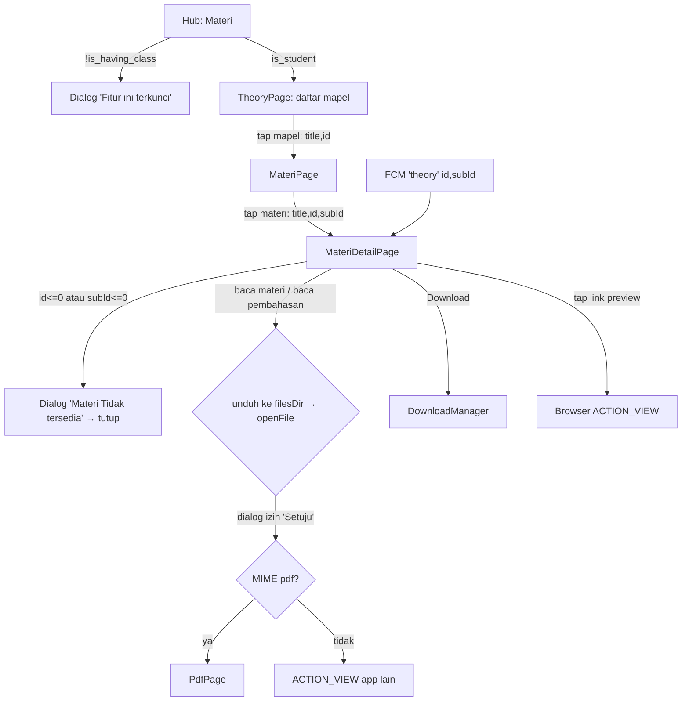
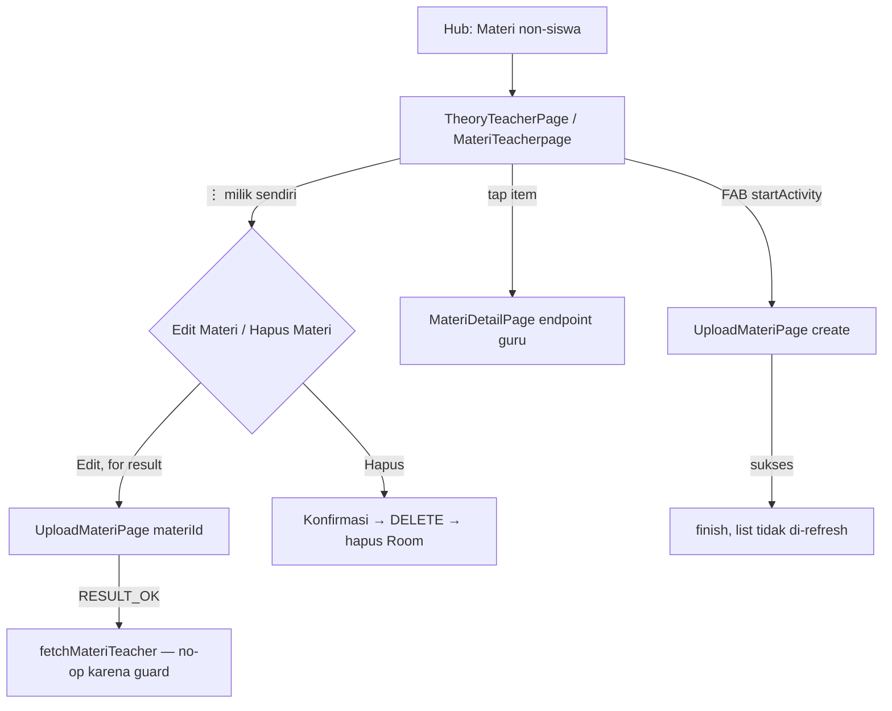
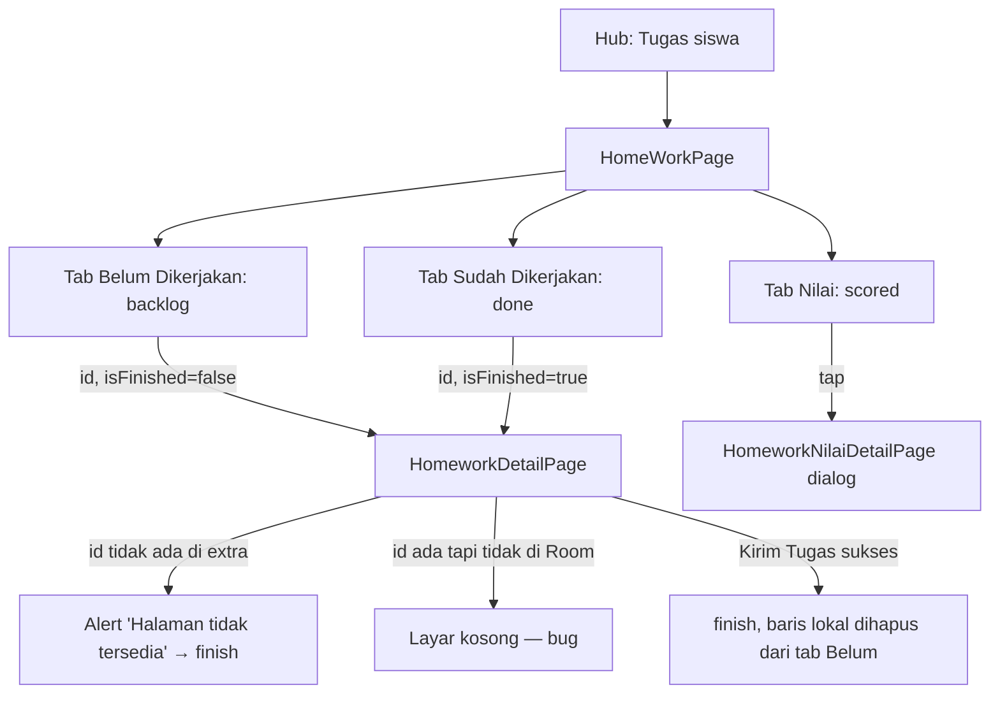
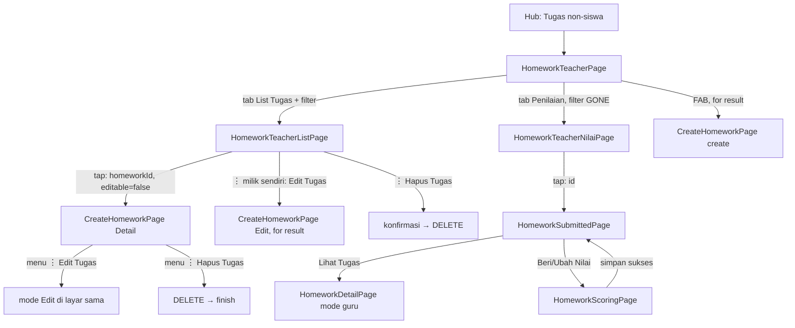
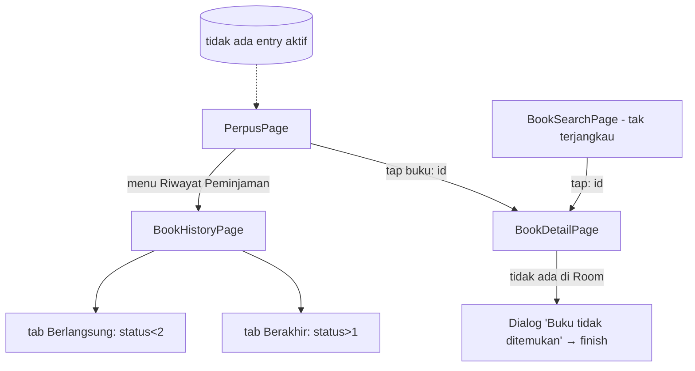
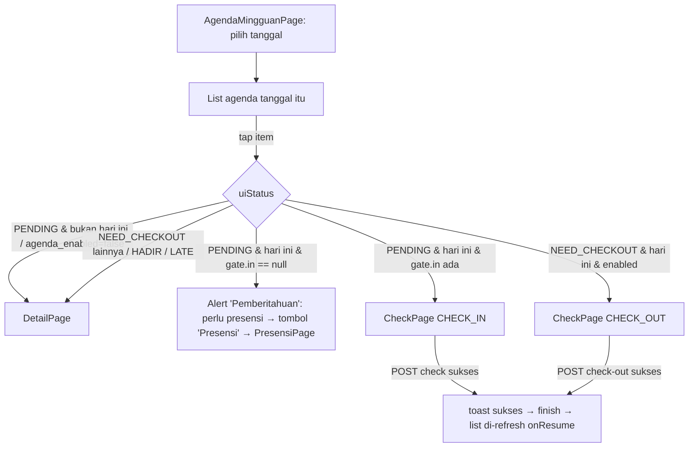
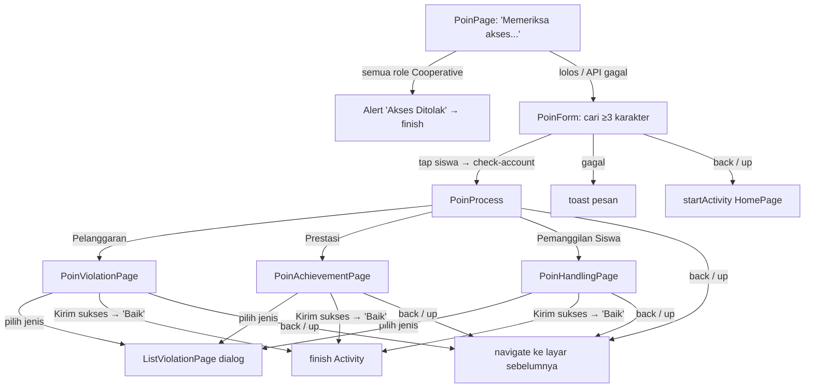

# 05 — Pembelajaran: Hub Menu, Materi, Tugas, Perpustakaan, Agenda Mingguan, Poin

Spesifikasi perilaku modul-modul di bawah tab **Pembelajaran** aplikasi lama `android-portal` (v2.1.40 / versionCode 79):
hub menu `PembelajaranPage`, **Materi** (siswa & guru) beserta viewer PDF custom dan penanganan file/link, **Tugas/PR**
(siswa: kerjakan & kumpulkan; guru: buat, lihat kiriman, beri nilai), **Perpustakaan/KlasPustaka** (kode ada tetapi
tidak dapat dibuka dari UI), **Agenda Mingguan** (guru/staf: lapor masuk/pulang per sesi dengan lokasi), dan **Poin**
(guru: input pelanggaran/prestasi/pemanggilan; siswa: lihat poin sendiri). Presensi, Jurnal KBM, Asesmen (AKM) dan
Magang hanya disinggung sebatas titik masuknya dari hub — perilakunya didokumentasikan di dokumen modul masing-masing.

> Singkatan path: `@/` = `android-portal/app/src/main/java/id/diskola/app/`, `res/` = `android-portal/app/src/main/res/`,
> `Manifest` = `android-portal/app/src/main/AndroidManifest.xml`. Nomor baris mengacu ke kode per 29-09-2026.
> Semua Activity di dokumen ini turunan `Privatepage` (`@/pages/Privatepage.kt:3`). Tidak ada Worker di `@/worker/` yang
> terkait fitur-fitur ini (isinya AKM, chat, ujian, log) — semua unduh/unggah berjalan di coroutine layar.

## Daftar isi
1. [Hub Pembelajaran (`PembelajaranPage`)](#1-hub-pembelajaran-pembelajaranpage)
2. [Materi — Siswa](#2-materi--siswa)
3. [Materi — Guru](#3-materi--guru)
4. [Viewer PDF, buka/unduh file, pilih file, link preview (shared)](#4-viewer-pdf-bukaunduh-file-pilih-file-link-preview-shared)
5. [Tugas — Siswa](#5-tugas--siswa)
6. [Tugas — Guru](#6-tugas--guru)
7. [Perpustakaan / KlasPustaka (tidak terjangkau dari UI)](#7-perpustakaan--klaspustaka-tidak-terjangkau-dari-ui)
8. [Agenda Mingguan (guru/staf)](#8-agenda-mingguan-gurustaf)
9. [Poin — Guru (`PoinPage`)](#9-poin--guru-poinpage)
10. [Poin — Siswa (`PoinStudentPage`)](#10-poin--siswa-poinstudentpage)
11. [Notifikasi & deep link ke modul ini](#11-notifikasi--deep-link-ke-modul-ini)
12. [Ringkasan format tanggal, batas file & jenis file](#12-ringkasan-format-tanggal-batas-file--jenis-file)
13. [❓ Keputusan yang perlu dikonfirmasi](#13--keputusan-yang-perlu-dikonfirmasi)
14. [Selisih dengan dokumen lama](#14-selisih-dengan-dokumen-lama)
15. [Checklist paritas](#15-checklist-paritas)

---

## 1. Hub Pembelajaran (`PembelajaranPage`)

### 1.1 Ringkasan
Fragment beranda tab **Pembelajaran** untuk semua role (siswa, guru, staf/lainnya, tamu). Berisi header sekolah +
notifikasi, kartu identitas & "Kelas Berlangsung" (presensi), tombol verifikasi data, dan **grid menu 3 kolom** yang
membuka modul-modul pembelajaran. Syarat akses menu dibaca dari `PreferenceClass`: `is_having_class`, `is_student`,
`is_teacher`, `role_label`, `has_student_class`, `klaspayActive`.

### 1.2 Titik masuk
- `startDestination` graf `main_nav` (`res/navigation/main_nav.xml:6,27-28`), dan tab bottom-nav `menu_pembelajaran`
  di `HomePage` (`@/pages/home/HomePage.kt:248`). Tidak ada argumen.

### 1.3 Struktur layar (atas → bawah) — `res/layout/pembelajaran_page.xml`
| Elemen | Isi / aturan | Rujukan |
|---|---|---|
| Header | Logo sekolah (`viewmodel.school.image`), nama sekolah, tombol lonceng + badge `badgeCount` | `pembelajaran_page.xml:39-105` |
| Kartu user | Tombol refresh, avatar (avatar user; bila kosong logo sekolah), nama user, `title_class` | `:125-162` |
| `title_class` | Guru (`is_teacher`): email user. Lainnya: nama kelas siswa, jika kosong **"Belum memiliki kelas"** | `PembelajaranPage.kt:262-268` |
| Banner presensi (non-siswa) | `layout_attendance_banner` (lihat dok. Presensi) | `PembelajaranPage.kt:867-978` |
| "Kelas Berlangsung :" | ikon mapel, nama mapel (kosong → **"Tidak terdapat jadwal"**), jam `start - end` | `pembelajaran_page.xml:193-256` |
| Tombol verifikasi | teks default **"verifikasi data"** / diganti **"Verifikasi Data"** / label status approval | `:263-275`, `PembelajaranPage.kt:158-208` |
| Pesan tanpa kelas | **"Anda Belum Terdaftar di Kelas Manapun,\nSilakan Hubungi Admin!!"** | `pembelajaran_page.xml:290` |
| Tombol **"Check In"** / **"Isi Jurnal"** | presensi/jurnal siswa & guru (lihat dok. Presensi) | `:302-336` |
| Grid menu | `rv_menu`, `GridSpacingItemDecoration(3, 8sdp)` | `PembelajaranPage.kt:65-68,212-260,533` |
| "Edutainment" | `tab_ads`/`rv_ads` **visibility gone** (dead UI) | `pembelajaran_page.xml:391-408` |

### 1.4 Alur data saat tampil
- `onResume()` → `loadData()` setiap kali fragment kembali tampil (`PembelajaranPage.kt:78-82,108-272`):
  1. `fetchUnreadNotificationsCount()` hanya jika `klaspayActive`: `GET payment/wallet` → `wallet.user_id` →
     `GET mobile/notification/summary?wallet_id=` → `count_unread` (`PembelajaranVm.kt:49-75`). Badge tampil jika >0,
     teks `"99+"` jika ≥100 (`PembelajaranPage.kt:85-93`).
  2. `sosmedViewModel.checkUser()` + `verifyCurrentUserSession()` (`:112-113`).
  3. Popup tamu (sekali per instance fragment) bila `role_label` = `Guest`: judul **"Anda Masuk sebagai Tamu"**, pesan
     **"Beberapa fitur mungkin terbatas. Lakukan verifikasi data Jika Anda ingin menjadi guru atau siswa, untuk medapatkan akses penuh"**,
     tombol **"Oke, Terimakasi"** (typo dipertahankan) (`:116-127`).
  4. Visibilitas tombol presensi, blok verifikasi, grid menu, `title_class` (di bawah).
- `isActive != true` → alert **"Peringatan"** / **"Akun anda tidak aktif, hubungi admin sekolah untuk aktivasi"** /
  **"Baik"** → logout ke Login (`:283-298`).
- Tombol lonceng: `klaspayActive` → `NotificationPage` (extra `summary_count`); selain itu toast
  **"Silahkan aktivasi wallet terlebih dahulu untuk mengunakan fitur notifikasi"** + buka `KlaspayAktivasiPage` (`:343-357`).
- Tombol verifikasi → dialog **"VERIFIKASI DATA PENGGUNA"** / **"Apakah NISN/NIS/NIK anda telah terdaftar disekolah anda?"**;
  **"Sudah"** → `VerificationPage`; **"Belum"** → `VerificationPage` + extra `requestApproval=true` (`:362-380`).

**Aturan tombol verifikasi & kartu kelas** (`PembelajaranPage.kt:158-208`, sumber `sosmedViewModel.approvalProgress`):
| Kondisi | Hasil |
|---|---|
| `APPROVED` | tombol verifikasi GONE, kartu kelas VISIBLE |
| `CLEAR` + `role_label=Guest` + `is_having_class` | tombol **"Verifikasi Data"** aktif (warna primer), kartu GONE |
| `CLEAR` + `is_student` + `!has_student_class` | tombol GONE, `title_class_now` = **"Pemberitahuan"**, pesan tanpa kelas VISIBLE |
| `CLEAR` + `!is_having_class` | tombol **"Verifikasi Data"** aktif, kartu GONE |
| `CLEAR` lainnya | tombol GONE, kartu VISIBLE |
| `!is_having_class` + `IN_REVIEW`/`REJECTED` | tombol disabled, teks = label approval; abu-abu (IN_REVIEW) / merah (REJECTED) |
| lainnya | tombol GONE, kartu VISIBLE |

Tombol "Check In"/"Isi Jurnal" (siswa) (`:134-155`): hanya bila `is_student && is_having_class && currentSubject.id != 0`;
`attendance_id != null && status kosong` → "Check In"; `attendance_id != null && status terisi` → keduanya GONE;
`attendance_id == null` → "Isi Jurnal". Non-siswa: keduanya selalu GONE di hub (banner presensi yang dipakai, `:867-884`).
Detail aksi (dialog **"Pilih Metode Presensi"**, scan QR, check-in guru) → dokumen Presensi.

### 1.5 Grid menu — isi & routing
Daftar dibangun ulang setiap `loadData()` (`PembelajaranPage.kt:212-248`). `locked = !is_having_class` berlaku untuk
**semua** item (ikon gembok; badge disembunyikan). Label "SOON" (`soon`) tidak pernah tampil di praktik karena item
`soon` hanya dihapus/tidak ada untuk role terkait (`MenuAdapter.kt:38-52`).

| Role (pref) | Urutan item (index 0..n) |
|---|---|
| Siswa (`is_student=true`) | Materi, Tugas, Presensi, Jurnal, Asesmen, Poin, Magang |
| Guru (`is_student=false`, `is_teacher=true`) | Materi, Tugas, Presensi, Jurnal, **Agenda Mingguan**, Poin |
| Lainnya (`is_student=false`, `is_teacher=false`) | Materi, Tugas, Presensi, Jurnal, Poin |

Routing **berdasarkan posisi** (`PembelajaranPage.kt:601-767`); semua cabang: jika `!is_having_class` → dialog locked
**"Fitur ini terkunci"** / **"Oops, nampaknya anda belum terdaftar di kelas manapun. Hubungi admin sekolah anda untuk mengakses fitur ini"** / **"Ok Deh"**
(`res/layout/locked_menu_dialog.xml:24,38,52`).

| Pos | Siswa | Guru | Lainnya |
|---|---|---|---|
| 0 | `TheoryPage` | `TheoryTeacherPage` | `TheoryTeacherPage` |
| 1 | `HomeWorkPage` | `HomeworkTeacherPage` | `HomeworkTeacherPage` |
| 2 | `launchFeature(PRESENSI, PresensiPage)` | idem | idem |
| 3 | `launchFeature(JURNAL_KBM, JurnalPage)` | idem | idem |
| 4 | `AkmPage` | `AgendaMingguanPage` | `PoinPage` |
| 5 | `PoinStudentPage` | `PoinPage` | — |
| 6 | `MagangPage` | — | — |
| lain | dialog **"Fitur dalam pengembangan"** / **"Menu ini sedang dalam proses pembangunan, ditunggu updatenya yah..."** / **"Ok Deh"** (`coming_soon_dialog.xml:24,38,52`) | | |

Badge **Agenda Mingguan** (guru): `fetchMissingCount()` → `GET mobile/attendance/staff/agendas/today`, nilai
`summary.missing` jika `agenda_enabled` else 0 (`AgendaMingguanViewModel.kt:89-100`); tampil bila >0 dan item tidak
locked, `"9+"` jika >9 (`PembelajaranPage.kt:251-259`, `MenuAdapter.kt:43-48`).

### 1.6 Kontrak API (hub)
| Method | Path | Param | Field dipakai | Kapan |
|---|---|---|---|---|
| GET | `payment/wallet` (`ApiService.kt:766-767`) | – | `data.user_id` | onResume, jika `klaspayActive` |
| GET | `mobile/notification/summary` (`:123-126`) | `wallet_id` | `data.count_unread` | setelahnya; gagal → 0 |
| GET | `mobile/attendance/staff/agendas/today` (`:561-562`) | – | `data.agenda_enabled`, `data.summary.missing` | onResume, guru; gagal → 0 |

### 1.7 Data lokal
Pref dibaca: `is_having_class`, `is_student`, `is_teacher`, `role_label`, `has_student_class`, `klaspayActive`.
Tidak menulis pref/Room di layar ini (di luar ViewModel presensi/sosmed).

### 1.8 Catatan migrasi Compose
- Route `@Serializable data object PembelajaranRoute` (tab Home). `PembelajaranScreen` + `PembelajaranViewModel` dengan
  `PembelajaranUiState(menu: List<MenuItemUi>, badgeNotif: Int, agendaMissing: Int, verifyState, ...)`.
  `LazyVerticalGrid(GridCells.Fixed(3))` menggantikan `rv_menu`.
- **Ganti routing index → `enum MenuKey`** (MATERI, TUGAS, PRESENSI, JURNAL, ASESMEN, AGENDA, POIN, MAGANG) agar tidak
  bergantung posisi. ❓ Perilaku lama rusak bila `is_student` **dan** `is_teacher` sama-sama true: item Agenda disisipkan di
  index 4 tetapi routing siswa masih memakai index → label "Agenda Mingguan" membuka `AkmPage`, "Asesmen" membuka
  `PoinStudentPage`, "Poin" membuka `MagangPage`, "Magang" → dialog coming soon (`PembelajaranPage.kt:233-247,651-696`).
- `loadData()` terpanggil tiap onResume dan memanggil 2–4 request; pertahankan (badge harus segar), tetapi gabungkan dalam
  satu `refresh()` VM.

---

## 2. Materi — Siswa

### 2.1 Ringkasan
Siswa melihat daftar mata pelajaran → daftar materi per mapel → detail materi (deskripsi, file materi, link, file
pembahasan). Read-only. Syarat: `is_having_class=true` (hub) dan `is_student=true`. Endpoint dipilih oleh
`TheoryViewModel` berdasarkan pref **`is_teacher`** (`TheoryViewModel.kt:43,176-179,195-198,236-239`), bukan `is_student`.

### 2.2 Titik masuk
- Hub pos 0 (siswa) → `TheoryPage` (tanpa extra).
- Notifikasi FCM `menu="theory"` → langsung `MateriDetailPage` extra `id`, `subId` (`@/services/NotifRouter.kt:77-79`).
- Notifikasi in-app `COURSE/THEORY` → `MateriDetailPage` extra **`child_id`** (tidak dibaca! lihat §11) atau `TheoryPage`.

### 2.3 Peta layar
| Layar | File | Layout | Tujuan |
|---|---|---|---|
| Daftar mapel | `@/pages/theory/TheoryPage.kt` | `theory_page.xml`, item `mapel_item.xml` | → `MateriPage` |
| Daftar materi | `@/pages/theory/MateriPage.kt` | `materi_page.xml`, item `materi_item.xml` | → `MateriDetailPage` |
| Detail materi | `@/pages/theory/MateriDetailPage.kt` | `materi_detail_page.xml` (+2× `materi_detail_item.xml`, `LinkPreview`) | → `PdfPage` / app eksternal / browser / DownloadManager |
| Baca PDF | `@/pages/theory/PdfPage.kt` | `pdf_page.xml` | (§4) |

### 2.4 Detail per layar

**`TheoryPage`** — toolbar **"Materi"** (`theory_page.xml:24`), back = finish.
- Field cari hint **"Cari mata pelajaran"** (`:58`); debounce **400 ms**, trim; filter **lokal Room** `name LIKE %q% OR label LIKE %q%`
  urut `name` (`TheoryPage.kt:91-106`, `TheoryDao.kt:41-46`, `TheoryViewModel.kt:273-278`). Server tidak dipanggil ulang saat mencari.
- List paging (page 20) dari Room tabel `mapel` + `PagedListBoundaryCallback`: kosong → `fetchMapel()`; akhir list →
  jika `hasNextMapel && countMapel >= 20` → `fetchMapel(count)` (`TheoryViewModel.kt:47-65`). Fetch awal juga di `init`
  (`TheoryPage.kt:30-32`).
- Item (`mapel_item.xml`): nama mapel; nama guru (GONE jika kosong, margin atas menyesuaikan); tag `label`
  (`message_label` server, GONE jika kosong, contoh "Baru"); ikon `icon_image`.
- Empty state hanya saat keyword tidak kosong **dan** hasil kosong: ikon + **"Mata pelajaran tidak ditemukan"** /
  **"Coba gunakan kata kunci lain"** (`TheoryPage.kt:66-87`, `theory_page.xml:83-115`). List kosong tanpa keyword → layar kosong.
- Pull-to-refresh → `fetchMapel(0)` (`TheoryPage.kt:46-52`) **tetapi no-op**: guard `prevStart == start` sudah 0 sejak fetch
  awal dan tidak pernah di-reset (`TheoryViewModel.kt:170-174`). ❓
- Tap → `MateriPage` extra `title` = nama mapel, `id` = `mapel.id` (`TheoryPage.kt:114-121`).
- Error jaringan → toast `e.localizedMessage` (`:89`).

**`MateriPage`** — toolbar = extra `title` atau **"Daftar Materi"** (`MateriPage.kt:34-35`).
- onCreate `fetchMateriBySubject(id)`; `start==0` → hapus cache Room materi mapel itu lalu insert (`TheoryViewModel.kt:189-209`).
  Siswa: `GET .../students/subjects/{id}/theories`; guru: `.../teachers/subjects/{id}/theories`.
- Paging 20 dari Room `materi where subject_id=? order by id desc` (`TheoryDao.kt:68-70`).
- Item (`materi_item.xml`): avatar guru (`userTable.user_avatar_image`), judul, `created_at_label` (label server apa adanya),
  nama mapel, nama guru. Tombol opsi hanya jika `isMine` — di layar ini `myId=-1` sehingga tak pernah tampil.
- Empty state default VISIBLE: **"Belum terdapat materi\nSilahkan tunggu guru mengupdate materi"** (`materi_page.xml:43-61`);
  disembunyikan saat list tidak kosong, **tidak pernah ditampilkan ulang** (`MateriPage.kt:72-75`).
- Pull-to-refresh: no-op karena guard `prevStartMateri` (sama seperti mapel). ❓
- Tap → `MateriDetailPage` extra `title`, `id` (materi), `subId` (mapel) (`MateriPage.kt:84-92`).

**`MateriDetailPage`** — toolbar = extra `title` atau **"Detail Materi"** (`MateriDetailPage.kt:36-37`).
- Validasi extra: `id>0 && subId>0` else dialog non-cancelable **"Materi Tidak tersedia"** / **"Halaman yang kamu cari sudah tidak tersedia"** /
  **"Tutup"** → finish (`:42-46,165-173`).
- Loading **"menampilkan detail materi"** (`:47`). Data: Room `getDetailMateri(id)`; jika tidak ada → API detail lalu simpan
  (`TheoryViewModel.kt:162-168,231-258`). Jika ada di Room, **tidak pernah di-refresh dari server**.
- Urutan UI (`materi_detail_page.xml`):
  1. **"Deskripsi"** + teks — keduanya GONE bila deskripsi kosong (`:54-61`).
  2. Kartu file materi (`materi_detail_item.xml`: ikon, nama, **"Download"**, **"baca materi"**) — VISIBLE jika `file_name` dan
     `file_path` tidak kosong; teks `"<file_name> | <ukuran>"` (ukuran dari `file_size` byte → `FileUtils.getStringSizeLengthFile`,
     format `0.00 Kb/Mb/Gb`) (`:63-67`, `@/utils/FileUtils.kt:120-133`). `file_path` dibersihkan dari `\`.
  3. `LinkPreview` link pertama (`uri.link[0]`) — GONE jika tak ada link (`:153-162`).
  4. **"Pembahasan"** + kartu file pembahasan — VISIBLE bila `explanation_file_path` (dari field server `file_edited`,
     `TheoryModels.kt:146,168`) tidak kosong; nama kartu diisi **path/URL mentah** (`:109-113`).
- "baca materi"/"baca materi" pembahasan: loading **"menampilkan data"** → `GET <url>` (endpoint download generik) → tulis ke
  `filesDir/<lastPathSegment>` (fallback nama materi) → `IntentUtil.openFile` (`:69-97,115-142`); error → toast `e.message`.
- "Download": `IntentUtil.downloadFile(uri, file_name, "materi")` (`:100-107`); pembahasan: tipe `"pembahasan materi"`
  **dengan nama file materi (`item.file_name`)**, bukan nama file pembahasan (`:144-151`).

### 2.5 Kontrak API (materi siswa)
| Method | Path (`ApiService.kt`) | Param | Field dipakai UI | Kapan |
|---|---|---|---|---|
| GET | `mobile/app/learning/theories/students/subjects` (`:325-329`) | `take=20`, `skip` | `id,name,icon_image,message_label,teacher{id,name,nip,address,user{id,name,user_avatar_image}}` | buka, paging |
| GET | `.../students/subjects/{subjectId}/theories` (`:331-336`) | `take=20`, `skip` | `id,name,description,message_label,uri.link[],file_path,file_name,file_format,file_type,file_size,created_at_label,subject,teacher,grade,school_class{id},school_major{id},file_edited` | buka, paging |
| GET | `.../students/subjects/{subjectId}/theories/{theoryId}` (`:338-341`) | – | idem (`data`) | detail jika belum di Room |
| GET | `@Url` bebas (`download`, `:82-84`, header `Accept: */*`) | URL file | body byte | baca materi/pembahasan, link preview |

### 2.6 Data lokal (Room `MemoryDB`, file `diskola.db`, dikosongkan saat logout)
| Tabel | Entity | Isi |
|---|---|---|
| `mapel` | `MapelTable` (`TheoryModels.kt:94-113`) | id, name, image, label, teacher_id, user_id |
| `teacher` | `TeacherTable` (`:189-209`) | id, name (pakai `teacher.user.name`), nip, address, sosmed_user_id |
| `materi` | `MateriTable` (`:128-171`) | + `class_id`/`major_id` diambil dari map `school_class.id`/`school_major.id`, `explanation_file_path`=`file_edited` |
| `materi_link` | `MateriLinkTable` (`:173-181`) | unik (materi_id, link) |
| (feed) `user` | `UserTable` | avatar guru |
Pengisian: `OnKlasDbUtil.processMapelResponse/processMateriResponse` (`@/db/OnKlasDbUtil.kt:210-257`). File hasil "baca"
disimpan permanen di `filesDir` (ditimpa per nama).

### 2.7 Perangkat/latar
Izin: hanya dialog penjelasan in-app sebelum membuka file (§4). Tidak ada permission runtime (DownloadManager ke folder app).

### 2.8 Aturan bisnis & edge case
- Tanggal ditampilkan apa adanya dari server (`created_at_label`).
- Search hanya atas data yang sudah pernah di-cache; mapel di halaman berikut yang belum di-fetch tidak ikut tercari.
- Deskripsi tanpa rich-text (TextView biasa).
- Tidak ada pemutar video/YouTube khusus: link apa pun (termasuk YouTube) tampil sebagai `LinkPreview` dan dibuka di app eksternal.
- `file_size` non-numerik → `toLong()` crash (`MateriDetailPage.kt:65`).

### 2.9 Catatan migrasi Compose
- Route: `TheoryRoute`, `MateriListRoute(subjectId: Int, title: String)`, `MateriDetailRoute(materiId: Int, subjectId: Int, title: String? = null)`.
- `TheoryScreen`/`MateriListScreen` pakai Paging 3 (`Pager` + `RemoteMediator` ke Room) → `LazyColumn` + `PullToRefreshBox`;
  `MateriDetailScreen` + `MateriDetailViewModel` (`UiState(loading, materi, links, error)`).
- Bug lama: guard `prevStart*` membuat pull-to-refresh tidak memuat ulang; `detailMateri` mem-post `null` saat fetch gagal
  → observer mengakses `.materi` → **NPE crash** (`TheoryViewModel.kt:162-168`, `MateriDetailPage.kt:48-49`). Crash wajib diperbaiki
  (tampilkan dialog "Materi Tidak tersedia"); perilaku refresh ❓.
- `ViewModel.fetchDetailMateri` punya guard `prefIds` yang tak pernah diisi (dead) (`TheoryViewModel.kt:230-233`).

---

## 3. Materi — Guru

### 3.1 Ringkasan
Pengguna non-siswa (guru/staf/tamu berkelas) mengelola **"Materi Saya"**: daftar materi milik guru login dengan filter
Kelas / Mata Pelajaran, membuat, mengedit, menghapus materi, dan membuka detail (layar detail siswa, endpoint guru).
Kepemilikan: pref `teacher` (JSON `TeacherItem`, dipakai `teacher.id` untuk query Room) dan pref `user_id` (untuk menu
opsi, dibandingkan `teacher.sosmed_user_id`).

### 3.2 Titik masuk
Hub pos 0 (non-siswa) → `TheoryTeacherPage`. `UploadMateriPage` dibuka dari FAB (create, tanpa extra) atau opsi "Edit
Materi" (extra `materiId`, via ActivityResult).

### 3.3 Peta layar
| Layar | File | Layout | Catatan |
|---|---|---|---|
| Shell | `@/pages/theoryteacher/TheoryTeacherPage.kt` | `theoryteacher_page.xml`, nav `theory_teacher_nav.xml` | toolbar **"Materi"**, FAB `btn_add`; tab **"Materi Saya"**/**"Mata Pelajaran"** ada tetapi kontainernya `visibility=gone` (`theoryteacher_page.xml:24-61`) |
| Materi Saya | `MateriTeacherpage.kt` | `materi_teacher_page.xml` | start destination |
| Mata Pelajaran | `MapelTeacherPage.kt` | `mapel_teacher_page.xml` | **tak terjangkau** (tab tersembunyi) |
| Form | `UploadMateriPage.kt` + `UploadMateriViewmodel.kt` | `upload_materi_page.xml`, `materi_upload_item.xml` | create/edit |
| Detail | `@/pages/theory/MateriDetailPage.kt` | — | §2.4 |

### 3.4 Detail per layar

**`MateriTeacherpage`** (`MateriTeacherpage.kt`)
- Dua dropdown (label **"Kelas"**, **"Mata Pelajaran"**) default teks **"Semua"** (`:75-81,101-107`).
  - Kelas: `GET mobile/app/learning/assignment/teachers/class` (selalu dipanggil saat buka, disimpan ke Room `classroom`),
    item "Semua" + kelas urut `grade` lalu nama (case-insensitive), tampilan `"<grade> - <name>"` jika grade>0 (`:66-81,226-227`).
  - Mapel: Room `mapel` (urut nama); jika kosong → `GET mobile/app/learning/theories/teachers/subjects` (tanpa paging) (`:94-100`,
    `TheoryViewModel.kt:135-160`).
  - Memilih Kelas → query `teacher_id & class_id` (mapel diabaikan); memilih Mapel → `teacher_id & subject_id` (kelas diabaikan).
    Filter **tidak dikombinasikan** dan teks dropdown lain tidak di-reset (`:82-118`). ❓
- List: Room `materi where teacher_id=? [and ...] order by id desc` (`TheoryDao.kt:76-99`); boundary → `GET .../teachers/theories`
  `take=20, skip, school_subject?, school_class?`; `start==0` → **hapus seluruh tabel materi** (`TheoryViewModel.kt:213-228`).
- Empty state **"Belum terdapat materi\nSilahkan upload materi untuk siswa"** di-toggle dua arah (`:155-162`, `materi_teacher_page.xml:147`).
- Pull-to-refresh: reset guard lalu `fetchMateriTeacher(0)` (bekerja) (`:47-55`). Catatan: yang di-refresh hanya endpoint tanpa filter.
- Item = `materi_item.xml`; tombol ⋮ tampil jika `pref.user_id == teacher.sosmed_user_id` (`:176`, `MateriAdapter.kt:35-44`).
- ⋮ → dialog list **"Edit Materi"**, **"Hapus Materi"** (`:178-179`).
  - Edit → `UploadMateriPage` extra `materiId` (ActivityResult). RESULT_OK → `fetchMateriTeacher()` yang **no-op** karena guard
    `prevStartTeacherMateri` tidak di-reset (`:215-224`). ❓
  - Hapus → dialog **"Anda yakin akan menghapus materi?"**, **"Hapus"** / **"Batal"** (neutral) → `ProgressDialog` **"menghapus materi"** →
    `DELETE .../teachers/theories/{id}` → sukses: hapus baris Room (`:189-209`). Gagal: tidak ada toast (fragment/activity tak
    mengamati `errorString`). ❓
- Tap item → `MateriDetailPage` (`title,id,subId`) (`:168-174`).

**`MapelTeacherPage`** (tersembunyi): list mapel paging (`teacherSubject`), tap → `MateriPage` (`MapelTeacherPage.kt:38-83`).

**`UploadMateriPage`** — toolbar **"Upload Materi"** (juga saat edit) (`upload_materi_page.xml:34`); back = finish.
Urutan form (`upload_materi_page.xml`):
| # | Label | Kontrol | Aturan |
|---|---|---|---|
| 1 | **"Judul Materi"** | EditText hint **"Ketik Judul disini"**, multiline, `maxLength=500`, counter `"n/500"` | wajib (`:48-92`, `UploadMateriPage.kt:93-95`) |
| 2 | **"Deskripsi"** | hint **"Ketik deskripsi"**, `maxLength=5000`, counter `"n/5000"` | opsional (`:94-138`) |
| 3 | **"Mata Pelajaran"** | dropdown nama mapel | wajib (`subjectId>0`) (`:140-169`) |
| 4 | **"Ditampilkan ke"** | Radio **"Jenjang"** (default checked) + dropdown grade; **"Jurusan"** + dropdown (disabled); **"Kelas"** + dropdown (disabled, tampil `"grade - name"`) | eksklusif: memilih satu men-disable dua lainnya (latar abu `ltgray`) dan me-reset nilainya ke 0 (`UploadMateriPage.kt:150-214`) |
| 5 | **"File Materi"** / **"Upload file"** / **"File dalam format pdf"** | kartu `materi_upload_item`: ikon, info, tombol **"Lampirkan File"** | picker SAF multi-MIME (§4.4), `allowMultiple=true` tapi hanya file terakhir yang dipakai (`:38-67,218-224`) |
| 6 | **"Url Link"** | hint **"Ketik url"**, `maxLength=5000` + `LinkPreview` | debounce 1000 ms (Timer); gagal → toast **"gagal menampilkan preview url"** (`:226-256`) |
| 7 | — | **"Posting materi"** | enabled jika judul ≠ kosong && `subjectId>0` && (file || link) (`:289-298`, `:141-143`) |
- Setelah pilih file: ikon PDF (`ic_pdf`) untuk MIME pdf, thumbnail untuk gambar; info `"<nama> (ukuran: <X Kb/Mb>)"` (`:43-63`).
- Posting: loading **"sedang mengupload materi"** → `createMateri()` → sukses `setResult(RESULT_OK)` + tutup (`:258-268`).
  - File > **12 MB** (12×1024×1024 byte) → toast **"ukuran file melebihi batas maksimal (12Mb)"**, batal (`UploadMateriViewmodel.kt:155-157`).
  - Multipart: `name`, `description`, `link`, `school_subject_id`, lalu satu dari `school_classes_id` / `school_major_id` / `grade`
    sesuai radio; part file `file` (nama asli, MIME dari ekstensi) (`:159-188`). Create `POST .../teachers/theories`, edit
    `POST .../teachers/theories/update/{id}` (`:190-192`). Response tidak diproses (Room tidak diperbarui).
  - Error → toast `e.localizedMessage` atau **"Gagal membuat materi"** (`:196-199`).
- Mode edit (`materiId>0`): prefill dari **Room** (`setMateri`, `:67-96`): judul, deskripsi, link pertama, mapel, grade/kelas/jurusan,
  radio dari `major_id>0 → Jurusan`, `class_id>0 → Kelas`, else Jenjang; info file `"<file_name> (ukuran: <file_size mentah>)"` (byte, tidak diformat).
- Loading **"mohon tunggu"** selama `isLoading` (`:84-89`).
- Sumber dropdown (VM `init`, `:202-244`): mapel selalu dari API `teachers/subjects`; grade Room→`GET mobile/teacher/school-grade`;
  kelas Room→`GET mobile/teacher/school-class-room`; jurusan Room→`GET .../teachers/school-majors?take=1000`. Disimpan juga ke
  singleton `UploadMateriBindConverter` untuk konversi id↔nama two-way binding (`UploadMateriBindConverter.kt:10-69`).

### 3.5 Kontrak API (materi guru)
| Method | Path (`ApiService.kt`) | Param/Body | Dipakai | Kapan |
|---|---|---|---|---|
| GET | `.../theories/teachers/subjects` (`:346-353`) | `take,skip` / tanpa param | mapel | list mapel / dropdown |
| GET | `.../theories/teachers/theories` (`:361-367`) | `take=20,skip,school_subject?,school_class?` | list Materi Saya | buka, paging, filter |
| GET | `.../teachers/subjects/{s}/theories[/{t}]` (`:369-379`) | – | materi/ detail | MateriPage/Detail (guru) |
| POST multipart | `.../teachers/theories` (`:381-386`) | PartMap + `file?` | – | create |
| POST multipart | `.../teachers/theories/update/{id}` (`:388-394`) | idem | – | edit |
| DELETE | `.../teachers/theories/{id}` (`:396-397`) | – | – | hapus |
| GET | `mobile/app/learning/assignment/teachers/class` (`:440-441`) | – | `id,name,grade,majorId` | filter kelas |
| GET | `mobile/teacher/school-class-room` (`:343-344`) | – | kelas | form |
| GET | `mobile/teacher/school-grade` (`:399-400`) | – | `id,name` | form |
| GET | `.../theories/teachers/school-majors` (`:358-359`) | `take=1000` | `id,name` | form |

### 3.6 Data lokal
Tabel `materi`, `mapel`, `mapel_teacher` (`MapelTeacherCrossRef`), `grade`, `major`, `classroom` (Room `MemoryDB`). Pref:
`teacher`, `user_id`, `is_teacher`.

### 3.7 Perangkat/latar
Picker file SAF (tanpa permission storage). Upload berjalan di coroutine Activity (tidak tahan process death, tanpa progress %).

### 3.8 Aturan bisnis & edge case
- Tidak ada validasi target "Ditampilkan ke": jika Jenjang tidak dipilih, `grade` dikirim sebagai string `"null"` (`UploadMateriViewmodel.kt:176`). ❓
- Label "File dalam format pdf" tetapi picker menerima pdf, gambar, doc/docx, xls/xlsx, ppt/pptx.
- Materi yang baru dibuat **tidak muncul** sampai pull-to-refresh (FAB memakai `startActivity`, bukan for-result) (`TheoryTeacherPage.kt:45-49`). ❓

### 3.9 Catatan migrasi Compose
- Route: `TheoryTeacherRoute`, `UploadMateriRoute(materiId: Int = 0)`; hasil lewat `savedStateHandle`/`SharedFlow` "materiChanged".
- `ExposedDropdownMenuBox` untuk dropdown; `RadioButton` group; `OutlinedTextField` + `supportingText` counter.
- Hilangkan singleton `UploadMateriBindConverter` (state di VM). `NoFilterArrayAdapter` → dropdown biasa.

---

## 4. Viewer PDF, buka/unduh file, pilih file, link preview (shared)

Dipakai Materi, Tugas, Poin.

### 4.1 `PdfPage` (`@/pages/theory/PdfPage.kt`, `res/layout/pdf_page.xml`)
- Extra: `file_path` (path lokal **atau** URL), `title` (default **"Baca PDF"**) (`:31-39`). Toolbar XML default "Detail Materi".
- Alur (`:41-93`):
  1. Jika `File(file_path)` ada → sembunyikan progress, render.
  2. Else anggap URL: cache `filesDir/"<lastPathSegment ?: title>.pdf"`; jika ada → render.
  3. Else toast **"Sedang membuka file"** → `GET <url>` → tulis → render. Pesan error yang disiapkan
     **"Gangguan koneksi ketika membuka file, silahkan ulangi beberapa saat lagi"** (alert → finish) **tidak pernah tampil**
     karena `try/catch` membungkus `launchWhenCreated`, bukan isi coroutine → exception jaringan = crash. (Perbaiki crash.)
- Dalam praktik `PdfPage` dibuka dari `IntentUtil.openFile` dengan path lokal yang sudah diunduh (langkah 1).
- Kontrol halaman (tombol atas/bawah + label "1/999") VISIBLE di XML tetapi listener-nya di-comment → tombol tak berfungsi,
  label kosong, tidak pernah auto-hide (`pdf_page.xml:44-90`, `PdfPage.kt:96-154`). ❓

### 4.2 Viewer custom `@/utils/pdfviewer/*`
| Komponen | Perilaku |
|---|---|
| `PdfViewer.Builder(root, scope)` | default kualitas `QUALITY_1080`, `maxZoom=3f`, zoom aktif, dispatcher render `Dispatchers.IO`, tanpa `OnErrorListener` (`PdfViewer.kt:102-166`); `load(file)` → `setup(file)`; IOException/SecurityException hanya diteruskan ke listener (null → senyap, layar kosong) |
| `PdfViewControllerImpl` | `file.deleteOnExit()` lalu set adapter (`PdfViewControllerImpl.kt:27-30`); listener halaman berdasarkan item terakhir yang terlihat penuh (`:63-76`) |
| `PdfPageRenderer` | `android.graphics.pdf.PdfRenderer` read-only; bitmap lebar = kualitas (1080 px), tinggi proporsional, `ARGB_8888`, `RENDER_MODE_FOR_DISPLAY`; dedup render paralel per halaman via `Mutex`+map `Deferred` (tidak ada cache bitmap) (`PdfPageRenderer.kt:17-79`). Renderer/FD tak pernah di-close |
| `ZoomableRecyclerView` + `ZoomableLinearLayoutManager` | list vertikal semua halaman; pinch zoom 1×–3× berpusat di fokus; geser saat zoom; scroll dikonsumsi translasi dulu (`ZoomableRecyclerView.kt:19-134`) |
| `DefaultPdfPageViewHolder` | render async per bind, tinggi ImageView = `page.h × view.w / page.w` (`:21-31`) |
| `FileLoader`/`LoadFileDelegate` | salin URL/Uri/raw/stream ke `cacheDir/temp.pdf` (buffer 4 KB) — **tidak dipakai** `PdfPage` |
| `@/utils/PdfVerticalViewPager.kt` | seluruh file di-comment (dead) |

### 4.3 Membuka & mengunduh file (`@/utils/IntentUtil.kt`)
- **Baca/Lihat** (pola sama di materi, tugas, pembahasan, jawaban): layar mengunduh via `apiService.download(url)` ke
  `filesDir/<lastPathSegment>` (seluruh body di memori: `bytes()`), lalu `openFile(activity, file, title)` (`:427-457`):
  1. Dialog **"Akses File Diperlukan"** / **"Aplikasi ini membutuhkan akses ke penyimpanan Anda untuk memilih atau membuka file dalam proses unggah dokumen tugas dan materi. Data ini hanya digunakan dalam aplikasi dan tidak akan dibagikan tanpa izin Anda."** /
     **"Setuju"** / **"Batal"** (`:690-700`). "Batal" → tidak terjadi apa-apa.
  2. MIME dari ekstensi; `pdf` → `PdfPage(file_path, title)`; lainnya → `ACTION_VIEW` + `FileProvider` authority `${applicationId}`
     (`Manifest:700-701`, `OnKlasFileProvider`) + `FLAG_GRANT_READ_URI_PERMISSION`. Ekstensi tak dikenal → diam. Exception → toast **"Gagal membuka file"**.
- **Download** `downloadFile(activity, uri, fileName, fileType)` (`:339-371`): URI kosong → toast **"<fileType> tidak tersedia, mohon ulangi beberapa saat lagi"**;
  else toast **"proses download <fileType> akan dimulai sesaat lagi"** → `DownloadManager` ke `getExternalFilesDir(DIRECTORY_DOWNLOADS)/<fileName>`,
  notifikasi sistem `VISIBILITY_VISIBLE_NOTIFY_COMPLETED`, tanpa permission. Nilai `fileType` yang dipakai: `materi`, `pembahasan materi`, `soal`, `pembahasan tugas`, `jawaban`.

### 4.4 Memilih file (`IntentUtil.pickFile`, `:657-688`) & path
- `ACTION_OPEN_DOCUMENT`, `type */*`, `EXTRA_MIME_TYPES` = pdf, jpeg, png, `image/*`, msword, docx, ms-excel, xlsx, ms-powerpoint, pptx;
  `EXTRA_ALLOW_MULTIPLE` sesuai pemanggil; `takePersistableUriPermission`.
- `handleResult` (`:702-733`): kumpulkan `data` + `clipData`; per URI → path (`MediaStore.DATA`; fallback **salin ke `cacheDir/<displayName>`**),
  MIME, `(displayName, size)` (`:735-807`). Pemakai mengunggah dari path lokal ini.

### 4.5 `LinkPreview` (`@/utils/LinkPreview.kt:30-117`)
Label loading **"memproses url"** (`res/layout/link_preview.xml:28`). Unduh HTML via `apiService.download(url)` → Jsoup:
judul `og:title`→`<title>`; deskripsi `meta[name=description]`→`Description`→`og:description`; gambar `og:image`→`link[rel=image_src]`→
`apple-touch-icon`→`icon` (Glide). Gagal → ikon *broken link*, URL tetap tampil. Tap kartu → `ACTION_VIEW` URL (browser/YouTube app).

### 4.6 Catatan migrasi Compose
- PDF: `PdfRenderer` + `LazyColumn` of `Image` + `Modifier.transformable` (zoom 1–3×, lebar render 1080 px) atau library
  (mis. `androidx.pdf` bila tersedia); tutup renderer di `DisposableEffect`. Route `PdfViewerRoute(filePath: String, title: String)`.
- Unduh file baca → `OkHttp` streaming ke file (hindari `bytes()`); satu `FileRepository.openRemote(url, title)` bersama.
- Picker → `rememberLauncherForActivityResult(OpenMultipleDocuments / OpenDocument)`; salin ke cache via `ContentResolver`.
- Dialog izin file hanya penjelasan (tak ada permission runtime) — pertahankan agar identik (❓ opsional dihapus).

---

## 5. Tugas — Siswa

### 5.1 Ringkasan
Siswa melihat tugas per status (tab **Belum Dikerjakan / Sudah Dikerjakan / Nilai**), membuka detail, membaca/unduh soal,
melampirkan **banyak file** dan/atau link jawaban, lalu **"Kirim Tugas"**; melihat nilai dan pembahasan. Syarat: hub
`is_having_class=true` & `is_student=true`. `HomeWorkViewModel.fetchHomeworkTodo` memilih endpoint guru bila pref
`is_teacher` (`HomeWorkViewModel.kt:140`).

### 5.2 Titik masuk
- Hub pos 1 (siswa) → `HomeWorkPage`.
- FCM `menu="task"` → `HomeWorkPage` + extra `id`, `isFinished=false` — **extra diabaikan** (`@/services/NotifRouter.kt:80-82`); FCM `"penilaian"` → `HomeWorkPage` (`:72`).
- In-app `COURSE/EXAM` → `HomeworkDetailPage` extra `child_id` (tertukar & tak terbaca, §11).
- Dari list: `HomeworkDetailPage` extra `id` (Int, id tugas), `isFinished` (Belum=false, Sudah=true) (`HomeworkBelumPage.kt:105-111`, `HomeworkSudahPage.kt:109`).

### 5.3 Peta layar
| Layar | File | Layout | Catatan |
|---|---|---|---|
| Shell + tab | `@/pages/homework/HomeWorkPage.kt` | `homework_page.xml`, nav `homework_nav.xml` | toolbar **"Tugas"** |
| Tab Belum | `HomeworkBelumPage.kt` | `homework_belum_page.xml`, `homework_belum_item.xml` | start destination |
| Tab Sudah | `HomeworkSudahPage.kt` | `homework_sudah_page.xml`, `homework_sudah_item.xml` | |
| Tab Nilai | `HomeworkNilaiPage.kt` | `homework_nilai_page.xml`, `homework_nilai_item.xml` | tap → dialog |
| Detail nilai (dialog fullscreen) | `HomeworkNilaiDetailPage.kt` (`PageDialogFragment`) | `homework_nilai_detail_page.xml` | |
| Detail & kumpulkan | `HomeworkDetailPage.kt` | `homework_detail_page.xml` (+`homework_soal_file_item`, `homework_upload_zone`, `homework_answer_file_item`, `materi_detail_item`) | |
| Filter (dead) | `HomeworkFilterPage.kt` | `homework_filter_page.xml` | ikon filter disembunyikan |
Semua item list memakai meta `homework_student_item_meta.xml`: nama mapel (GONE jika kosong) dan **"Guru · <nama>"**.

### 5.4 Status tugas & aturan penentuannya
Status **tidak dihitung di client** dari tanggal; murni dari endpoint & flag server:
| Status UI | Sumber | Room `homework.type` | Tampilan |
|---|---|---|---|
| Belum dikerjakan | `GET .../students/backlog`, `is_overdue=false` | 0 | **"Berakhir pada " + end_at_label** (abu) (`homework_belum_item.xml:72-73`) |
| Terlambat | backlog, `is_overdue=true` | 0 | **"Terlambat dari " + end_at_label** (merah); di detail info merah **"Waktu pengumpulan tugas terlambat"**; tetap boleh kumpul |
| Dikumpulkan / Sudah | `GET .../students/done` | 1 | `information_label` server (`homework_sudah_item.xml:57`) |
| Dinilai | `GET .../students/scored` | 2 | lingkaran skor `score` + `information_label` (`homework_nilai_item.xml:38,74`) |
- `type` ditulis sesuai endpoint terakhir yang memuat tugas itu (REPLACE) (`OnKlasDbUtil.kt:345-360`).
- Hanya tugas dengan `school.uuid == pref school.uuid` yang disimpan (`OnKlasDbUtil.kt:347`).
- Tag kanan atas item Belum = `message_label` (INVISIBLE jika kosong) (`homework_belum_item.xml:36-40`).

### 5.5 Detail per layar

**`HomeWorkPage`**: tab MaterialButton outline **"Belum Dikerjakan"** (default aktif: stroke & teks primer), **"Sudah Dikerjakan"**,
**"Nilai"**; klik → `navigate(action_global_*)` + ganti warna (`HomeWorkPage.kt:39-55,70-80`). Baris filter (**"Tampilkan: Semua"** + ikon)
selalu GONE (`toggleFilter(false)`, `:37,82-88`). onCreate `fetchHomeworkTodo()` (`:61-63`). Back → tutup activity (`:66-68`).

**Tab Belum / Sudah / Nilai** (pola identik): page size **10**, Room order `id desc` (`HomeworkDao.kt:33-52`), boundary →
fetch awal & `count>=10 && hasNext` → fetch berikut (`HomeWorkViewModel.kt:118-206`). Saat fragment dibuat: Belum & Nilai reset
guard lalu fetch (`HomeworkBelumPage.kt:78-81`, `HomeworkNilaiPage.kt:77-80`); **Sudah tidak reset guard** (`HomeworkSudahPage.kt:80`)
→ tidak memuat ulang saat tab dibuka lagi. Pull-to-refresh: reset guard + fetch (ketiganya). Data lama **tidak pernah dihapus**
(tugas yang dihapus guru tetap tampil). Empty state:
- Belum: **"Belum terdapat tugas"** (default VISIBLE); Sudah: **"Belum terdapat rekap tugas"** (default GONE); Nilai: **"Belum terdapat rekap tugas"**.
- Error jaringan list: **tidak ada toast** — `HomeWorkPage` dan fragment tab tidak mengamati `errorString` (hanya `HomeworkDetailPage.kt:419` yang mengamati).

**`HomeworkNilaiDetailPage`** (dialog, `HomeworkNilaiDetailPage.kt:31-83`): toolbar = judul atau **"Detail Tugas"**; ikon & nama mapel, nama
guru, skor, `information_label`; **"Pembahasan"** + kartu (VISIBLE bila `explanation_file_path`) dengan nama = path mentah (menimpa
binding `file_pembahasan_<judul>`), tombol **"baca materi"** (unduh → openFile) & **"Download"** (tipe `"pembahasan tugas"`, nama file =
judul tugas tanpa ekstensi).

**`HomeworkDetailPage`** (`HomeworkDetailPage.kt`)
- Loading **"menampilkan detail tugas"**; `id` extra ≤0/absen → alert **"Halaman tidak tersedia"** → finish (`:119-121,411-416`).
  Data **hanya dari Room** (`getDetailHomework`); jika tidak ada → layar kosong tanpa pesan (`:124`). ❓
- Toolbar = judul atau **"Detail Tugas"** (`homework_detail_page.xml:60`).
- Urutan UI (atas → bawah):
  1. Info status (`info_label`): `isFinished` → **"Kamu sudah mengerjakan tugas"** (primer); else `is_overdue` → **"Waktu pengumpulan tugas terlambat"** (merah); else GONE (`:176-184`).
  2. Kartu **"Syarat pengumpulan"** (hanya siswa, belum selesai, dan `needRead || needUpload`) (`:441-449`): baris **"Baca soal"** (jika
     `downloded>0`) dan **"Upload jawaban"** (jika `uploaded>0`); lingkaran nomor `1`/`2` → `✓`; tag **"Belum"**/**"Selesai"** (`:455-512`).
  3. **"Deskripsi"** (GONE jika kosong).
  4. Seksi **"Soal"** (VISIBLE jika ada `file_path` atau link guru): badge **"WAJIB DIBACA"** + sub **"Baca sampai selesai sebelum mengumpulkan jawaban."**
     bila `downloded>0` (`:186-188`); kartu file: kode format (≤4 huruf kapital dari `file_format`/ekstensi), nama, ukuran, tombol **"Download"**
     (tipe `"soal"`) & **"Baca tugas"** (→ **"Sudah dibaca ✓"** setelah syarat baca terpenuhi) (`:191-243,474-490`); preview link guru.
  5. Seksi **"Jawaban terkumpul"** (jika ada file jawaban/link jawaban): meta **"1 file terlampir"** / **"n file terlampir"**; tiap file: ikon per
     format (jpg/png/webp/gif hijau, doc biru-hitam, xls kuning, ppt merah, lainnya pdf), nama, `"FORMAT · ukuran"`, **"Baca"** & **"Download"** (tipe `"jawaban"`);
     path kosong → toast **"File tidak tersedia"** (`:422-438,549-596`, `HomeworkAnswerFilesAdapter.kt:53-87`). Path relatif diberi prefix `BuildConfig.ASSETS_URL` (`HomeWorkModels.kt:243-248`).
  6. Seksi **"Kumpulkan jawaban"** (hanya jika `allowUpload`) + badge **"WAJIB"**, info **"jpeg, png, pdf, doc, xls, ppt · maks. 12 MB/file"**, zona unggah
     **"Ketuk untuk lampirkan file"** / **"Bisa lebih dari 1 file"** / **"Lampirkan File"** (→ **"<n> file dipilih"**), daftar file terpilih (nama, ukuran, tombol hapus),
     **"Atau tempel link"** + **"OPSIONAL"**, input hint **"https://"**, loading **"memproses url"**, preview (`homework_detail_page.xml:418-576`).
  7. **"Pembahasan"** + kartu (jika `explanation_file_path`) — tombol **"baca materi"**/**"Download"** (tipe `"pembahasan tugas"`).
  8. Bar bawah sticky (siswa & belum selesai): status + tombol **"Kirim Tugas"** (`:602-637`).
- **Aturan** (`:155-160,246-266,317-408`):
  - `allowUpload = homework.uploaded == 1 && !isFinished && is_student`.
  - Jawaban: cache Room `homework_student_file` → jika kosong & ada `student_assignment_id` (kolom atau pref `hw_sa_<id>`) →
    `GET .../students/{id}/collect/{studentAssignmentId}` lalu cache.
  - Link jawaban siswa (src=1): jika `allowUpload` dimuat ke preview input; else ditampilkan di seksi jawaban.
  - Syarat (`instruction`): `downloded>0` → "Silahkan baca/download soal terlebih dahulu" terpenuhi saat tap **Baca tugas** (setelah file terunduh,
    walau dialog izin dibatalkan), tap **Download**, atau tap preview link guru; `uploaded>0` → "Lampirkan file jawaban atau tempel link untuk mengumpulkan tugas"
    terpenuhi saat ≥1 file dipilih atau preview link sukses. Menghapus file / mengosongkan link **tidak** mengembalikan syarat. ❓
  - Status bawah: semua terpenuhi → **"Semua syarat terpenuhi ✓"** (teal) & tombol aktif; else **"Lengkapi <baca soal & upload jawaban> untuk mengirim"**
    (bagian yang kurang berwarna oranye) & tombol disabled (`:514-546`). Alert **"Belum bisa mengirim"** + butir "• ..." + **"Mengerti"** hanya
    jalur cadangan (tombol disabled tak bisa ditekan) (`:392-402`).
  - Tanpa syarat (downloded=0 & uploaded=0) → kartu syarat GONE, tombol aktif; siswa tetap bisa "Kirim Tugas" (menandai `checked=1`).
- **Kirim** (`:384-392`, `HomeWorkViewModel.kt:410-464`): loading **"sedang mengumpulkan tugas"**. Validasi per file:
  ekstensi ∉ {jpeg,jpg,png,pdf,doc,docx,xls,xlsx,ppt,pptx} → **"Format file tidak didukung: <nama>"**; ukuran > 12 288 KB → **"Ukuran maksimal 12 MB per file: <nama>"**.
  Multipart `checked=1`, `uploaded` = `1` jika ada file/link else `0`, `link`, parts `file[]`. Sukses → simpan file jawaban + pref
  `hw_sa_<id>`, kosongkan pilihan, **hapus baris tugas dari Room**, `finish()` (tanpa result). Error → toast `localizedMessage`.

### 5.6 Kontrak API (tugas siswa)
| Method | Path (`ApiService.kt`) | Param/Body | Field dipakai | Kapan |
|---|---|---|---|---|
| GET | `mobile/app/learning/assignment/students/backlog` (`:402-406`) | `take=10,skip` | `HomeworkItem` (`HomeWorkModels.kt:40-89`): id,title,description,is_overdue,checked,downloded,uploaded,information_label,file_*,message_label,end_at_label,upload_at_label,file_student_*,files[],score,school.uuid,subject,teacher,class,uri,uri_student,schedule,file_edited | buka, paging, refresh |
| GET | `.../students/done` (`:414-418`) | idem | idem | tab Sudah |
| GET | `.../students/scored` (`:420-424`) | idem | + score | tab Nilai |
| POST multipart | `.../students/{id}/collect` (`:426-432`) | `checked,uploaded,link`, `file[]` | `data.id`, `data.files[]`/`file_*` | Kirim |
| GET | `.../students/{subjectAssignmentId}/collect/{studentAssignmentId}` (`:434-438`) | – | `student_assignment.files` | detail tanpa cache jawaban |

### 5.7 Data lokal
| Tabel | Isi |
|---|---|
| `homework` (`HomeworkTable`, `HomeWorkModels.kt:110-152`) | semua field + `type`, `explanation_file_path` (=`file_edited`), `student_assignment_id`, `scheduleDay`, `scheduleTimePlot` |
| `homework_link` (`:181-187`) | src 0=guru, 1=siswa |
| `homework_student_file` (`:154-167`) | file jawaban per tugas |
| `classroom`, `mapel`, `teacher`, `mapel_teacher`, `user` | relasi tampilan |
Pref: `hw_sa_<homeworkId>` (Int) (`HomeWorkViewModel.kt:390,405-408`), `is_student`, `school`.

### 5.8 Perangkat/latar
SAF multi-file; unduh "baca" ke `filesDir`; DownloadManager. Upload multi-file di coroutine Activity.

### 5.9 Catatan migrasi Compose
- Route: `HomeworkRoute(initialTab: HomeworkTab = BELUM)` dengan `HorizontalPager`/`TabRow`; `HomeworkDetailRoute(id: Int, isFinished: Boolean)`;
  `HomeworkScoreDetail` sebagai dialog/sheet.
- `HomeworkDetailViewModel` → `UiState(item, answerFiles, selectedFiles, link, needRead, needUpload, readDone, uploadDone, submitting)`.
  Pindahkan logika syarat dari Activity ke VM.
- Bug: guard `pref*` menahan refresh tab Sudah setelah mengumpulkan ❓; detail kosong jika tugas belum di Room (perlu endpoint detail) ❓;
  `HomeworkFilterPage` (judul toolbar salah **"Metode Pembayaran"**) tidak terhubung ke data — usul tidak dimigrasi ❓.

---

## 6. Tugas — Guru

### 6.1 Ringkasan
Guru (non-siswa) melihat **"List Tugas"** buatannya (filter Kelas & Mapel), membuat/mengedit/menghapus tugas (terikat jadwal
kelas-hari-mapel), melihat **"Penilaian"** (rekap kiriman per tugas), membuka daftar jawaban siswa, dan memberi nilai 0–100.

### 6.2 Titik masuk
Hub pos 1 (non-siswa) → `HomeworkTeacherPage`. Tidak ada notifikasi khusus guru.

### 6.3 Peta layar
| Layar | File | Layout |
|---|---|---|
| Shell | `@/pages/homework/teacher/HomeworkTeacherPage.kt` | `homework_teacher_page.xml`, nav `homework_teacher_nav.xml` |
| List Tugas | `HomeworkTeacherListPage.kt` | `homework_teacher_list_page.xml`, `homework_teacher_list_item.xml` |
| Penilaian | `HomeworkTeacherNilaiPage.kt` | `homework_teacher_list_page.xml`, `homework_teacher_nilai_item.xml` |
| Buat/Edit/Detail | `CreateHomeworkPage.kt` + `CreateHomeworkVm.kt` | `create_homework_page.xml`, `materi_upload_item.xml`, menu `menu_option` |
| Tugas Terkumpul | `HomeworkSubmittedPage.kt` | `homework_submitted_paged.xml`, `homework_detail_dialog.xml`, `assignment_item.xml` |
| Beri nilai (dialog) | `HomeworkScoringPage.kt` (`PageDialogFragment`) | `homework_scoring_page.xml` |

### 6.4 Detail per layar

**`HomeworkTeacherPage`**: toolbar **"Tugas"**; tab **"List Tugas"** (default aktif) / **"Penilaian"**; label **"Kelas"** & **"Mata Pelajaran"**
+ dropdown (VISIBLE default; disembunyikan di tab Penilaian) (`HomeworkTeacherPage.kt:77-108`); FAB `fab_create` → `CreateHomeworkPage` for result;
RESULT_OK → `fetchHomeworkTodo()` (endpoint guru backlog, ber-guard) (`:39-41,114-120`). `initMapelAndClass()`: kelas "Semua" + Room/`teachers/class`,
mapel "Semua" + Room/`theories/teachers/subjects`; teks awal = item pertama "Semua" (`HomeWorkViewModel.kt:56-79`, `HomeworkTeacherPage.kt:46-72`).
Dropdown terikat two-way ke `viewmodel.classId`/`viewmodel.mapel` (`homework_teacher_page.xml:150,179`). Back → finish. Error → toast.

**`HomeworkTeacherListPage`**
- `refresh()` saat dibuat **dan** tiap `classId`/`mapel` berubah (3× fetch saat buka) (`HomeworkTeacherListPage.kt:57-61,90-101`).
- Room: `teacherId` + opsional `subjectId`/`classRoomId` (nilai 0 = semua) (`HomeWorkViewModel.kt:208-231`); API
  `GET .../teachers/backlog` QueryMap: `take=10, skip, filter[0][0]=teacher_id, filter[0][1]==, filter[0][2]=<teacher.id>`, jika `classId` non-null
  `filter[1]=and, filter[2][0]=school_classes_id, filter[2][1]==, filter[2][2]=<id>`, jika `mapel` non-null `filter[3]=and, filter[4][0]=school_subject_id, ...`
  (`:235-277`). Karena "Semua" = 0 (bukan null), filter bernilai `0` tetap dikirim (perilaku server belum terverifikasi).
- Empty **"Belum terdapat tugas\nSilahkan buat tugas untuk siswa"** (`:60`).
- Item: avatar guru, ⋮ (jika `pref.user_id == teacher.sosmed_user_id`), judul, `information_label` (HTML), mapel, guru, **"Upload: "** + `upload_at_label`.
- Tap → `CreateHomeworkPage` (`homeworkId`, `editable=false`). ⋮ → **"Edit Tugas"** (→ `CreateHomeworkPage` `homeworkId`) / **"Hapus Tugas"** →
  **"Anda yakin akan menghapus tugas?"** **"Hapus"**/**"Batal"** → `ProgressDialog` **"menghapus tugas"** → `DELETE .../teachers/delete/{id}` → hapus Room (`:130-181`, `HomeWorkViewModel.kt:487-494`).
  RESULT_OK dari edit → `refresh()`.

**`HomeworkTeacherNilaiPage`**: empty **"Belum terdapat penilaian\nBelum ada tugas yang dikumpulkan siswa"** (`:39`); data `GET .../teachers/scored`
(`take=10, skip`) → Room `homework_collected` (`HomeWorkViewModel.kt:279-308`). Item: judul, **"Diupload "** + `upload_at_label`, `message_label` hijau
jika `count_assignment_collected_all == count_assignment_collected_scored` else merah, tombol **"Lihat"**; tap → `HomeworkSubmittedPage` extra `id`.
Paging memakai `countHomeworkCollected()` yang menghitung tabel **`homework`** dan `hasNextDikumpulkan` selalu true (bug) (`HomeworkDao.kt:80-81`).

**`HomeworkSubmittedPage`** (`HomeworkSubmittedPage.kt`): toolbar **"Tugas Terkumpul"**; loading **"sedang menampilkan data"** → `GET .../teachers/scored/{id}`;
gagal → alert **"Halaman tidak tersedia"** → finish (`:71-117`). Dropdown filter lokal default **"Semua"**, opsi **"Semua"**, **"Belum Dinilai"** (`scored==0`),
**"Sudah Dinilai"** (`scored==1`) (`:100-115`). Tombol **"Detail"** + caret (rotasi 90°/270°) toggle panel info: **"Terkumpul"** `collected/all`, **"Kelas"**,
**"Mata Pelajaran"**, **"Tugas Diupload"**, **"Tugas Berakhir"** + tombol **"Lihat Tugas"** → `HomeworkDetailPage(id)` (mode guru: tanpa kartu syarat/kirim) (`:57-95`).
Item siswa (`assignment_item.xml`): cincin skor (dinilai: angka, warna primer; belum: **"--"** hijau), nama siswa, **"Dikumpulkan "** + `upload_at`, **"Belum dinilai"**
bila belum, tombol **"Lihat Jawaban"** (GONE, listener kosong), tombol **"Beri Nilai"**/**"Ubah Nilai"** → `HomeworkScoringPage`.

**`HomeworkScoringPage`**: toolbar **"Nilai Tugas"**; ikon & nama mapel, nama guru; input skor (hint **"--"** jika belum dinilai) dengan `InputFilter` hanya
integer **0..100** (`:93-113`); **"Dikumpulkan pada "** + `upload_at`; baris info **"Peserta"**, **"NIS"** (isi `student.nisn`), **"Kelas"**, **"Sekolah"** (`:84-91`);
**"Jawaban terkumpul"** + daftar file (Baca/Download seperti §5.5) + preview link siswa; tombol **"simpan"** disabled sampai skor terisi (`:114-116`) →
`ProgressDialog` **"sedang mengirimkan nilai"** → `POST .../teachers/scored/{collectId}/student-assignment/{assignmentId}` body `{"score": n}` → sukses: muat
ulang Tugas Terkumpul & tutup (`:118-132`, `@/utils/ApiWrapper.kt:381-384`).

**`CreateHomeworkPage`** — 3 mode (`CreateHomeworkPage.kt:42,123-137`):
| Mode | Extra | Toolbar | Field | Menu ⋮ |
|---|---|---|---|---|
| Buat | – | **"Buat Tugas"** | editable | – |
| Detail | `homeworkId`, `editable=false` | **"Detail Tugas"** | disabled, tombol post GONE | **"Edit Tugas"** (→ mode edit di tempat, judul **"Edit Tugas"**) / **"Hapus Tugas"** (konfirmasi sama; loading **"menghapus tugas"** → finish) (`:76-117`) |
| Edit | `homeworkId` | **"Edit Tugas"** | editable | – |
Urutan form (`create_homework_page.xml`) & dependensi:
1. **"Kelas"** hint **"Pilih Kelas"** (Room/`teachers/class`, `"grade - name"`). Pilih → reset hari, mapel, jadwal; mapel disabled (`:399-414`).
2. **"Hari Mata Pelajaran"** hint **"Pilih Hari Mata Pelajaran"** — disabled sampai kelas dipilih; item = `key` dari `GET .../teachers/schedule-day` (`:189-203`).
   Pilih → reset jadwal/mapel (`:426-435`).
3. **"Mata Pelajaran"** hint **"Pilih Mata Pelajaran"** — disabled (latar `ltgray`) sampai hari dipilih; item `"[start - end] <mapel>"` dari
   `GET .../teachers/schedule?school_class_id=&day=`; memilih mengisi `scheduleId` & `mapel` (`:157-172,205-224,447-454`, `CreateHomeworkVm.kt:159-181`).
4. **"Waktu berakhir"** — tap → DatePicker (min hari ini) lalu TimePicker 24 jam, keduanya judul **"Batas pengumpulan"**; format **`dd-MM-yyyy HH:mm:ss`**
   (Locale id); default = saat layar dibuka (`:264-289`, `CreateHomeworkVm.kt:65,76`).
5. **"TUGAS"**: judul hint **"Ketik Judul tugas"** max 500 + counter `"n/500"`; deskripsi hint **"Ketik deskripsi tugas"**.
6. Checkbox **"Upload Soal"** → menampilkan **"File dalam format pdf"**, kartu **"Lampirkan File"** (picker SAF **satu** file, tanpa batas ukuran di client),
   **"Url Link"** hint **"Ketik url"** + preview (debounce 1 s; gagal → **"gagal menampilkan preview url"**) (`:247-257,329-365`).
7. Checkbox **"Siswa wajib membaca materi"** (VISIBLE hanya bila ada file/link) → `downloded`; **"Siswa wajib mengumpulkan jawaban"** → `uploaded` (`:238-245`).
8. Tombol **"Posting Tugas"** (VISIBLE saat editable).
- Validasi (error TextInputLayout, muncul setelah field disentuh atau saat Posting): **"Kelas wajib dipilih"**, **"Hari Mata Pelajaran wajib dipilih"**,
  **"Mata Pelajaran wajib dipilih"** (`:464-484`). Tombol aktif jika judul && mapel>0 && kelas>0 && hari && jadwal>0 && (Upload Soal off || file || link) (`:486-497`).
- Posting: loading **"sedang membuat tugas"** (juga saat edit) → create/update → sukses `RESULT_OK` + finish; error toast (`:367-380`).
- Payload multipart (`CreateHomeworkVm.kt:183-231`): `title, description, teacher_id, school_id, school_subject_id, school_classes_id,
  school_subject_schedules_id, grade` (grade kelas terpilih), `end_at`, `checked=1`, `downloded`, `uploaded` (1/0), `link`; part `file` opsional.
- Edit/detail prefill dari **Room** (`setHomework`, `:90-120`): `end_at` diisi `end_at_label` (label server, bukan format `dd-MM-yyyy HH:mm:ss`) ❓.
- `init` VM: `listDay` diambil tanpa try/catch → gagal jaringan = crash (`CreateHomeworkVm.kt:248`).

### 6.5 Kontrak API (tugas guru)
| Method | Path (`ApiService.kt`) | Param/Body | Kapan |
|---|---|---|---|
| GET | `.../assignment/teachers/backlog` (`:408-412`, `:470-473`) | `take,skip` / QueryMap filter | list tugas |
| GET | `.../teachers/class` (`:440-441`) | – | dropdown kelas |
| GET | `.../teachers/schedule-day` (`:443-444`) | – | `data[].key,lable` |
| GET | `.../teachers/schedule` (`:446-450`) | `school_class_id`, `day` | jadwal: `id, day, class_room, time_plot{start_at,end_at}, subject{id,name}` |
| POST multipart | `.../teachers/create` (`:452-457`) | lihat payload | buat |
| POST multipart | `.../teachers/update/{id}` (`:459-465`) | idem | edit |
| DELETE | `.../teachers/delete/{id}` (`:467-468`) | – | hapus |
| GET | `.../teachers/scored` (`:475-479`) | `take,skip` | Penilaian: `id,title,upload_at_label,end_at_label,count_*,message_label` |
| GET | `.../teachers/scored/{id}` (`:488-489`) | – | `data{count_*, upload_at_label, end_at_label, class.name, subject.name, assignments[]{id,upload_at,score,scored,student{name,nisn,class,user.avatar},subject_assignment{subject,teacher,school},uri_student,files[]}}` |
| POST | `.../teachers/scored/{colledtedId}/student-assignment/{assignmentId}` (`:481-486`) | JSON `{"score": Int}` | simpan nilai |

### 6.6 Data lokal
`homework`, `homework_link`, `homework_collected` (`HomeWorkModels.kt:203-219`), `classroom`, `mapel`. Singleton converter
`CreateHomeworkBindConverter.listClass` & `UploadMateriBindConverter.listSubject/listSchedule` (di-`addAll` tiap buka tanpa clear → duplikat).

### 6.7 Catatan migrasi Compose
- Route: `HomeworkTeacherRoute`, `CreateHomeworkRoute(homeworkId: Int = 0, editable: Boolean = true)`, `HomeworkSubmittedRoute(id: Int)`;
  scoring = `ModalBottomSheet`/dialog fullscreen. Date+time → `DatePickerDialog` + `TimePicker` M3 (24 jam, minDate hari ini).
- Hapus fetch ganda (observer `classId`/`mapel` + refresh awal). Kirim filter hanya bila ≠ 0? ❓ (ubah kontrak).
- Tampilkan skor/validasi sama persis (0..100, tombol disabled saat kosong).

---

## 7. Perpustakaan / KlasPustaka (tidak terjangkau dari UI)

### 7.1 Ringkasan
Katalog buku sekolah (terbaru/terlaris), cari buku, detail + stok, riwayat peminjaman (berlangsung/berakhir). **Read-only** —
tidak ada aksi pinjam/kembalikan di app. **Semua titik masuk di-comment**: hub (`PembelajaranPage.kt:648-650`) dan pembayaran
(`@/pages/pembayaran/PembayaranPage.kt:559,577`); Activity tetap terdaftar (`Manifest:500-511`). `BookSearchPage` juga tak
terjangkau karena listener sentuh kolom cari di `PerpusPage` di-comment (`PerpusPage.kt:60-65`).
**✅ Diputuskan (30-09-2026, `docs/FLOW_QUESTIONS.md` bagian A / `01-peta-fitur-dan-rencana.md` §4):
buang** — tidak ada titik masuk di v2.1.40, masuk daftar modul yang tidak dibangun. Bagian ini tetap
dipertahankan sebagai spesifikasi bila nanti diaktifkan.

### 7.2 Peta layar
| Layar | File | Layout / nav | Isi |
|---|---|---|---|
| Beranda | `@/pages/perpus/PerpusPage.kt` | `perpus_page.xml`, `perpus_item.xml`, `book_item.xml`, menu `menu_home_perpus` | toolbar **"KlasPustaka"**, kolom cari hint **"Cari buku, kategori, nama penulis"** (non-fungsional), seksi horizontal **"Buku Terbaru"** & **"Buku Terlaris"** (seksi kosong disaring; "Lihat semua" GONE), menu **"Riwayat Peminjaman"** → `BookHistoryPage` |
| Cari | `BookSearchPage.kt` | `book_search_page.xml`, `book_search_item.xml` | debounce 500 ms, swipe refresh; item judul, penulis, `"<subject>, <category>"`, **"Selengkapnya"** |
| Detail | `BookDetailPage.kt` | `book_detail_page.xml`, nav `book_detail_nav.xml` (`BookDescPage`, `BookInfoPage`) | toolbar **"INFORMASI BUKU"**, cover, judul, penulis, **"Tersedia: a/s"** (hanya jika a>0 && s>0), genre; tab **"Deskripsi"** (default) / **"Detail Informasi"**: **"Tanggal terbit"**, **"Jumlah halaman"**, **"ISBN"**, **"Bahasa"**, **"Penerbit"** |
| Riwayat | `BookHistoryPage.kt` | `book_history_page.xml`, nav `book_rent_nav.xml` (`ListRentPage`, `ListArchivedPage`), `rent_item.xml` | toolbar **"RIWAYAT PEMINJAMAN"**, tab **"Berlangsung"**/**"Berakhir"**, **"Total pinjaman: n"**, **"Terlambat: n"**; item cover, chip status, judul, penulis, **"Tanggal kembali"** |

### 7.3 Aturan
- Cover: URL `assets.diskola.id/` diganti `thumbnail.diskola.id/` + `?width=<lebar view>`; placeholder/error/default drawable (`PerpusPage.kt:206-237`).
- Seksi: fetch API → simpan Room `book` (type `newest`/`best`); gagal → fallback Room + toast (`PerpusViewModel.kt:43-76`).
- Cari: `GET search-books?name=` → gagal → Room `title LIKE %q%` (`:80-94`).
- Detail: **hanya dari Room** (buku harus pernah tampil di list) + `GET books/{id}/available` (`tab.available`, `tab.stock`; gagal 0/0). Tidak ada →
  dialog **"Buku tidak ditemukan"** / (pesan error atau **"Tidak terdapat data buku sesuai pencarian Anda"**) / **"Tutup"** (`BookDetailPage.kt:40-109`); progress **"menampilkan detail buku"**.
- Status sewa: `status=="retur"` → 2 **"Berakhir"** (oval hitam); `is_late` → 1 **"Terlambat"** (merah); else 0 **"Berlangsung"** (primer). `retur_at` di-parse
  `dd MMM yyyy` (Locale.US) → tampil `dd MMMM yyyy` (Locale id), urut `return_at` (`OnKlasDbUtil.kt:656-685`, `PerpusDao.kt:45-55`, `rent_item.xml:37-42`).
- Paging 20; `BookHistoryPage` memuat kedua daftar di `init` (`BookHistoryPage.kt:23-28`); pull-to-refresh reset guard (`ListRentPage.kt:40-46`).
- Banner `GET homepage-banner` dimuat tetapi UI banner di-comment (`PerpusViewModel.kt:33-41`, `PerpusPage.kt:66-82`).

### 7.4 Kontrak API
| Method | Path (`ApiService.kt`) | Param | Field |
|---|---|---|---|
| GET | `mobile/app/learning/pustaka/students/homepage-banner` (`:723-724`) | – | `content_id,image,book_subject,book_category` |
| GET | `.../homepage-book-newest` / `homepage-book-famous` (`:726-730`) | – | `data[]{book{book_id,title,description,isbn,number_of_page,language,author,publisher,published_at,cover_image_url},subject{name},category{name}}` |
| GET | `.../search-books` (`:732-733`) | `name` | idem |
| GET | `.../books/{id}/available` (`:735-736`) | – | `data.tab.stock, data.tab.available` |
| GET | `.../rents` / `.../rent-archives` (`:738-748`) | `take=20, skip` | `data[]{school_book_rent_id,start_at,retur_at,status,code,title,author,cover_image_url,is_late}`, `total_rent`, `total_rent_late` |

### 7.5 Data lokal
Room `perpus_banner`, `book`, `book_rent` (`PerpusModels.kt:11-167`).

### 7.6 Catatan migrasi Compose
Jika dipertahankan: `PerpusRoute`, `BookSearchRoute`, `BookDetailRoute(bookId: Int)`, `BookHistoryRoute`; `LazyRow` per seksi; Coil dengan transform URL thumbnail.
Bug: `PerpusPage` `notifyItemInserted(it.id)` salah indeks jika seksi "Terbaru" kosong (`PerpusPage.kt:93-101`).

---

## 8. Agenda Mingguan (guru/staf)

### 8.1 Ringkasan
Staf/guru melihat agenda (sesi) per tanggal dan melakukan **lapor masuk (check-in)** / **lapor pulang (check-out)** per sesi dengan
koordinat GPS. Hanya muncul di hub bila `is_teacher=true` (`PembelajaranPage.kt:237-247`). Check-in hanya untuk **hari ini** dan
mensyaratkan **presensi gerbang masuk** (`gate.in`) sudah ada.

### 8.2 Titik masuk
Hub pos 4 (guru) → `AgendaMingguanPage` (tanpa extra). Badge merah = jumlah sesi `missing` hari ini (§1.5).

### 8.3 Peta layar
| Layar | File | Layout |
|---|---|---|
| Kalender + list | `@/pages/agenda_mingguan/AgendaMingguanPage.kt` + `AgendaMingguanListFragment.kt` (fragment statis) | `agenda_mingguan_page.xml`, `agenda_mingguan_list_page.xml`, `agenda_mingguan_item.xml`, `magang_date_item.xml` |
| Lapor masuk/pulang | `AgendaMingguanCheckPage.kt` | `agenda_mingguan_check_page.xml` (+`agenda_mingguan_policy_section`, `SupportMapFragment`) |
| Detail | `AgendaMingguanDetailPage.kt` | `agenda_mingguan_detail_page.xml` |
| Kebijakan (shared) | `AgendaMingguanPolicyBinder.kt` | `agenda_mingguan_policy_section.xml`, `agenda_mingguan_policy_item.xml` |
Extra Check: `extra_agenda` (`StaffAgendaItem` Serializable), `extra_date` (`yyyy-MM-dd`), `extra_gate` (`StaffAgendaGate`), `extra_mode` (`CHECK_IN`/`CHECK_OUT`)
(`AgendaMingguanCheckPage.kt:350-368`); Detail: `extra_agenda`, `extra_date`, `extra_gate` (`AgendaMingguanDetailPage.kt:152-166`).

### 8.4 Detail per layar

**`AgendaMingguanPage`** (`AgendaMingguanPage.kt`): toolbar **"Agenda Mingguan"**; strip tanggal horizontal berisi **semua hari di bulan tampil**
(angka `dd`, nama hari `EEE` Locale id) (`:155-213`); label bulan `MMMM yyyy` (id) → tap → `MonthYearPickerDialog` (tahun & bulan) (`:52-60`).
Default: tanggal hari ini; ganti bulan → hari ini jika bulan berjalan, else tanggal 1 (`:83-141`). Ringkasan **"<checked> / <required_sessions> sesi"**
tampil bila `agenda_enabled && required_sessions>0` (`:62-73`).

**List** (`AgendaMingguanListFragment.kt`):
- `selectedDate` berubah → `loadAgendas(date)`; `onResume` → `loadAgendas(date, force = date==hari ini)` (`:128-131,155-163`) → saat buka terpanggil 2×.
- `loadAgendas` (`AgendaMingguanViewModel.kt:45-85`): tampilkan cache Room dulu; jika ada cache & tidak force → selesai; else `GET staff/agendas?date=` → simpan
  → tampil. Gagal & tanpa cache → data null + error (`errors` validasi digabung per baris → `message` → fallback **"Gagal memuat agenda"**, `:243-274`).
- Progress bar tengah saat loading non-refresh; pull-to-refresh → force (`:118-137`). Error dialog **"Pemberitahuan"** / pesan / **"Tutup"** hanya jika tak ada data (`:141-152`).
- Empty/teks (`:165-187`): data null → **"Gagal memuat agenda"**; `agenda_enabled=false` → **"Agenda belum dikonfigurasi untuk workgroup Anda"**; kosong →
  **"Tidak ada agenda pada tanggal ini"**. Urut `sort_order`.
- Item (`:221-279`): ikon by `kind` (`SESSION` dokumen, `BREAK`/`ISTIRAHAT` pin peta, lainnya catatan), `kind`, `name`, catatan atau **"Tidak ada catatan"** (abu),
  **"Mulai"**/**"Selesai"** (`window.start_at/end_at`, kosong "-"), chip status.
- Status (`AgendaMingguanModel.kt:59-69`): `event==null` → **"Belum"** (PENDING, abu); `event!=null && policy.checkout_required && checkout_time kosong` →
  **"Belum pulang"** (NEED_CHECKOUT, kuning/oranye); `event.status=="Terlambat"` (ignore case) → **"Terlambat"** (kuning/oranye); else **"Hadir"** (hijau).
  (`INFO` → **"Info"** didefinisikan tapi tak pernah dihasilkan.)
- Tap routing (`:31-88`) sesuai diagram; alert perlu presensi: judul **"Pemberitahuan"**, pesan **"Silakan presensi masuk terlebih dahulu sebelum check-in agenda"**,
  **"Presensi"** → `launchFeature(PRESENSI, PresensiPage)`, **"Tutup"**.

**`AgendaMingguanCheckPage`**: judul **"Lapor Masuk Agenda"** / **"Lapor Pulang Agenda"**; kartu **"Ringkasan Agenda"** (kind, nama, `"start – end"`);
seksi kebijakan (collapsible); **"Waktu lapor masuk"**/**"Waktu lapor pulang"** = waktu buka layar `dd MMM yyyy · HH.mm` (id-ID, tidak berjalan);
**"Lokasi Saat Ini"** + peta (scroll off, zoom on, marker **"Lokasi Anda"**, zoom 16); alamat **"Mencari alamat…"** → hasil Geocoder id-ID baris pertama /
**"Alamat tidak ditemukan"**; koordinat awal **"Mengambil lokasi…"** → **"Koordinat: %.6f, %.6f"**; gagal → **"Lokasi belum tersedia"** (keduanya); helper
**"Waktu dan lokasi tercatat otomatis saat lapor masuk."** / **"...lapor pulang."**; tombol **"Lapor masuk"**/**"Lapor pulang"** (`:92-170,245-296`).
- CHECK_IN tanpa `gate.in` → alert perlu presensi, **"Tutup"** → finish (saat buka dan saat submit) (`:138-149,299-310`).
- Lokasi: Dexter `ACCESS_FINE_LOCATION`+`ACCESS_COARSE_LOCATION`; ditolak → toast **"Aktifkan lokasi untuk lapor masuk"**/**"...lapor pulang"**; diberi →
  `lastLocation` + 1× update `PRIORITY_HIGH_ACCURACY` interval 2000 ms (`:177-232`).
- Submit tanpa lokasi → toast + minta izin lagi; dengan lokasi → `POST check` / `check-out` `{agenda_id, lat, lng}` (tombol disabled selama submit) →
  sukses: sinkron ulang tanggal, toast **"Lapor masuk agenda berhasil"** / **"Lapor pulang agenda berhasil"** → finish; gagal → dialog **"Pemberitahuan"**
  (pesan dari `errors`/`message`, fallback **"Check-in gagal"**/**"Check-out gagal"**) (`:311-347`, `AgendaMingguanViewModel.kt:102-153`).

**`AgendaMingguanDetailPage`** (`:40-150`): judul **"Detail Agenda"**; kind, chip status, nama, **"Jadwal <start – end>"**; kebijakan; timeline
**"Check-in"**: jam `event.time` atau "-", catatan **"Belum check-in. Tap Lapor masuk untuk absensi agenda ini."** / **"Sudah masuk. Belum lapor pulang untuk agenda ini."** /
**"Status: <status> · Via: <via>"**; seksi **"Check-out"** (jika ada `checkout_time`, NEED_CHECKOUT, atau `policy.checkout_required`): jam, **"Status pulang: <x>"**;
footer **"ID Agenda: n"**, **"Status: <chip>"**, **"Via: <via|->"**, **"Catatan: <note | Tidak ada catatan>"**; gate **"Gate masuk: t"** / **"Gate pulang: t"** /
**"Belum ada data gate"**.

**Kebijakan** (`AgendaMingguanModel.kt:81-118`, `AgendaMingguanPolicyBinder.kt:29-131`), judul **"Kebijakan absensi"**, default **tertutup**, header tap animasi 300 ms
(langsung jika animator scale 0), a11y **"Buka kebijakan absensi"**/**"Tutup kebijakan absensi"**; `policy==null` → **"Tidak ada kebijakan atau pengaturan terkait absen agenda mingguan untuk sesi ini."**
| Kondisi | Chip (label) | Deskripsi |
|---|---|---|
| `checkout_required` | **"Wajib absen Pulang"** | "Setelah absen masuk, Anda harus absen pulang untuk sesi ini." |
| ↳ `early_leave_enabled` | **"Boleh pulang lebih awal"** | "Absen pulang sebelum jendela pulang tetap diterima dengan status Pulang Cepat." |
| ↳ else | **"Pulang sesuai jadwal"** | "Absen pulang sebelum jendela akan ditolak. Tunggu mendekati jam selesai sesi." |
| `!checkout_required` | **"Tanpa absen Pulang"** | "Cukup absen masuk saja. Tidak perlu absen pulang." |
| `late_enabled` (default true) | **"Ada status Terlambat"** | "Absen masuk setelah batas toleransi akan tercatat sebagai Terlambat." |
| else | **"Tanpa status Terlambat"** | "Absen masuk kapan pun di hari yang sama tetap tercatat sebagai Hadir." |
(Teks persis di `res/values/strings.xml:84-148`.)

### 8.5 Kontrak API
| Method | Path (`ApiService.kt`) | Param/Body | Response dipakai |
|---|---|---|---|
| GET | `mobile/attendance/staff/agendas` (`:556-559`) | `date=yyyy-MM-dd` | `data{agenda_enabled, workgroup_id, date, day, agenda_source, gate{in{time,status,via}, out{...}}, agendas[]{agenda_id,name,kind,window{start_at,end_at},require_check,sort_order,note,policy{checkout_required,early_leave_enabled,late_enabled},event{id,time,status,via,checkout_time,checkout_status}}, summary{required_sessions,checked,late,missing}}` |
| GET | `.../staff/agendas/today` (`:561-562`) | – | `agenda_enabled`, `summary.missing` (badge hub) |
| POST | `.../staff/agendas/check` (`:564-567`) | JSON `{agenda_id, lat, lng}` | `message`, `data` (tidak dipakai UI) |
| POST | `.../staff/agendas/check-out` (`:569-572`) | idem | idem |
Error HTTP: body `{"message": "...", "errors": {field: [msg]}}` → tampil pesan `errors` (pertama per field, unik, dipisah newline) atau `message`.

### 8.6 Data lokal
Room `staff_agenda_day` (PK `date`; `gate_json` JSON) & `staff_agenda_item` (PK `date,agenda_id`; `policy_json`, `event_json`), diganti per tanggal
dalam transaksi (`AgendaMingguanDao.kt:12-77`). Tanggal selain hari ini dibaca dari cache bila ada (tidak di-refresh kecuali pull-to-refresh).

### 8.7 Catatan migrasi Compose
- Route: `AgendaMingguanRoute`, `AgendaCheckRoute(date: String, agendaId: Int, mode: AgendaCheckMode)` (ambil item & gate dari repository/Room, bukan Serializable),
  `AgendaDetailRoute(date: String, agendaId: Int)`. Strip tanggal `LazyRow` + `animateScrollToItem`; peta `maps-compose` (`GoogleMap` dengan `MapUiSettings(scrollGesturesEnabled=false)`);
  izin lokasi via `rememberMultiplePermissionsState`/`ActivityResultContracts.RequestMultiplePermissions`; lokasi `FusedLocationProviderClient.getCurrentLocation`.
- Hilangkan double load saat buka (observer tanggal + onResume).

---

## 9. Poin — Guru (`PoinPage`)

### 9.1 Ringkasan
Guru/staf (non-siswa) mencari siswa (nama/NISN), melihat skor pelanggaran & prestasi, lalu menambah **pelanggaran**, **prestasi** (opsional foto),
atau **pemanggilan siswa** (jadwal + keterangan). Syarat: hub `is_having_class`; pengguna yang **semua role-nya "Cooperative"** diblokir.

### 9.2 Titik masuk
Hub pos 5 (guru) / pos 4 (lainnya) → `PoinPage`. In-app notif `COURSE/POIN` → `PoinPage` (juga untuk siswa!) (§11).

### 9.3 Peta layar (satu Activity + `poin_nav.xml`)
| Layar | File | Layout |
|---|---|---|
| Host + cek akses | `@/pages/poin/PoinPage.kt` | `poin_page.xml` (NavHost `poin_nav`) |
| Cari siswa | `PoinForm.kt` | `poin_form.xml`, `poin_search_student_item.xml` |
| Hasil + pilih aksi | `PoinProcess.kt` | `poin_process.xml` |
| Form pelanggaran | `PoinViolationPage.kt` | `poin_violation_page.xml` |
| Form prestasi | `PoinAchievementPage.kt` | `poin_achievement_page.xml` |
| Form pemanggilan | `PoinHandlingPage.kt` | `poin_handling_page.xml` |
| Pilih jenis (dialog) | `ListViolationPage.kt` (`PageDialogFragment`) | `list_violation_page.xml`, `list_sekolah_item.xml` |

### 9.4 Detail per layar
- **`PoinPage`** (`PoinPage.kt:18-34`): loading **"Memeriksa akses..."** → `isCooperativeOnly()`: baca pref `user` (UserTable) → `nisn_nik` (fallback `nis_nik`) →
  `POST check-account {nisn_nik, school_id=school.uuid}` → roles tidak kosong & semua `Cooperative` → alert gambar bahaya **"Akses Ditolak"** /
  **"Anda tidak memiliki akses untuk membuka halaman ini, Silahkan hubungi pihak sekolah"** / **"Tutup"** → finish. API gagal → akses diizinkan
  (`PoinViewModel.kt:717-728`). Efek samping: `ApiWrapper.checkAccount` menulis pref `default_pass` (`@/utils/ApiWrapper.kt:47-54`).
- **`PoinForm`**: toolbar **"Poin Siswa"**, judul **"MASUKKAN DATA SISWA"**, input hint **"Ketikkan Nama atau NISN/NIS/NIK"** (`poin_form.xml:38-96`).
  Ketik ≥3 karakter → tampil kontainer hasil + `searchByQuery` (delay 300 ms, job lama dibatalkan): `GET konseling/score?name=q`; jika q semua digit juga
  `GET konseling/score?nisn=q`; gabung, dedupe (id≠0 → `id`, else nama|nisn|kelas) (`PoinViewModel.kt:99-160`, `PoinForm.kt:77-96`). <3 karakter → sembunyikan.
  Loading **"mencari siswa ..."**; kosong → **"Data siswa tidak ditemukan\nPastikan nama atau NISN/NIS/NIK sudah benar"** (`PoinForm.kt:210-220`). Item: avatar
  (bulat, fallback ikon akun), nama, kelas, NISN. Tap → input diisi nama, `ProgressDialog` **"Mohon Tunggu"** / **"Sedang mencari data pengguna..."** →
  `getUserData()` = `POST check-account {nisn_nik=item.nisn, school_id}` → sukses navigate ke Process; gagal → toast pesan exception (`:142-163`,
  `PoinViewModel.kt:568-587`). Jika `role != "Student"` → toast **"User bukan termasuk siswa"** tetapi **tetap lanjut**. ❓ Tombol **"proses"** GONE.
  Back/Up → `startActivity(HomePage)` (tanpa finish) (`PoinForm.kt:47-63`). ❓
- **`PoinProcess`**: toolbar **"Poin Siswa"**, **"Hasil"**, avatar, nama, tag `role_label`, kelas, NISN, **"Pelanggaran"** = `violation_score`, **"Prestasi"** =
  `achievement_score` (dari item pencarian), **"Tambah Data"**: **"Pelanggaran"**, **"Prestasi"**, **"Pemanggilan Siswa"** (`poin_process.xml:69-315`, `PoinProcess.kt:51-61`).
  Back/Up → navigate ke `PoinForm` (bukan pop).
- **Form Pelanggaran / Prestasi** (`PoinViolationPage.kt`, `PoinAchievementPage.kt` identik): judul **"Detail Pelanggaran Siswa"** / **"Detail Prestasi Siswa"**;
  pemilih jenis hint **"Pilih Jenis Pelanggaran"** / **"Pilih Jenis Prestasi"** → `ListViolationPage`; **"Keterangan :"** hint **"Keterangan"**;
  **"Lampiran Foto  (*opsional) :"** preview (GONE jika belum ada) + **"ambil gambar"** → dialog **"Ambil gambar dari"**: **"Kamera"** / **"Galeri"**; **"Kirim"**.
  - Validasi: keterangan & jenis tidak kosong else toast **"Mohon isi keterangan terlebih dahulu"** (`:80-129`).
  - Foto: Kamera = Dexter `CAMERA`+`RECORD_AUDIO`, file `JPEG_<millis>_*.jpg` di external Pictures via FileProvider `${applicationId}`; ditolak/gagal →
    **"Gagal membuka kamera, ijin untuk menyimpan file tidak diberikan"** (`IntentUtil.kt:809-872`). Galeri = Photo Picker (API33+) / `ACTION_OPEN_DOCUMENT image/*`
    (`:874-885`); path dari kolom `MediaStore DATA` (`PoinViolationPage.kt:186-208`).
  - Kirim dengan foto: decode `currentPhotoPath` → rotasi EXIF → kompres JPEG ≤ **1 MB** (quality 80, turun 5) → simpan `JPEG_yyyyMMdd_HHmmss_*.jpg` (`:83-92`,
    `IntentUtil.kt:306-337`, `PoinViewModel.kt:641-666`). Loading **"mengunggah data"** → multipart. Sukses → alert **"Pemberitahuan"** /
    **"Poin pelanggaran berhasil ditambahkan"** / **"Poin prestasi berhasil ditambahkan"** / **"Baik"** → tutup Activity.
  - **Bug**: `uploadViolation/uploadAchievement` mengabaikan hasil `postStudentPoin` → alert sukses **selalu** tampil walau API gagal (toast error `e.toString()` ikut muncul);
    toast **"gagal menyimpan gambar"** praktis tak terjangkau (`PoinViolationPage.kt:167-184`, `PoinViewModel.kt:245-250`). ❓
- **Form Pemanggilan** (`PoinHandlingPage.kt`): judul **"Pemanggilan siswa"**, jenis hint **"Pilih Jenis Pemanggilan"** (dialog judul **"Pilih Jenis Penanganan"**),
  **"Keterangan :"**, **"Jadwal Pemanggilan :"** field **"Tanggal"** & **"Waktu"** (read-only) + tombol **"pilih jadwal"** → DatePicker (min hari ini) → TimePicker 24 jam
  judul **"Jadwal Pemanggilan"** → tanggal `yyyy-MM-dd`, waktu `HH:mm:ss` (`:77-102`, `PoinViewModel.kt:56-57`); **"Kirim"**: semua terisi else
  **"Mohon lengkapi data terlebih dahulu"**; sukses → **"Pemberitahuan"** / **"Pemanggilan Siswa Berhasil Ditambahkan"** / **"Baik"** → tutup (hasil API dihormati) (`:105-142`).
- **`ListViolationPage`** (`ListViolationPage.kt:26-144`): judul sesuai tipe; cari hint **"Cari"** debounce 500 ms; progress **"sedang mengambil data"**; paging 20 dari Room
  `poin_item_student where name like ? and poin_type=?` + fetch `list-violation/achievement/handling?take&skip&name`; tap item → isi pilihan & tutup.

### 9.5 Kontrak API
| Method | Path (`ApiService.kt`) | Param/Body | Dipakai |
|---|---|---|---|
| POST | `mobile/app/authentication/check-account` (`:129-130`) | `{nisn_nik, school_id(uuid)}` | `data.id` (user_id target), `data.roles[].name` |
| GET | `mobile/konseling/score` (`:1543-1548`) | `name` / `nisn` | `data[]{id,name,user_avatar_image,role,student_class,nisn,violation_score,achievement_score}` |
| GET | `mobile/konseling/list-violation` / `list-achievement` / `list-handling` (`:1518-1537`) | `take=20, skip, name` | `violation_id,violation_name,violation_score` / `achievement_*` / `id,name` |
| POST multipart | `mobile/konseling/create/violation` (`:1550-1557`) | parts `user_id`, `school_violation_id`, `violation_message`, file `violation_image` (opsional) | – |
| POST multipart | `mobile/konseling/create/achievement` (`:1559-1566`) | `user_id`, `school_achievement_id`, `achievement_message`, file `achievement_image` | – |
| POST | `mobile/konseling/create/calling-student` (`:1567-1568`) | JSON `{score_student_id: <id hasil cari>, school_handling_id, calling_at: "yyyy-MM-dd HH:mm:ss", calling_message}` | – |

### 9.6 Data lokal
Room `poin_item_student` (PK `id,poin_type`; tipe 1=pelanggaran, 2=prestasi, 3=penanganan) (`PoinEntities.kt:27-39`, `PoinModels.kt:13-17`). Pref: `user`, `school`.

### 9.7 Catatan migrasi Compose
Nested graph `PoinTeacherGraph` (`PoinSearchRoute` → `PoinProcessRoute` → `PoinViolationFormRoute`/`PoinAchievementFormRoute`/`PoinHandlingFormRoute`) dengan
VM ter-scope graph (pengganti `activityViewModels`). Kamera `TakePicture` + `PickVisualMedia`; kompres ≤1 MB di VM. Back: pertahankan atau ubah ke pop ❓.

---

## 10. Poin — Siswa (`PoinStudentPage`)

### 10.1 Ringkasan
Siswa melihat daftar poin **pelanggaran** dan **prestasi** miliknya, rekap semester, dokumentasi foto, dan jadwal **pemanggilan** yang belum ditangani.

### 10.2 Titik masuk
Hub pos 5 (siswa); FCM `menu="poin-student-calling"` (`NotifRouter.kt:73`).

### 10.3 Peta layar
| Layar | File | Layout |
|---|---|---|
| Shell | `@/pages/poin/PoinStudentPage.kt` | `poin_student_page.xml`, nav `poin_student_nav.xml` |
| Tab Pelanggaran (start) | `PoinStudentViolationPage.kt` | `poin_student_violation_page.xml`, `poin_student_item.xml`, `poin_student_handling_item.xml` |
| Tab Prestasi | `PoinStudentAchievementPage.kt` | `poin_student_achievement_page.xml` |
| Dialog rekap/pemanggilan | (inline) | `pretty_alert_dialog_load_rv.xml`, `poin_student_recap_item.xml` |

### 10.4 Detail
- **Shell**: toolbar **"Poin Saya"**; tab **"Pelanggaran"** (awal: outline primer) / **"Prestasi"**; setelah diklik tab aktif = latar primer teks putih, lainnya
  putih + stroke abu (`PoinStudentPage.kt:64-94`). Back/Up → `startActivity(HomePage, isSchoolScope=true)` tanpa finish (`:55-60,135-142`). ❓
  `onResume`: jika tanggal/zona waktu tidak otomatis → dialog non-cancelable **"Peringatan"** / **"Harap atur tanggal dan waktu ponsel ke \"Otomatis\""**,
  **"Buka Pengaturan"** (`ACTION_DATE_SETTINGS`) / **"Jangan Ubah"** (finish) (`:102-133`).
- **Tab Pelanggaran** (`PoinStudentViolationPage.kt`): loading **"Memuat data poin siswa"**; list Room `poin_student` tipe 1 (paging 20); list kosong →
  `loadStudentPoin(0)` → `GET mobile/konseling/score-student` (tanpa param, siswa dari token) → detail pelanggaran, `violation_recap.violation_score`, `recap[]`,
  `notHandled[]` → **hapus seluruh `poin_student`** (kedua tipe) lalu insert; `poin_student_handling` diganti (`PoinViewModel.kt:252-380`, `OnKlasDbUtil.kt:687-771`).
  Pull-to-refresh → `loadStudentPoin(0)` (`:62-66`). Tipe dipilih dari `poinType` yang di-`postValue` fragment (`:58`).
  - Header: tombol pemanggilan (teks = `calling_name` pertama; VISIBLE hanya jika ada pemanggilan `handled=0`) → dialog **"Detail Penanganan Siswa"** berisi item
    `calling_name`, **"Jadwal"** `calling_at`, `calling_message` (`:113-142,340-368,407-411`); **"Detail (semester)"** + **"Lihat"** → dialog **"Detail Pelanggaran Semester"**
    dengan skor total (cincin) + header **"Nama Poin"**/**"Total Poin"** + baris rekap; nama diterjemahkan: `Late`→**"Masuk Terlambat"**, `Not Out`→**"Tidak absen pulang"**,
    `Not Attending Class`→**"Tidak Hadir Mapel"**, `Alpha`→**"Alpha"**, lainnya apa adanya (`:77-111,270-280`); **"Bulan <MMMM yyyy>"** (locale perangkat, hanya label) (`:73-74`).
  - Item (`poin_student_item.xml`): nama poin, **"Jumlah Poin"** skor, **"Dibuat oleh"** `creator_name`, pesan (GONE jika kosong), **"Lihat Dokumentasi"** (GONE jika tanpa gambar)
    → alert gambar `image`, judul nama, pesan `"<date> || <time>"`, **"Tutup"** (`:314-335`).
  - Empty **"Data Kosong"**; header/list muncul hanya setelah ada data (tidak disembunyikan lagi) (`:147-164`).
- **Tab Prestasi**: sama tanpa tombol pemanggilan; dialog **"Detail Prestasi Semester"** (cincin hijau), nama rekap apa adanya (`PoinStudentAchievementPage.kt:59-135,225-293`).

### 10.5 Kontrak API
| Method | Path | Response dipakai |
|---|---|---|
| GET | `mobile/konseling/score-student` (`ApiService.kt:1539-1541`) | `data[]{violation{violation_recap{violation_score, recap[]{name_of_violation,number_of_violations,number_of_scores}}, violation_detail[]{violation_id,violation_name,violation_score,violation_image,violation_message,date,time,creator_name,creator_nip}}, achievement{...analog}, notHandled[]{id,score_student_id,violation_score,school_handling_id,calling_at,calling_name,calling_message,handling_at,handling_message,handled}}` |

### 10.6 Data lokal & edge case
Room `poin_student` PK `(id, poin_type)` dengan `id = violation_id/achievement_id` (`PoinEntities.kt:7-25`) — jika id itu adalah id **jenis** (bukan kejadian),
dua kejadian jenis sama akan tertimpa jadi satu baris (belum terverifikasi). Room `poin_student_handling` (`PoinModels.kt:129-143`). Race: boundary callback bisa
jalan sebelum `poinType` ter-post → fetch dilewati (`PoinViewModel.kt:285`).

### 10.7 Catatan migrasi Compose
`PoinStudentRoute` + `TabRow`/`HorizontalPager`; `PoinStudentViewModel` memuat sekali `score-student` lalu memisah dua list (tanpa delete-all lintas tipe).
Dialog rekap → `AlertDialog` berisi `LazyColumn`. Cek waktu otomatis → util bersama dengan Presensi.

---

## 11. Notifikasi & deep link ke modul ini
| Sumber | Payload | Tujuan & extra | Catatan |
|---|---|---|---|
| FCM (`NotifRouter.intentFor`) | `theory` | `MateriDetailPage` `id`, `subId` (`NotifRouter.kt:77-79`) | berfungsi |
| FCM | `task` | `HomeWorkPage` `id`, `isFinished=false` (`:80-82`) | extra diabaikan → hanya membuka list |
| FCM | `penilaian` | `HomeWorkPage` (`:72`) | juga untuk guru (layar siswa) |
| FCM | `poin-student-calling` | `PoinStudentPage` (`:73`) | |
| In-app (`NotificationPage.navigateToPage`, `DetailNotification.navigateToPage`) | `COURSE/THEORY` | `MateriDetailPage` `child_id` / `TheoryPage` (`NotificationPage.kt:265-269`, `DetailNotification.kt:147-151`) | `child_id` tidak dibaca → dialog "Materi Tidak tersedia" ❓ |
| In-app | `COURSE/ASSIGNMENT` | `UjianDetailPage`/`UjianPage` (`NotificationPage.kt:270-274`) | **tertukar** dengan EXAM ❓ |
| In-app | `COURSE/EXAM` | `HomeworkDetailPage` `child_id` / `HomeWorkPage` (`:275-279`, `DetailNotification.kt:157-161`) | `child_id` tak dibaca → "Halaman tidak tersedia" |
| In-app | `COURSE/POIN` | `PoinPage` `child_id` (`NotificationPage.kt:287`, `DetailNotification.kt:169`) | siswa pun dibuka ke halaman guru ❓ |
Semua intent FCM memakai `NEW_TASK | CLEAR_TOP | SINGLE_TOP`. Tidak ada notifikasi lokal/reminder deadline di modul ini (deadline hanya label server).

---

## 12. Ringkasan format tanggal, batas file & jenis file
| Konteks | Format / aturan | Rujukan |
|---|---|---|
| Label tanggal materi/tugas/rekap | string server apa adanya (`created_at_label`, `end_at_label`, `upload_at_label`, `information_label`, `upload_at`) | layout item |
| Deadline tugas (kirim) | `dd-MM-yyyy HH:mm:ss`, Locale id, default "sekarang", min tanggal hari ini | `CreateHomeworkVm.kt:65,76`, `CreateHomeworkPage.kt:264-289` |
| Jadwal pemanggilan | `yyyy-MM-dd` + `HH:mm:ss` digabung spasi | `PoinViewModel.kt:56-57`, `PoinHandlingPage.kt:85-87,136` |
| Agenda | kunci `yyyy-MM-dd`; bulan `MMMM yyyy` (id); hari `dd`/`EEE` (id); waktu lapor `dd MMM yyyy · HH.mm` (id-ID) | `AgendaMingguanPage.kt:26-29`, `AgendaMingguanCheckPage.kt:80-82` |
| Perpus tanggal kembali | parse `dd MMM yyyy` (US) → `dd MMMM yyyy` (id) | `OnKlasDbUtil.kt:656-667` |
| Poin siswa bulan | `"Bulan " + MMMM yyyy` locale perangkat | `PoinStudentViolationPage.kt:73-74` |
| Ukuran file | `0.00 Kb` (<1 MB), `0.00 Mb`, `0.00 Gb` (basis 1024) | `FileUtils.kt:120-133` |
| Upload materi | 1 file, ≤ 12 MB, MIME picker pdf/gambar/office | `UploadMateriViewmodel.kt:155`, `IntentUtil.kt:657-688` |
| Jawaban tugas | multi file, tiap ≤ 12 MB (12 288 KB), ekstensi jpeg/jpg/png/pdf/doc/docx/xls/xlsx/ppt/pptx | `HomeWorkViewModel.kt:412-426` |
| Soal tugas (guru) | 1 file, tanpa batas client | `CreateHomeworkPage.kt:329-336` |
| Foto poin | JPEG dikompres ≤ 1 MB, opsional | `PoinViolationPage.kt:88-92` |
| Skor tugas | integer 0..100 | `HomeworkScoringPage.kt:93-113` |

---

## 13. ❓ Keputusan yang perlu dikonfirmasi
1. **Pull-to-refresh Materi** (daftar mapel & materi per mapel) tidak memuat ulang karena guard `prevStart`; perbaiki (refresh sungguhan) atau pertahankan? (`TheoryViewModel.kt:170-209`)
2. **Materi guru**: materi baru tidak muncul setelah dibuat; setelah edit refresh no-op; hapus gagal tanpa pesan. Perbaiki? (§3.4)
3. Filter Materi Saya Kelas vs Mapel tidak dikombinasikan & teks dropdown lain tidak di-reset. Gabungkan? (§3.4)
4. Upload materi tanpa pilihan target mengirim `grade="null"`; wajibkan target? (§3.8)
5. Kontrol halaman `PdfPage` tampil tetapi mati — sembunyikan, fungsikan, atau biarkan? (§4.1)
6. Hub: routing berbasis posisi rusak bila `is_student && is_teacher` — pakai kunci menu? (§1.8)
7. `HomeworkDetailPage` kosong bila tugas belum ada di Room (mis. dari notifikasi); perlu fetch detail (endpoint belum ada di app)? (§5.5)
8. Syarat "upload jawaban" tetap terpenuhi setelah semua file dihapus / link dikosongkan; syarat "baca" terpenuhi walau dialog izin dibatalkan. Ketatkan? (§5.5)
9. Tab Sudah tidak refresh otomatis setelah mengumpulkan; list tidak pernah dipangkas (tugas terhapus tetap tampil). (§5.5)
10. Filter guru mengirim `school_classes_id=0` / `school_subject_id=0` untuk "Semua" — cek perilaku server; kirim hanya bila ≠0? (§6.4)
11. Edit tugas mengirim `end_at` = `end_at_label` (format label server). Verifikasi backend. (§6.4)
12. Poin: alert sukses pelanggaran/prestasi selalu tampil walau gagal; siswa non-Student tetap diproses; back membuka HomePage baru. (§9.4, §10.4)
13. Notifikasi in-app: `child_id` tidak dibaca, ASSIGNMENT/EXAM tertukar, POIN membuka halaman guru untuk siswa. (§11)
14. Perpustakaan (tak terjangkau), `MapelTeacherPage` (tab tersembunyi), `HomeworkFilterPage` (filter tersembunyi), "Edutainment" hub (GONE): migrasi atau buang?
15. Nama file unduhan pembahasan memakai nama file materi / judul tugas tanpa ekstensi. Perbaiki? (§2.4, §5.5)

---

## 14. Selisih dengan dokumen lama
Dibandingkan dengan `docs/repo lama/MATERI.md` dan `docs/repo lama/dokumentasi-tugas.md` (versi 2.1.37):
| Dokumen lama | Kode saat ini |
|---|---|
| MATERI §4.1: "Swipe refresh reset ke page awal (`fetchMapel(0)`)" | Pemanggilan ada, tetapi no-op karena guard `prevStart` tak pernah di-reset (`TheoryViewModel.kt:170-174`); sama untuk `MateriPage` |
| MATERI §12.5: "picker file mengizinkan PDF dan image" | Picker SAF kini juga menerima doc/docx/xls/xlsx/ppt/pptx (`IntentUtil.kt:666-679`) |
| MATERI §11 Guru: "Create & update sukses menutup form dan merefresh list" | Create dibuka via `startActivity` (tanpa refresh); refresh setelah edit no-op (guard) (`TheoryTeacherPage.kt:45-49`, `MateriTeacherpage.kt:215-224`) |
| MATERI: tidak menyebut viewer PDF custom & perilaku kontrol halaman | Kontrol halaman tampil tapi non-fungsional; `PdfVerticalViewPager` sepenuhnya di-comment (§4) |
| MATERI: tidak menyebut crash `detailMateri` saat fetch gagal | NPE saat observer menerima `null` (`MateriDetailPage.kt:48-49`) |
| TUGAS §4.6: "Jika masih ada syarat → tombol disabled; tap tetap bisa memunculkan prettyAlert" | Tombol `isEnabled=false` sehingga tap tidak diproses; alert hanya jalur cadangan (`HomeworkDetailPage.kt:540-543`) |
| TUGAS §4.6: hanya kasus extra `id` hilang | Tambahan: `id` valid tetapi tidak di Room → layar kosong tanpa pesan (`:124`) |
| TUGAS §12.3: in-app tugas memakai `child_id` | Juga: kategori `ASSIGNMENT` membuka `UjianDetailPage` dan `EXAM` membuka `HomeworkDetailPage` (tertukar) (`NotificationPage.kt:270-279`) |
| TUGAS §11 guru: "filter Kelas/Mapel 'Semua' ... merefresh list" | Benar, tetapi "Semua" dikirim sebagai nilai `0` pada query filter, dan refresh terjadi 3× saat buka (§6.4) |
| TUGAS: tab Sudah | Fragment Sudah tidak me-reset guard saat dibuat (berbeda dari Belum/Nilai) (`HomeworkSudahPage.kt:80`) |
| (tidak ada di dok lama) | Perpustakaan, Agenda Mingguan, Poin guru/siswa — didokumentasikan baru di §7–§10 |

---

## 15. Checklist paritas
**Hub**
- [ ] Urutan menu per role (siswa 7 item, guru 6 dengan Agenda di index 4, lainnya 5) dan tujuan tiap item sama.
- [ ] Semua item locked + dialog "Fitur ini terkunci" bila `is_having_class=false`.
- [ ] Badge notifikasi (99+) hanya saat `klaspayActive`; badge Agenda (9+) dari `summary.missing`.
- [ ] Popup tamu sekali per tampilan fragment; alert akun tidak aktif → logout.
- [ ] Logika tombol verifikasi & kartu "Kelas Berlangsung" sesuai tabel §1.4.

**Materi**
- [ ] Cari mapel debounce 400 ms, lokal, empty state hanya saat keyword terisi.
- [ ] Paging 20, urutan mapel by nama, materi by id desc.
- [ ] Detail: deskripsi opsional, kartu file `nama | ukuran`, link preview, pembahasan; dialog "Materi Tidak tersedia" untuk extra invalid.
- [ ] Baca → dialog "Akses File Diperlukan" → PDF di viewer internal (zoom ≤3×), lainnya app eksternal; Download via DownloadManager + toast.
- [ ] Guru: filter Kelas/Mapel "Semua", ⋮ hanya materi sendiri, hapus dengan konfirmasi.
- [ ] Form materi: counter 500/5000, radio eksklusif, tombol aktif (judul+mapel+file/link), batas 12 MB + pesan persis.

**Tugas siswa**
- [ ] Tiga tab, status dari endpoint; label "Berakhir pada"/"Terlambat dari" merah.
- [ ] Detail: info status, kartu syarat (baca/upload) + status bawah, badge WAJIB, tombol "Kirim Tugas" enabled sesuai syarat.
- [ ] Upload multi-file: validasi ekstensi & 12 MB per file dengan pesan persis; `file[]`, `checked=1`, `uploaded` 1/0, `link`.
- [ ] Setelah kirim: tugas hilang dari tab Belum, layar tertutup.
- [ ] Jawaban terkumpul: meta "n file terlampir", Baca/Download per file, path relatif + ASSETS_URL.
- [ ] Dialog nilai: skor, pembahasan.

**Tugas guru**
- [ ] Filter Kelas/Mapel hanya di tab List Tugas; empty text persis.
- [ ] Form cascade Kelas → Hari → Mapel (jadwal), error "…wajib dipilih", deadline `dd-MM-yyyy HH:mm:ss` min hari ini.
- [ ] Checkbox "Siswa wajib membaca materi" hanya muncul saat ada file/link.
- [ ] Mode Detail read-only + menu Edit/Hapus; hapus dengan konfirmasi.
- [ ] Tugas Terkumpul: panel Detail toggle, filter Semua/Belum/Sudah Dinilai, tombol Beri/Ubah Nilai; skor 0–100, tombol simpan disabled saat kosong.

**Agenda Mingguan**
- [ ] Strip tanggal sebulan + picker bulan/tahun; ringkasan "x / y sesi".
- [ ] Status chip & routing tap (hari ini vs bukan, gate.in wajib untuk check-in).
- [ ] Lapor masuk/pulang: izin lokasi, koordinat 6 desimal, alamat, POST `{agenda_id,lat,lng}`, pesan error dari `errors`/`message`.
- [ ] Cache per tanggal; hari ini force refresh saat kembali.
- [ ] Kebijakan collapsible dengan teks chip/deskripsi persis.

**Poin**
- [ ] Guru: blokir role Cooperative-only, cari ≥3 karakter (nama + NISN digit), hasil & skor, 3 aksi, pesan sukses persis, kompres foto ≤1 MB.
- [ ] Pemanggilan: tanggal+waktu wajib, format `yyyy-MM-dd HH:mm:ss`.
- [ ] Siswa: tab Pelanggaran/Prestasi, rekap semester dengan terjemahan nama, tombol pemanggilan bila ada, "Lihat Dokumentasi", cek waktu otomatis.

**Notifikasi**
- [ ] FCM `theory`/`task`/`penilaian`/`poin-student-calling` membuka layar sama seperti tabel §11 (termasuk keputusan ❓).
