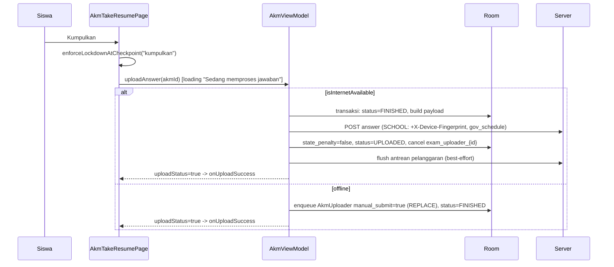
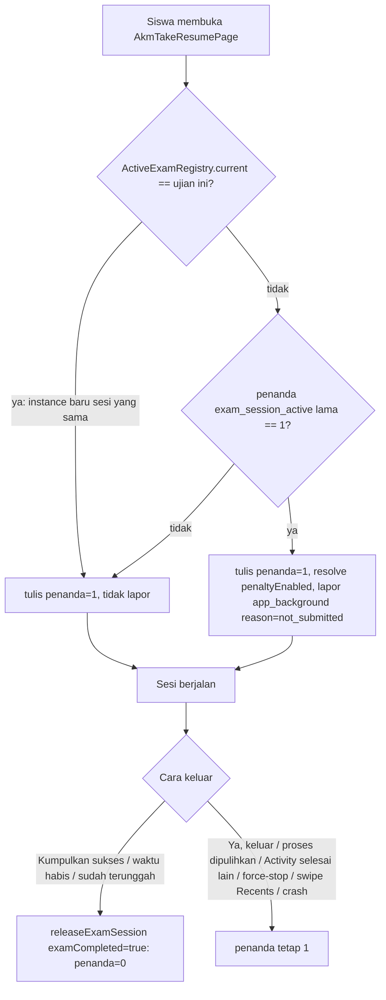
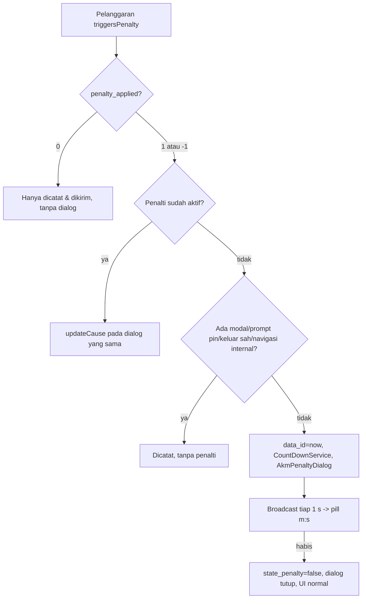

# Asesmen (AKM / Ujian Sekolah), Try Out, dan Ujian Lama — Spesifikasi Perilaku (android-portal 2.1.40)

Dokumen ini adalah spesifikasi perilaku TERKINI (android-portal `versionName 2.1.40`, `versionCode 79`, commit `123e3e48`) untuk seluruh keluarga fitur ujian siswa: **Asesmen/AKM** (`pages/akm/*` — daftar jadwal, detail, gerbang password, layar persiapan, pengerjaan soal, lockdown/screen pinning, deteksi pelanggaran, penalti, laporan masalah, pengumpulan, nilai & pembahasan), **Try Out/Quiz** (`pages/tryout/*`, memakai ulang mesin AKM) dan **Ujian lama/legacy** (`pages/ujian/*`). Bagian yang tidak berubah sejak dokumentasi versi 2.1.37 (`docs/repo lama/asesmen/*.md`, `docs/repo lama/dokumentasi-asesmen.md`) diringkas dan dirujuk; bagian yang berubah/baru sejak 2.1.37 (deteksi pelanggaran, penalti berbasis pelanggaran, dialog pelanggaran dihapus, blokir split-window/jendela mengambang, layar persiapan ujian, laporan masalah, penanda sesi, `has_explanation`, fingerprint `ANDROID_ID`, form esai) ditulis lengkap.

> **Konvensi rujukan kode.** Path `pages/…`, `utils/…`, `worker/…`, `services/…`, `db/…`, `api/…`, `di/…`, `App.kt` relatif terhadap `app/src/main/java/id/diskola/app/`. Path `res/…` dan `AndroidManifest.xml` relatif terhadap `app/src/main/`. Contoh: `pages/akm/AkmTakeResumePage.kt:139` = `app/src/main/java/id/diskola/app/pages/akm/AkmTakeResumePage.kt:139`.
>
> **Status file sejak 2.1.37** (hasil `git diff edf5b8f7..HEAD`): BERUBAH — `AkmDetailPage`, `AkmModels`, `AkmQuestionsPage` (+381/-), `AkmSettings`, `AkmTakeResumePage` (+475/-), `AkmViewModel`, `AkmUploader`, `ExamLockdown`, `ApiService`, `ResponseInterceptor`, `MemoryDB`, `DbModules`, `akm_question_essay_item.xml`, `strings.xml`, `AndroidManifest.xml`. BARU — `ActiveExamRegistry`, `AkmExamPrimingPage`, `AkmMultiWindowGuard`, `AkmPenaltyDialog`, `AkmProblemReport{Dao,Entities,Queue}`, `AkmViolation{Dao,Detector,DialogQueue,Entities,Payload,Queue,ReportingService}`, `DeviceFingerprint`, `DeviceInfo`, `ProcessRestoreState`, `worker/AkmProblemReportUploader`, `worker/AkmViolationUploader`, 6 layout baru. TIDAK BERUBAH — `AkmPage`, `AkmListPage`, `AkmScorePage`, `AkmScoreDetailPage`, `AkmExplanationPage`, `AkmInstructionPage`, `Question*Vh`, `QuestionAdapter`, `QuestionSelectDialog`, `AkmQuestionMediaBinder`, `CountDownService`, `AkmAnswerPayload`, `AkmDao`, `AkmEntities`, `SettingAkmCache`, `AkmDownloader`, `AkmExplanationDownloader`, seluruh `pages/tryout/*` dan `pages/ujian/*`, `ExamStopService`, `ExamEndWorker`, `HtmlMathRenderer`, `WindowUtil`.

## Daftar isi

1. [Ringkasan, pengguna & syarat akses](#1-ringkasan-pengguna--syarat-akses)
2. [Titik masuk](#2-titik-masuk)
3. [Peta layar & alur](#3-peta-layar--alur)
4. [Model status, tipe ujian, tipe soal](#4-model-status-tipe-ujian-tipe-soal)
5. [Detail per layar AKM](#5-detail-per-layar-akm)
6. [Unduh paket soal & media](#6-unduh-paket-soal--media)
7. [Jawaban: autosave, sinkronisasi, submit, auto-submit, resume](#7-jawaban-autosave-sinkronisasi-submit-auto-submit-resume)
8. [Timer](#8-timer)
9. [Lockdown / kiosk](#9-lockdown--kiosk)
10. [Deteksi pelanggaran (BARU)](#10-deteksi-pelanggaran-baru)
11. [Penalti (BERUBAH)](#11-penalti-berubah)
12. [Aturan blokir & sesi ujian](#12-aturan-blokir--sesi-ujian)
13. [Laporkan Masalah (BARU)](#13-laporkan-masalah-baru)
14. [Nilai & pembahasan](#14-nilai--pembahasan)
15. [Blokir logout saat ujian belum dikumpulkan](#15-blokir-logout-saat-ujian-belum-dikumpulkan)
16. [Kontrak API](#16-kontrak-api)
17. [Data lokal](#17-data-lokal)
18. [Perilaku perangkat/latar](#18-perilaku-perangkatlatar)
19. [Try Out](#19-try-out)
20. [Ujian lama (legacy)](#20-ujian-lama-legacy)
21. [Perbandingan AKM vs Try Out vs Ujian lama](#21-perbandingan-akm-vs-try-out-vs-ujian-lama)
22. [Aturan bisnis & edge case](#22-aturan-bisnis--edge-case)
23. [Catatan migrasi Compose](#23-catatan-migrasi-compose)
24. [Selisih dengan dokumen lama](#24-selisih-dengan-dokumen-lama)
25. [Checklist paritas](#25-checklist-paritas)

---

## 1. Ringkasan, pengguna & syarat akses

| Aspek | Nilai |
|---|---|
| Pengguna | **Siswa saja**. Guru tidak punya UI asesmen (slot menu diganti "Agenda Mingguan"). Orang tua: tidak ada. |
| Menu | Grid Pembelajaran item "Asesmen" (ikon `ic_test`) — `pages/pembelajaran/PembelajaranPage.kt:219-224`. Untuk non-siswa item index 4 (Asesmen) & 6 (Magang) di-`removeAt` — `:232-236`; guru disisipi "Agenda Mingguan" di index 4 — `:237-247`. |
| Syarat tap | `is_having_class` true (else `showDialogLocked()`), lalu `is_student` → `AkmPage`; `is_teacher` → `AgendaMingguanPage`; lainnya → `PoinPage` — `PembelajaranPage.kt:651-659`. Pref dibaca dari `PreferenceClass` (`viewmodel.pref`). |
| Gerbang fitur server | Tidak ada `checkFeatureAvailability` untuk asesmen (hanya `PRESENSI`, `JURNAL_KBM`) — `feature/FeatureAvailabilityModels.kt:6-9`. |
| Saklar server | `GET mobile/setting-akm` → `penalty_applied`, `exam_lock_mode`, `penalty_times` (detik), `absence_setting` (§11, §9). Per jadwal: `requires_password`, `password_checked`, `has_explanation`, `show_score`, `gov_schedule`. |
| Tiga produk | **AKM/Ujian Sekolah** (`ExamType.SCHOOL=2`, jalur utama), **Try Out/Quiz** (`ExamType.TRYOUT=1`, share mesin AKM), **Ujian lama** (sistem terpisah, legacy, hanya lewat notifikasi). |

Fitur yang **tidak ada** di kode (jangan ditambahkan diam-diam): tanda "ragu-ragu"/flag soal, lampiran file pada esai, hitung mundur sisa waktu ujian AKM di layar (lihat §8), token ujian selain password per jadwal, pemantauan kamera.

---

## 2. Titik masuk

| Dari | Ke | Extras | Rujukan |
|---|---|---|---|
| Pembelajaran → "Asesmen" | `AkmPage` | tidak ada (default `isSchoolScope=true`, `EXAM_TYPE=null`) | `PembelajaranPage.kt:653`, `pages/akm/AkmPage.kt:24,46` |
| Drawer Home "Logout" / Akun "Logout" diblokir | `AkmPage` | `isSchoolScope=true` | `pages/home/HomePage.kt:311-321`, `pages/akun/AkunPage2.kt:214-226` |
| Home: 401 Klaspay + ada ujian belum selesai | `AkmPage` | `isSchoolScope=true` | `HomePage.kt:132-151` |
| Notifikasi lokal hasil upload (`AkmUploader`) | `AkmPage` (atau `Loginpage` bila `logged_in=false`) | `goto`, `isSchoolScope` | `worker/AkmUploader.kt:170-182` |
| Notifikasi progres/gagal unduh soal (`AkmDownloader`) | `AkmDetailPage` (atau `Loginpage`) | `goto`, `id` (tanpa `examType`/`isSchoolScope` → default SCHOOL/true) | `worker/AkmDownloader.kt:315-326,351-362` |
| Kartu jadwal (`AkmListPage`) | `AkmDetailPage` (req 219) | `id`, `examType=SCHOOL`, `isSchoolScope`, `isGovSchedule` | `pages/akm/AkmListPage.kt:201-214` |
| Kartu nilai "Lihat Ujian" (`AkmScorePage`) | `AkmScoreDetailPage` (req 219) | `id`, `isSchoolScope` | `pages/akm/AkmScorePage.kt:261-270` |
| Try Out | `TryOutPage` — **tidak ada pemicu maju di kode** (hanya tujuan "kembali") | — | §19 |
| Notifikasi `page.parent="COURSE"`, `child="ASSIGNMENT"` | `UjianDetailPage` (`child_id`) / `UjianPage` | `child_id` | `pages/notification/DetailNotification.kt:150-154`, `pages/notification/NotificationPage.kt:268-272` |
| FCM `NotifRouter` | tidak ada rute ke modul ujian | — | `services/NotifRouter.kt` (grep kosong) |

---

## 3. Peta layar & alur

| Layar | Tipe | File | Layout | Fungsi |
|---|---|---|---|---|
| AkmPage | Activity (host NavHost `akm_nav`) | `pages/akm/AkmPage.kt` | `akm_page.xml` | Tab "Jadwal" / "Nilai" |
| AkmListPage | Fragment (start) | `pages/akm/AkmListPage.kt` | `akm_list_page.xml`, item `akm_item.xml` | Daftar jadwal (strip tanggal) |
| AkmScorePage | Fragment | `pages/akm/AkmScorePage.kt` | `akm_list_page.xml`, item `akm_score_item.xml` | Riwayat nilai + "Upload Ulang" |
| AkmDetailPage | Activity | `pages/akm/AkmDetailPage.kt` | `akm_detail_page.xml`, `akm_check_password_dialog.xml` | Detail, sinkron soal, gerbang password, ketentuan |
| **AkmExamPrimingPage (BARU)** | Activity | `pages/akm/AkmExamPrimingPage.kt` | `akm_exam_priming_page.xml` + `akm_priming_notice_item.xml` + `item_akm_notice_row.xml` | "Sebelum Memulai Ujian" |
| AkmTakeResumePage | Activity (akar sesi ujian) | `pages/akm/AkmTakeResumePage.kt` | `akm_take_resume_page.xml`, `akm_take_exam_item.xml`, `akm_take_instruction_item.xml` | Daftar mapel/instruksi + "Kumpulkan"; juga mode pembahasan |
| AkmQuestionsPage | Activity | `pages/akm/AkmQuestionsPage.kt` | `akm_questions_page.xml`, item per tipe soal | Kerjakan soal satu instruksi |
| QuestionSelectDialog | Dialog | `pages/akm/QuestionSelectDialog.kt` | `select_question_dialog.xml`, `akm_question_select_item.xml` | Lompat nomor soal |
| **AkmPenaltyDialog (BARU)** | AlertDialog (2 section) | `pages/akm/AkmPenaltyDialog.kt` | `dialog_akm_penalty.xml` | Penalti + "Laporkan Masalah" |
| **Blocker multi-window (BARU)** | View overlay | `pages/akm/AkmMultiWindowGuard.kt` | `view_akm_multiwindow_block.xml` | "Layar Penuh Diperlukan" |
| AkmScoreDetailPage | Activity | `pages/akm/AkmScoreDetailPage.kt` | `akm_score_detail_page.xml` | Nilai, sinkron & buka pembahasan |
| AkmExplanationPage | Activity | `pages/akm/AkmExplanationPage.kt` | `akm_explanation_page.xml` | Pembahasan (praktis hanya Try Out) |
| AkmInstructionPage | Activity | `pages/akm/AkmInstructionPage.kt` | `akm_instruction_page.xml` | **Dead code** — tidak ada pemanggil (hanya komentar `AkmQuestionsPage.kt:484`) |
| AkmViolationDialogQueue | Dialog | `pages/akm/AkmViolationDialogQueue.kt` | `dialog_akm_violation_notice.xml` | **Dead code sejak commit 7d55e715** (lihat §10.6) |

```mermaid
flowchart TD
    P[Pembelajaran: Asesmen] --> AP[AkmPage tab Jadwal/Nilai]
    AP -->|tab Jadwal| AL[AkmListPage]
    AP -->|tab Nilai| AS[AkmScorePage]
    AL -->|tap kartu| AD[AkmDetailPage]
    AD -->|status NEW: Sinkronisasi Soal| DL[[AkmDownloader worker]]
    DL -->|sukses: DOWNLOADED| AD
    AD -->|DOWNLOADED dan now > date_start: Mulai Asesmen| PW{requires_password DAN\n(belum password_checked ATAU sesi basi)?}
    PW -->|ya| PD[Dialog Password Ujian] -->|valid| KT
    PW -->|tidak| KT[Dialog Pemberitahuan !!! ketentuan]
    KT -->|OK| ST{exam_lock_mode aktif DAN offline?}
    ST -->|ya| OFF[Alert Butuh Koneksi Internet]
    ST -->|tidak| PR[AkmExamPrimingPage]
    PR -->|Mulai Ujian| TR[AkmTakeResumePage]
    TR -->|tap instruksi| QP[AkmQuestionsPage]
    QP -->|menu Selesai: startActivity| TR2[AkmTakeResumePage instance baru]
    TR2 -->|Kumpulkan sukses| AD
    TR -->|status FINISHED oleh auto-submit| AD
    AD -->|status SCORED: Lihat Nilai| SD[AkmScoreDetailPage]
    AS -->|Lihat Ujian| SD
    SD -->|EXPLAINED: Lihat Pembahasan| TRX[AkmTakeResumePage isExplanation=true]
    TRX --> QPX[AkmQuestionsPage isExplanation=true]
    SD -->|isTryout| EX[AkmExplanationPage]
```

Catatan navigasi: hampir semua "kembali" diimplementasikan dengan `startActivity(...)` baru (bukan `finish()`/pop), sehingga back stack menumpuk (§23.3). Tujuan kembali per layar:

| Layar | Toolbar back / hardware back | Rujukan |
|---|---|---|
| AkmPage | `HomePage` (`isSchoolScope=true`) + `finish()` | `AkmPage.kt:57-65,105-114` |
| AkmDetailPage | SCHOOL → `AkmPage`; TRYOUT → `TryOutPage`; lainnya → `HomePage` (hardware back juga `super.onBackPressed()`) | `AkmDetailPage.kt:75-97,340-362` |
| AkmExamPrimingPage | back default (finish, RESULT_CANCELED) | `AkmExamPrimingPage.kt` (tidak override) |
| AkmTakeResumePage | `handleBackNavigation()` (§12.1) | `AkmTakeResumePage.kt:863-865,1263-1265` |
| AkmQuestionsPage | hardware back **dinonaktifkan** (no-op); tombol home toolbar tidak punya listener | `AkmQuestionsPage.kt:1125-1131` |
| AkmScoreDetailPage | tryout → `TryOutPage`, lainnya → `AkmPage` | `AkmScoreDetailPage.kt:81-97` |

---

## 4. Model status, tipe ujian, tipe soal

### 4.1 `AkmStatus` (`pages/akm/AkmEntities.kt:8-16`) — kolom `akm.status`

| Nilai | Konstanta | Arti | Diset oleh |
|---|---|---|---|
| 0 | NEW | Belum unduh | default server-merge; `AkmDownloader` gagal (`worker/AkmDownloader.kt:234`); `AkmExplanationDownloader` gagal (`worker/AkmExplanationDownloader.kt:69`) |
| 1 | DOWNLOADING | Sedang unduh soal/pembahasan | `AkmDownloader.kt:42`, `AkmExplanationDownloader.kt:39` |
| 2 | DOWNLOADED | Siap dikerjakan | `AkmDownloader.kt:228` |
| 3 | FINISHED | Dikumpulkan lokal / antre unggah | `AkmViewModel.kt:640,742`, `AkmUploader.kt:78,150,193,199`; server `isDone` (`db/OnKlasDbUtil.kt:928`) |
| 4 | UPLOADED | Terunggah, menunggu nilai | `AkmViewModel.kt:672`, `AkmUploader.kt:190`; server `isQueued` (`OnKlasDbUtil.kt:929`) |
| 5 | SCORED | Nilai tersedia | server `isAssessed` (`OnKlasDbUtil.kt:927`) |
| 6 | EXPLAINED | Pembahasan terunduh | `AkmExplanationDownloader.kt:63` |

Merge server (`OnKlasDbUtil.kt:924-932`): `isAssessed`→5, `isDone`→3, `isQueued`→4, else status lokal tersimpan, else 0. Daftar Jadwal = `status < 3`, daftar Nilai = `status > 2` (`pages/akm/AkmDao.kt:46-65,89-90`).

### 4.2 `ExamType` & scope (`AkmEntities.kt:131-134`)

| Kombinasi | Toolbar/tombol | Endpoint |
|---|---|---|
| `SCHOOL` + `isSchoolScope=true` (default menu) | "Asesmen", "Jadwal", "Ikuti Ujian", "Detail Asesmen", "Mulai Asesmen" | `akm/exam-schedules*`, `akm/student/exam-school/*` |
| `SCHOOL` + `isSchoolScope=false` (tidak ada menu yang mengirim) | "Ikuti AKM", "Mulai AKM" | `akm/schedules`, `akm/scored`, `akm/student/exam/*` |
| `TRYOUT` | "Quiz", "Try Out", "Mulai Try Out" | `try-out/*` |

`EXAM_TYPE` extra (`SURVEY`/`ELIGIBLE`) hanya mengubah judul `AkmPage` ("Survey"/"Kelas Eligible", tab Nilai "Riwayat Survey") — tidak ada pengirimnya (`AkmPage.kt:46-56,72-76`). `gov_schedule` per item → ikon kartu `ic_school_login` vs `ic_mapel_akm` (`AkmListPage.kt:190-193`) dan query `gov_schedule=0|1`.

### 4.3 Tipe soal (`AkmEntities.kt:224-271`) — **masih akurat** vs `asesmen-akm-pengerjaan-soal.md` §3

| `answerType` API | Syarat `answers[]` | `type` lokal | ViewHolder | UI |
|---|---|---|---|---|
| `MULTIPLE CHOICE` | — | 0 | `QuestionMultipleVh` | PG satu jawaban (label A..Z) |
| `STATEMENT` | `answers[0].showFalse==true` | 5 | `QuestionTableVh` | Tabel pernyataan "Pernyataan/Benar/Salah" (radio per baris) |
| `STATEMENT` | `answers.size==1` | 3 | `QuestionTrueFalseVh` | Tombol "Benar"/"Salah" (`selected=true`=Benar) |
| `STATEMENT` | lainnya | 4 | `QuestionMultipleVh` (checkbox) | PG kompleks (banyak benar) |
| `ESSAY` | — | 2 | `QuestionEssayVh` | Esai panjang (counter aktif) |
| `PAIR` | `answers[0].firstStatement` kosong | 7 | `QuestionPairImageVh` | Menjodohkan gambar (drag) |
| `PAIR` | lainnya | 6 | `QuestionPairVh` | Menjodohkan teks (long-press drag, tukar posisi) |
| `SHORT_ESSAY_NUM` | — | 8 | `QuestionEssayVh` | Isian angka (`TYPE_CLASS_NUMBER`) |
| `SHORT_ESSAY_WORD` | — | 9 | `QuestionEssayVh` | Isian satu kata (spasi dihapus otomatis) |
| lain | — | 2 | `QuestionEssayVh` | fallback esai |

Tipe 1 (`..._SINGLE_CORRECT_IMAGE`) tidak pernah dihasilkan (masih akurat). Pemilihan VH: `pages/akm/QuestionAdapter.kt:57-105` (`getItemViewType = position`).

---

## 5. Detail per layar AKM

### 5.1 AkmPage — host (TIDAK BERUBAH, masih akurat vs `asesmen-akm-daftar-detail-nilai.md` §1)

- Toolbar "Asesmen"; tab `btnIkuti` "Jadwal" (school) / "Ikuti AKM", `btnNilai` "Nilai"; tab aktif stroke/teks `colorPrimary`, lain `gray` (`AkmPage.kt:70-102`). `openScoreList()` = klik tab Nilai (`:116-118`).
- `errorString` → toast (`:68`).
- `init` (`:120-177`): set `viewmodel.isSchoolScope`; bila school scope dan **tidak ada baris lokal sama sekali** (`countAllByScope`) → `loadUjianSchool()` sekali (`:131-140`); lalu untuk tiap `getUnfinishedUjian()` (status<3 & `student_exam_id>0`) enqueue `AkmUploader` (unik `exam_uploader_{id}`, REPLACE, delay sampai `date_end`, butuh jaringan) (`:143-176`).

### 5.2 AkmListPage — jadwal (TIDAK BERUBAH, masih akurat)

| Elemen/aksi | Perilaku | Rujukan |
|---|---|---|
| Label bulan "MMMM yyyy" (locale id) | tap → `MonthYearPickerDialog`, render ulang hari, pilih tanggal 1 | `AkmListPage.kt:76-85,321-363` |
| Strip tanggal (pil hari `magang_date_item`) | tanggal < hari ini: disabled, alpha 0.3, tap diabaikan; pilih tanggal → hanya ganti `calUjian` (baca Room lokal, **tidak** memanggil API) | `:236-243,275-297` |
| List (school scope) | `listUjianSchoolLocal()` = `akm` status<3, `is_school_scope=1`, `date_label` = tanggal terpilih ("dd MMMM yyyy"), urut `date_start` | `:219-233`, `AkmViewModel.kt:278-280`, `AkmDao.kt:49-50` |
| List (non-school) | `listAkm` paging + boundary callback | `:99-115` |
| Pull-to-refresh | school: `loadUjianSchool()` = `GET akm/exam-schedules?date=yyyy-MM-dd&take=20&skip=` untuk tanggal terpilih; jadwal lokal tanggal itu yang tidak ada di respons **dihapus** | `:95-98`, `AkmViewModel.kt:341-396` |
| Empty | "Belum terdapat ujian" | `res/layout/akm_list_page.xml:112` |
| Kartu | nama, "ID : {id}", jenis, "Tanggal", "Pukul", label "sedang mendownload soal"/"ujian telah selesai" (hanya bila status bukan NEW/DOWNLOADED), tombol "Ikuti Ujian" | `res/layout/akm_item.xml:38-193`, `AkmListPage.kt:189` |
| Wajib jam otomatis | `onResume`: jika waktu/zona tidak otomatis → dialog non-cancelable "Peringatan" / "Harap atur tanggal dan waktu ponsel ke \"Otomatis\"" — "Buka Pengaturan" (`ACTION_DATE_SETTINGS`) / "Jangan Ubah" (finish activity) | `:125-155` |
| Hasil detail (req 219) | OK + `showScore` → tab Nilai; OK lain → spinner refresh; **non-OK → `startActivity(HomePage)`** | `:374-386` |

### 5.3 AkmDetailPage (BERUBAH: gerbang password + tujuan mulai)

Extras: `id`, `isSchoolScope` (default true), `isGovSchedule`, `examType` (default SCHOOL) (`AkmDetailPage.kt:48-53`).

Saat dibuka (`:116-157`): `refreshPenaltySetting()` (cache TTL 12 jam, §11.1); `fetchDetailAkm` sekali per instance (`savedInstanceState == null`) — hanya SCHOOL (TRYOUT tidak fetch detail, `AkmViewModel.kt:435-449`); bila status lokal FINISHED/UPLOADED → paksa refresh daftar nilai (`loadUjianSchoolScored`/`loadAkmScored`) agar status bisa naik ke SCORED.

UI (Flow `detailAkm(id)`, `:161-303`): judul toolbar "Detail Asesmen"/"Try Out"/"Tes AKM"; nama, jenis; "Asesmen berakhir: dd MMMM yyyy, HH:mm"; notice password ("Ujian ini memakai password" / "Silakan meminta password ke pengawas ujian sebelum mulai mengerjakan asesmen.", `res/layout/akm_detail_page.xml:126,141`) bila `requires_password_{id}`; tabel info "ID Ujian", "Peserta", "NIS" (nis, fallback nisn), "Kelas", "Kategori", "Periode" ("-" bila kosong), "Sekolah" — dari `StudentItem`/`SekolahItem` pref, bukan API asesmen (`:172-182`); daftar beban "Jumlah soal: " (exam dengan `num_question>0`).

| Status | Aksi | Rujukan |
|---|---|---|
| NEW | tombol "Sinkronisasi Soal" → `downloadSoal` (WorkManager); label "sinkronisasi soal ({progress}/{n})"; bila worker FAILED → `alert(msg=outputData.message)` dan tombol muncul lagi | `:192-221` |
| DOWNLOADING | progress bar `download_progress/Σnum_question` + label | `:223-232` |
| DOWNLOADED & `Date() > date_start` | tombol "Mulai Asesmen"/"Mulai Try Out"/"Mulai AKM" → `startExamWithPasswordGate()` | `:235-255` |
| DOWNLOADED & belum mulai | label "Asesmen belum dimulai" | `:256-259` |
| FINISHED/UPLOADED | label "Asesmen telah dikumpulkan"; jika **jam:menit** sekarang ≥ jam:menit `date_end` (tanggal diabaikan) → alert "Waktu habis, Asesmen telah dikumpulkan" [OK → `AkmPage`] | `:262-284`, `AkmViewModel.kt:748-755` |
| SCORED | "Lihat Nilai" → `AkmScoreDetailPage` (req 219, extras `id`, `examType`) | `:286-301` |

**Gerbang password (BERUBAH)** — `:462-488`: password hanya dievaluasi bila `examType==SCHOOL && isSchoolScope && requires_password_{id}==1`. Dialog dilewati bila `password_checked_{id}==1` **DAN** `exam_session_active_{id} != 1` (sesi lalu ditutup sah). Jika penanda sesi masih menyala (app ditutup paksa / keluar tanpa kumpul), password **wajib diulang** walau `password_checked=1`.

Dialog "Password Ujian" (`:490-542`): judul "Password Ujian", isi layout (`akm_check_password_dialog.xml`: "Asesmen memakai password", "Silakan meminta password ke pengawas ujian sebelum mulai mengerjakan asesmen.", hint "Masukkan password dari pengawas"), tombol "Lanjut"/"Batal". Validasi: trim kosong → error field "Password ujian wajib diisi". Loading "memeriksa password". `POST check-password` (+ header `X-Device-Fingerprint`); `data.checked=false` → error field "Password ujian tidak sesuai"; sukses → simpan `password_checked_{id}=1`, `requires_password_{id}` dari respons (`AkmViewModel.kt:455-484`) → dialog ketentuan. Error: pesan mengandung "Password ujian" → ditampilkan di field; lainnya → `showPasswordCheckError` (`:544-573`):

| Pesan backend mengandung | Judul | Pesan yang ditampilkan |
|---|---|---|
| "sudah digunakan" | "Password Sudah Digunakan" | "Password ujian sudah digunakan. Minta guru generate password baru." |
| "perangkat lain" | "Perangkat Berbeda" | "Password sudah dipakai di perangkat lain. Gunakan HP yang dipakai saat cek password, atau minta guru generate password baru." |
| "Terlalu banyak" | "Terlalu Banyak Percobaan" | "Terlalu banyak percobaan akses ujian. Tunggu beberapa saat sebelum mencoba lagi." |
| lainnya | "Perhatian" (default `alert`) | pesan apa adanya; kosong → "Password ujian belum bisa diperiksa. Silahkan ulangi beberapa saat lagi" |

**Dialog ketentuan** (`showStartExamDialog`, `:607-650`): paksa `refreshPenaltySetting(force=true)` (gagal jaringan → pakai nilai tersimpan), baca `isStrictMode`. `prettyAlertt` judul "Pemberitahuan !!!", gambar `undraw_add_information`, tombol "OK" saja. Isi (persis):
- strict: "• Layar akan dikunci selama ujian. Setelah menekan OK, akan muncul dialog dari sistem — tekan Mengerti/OK agar ujian dapat dimulai.\n• Ujian harus dimulai dalam keadaan terhubung internet.\n"
- non-strict: "• Pengerjaan ujian tanpa koneksi internet diperbolehkan.\n"
- selalu: "• Ujian akan dikenakan sanksi apabila Anda keluar dari halaman ujian atau berpindah aplikasi.\n• Pastikan koneksi internet stabil saat mengunggah jawaban.\n• Selama ujian berlangsung, tidak diperbolehkan mengangkat panggilan telepon.\n\nDengan menekan OK, Anda menyetujui ketentuan di atas. "

OK → `startExamIfAllowed(strict)` (`:587-605`): strict && `!isInternetValidated()` (captive portal dianggap offline) → `prettyAlertt` "Butuh Koneksi Internet" / "Ujian ini harus dimulai dalam keadaan terhubung internet.\n\nAktifkan paket data atau Wi-Fi, lalu coba mulai kembali." / "Mengerti"; else `startExamIntent()` → **`AkmExamPrimingPage`** (req 129, extras `id`,`isSchoolScope`,`examType`) (`:423-434`).

Hasil req 129 OK + `finished` → `setResult(OK, showScore=true)` + finish (`:307-315`) — praktis tidak pernah terjadi karena layar ujian tidak pernah `setResult` ke jalur ini (§23.3). Kode izin `FOREGROUND_SERVICE_DATA_SYNC` (`requestPermissionAndStartExam`, `:364-460`) **tidak dipanggil** (dead code).

### 5.4 AkmExamPrimingPage — "Sebelum Memulai Ujian" (BARU)

Layar penuh (tanpa toolbar), dibuka sebelum sesi ujian. Selama layar ini tampil **belum** ada detektor, registry, service pelaporan, atau `ExamLockdown.arm()` — meninjau layar ini tidak mungkin tercatat pelanggaran (`AkmExamPrimingPage.kt:16-38`). Tidak meminta izin apa pun.

Urutan UI (`res/layout/akm_priming_notice_item.xml`, `AkmExamPrimingPage.kt:52-73`):
1. Ikon info dalam lingkaran + judul "Sebelum Memulai Ujian".
2. Callout kunci (ikon `ic_lock_24`) — **hanya bila mode ketat**: "Layar akan dikunci agar kamu tidak berpindah aplikasi. Setelah menekan Mulai Ujian, konfirmasi dialog penyematan layar dari sistem bila muncul."
3. "Selama ujian, sistem akan mencatat otomatis bila kamu:" + 5 baris: "Membuka aplikasi lain atau keluar dari halaman ujian" (`ic_exit_to_app_24`), "Membagi layar dengan aplikasi lain (mode layar terbagi)" (`ic_split_screen_24`), "Membuka jendela/pop-up aplikasi lain di atas layar ujian" (`ic_layers_24`), "Mengambil tangkapan layar (screenshot)" (`ic_photo_camera_24`), "Merekam layar" (`ic_videocam_24`).
4. "Sistem juga mencatat sebagai informasi tambahan:" + "Koneksi internet terputus cukup lama" (`ic_wifi_24`), "Jam/tanggal perangkat berubah" (`ic_schedule_24`); catatan "Dua hal di atas bukan pelanggaran — hanya informasi tambahan untuk sekolah."
5. "Semua catatan ini akan dikirim ke pihak sekolah."
6. Tombol bawah "Mulai Ujian" (`btn_start`) → `AkmTakeResumePage` (req 129, extras sama). Hasil diteruskan apa adanya lalu `finish()` (`:76-94`).

### 5.5 AkmTakeResumePage — akar sesi ujian (BERUBAH BESAR)

Extras: `id`, `isSchoolScope` (default true), `isExplanation` (default false), `examType` (default SCHOOL) (`AkmTakeResumePage.kt:74-77`). Manifest: portrait, `resizeableActivity=false`, `supportsPictureInPicture=false` (`AndroidManifest.xml:482-486`).

**onCreate** (`:826-1132`), urutan:
1. Bila bukan pembahasan dan `ProcessRestoreState.isRestoredFromDeadProcess` → `forceReenterAfterProcessRestore()`: `releaseExamSession("process_restored")` (penanda sesi TIDAK dihapus), set `password_checked_{id}=0`, `finish()` (`:171-183,829-836`).
2. `FLAG_SECURE` (screenshot/rekaman hitam) — juga di mode pembahasan (`:841-844`); `filterTouchesWhenObscured=true` (`:849`).
3. Toolbar: "Pembahasan" / "Kerjakan Asesmen" (SCHOOL) / "Kerjakan Tryout" (TRYOUT) / "Dont" (lain) (`:854-861`).
4. Daftar exam (`ListAdapter`) — `collapseExam` lalu Flow `getExamInstruction`; tombol "Kumpulkan" (`btn_action`) enabled: SCHOOL → semua exam `finished`; TRYOUT → selalu (`:981-989`). Tombol GONE di mode pembahasan (`:878`).
5. `viewmodel.startUjian(akmId)` (bukan pembahasan): jadwalkan `AkmUploader` auto-submit di `date_end` (REPLACE, idempoten) dan simpan UUID work ke `akm` (`:998`, `AkmViewModel.kt:569-617`). Gagal → toast "Terjadi kesalahan memulai ujian. {msg}. Silahkan ulangi beberapa saat lagi".
6. Pelaporan pelanggaran (bukan pembahasan, SEMUA ujian tanpa memandang mode ketat) (`:1002-1070`): bind `ConnectionLiveData`; baca penanda `exam_session_active_{id}` lalu set =1; `sessionAlreadyRunning = ActiveExamRegistry.current()?.akmId == akmId`; `previousSessionNotSubmitted = !sessionAlreadyRunning && penanda lama==1`; resolve `student_exam_id` → `ActiveExamRegistry.start`, `AkmViolationReportingService.start`, periodic `AkmViolationUploader` 15 menit (unik `exam_violation_uploader_{id}`, KEEP). Bila sesi lalu tidak dikumpulkan: tentukan `penaltyEnabled` dulu, lalu `reportPreviousSessionNotSubmitted()` (§10.2).
7. Mode ketat (bukan pembahasan) (`:1084-1102`): bila `isStrictMode` → `ExamLockdown.arm(id)`, sembunyikan panah back, `retryLock()`, setelah 1,8 s verifikasi; gagal → dialog "Mode Terkunci Terlepas" (§9.3).
8. Penalti tertunda (`:1104-1131`): bila `penalty_applied` dan `state_penalty_{id}==true` → set `data_{id}`=sekarang, mulai `CountDownService`, tampilkan `AkmPenaltyDialog(cause=null)` (§11).

**Item exam** (`akm_take_exam_item.xml`): nama = `type` (dipaksa "Asesmen" bila `isSchoolScope`, `:1181`), status "Selesai"/"Belum selesai" (hijau/merah), chevron; tap nama/ikon/status toggle `show_child` di Room (`:1185-1196`) — tetapi `showChild` selalu `true` sehingga selalu terbuka (`:1182`). **Item instruksi** (`akm_take_instruction_item.xml`): nomor Romawi "I.", status "Selesai pengerjaan"/"Belum dikerjakan"/"Proses pengerjaan" (mode pembahasan: "Lihat Pembahasan"), progres "{answered} / {num_question}", ">" (`:1226-1237`). Tap → cek checkpoint lockdown → `navigatingInternally=true` → `AkmQuestionsPage` dengan `id`, `instruction_id`, `title` (= `akm_exams.type`), `number`, `instruction`, `description`, `examType`, `isExplanation` (`:1239-1260`). Halaman ini **tidak di-finish**.

**onResume** (`:238-302`): `FLAG_KEEP_SCREEN_ON`; detektor resume + receiver jam + screenshot; `syncMultiWindowState()`; lockdown watchdog/checkpoint/ensureLocked; `setHideOverlayWindows(true)` (API 31+); baca `penalty_applied` (−1→true) — bila off: stop `CountDownService`, sembunyikan pill; daftarkan receiver `CountDownService` (`RECEIVER_NOT_EXPORTED` di API 33+); tandai exam `finished=true` bila semua instruksi `answered==num_question` (`:295-301`).

**onPause** (`:304-324`): lepas hide-overlay & keep-screen-on; detektor pause; unregister receiver; stop `CountDownService` bila tidak sedang penalti.

**onDestroy** (`:509-520`): bila `isFinishing && !isChangingConfigurations` → `releaseExamSession("resume_page_finished")` (penanda sesi tetap).

**`releaseExamSession(reason, examCompleted=false)`** (`:139-158`) — wajib di setiap jalur keluar: `ExamLockdown.release`, `ActiveExamRegistry.clear`, stop `AkmViolationReportingService`, `AkmViolationQueue.clear`, `AkmMultiWindowGuard.clear`, batalkan `exam_violation_uploader_{id}`. HANYA bila `examCompleted=true` → tulis `exam_session_active_{id}=0` (IO + `NonCancellable`). Jalur `examCompleted=true`: `"submit"` (`:746`), `"time_up"` (`:204`), `"already_uploaded"` (`:222`). Jalur lain (abort, process_restored, resume_page_finished) meninggalkan penanda = 1.

**Status Flow (`init`, `:193-236`)**: FINISHED → alert "Waktu ujian telah berakhir, jawaban akan dikumpulkan" [OK → `releaseExamSession("time_up", true)` → `AkmDetailPage` + finish]; UPLOADED → langsung `releaseExamSession("already_uploaded", true)` → `AkmDetailPage` + finish. (Dijalankan juga di mode pembahasan — status EXPLAINED tidak memicu apa pun.)

**Kumpulkan** (`:878-979`): checkpoint lockdown dulu. SCHOOL → loading "Sedang memproses jawaban" → `uploadAnswer` → sukses `onUploadSuccess()`; gagal → alert "Gagal" / "Terdapat kesalahan dalam pengunggahan jawaban" / "Coba lagi" (ulang upload). TRYOUT → untuk **setiap** instruksi: jika belum lengkap `alertSelectNew` "Peringatan" / "Terdapat soal yang belum terselesaikan.\n Apakah yakin untuk melanjutkan proses pengumpulan ?" / "Lanjut mengerjakan" / "Yakin dan kumpulkan"; jika lengkap "Informasi" / "Semua soal telah terjawab dan siap untuk dikumpulkan" / "Tinjau kembali" / "Kumpulkan" (dialog berikutnya menimpa sebelumnya → yang tampil = instruksi terakhir, lihat §23.3 ❓).

**`onUploadSuccess`** (`:742-765`): dismiss loading → `releaseExamSession("submit", true)` → alert "Berhasil" / "Jawaban sedang dikumpulkan, silahkan tunggu sampai jawabanmu dinilai" / "Baik" → `state_penalty_{id}=false`, buka `AkmDetailPage` (`id`, `examType`, `isSchoolScope`), finish.

**Mode pembahasan** (`isExplanation=true`): tanpa detektor/lockdown/penalti/startUjian; exam dipaksa `finished`, instruksi dipaksa `answered=num_question` dan status "Lihat Pembahasan" (`:1180,1228-1233`); tap instruksi → `AkmQuestionsPage` mode pembahasan.

### 5.6 AkmQuestionsPage — kerjakan soal (BERUBAH)

Extras: `id`, `instruction_id`, `title` (tidak dipakai untuk judul), `number`, `instruction`, `description`, `examType`, `isExplanation` (`AkmQuestionsPage.kt:67-82`). Manifest sama seperti §5.5 (`AndroidManifest.xml:491-495`).

UI (`res/layout/akm_questions_page.xml`, dari atas):
- Toolbar "Kerjakan Asesmen" / "Pembahasan Soal" (`:347`); menu "Selesai" (`res/menu/menu_ujian.xml:6-8`).
- Label halaman "1 / -" → "{pos+1} / {num_question}" (tap → `QuestionSelectDialog`), tag status "Sudah terjawab" (`tag_primary`) / "Belum terjawab" (`tag_gray`); pembahasan: "Lihat Pembahasan" (`oval_green`) / "Belum dibahas" (`oval_black`) (`:908-935`).
- Kartu "Perintah soal, deskripsi & cerita" + "Baca petunjuk" → dialog "Instruksi Asesmen" berisi `Html.fromHtml(instruction)\n\nHtml.fromHtml(description)` (`:379-381,481-491`).
- `rv_questions` horizontal + `PagerSnapHelper` (1 soal per halaman) (`:383-387`).
- Tombol "Berikutnya" (GONE bila 1 soal / di soal terakhir; debounce saat scroll) (`:412,470-472,493-514`).
- Pill penalti `tag_penalty` (teks awal "Terdeteksi membuka aplikasi lain\nProses ujian terjeda 5 menit", lalu ditimpa sisa waktu "m:s") (`akm_questions_page.xml:165-174`, `:283-320`).

Navigasi soal: swipe snap (update label/tag/Next saat idle, `:423-476`); Next = `smoothScrollToPosition(pos+1)`; `QuestionSelectDialog` → `jumpToQuestion` (`scrollToPosition` + koreksi snap `calculateDistanceToFinalSnap`) (`:884-905`). Semua aksi melewati `enforceLockdownAtCheckpoint` (§9.2). Dialog video offline dipicu dari posisi snap (sekali per media id) (`:743-759`).

Menu "Selesai" (`:937-962`): terlihat & enabled hanya bila `allowFinish` (SCHOOL: semua soal instruksi ini `answered`; TRYOUT: selalu) **DAN** tidak sedang penalti **DAN** tidak ada breach lockdown. Tap → `startActivity(AkmTakeResumePage)` dengan `id`, `examType`, `isExplanation` (tanpa `isSchoolScope` → default true); halaman soal **tidak di-finish**.

Autosave jawaban — lihat §7.1. Status Flow (`init`, `:173-210`, non-pembahasan): FINISHED → alert "Waktu ujian telah berakhir, jawaban akan dikumpulkan" [OK → `ExamLockdown.release("time_up")`, `setResult(OK, finished)`, `AkmPage`, finish]; UPLOADED → release + `AkmPage` + finish. Halaman ini hanya `ExamLockdown.release`, **bukan** `releaseExamSession`.

Keluar-sementara yang sah: tombol "Aktifkan Data" (placeholder video offline / dialog "Butuh Koneksi Internet") → `NetworkSettingsIntent` dengan `whitelistedExit=true`, `ExamLockdown.beginTemporaryExit(…, 10 s)` — tidak dicatat pelanggaran dan pin dipasang lagi di `onResume` (`:765-785,628-635`). Gagal buka → toast "Masih belum ada koneksi internet".

Mode pembahasan: tag "Lihat Pembahasan" bila `explanation_file_path` ada → tap unduh file (`apiService.download(url)` ke `filesDir/{lastPathSegment}`) lalu `intentUtil.openFile(…, "Pembahasan Soal")`; loading "menampilkan data"; error → toast (`:436-469`).

### 5.7 Render soal (TIDAK BERUBAH; masih akurat vs `asesmen-akm-pengerjaan-soal.md` §3–§5)

- Teks soal HTML: atribut `data-value="…"` diubah jadi `\(…\)` (`QuestionAdapter.kt:149`, mis. `QuestionEssayVh.kt:58-60`), lalu `HtmlMathRenderer.setTextWithMath` (`utils/HtmlMathRenderer.kt:29-60`): `HtmlCompat.fromHtml(LEGACY)`, `` diganti drawable kosong (gambar soal tampil di `ImageView` terpisah, `:62-67`), pola `$$…$$`, `\[…\]` (display) dan `\(…\)` (inline) dirender **jlatexmath** menjadi bitmap `ImageSpan`, diperkecil bila lebih lebar dari layar; rumus invalid → kosong (`:105-108`). String HTML ber-MathJax CDN di tiap VH (`processedText`) **tidak dipakai** (sisa WebView).
- Teks jawaban PG/pernyataan: `Html.fromHtml`; `<p>` pertama dibuang saat unduh (`worker/AkmDownloader.kt:164-166`).
- Gambar: soal `file_path` (`imageFitUrlRounded`), jawaban `file_path`, pair `first/second_file_path` (path lokal atau URL fallback).
- Warna PG: dipilih = `oval_primary`; pembahasan (`scored=true`): benar (`is_true`) hijau, dipilih-salah primary.
- Media audio/video/YouTube (`AkmQuestionMediaBinder`): audio `MediaPlayer` + seekbar; video lokal `VideoView`; YouTube WebView (tidak pernah di-cache); offline → placeholder "Video ini memerlukan koneksi internet" + "Coba lagi" + "Aktifkan Data"; auto-retry saat koneksi pulih (`AkmQuestionsPage.kt:359-361`); pause saat `onPause`/detach.
- `QuestionSelectDialog`: judul "Halaman soal", grid 5 kolom, terjawab biru `fill_blue_radius6` (catatan statis bilang hijau: "note : soal yang sudah dijawab akan berwarna hijau, jika belum terjwab berwarna putih" — `res/layout/select_question_dialog.xml:49`).
- **Esai (BERUBAH layout saja)**: field "Ketikkan jawabanmu . . . " kini `minLines=8`, `minHeight=_100sdp` (dulu `minLines=4`) — `res/layout/akm_question_essay_item.xml:77-90`. Counter hanya tipe 2; tipe 8 `TYPE_CLASS_NUMBER`, lainnya `TYPE_TEXT_FLAG_MULTI_LINE`; tipe 9 menghapus spasi (`QuestionEssayVh.kt:94-119`).

---

## 6. Unduh paket soal & media

Masih akurat vs `asesmen-teknis-download-storage.md` (file tidak berubah). Ringkasan:

- Pemicu: tombol "Sinkronisasi Soal" (NEW) → `OneTimeWork AkmDownloader` unik `akm_downloader_{id}` (KEEP), butuh `CONNECTED`, backoff LINEAR (`AkmViewModel.kt:510-537`).
- Endpoint: SCHOOL+school scope → `GET akm/student/exam-school/{id}/download?gov_schedule=`; SCHOOL non-school → `GET akm/student/exam/{id}/download`; TRYOUT → `GET try-out/student/training/{id}/download` (`worker/AkmDownloader.kt:46-54`). Simpan `studentExam.id` → `akm.student_exam_id` (`:55`).
- Per exam dengan soal → `akm_exams` (pertahankan `finished/show_child/kategori/periode` lama, `:57-73`); per instruksi → `akm_instruction` (`num_question = questions.size`, `:75-79`); `isRandom` → soal & opsi diacak **sekali saat unduh** (`:81-85,157-161`); PAIR: sisi kanan diacak via `selected_id` (`:138-155`).
- Berkas di **penyimpanan internal app** `filesDir/akm-exam{examId}/`: `q{soalId}.jpg`, `a{soalId}_{jawabId}.jpg`, `a…_1.jpg`, `a{soalId}_{pemilik}_2.jpg`, media `q{soalId}_m{mediaId}.{ext}` (audio & video non-YouTube) (`:92-135,168-207,289-295`). URL relatif diprefiks `BuildConfig.ASSETS_URL`. Gagal gambar → simpan URL remote; gagal media → `local_path=""` (fallback streaming) (`:249-287`). Berkas >0 byte dipakai ulang (resume inkremental).
- **Tidak ada enkripsi**: Room `diskola.db` plaintext (termasuk kunci jawaban `akm_answer.is_true`) dan berkas plaintext; tidak ada pembersihan folder setelah ujian (grep `akm-exam` hanya di downloader).
- Progres: `download_progress` per soal ke Room + notifikasi silent "Sinkronisasi soal AKM - {nama}" / "Proses sinkronisasi soal ({p}/{n})" (`:297-331`). Gagal: status NEW, notifikasi "Gagal mendownload soal" / "Proses mendownload soal {nama} gagal, silahkan ulangi download soal beberapa saat lagi", `Result.failure(message)` (`:231-236,333-367`).

---

## 7. Jawaban: autosave, sinkronisasi, submit, auto-submit, resume

### 7.1 Autosave (offline-first, Room)
Setiap interaksi langsung ditulis ke Room; tidak ada tombol simpan:

| Aksi | Tulis | Rujukan |
|---|---|---|
| Esai/isian (debounce 200 ms) | `akm_question.answer_essay`, `answered=true` **walau teks kosong**; `setInstAnswered` | `AkmQuestionsPage.kt:1080-1092`, `QuestionEssayVh.kt:102-119` |
| PG/B-S/tabel/checkbox | transaksi: `setAnswered`, `setInstAnswered`; bila tipe bukan 3/4/5 → `unselectAnswers` dulu (PG tunggal); `insertAnswer(item)` | `:1094-1113` |
| Menjodohkan | transaksi: `setAnswered`, `setInstAnswered`, `insertAnswers(list)` | `:1115-1123` |

Tidak ada sinkron jawaban per soal ke server selama mengerjakan — jawaban hanya dikirim saat kumpul/auto-submit.

### 7.2 Payload (`pages/akm/AkmAnswerPayload.kt`, TIDAK BERUBAH, masih akurat)
Array item hanya untuk soal `answered=true`: `{instruction_id, question_id, answerType: type_label, answer}`; `answer`: MULTIPLE CHOICE → id opsi terpilih (0 bila tidak ada); STATEMENT → `[{id, isTrue:0|1, answered:0|1}]`; PAIR → `[{id, answered: selected_id}]` (pair-gambar dinormalisasi dari nama berkas `a\d+_(\d+)_2\.jpg`); lainnya → string `answer_essay` (`:25-115`).

### 7.3 Submit manual (`AkmViewModel.uploadAnswer`, `:630-710`)

Error HTTP → `errorString` (pesan backend / fallback "Terjadi kesalahan. Silahkan ulangi beberapa saat lagi") + `uploadStatus=false` (`:699-708`). Karena seluruh blok online dalam satu transaksi, gagal POST → rollback (status tetap DOWNLOADED).

### 7.4 Auto-submit & retry (`worker/AkmUploader.kt`, BERUBAH: + flush pelanggaran)
- Dijadwalkan di: `AkmTakeResumePage` (setiap buka), `AkmPage.init`, `TryOutPage.init`, `OnKlasDbUtil.processAkmResponse` (setiap jadwal status<4) — semua unik `exam_uploader_{id}` REPLACE, `initialDelay = date_end − now`, `CONNECTED`.
- `doWork` (`:43-203`): skip bila `student_exam_id<1` atau status>UPLOADED; non-manual & sisa waktu > 5 s → jadwalkan ulang tanpa POST (`:58-69`); transaksi status FINISHED + payload; POST sesuai tipe; flush pelanggaran; reset `state_penalty_*`, `finish_*`, `data_*`, `hours_*`, `penalty_end_*`, stop `CountDownService` (`:129-135`); gagal & percobaan<10 → status FINISHED + `Result.retry()` (`:142-152`); notifikasi "\"Jawaban berhasil terkirim\"" (dengan tanda kutip literal) / "Jawaban gagal terkirim", isi "Jawaban ujian {nama} telah berhasil dikirim"/"… gagal dikirim" (`:154-186`); status UPLOADED/FINISHED.
- Layar ujian yang terbuka melihat status FINISHED/UPLOADED lewat Flow dan menutup sesi (§5.5).

### 7.5 Upload ulang (`AkmScorePage`, TIDAK BERUBAH, masih akurat)
Tombol upload tampil bila status UPLOADED/FINISHED (atau gagal terakhir) kecuali `score_status` mengandung "tidak mengerjakan"/"sesi terlewat"; cooldown 60 s (`akm_upload_cooldown_{id}`, dialog "Tunggu" / "Upload ulang tersedia dalam {n} detik"); tanpa data soal lokal → "Informasi" / "Data jawaban tidak ditemukan di perangkat ini. anda tidak bisa melakukan upload ulang jawaban !!"; konfirmasi "Upload ulang ujian" / "Yakin ingin upload ulang jawaban ujian ini?" / "Ya, Upload"; toast "Jawaban berhasil dikirim" / "Gagal mengirim jawaban. Coba lagi"; label "Mengupload jawaban...", "Upload ulang tersedia dalam {n}s" (`AkmScorePage.kt:172-355`).

### 7.6 Resume ujian
- Status tetap DOWNLOADED selama belum kumpul → dari `AkmDetailPage` "Mulai Asesmen" bisa masuk lagi kapan saja sebelum `date_end`; jawaban dan progres dari Room tetap.
- Masuk ulang setelah keluar tidak sah (penanda sesi = 1): password wajib diulang (bila ujian berpassword) + pelanggaran `app_background{reason:not_submitted}` + penalti (bila aktif) (§10.2, §11).
- Proses mati & Activity dipulihkan dari Recents: layar ujian menolak lanjut (§12.3).
- Instance halaman baru dari sesi yang sama (kembali dari soal) dibedakan oleh `ActiveExamRegistry` (in-memory) → tidak ada pelanggaran palsu (`pages/akm/ActiveExamRegistry.kt:18-34`, `AkmTakeResumePage.kt:1023`).

---

## 8. Timer

| Timer | Sumber waktu | Mekanisme | Perilaku app ditutup/dibunuh |
|---|---|---|---|
| **Batas ujian AKM/Try Out** | `akm.date_end` (dari `date` + `endAt` server, format `yyyy-MM-dd HH:mm`, `OnKlasDbUtil.kt:885,938-942`) | **Tidak ditampilkan** di layar. Auto-submit `AkmUploader` via WorkManager delay sampai `date_end` | WorkManager tahan proses mati/reboot; butuh jaringan → jalan saat online; status FINISHED ditampilkan saat layar ujian dibuka |
| Mulai ujian | `Date() > date_start` (jam perangkat) | cek saat render detail | jam perangkat wajib otomatis (dialog di `AkmListPage`) |
| **Penalti** | `data_{id}` (HH:mm:ss mulai) + `hours_{id}` (detik) di default SharedPreferences | `CountDownService` (Service biasa, bukan foreground, `START_STICKY`) tick 1 s broadcast `id.diskola.app.pages.akm.countdownservice` ber-`setPackage` (`pages/akm/CountDownService.kt:47-133`) | saat buka ulang halaman ujian dengan `state_penalty_{id}=true`, `data_{id}` di-reset ke sekarang → **penalti mulai ulang penuh** (`AkmTakeResumePage.kt:1115-1120`, `AkmQuestionsPage.kt:524-529`) |
| Watchdog dialog penalti | sama (baca prefs tiap 2 s) | `AkmPenaltyDialog` tutup sendiri bila habis walau broadcast tak datang (`AkmPenaltyDialog.kt:210-235`) | — |
| Pelaporan pelanggaran | acak 30–60 s | `AkmViolationReportingService` loop (§10.4) | dimatikan bersama proses; WorkManager 15 mnt jaring pengaman |
| Ujian lama | `ExamTable.date`+`endAt` | `CountDownTimer` di `TakeUjianPage` (§20) | alarm `ExamStopService` setelah 30 s di latar |

Format sisa penalti: `"{menit}:{detik}"` tanpa nol di depan (mis. "4:5") (`CountDownService.kt:90-95`). Perhitungan hanya jam-menit-detik (lintas tengah malam salah).

---

## 9. Lockdown / kiosk

### 9.1 Saklar & batas
- Aktif hanya bila `exam_lock_mode` = 1 di `akm_settings` (`AkmSettings.isStrictMode`: −1/1 → true, 0 → false, error → true) (`pages/akm/AkmSettings.kt:26-35`). ❗ Model `exam_lock_mode: Boolean? = false` (`pages/akm/AkmModels.kt:224`): key **hilang** → `false` → mode ketat MATI; hanya `null` eksplisit → true (`SettingAkmCache.kt:69`). Lihat ❓ §23.3.
- Implementasi: **Screen Pinning** (`Activity.startLockTask()` tanpa Device Owner) — `utils/ExamLockdown.kt` (singleton in-memory, BERUBAH: retry race foreground, `forceRelock`, `verifyRequestedLock`, jendela keluar sah 10 s/120 s).
- Konstanta: maks 2 percobaan sebelum pernah terpin, prompt timeout 20 s, verifikasi 1.800 ms, retry race 3×300 ms, debounce breach 3 s, keluar sah 10 s, sesi maks 6 jam (watchdog lepas paksa) (`ExamLockdown.kt:33-65`).

### 9.2 Siklus
`arm()` di `AkmTakeResumePage` (§5.5 langkah 7) → `retryLock` → sistem menampilkan "Sematkan layar?" (`promptPending` menahan semua detektor/penalti) → verifikasi 1,8 s. Pin milik task, jadi `AkmQuestionsPage` mewarisinya; keduanya memanggil `watchdogCheck` + `ensureLocked` di `onResume` dan `evaluateAfterFocusRegained` saat fokus kembali. Panah back disembunyikan selama `desired` (`AkmTakeResumePage.kt:724-731`).

Checkpoint `enforceLockdownAtCheckpoint(reason)` (`AkmTakeResumePage.kt:454-466`, `AkmQuestionsPage.kt:239-251`) dipanggil pada: resume, fokus kembali, sentuhan ACTION_DOWN, kumpulkan, buka instruksi, pilih/lompat/snap/next soal, menu Selesai. Bila `hasActiveBreach` (pernah terpin, kini tidak, bukan keluar sah) → aksi ditolak + dialog pemulihan (kecuali sedang penalti/ada dialog).

`release()` di semua jalur keluar + **leak guard** `App.kt:177-182`: Activity apa pun selain `AkmTakeResumePage`/`AkmQuestionsPage` yang resume saat `desired=true` → lepas pin paksa.

### 9.3 Dialog "Mode Terkunci Terlepas" (non-cancelable)
Pesan "Mode terkunci ujian tidak aktif. Aktifkan kembali penyematan layar untuk melanjutkan pengerjaan.", tombol "Aktifkan" → teks "Memeriksa..." (disabled) → `ExamLockdown.forceRelock` → 1,8 s: terpin → tutup; belum → pesan "Penyematan layar belum aktif. Tekan Aktifkan, lalu konfirmasi dialog sistem jika muncul." + tombol "Aktifkan" lagi (`AkmTakeResumePage.kt:468-496`, identik `AkmQuestionsPage.kt:253-281`). ⚠️ `forceRelock` tidak berbuat apa-apa bila sesi belum pernah terpin (`ExamLockdown.kt:229-236`) — lihat ❓ §23.3.

### 9.4 Perlindungan layar lain
| Proteksi | Detail | Rujukan |
|---|---|---|
| `FLAG_SECURE` | screenshot & rekaman layar hitam di `AkmTakeResumePage` (BARU) dan `AkmQuestionsPage` | `AkmTakeResumePage.kt:841-844`, `AkmQuestionsPage.kt:335-338` |
| Sembunyikan overlay | `window.setHideOverlayWindows(true)` API 31+ saat resume, false saat pause; butuh izin `HIDE_OVERLAY_WINDOWS` | `AkmTakeResumePage.kt:261-263,307-309`; `AndroidManifest.xml:17-21` |
| Sentuhan tertutup | `filterTouchesWhenObscured=true` + `dispatchTouchEvent`: `FLAG_WINDOW_IS_OBSCURED` → sentuhan dibuang + pelanggaran `floating_window` (PARTIALLY_OBSCURED sengaja diabaikan) | `AkmTakeResumePage.kt:352-373`, `AkmQuestionsPage.kt:708-732` |
| Layar tetap nyala | `FLAG_KEEP_SCREEN_ON` saat resume | `:241`, `:567` |
| Layar penuh wajib (BARU) | §10.1 `split_screen` + blocker | `pages/akm/AkmMultiWindowGuard.kt` |
| Notification shade | TIDAK dianggap pelanggaran (tidak mem-pause Activity) | `pages/akm/AkmViolationDetector.kt:82-92` |
| AccessibilityService / NotificationListener | **dihapus** (tidak ada di kode/manifest) | `AkmExamPrimingPage.kt:26-37` |

---

## 10. Deteksi pelanggaran (BARU)

Dipakai bersama `AkmTakeResumePage` & `AkmQuestionsPage` via `AkmViolationDetector(activity, akmId, studentExamId, host)`; berjalan untuk SEMUA ujian (school, AKM, try out) kecuali mode pembahasan, **tanpa** bergantung `exam_lock_mode`.

### 10.1 Jenis & pemicu (`pages/akm/AkmViolationEntities.kt:8-15`, `AkmViolationDetector.kt`)

| `type` | Pemicu | Metadata | Penalti? | Rujukan |
|---|---|---|---|---|
| `app_background` | `onPause` → `onResume` Activity ujian; **tanpa ambang durasi** (sekejap pun). Dikecualikan: `ExamLockdown.isIntentionalExit()` / `promptPending` | `{durationSeconds}` | ya | `AkmViolationDetector.kt:94-115` |
| `app_background` (sesi ditinggalkan) | penanda `exam_session_active_{id}=1` saat sesi baru dimulai (§10.2) | `{reason:"not_submitted"}` | ya | `:132-142` |
| `floating_window` | sentuhan dengan `FLAG_WINDOW_IS_OBSCURED`; debounce 5 s; tanpa `appPackage` | — | ya | `:156-165` |
| `split_screen` | `isInMultiWindowMode`/`isInPictureInPictureMode`, konfigurasi OEM (`mMultiWindowId>0` / `mMultiWindowMode` ≠ normal/undefined), atau rasio window menyimpang >4% dari layar fisik (API 30+); dicatat **saat masuk**, 1× per episode (state proses-wide) | — | ya | `:179-190`, `AkmMultiWindowGuard.kt:39-107` |
| `screenshot` | API 34+: `Activity.registerScreenCaptureCallback` (izin `DETECT_SCREEN_CAPTURE`); <34: `ContentObserver` MediaStore mencari "screenshot" di path/nama (praktis tidak jalan karena izin media dibuang) | — | ya | `:273-311`; `AndroidManifest.xml:33` |
| `connection_loss` | `ConnectionLiveData` offline ≥ 5 s lalu online | `{durationSeconds}` | tidak (netral, tanpa dialog) | `:196-209` |
| `time_tampering` | `ACTION_TIME_CHANGED` & selisih delta jam dinding vs `elapsedRealtime` > 5 s | `{deviceTimeBefore, deviceTimeAfter}` (RFC3339) | tidak (netral) | `:215-248` |
| `screen_recording` | **tidak dideteksi** (dicegah `FLAG_SECURE`); masih ada di teks priming & deskripsi laporan | — | — | `AkmProblemReportQueue.kt:138` |

Blocker multi-window: selama `isRestricted` → view penuh "Layar Penuh Diperlukan" / "Ujian hanya dapat dikerjakan dalam layar penuh. Tutup layar terbagi atau jendela mengambang untuk melanjutkan." menelan semua sentuhan; hilang saat kembali layar penuh. Dicek di `onResume`, `onMultiWindowModeChanged`, `onConfigurationChanged`, `onPictureInPictureModeChanged` (`AkmTakeResumePage.kt:326-349`, `AkmQuestionsPage.kt:651-674`, `AkmMultiWindowGuard.kt:109-126`, `res/layout/view_akm_multiwindow_block.xml`).

### 10.2 Sesi ujian ditinggalkan tanpa dikumpulkan

Rujukan: `AkmTakeResumePage.kt:1007-1068`, `AkmSettings.kt:50-70,109-117`. Penanda yang sama memaksa password diulang di `AkmDetailPage` (§5.3).

### 10.3 Pencatatan
`reportSuspend` → `AkmViolationPayload.enqueue` ke tabel `akm_violation` (`type` ≤50 char, `detected_at` = `ISO_OFFSET_DATE_TIME` zona perangkat, `metadata_json`, `student_exam_id` saat itu) lalu `host.onViolationDetected(ui)` bila ada UI (`AkmViolationDetector.kt:387-398`, `AkmViolationPayload.kt:19-38,53-56`). Pesan UI = deskripsi + "\n\nPelanggaranmu telah dicatat dan dikirim ke pihak sekolah." (`:367-385`):

| type | Deskripsi |
|---|---|
| app_background | "Terdeteksi keluar dari halaman ujian atau berpindah aplikasi." |
| app_background (not_submitted) | "Terdeteksi keluar dari ujian tanpa mengumpulkan jawaban." |
| split_screen | "Terdeteksi membagi layar dengan aplikasi lain." |
| floating_window | "Terdeteksi jendela aplikasi lain di atas layar ujian." |
| screenshot | "Terdeteksi mengambil tangkapan layar (screenshot)." |

### 10.4 Pengiriman antrean (`pages/akm/AkmViolationQueue.kt`)
- Satu mesin `flush()` dibungkus **Mutex** (cegah kirim dobel), skip bila `akmId<1`, offline (`isInternetAvailable`), atau sedang pause; baca semua baris `akm_id`, kirim per chunk 50 ke `POST …/exam-school/{akmId}/violations/{studentExamId}` (body array `{type, detectedAt, metadata?}`), hapus baris yang sukses (`:49-101`).
- Error `ApiException`: 400 → buang chunk; 429 → pause `Retry-After` (default 60 s); 500 → pause 30 s; lainnya/IOException → tetap di antrean (`:78-97`).
- Pemicu: (a) `AkmViolationReportingService` — foreground service `dataSync`, notifikasi "Ujian sedang berlangsung" / "Sistem pemantauan ujian aktif di latar belakang" (PRIORITY_MIN, ongoing), loop acak 30–60 s + saat koneksi pulih (`pages/akm/AkmViolationReportingService.kt:45-120`; `AndroidManifest.xml:731-734`); (b) periodic `AkmViolationUploader` 15 mnt, retry maks 10 (`worker/AkmViolationUploader.kt:21-44`); (c) setelah submit manual (`AkmViewModel.kt:682-690`) dan worker (`AkmUploader.kt:119-126`).
- `releaseExamSession` menghentikan (a) dan membatalkan (b); baris yang belum terkirim tetap di Room sampai sesi berikut/submit.

### 10.5 Keputusan UI saat pelanggaran (`onViolationDetected`)
- `triggersPenalty && penaltyEnabled` → `PenaltyFromOverlay(message)` (§11.2).
- Selain itu **tidak ada dialog apa pun** (pelanggaran tetap tercatat & terkirim) — `AkmTakeResumePage.kt:110-124`, `AkmQuestionsPage.kt:122-136`.

### 10.6 Dialog pelanggaran dihapus
`AkmViolationDialogQueue` + `dialog_akm_violation_notice.xml` ("Pelanggaran Tercatat", tombol "Mengerti") masih ada tetapi pemanggilnya dikomentari sejak commit `7d55e715` → dead code. Tidak perlu dibangun di aplikasi baru kecuali diputuskan lain.

---

## 11. Penalti (BERUBAH)

### 11.1 Setelan
- `SettingAkmCache.refresh` (`pages/akm/SettingAkmCache.kt:43-94`): `GET mobile/setting-akm` disimpan ke `akm_settings` (`penalty_times`, `penalty_applied`, `exam_lock_mode`, `absence_setting`); TTL 12 jam (`setting_akm_last_fetch` di `PreferenceClass`; usia negatif = basi); `force=true` hanya tepat sebelum ujian mulai; gagal → nilai lama tetap.
- `penalty_applied`: −1 (belum pernah) → **aktif**; 0 → mati (`AkmTakeResumePage.kt:270-281`, `AkmSettings.kt:134-142`).
- Durasi = `penalty_times` (**detik**), ≤0 / belum ada → **300 s** (`AkmTakeResumePage.kt:622-627`).

### 11.2 Pemicu & dialog
Satu-satunya pemicu penalti kini: pelanggaran ber-`triggersPenalty` (§10.1) atau `state_penalty_{id}=true` saat halaman ujian dibuat. Blok `onRestart()` lama & penalti "kehilangan fokus" **dihapus** (`AkmTakeResumePage.kt:530-538`, `AkmQuestionsPage.kt:553-561`).

`PenaltyFromOverlay(msg)` (`AkmTakeResumePage.kt:383-442`, identik `AkmQuestionsPage.kt:795-849`):
1. Mode pembahasan → abaikan.
2. Penalti sudah aktif (`state_penalty_{id}` atau `state_penalty_pending_{id}`) → hanya `penaltyDialog.updateCause(msg)` bila dialog tampil (satu dialog, pesan terbaru).
3. Diabaikan bila: dialog penalti sudah ditandai tampil, modal lain terlihat (`isModalVisible`), navigasi internal, `whitelistedExit` (soal), `promptPending`, keluar sah, `alertDialog`/`loadingDialog` tampil.
4. Baca ulang `penalty_applied`; aktif → pill terlihat, `data_{id}` = sekarang (HH:mm:ss), `startPenaltyMinutes()` (tulis `hours_{id}`, start `CountDownService` dengan `akm_id`), tampilkan `AkmPenaltyDialog.show(cause=msg ?: "Terdeteksi keluar dari halaman ujian atau ada aplikasi lain di atas layar ujian.")`.

`AkmPenaltyDialog` (`pages/akm/AkmPenaltyDialog.kt`, `res/layout/dialog_akm_penalty.xml`): **non-cancelable**, latar transparan; section penalti: judul "Penalti Ujian", kartu sebab (`cause_card`, disembunyikan bila null), "Kamu tidak dapat melanjutkan ujian sampai waktu penalti habis.", link "Laporkan Masalah" (§13); footer "v{versionName} • Android {release} (API {sdk})". Sisa waktu **tidak** ditampilkan di dialog; dialog tutup sendiri saat broadcast kosong atau watchdog menyatakan habis (`:119-121,222-235`).

Selama penalti berjalan (broadcast `data≠""`): halaman resume: tombol "Kumpulkan" INVISIBLE, daftar INVISIBLE, judul "Penalti Ujian", back disembunyikan; halaman soal: "Berikutnya" INVISIBLE, soal INVISIBLE, judul "  Penalti", menu "Selesai" disembunyikan. Selesai (`data==""`): kembali normal, judul resume menjadi **"Kerjakan Ujian"**, judul soal "Kerjakan Asesmen" (`AkmTakeResumePage.kt:573-607`, `AkmQuestionsPage.kt:283-320`). `CountDownService` set `state_penalty_{id}` true/false & `finish_{id}` (`CountDownService.kt:93-107`).

### 11.3 Reset penalti
Submit manual (`state_penalty_{id}=false`, `AkmViewModel.kt:669-671`; juga di OK "Berhasil"), `AkmUploader` (reset semua key penalti, `AkmUploader.kt:129-135`), habis waktu penalti. Keluar lewat "Ya, keluar" dengan penalti aktif → `state_penalty_{id}=true` → penalti penuh saat membuka ujian lagi (§12.1).



---

## 12. Aturan blokir & sesi ujian

### 12.1 Tombol kembali di `AkmTakeResumePage` (`handleBackNavigation`, `:767-824`)
- Mode pembahasan → `finish()`.
- `ExamLockdown.desired` (mode ketat aktif) → **ditolak**: alert "Ujian Sedang Berlangsung" / "Kamu tidak dapat keluar selama ujian berlangsung.\n\nSelesaikan dengan menekan \"Kumpulkan\", atau tunggu sampai waktu ujian berakhir." / "Mengerti".
- Selain itu → `alertSelectNew` "Peringatan" dengan pesan:
  - penalti aktif: "Ujian baru dianggap selesai bila kamu menekan \"Kumpulkan\".\n\nKeluar sekarang tercatat sebagai pelanggaran, dan kamu terkena penalti saat membuka ujian ini lagi."
  - penalti mati: "Ujian baru dianggap selesai bila kamu menekan \"Kumpulkan\".\n\nKeluar sekarang tercatat sebagai pelanggaran dan dilaporkan ke pihak sekolah."
  - tombol "Tetap mengerjakan" / "Ya, keluar" → (penalti aktif: `state_penalty_{id}=true`) → `releaseExamSession("abort")` (penanda sesi tetap 1) → `AkmDetailPage` (`isSchoolScope=true`) + finish. Pelanggaran baru tercatat saat sesi berikut dimulai (§10.2).
- `AkmQuestionsPage`: hardware back tidak melakukan apa pun (`:1125-1131`).

### 12.2 Password & perangkat
- Password sekali pakai per siswa & terikat perangkat (`X-Device-Fingerprint`); pesan backend ditampilkan apa adanya (§5.3). Setelah keluar tidak sah pada ujian berpassword, siswa diminta password lagi (guru harus generate ulang bila backend menolak password lama).
- Fingerprint = `Settings.Secure.ANDROID_ID` (BERUBAH dari UUID di prefs) — `utils/DeviceFingerprint.kt:16-21`; dipakai `check-password` & upload jawaban school (`AkmViewModel.kt:453,662`, `AkmUploader.kt:97`).

### 12.3 Pemulihan proses
`ProcessRestoreState` (`utils/ProcessRestoreState.kt:20-38`): token UUID per proses dicap ke `outState`; Bundle dengan token berbeda = dipulihkan dari proses mati. `AkmTakeResumePage` → release sesi + `password_checked_{id}=0` + finish; `AkmQuestionsPage` → `ExamLockdown.release` + `password_checked_{id}=0` + finish (`AkmQuestionsPage.kt:159-171,326-333`). Rotasi/config change di proses sama TIDAK dianggap pemulihan.

### 12.4 Blokir lain
- Mulai ujian mode ketat saat offline → ditolak (§5.3). Setelah mulai, offline diperbolehkan.
- Multi-window → blocker (§10.1). Breach pin → aksi ditahan (§9.2).
- Menu "Selesai" disembunyikan selama penalti/breach; tombol "Kumpulkan" SCHOOL disabled sampai semua instruksi lengkap.

---

## 13. Laporkan Masalah (BARU)

Hanya dapat dibuka dari **dalam dialog penalti** (link "Laporkan Masalah") di kedua halaman ujian; section berganti di dialog yang sama (bukan dialog baru) (`AkmPenaltyDialog.kt:143-182`, `AkmTakeResumePage.kt:637-646`, `AkmQuestionsPage.kt:964-973`).

Form (`dialog_akm_penalty.xml` `report_section`): judul "Laporkan Masalah"; subjudul "Ceritakan kendala yang kamu alami. Riwayat pelanggaran sesi ujian ini akan disertakan otomatis."; label "Ceritakan kendalamu"; input multiline hint "Tulis kendala yang kamu alami…", maks 500 karakter + counter, min 3 baris; checkbox "Saya menyatakan bahwa masalah ini benar-benar terjadi karena kesalahan sistem/aplikasi, bukan karena saya sengaja melakukan kecurangan selama ujian."; tombol "Kirim Laporan" dan "Batal" (kembali ke section penalti).

Validasi (`AkmPenaltyDialog.kt:184-208`): tombol aktif hanya bila teks (trim) tidak kosong **dan** checkbox dicentang **dan** cooldown global 60 s sejak kirim terakhir habis (`akm_problem_report_last_submit_at`); selama cooldown teks tombol "Tunggu {n} detik lagi" (update tiap detik). Kirim → catat waktu, kembali ke section penalti, lalu:

1. Snapshot `akm_violation` pending ujian ini, `DeviceInfo.snapshot()` (`utils/DeviceInfo.kt:17-23`), bangun `logcat` = teks "Penyebab penalti (AKM)\nJadwal: {id} | Sesi: {studentExamId} | Waktu: {rfc3339}\nPerangkat: {manufacturer model} | OS: {os} | App: {ver}\n\nPelanggaran tercatat sesi ini:\n- [{detected_at}] {type} — {deskripsi}{metadata}" atau "Tidak ada pelanggaran spesifik tercatat; penalti aktif." (maks 200.000 char) (`AkmProblemReportQueue.kt:107-142`).
2. Insert `akm_problem_report` (termasuk `message`, `violations_json`, `is_system_fault_confirmed`) (`AkmTakeResumePage.kt:648-700`).
3. Jadwalkan periodic `AkmProblemReportUploader` 15 mnt global (unik `akm_problem_report_uploader`, KEEP, tidak pernah dibatalkan) + `flush()` langsung.
4. Toast panjang "Laporan tersimpan di perangkatmu dan akan dikirim otomatis saat tersedia." (selalu, termasuk bila penyimpanan gagal).

Pengiriman (`AkmProblemReportQueue.flush`, `:40-89`): Mutex, global (semua ujian), per baris `POST …/exam-school/{akm_id}/error-reports/{student_exam_id}` body **satu objek** `{appVersion(≤64), androidVersion(≤32), deviceName(≤128), logcat}`; sukses/400 → `is_sent=1` (tidak dihapus); 429/500 → pause global; lainnya → retry siklus berikutnya. ⚠️ Keterangan siswa (`message`), checkbox, dan `violations_json` **tidak dikirim** ke backend (komentar `AkmQuestionsPage.kt:987-989`) — ❓ §23.3. Laporan tidak memblokir/menghentikan penalti.

---

## 14. Nilai & pembahasan

TIDAK BERUBAH kecuali nama field; detail masih akurat di `asesmen-teknis-nilai-pembahasan.md` dan `asesmen-akm-daftar-detail-nilai.md` §4–§6. Ringkas:

- Nilai hanya diketahui lewat **pull**: `GET akm/exam-schedules-scored` / `akm/scored` (`isAssessed` → SCORED; `score[]` per exam atau `exam_score` untuk semua; tanpa nilai → skor lama dipertahankan) (`OnKlasDbUtil.kt:1026-1059`). Dipicu: tab Nilai (boundary callback saat kosong), pull-to-refresh, buka `AkmDetailPage` saat FINISHED/UPLOADED, buka `AkmScoreDetailPage` (non-tryout).
- `AkmScorePage` kartu: nama, "ID : {id}", jenis, tanggal, pukul, label `score_status` atau "Proses upload jawaban" (FINISHED) / "Menunggu penilaian", tombol "Lihat Ujian" (`res/layout/akm_score_item.xml:56-210`); empty "Belum terdapat nilai".
- `AkmScoreDetailPage`: judul "Hasil Asesmen"/"Hasil AKM"/"Hasil Quiz"; nilai ditahan ("Sedang memuat nilai…") sampai refresh server selesai (`scoreReady`); template ≠ "AKM": satu angka (school `.toInt()`, tryout desimal); template "AKM": diagram per subtes; info seperti detail (+ "Level" bila non-school). Tombol pembahasan tampil bila `show_score && has_explain_{id}==1` (tryout: selalu): SCORED → "Sinkronisasi Pembahasan" (memanggil `downloadSoal` → unduh ulang soal → DOWNLOADED → otomatis `AkmExplanationDownloader` → EXPLAINED); EXPLAINED → "Lihat Pembahasan" → `AkmTakeResumePage(isExplanation=true)`; tryout → `AkmExplanationPage` + "Cek Passing Grade".
- **BERUBAH**: field API `has_explain` → `has_explanation: Boolean?` (default null=false), tetap disimpan lokal sebagai `has_explain_{id}` (`AkmModels.kt:35-50`, `OnKlasDbUtil.kt:963-968`). Backend belum mengirim → tombol pembahasan AKM saat ini selalu tersembunyi.
- `AkmExplanationDownloader`: `GET akm/exam-schedules-scored/{id}/explains?gov_schedule=` → isi `akm_question.explanation_file_path` → EXPLAINED; gagal → status **NEW** (`worker/AkmExplanationDownloader.kt:39-70`).

---

## 15. Blokir logout saat ujian belum dikumpulkan

> **Keputusan (30-09-2026, `docs/FLOW_QUESTIONS.md` bagian E, §23.3#2 — "jangan logout"):** tabel di
> bawah mendeskripsikan kode lama, yang **punya celah**: ujian berstatus FINISHED yang masih antre
> unggah offline **tidak** ikut memblokir logout, sehingga jawabannya bisa terhapus. Untuk app baru,
> aturan ini **wajib diperluas** — lihat kondisi final setelah tabel.

| Titik | Kondisi (kode lama) | UI | Rujukan |
|---|---|---|---|
| Drawer Home "Logout" → konfirmasi "Logout" / "Anda yakin akan keluar dari aplikasi?" / "Logout"/"Batal" | `hasUnfinishedUjian()` = ada `akm` dengan `status < 3 AND student_exam_id > 0` (sudah diunduh, belum FINISHED) | `alert` (judul default "Perhatian") "Masih terdapat ujian yang belum diselesaikan, silahkan kumpulkan ujian terlebih dahulu agar nilai ujian terproses" / "OK" → `AkmPage` | `HomePage.kt:304-336`, `AkmDao.kt:80-81` |
| Akun "Logout" | sama | `prettyAlert` "Perhatian" + gambar `ujiandone`, pesan sama, "OK" → `AkmPage` | `AkunPage2.kt:208-245` |
| Home: 401 Klaspay | sama | `prettyAlert` sama; tanpa ujian → "Pemberitahuan" / "Akses Payment tidak valid. Silakan login ulang." / "Oke" → logout | `HomePage.kt:132-160` |

Logout sungguhan `IntentUtil.logOutAndNavigateToLogin` → `memoryDB.clearAllTables()` (semua tabel AKM termasuk jawaban & antrean pelanggaran/laporan) (`utils/IntentUtil.kt:512-567`).

**Kondisi blokir final untuk app baru (perluasan dari kode lama, wajib):** logout diblokir dengan pesan
& tujuan yang sama (`"Masih terdapat ujian yang belum diselesaikan…"` → buka daftar ujian) bila
`hasUnfinishedUjian()` (kondisi lama) **ATAU** ada ujian berstatus **FINISHED yang jawabannya belum
terkonfirmasi terunggah ke server** (antre `AkmUploader`/queue offline). Berlaku untuk **semua** jalur
logout, bukan hanya tombol Logout eksplisit — termasuk logout yang dipicu 401 terpusat (dokumen 02 §9,
Q6) dan FCM `"logout"` (dokumen 02 Q8): satu fungsi logout, satu pengecekan, dipanggil dari mana pun
logout dipicu, supaya jawaban ujian offline tidak pernah terhapus tanpa sempat terunggah.

---

## 16. Kontrak API

Semua di `api/ApiService.kt`. Error: 2xx dengan `status≠"success"` → `ApiException`; non-2xx selain 401/403/500 → `ApiException(message, code, errors, data, retryAfterSeconds, errorCode)`; **401/403/500 diteruskan → Retrofit `HttpException`** (`api/ResponseInterceptor.kt:84-156`).

### 16.1 AKM / Ujian Sekolah
| Method | Path | Param/Body | Field dipakai | Kapan | Rujukan |
|---|---|---|---|---|---|
| GET | `mobile/app/learning/akm/exam-schedules` | `date`(yyyy-MM-dd), `take`=20, `skip` | `ListAkmData` → `akm`/`akm_exams`/settings | refresh jadwal school / awal bila lokal kosong | `ApiService.kt:1006` |
| GET | `mobile/app/learning/akm/exam-schedules-scored` | `take`, `skip` | + `isAssessed`, `score[]`, `exam_score` | tab Nilai, detail FINISHED/UPLOADED, score detail | `:1026` |
| GET | `mobile/app/learning/akm/exam-schedules/{id}` | `gov_schedule`=0/1 | detail | buka `AkmDetailPage` (SCHOOL+school) | `:908` |
| GET | `mobile/app/learning/akm/student/exam-school/{id}/download` | `gov_schedule` | `exams[].instructions[].questions[]`, `studentExam.id` | Sinkronisasi Soal | `:930` |
| POST | `mobile/app/learning/akm/student/exam-school/{id}/check-password` | header `X-Device-Fingerprint`; `{password}` | `data.checked`, `data.requires_password`; `message` error | gerbang password | `:936` |
| POST | `mobile/app/learning/akm/student/exam-school/{akm_id}/answer/{student_id}` | header fingerprint; `gov_schedule`; body array §7.2 | tidak dibaca | Kumpulkan / worker | `:962` |
| POST (BARU) | `mobile/app/learning/akm/student/exam-school/{id}/violations/{studentExam}` | array `{type, detectedAt, metadata?}` ≤50 | tidak dibaca; 400/429(`Retry-After`)/500 | §10.4 (juga untuk AKM gov & Try Out) | `:981` |
| POST (BARU) | `mobile/app/learning/akm/student/exam-school/{id}/error-reports/{studentExam}` | objek `{appVersion, androidVersion, deviceName, logcat}` | tidak dibaca | §13 | `:998` |
| GET | `mobile/app/learning/akm/exam-schedules-scored/{id}/explains` | `gov_schedule` | `data[].question.id`, `file_path` | unduh pembahasan | `:943` |
| GET | `mobile/setting-akm` | — | `penalty_times`, `penalty_applied`, `absence_setting`, `exam_lock_mode` | TTL 12 jam; force saat mulai | `:926` |
| GET | `{url}` (`@Url`) | — | bytes | buka file pembahasan | `:84` |

### 16.2 AKM pemerintah (`isSchoolScope=false`, tanpa entry menu)
`GET akm/schedules` (`:892`), `GET akm/scored` (`:898`), `GET akm/schedules/{id}` (`:904`), `GET akm/student/exam/{id}/download` (`:923`), `POST akm/student/exam/{akm_id}/answer/{student_id}` (`:953`). Tidak dipakai: `akm/student/exam/{id}/review` (`:917`), `try-out/scored/{id}` (`:920`), `try-out/schedules/{id}` (`:914`).

### 16.3 Try Out
`GET try-out/schedules` (`take`,`skip`, `:1013`), `GET try-out/scored` (`:1019`), `GET try-out/student/training/{id}/download` (`:949`), `POST try-out/student/training/{akm_id}/answer/{student_id}` (`:973`), `GET try-out/passing-grade` (`:1511`), `GET try-out/scored/{id}/explanation` (`:1514`).

### 16.4 Ujian lama
`GET examinations/students/exams-list` (`date`,`take`,`skip`, `:656`), `GET …/exams-scored` (`:663`), `PUT …/exams/{id}/download` body `{is_show_correct}` (`:670`), `GET …/exams/{id}/detail?is_show_correct=1` (`:675`), `PUT …/exams/{id}/start` body `{password}` (`:681`, `utils/ApiWrapper.kt:419-420`), `POST …/exams/{id}/answer` body `{answer:[{exam_question_id, exam_answer_choice_id|…}]}` (`:687`, `ApiWrapper.kt:422`), `PUT …/exams/{id}/stop` (`:693`).

---

## 17. Data lokal

### 17.1 Room `MemoryDB` (`diskola.db`, versi **46**, `db/MemoryDB.kt:65`)
| Tabel | Entity/DAO | Isi | Catatan |
|---|---|---|---|
| `akm` | `AkmTable` / `AkmDao` | jadwal, status, `student_exam_id`, `date_start/end`, label, `show_score`, `exam_type`, `exam_template`, `gov_schedule`, kategori/periode, UUID worker | `AkmEntities.kt:18-50` |
| `akm_exams` | `AkmExamsTable` | sub-ujian, `num_question`, `score`, `finished`, `show_child` | `:136-152` |
| `akm_instruction` | `AkmInstructionTable` | instruksi, `num_question`, `answered` | `:196-206` |
| `akm_question` | `AkmQuestionTable` | soal, `type`, `type_label`, `file_path`, `answered`, `answer_essay`, `explanation_file_path` | `:237-250` |
| `akm_answer` | `AkmAnswerTable` | opsi, `is_true` (kunci), `selected`, `selected_id`, pair paths | `:285-301` |
| `akm_question_media` | `AkmQuestionMediaTable` | media, `local_path` | `:328-339` |
| `akm_settings` | `AkmSettingTable` (key/value Int, −1 = belum ada) | lihat 17.2 | `:352-356`, `AkmDao.kt:176-180` |
| `akm_violation` (BARU) | `AkmViolationTable` / `AkmViolationDao` | antrean pelanggaran | migrasi 42→43 `di/modules/DbModules.kt:21` |
| `akm_problem_report` (BARU) | `AkmProblemReportTable` / `AkmProblemReportDao` | laporan masalah, `is_sent` | migrasi 43→46 `DbModules.kt:45-96` |

`DbModules` kini punya migrasi eksplisit 42→46 (`:103`) plus `fallbackToDestructiveMigration()`. Ujian lama memakai `exam`/`question`/`answer`/`my_answer` di MemoryDB & `PersistentDB` (versi 6).

### 17.2 Key `akm_settings`
`penalty_times`, `penalty_applied`, `exam_lock_mode`, `absence_setting`, `has_explain_{id}`, `requires_password_{id}`, `password_checked_{id}`, **`exam_session_active_{id}` (BARU)** (`AkmSettings.kt:15-70`).

### 17.3 SharedPreferences
| Store | Key | Arti |
|---|---|---|
| default (`PreferenceManager`) | `state_penalty_{id}` | penalti aktif |
| default | `state_penalty_pending_{id}` | dibaca, hanya pernah di-set false (tidak pernah true) |
| default | `data_{id}` | jam mulai penalti "HH:mm:ss" |
| default | `hours_{id}` | durasi penalti (detik, nama historis) |
| default | `finish_{id}` | penalti selesai |
| default | `penalty_end_{id}` | hanya dihapus |
| default | `akm_upload_cooldown_{id}` | epoch ms akhir cooldown upload ulang |
| default (BARU) | `akm_problem_report_last_submit_at` | cooldown laporan 60 s |
| `PreferenceClass` | `setting_akm_last_fetch` | TTL setelan |
| `PreferenceClass` | `student`, `school` (JSON) | info peserta di detail/nilai |

### 17.4 Berkas
`filesDir/akm-exam{examId}/*` (soal/media, §6), `filesDir/{nama}` (file pembahasan yang dibuka).

### 17.5 In-memory (proses)
`ExamLockdown` state, `ActiveExamRegistry`, `AkmMultiWindowGuard.activeEpisodes`, pause map `AkmViolationQueue`/`AkmProblemReportQueue`.

---

## 18. Perilaku perangkat/latar

| Komponen | Jenis | Detail | Rujukan |
|---|---|---|---|
| Izin | manifest | `HIDE_OVERLAY_WINDOWS`, `FOREGROUND_SERVICE`, `FOREGROUND_SERVICE_DATA_SYNC`, `DETECT_SCREEN_CAPTURE` (normal); **tidak ada** runtime permission yang diminta di alur ujian; izin media dihapus | `AndroidManifest.xml:17-40` |
| `AkmViolationReportingService` | foreground service `dataSync`, `START_STICKY`, tanpa `onTaskRemoved` | §10.4 | `AndroidManifest.xml:731-734` |
| `CountDownService` | started service | penalti §8 | `AndroidManifest.xml:723` |
| `AkmDownloader`, `AkmExplanationDownloader` | OneTimeWork unik KEEP, CONNECTED | §6, §14 | `AkmViewModel.kt:510-566` |
| `AkmUploader` | OneTimeWork unik `exam_uploader_{id}` REPLACE | §7.4 | |
| `AkmViolationUploader` | Periodic 15 mnt per ujian | §10.4 | |
| `AkmProblemReportUploader` | Periodic 15 mnt global | §13 | |
| Notifikasi | channel `app_name` / `app_name.silent` | unduh, upload, "Ujian sedang berlangsung" | |
| Screen pinning | `startLockTask` | §9 | |
| Koneksi | `ConnectionLiveData`, `Utils.isInternetAvailable` (INTERNET) vs `isInternetValidated` (+VALIDATED, dipakai gerbang mulai & video) | `utils/Utils.kt:19-41` | |
| `WindowUtil` | hanya helper `setAppearanceLightStatusBars` — tidak terkait ujian | `utils/WindowUtil.kt:8-18` | |

---

## 19. Try Out

Semua file `pages/tryout/*` TIDAK BERUBAH sejak 2.1.37 — detail UI **masih akurat** di `asesmen-tryout-ujian.md` Bagian A (kecuali nomor baris `ApiService` yang bergeser, lihat §16.3).

- **Titik masuk**: tidak ada pemicu maju ke `TryOutPage` di kode (hanya tujuan kembali dari `AkmDetailPage`/`AkmScoreDetailPage`) — tetap ❓ perlu konfirmasi apakah fitur ini harus dibangun ulang.
- `TryOutPage` (host `tryout_nav`: `TryOutSchedulePage` start, `TryOutScorePage`): toolbar "Quiz", tab "Jadwal"/"Nilai", back → `HomePage`; `init` memuat jadwal & nilai (`listTryOutSchedule`, `listTryOutScored` → `processTryoutResponse` ke tabel `akm` dengan `exam_type=TRYOUT`) dan menjadwalkan `AkmUploader` untuk ujian belum selesai (`pages/tryout/TryOutPage.kt:150-195`); dialog jam otomatis sama seperti AKM.
- Kartu jadwal tombol "Ikuti Try Out" → `AkmDetailPage(examType=TRYOUT)` (`TryOutSchedulePage.kt:107-124`). Setelah itu memakai mesin AKM yang sama: unduh (`try-out/student/training/{id}/download`), **tanpa password**, dialog ketentuan, `AkmExamPrimingPage`, lockdown (bila `exam_lock_mode`), deteksi pelanggaran (dikirim ke endpoint `exam-school` dengan id try out), penalti, laporan masalah.
- Perbedaan saat mengerjakan: judul "Kerjakan Tryout"; "Kumpulkan" selalu aktif + dialog konfirmasi per instruksi; menu "Selesai" selalu boleh; unggah `try-out/student/training/{id}/answer/{studentExamId}` tanpa fingerprint.
- Nilai: `TryOutScorePage` → `AkmScoreDetailPage(isTryout=true)`: "Hasil Quiz", nilai desimal, tidak refresh server, tombol pembahasan selalu → `AkmExplanationPage(isTryout, scheduleId)` (`GET try-out/scored/{id}/explanation`), tombol "Cek Passing Grade" → `TryOutPassingGradePage` (host `tryout_passing_grade_nav`, start `TryOutPassingGradeForm`; hasil dalam dialog "Hasil Kalkulasi" dengan 5 pesan tetap; `ListUnivPage` bottom sheet, `GET try-out/passing-grade`).

---

## 20. Ujian lama (legacy)

Semua `pages/ujian/*`, `services/ExamStopService.kt`, `worker/ExamEndWorker.kt` TIDAK BERUBAH — detail UI **masih akurat** di `asesmen-tryout-ujian.md` Bagian B. Ringkas:

- Masuk hanya via notifikasi COURSE/ASSIGNMENT (§2) atau notifikasi "Ujian Berakhir"/"Mengumpulkan Ujian". Host `UjianPage` (`ujian_nav`: `ListUjianPage` start, `NilaiujianPage`), toolbar "Asesmen".
- `ListUjianPage` (navigasi tanggal ±1 hari) → `PrepareUjianPage`: unduh soal otomatis (`PUT …/download`), input password wajib (tombol "Mulai Ujian" enabled bila terisi), 4 petunjuk statis, `PUT …/start {password}` → `TakeUjianPage`.
- `TakeUjianPage`: judul "Asesmen", subjudul nama ujian, **countdown terlihat** (`CountDownTimer` sampai `date endAt`, format `[h:]mm:ss`), PG (A..Z) & esai; tombol "Selesai" → dialog "Akhiri Ujian" ("Perhatian, masih ada soal yang belum terjawab. " bila ada soal kosong + " Anda yakin telah mengerjakan semua soal dan akan mengumpulkan jawaban sekarang?") → `endExam` (stop + answer) (`pages/ujian/TakeUjianPage.kt:133-143,147-202,254-263`). Waktu habis → "Ujian berakhir" / "Batas waktu ujian telah selesai, jawaban akan dikumpulkan sesuai dengan yang sudah dikerjakan".
- Anti-keluar lama: anggaran latar total **30 detik** (`pauseThresholds`); `onPause` pasang `AlarmManager` → `ExamStopService` (stop + answer + notifikasi "Ujian Berakhir" / "Ujian {nama} telah berakhir", finish `TakeUjianPage`); `onResume` melebihi anggaran → `endExam()` (`TakeUjianPage.kt:465-509`, `pages/ujian/UjianViewModel.kt:73`). Back diblok kecuali mode review.
- Offline saat kumpul (`ApiException` code 0) → `ExamEndWorker` via `runWorker` (`UjianViewModel.kt:284-300`). ⚠️ `ExamEndWorker` membaca `getString("id")` padahal diisi Int → worker langsung `success` tanpa mengirim (`worker/ExamEndWorker.kt:23`) — ❓ §23.3.
- Tidak ada: screen pinning, FLAG_SECURE, deteksi pelanggaran, penalti, tipe soal selain PG/esai, LaTeX renderer (pakai `Html.fromHtml`).

---

## 21. Perbandingan AKM vs Try Out vs Ujian lama

| Aspek | AKM / Ujian Sekolah | Try Out | Ujian lama |
|---|---|---|---|
| Entry | Menu Pembelajaran "Asesmen" | tidak ada (orphan) | notifikasi saja |
| Penyimpanan | tabel `akm*` | tabel `akm*` (`exam_type=1`) | `exam/question/answer/my_answer` + PersistentDB |
| Password | per jadwal, opsional, fingerprint | tidak | wajib di Prepare |
| Layar persiapan | `AkmExamPrimingPage` | sama | `PrepareUjianPage` |
| Tipe soal | 9 tipe + media + LaTeX | sama | PG, esai |
| Timer ujian terlihat | tidak (auto-submit `date_end`) | tidak | ya |
| Lockdown | pinning bila `exam_lock_mode` | sama | tidak (alarm 30 s) |
| Pelanggaran & penalti | ya | ya (endpoint exam-school) | tidak |
| Laporan masalah | ya (dalam dialog penalti) | ya | "Laporkan Nilai" upload log Firebase |
| Kumpul | semua instruksi lengkap | boleh parsial (konfirmasi) | boleh parsial (konfirmasi) |
| Nilai | pull `scored`, `.toInt()`, diagram template AKM | desimal, passing grade | ring skor |
| Pembahasan | `has_explanation` → mode pembahasan resume | `AkmExplanationPage` | "Lihat Jawaban" setelah jadwal berakhir |

---

## 22. Aturan bisnis & edge case

1. Format: tanggal jadwal `dd MMMM yyyy` (locale id), jam `"{startAt} - {endAt}"`, detail berakhir `dd MMMM yyyy, HH:mm`, query tanggal `yyyy-MM-dd`.
2. Jadwal hanya muncul di tanggal `date_label`-nya; mengganti tanggal tidak fetch; tanggal lampau tidak bisa dipilih — jadwal lampau hanya terlihat di tab Nilai bila status>2.
3. Refresh jadwal sekolah menghapus baris lokal untuk tanggal itu yang tidak dikirim server (`AkmViewModel.kt:369-377`) — termasuk ujian yang sedang dikerjakan (jawaban jadi yatim, worker `getSingle`=null → success tanpa kirim).
4. Mulai hanya bila `now > date_start` dan DOWNLOADED; tidak ada pengecekan `now < date_end` di tombol mulai (auto-submit yang menutup).
5. Esai kosong tetap dihitung "terjawab" dan dikirim `""`.
6. PG tunggal: memilih opsi lain meng-unselect semua lalu set yang baru; checkbox/tabel/B-S tidak.
7. Kumpulkan SCHOOL butuh `akm_exams.finished` untuk semua exam, dihitung di `onResume` resume page (`answered==num_question` semua instruksi).
8. Penalti aktif bila `penalty_applied` belum pernah tersinkron (−1); durasi default 300 s.
9. Pelanggaran tercatat walau penalti mati; tanpa UI.
10. `split_screen` 1× per episode; keluar split mengakhiri episode.
11. Notification shade, dialog sistem pin, buka setelan data (10 s) bukan pelanggaran.
12. Laporan masalah: cooldown 60 s global lintas ujian; tetap tersimpan lokal walau terkirim.
13. Setelan AKM cache 12 jam; paksa segar tepat sebelum mulai.
14. `requires_password`/`password_checked`/`has_explanation` ditimpa nilai server setiap fetch list/detail (`OnKlasDbUtil.kt:963-980`).
15. Pesan error list AKM non-school selalu "Belum terdapat data" (toast), school: pesan exception.

---

## 23. Catatan migrasi Compose

### 23.1 Route & layar (type-safe Navigation)
| Route `@Serializable` | Screen / ViewModel | UiState utama |
|---|---|---|
| `AsesmenRoute(isSchoolScope: Boolean = true, examTypeLabel: String? = null)` (tab Jadwal/Nilai) | `AsesmenHostScreen` + `AsesmenListViewModel` | `selectedDate`, `schedules`, `scores`, `isRefreshing`, `requireAutoTimeDialog` |
| `AsesmenDetailRoute(id: Int, examType: Int, isSchoolScope: Boolean, isGovSchedule: Boolean)` | `AsesmenDetailScreen` + `AsesmenDetailViewModel` | `schedule`, `status`, `downloadProgress`, `passwordDialog`, `startNotice`, `strict` |
| `ExamPrimingRoute(id, examType, isSchoolScope)` | `ExamPrimingScreen` | `strict` |
| `ExamSessionRoute(id, examType, isSchoolScope, isExplanation: Boolean = false)` (graph bersarang: ringkasan + soal) | `ExamSessionScreen` + `ExamSessionViewModel` (satu VM untuk seluruh sesi, di-scope ke nested graph) | `exams`, `canSubmit`, `penalty`, `lockdown`, `multiWindowBlocked`, `reportForm` |
| `ExamQuestionsRoute(instructionId: Int, number: Int)` (anak graph sesi) | `ExamQuestionsScreen` | `questions`, `page`, `allowFinish` |
| `ScoreDetailRoute(id: Int, isSchoolScope: Boolean, isTryout: Boolean = false)` | `ScoreDetailScreen` | `scoreReady`, `score`, `explainAction` |
| `TryoutRoute`, `PassingGradeRoute(score: String)`, `TryoutExplanationRoute(scheduleId)` | … | … |
| `LegacyExamRoute`, `LegacyPrepareRoute(id, name)`, `LegacyTakeRoute(id, name?, scored)`, `LegacyDetailRoute(id)` | … | … |

Komponen: RecyclerView/Paging → `LazyColumn` + Paging 3 (`RemoteMediator` meniru boundary callback); strip tanggal → `LazyRow`; `SwipeRefreshLayout` → `PullToRefreshBox`; RecyclerView+PagerSnapHelper → `HorizontalPager` (jump = `scrollToPage`, next = `animateScrollToPage`); `QuestionSelectDialog` → `ModalBottomSheet`/`Dialog` + `LazyVerticalGrid(5)`; drag menjodohkan → `Modifier.dragAndDropSource/Target` atau reorder; Glide → Coil; `startActivityForResult` → hasil via `SavedStateHandle`/navigasi; HTML+LaTeX → pertahankan pipeline `HtmlCompat` + jlatexmath dalam `AndroidView(TextView)` (paling aman untuk paritas); media → Media3 ExoPlayer + WebView YouTube; `LiveData` → `StateFlow`; Dagger → Hilt `@HiltWorker`.

Lifecycle ujian di Compose: gunakan `LifecycleEventEffect(ON_PAUSE/ON_RESUME)` di layar sesi (bukan per-Activity), `Activity.window` untuk `FLAG_SECURE`/`setHideOverlayWindows`/keep-screen-on selama graph sesi aktif, `Modifier.pointerInteropFilter`/`dispatchTouchEvent` Activity untuk `FLAG_WINDOW_IS_OBSCURED`, `LocalConfiguration`+`WindowMetrics` untuk deteksi multi-window. Karena sesi ujian menjadi satu Activity/graph, `ActiveExamRegistry` tetap diperlukan untuk membedakan proses baru, tetapi masalah "instance halaman baru dari sesi yang sama" (§7.6) hilang.

### 23.2 Pertahankan persis
Semua teks §5–§15; urutan gerbang (password → ketentuan → cek online → priming → sesi); default aman (`penalty_applied` −1 → aktif, `isStrictMode` −1 → aktif); aturan penanda sesi (hanya submit/time_up/already_uploaded yang membersihkan); Mutex antrean; chunk 50; kode 400/429; FLAG_SECURE di kedua layar ujian; debounce & ambang (5 s koneksi, 5 s jam, 5 s sentuhan, 3 s breach, 1,8 s verifikasi, 20 s prompt, 10 s keluar sah, 6 jam watchdog, 30–60 s loop, 15 mnt worker, 60 s cooldown); payload §7.2; nama tabel & migrasi (bila memakai DB yang sama).

### 23.3 Bug / anti-pattern di kode lama
| # | Temuan | Rujukan | Tindakan |
|---|---|---|---|
| 1 | `exam_lock_mode: Boolean? = false` — key tidak dikirim server → mode ketat MATI, bertentangan dengan komentar & doc iOS ("default true") | `AkmModels.kt:211-224`, `SettingAkmCache.kt:69` | **✅ Diputuskan (30-09-2026):** ikuti perilaku aktual — default tetap **`false`** (mode ketat OFF) bila server tidak mengirim `exam_lock_mode`. Bukan bug lagi, jadikan aturan resmi. |
| 2 | Logout tidak diblokir bila ujian FINISHED (antre unggah offline) → `clearAllTables` menghapus jawaban | `AkmDao.kt:80-81`, `IntentUtil.kt:564-567` | **✅ Diputuskan (30-09-2026): "jangan logout"** — perbaiki (bukan ditiru): perluas aturan blokir logout §15 supaya juga mencakup ujian FINISHED yang belum terkonfirmasi terunggah. Detail kondisi final di §15. |
| 3 | Dialog "Mode Terkunci Terlepas" non-cancelable; bila pin ditolak/didukung OEM tidak pernah berhasil sejak awal, `forceRelock` no-op → siswa bisa terjebak (belum terverifikasi di perangkat) | `AkmTakeResumePage.kt:1096-1100`, `ExamLockdown.kt:229-236` | ❓ Perlu keputusan user |
| 4 | Kumpulkan TRYOUT: loop menampilkan dialog per instruksi; dialog terakhir menimpa → konfirmasi berdasarkan instruksi terakhir saja | `AkmTakeResumePage.kt:906-973` | ❓ (usul: cek semua instruksi) |
| 5 | Submit offline: status FINISHED memicu alert "Waktu ujian telah berakhir, jawaban akan dikumpulkan" bersamaan dengan "Berhasil" (alert terakhir menang) | `AkmViewModel.kt:741-745`, `AkmTakeResumePage.kt:199-216,742-765` | ❓ perilaku UI yang terlihat perlu dikonfirmasi |
| 6 | Submit online sukses: Flow status UPLOADED menavigasi ke `AkmDetailPage`+finish sebelum/berbarengan dialog "Berhasil" | `AkmTakeResumePage.kt:221-233` | ❓ tentukan urutan yang diinginkan |
| 7 | Keterangan siswa & checkbox laporan masalah tidak dikirim ke backend (hanya logcat/device) | `AkmProblemReportQueue.kt:92-97`, `AkmQuestionsPage.kt:987-989` | ❓ Perlu keputusan user |
| 8 | Backoff 500 di antrean pelanggaran/laporan tidak pernah jalan (500 jadi `HttpException`, bukan `ApiException`) | `ResponseInterceptor.kt:142-144`, `AkmViolationQueue.kt:88-91` | perbaiki di repo baru (tidak mengubah UI) |
| 9 | Pelanggaran & laporan Try Out/AKM gov dikirim ke endpoint `exam-school` | `ApiService.kt:980-1002` | ❓ konfirmasi backend |
| 10 | Penalti dihitung dari jam HH:mm:ss (salah lintas tengah malam) dan di-reset penuh setiap halaman ujian dibuat ulang | `CountDownService.kt:76-114`, `AkmTakeResumePage.kt:1115-1120` | ❓ (usul: simpan epoch akhir penalti) |
| 11 | Navigasi `startActivity` berantai: `AkmQuestionsPage` tidak finish saat "Selesai", resume page dibuat ulang, detail/list dibuka ulang; instance basi menutup diri saat status UPLOADED (berpotensi membuka layar berkali-kali); `AkmListPage` membuka `HomePage` untuk hasil non-OK | `AkmQuestionsPage.kt:951-962`, `AkmListPage.kt:382-385` | ganti dengan graph bersarang + `popUpTo`, pertahankan tujuan back §3 |
| 12 | `AkmExplanationDownloader` gagal → status NEW (ujian bernilai kembali ke Jadwal); "Sinkronisasi Pembahasan" mengunduh ulang soal dulu | `AkmExplanationDownloader.kt:69`, `AkmScoreDetailPage.kt:302-328` | ❓ |
| 13 | `ExamEndWorker` baca `getString("id")` padahal Int → tidak pernah mengirim | `ExamEndWorker.kt:23`, `ExamStopService.kt:84-89` | ❓ (legacy) |
| 14 | Esai `NestedScrollView descendantFocusability="blocksDescendants"` membungkus `EditText` — berisiko input tidak bisa fokus (belum terverifikasi di perangkat) | `res/layout/akm_question_essay_item.xml:17-21` | verifikasi di perangkat; di Compose pastikan `TextField` bisa fokus |
| 15 | Kunci jawaban (`is_true`) & paket soal disimpan plaintext dan tidak dibersihkan; STATEMENT mengirim balik `isTrue` | `AkmEntities.kt:293`, `AkmAnswerPayload.kt:56-62` | ❓ (keamanan) |
| 16 | `fetchAkm` memanggil `processAkmResponse` dua kali; `fetchUjianSchool` meluncurkan coroutine dalam sehingga `finally` jalan sebelum proses selesai | `AkmViewModel.kt:187,210,358-385` | perbaiki diam-diam |
| 17 | Handler jawaban tetap aktif di mode pembahasan (menulis Room) | `QuestionMultipleVh.kt:48-50` | nonaktifkan input di mode pembahasan (❓ bila ingin identik) |
| 18 | Alert "Waktu habis" di detail membandingkan HH:mm saja (tanggal diabaikan) | `AkmDetailPage.kt:265-283` | ❓ |
| 19 | Dead code: `AkmInstructionPage`, `AkmViolationDialogQueue`, FGS permission path, `state_penalty_pending`, `setExamStatus`, `listUjianTryout` query duplikat, `reviewAkm`/`reviewTryout`/`detailTryOut`, HTML MathJax di VH | lihat §3, §17 | jangan dibangun |
| 20 | Worker laporan masalah periodik global tidak pernah dibatalkan; antrean pelanggaran berhenti dikirim setelah "Ya, keluar" sampai sesi berikut | `AkmTakeResumePage.kt:702-712,139-146` | ❓ |
| 21 | Penghapusan jadwal saat refresh dapat menghapus ujian yang sedang dikerjakan | `AkmViewModel.kt:369-377` | ❓ |

---

## 24. Selisih dengan dokumen lama

| Dokumen lama (2.1.37) | Kode sekarang (2.1.40) |
|---|---|
| Mulai → langsung `AkmTakeResumePage` (`dokumentasi-asesmen.md` §6.3) | Mulai → **`AkmExamPrimingPage`** → `AkmTakeResumePage` (`AkmDetailPage.kt:423-434`) |
| Password dilewati bila `password_checked` | Dilewati hanya bila `password_checked` **dan** penanda `exam_session_active_{id}` ≠ 1; pemulihan proses menulis `password_checked=0` |
| Penalti dipicu `onRestart()` & kehilangan fokus/overlay (`asesmen-teknis-penalty-examlock.md` §2.2) | Dipicu hanya oleh pelanggaran tercatat (`AkmViolationDetector`) atau `state_penalty` tersimpan; `onRestart` & focus-loss dihapus |
| Dialog penalti `MaterialAlertDialog` "Penalti"/"Penalti Ujian" dengan sisa waktu di judul (`asesmen-akm-pengerjaan-soal.md` §7.2) | `AkmPenaltyDialog` custom: "Penalti Ujian", kartu sebab, "Kamu tidak dapat melanjutkan ujian sampai waktu penalti habis.", "Laporkan Masalah", info versi; tanpa angka; tutup otomatis |
| Tidak ada deteksi pelanggaran, laporan masalah, blocker split-screen | Ada (§10, §13) + 2 tabel Room baru + 2 endpoint baru + foreground service |
| "Ya, keluar" melepas kunci tanpa konsekuensi | Mode ketat: keluar ditolak; non-ketat: pesan pelanggaran, penalti saat masuk lagi, penanda sesi tetap |
| `AkmTakeResumePage` tanpa FLAG_SECURE | FLAG_SECURE juga di resume page |
| Field API `has_explain` (`asesmen-teknis-nilai-pembahasan.md` §3) | `has_explanation` (nullable); key lokal tetap `has_explain_{id}` |
| Fingerprint `AkmDeviceFingerprint.get(pref)` (UUID prefs) | `DeviceFingerprint.get(context)` = `ANDROID_ID` |
| `exam_lock_mode` "default true bila null" (`asesmen-akm-pengerjaan-soal.md` Kamus) | benar hanya untuk `null` eksplisit; key hilang → false |
| `AkmInstructionPage` dibuka dari resume page (`asesmen-akm-pengerjaan-soal.md` §6.1) | Salah bahkan di 2.1.37: resume page langsung membuka `AkmQuestionsPage`; `AkmInstructionPage` tidak punya pemanggil |
| Esai `minLines=4` | `minLines=8`, `minHeight=_100sdp` |
| MemoryDB v42, hanya destructive migration | v46 + migrasi eksplisit 42→46 |
| Nomor baris `AkmTakeResumePage`/`AkmQuestionsPage`/`AkmDetailPage`/`ApiService` | bergeser — pakai rujukan di dokumen ini. Rujukan untuk file TIDAK BERUBAH (AkmPage, AkmListPage, AkmScorePage, AkmScoreDetailPage, AkmExplanationPage, Question*Vh, MediaBinder, SelectDialog, AkmDownloader, AkmExplanationDownloader, tryout, ujian) masih akurat |
| `dokumentasi-asesmen.md` §6.5 "Whitelist keluar ke Settings jaringan" & §6.4 poin 8 overlay memicu penalti | whitelist masih ada (10 s); overlay kini = pelanggaran `floating_window` via sentuhan tertutup |
| `docs/features/akm-violation-detection-ios-port.md` §5 "dialog pelanggaran wajib ditutup manual" | Dialog pelanggaran berdiri sendiri kini tidak ditampilkan sama sekali (commit `7d55e715`) |

---

## 25. Checklist paritas

- [ ] Menu "Asesmen" hanya untuk siswa; non-siswa tidak melihatnya; tanpa kelas → dialog terkunci.
- [ ] `AkmListPage`: dialog jam otomatis non-cancelable dengan "Buka Pengaturan"/"Jangan Ubah"; tanggal lampau alpha 0.3 & tidak bisa dipilih; ganti tanggal tidak memanggil API; pull-to-refresh memanggil `exam-schedules?date=`; empty "Belum terdapat ujian".
- [ ] Detail: label per status (Sinkronisasi Soal / progres / Mulai Asesmen / "Asesmen belum dimulai" / "Asesmen telah dikumpulkan" / Lihat Nilai); info peserta dari data login.
- [ ] Password: kosong → "Password ujian wajib diisi"; salah → "Password ujian tidak sesuai"; 3 pesan khusus (sudah digunakan / perangkat lain / terlalu banyak); header `X-Device-Fingerprint` = ANDROID_ID.
- [ ] Password diminta ulang setelah app ditutup paksa / "Ya, keluar" pada ujian berpassword.
- [ ] Dialog "Pemberitahuan !!!" teks sesuai mode ketat; mode ketat + offline (captive portal juga) → "Butuh Koneksi Internet".
- [ ] Layar "Sebelum Memulai Ujian": 5 baris pelanggaran, 2 baris info, callout kunci hanya saat ketat, tombol "Mulai Ujian"; tidak mencatat pelanggaran.
- [ ] Mode ketat: dialog pin sistem tidak memicu pelanggaran/penalti; panah back tersembunyi; back → "Ujian Sedang Berlangsung".
- [ ] Lepas pin → aksi (swipe/next/kumpulkan/buka instruksi/sentuh) ditahan + "Mode Terkunci Terlepas" → "Aktifkan" → "Memeriksa...".
- [ ] FLAG_SECURE di halaman ringkasan & soal (screenshot/rekaman hitam).
- [ ] Keluar ke Home <1 detik tercatat `app_background` + penalti (bila aktif); notification shade tidak.
- [ ] Split screen / jendela mengambang / PiP → blocker "Layar Penuh Diperlukan" + 1 pelanggaran per episode.
- [ ] Overlay menutupi sentuhan → sentuhan diabaikan + `floating_window` (debounce 5 s).
- [ ] Screenshot (API 34+) tercatat; koneksi putus ≥5 s & ubah jam tercatat tanpa dialog/penalti.
- [ ] Penalti mati → tidak ada dialog apa pun, pelanggaran tetap terkirim.
- [ ] Penalti aktif → satu dialog non-cancelable, pesan sebab terbaru, pill sisa waktu "m:s", tombol Kumpulkan/Berikutnya/menu tersembunyi, judul "Penalti Ujian"/"  Penalti"; tutup otomatis saat habis; default 300 s.
- [ ] Pelanggaran kedua saat penalti → sebab di dialog diperbarui, bukan dialog baru.
- [ ] Antrean pelanggaran: tidak ada kiriman dobel; chunk 50; 400 dibuang; 429 hormati `Retry-After`; offline tetap di antrean; flush setelah submit.
- [ ] Force-close dari Recents saat ujian → buka lagi → `app_background{reason:not_submitted}`; kembali dari soal ke ringkasan → tidak ada pelanggaran palsu; submit sukses → penanda bersih.
- [ ] Proses dimatikan sistem lalu dipulihkan → layar ujian menutup diri, wajib masuk ulang lewat detail.
- [ ] Laporkan Masalah: di dalam dialog penalti; tombol aktif hanya bila teks terisi + checkbox + cooldown 60 s ("Tunggu {n} detik lagi"); toast "Laporan tersimpan di perangkatmu dan akan dikirim otomatis saat tersedia."; payload `{appVersion, androidVersion, deviceName, logcat}`.
- [ ] 9 tipe soal tampil & tersimpan sesuai §4.3/§7.1; LaTeX `\(..\)`, `\[..\]`, `$$..$$`, `data-value` dirender; esai minimal 8 baris; isian angka keyboard numerik; isian kata tanpa spasi.
- [ ] Navigasi soal: swipe snap, "Berikutnya", dialog "Halaman soal" (grid 5, biru = terjawab), label "{n} / {total}", tag "Sudah terjawab"/"Belum terjawab".
- [ ] Menu "Selesai" hanya muncul bila semua soal instruksi terjawab (SCHOOL) dan tidak penalti/breach.
- [ ] Kumpulkan SCHOOL disabled sampai semua instruksi lengkap; sukses → "Berhasil" → detail; gagal → "Gagal" + "Coba lagi"; offline → antre worker.
- [ ] Auto-submit tepat `date_end` (WorkManager, butuh jaringan) walau app mati; layar terbuka menampilkan "Waktu ujian telah berakhir, jawaban akan dikumpulkan".
- [ ] Try Out: tanpa password, "Kerjakan Tryout", kumpul parsial dengan konfirmasi, nilai desimal, "Cek Passing Grade".
- [ ] Nilai tidak berkedip nilai lama ("Sedang memuat nilai…"); tombol pembahasan hanya bila `show_score && has_explanation`.
- [ ] Upload ulang: syarat tampil, cooldown 60 s, pesan data tidak ditemukan.
- [ ] Logout diblokir bila ada ujian terunduh belum dikumpulkan (pesan & tujuan `AkmPage` sama di drawer Home, Akun, 401 Klaspay) **DAN** bila ada ujian FINISHED yang belum terkonfirmasi terunggah (perluasan per keputusan 30-09-2026, §15) — berlaku di semua jalur logout termasuk 401 terpusat & FCM `"logout"`.
- [ ] Ujian lama: countdown terlihat, keluar >30 s total mengakhiri ujian, "Akhiri Ujian" dengan peringatan soal kosong.
- [ ] Keputusan ❓ §23.3 (#3–#21, sudah dikurangi #1 & #2 yang final 30-09-2026) sudah dikonfirmasi user sebelum implementasi.
