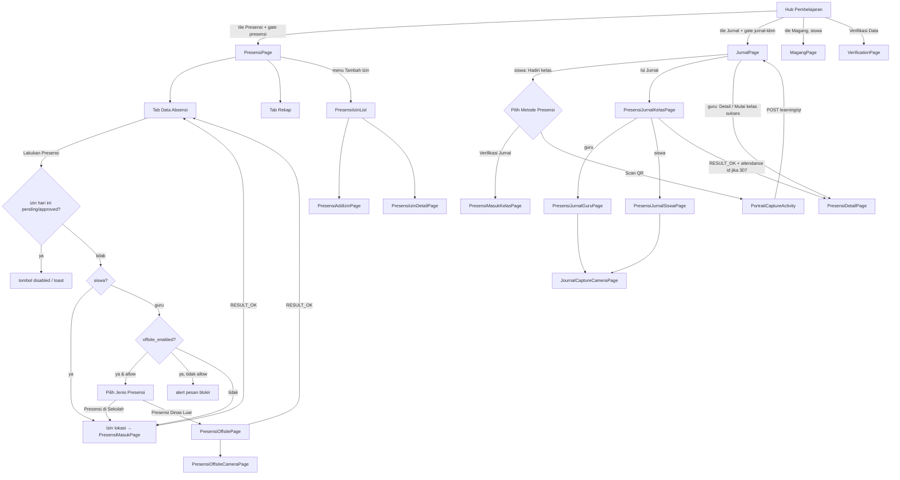
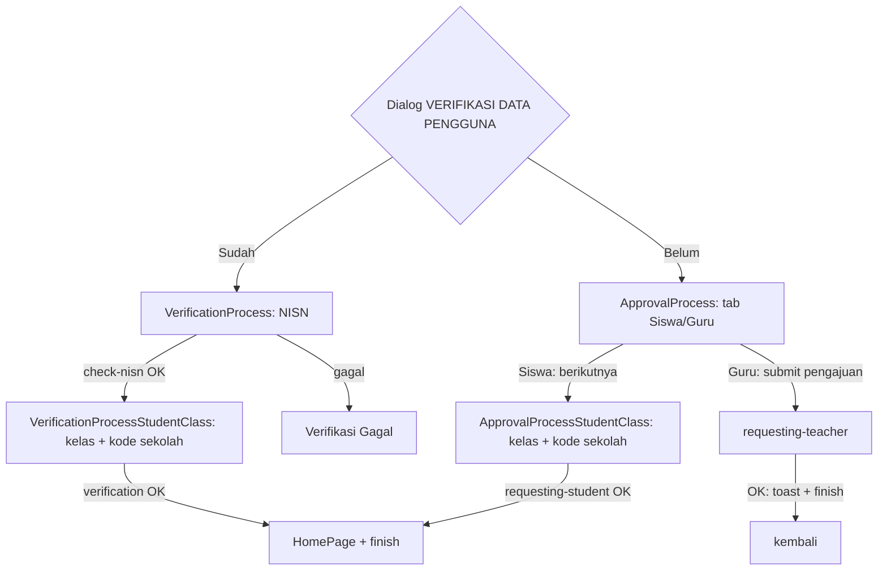

# 07 — Presensi (Sekolah, Dinas Luar, Jurnal KBM, QR, Izin), Magang, Prokes & Verifikasi Akun

Spesifikasi perilaku modul presensi harian sekolah (onsite GPS/radius, dinas luar/offsite dengan foto
selfie berwatermark), Jurnal KBM guru & siswa (plot waktu, presensi kelas via "Verifikasi Jurnal" atau
scan QR, detail jurnal + status kehadiran siswa, capture foto suasana KBM), pengajuan izin/sakit,
magang (jadwal, presensi lokasi perusahaan, laporan harian, izin magang), protokol kesehatan (prokes —
modul ini **tidak punya titik masuk aktif**) serta verifikasi/pengajuan data akun, pada aplikasi lama
`android-portal` v2.1.40 (versionCode 79). Termasuk commit terbaru `ac74f000 feat: add capture jurnal`
(24-09-2026) dan `4d5f2d17 fix : improve fitur presensi` (25-09-2026).

> Singkatan path: `@/` = `android-portal/app/src/main/java/id/diskola/app/`,
> `res/` = `android-portal/app/src/main/res/`. Nomor baris mengacu ke kode per 29-09-2026.
> Layar "Kelas berlangsung" & banner absensi di hub Pembelajaran dibahas di `05-pembelajaran-materi-tugas.md`;
> routing notifikasi FCM di `03-home-navigasi-akun-notifikasi.md`; interceptor & Room global di `10-…`.

## Daftar isi
1. [Ringkasan, peran & syarat akses](#1-ringkasan-peran--syarat-akses)
2. [Titik masuk](#2-titik-masuk)
3. [Peta layar & alur](#3-peta-layar--alur)
4. [Presensi — shell, Data Absensi, Rekap](#4-presensi--shell-data-absensi-rekap)
5. [Presensi sekolah (onsite) — `PresensiMasukPage`](#5-presensi-sekolah-onsite--presensimasukpage)
6. [Presensi dinas luar (offsite) + kamera selfie](#6-presensi-dinas-luar-offsite--kamera-selfie)
7. [Jurnal KBM — daftar jadwal, presensi kelas, QR](#7-jurnal-kbm--daftar-jadwal-presensi-kelas-qr)
8. [Jurnal KBM — form isi jurnal guru/siswa + capture foto](#8-jurnal-kbm--form-isi-jurnal-gurusiswa--capture-foto)
9. [Jurnal KBM — detail jurnal & status kehadiran siswa](#9-jurnal-kbm--detail-jurnal--status-kehadiran-siswa)
10. [Izin/sakit presensi](#10-izinsakit-presensi)
11. [Magang](#11-magang)
12. [Prokes (protokol kesehatan)](#12-prokes-protokol-kesehatan)
13. [Verifikasi & pengajuan data akun](#13-verifikasi--pengajuan-data-akun)
14. [Kontrak API](#14-kontrak-api)
15. [Data lokal](#15-data-lokal)
16. [Perilaku perangkat/latar (ringkasan lintas fitur)](#16-perilaku-perangkatlatar-ringkasan-lintas-fitur)
17. [Aturan bisnis & edge case lintas fitur](#17-aturan-bisnis--edge-case-lintas-fitur)
18. [Catatan migrasi Compose](#18-catatan-migrasi-compose)
19. [❓ Keputusan yang perlu dikonfirmasi](#19--keputusan-yang-perlu-dikonfirmasi)
20. [Selisih dengan dokumen lama](#20-selisih-dengan-dokumen-lama)
21. [Checklist paritas](#21-checklist-paritas)

---

## 1. Ringkasan, peran & syarat akses

| Fitur | Pengguna | Syarat akses | Sumber syarat |
|---|---|---|---|
| Presensi (`PresensiPage`) | Siswa & guru/staff | Menu "Presensi" hanya bisa dibuka bila pref `is_having_class`=true (selain itu dialog "terkunci"); lalu **feature gate** `presensi` | `@/pages/pembelajaran/PembelajaranPage.kt:630-637`, `@/pages/presensi/PresensiPage.kt:40` |
| Presensi dinas luar (offsite) | **Hanya guru/staff** (`is_student`=false) | Server: `GET mobile/attendance/staff/offsite/check` → `offsite_enabled` & `allow_attendance` | `@/pages/presensi/PresensiAbsenPage.kt:95-109`, `@/pages/presensi/PresensiOffsitePage.kt:75-79` |
| Jurnal KBM (`JurnalPage`) | Siswa (isi jurnal siswa, presensi kelas, QR) & guru (isi jurnal, mulai kelas, detail & status siswa) | `is_having_class`=true + feature gate `jurnal-kbm` | `@/pages/pembelajaran/PembelajaranPage.kt:639-646`, `@/pages/presensi/JurnalPage.kt:72` |
| Izin/sakit presensi | Siswa & guru/staff (endpoint dibedakan `is_student`) | Toolbar Presensi → "Tambah Izin", atau notifikasi `leave-request*`/`izin` | `@/pages/presensi/PresensiPage.kt:93-96`, `@/services/NotifRouter.kt:84-89` |
| Magang (`MagangPage`) | **Hanya siswa** (tile "Magang" dihapus untuk non-siswa) | `is_having_class`=true; **tanpa** feature gate | `@/pages/pembelajaran/PembelajaranPage.kt:226-236`, `:683-697` |
| Prokes (`ProkesPage`) | Siswa (form + vaksin), guru (screening + vaksin) | **Tidak ada titik masuk** — satu-satunya pemanggil dikomentari | `@/pages/pembelajaran/PembelajaranPage.kt:710` |
| Verifikasi & pengajuan data | Akun Guest / belum punya kelas | Tombol "Verifikasi Data" di hub Pembelajaran (kondisi di §13) | `@/pages/pembelajaran/PembelajaranPage.kt:158-207`, `:362-379` |

Peran dibaca dari SharedPreferences `is_student`, `is_teacher`, `is_having_class`, `role_label`
(ditulis saat login/refresh user, lihat dok 02/03). Orang tua tidak punya `is_having_class` → semua
tile di atas terkunci.

**Feature gate** (`@/feature/FeatureGate.kt`): sebelum membuka Presensi/Jurnal, app memanggil
`GET mobile/app/check-feature-availability?name=presensi|jurnal-kbm` dengan loading
`"Memeriksa ketersediaan fitur…"`. `available=false` → bottom sheet "Fitur Belum Tersedia di Aplikasi"
(pesan API untuk guru + tombol "Buka Website" ke `/presensi/presensi-guru-staff/presensi` atau
`/jurnal-kbm/presensi-kelas`; siswa: `"Fitur ini sedang diperbarui. Silakan coba lagi nanti."`).
Gagal jaringan → **fail-open** (tetap dibuka) (`@/viewmodels/GeneralViewModel.kt:48-60`). Activity
Presensi/Jurnal juga menjalankan `guardFeatureOnCreate` (untuk jalur notifikasi) sehingga saat dibuka
dari tile, pengecekan terjadi **dua kali** (tile + onCreate) — lihat §18.

---

## 2. Titik masuk

| Layar | Dari | Extras |
|---|---|---|
| `PresensiPage` | Tile "Presensi" (`PembelajaranPage` pos 2); CTA banner absensi di hub Pembelajaran (`:971`); `AgendaMingguanListFragment:51`; FCM menu `presensi` (`@/services/NotifRouter.kt:71`); notifikasi in-app kategori `PRESENCE` (`@/pages/notification/NotificationPage.kt:280-286`, `DetailNotification.kt:165`) | `child_id` (dikirim notifikasi, **tidak dibaca**) |
| `JurnalPage` | Tile "Jurnal" (pos 3); notifikasi `JOURNAL` (`NotificationPage.kt:288-294`) | `child_id` (tidak dibaca) |
| `PresensiMasukPage` | `PresensiAbsenPage` (startActivityForResult 492); klik notifikasi geofence (`@/pages/presensi/GeofenceBroadcastReceiver.kt:36`) | — |
| `PresensiOffsitePage` | `PresensiAbsenPage` (req 493) | `extra_offsite_enabled`, `extra_allow_attendance`, `extra_type_attendance`, `extra_button_label`, `extra_require_photo`, `extra_error_label`, `extra_check_message` (`PresensiOffsitePage.kt:479-485`) |
| `PresensiJurnalKelasPage` | "Isi Jurnal" di `JurnalPage`/`PresensiKelasPage`/hub Pembelajaran | `ID_PLOT: Int` (id time plot) |
| `PresensiIzinList` | Menu "Tambah Izin"; FCM `leave-request`/`izin` tanpa uuid | `extra_izin_filter` = `semua`/`approved`/`rejected`/`pending` |
| `PresensiIzinDetailPage` | Item daftar izin; FCM `leave-request-approved`/`-rejected`/`leave-request`/`izin` dengan uuid (`NotifRouter.kt:97-106`) | `extra_leave_request_uuid` |
| `MagangPage` | Tile "Magang" (pos 6, siswa); success dialog presensi magang (restart) | — |
| `MagangIzinList` | Menu "Tambah Izin" di `MagangPage` | — |
| `VerificationPage` | Dialog "VERIFIKASI DATA PENGGUNA" di hub Pembelajaran: "Sudah" → alur verifikasi; "Belum" → alur pengajuan | `requestApproval: Boolean` (`PembelajaranPage.kt:375`) |
| `ProkesPage` | — (mati) | — |

Tile di hub Pembelajaran (siswa): `Materi, Tugas, Presensi, Jurnal, Asesmen, Poin, Magang`; non-siswa:
`Asesmen` & `Magang` dihapus, guru menambah "Agenda Mingguan" di index 4
(`PembelajaranPage.kt:212-250`). Klik memakai **posisi** (`menuClickHandler`, `:600-697`).

---

## 3. Peta layar & alur

| Layar | File | Layout | Tujuan |
|---|---|---|---|
| PresensiPage (Activity, shell) | `@/pages/presensi/PresensiPage.kt` | `presensi_page.xml` + `presensi_nav.xml` | Tab Data Absensi/Rekap, menu Tambah Izin/Panduan |
| PresensiAbsenPage (Fragment, start dest.) | `PresensiAbsenPage.kt` | `presensi_absen_page.xml`, `presensi_absen_item.xml`, `presensi_offsite_detail_dialog.xml` | Riwayat bulanan + tombol "Lakukan Presensi" |
| PresensiRekapPage (Fragment) | `PresensiRekapPage.kt` | `presensi_rekap_page.xml`, `presensi_rekap_item.xml` | Rekap tahunan H/T/I/S |
| PresensiKelasPage (Fragment) | `PresensiKelasPage.kt` | `presensi_kelas_page.xml` | **Tidak terjangkau** (tombol "Kelas" `visibility=gone`) |
| PresensiMasukPage (Activity) | `PresensiMasukPage.kt` | `presensi_masuk_page.xml` (+ dialog `presensi_masuk_dialog`, `presensi_success_dialog`, `presensi_izin_lokasi_dialog`, `presensi_pengaturan_absen`) | Absen masuk/pulang sekolah dengan peta & radius |
| PresensiOffsitePage (Activity) | `PresensiOffsitePage.kt` | `presensi_offsite_page.xml` | Absen dinas luar |
| PresensiOffsiteCameraPage (Activity, portrait) | `PresensiOffsiteCameraPage.kt` | `presensi_offsite_camera_page.xml` | Selfie kamera depan + watermark |
| JurnalPage (Activity) | `JurnalPage.kt` | `jurnal_page.xml`, `presensi_kelas_item.xml` (siswa), `presensi_teacher_kelas_item.xml` (guru), `dialog_confirm_subject.xml` | Jadwal KBM hari ini |
| PortraitCaptureActivity | `PortraitCaptureActivity.kt` | zxing | Scanner QR potret |
| PresensiMasukKelasPage (DialogFragment full) | `PresensiMasukKelasPage.kt` | `presensi_masuk_kelas_page.xml`, `pretty_alert_dialog_load_rg.xml` | "Verifikasi Jurnal" siswa (status sesi) |
| PresensiJurnalKelasPage (Activity host) | `PresensiJurnalKelasPage.kt` | `presensi_jurnal_kelas_page.xml` + `class_journal_nav.xml` | Host form jurnal |
| PresensiJurnalGuruPage (Fragment, start) | `PresensiJurnalGuruPage.kt` | `presensi_jurnal_guru_page.xml` | Form jurnal guru |
| PresensiJurnalSiswaPage (Fragment) | `PresensiJurnalSiswaPage.kt` | `presensi_jurnal_siswa_page.xml` | Form jurnal siswa |
| ListClassPage (DialogFragment) | `@/pages/presensi/ListClassPage.kt` | `list_violation_page.xml`, `list_sekolah_item.xml` | Picker kelas/mapel/guru |
| JournalCaptureCameraPage (Activity, portrait) | `JournalCaptureCameraPage.kt` (+ `JournalCaptureController.kt`) | `journal_capture_camera_page.xml`, `image_preview_dialog.xml` | Foto suasana KBM |
| PresensiDetailPage (DialogFragment, non-cancelable) | `PresensiDetailPage.kt`, `RowAttendanceAdapter.kt` | `presensi_detail_page.xml`, `presensi_check_item.xml`, `dialog_edit_learning_objective.xml` | Detail jurnal + status siswa |
| PresensiIzinList / PresensiAddIzinPage / PresensiIzinDetailPage | `PresensiIzin*.kt`, `PresensiIzinViewModel.kt` | `presensi_izin_list*.xml`, `presensi_add_izin_page.xml`, `presensi_izin_detail_page.xml` | Izin/sakit |
| StartSchedulePage, AttendSchedulePage | `StartSchedulePage.kt`, `AttendSchedulePage.kt` | `start_schedule_page.xml`, `attend_schedule_page.xml` | **Kode mati** (tidak ada pemanggil) |
| SuccessPage / SuccessActivity / FailedPage (`.pages.presensi`) | — | — | **Hanya di manifest, kelasnya tidak ada** (`res/../AndroidManifest.xml:66-74`) |
| Magang: MagangPage, MagangSchedulePage, MagangReportPage, MagangAttendPage, MagangWriteReport, MagangIzinList/Add/Detail | `@/pages/magang/*` | `magang_*.xml`, `magang_nav.xml`, `dialog_absensi_berhasil.xml` | §11 |
| Prokes: ProkesPage, ProkesForm, ProkesPusatInfo, InfoCovidPage, FormulirPage, CekPengisianPage, ScreeningClass, ScreeningStudent, ScreeningFormPage (+Form1/Form2), CekScreeningPage | `@/pages/prokes/**` | `prokes_*.xml`, `formulir_page.xml`, `cek_*`, `screening_*`, `info_covid_page.xml`, `prokes_nav.xml`, `prokes_screening_nav.xml` | §12 |
| Verifikasi: VerificationPage, VerificationProcess, VerificationProcessStudentClass, ApprovalProcess, ApprovalProcessStudentClass, ListClassPage, ListRolePage | `@/pages/verification/**` | `verification_*.xml`, `approval_process*.xml`, `verification_nav.xml` (`approval_nav.xml` tidak dipakai) | §13 |

---

## 4. Presensi — shell, Data Absensi, Rekap

### 4.1 `PresensiPage` (shell)
- Toolbar `"Presensi"` + back (`supportFinishAfterTransition`). Menu (`res/menu/menu_presensi.xml`):
  `"Tambah Izin"` → `PresensiIzinList`; `"Panduan"` → onboarding 3 langkah (`PresensiPage.kt:168-195`):
  "Data Absensi"/"Ketuk untuk melihat data absensi harian Anda.", "Rekap Absensi"/"Ketuk untuk melihat
  rekap absensi dalam periode tertentu.", "Tambah Izin"/"Ketuk ikon ini untuk mengajukan atau melihat
  pengajuan izin presensi.". Tidak tampil otomatis.
- Tab button: `"Kelas"` (**gone**), `"Data Absensi"`, `"Rekap Absensi"`; tab aktif = stroke & teks
  `colorPrimary`, lainnya abu (`:138-148`). Start destination `presensiAbsenPage`
  (`res/navigation/presensi_nav.xml:6`). Catatan: saat dibuka, tombol "Data Absensi" **tidak** diberi
  gaya aktif sampai diklik (gaya awal dari XML).
- **Cek jam otomatis** di setiap `onResume` (`PresensiPage.kt:104-136`): bila
  `Settings.System.AUTO_TIME` atau `AUTO_TIME_ZONE` ≠ 1 → dialog non-cancelable (layout
  `presensi_izin_lokasi_dialog`) judul `"Peringatan"`, pesan
  `"Harap atur tanggal dan waktu ponsel ke \"Otomatis\""`, tombol `"Buka Pengaturan"`
  (`Settings.ACTION_DATE_SETTINGS`) / `"Jangan Ubah"` (tutup activity). Sama di `JurnalPage:188-220`
  dan `MagangSchedulePage:108-137`. Ini satu-satunya "anti-kecurangan" perangkat (lihat §16.4).
- `stringError` dari VM ditampilkan sebagai toast (`:57`).

### 4.2 `PresensiAbsenPage` (Data Absensi)
UI (`presensi_absen_page.xml`): label bulan `"Bulan ini • September 2026"` / `"September 2026"`
(`PresensiBindConverter.calendarToMonthFormat`), panah prev/next (±1 bulan), header `"Tanggal"`,
`"Jam masuk"`, `"Jam keluar"`, list + SwipeRefresh, tombol `"Lakukan Presensi"` (enabled =
`canPerformAttendance`).

Item (`presensi_absen_item.xml`):
- Tanggal `d MMM yyyy` (Locale id), latar abu kecuali hari libur.
- Jam masuk: jika izin hari itu **approved** → `"Sakit"`/`"Izin"` warna `izin_status_approved`; selain
  itu `HH:mm` atau `"-"`; merah bila `attend_is_late` atau kosong.
- Jam keluar `HH:mm` atau `"-"`; merah bila `leave_is_early` atau kosong.
- Hari libur (`is_holiday`) → kolom disembunyikan, teks `"Libur"` membentang.
- Ikon mata (contentDescription `"Detail presensi dinas luar"`) muncul bila `attend_is_offsite` /
  `leave_is_offsite` → bottom sheet (`PresensiAbsenPage.kt:318-371`): judul `"Presensi Masuk Dinas Luar"`
  / `"Presensi Pulang Dinas Luar"`, `"Status"` (merah bila mengandung "Terlambat"/"Awal"), `"Jam"`,
  `"Alamat"`, `"Catatan"`, `"Foto Bukti"` (Glide centerCrop; ketuk → dialog PhotoView), tombol `"OKE"`.
  Nilai kosong → `"-"`.

Data (`PresensiViewModel.refreshAbsenPage`, `:599-613`), dipanggil **setiap `onResume`** & swipe:
1. Tampilkan dulu cache Room `absensi` bulan/tahun terpilih.
2. `refreshAttendanceGate()` → `canPerformAttendance = status !in [pending, approved]` dengan status
   diambil dari Room `leave_request` tanggal hari ini, fallback `absensi.leave_request_status` (`:615-627`).
3. `GET student/by-month` atau `staff/by-month` (`year`, `month` 1-based). Setiap item: `dateLabel`,
   `month`, `year` dihitung; `attend_at`/`leave_at` diubah `yyyy-MM-dd HH:mm:ss` → `HH:mm`. Simpan Room +
   sinkron leave request lokal (`LeaveRequestSync`, uuid `local_<date>`). Data kosong → toast
   `"data kehadiran tidak tersedia"`; error → toast pesan exception.
4. Gate dihitung ulang; guru: `checkOffsiteAvailable()` (§6.1).

Tombol "Lakukan Presensi" (`PresensiAbsenPage.kt:90-110`):
- `canPerformAttendance=false` → toast `"Pengajuan izin/sakit hari ini masih diproses atau sudah disetujui."`
  (secara praktis tombol sudah disabled oleh binding).
- Siswa → alur onsite. Guru: `offsite_enabled && allow_attendance` → dialog `"Pilih Jenis Presensi"`
  item `"Presensi di Sekolah"` / `"Presensi Dinas Luar"`; `offsite_enabled` saja → alert pesan
  `resolveOffsiteBlockMessage` (jika pesan mengandung "Workgroup" → `"Maaf anda belum memiliki pengaturan jam"`,
  selain itu `attendance_response_text` lalu `message`); selain itu → onsite.
- **Alur izin lokasi onsite** (`:133-218`): jika `ACCESS_BACKGROUND_LOCATION` belum granted → dialog
  `"Informasi Tambahan"`: `"Aplikasi Diskola mengambil data lokasi anda untuk mengaktifkan fitur absensi yang berjalan di latar belakang aplikasi \n\n Pilih \n'Allow all the time' \natau\n 'Izinkan sepanjang waktu'"`,
  tombol `"Setuju"` → minta FINE+COARSE → (API ≥ 29) minta BACKGROUND → buka `PresensiMasukPage`;
  `"Tidak Setuju"` → alert `"Absensi tidak dapat dilakukan tanpa informasi lokasi Anda"` lalu **tutup
  PresensiPage**. FINE/COARSE ditolak → alert yang sama + tutup. BACKGROUND ditolak → alert yang sama
  (tetap di halaman). Catatan: background location **selalu** diwajibkan di sini (API ≥ 29), terlepas
  dari setelan radius sekolah — lihat ❓.
- Hasil `RESULT_OK` dari masuk/offsite → `getAbsensi()` (`:281-289`).

### 4.3 `PresensiRekapPage` (Rekap)
- Label tahun `"Tahun ini • 2026"` / `"2025"`; prev/next ±1 tahun (alpha 0.4 & tidak bisa diklik saat
  `rekapFilterEnabled=false`). Header `"Bulan"`, `"H"`(Hadir), `"T"`(Terlambat), `"I"`, `"S"`. Kolom
  `alpha` **tidak ditampilkan**. `T` merah bila > 0 (`PresensiRekapPage.kt:92-108`).
- `loadRekap(force=false)` saat dibuka (`PresensiViewModel.kt:695-726`): tampilkan cache Room tahun
  itu; jika cache ada dan bukan force → **tidak memanggil jaringan**. Swipe → force. Saat fetch:
  filter dinonaktifkan, lalu **cooldown 5 detik** setelah selesai sebelum prev/next aktif lagi
  (`:728-735`). Item: `date = "<month> <year>"`, `order` = index respons. Kosong → toast
  `"data rekap tidak tersedia"`.

---

## 5. Presensi sekolah (onsite) — `PresensiMasukPage`

Satu layar untuk siswa & guru (masuk/pulang ditentukan server). ViewModel **instance baru**
(`viewModels`), bukan milik PresensiPage.

### 5.1 UI (`presensi_masuk_page.xml`)
Toolbar `"Masuk Sekolah"` ikon close; avatar + nama (`pref user`); `"Presensi terakhir " + <dateLabel>, <leave_at atau attend_at>`
dari Room `getLastAbsensi()` (disembunyikan bila kosong); peta Google Maps; tombol my-location (zoom 16);
tanggal `EEEE, dd MMM yyyy` & jam `HH:mm:ss` yang berdetak tiap 1 detik (`:761-770`); label status
(`attendance_response_text`, tampil bila `allowChecklog`=false); info jadwal
`"Jadwal absen dari " + ("Pengaturan jam"|"Kalender"|source)` dan `"Mulai " + start + ", Pulang " + end`
(tampil bila schedule punya start/end); tombol aksi berteks `attendance_response_text_button`;
`"Absensi bisa dilakukan dimanapun"` tampil bila `absence_setting`=false.

### 5.2 Urutan saat dibuka
1. Loading `"menampilkan data"` (`:294`, `:471`).
2. `init{}` (`:98-116`): unduh avatar (`GET <user_avatar_image>` via `ApiService.download`), crop lingkaran
   24sdp jadi ikon marker, **baru kemudian** `checkAbsent()` — `GET student/check` atau `staff/check`.
   `type_attendance` "checkin" (case-insensitive) → `"Masuk"`, selain itu `"Pulang"`
   (`PresensiViewModel.kt:923-946`). ⚠️ Tidak ada try/catch: bila unduh avatar gagal, pengecekan tidak
   terjadi (dan berpotensi crash, belum terverifikasi) — lihat ❓.
3. `refreshAbsenceSetting()` (`PresensiViewModel.kt:1121-1132`): `SettingAkmCache.refresh`
   (`GET mobile/setting-akm`, TTL 12 jam, `@/pages/akm/SettingAkmCache.kt:35,43-93`) lalu baca Room
   `akm_settings.absence_setting`; nilai tak ada/`-1`/error → **true**. `absence_setting=true` =
   **radius dibatasi** (`isRadiusRestricted()`, `PresensiMasukPage.kt:96`).
4. Izin lokasi (`:772-846`): bila radius dibatasi & background belum granted → dialog "Informasi
   Tambahan" (sama §4.2); lalu FINE+COARSE → `initLocationRequest()`; bila radius dibatasi & API ≥ 29 →
   BACKGROUND. Tolak FINE → alert + finish; tolak BACKGROUND → alert (tanpa finish).
5. Titik & radius sekolah dari pref `school` (JSON `SekolahItem`: `coordinate_latitude`,
   `coordinate_longitude`, `coordinate_radius` String default `"50"`, `@/pages/login/LoginModels.kt:24-35`)
   via `ProfileViewModel.school`. Jika `latitude == 0.0` → alert `"Peringatan"` /
   `"Sekolah anda belum melakukan konfigurasi titik koordinat absensi, silahkan hubungi admin sekolah anda"`,
   tombol `"OKE"` → finish (`:381-389`) — **berlaku juga saat radius tidak dibatasi** (❓).
6. Peta: marker sekolah + lingkaran radius (fill `0x40ff0000`, stroke biru 2px); marker user dengan
   avatar. Geofence Play Services didaftarkan (id `"entry.key"`, ENTER|DWELL|EXIT, loitering 2 s,
   initial trigger ENTER) hanya bila radius dibatasi, radius > 0 **dan** FINE sudah granted saat onCreate
   (`:416-437`, `:499-523`); dihapus di `onDestroy`.
7. Lokasi: `LocationRequest` interval 10 s, fastest 5 s, HIGH_ACCURACY; cek setelan lokasi →
   dialog resolusi (req 423; hasil apa pun → ulang `initLocationRequest`, jadi "batal" memunculkan
   dialog lagi); `onLocationAvailability=false` → `lastLocation` (`:541-631`). Update dihentikan di
   `onPause`, dilanjut di `onResume`.

### 5.3 Aturan radius & tombol (`updateUiForGeofenceStatus`, `:722-759`)
- Jarak = `Location.distanceBetween(user, sekolah)`; di dalam bila `jarak <= radius` (meter)
  (`:634-693`). Hanya dievaluasi bila radius dibatasi, radius > 0 dan lokasi sudah ada.
- Di luar radius → tombol disembunyikan; label `"Anda berada di luar wilayah absensi"` (jika tidak ada
  error server).
- Tombol tampil bila `allow_attendance` && label tombol tidak kosong && tidak loading && tidak ada
  `attendance_response_text`.
- Dialog "Pemberitahuan": `"Presensi, Pengaturan Jam sekolah pada kelas anda belum diatur, Silahkan hubungi admin sekolah untuk informasi lebih lanjut !!!"`,
  tombol `"OKe"` — muncul bila setelah loading `allow_attendance=false` dan label tombol & teks respons
  kosong (atau `allow=true` tanpa label padahal di dalam geofence) (`:162-188`). "OKe" memanggil ulang
  alur izin lokasi.

### 5.4 Submit
Tombol → dialog `"Lakukan Absensi"`: `"Waktu tercatat saat Anda melakukan absensi, Anda yakin <Masuk|Pulang> absensi sekarang"`,
`"Ya, Absen Sekarang"` / `"Nanti Saja"` (`:300-339`). Tanpa lokasi → alert `"Gagal mendapatkan lokasi Anda"`.
Loading `"memproses absensi"` → `POST student/check-in|student/check-out|staff/check-in|staff/check-out`
body `{lat: "<double>", lng: "<double>"}` (**String**) (`PresensiViewModel.kt:1179-1206`).
- Sukses: dialog (`presensi_success_dialog`, gambar `img_absensi_success`) judul `"Absensi Waktu Berhasil"`,
  pesan `"Pencatatan waktu <Masuk|Pulang> Anda telah tersimpan, silahkan melanjutkan jadwal hari ini"`
  (Masuk) atau `"…, terima kasih"` (Pulang), tombol `"Ok"` → `RESULT_OK` + finish.
- Gagal: label status menjadi `"Gagal melakukan absensi."` dan tombol hilang (toast `stringError`
  **tidak** di-observe di layar ini, `:121`).

### 5.5 Geofence receiver (`@/pages/presensi/GeofenceBroadcastReceiver.kt`)
ENTER → toast `"Memasuki wilayah absensi"`, notifikasi `"Anda berada di wilayah absensi, silahkan lakukan absensi"`
(klik → PresensiMasukPage), broadcast `SHOW_CONFIRM_BUTTON`; DWELL → toast `"Anda berada di wilayah absensi"`
+ notifikasi + broadcast; EXIT → toast `"Meninggalkan wilayah absensi"`. Channel `GeofenceChannel`
**tidak pernah dibuat** (`createChannel` tak dipanggil) → notifikasi tidak tampil di Android ≥ 8
(belum terverifikasi di perangkat). Broadcast `SHOW_CONFIRM_BUTTON` hanya didengar
`PresensiMasukKelasPage` (§7.3); `PresensiMasukPage` mendaftarkan receiver untuk `INTERNET_LOST` yang
tidak pernah dikirim siapa pun. Keputusan "boleh absen" tetap dari perhitungan jarak, bukan geofence.

---

## 6. Presensi dinas luar (offsite) + kamera selfie

### 6.1 Cek ketersediaan (`PresensiViewModel.checkOffsiteAvailable`, `:1288-1314`)
Hanya guru: `GET staff/offsite/check` → `offsite_enabled`, `allow_attendance`, `type_attendance`
(`checkin`/`checkout`), `attendance_response_text(_button)`, `require_photo` (default true),
`message`. HTTP 403 atau error apa pun → offsite dianggap nonaktif.

### 6.2 `PresensiOffsitePage`
Siswa yang membuka → toast `"Presensi dinas luar hanya untuk guru dan staff"` + finish. State awal
di-seed dari extras (§2).

UI (`presensi_offsite_page.xml`): toolbar `"Presensi Dinas Luar"` (close); avatar+nama; peta (marker
`"Lokasi Anda"`, kamera ikut lokasi terbaru, zoom 16); input `"Alamat lokasi"` (diisi otomatis reverse
geocode `getAddressLine(0)` bila masih kosong); input `"Keterangan dinas luar"` (maxLength 500) +
counter `"<n> / min. 10 karakter"` (hijau `#4CAF50` bila ≥ 10, merah `#F44336`); `"Foto bukti"` +
tombol `"Ambil Foto"` (selalu tampil) + preview; label error; tombol aksi (label server); progress.

Tombol submit enabled bila `allow_attendance` && tidak loading && panjang catatan ≥ 10 && (foto ada
atau `require_photo=false`) (`:181-189`).

Ambil foto (`:417-450`): alamat kosong → toast `"Isi alamat terlebih dahulu sebelum mengambil foto"` +
error `"Alamat wajib diisi"`; izin CAMERA ditolak → toast `"Izin kamera dibutuhkan untuk foto bukti"`;
lalu buka kamera dengan `extra_address`, `extra_lat`, `extra_lng` (dari `lastLocation`, 0.0 bila null).
Izin lokasi: FINE belum granted → dialog "Informasi Tambahan" (`"Tidak Setuju"` → alert
`"Presensi dinas luar membutuhkan izin lokasi"` + finish). Background **tidak** diminta.

Submit (`:347-415`): dialog `"Lakukan Absensi"` pesan
`"Waktu tercatat saat Anda melakukan absensi dinas luar. Anda yakin <label> sekarang?"` (label kosong →
`"presensi"`); `"Ya, Absen Sekarang"`; tombol `"Nanti Saja"` **tidak diberi listener** (tidak melakukan
apa-apa). Loading `"Memproses presensi dinas luar"` → lokasi segar (API ≥ 31 `getCurrentLocation`
HIGH_ACCURACY maxAge 0, selain itu `lastLocation`; fallback lokasi terakhir). Null → toast
`"Gagal mendapatkan lokasi Anda"`. Alamat kosong → reverse geocode; tetap kosong → error
`"Alamat wajib diisi"`.

Validasi VM (`doOffsiteAbsensi`, `:1335-1430`): catatan trim < 10 → `"Catatan minimal 10 karakter"`,
> 500 → `"Catatan maksimal 500 karakter"` (error di field); alamat kosong → `"Alamat wajib diisi"`;
`require_photo` & tanpa foto → toast `"Foto bukti wajib diunggah"`; `type_attendance` bukan
checkin/checkout → label `"Presensi tidak dapat dilakukan saat ini"`. Multipart `lat`, `lng`,
`address` (maks 500 char), `note`, `photo` (image/jpeg) ke `staff/offsite/check-in` atau `check-out`.
- `code == 0` di respons → dianggap **gagal**: state offsite diganti isi respons (label/tombol).
- Sukses → dialog non-cancelable `"Presensi dinas luar berhasil (<status>) pada <date> pukul <time>."`,
  `"Ok"` → `RESULT_OK`.
- Error: 403 (HttpException) → offsite nonaktif + label `"Presensi dinas luar tidak aktif untuk sekolah ini"`;
  error lain → toast pesan server (cabang 400/422 berbasis `HttpException` tidak pernah jalan karena
  `ResponseInterceptor` mengubah 4xx menjadi `ApiException`, `@/api/ResponseInterceptor.kt:137-156`).

### 6.3 `PresensiOffsiteCameraPage` (selfie)
- otaliastudios `CameraView` engine camera2, **kamera depan** (`cameraFacing="front"`), preview
  di-mirror `scaleX=-1`, status bar hitam, portrait. Overlay watermark live (update tiap 1 s): alamat,
  koordinat, waktu. Tombol close & FAB `"Ambil Foto"`.
- `takePictureSnapshot()` (snapshot preview, bukan foto resolusi penuh). Proses (`:54-99`): loading
  `"Memproses foto"` → decode + transformasi EXIF (tanpa flip manual → hasil **tidak mirror**) →
  watermark → simpan `OFFSITE_<ms>_*.jpg` di `getExternalFilesDir(DIRECTORY_PICTURES)` (fallback
  `filesDir`), JPEG **quality 90**, tanpa skala/batas ukuran → `RESULT_OK` + `extra_photo_path`.
  Gagal → toast `"Gagal mengambil foto"`.

### 6.4 Watermark (`@/utils/OffsitePhotoUtil.kt`)
- Baris (offsite, `buildWatermarkLines`, `:31-38`): (1) alamat trim, kosong → `"-"`, maks 200 char;
  (2) `"%.6f, %.6f"` Locale.US; (3) `dd MMM yyyy HH:mm` Locale `id-ID` (waktu saat foto diproses).
- Gambar (`addWatermark`, `:209-238`): teks putih bold, `textSize = max(24px, 3.5% lebar)`, padding =
  textSize, jarak baris 1.35×, dibungkus per lebar; latar hitam alpha 170 di dasar foto.

---

## 7. Jurnal KBM — daftar jadwal, presensi kelas, QR

### 7.1 `JurnalPage`
Toolbar `"Jurnal"`; navigasi tanggal ada di layout tetapi **gone** → selalu hari ini
(`calKelas`). SwipeRefresh; list; empty state (`EmptyStateView`): judul `"Belum ada jurnal hari ini"`,
deskripsi `"Jadwal atau sesi jurnal untuk tanggal ini masih kosong."`, tombol `"Muat ulang"`
(`JurnalPage.kt:156-177`). Dibuka: `loadTeacherDataScope()` + `getSchedule()` (`:179-180`).

`getSchedule()` (`PresensiViewModel.kt:444-581`): tampilkan cache Room (query rusak, lihat §17) →
`GET mobile/attendance/schedule?date=yyyy-MM-dd`. Respons = daftar **plot waktu**
(`PresensiItem{id, start_at, end_at, school_attendances[]}`); list di-flatten menjadi `ScheduleTable`:
- Tiap attendance: `plot_start_at/plot_end_at` → `HH:mm`; jika jam sekarang **sebelum** mulai plot
  (dan tidak dalam rentang) → `status = "Kelas belum dimulai"`.
- Plot tanpa attendance → baris sintetis `id = plot.id`, `subject_name = "Jam Pelajaran - <n>"`,
  `teacher_name = "Kosong"`, `status = "Kosong"` (guru); siswa: `"Kelas belum dimulai"` bila baris
  sebelumnya `"Kosong"`, selain itu `"Kosong"`.
- **Khusus siswa** (`:549-567`): jika status baris sebelumnya `"Kosong"` atau `""` → semua baris
  berikutnya dipaksa `"Kelas belum dimulai"`; selain itu baris yang jamnya belum mulai → `"Kelas belum dimulai"`.
  Efek: siswa hanya bisa mengisi jurnal/presensi plot secara berurutan.
- Kosong → toast `"tidak terdapat jadwal"`.

Item siswa (`presensi_kelas_item.xml` + logika `JurnalPage.Viewholder`, `:284-404`): ikon mapel (Glide
atau `ic_school_login`), nama mapel, guru, `"Pukul"` `start - end`. Visibilitas akhir:

| Kondisi | Tampil |
|---|---|
| `status == "Kosong"` | tombol `"Isi Jurnal"` saja |
| status ada & `is_present` | teks `"Anda Hadir Dikelas Ini"` |
| status ada & belum hadir | teks status (mis. `"Kelas belum dimulai"`, `"Terlaksana"`) |
| status kosong | tombol `"Hadiri kelas"` |

"Hadiri kelas" → dialog `dialog_confirm_subject` judul `"Pilih Metode Presensi"`, pesan
`"Silakan pilih metode yang ingin digunakan untuk presensi."`, tombol `"Verifikasi Jurnal"` (manual →
`PresensiMasukKelasPage`) dan `"Scan QR"`. Manual tampil bila belum hadir atau (hadir tanpa status);
QR hanya bila belum hadir **dan** jam sekarang `>= mulai && < selesai` plot (`:362-403`).

Item guru (`presensi_teacher_kelas_item.xml`, `:475-540`): teks status tampil hanya `"Kosong"`;
`"Detail"` bila `late_at` tidak null/kosong (kelas sudah dimulai) → `PresensiDetailPage(id, created_at, "HH:mm - HH:mm")`;
`"Mulai kelas"` bila status bukan Kosong/outrange dan `late_at == null`; `"Isi Jurnal"` bila `"Kosong"`.
"Mulai kelas" → lokasi best-effort (§8.4) → `POST mobile/attendance/check-in`
`{school_attendance_id, lat?, lng?}` (**tanpa cek radius**) → dialog sukses pesan `"Absensi berhasil"`,
`"Ok"` → buka detail. Gagal → toast pesan.

"Isi Jurnal" → `PresensiJurnalKelasPage` (`ID_PLOT` = id baris = id plot) via launcher; `RESULT_OK` →
`getSchedule()` dan bila ada `extra_open_attendance_id` → buka `PresensiDetailPage(id, tanggal hari ini, "")`
(`JurnalPage.kt:49-66`).

### 7.2 Scan QR (siswa)
`IntentIntegrator` (zxing-android-embedded): format QR_CODE, prompt `"Scan QR Code"`, kamera belakang
(id 0), beep, orientasi terkunci, `PortraitCaptureActivity` (`:462-473`). Batal → toast
`"QR Code dibatalkan"`. Isi QR di-split `"_"`, minimal 12 bagian; indeks **2** = time_plot_id,
**4** = subject_id, **6** = class_id, **8** = teacher_id, **10** = schedule_id (Int). QR tidak valid
diabaikan tanpa pesan (hanya log) (`:561-593`). `POST mobile/attendance/student/learning/qr`
`{time_plot_id, subject_id, class_id, teacher_id, schedule_id}`.
- Sukses → `prettyAlert` gambar sukses, judul `"Presensi Berhasil"`, pesan
  `"selamat datang dan selamat belajar \n bakajar lah dengan giat untuk mencapai\n masa depan mu !!"`,
  `"Tutup"` → `recreate()`.
- Gagal → judul `"Presensi Gagal"`, pesan server (`message`/`error`), fallback
  `"Terjadi kesalahan saat presensi."` / `"Gagal menghubungi server."` / `"Presensi gagal."`.
Alur QR yang sama ada di hub Pembelajaran (dok 05).

### 7.3 `PresensiMasukKelasPage` ("Verifikasi Jurnal" siswa)
Toolbar `"Masuk Kelas"`; nama kelas & mapel (`currSchedule` dari Room); peta sekolah + lingkaran;
tombol `"Konfirmasi"`. Alur (`PresensiMasukKelasPage.kt:85-245`):
- `refreshAbsenceSetting()`, lalu izin FINE+COARSE (+BACKGROUND bila radius dibatasi & API ≥ 29).
  Tolak FINE saat dibatasi → alert + **finish activity**; tidak dibatasi → tombol tampil.
- Radius dibatasi: tombol muncul bila `jarak <= coordinate_radius`; bila koordinat sekolah 0 →
  geocode nama sekolah (`Geocoder.getFromLocationName`, di main thread). Juga muncul saat broadcast
  `SHOW_CONFIRM_BUTTON`. Tidak dibatasi → tombol langsung tampil. (Visibilitas awal dihitung sebelum
  setelan selesai di-refresh — race, §17.)
- "Konfirmasi" → dialog `"Pilih status pembelajaran"` radio `"Terlaksana"`/`"Penugasan"`/`"Tidak Terlaksana"`,
  `"PROSES"`; tanpa pilihan → alert `"Pilih status pembelajaran"`; dibatasi & tanpa lokasi → alert
  `"Gagal mendapatkan lokasi Anda"`. Loading `"memulai kelas"` →
  `PUT mobile/attendance/student/journal-update` `{school_attendance_id, status}` (**tanpa lat/lng**).
  Sukses → tutup & refresh jadwal; gagal → toast (via observer JurnalPage).

---

## 8. Jurnal KBM — form isi jurnal guru/siswa + capture foto

`PresensiJurnalKelasPage` menambah `ID_PLOT` ke `selectedPlot`; siswa → navigate ke form siswa
(`PresensiJurnalKelasPage.kt:21-26`). Back/nav → finish.

### 8.1 Form guru (`PresensiJurnalGuruPage`)
UI: toolbar `"Jurnal Mengajar"`, `"Detail Jurnal"`; hint scope `"Hanya menampilkan kelas/mapel/jam dari jadwal Anda"`
bila `teacher_master_data_scope == "assigned"`; `"Plot Waktu :"` + chip; error `"pilih secara urut"`;
`"Kelas :"` (hint `"Pilih Kelas"`), `"Mata Pelajaran :"` (hint `"Pilih Mata Pelajaran"`),
`"Tujuan Pembelajaran :"` (hint `"Isikan disini ..."`), blok capture (§8.3), tombol `"proses"`.
- Chip dari `GET list-plot` (hanya bila `is_teacher`), teks `"<start> - <end>"`, chip `ID_PLOT`
  terpilih awal. Aturan: memilih harus **berurutan** (index = terakhir + 1); pilihan tak berurutan atau
  melepas chip mana pun → semua pilihan dibersihkan + error tampil (`:137-176`).
- Picker (`ListClassPage`): judul `"Pilih Kelas"`/`"Pilih Mata Pelajaran"`/`"Pilih Guru"`, cari
  debounce 500 ms, paging 20 (Room `class_journal_item` + boundary), label kelas `"<grade> - <name>"`.
- Kirim (`:204-254`): wajib foto bila `required` → toast `"Foto suasana KBM wajib diambil"`; semua isian
  + plot wajib → selain itu toast `"Data isian tidak lengkap"`. Loading `"mengunggah data"`, tombol
  disabled. Multipart `POST mobile/attendance/journal`: `school_time_plot_id[]` (distinct),
  `school_subject_id`, `school_class_id`, `learning_objective`, `capture_photo?`.
- Sukses → `prettyAlert` `"Pemberitahuan"` / `"Jurnal kelas berhasil diproses"` / `"Baik"` → RESULT_OK.
  HTTP 307 dengan `attendance_id` (atau `subject_schedule_id_squence`/`_sequence` CSV) → `"Jurnal sudah ada"`
  / `"Jurnal untuk jadwal ini sudah dibuat. Membuka detail jurnal."` / `"Buka"` → RESULT_OK +
  `extra_open_attendance_id`. Error lain → toast `journalErrorMessage` (§14.3).

### 8.2 Form siswa (`PresensiJurnalSiswaPage`)
Toolbar `"Jurnal Mengajar"`; chip plot **non-aktif** (hanya plot terpilih disorot); `"Mata Pelajaran :"`;
`"Guru :"` (hint `"Pilih Guru"`); `"Status Pembelajaran :"` radio `"Terlaksana"`, `"Penugasan"`,
`"Tidak Terlaksana"`; capture; `"proses"`. Validasi: foto wajib (bila required) → toast sama; guru,
mapel, status wajib → toast `"Mohon isi keterangan terlebih dahulu"`. Lokasi best-effort lalu
`POST mobile/attendance/student/journal-student` multipart: `school_time_plot_id[]`,
`school_subject_id`, `teacher_id` (UUID `TeacherItem.user.id`), `school_class_id` (pref `class_id`),
`status`, `lat?`, `lng?`, `capture_photo?` (`PresensiViewModel.kt:204-222`). Hasil/307 sama dengan guru.

### 8.3 Capture foto suasana KBM (fitur baru, `ac74f000`)
- Setelan: `GET mobile/attendance/journal-capture-scope` setiap form dibuka; `required` disimpan ke pref
  `journal_capture_required` (fallback saat gagal) (`PresensiViewModel.kt:162-173`). Required → tanda
  `"*"` di judul `"Foto Suasana KBM"`. Enforcement **hanya toast saat submit** (tombol tidak di-disable).
- Blok UI: preview (tersembunyi awal; ketuk → dialog PhotoView judul `"Foto Suasana KBM"`), hint
  `"Ketuk foto untuk melihat penuh"`, `"Ambil Foto"`, `"Hapus"` (muncul setelah ada foto), keterangan
  `"Ambil foto suasana kelas. Maks 2 MB."`. **Hanya kamera**, tidak ada galeri.
- Izin (`JournalCaptureController.kt:65-95`): minta CAMERA + FINE + COARSE sekaligus; hanya CAMERA yang
  wajib (toast `"Izin kamera diperlukan untuk mengambil foto"`), lokasi opsional.
- `JournalCaptureCameraPage`: kamera **belakang** default, tombol flip (`"Ganti kamera"`), hint
  `"Foto suasana kelas saat KBM berlangsung"`, FAB capture; preview kamera depan di-mirror, hasil tidak.
  `takePicture()` (resolusi penuh) → loading `"Memproses foto"` → lokasi (timeout 4 s) + reverse geocode
  (timeout 4 s) → `prepareCapturePhoto` (`OffsitePhotoUtil.kt:99-134`):
  1. decode + EXIF; 2. watermark **selalu** (kamera depan maupun belakang): [alamat ≤200 char bila ada,
  `"lat, lng"` bila ada, `dd MMM yyyy HH:mm`]; 3. skala turun sisi terpanjang ≤ **1600 px**; 4. JPEG
  quality 90, turun 10 per iterasi sampai ≤ **2 MB** (quality terendah 40); file
  `kbm_capture_<ms>_*.jpg` di external Pictures. Gagal → toast `"Gagal mengambil foto"`.
- MIME part `capture_photo`: `.png` → image/png, lainnya image/jpeg; file tidak ada → part tidak dikirim.

### 8.4 Lokasi best-effort jurnal (`JournalLocationHelper`)
Tanpa izin lokasi → null. Ambil `lastLocation`, bila null `getCurrentLocation(BALANCED)`; timeout 4 s →
null. Tidak pernah memblokir fitur.

---

## 9. Jurnal KBM — detail jurnal & status kehadiran siswa

`PresensiDetailPage(scheduleId=attendance_id, date, plot)`; non-cancelable; back (tombol/hardware)
lewat `requestClose()`.

- Guru (`is_teacher`): `GET mobile/attendance/schedule/{id}` → wajib `school_subject_schedule_id > 0`
  (`"ID jadwal mata pelajaran tidak tersedia"`) → `GET mobile/attendance/journal/{scheduleId}?date=`
  (10 char pertama `date` bila format `yyyy-MM-dd`, selain itu tanpa date) (`PresensiViewModel.kt:812-828`).
- Non-guru (siswa/staff): read-only, `GET schedule/{id}`; bila `student_attendances` kosong →
  `GET schedule/{id}/list-student` (`:792-810`).

UI (`presensi_detail_page.xml`): toolbar `"Detail Kelas"` + menu `"Simpan"` (guru); gambar & nama mapel,
guru; info rows `"Pengajar"`, `"Kelas"` (kelas + jurusan), `"Jadwal"` (argumen plot), `"Kehadiran"`
`"H x · I x · S x · A x"` (dari `status_breakdown` server sampai ada perubahan lokal, lalu hitung
lokal); `"Tujuan Pembelajaran"` (kosong → `"Belum diisi"`, tombol `"Isi"`/`"Ubah"` → dialog
`"Tujuan Pembelajaran"`, hint `"Tujuan pembelajaran"`, `"Batal"`/`"Simpan"`); `"Status Pembelajaran"`
radio `"Terlaksana"`/`"Tidak Terlaksana"` + error `"Status pembelajaran wajib dipilih"` (guru);
`"Mulai kelas dulu (tombol Absensi) sebelum mengisi dan menyimpan status jurnal."` bila guru &
`is_started=false`; `"Foto Suasana KBM"` bila `capture_photo_url` ada; `"Data Kehadiran"` + legenda
`"H Hadir"`, `"I Izin"`, `"S Sakit"`, `"A Alpha"`, header `"Nama Siswa"`/`"Status"`.

Baris siswa (`RowAttendanceAdapter`): nama, label sumber (`self` → `"Absen mandiri"`, `leave_request` →
`"Dari izin"`, `teacher` → `"Ditetapkan guru"`), radio H/I/S/A. Status di luar himpunan → `alpha`.
Editable bila guru && `is_started` && `subjectScheduleId > 0` && `is_overridable`.

Simpan (`:334-396`): validasi status sesi & siswa tidak kosong → loading `"Menyimpan jurnal ..."` →
`POST mobile/attendance/journal/save` `{school_subject_schedule_id, learning_objective|null, session_status, students:[{student_id,status}]}`.
Sukses → dialog `"Jurnal Berhasil Disimpan"` / `"Data jurnal dan kehadiran siswa telah tersimpan."` /
`"Kembali ke Daftar Jadwal"` → refresh jadwal + tutup. Gagal → toast `journalErrorMessage(e, "Jurnal gagal disimpan")`.
Ada perubahan belum disimpan saat tutup/refresh → `"Buang perubahan?"` /
`"Perubahan jurnal yang belum disimpan akan hilang."` / `"Batal"`/`"Buang"`. Gagal muat → dialog
`"Jurnal gagal dimuat"` + pesan, `"Tutup"`/`"Coba Lagi"`.

---

## 10. Izin/sakit presensi

### 10.1 `PresensiIzinList`
Toolbar `"Pengajuan Izin"`; filter `"Semua"`, `"Pending"`, `"Disetujui"`, `"Ditolak"` (approval
status; filter awal dari `extra_izin_filter`); list dari Room `leave_request` (uuid bukan `local_%`,
urut tanggal desc); load-more saat scroll turun ≤ 3 item dari akhir; empty `"Belum ada pengajuan"`;
tombol `"Ajukan Izin"`. Item: jenis (`"Sakit"`/`"Izin"`/kapital), keterangan (disembunyikan bila kosong),
tanggal `dd MMM yyyy`, status `"Menunggu"`/`"Disetujui"`/`"Ditolak"` dengan ikon & warna
kuning/hijau/merah (`PresensiIzinListAdapter.kt:29-52`).

Sinkron saat dibuka & swipe (`syncLeaveRequests`): `GET leave-request/today` → upsert + hapus lokal
tanggal itu; cek sudah absen masuk hari ini (Room `absensi.attend_at`); `GET leave-request?page=1`
(reset). `RESULT_OK` dari tambah → sinkron ulang.

Boleh mengajukan (`canSubmitToday`) bila **belum absen masuk hari ini** dan izin hari ini tidak ada /
`rejected` / status kosong. Tombol disabled bila tidak boleh; toast alasan:
`"Sudah ada presensi masuk hari ini."`, `"Pengajuan hari ini masih menunggu persetujuan."`,
`"Pengajuan hari ini sudah disetujui."`, `"Pengajuan izin tidak dapat dilakukan saat ini."`.

### 10.2 `PresensiAddIzinPage`
Toolbar `"Tambah Izin"`; banner: `"Sudah ada presensi masuk hari ini."` /
`"Pengajuan hari ini masih menunggu persetujuan."` / `"Pengajuan hari ini sudah disetujui."` /
`"Pengajuan hari ini ditolak. Anda dapat mengajukan ulang."`; `"Jenis Pengajuan"` radio `"Sakit"`/`"Izin"`;
`"Upload Surat"` (nama file awal `"Belum ada file dipilih"`); hint `"Upload file Surat dokter / surat pendukung lainya"`
(kuning `#FFC400`, merah `tag_red` bila error); `"Keterangan"` hint `"Isi keterangan izin"`; `"Kirim"`.
Form disabled bila tidak boleh mengajukan atau loading.
- File: `OpenDocument` MIME `image/*` + `application/pdf`, disalin ke cache
  `leave_proof_<ms>.<pdf|png|jpg>`, > 2 MB → `"Ukuran file maksimal 2 MB"`. **Tanpa kompresi.**
- Validasi (`PresensiIzinViewModel.kt:233-256`): file null → `"File bukti wajib diunggah"`; jenis kosong →
  toast `"Jenis pengajuan wajib dipilih"`; keterangan trim < 10 → `"Keterangan minimal 10 karakter"`,
  > 500 → `"Keterangan maksimal 500 karakter"`; ukuran > 2 MB.
- Loading `"Mengirim pengajuan..."` → multipart `status` (`sakit`|`izin`), `note`, `file`
  (pdf/png/jpeg/octet-stream) ke `student/leave-request` atau `staff/leave-request`. Sukses → simpan
  Room, toast `"Pengajuan berhasil dikirim"`, RESULT_OK. Error → toast pesan server (cabang 422
  field-error tidak jalan, lihat §6.2).

### 10.3 `PresensiIzinDetailPage`
uuid kosong/tidak ditemukan → toast `"Pengajuan tidak ditemukan"` + finish. Cari di Room; jika tidak ada
(cold start dari notifikasi) → sinkron today + history halaman 1 lalu cari lagi. UI: toolbar
`"Detail Pengajuan"`, jenis, tanggal, status berwarna, `"Keterangan"`, bila ditolak `"Alasan Penolakan"`
(kosong → `"Tidak ada keterangan alasan penolakan."`), `"File Bukti"` (nama = segmen terakhir URL atau
`"Lihat file bukti"`; ketuk → `ACTION_VIEW`, gagal → toast `"Tidak dapat membuka file"`),
`"Direview: <dd MMM yyyy>"`.

---

## 11. Magang

### 11.1 `MagangPage` (shell)
Toolbar `"Magang"`; tab `"Jadwal"`/`"Laporan"`; strip tanggal horizontal (semua hari di bulan tampil,
`dd` + nama hari singkat) dan label bulan `"MMMM yyyy"` (ketuk → `MonthYearPickerDialog`) — hanya
tampil di tab Jadwal. Default tanggal terpilih = hari ini; ganti bulan → tanggal 1. Menu
`"Panduan"` (hanya tab Jadwal; 4 langkah, set pref `onboarding_magang_filter_done`) dan `"Tambah Izin"`
→ `MagangIzinList` (`MagangPage.kt:132-150`, `:271-302`). Tidak ada auto-onboarding.

### 11.2 Jadwal (`MagangSchedulePage`)
Cek jam otomatis tiap resume (§4.1). `fetchSchedule()` saat dibuka & swipe (`MagangViewModel.kt:77-125`):
**hapus semua jadwal lokal dulu**, lalu `GET mobile/internship/schedule`; simpan `magang_schedule` +
`magang_company`. Kosong → toast `"Tidak terdapat jadwal."`. List dari Room difilter `DATE(date) = tanggal terpilih`.
Empty `"Jadwal Tidak Tersedia"`.
Item (`magang_item.xml`): nama perusahaan, tanggal `dd MMM yyyy`, `"Pukul"` `start + " : " + end`,
status (`att_status`, tampil bila tidak bisa masuk/pulang), `"Laporan Harian"` bila `can_leave`,
`"Masuk"` bila `can_attend`.

### 11.3 Presensi magang (`MagangAttendPage`, full-screen dialog)
Toolbar `"Presensi Magang"`; nama perusahaan, tanggal; peta (marker perusahaan + lingkaran radius bila
`radius_enabled`); jam berjalan (tiap 1 s); status `"Memeriksa lokasi..."` (gone awal); `"Konfirmasi"`.
- Titik & radius dari `magang_company.latitude/longitude` (String → Double, gagal 0.0), `radius`
  (default 50 m); `radius_enabled` dari schedule (default true) (`MagangAttendPage.kt:500-505`).
- Izin: FINE+COARSE dan (API ≥ 29) BACKGROUND diminta **bersamaan**; tolak FINE → alert
  `"Absensi tidak dapat dilakukan tanpa informasi lokasi Anda"` + finish activity; tolak BACKGROUND →
  alert saja.
- `radius_enabled=false` → tombol tampil bila `can_attend`; aktif → tombol tampil bila `jarak <= radius`,
  selain itu `"Anda berada di luar area yang diizinkan"` (abu) (`:508-551`). Geofence didaftarkan
  (receiver `@/pages/magang/GeofenceBroadcastReceiver.kt`, broadcast `PENDING_INTERN` yang diabaikan;
  notifikasi menunjuk `MagangAttendPage` yang bukan Activity).
- Konfirmasi → loading `"Memulai kelas"` → `POST mobile/internship/attend` `{id, lat, lng}` (Double) →
  `fetchSchedule` → dialog `"Absensi Berhasil!"` / `"Presensi Anda telah berhasil dikonfirmasi."` /
  `" ok"` → buka ulang `MagangPage` (CLEAR_TOP|NEW_TASK) + finish. Tanpa lokasi → `"Gagal mendapatkan lokasi Anda"`.

### 11.4 Laporan harian / presensi keluar (`MagangWriteReport`)
Toolbar `"Laporan Magang"` (close); `"Attachment*"` kotak `"Add Image"` / `"JPG, PNG (MAX. 5MB)"`;
`"Notes*"` + counter `"<n> / min. 100 karakter"` (hijau/merah); input hint
`"Tulis catatan kegiatan hari ini (min. 100 karakter)..."`; `"Submit Laporan"` enabled bila ada gambar
dan catatan ≥ 100 char.
- Sumber gambar dialog `"Ambil gambar dari"`: `"Kamera"` (izin CAMERA, toast `"Izin kamera dibutuhkan"`;
  `ACTION_IMAGE_CAPTURE` ke `JPEG_<ms>_.jpg` via FileProvider `${applicationId}.provider`) / `"Galeri"`
  (API ≥ 33 `ACTION_PICK_IMAGES`, selain itu `OPEN_DOCUMENT image/*`; disalin `attach_<ms>.<ext>`).
  Batas **5 MB** namun pesan `"Foto lebih dari 8MB"`; ukuran 0 → `"Gagal mengambil foto dari kamera. Coba ulangi."`.
  Setelah pilih: `"Image Attached"` + nama file. Tanpa kompresi/watermark.
- Submit: `"Harap unggah gambar terlebih dahulu"`, `"Catatan minimal 100 karakter (saat ini <n> karakter)"`;
  alert `"Presensi Keluar"` / `"Simpan laporan dan presensi keluar masuk sekarang?"` / `"Konfirmasi"` →
  multipart `POST mobile/internship/leave` (`id`, `daily_report`, `file`) → toast `"Laporan tersimpan"`
  **walau gagal** → tutup + refresh jadwal & laporan.
- Mode baca (dari laporan): input disabled, preview lampiran (URL `file` atau URL gambar pertama di
  teks), ketuk → PhotoView.

### 11.5 Laporan (`MagangReportPage`)
Chip `"Semua"` / `"Pilih Tanggal"` (MaterialDatePicker range `"Pilih Rentang Tanggal"`, label
`"dd MMM yyyy – dd MMM yyyy"`). `GET mobile/internship/attendance` (dibuka & swipe); `record_type`
`leave_request` → tabel izin magang, lainnya → `magang_report` (file lokal lama dipertahankan bila
server tidak mengirim `file`). Kosong → toast `"Tidak ada laporan magang."`. Item: perusahaan,
`"Masuk"` check_in_at, `"Keluar"` check_out_at/`"-"`, `"Lampiran"` (ikon atau `"-"`), `"Laporan"`,
`"Lihat Selengkapnya"` bila > 121 char. Empty `"Laporan Tidak Tersedia"`.

### 11.6 Izin magang
- `MagangIzinList`: toolbar `"Pengajuan Izin Magang"`; filter **jenis** `"Semua"`/`"Sakit"`/`"Izin"`;
  navigasi bulan (label `MMMM yyyy`); list Room per bulan; item jenis, keterangan, tanggal, nama
  perusahaan (hijau); ikon merah untuk sakit, hijau lainnya; empty `"Belum ada Pengajuan Izin"`;
  `"Ajukan Izin"` (selalu aktif). Sinkron = `GET internship/attendance` + `GET internship/schedule`
  digabung per id, lalu jadwal disimpan (`MagangIzinViewModel.kt:246-262`).
- `MagangAddIzinPage`: toolbar `"Ajukan Izin Magang"`; banner `"Anda sudah mengajukan <sakit|izin> hari ini."`
  atau `"Tidak ada jadwal magang yang dapat diajukan izin hari ini."`; `"Pilih Jadwal"` spinner hanya bila
  > 1 jadwal hari ini dengan `can_submit_leave_request` (label `"<dd MMM yyyy> • <start> - <end>"`);
  jenis Sakit/Izin; upload **gambar saja** (`"File harus berupa gambar"`, ≤ 2 MB), hint
  `"Upload foto bukti surat dokter / surat pendukung"`; keterangan 10–**5000** char; `"Pilih jadwal magang terlebih dahulu"`.
  Multipart `POST mobile/internship/leave-request` (`id`, `status`, `note`, `file`) → toast
  `"Pengajuan berhasil dikirim"`.
- `MagangIzinDetailPage`: `"Detail Pengajuan"`, jenis, tanggal, `"Perusahaan"`, `"Keterangan"`,
  `"File Bukti"`; tombol `"Hapus Pengajuan"` **selalu tersembunyi** (API delete ada tapi tak terjangkau).

---

## 12. Prokes (protokol kesehatan)

> ⚠️ Tidak ada titik masuk aktif (`PembelajaranPage.kt:710` dikomentari). Kode, layout, dan endpoint
> masih ada. ❓ Perlu keputusan: dimigrasi atau dibuang.

- `ProkesPage`: toolbar `"Protokol Kesehatan"`, tab teks `"Formulir"` / `"Pusat Informasi"`
  (`prokes_nav.xml`, start `ProkesForm`).
- `ProkesForm` siswa: `"Pelaporan form kesehatan, wajib diisi setiap harinya"`, `"Lindungi KELUARGA, Lindungi SEKOLAH"`,
  kartu `"Formulir Pelajar"` / `"Rekam jejak perjalanan dari ke sekolah "`, info `"Selesai dilengkapi, isikan kembali esok hari"`
  atau `"* Lengkapi sebelum tanggal <yyyy/MM/dd besok>"`, tanggal & pukul pengisian, tombol `"Isi Formulir"`
  (bila `message` cek kosong → `FormulirPage`) / `"lihat pengisianku"` (→ `CekPengisianPage`); kartu
  `"Vaksin"` switch Tidak/ya → konfirmasi `"Perubahan Data Vaksin"` → `save-vaccinated {vaccinated}`,
  toast `"Status berhasil diperbarui"`. Guru: kartu `"Screening tes deteksi dini "` info
  `"Semua pelajar telah di screening"` / `"<n> pelajar belum melakukan screening tes hari ini"`, tombol
  `"LIHAT SCREENING"`/`"LAKUKAN PEMERIKSAAN"` → `ScreeningClass`; vaksin via endpoint `-teacher`.
- `FormulirPage` (`"Formulir Deteksi Dini"`): `"REKAM JEJAK PERJALANAN"`, pilihan tunggal `way_of_travel`;
  bila opsi **terakhir** dipilih muncul sub-pilihan `public_transportion_choice` maks 2 (toast
  `"Kendaraan umum max 2"`); `"Konfirmasi"` → `CekPengisianPage` (preview) → `"PROSES & KIRIMKAN"` →
  konfirmasi `"Proses Formulir"` → `POST save-report {surveyor: STUDENT|TEACHER, way_of_travel, already_vaccinated, public_transportion_choice[]}`
  → `"Pengisian Formulir Berhasil"`. Opsi dari `GET student-form-early-detection` dicache di Room `choice_table`.
- Guru: `ScreeningClass` (`"Lakukan pemeriksaan"`, kelas + tag `"Selesai"`/`"Sisa <n>"`) →
  `ScreeningStudent` (cari `"Ketik nama pelajar..."`, status `"Screening "`/`"Belum dicek"`) → belum →
  `ScreeningFormPage` (Form1 `"I. RIWAYAT SAKIT"`, Form2 `"II. SCREENING"` suhu 30–50 °C) →
  `CekScreeningPage` → `POST save-history-report/{studentId} {history_of_illness, temperature, feel_indication[]}`;
  `indication_of_covid` → `"Terindikasi Covid 19"`. Sudah → `CekScreeningPage` baca riwayat.
- `ProkesPusatInfo` & `InfoCovidPage`: konten statis (teks lengkap di `ProkesPusatInfo.kt:26-108`,
  `InfoCovidPage.kt:18-48`), accordion satu terbuka.

---

## 13. Verifikasi & pengajuan data akun

### 13.1 Titik masuk & kondisi tombol (hub Pembelajaran)
`approvalProgress` (status `in_review`/`rejected`/`approved`/`""` dari user progress, dok 03/05):
`approved` → tombol hilang; `""` + (`role_label`=Guest & punya kelas, atau tidak punya kelas) →
`"Verifikasi Data"` aktif; siswa tanpa `has_student_class` → judul `"Pemberitahuan"`; tidak punya kelas &
`in_review`/`rejected` → tombol disabled berteks pesan (abu / merah bila ditolak)
(`PembelajaranPage.kt:158-207`). Klik → `prettyAlert` `"VERIFIKASI DATA PENGGUNA"` /
`"Apakah NISN/NIS/NIK anda telah terdaftar disekolah anda?"`, `"Sudah"` → `VerificationPage`,
`"Belum"` → `VerificationPage(requestApproval=true)` (start destination diganti ke `approvalProcess`,
`VerificationPage.kt:28-35`).

### 13.2 Verifikasi (sudah terdaftar)
- `VerificationProcess`: judul `"verifikasi data"`, avatar, nama, badge `role_label`, input
  `"Ketikkan NISN/NIS/NIK"` (angka), tombol `"cek data"` (aktif bila tidak kosong). ProgressDialog
  `"Mohon Tunggu"` / `"Sedang mencari data pengguna..."` → `POST login-sso/check-nisn {nisn_nik}`.
  Sukses (apa pun isinya) → layar kelas; isi `nisn_nik` tidak kosong mengisi nama/email/kelas/role;
  gagal → `prettyAlert` `"Verifikasi Gagal"` + pesan, `"Baik"`. Back → finish.
- `VerificationProcessStudentClass`: back ikon; nama, role (`roles[0].name`), kelas; picker
  `"Pilih Kelas"` (hanya bila siswa & kelas kosong; `ListClassPage` `"Pilih kelas"`, cari `"Cari kelas"`,
  `GET login-sso/classes`); `"Ketikkan Kode Sekolah"` (kapital); `"verifikasi"` aktif bila kode tidak
  kosong. Loading `"Proses login akun"` → `POST login-sso/verification {class_id, nisn_nik, school_code}`;
  sukses: tulis pref `student`/`teacher`, `is_having_class`=true, `class_id`, `klaspayActive`, `user`;
  bila `default_pass` → notifikasi `"Ganti Password"` (`"Perhatian, <kamu|Anda> masih menggunakan password default, …"`);
  buka HomePage + finish. Gagal → `"Verifikasi Gagal"`.

### 13.3 Pengajuan data (belum terdaftar)
- `ApprovalProcess`: judul `"pengajuan data"`, tab `"Siswa"`/`"Guru"`.
  Siswa: `"Nama"`, `"Jenis kelamin"` (`Laki-laki`/`Perempuan`), `"Tanggal lahir"` (DatePicker, maks hari
  ini, format `yyyy-MM-dd`), `"Kota Kelahiran"`, `"Alamat"`; tombol `"berikutnya"` aktif bila semua terisi
  → `ApprovalProcessStudentClass`: `"Pilih Kelas"`, kode sekolah, `"ajukan"` (aktif bila kode terisi;
  kelas **tidak wajib**), info `"Hubungi admin sekolah untuk dapatkan kode"` → ProgressDialog
  `"Sedang mengunggah pengajuan data..."` → `POST requesting-student {name, gender, class_id, school_code, date_of_birth, place_of_birth, address}`
  → toast `message` + HomePage. Gagal → `"Pengajuan Data Gagal"`.
  Guru: `"Nama"`, `"NISN / NIS / NIK"`, jenis kelamin, `"No. Telp"`, `"Pilih Level Pengguna"`
  (`ListRolePage` `"Pilih level pengguna"`, cari `"Cari level"`, `GET mobile/app/roles`), kode sekolah;
  tombol `"submit pengajuan"` aktif bila semua terisi → `POST requesting-teacher {name, gender, role_id, school_code, nik, phone}`
  → toast + finish (tanpa membuka Home).

---

## 14. Kontrak API

Base & header lihat dok 10. Semua non-2xx kecuali 401/403/500 dilempar sebagai `ApiException(message, responseCode, errorTypes, data)`;
2xx dengan `status` ≠ `"success"` juga (`@/api/ResponseInterceptor.kt:69-89`, `:137-156`).

### 14.1 Presensi harian, offsite, izin (`@/api/ApiService.kt:491-653`)
| Method | Path | Param/Body | Field dipakai | Kapan |
|---|---|---|---|---|
| GET | `mobile/attendance/student/by-month` / `staff/by-month` | `year`, `month` (1-12) | `data[]`: `date, attend_at, leave_at, is_holiday, attend_is_late, leave_is_early, attend/leave_is_offsite, attend/leave_status, _note, _address, _photo_url, leave_request_status, leave_request_type` | Tab Data Absensi (resume/swipe/ganti bulan) |
| GET | `…/student/by-year` / `staff/by-year` | `year` | `month, year, ontime, late, izin, sakit, alpha` | Rekap (cache-first) |
| GET | `…/student/check` / `staff/check` | — | `allow_attendance, type_attendance, attendance_response_text(_button), schedule{start_at,end_at,source,name}` | PresensiMasukPage, banner hub |
| GET | `mobile/attendance/setting/me/today` | — | `status (no_agenda/holiday/…), jam_masuk, events[{name,start_time,end_time,day_off}]` | Banner hub (dok 05) |
| POST | `…/student/check-in` · `student/check-out` · `staff/check-in` · `staff/check-out` | `{lat:String, lng:String}` | — | Submit onsite |
| GET | `…/staff/offsite/check` | — | §6.1 | Tab Data Absensi (guru) |
| POST (multipart) | `…/staff/offsite/check-in` · `check-out` | `lat, lng, address, note, photo?` | `code, message, data{status,date,time,allow_attendance,type_attendance,…}` | Submit offsite |
| GET | `…/{student|staff}/leave-request/today` | — | `data{uuid,date,status,note,file_url,approval_status,rejection_note,reviewed_at}` | Izin list/add/detail |
| GET | `…/{student|staff}/leave-request` | `page`, `approval_status` (selalu null) | `data[]`, `meta{current_page,last_page}` | Izin list + load more |
| POST (multipart) | `…/{student|staff}/leave-request` | `status, note, file` | `data` | Kirim izin |
| GET | `mobile/setting-akm` | — | `absence_setting` (+ setelan AKM) | Masuk sekolah/kelas (TTL 12 jam) |
| GET | `mobile/app/check-feature-availability` | `name` | `available, message` | Gate |

### 14.2 Jurnal & QR (`ApiService.kt:491-533`, `:1570-1640`)
| Method | Path | Param/Body | Field dipakai | Kapan |
|---|---|---|---|---|
| GET | `mobile/attendance/schedule` | `date` (+ opsional class/subject/limit, tak dipakai) | `data[]{id,start_at,end_at,school_attendances[{attendance_id,plot_start_at,plot_end_at,late_at,teacher_name,subject_name,subject_icon_image,class_name,status,is_present,created_at}]}` | JurnalPage |
| GET | `mobile/attendance/teacher-data-scope` | — | `teacher_master_data_scope`/`scope` | Jurnal & form guru |
| GET | `mobile/attendance/journal-capture-scope` | — | `required`, `label` | Buka form jurnal |
| GET | `mobile/attendance/list-plot` | — | `time_plot_id, time_plot_start_at, time_plot_end_at` | Form jurnal |
| GET | `mobile/attendance/list-class` · `list-subject` · `list-teacher` | `take, skip, name` | `id,name,grade` / `id,name` / `id,name,nip,user.id` | Picker (paging 20) |
| POST (multipart) | `mobile/attendance/journal` | §8.1 | `data[]` (tak dibaca) | Guru isi jurnal |
| POST (multipart) | `mobile/attendance/student/journal-student` | §8.2 | idem | Siswa isi jurnal |
| POST | `mobile/attendance/check-in` | `{school_attendance_id, lat?, lng?}` | — | Guru "Mulai kelas" |
| PUT | `mobile/attendance/student/journal-update` | `{school_attendance_id, status}` | — | Siswa "Verifikasi Jurnal" |
| POST | `mobile/attendance/student/learning/qr` | `{time_plot_id, subject_id, class_id, teacher_id, schedule_id}` | status HTTP | Scan QR |
| GET | `mobile/attendance/schedule/{id}` | — | `ScheduleDetailApiData` (+`capture_photo_url`, `status_breakdown`, `student_attendances`) | Detail |
| GET | `mobile/attendance/schedule/{id}/list-student` | — | `id, name, nisn, attend_at` | Detail non-guru (fallback) |
| GET | `mobile/attendance/journal/{scheduleId}` | `date?` | `school_subject_schedule_id, learning_objective, session_status, is_started, students[{student_id,name,nisn,status,status_source,attend_at,is_overridable}]` | Detail guru |
| POST | `mobile/attendance/journal/save` | `JournalSaveRequest` | — | Simpan detail |
| — (tidak dipakai UI) | `start`, `attend`, `end`, `leave`, `check-in/student`, `student/journal-check-in`, `data/{m}/{y}`, `summary/{y}` | | | Kode mati |

### 14.3 Pesan error jurnal (`journalErrorMessage`, `PresensiViewModel.kt:239-263`)
307 → pesan server atau `"Jurnal telah dibuat untuk jadwal ini"` (dan payload untuk buka detail);
422 → pesan validasi; bila pesan mengandung "validasi" & scope `assigned` →
`"Kombinasi kelas/mapel/jam tidak ada di jadwal Anda"`; 400 → pesan/fallback; 404 → pesan atau
`"Jurnal atau jadwal tidak ditemukan"`; lainnya → `localizedMessage` atau fallback
`"Gagal memproses jurnal"`.

### 14.4 Magang (`ApiService.kt:1480-1508`)
| Method | Path | Body | Dipakai |
|---|---|---|---|
| GET | `mobile/internship/schedule` | — | `id, company{id,name,address,latitude,longitude,radius}, schedule{date,start_time,end_time}, attendance{status,can_attend,can_leave,can_submit_leave_request,leave_request{id,status,note,file,can_delete},radius_enabled}` |
| POST | `mobile/internship/attend` | `{id, lat, lng}` | Presensi masuk |
| GET | `mobile/internship/attendance` | — | `record_type, id, date, status, note, check_in_at, check_out_at, file, daily_report, location, company` |
| POST (multipart) | `mobile/internship/leave` | `id, daily_report, file?` | Laporan harian/keluar |
| POST (multipart) | `mobile/internship/leave-request` | `id, status, note, file` | Izin magang |
| DELETE | `mobile/internship/leave-request/{id}` | — | Tidak terjangkau UI |

### 14.5 Prokes (`ApiService.kt:1428-1472`) — semua `mobile/app/learning/health-protocols/…`
`student-form-early-detection`, `save-report`, `check-report` (400 → dianggap belum isi),
`check-vaccinated`, `save-vaccinated`, `check-vaccinated-teacher`, `save-vaccinated-teacher`,
`list-school-class-teacher`, `list-school-class-student/{idClass}`, `teacher-form-early-detection`,
`save-history-report/{studentId}`, `check-screening-student`, `check-history-report/{studentId}`.

### 14.6 Verifikasi (`ApiService.kt:136-173`)
`GET mobile/app/authentication/login-sso/classes (take, skip, name)`, `GET mobile/app/roles (take, skip, name)`,
`POST …/login-sso/check-nisn`, `POST …/login-sso/verification`, `POST …/requesting-student`,
`POST …/requesting-teacher` (body di §13).

---

## 15. Data lokal

| Room (MemoryDB) | Entity/DAO | Isi & catatan |
|---|---|---|
| `absensi` | `AbsensiTable` / `PresensiDao` | Riwayat harian, PK `date` |
| `rekap_absensi` | `RekapAbsensiTable` | PK `date` (`"<bulan> <tahun>"`) |
| `leave_request` | `LeaveRequestTable` | uuid server atau `local_<date>` dari data absensi |
| `schedule` | `ScheduleTable` | PK `plot_start_at` (!), query per tanggal memakai `late_at = :date` (rusak) |
| `schedule_detail`, `schedule_attendance` | detail jurnal & siswa | |
| `class_journal_item` | `JournalItemListTable` (PK id+item_type 1/2/3) | Picker kelas/mapel/guru |
| `akm_settings` | `absence_setting` (1/0) | Dari `mobile/setting-akm` |
| `magang_schedule`, `magang_company`, `magang_report`, `magang_leave_request` | `MagangDao` | |
| `list_class`, `list_student_item`, `choice_table` | `ProkesDao` | Prokes |
| `class`, `role` | `LoginDao` | Picker verifikasi |

| SharedPreferences | Baca/Tulis | Keterangan |
|---|---|---|
| `is_student`, `is_teacher`, `is_having_class`, `role_label`, `class_id` | R (verifikasi: W) | Peran & kelas |
| `user` (JSON `UserTable`), `user_id` | R (verifikasi: W) | Nama/avatar |
| `school` (JSON `SekolahItem`) | R | Koordinat & radius sekolah |
| `teacher_master_data_scope` | R/W | `all`/`assigned` |
| `journal_capture_required` | R/W | Fallback setelan capture |
| `setting_akm_last_fetch` | R/W | TTL setelan AKM/absensi |
| `onboarding_magang_filter_done` | W | Onboarding magang |
| `default_pass`, `student`, `teacher`, `klaspayActive` | R/W | Verifikasi |

File: foto offsite & capture di `getExternalFilesDir(Pictures)` (tidak pernah dihapus); bukti izin &
lampiran magang di `cacheDir`.

---

## 16. Perilaku perangkat/latar (ringkasan lintas fitur)

### 16.1 Permission (`AndroidManifest.xml:6-40`)
| Izin | Dipakai | Wajib? |
|---|---|---|
| `ACCESS_FINE/COARSE_LOCATION` | Masuk sekolah, masuk kelas, offsite, magang; opsional di jurnal/capture | Ya (kecuali jurnal) |
| `ACCESS_BACKGROUND_LOCATION` | Tab Data Absensi (selalu, API ≥ 29), PresensiMasukPage & MasukKelas (bila radius dibatasi), Magang (selalu) | Ya pada alur tsb |
| `CAMERA` | Offsite, capture KBM, QR (zxing), laporan magang | Ya |
| `POST_NOTIFICATIONS` | Notif geofence (tidak diminta di modul ini), notif default password | — |
| Storage | Dihapus (`tools:node="remove"`), pakai SAF/Photo Picker | — |
Semua via **Dexter**; rationale selalu `continuePermissionRequest()`.

### 16.2 Lokasi & radius
Sumber koordinat sekolah: pref `school` (dari login/refresh user), **bukan** dari endpoint presensi.
Radius = `coordinate_radius` (meter, String; default `"50"` bila field absen). Perhitungan jarak di
klien (`Location.distanceBetween`, `<=`). Pembatasan hanya bila `absence_setting` = true (default true).
Server tetap menerima `lat/lng` (validasi server belum terverifikasi). Magang memakai koordinat
perusahaan per jadwal.

### 16.3 Kamera & foto
| Alur | Kamera | Mode | Watermark | Kompresi/batas |
|---|---|---|---|---|
| Offsite | CameraView depan, preview mirror | snapshot | Alamat/koordinat/waktu | JPEG q90, tanpa batas |
| Capture KBM | CameraView belakang (bisa flip) | takePicture | Alamat?/koordinat?/waktu | ≤1600 px, ≤2 MB (q90→40) |
| Laporan magang | Intent kamera sistem / galeri | — | Tidak | ≤5 MB, tanpa kompresi |
| Bukti izin | SAF (gambar/pdf) | — | Tidak | ≤2 MB |
| Izin magang | SAF gambar | — | Tidak | ≤2 MB |

### 16.4 Anti-kecurangan
- **Tidak ada** deteksi mock location/fake GPS (`isFromMockProvider`/`isMock` tidak dipakai), root,
  atau developer options di modul ini (pencarian seluruh `@/`).
- Hanya cek **tanggal & zona waktu otomatis** (§4.1) di PresensiPage, JurnalPage, MagangSchedulePage.
- `DeviceInfo` (`@/utils/DeviceInfo.kt`) hanya dipakai laporan AKM, bukan presensi.

### 16.5 Offline & retry
Tidak ada antrean offline/WorkManager untuk presensi (folder `@/worker/` hanya AKM/chat/log). Semua
submit langsung; gagal = pesan, pengguna mengulang manual. Cache-first: absensi bulanan, rekap
(tanpa jaringan bila cache ada), setelan absensi (12 jam), scope guru & capture (pref), daftar izin.
Jadwal jurnal praktis tidak tampil offline (query cache rusak). Jadwal magang **dihapus** sebelum fetch
→ offline kosong.

### 16.6 Timer
Jam berjalan 1 s (masuk sekolah, magang, overlay kamera offsite); cooldown rekap 5 s; debounce cari 500 ms.

---

## 17. Aturan bisnis & edge case lintas fitur
- Jam masuk/pulang/terlambat **ditentukan server**: app hanya menampilkan `allow_attendance`,
  `type_attendance`, teks respons & label tombol; flag `attend_is_late`/`leave_is_early` untuk warna;
  rekap `late` = kolom "T".
- Banner absensi hub (`resolveAttendanceBannerState`, `PresensiViewModel.kt:948-1057`):
  `no_agenda`/kosong → `"Jadwal absensi belum diatur"` + `"Hubungi admin sekolah untuk mengatur jam atau kalender absensi."`;
  `holiday` → `"Hari libur"` + nama event libur (default `"Libur"`); check gagal → `"Di luar jam absensi"` +
  `"Absensi hanya bisa dilakukan pada jam yang ditentukan."`; allow+checkin → `"Wajib absen masuk sekarang"`,
  allow+checkout → `"Wajib absen pulang sekarang"` (CTA `"Presensi"`); tidak allow & (type kosong atau teks
  mengandung lengkap/selesai/sudah absen/sudah melakukan) → `"Tidak perlu absen saat ini"`; selain itu
  "Di luar jam absensi". Jam kerja `"Jam kerja hari ini · HH:mm – HH:mm"`; sumber `"Dari Kalender sekolah"`
  / `"Dari Pengaturan jam"` / `"Dari <source>"`; event `"Agenda · <nama>"`.
- Izin menghalangi presensi hari itu bila `pending`/`approved`; sudah absen masuk menghalangi izin.
- Status sesi: guru `Terlaksana`/`Tidak Terlaksana`; siswa `Terlaksana`/`Penugasan`/`Tidak Terlaksana`.
  Status siswa di jurnal: `hadir`/`izin`/`sakit`/`alpha`.
- Rentang waktu jurnal: "dalam rentang" pakai `isAfter(start) && isBefore(end)` (eksklusif) di VM,
  tetapi `>= start && < end` di tombol QR.
- Format: tanggal API `yyyy-MM-dd`; tampilan `d MMM yyyy`/`dd MMM yyyy`/`EEEE, dd MMM yyyy` Locale `id`;
  jam `HH:mm`/`HH:mm:ss`.
- Staff non-guru non-siswa memakai tampilan guru di JurnalPage tetapi form jurnal tidak memuat plot
  (list-plot hanya untuk `is_teacher`) dan detail read-only.

---

## 18. Catatan migrasi Compose

Route (`@Serializable`) & komponen yang diusulkan:

| Route | Screen / ViewModel / UiState |
|---|---|
| `Presensi` (tab: Absensi, Rekap) | `PresensiScreen` + `PresensiAbsensiViewModel`/`PresensiRekapViewModel` (`AbsensiUiState`, `RekapUiState`) |
| `PresensiMasuk` | `PresensiMasukScreen` + `PresensiMasukViewModel` (`MasukUiState{schoolLatLng, radius, restricted, inside, check, lastLocation}`) |
| `PresensiOffsite(args…)` / `OffsiteCamera(address, lat, lng)` | `OffsiteScreen` / `SelfieCameraScreen` |
| `Jurnal` / `JurnalForm(plotId)` / `JurnalDetail(attendanceId, date, plot)` / `MasukKelas(attendanceId)` / `JournalCamera` | `JurnalScreen`, `JurnalFormGuruScreen`, `JurnalFormSiswaScreen`, `JurnalDetailScreen`, `MasukKelasScreen`, `CaptureCameraScreen` |
| `IzinList(filter)` / `IzinAdd` / `IzinDetail(uuid)` | `Izin*Screen` + `IzinViewModel` |
| `Magang` / `MagangAttend(scheduleId)` / `MagangReport(scheduleId, editable, content, attachmentUrl)` / `MagangIzinList` / `MagangIzinAdd(scheduleId?)` / `MagangIzinDetail(id)` | `Magang*Screen` |
| `Verification(requestApproval)` → `VerifNisn`, `VerifClass`, `Approval(tab)`, `ApprovalStudentClass` | `Verification*Screen` + `VerificationViewModel` (scoped ke graph) |

Pengganti: RecyclerView→`LazyColumn`; tab tombol→`SegmentedButton`/`TabRow`; SwipeRefresh→`PullToRefreshBox`;
Google Maps→`maps-compose` (`GoogleMap`, `Marker`, `Circle`); CameraView→CameraX (`PreviewView` +
`ImageCapture`, pertahankan snapshot/front + EXIF, mirror preview saja); zxing→tetap
`zxing-android-embedded` (`ScanContract`) atau ML Kit, **format QR & indeks split wajib sama**;
Dexter→`rememberLauncherForActivityResult(RequestMultiplePermissions)`; background location diminta
**terpisah setelah** foreground (wajib di Android 11+); `startActivityForResult`→launcher; Glide→Coil;
Paging (DataSource.Factory)→Paging 3; `DialogFragment` full-screen→route/`ModalBottomSheet`;
MaterialDatePicker→`DateRangePicker`; auto-time check→`Settings.Global.AUTO_TIME`.

Bug/anti-pattern (perbaikan internal yang tidak mengubah perilaku boleh langsung):
1. Feature gate dipanggil dua kali (tile + `guardFeatureOnCreate`) — cukup sekali per navigasi.
2. `PresensiAbsenPage` memanggil refresh di `onResume` **dan** swipe; `PresensiKelasPage` memanggil
   `getSchedule()` di `onResume` + `onActivityCreated` (fetch ganda) — satukan.
3. `JurnalPage` punya dua observer `qrPostStatus`; observer pertama me-reset nilai → observer kedua
   (update `is_present`) kemungkinan tidak jalan. `recreate()` menyamarkan bug ini.
4. `PresensiMasukPage.startActivityForResult` di-override sehingga intent diluncurkan dua kali (`:881-886`) — buang.
5. Kode mati: `StartSchedulePage`, `AttendSchedulePage`, `PresensiKelasPage`, `detailClass*`,
   `teacherPresent`, `studentJournalBulkCheckIn`, `determineLat/Lon` di MasukPage, `OffsitePhotoUtil.preparePhoto`,
   entri manifest `SuccessPage/SuccessActivity/FailedPage`, `approval_nav.xml`, receiver `INTERNET_LOST`.
6. `VerificationViewModel.fetchRole` memakai `lastClass` sebagai `skip` (`:123`) → paging role salah; perbaiki.
7. `ApprovalProcess` menambah observer setiap ganti tab (akumulasi), enable tombol bisa saling timpa.
8. Geocoding nama sekolah di main thread pada setiap update lokasi (`PresensiMasukKelasPage.kt:475-485`) → pindah ke IO & cache.
9. Pesan error server 400/422 pada offsite/izin sudah tampil sebagai toast via `ApiException`; kode
   parse field-error `HttpException` mati — putuskan (❓ #9).
10. Tes unit yang ada: `app/src/test/java/id/diskola/app/pages/presensi/JournalModelsTest.kt` — port ke app baru.

---

## 19. ❓ Keputusan yang perlu dikonfirmasi

> Status per 30-09-2026 (`docs/FLOW_QUESTIONS.md` bagian F): butir 1 & 5 sudah dijawab user. Butir
> 14 sudah terjawab lewat keputusan cakupan modul global (`01-peta-fitur-dan-rencana.md` §4 — Prokes
> **tidak dibangun**). Butir lain **belum ditanyakan**, tetap terbuka.

1. ✅ **Diputuskan: pertahankan.** Background location selalu diwajibkan di tab Data Absensi (API ≥ 29)
   walau sekolah tidak membatasi radius; magang juga selalu — tiru persis, jangan dilonggarkan.
2. Alert "belum konfigurasi titik koordinat" menutup halaman walau `absence_setting=false`
   ("Absensi bisa dilakukan dimanapun"). Pertahankan?
3. Unduh avatar tanpa try/catch mendahului `checkAbsent()` (potensi crash/cek tidak jalan). Perbaiki
   (paralel + fallback ikon)? Perubahan terlihat: presensi tetap jalan saat avatar gagal.
4. Geofence: notifikasi tidak pernah tampil (channel tak dibuat; PendingIntent magang ke non-Activity).
   Hapus geofence, atau buat channel sehingga notifikasi mulai muncul?
5. ✅ **Diputuskan: tambahkan.** Tidak ada deteksi mock location/root di kode lama — implementasikan
   deteksi mock location (idealnya juga deteksi root) sebelum presensi GPS diterima. Ini **fitur baru**,
   bukan paritas — desain pesan penolakan & UX-nya saat implementasi (mis. blokir submit + pesan
   "Lokasi palsu terdeteksi, presensi tidak bisa diproses").
6. Offsite: tombol `"Nanti Saja"` tidak berfungsi — jadikan dismiss?
7. Dialog resolusi setelan lokasi muncul lagi setelah "batal" (loop). Hentikan setelah batal?
8. Cache jadwal jurnal rusak (offline kosong; PK `plot_start_at`). Perbaiki sehingga jadwal tampil offline?
9. Error validasi server offsite/izin: tetap toast pesan server, atau petakan ke field?
10. Magang: pesan `"Foto lebih dari 8MB"` untuk batas 5 MB; toast `"Laporan tersimpan"` walau gagal;
    jadwal dihapus sebelum fetch (offline kosong). Perbaiki?
11. Capture KBM wajib: tetap toast saat submit, atau disable tombol seperti saran `docs/spek.md` §8.1?
12. Hapus izin magang (API ada, tombol disembunyikan) — tetap tersembunyi?
13. Aturan siswa "plot berikutnya dikunci `Kelas belum dimulai` bila plot sebelumnya Kosong/tanpa status"
    — disengaja? (logika indeks rawan salah bila satu plot punya >1 attendance).
14. ✅ **Diputuskan: buang.** Tidak ada titik masuk di v2.1.40 dan masuk daftar modul yang **tidak
    dibangun** (`01-peta-fitur-dan-rencana.md` §4) — jangan dokumentasikan lebih detail dari yang sudah ada.
15. Verifikasi: `check-nisn` sukses meski data kosong tetap lanjut; pengajuan siswa tidak mewajibkan kelas. Pertahankan?
16. `PresensiMasukKelasPage` tidak mengirim lat/lng ke `journal-update` walau cek radius — pertahankan?

---

## 20. Selisih dengan dokumen lama
- `docs/repo lama/api/06-…md` menebak body jurnal/QR (`school_subject_schedule_id`, `qr_code`, `latitude/longitude`)
  — **salah**. Body aktual: jurnal guru/siswa multipart `school_time_plot_id[]`, `school_subject_id`,
  `school_class_id`, `learning_objective`/`teacher_id`+`status`+`lat/lng`, `capture_photo`; QR
  `{time_plot_id, subject_id, class_id, teacher_id, schedule_id}`; `attendMagang` `{id, lat, lng}` (bukan `schedule_id/latitude`).
- `03-presensi-agenda.md`: body check-in/out ditebak `lat,lng,address,note` → aktual `{lat, lng}` String;
  `teacherCheckIn` (`mobile/attendance/check-in`) → `{school_attendance_id, lat?, lng?}`; `journal-update`
  → `{school_attendance_id, status}`; `type_attendance` siswa ditebak `"check-in"` → kode membandingkan `"checkin"`.
- `01-auth-akun.md`: body `check-nisn` ditebak `{nisn, school_id}` → aktual `{nisn_nik}`; `verification`
  ditebak OTP → aktual `{class_id, nisn_nik, school_code}`; body `requesting-student/-teacher` kini terdokumentasi (§13.3).
- Endpoint baru tidak ada di dokumen lama: `journal-capture-scope`, field `capture_photo`/`capture_photo_url`,
  `teacher-data-scope` (ada di 02), `mobile/setting-akm.absence_setting` sebagai saklar radius.
- `PAGE_UI_INVENTORY.md`: menyebut "Tab Kelas", form password kelas + hitung mundur, toleransi terlambat
  5/10/15 menit → sekarang **tersembunyi/kode mati**; empty state "Data Jurnal Kosong" → kini
  `"Belum ada jurnal hari ini"`; pilihan "Sekolah/Luar Sekolah" → label aktual `"Presensi di Sekolah"`/`"Presensi Dinas Luar"`;
  capture foto suasana KBM belum ada di dokumen lama.

---

## 21. Checklist paritas
- [ ] Tile Presensi/Jurnal terkunci bila `is_having_class`=false; feature gate + fail-open.
- [ ] Dialog "Harap atur tanggal dan waktu ponsel ke "Otomatis"" di Presensi, Jurnal, Jadwal Magang (tiap resume).
- [ ] Data Absensi: cache-first, warna merah terlambat/pulang awal/kosong, "Libur", label izin disetujui, detail offsite.
- [ ] Tombol "Lakukan Presensi" disabled saat izin hari ini pending/approved.
- [ ] Guru: chooser "Pilih Jenis Presensi" hanya bila `offsite_enabled && allow_attendance`; pesan blokir Workgroup.
- [ ] Dialog "Informasi Tambahan" + urutan izin FINE → BACKGROUND persis.
- [ ] Rekap: cache-first, cooldown 5 s, kolom H/T/I/S, T merah.
- [ ] Masuk sekolah: radius hanya bila `absence_setting` true (default true, TTL 12 jam); jarak `<=` radius; label "Anda berada di luar wilayah absensi".
- [ ] Alert koordinat 0 & dialog "Pemberitahuan" jam belum diatur.
- [ ] Body check-in/out `{lat,lng}` String; dialog konfirmasi & sukses Masuk/Pulang dengan teks persis.
- [ ] Offsite: counter catatan, alamat wajib sebelum foto, submit enabled rule, validasi 10–500, `code==0` = gagal, 403 menonaktifkan.
- [ ] Selfie kamera depan, snapshot, watermark 3 baris (format `%.6f`, `dd MMM yyyy HH:mm`), JPEG 90, hasil tidak mirror.
- [ ] Jurnal: baris sintetis "Jam Pelajaran - n"/"Kosong", aturan "Kelas belum dimulai" siswa berurutan, visibilitas tombol siswa/guru.
- [ ] Dialog "Pilih Metode Presensi": QR hanya dalam jam plot; parsing QR indeks 2/4/6/8/10.
- [ ] Guru "Mulai kelas" → check-in → dialog "Absensi berhasil" → detail.
- [ ] Form guru: chip berurutan + "pilih secara urut", picker paging/cari 500 ms, validasi & 307 "Jurnal sudah ada".
- [ ] Form siswa: chip terkunci, teacher UUID, class_id pref, lat/lng best-effort.
- [ ] Capture KBM: scope dibaca tiap buka, "*" bila wajib, toast wajib, kamera belakang+flip, watermark, ≤1600 px ≤2 MB.
- [ ] Detail jurnal: info rows, breakdown, edit tujuan, status sesi wajib, H/I/S/A per siswa + sumber, simpan & buang perubahan.
- [ ] Izin: aturan boleh ajukan, filter status, load more, PDF/gambar ≤2 MB, keterangan 10–500, detail + alasan penolakan, buka dari notifikasi.
- [ ] Magang: strip tanggal, jadwal per tanggal, presensi radius perusahaan/`radius_enabled`, laporan ≥100 char + gambar ≤5 MB, laporan filter rentang, izin magang (gambar, 10–5000, spinner jadwal).
- [ ] Verifikasi: alur Sudah/Belum, validasi enable tombol, body endpoint, navigasi ke Home, notif default password.
- [ ] **(Fitur baru per keputusan 30-09-2026, §19 butir 5)** Deteksi mock location (+ root bila memungkinkan) aktif sebelum presensi GPS (onsite & offsite) dan presensi magang diproses; presensi ditolak dengan pesan jelas bila terdeteksi.
- [ ] Keputusan ❓ §19 (butir 2,3,4,6–13,15,16 — sisa yang belum ditanyakan) sudah dicatat di `docs/FLOW_QUESTIONS.md` sebelum implementasi.
