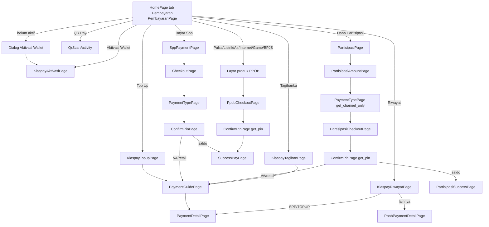
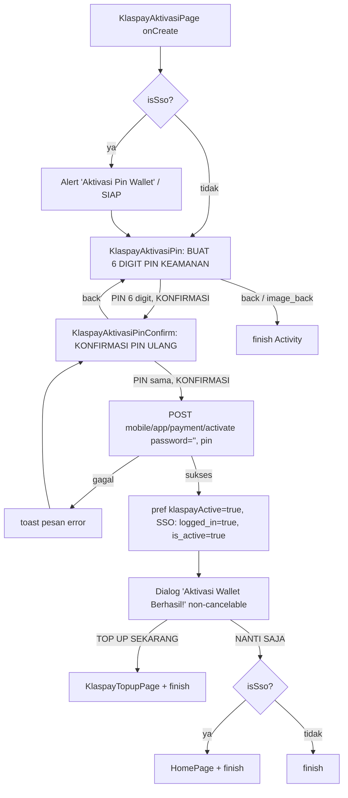
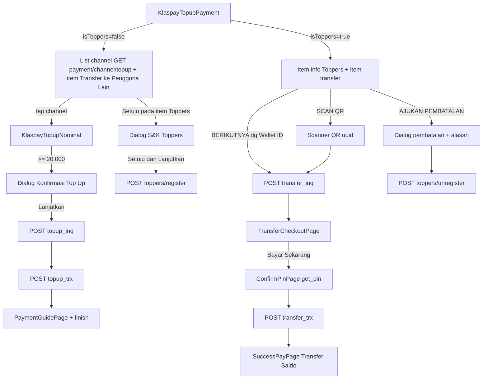
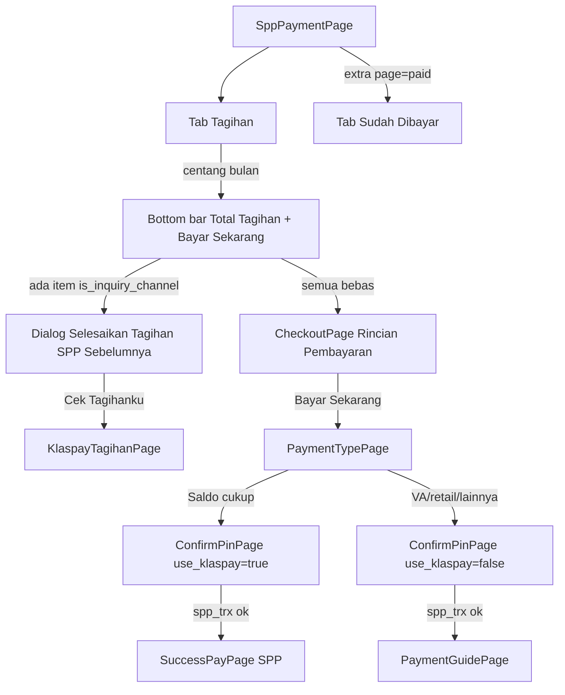
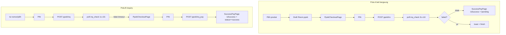
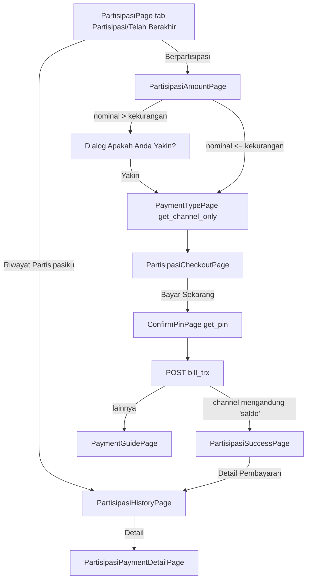

# 08 — Keuangan: Pembayaran, Klaspay (Wallet), PPOB & Dana Partisipasi

Spesifikasi perilaku seluruh fitur keuangan aplikasi lama `android-portal` (v2.1.40 / versionCode 79):
tab **Pembayaran** di Home, dompet digital **Klaspay** (aktivasi + PIN, saldo, top up, transfer
"Toppers", riwayat, Tagihanku, QR Pay kantin/merchant), **Bayar SPP**, **PPOB** (pulsa/paket data,
listrik token & tagihan, PDAM, internet/TV kabel, voucher game, BPJS) dan **Dana Partisipasi**, termasuk
komponen bersama (pilih metode pembayaran, konfirmasi PIN, panduan pembayaran VA/retail, detail &
halaman sukses). Alur aktivasi Klaspay yang dipicu setelah login SSO (ringkasannya ada di
`02-auth-login-sesi.md` §6) didokumentasikan lengkap di §3.

> Singkatan path: `@/` = `android-portal/app/src/main/java/id/diskola/app/`,
> `res/` = `android-portal/app/src/main/res/`. Nomor baris mengacu ke kode per 29-09-2026.
> Istilah: **VA** = virtual account, **retail** = pembayaran di minimarket, **saldo** = saldo Klaspay.

## Daftar isi
1. [Gambaran, gerbang akses & peta navigasi](#1-gambaran-gerbang-akses--peta-navigasi)
2. [Komponen bersama (format uang, PIN, metode bayar, panduan, detail, sukses)](#2-komponen-bersama)
3. [Aktivasi Klaspay (termasuk setelah login SSO)](#3-aktivasi-klaspay)
4. [PIN Klaspay: lupa PIN, atur PIN baru, deep link](#4-pin-klaspay-lupa-pin-atur-pin-baru-deep-link)
5. [Hub tab Pembayaran (`PembayaranPage`)](#5-hub-tab-pembayaran-pembayaranpage)
6. [Top Up & Transfer saldo (Toppers)](#6-top-up--transfer-saldo-toppers)
7. [Riwayat Pembayaran Klaspay](#7-riwayat-pembayaran-klaspay)
8. [Tagihanku](#8-tagihanku)
9. [Bayar SPP](#9-bayar-spp)
10. [QR Pay (kantin/merchant) & "My QR Code"](#10-qr-pay-kantinmerchant--my-qr-code)
11. [PPOB](#11-ppob)
12. [Dana Partisipasi](#12-dana-partisipasi)
13. [Kode mati / tidak terjangkau](#13-kode-mati--tidak-terjangkau)
14. [Data lokal (Room & SharedPreferences)](#14-data-lokal-room--sharedpreferences)
15. [Perilaku perangkat, latar & keamanan](#15-perilaku-perangkat-latar--keamanan)
16. [Aturan bisnis lintas fitur](#16-aturan-bisnis-lintas-fitur)
17. [Catatan migrasi Compose](#17-catatan-migrasi-compose)
18. [❓ Keputusan yang perlu dikonfirmasi](#18--keputusan-yang-perlu-dikonfirmasi)
19. [Selisih dengan dokumen lama](#19-selisih-dengan-dokumen-lama)
20. [Checklist paritas](#20-checklist-paritas)

---

## 1. Gambaran, gerbang akses & peta navigasi

### 1.1 Siapa & syarat akses
| Syarat | Sumber | Efek |
|---|---|---|
| Tab **Pembayaran** di bottom nav Home (`menu_pembayaran`, judul `"Pembayaran"`) | `@/pages/home/HomePage.kt:249`, `res/menu/main_bot_menu.xml:35-39` | Semua peran. Extra `bannerData == "ppob"` membuka tab ini langsung (`HomePage.kt:237`) |
| Wallet aktif | pref `klaspayActive` (ditulis login/SSO/check-account/aktivasi/`getWallet`) | **Hampir semua** menu keuangan (Top Up, QR Pay, Riwayat, Tagihanku, SPP, Dana Partisipasi, semua PPOB) memeriksa `isKlaspayActive`; jika `false` → dialog "Aktivasi Wallet Lebih Dahulu" (§5.4) |
| Menu **Bayar Spp** | `is_student == true` (`@/pages/pembayaran/PembayaranPage.kt:524-534`) | Non-siswa tidak melihat item SPP |
| Menu PPOB **Game** | disembunyikan jika `is_teacher == true` (`PembayaranPage.kt:281-291`) | Guru melihat 5 item; posisi ke-5 = BPJS (`PembayaranPage.kt:615-621`) |
| Transfer antar pengguna | pref `isToppers` / `toppersStatus` (dari `GET payment/wallet`) | Menentukan isi layar Top Up (§6) |

Tidak ada flag langganan sekolah (`onklas_lite/pro`) yang dicek di modul ini.

### 1.2 Titik masuk dari luar modul
| Dari | Ke | Extra | Ref |
|---|---|---|---|
| Login SSO, wallet belum aktif | `KlaspayAktivasiPage` | `isSso=true` | `@/pages/login/LoginSso.kt:80-88,106-114` |
| Pembelajaran: ikon notifikasi saat wallet belum aktif | `KlaspayAktivasiPage` (+toast `"Silahkan aktivasi wallet terlebih dahulu untuk mengunakan fitur notifikasi"`) | – | `@/pages/pembelajaran/PembelajaranPage.kt:343-357` |
| Toko: tombol chat penjual saat wallet belum aktif | alert `"Aktivasi Wallet Lebih Dahulu"` → `"Aktivasi Sekarang"` → `KlaspayAktivasiPage` | – | `@/pages/sekolah/store/DetailProduk.kt:187-231` |
| Detail notifikasi, `parent="PAYMENT"` | `child`: `HISTORY` → `PaymentDetailPage(child_id)` / `KlaspayRiwayatPage`; `SPP` → `SppHistoryDetailPage(child_id)` ⚠️ / `SppPaymentPage`; `BILL` → `KlaspayTagihanDetailPage(child_id)` / `KlaspayTagihanPage`; `TOPUP` → `KlaspayTopupPage`; `PULSA` → `PulsaPage`; `PLN` → `ListrikPage`; `PDAM` → `AirPage`; `INTERNET` → `InternetPage`; `GAME` → `GamePage`; `BPJS` → `BpjsPage` (semua +`child_id`, diabaikan layar tujuan kecuali `PaymentDetailPage`) | `child_id` | `@/pages/notification/DetailNotification.kt:181-205` |
| Push FCM menu `new-spp` / `spp` | `SppPaymentPage` / `SppPaymentPage(page="paid")` | `page` | `@/services/NotifRouter.kt:69-70` |
| Deep link `https://(dev.)api.diskola.id/api/payment/reset-pin/token/<token>` | `SetPinKlaspayPage(token)` | `token` | §4.3 |

⚠️ `SppHistoryDetailPage` adalah `DialogFragment`, bukan Activity → `startActivity` akan crash
(`ActivityNotFoundException`) — lihat ❓ Q10.

### 1.3 Peta navigasi tingkat atas

Semua layar di modul ini adalah Activity turunan `Privatepage` (= `BasePage`, orientasi dikunci portrait)
kecuali disebut Fragment/Dialog. Semua `exported=false` (`android-portal/app/src/main/AndroidManifest.xml:513-631`).

---

## 2. Komponen bersama

### 2.1 Format Rupiah & angka
| Fungsi | Implementasi | Contoh keluaran | Dipakai |
|---|---|---|---|
| `StringUtil.formatCurrency2(Int)` | `NumberFormat.getCurrencyInstance(Locale("id"))`, simbol dikosongkan, `maximumFractionDigits=0` (`@/utils/StringUtil.kt:192-210`) | `150.000` | Hampir semua label (`"Rp " + …` ditambahkan di layout/kode) |
| `StringUtil.formatCurrency(Double/Int)` | idem, `maximumFractionDigits=2` (`StringUtil.kt:184-206`) | kemungkinan `150.000,00` (min. 2 desimal bawaan mata uang IDR — belum terverifikasi runtime) | SPP (`"Rp" + …`, **tanpa spasi**), QR (`"Rp" + …`) |
| `NumberUtil.formatCurrency(Int)` | idem 0 desimal (`@/utils/NumberUtil.kt:10-20`) | `150.000` | Kode mati (`KlaspayBayar*`, `KlaspayTagihanDetailPage`) |
| Formatter input nominal (Top Up transfer, Partisipasi) | `NumberFormat.getInstance(Locale("in","ID"))`, grouping `.` | ketik `150000` → tampil `150.000` | `TopUpAdapter.kt:147-155`, `PartisipasiAmountPage.kt:33-41` |
| Input nominal QR merchant | `DecimalFormat("#,###")` grouping `.` → `"Rp 150.000"` (`QrScanActivity.kt:91-97`) | `Rp 150.000` | QR |
| Halaman sukses QR | `"Rp%,d".format(n)` — **ikut locale perangkat** (`SuccessPayPageQr.kt:45-47`) | `Rp150.000` (id) / `Rp150,000` (en) | QR |

- Semua nominal disimpan sebagai `Int` (Rupiah bulat). Tidak ada pembulatan; konversi `Double → Int`
  memotong desimal (SPP `total.toInt()` `SppTagihanPage.kt:142`, QR `nominalValue.toInt()`).
- Spasi setelah "Rp" **tidak konsisten** di aplikasi lama (`"Rp "` vs `"Rp"`) — tiru per layar seperti
  tertulis di dokumen ini.

### 2.2 Input PIN (`AdaptivePinView`) — bukan keypad custom
`@/widgets/AdaptivePinView.kt`
- `LinearLayout` berisi **6 `EditText`** berbobot sama (atribut `app:digits="6"`, rentang 1–12;
  `AdaptivePinView.kt:59`), tinggi `_48sdp`, jarak `_4sdp`, teks 16dp, `inputType=number` → memakai
  **keyboard numerik sistem** (`AdaptivePinView.kt:115-150`). Autofill dimatikan (`:143`).
- `password=true` → tiap kotak menampilkan simbol `app:otpSymbol="•"`; nilai asli disimpan di `tag`
  (`:239-240`). Hanya digit yang diterima (`InputFilter`, `:48-51`).
- Mengetik 1 digit → fokus pindah ke kotak berikut; kotak terakhir → keyboard ditutup (`:181-215`).
  Tempel (paste) beberapa digit disebar mulai kotak aktif (`:219-237`). Backspace di kotak kosong →
  hapus kotak sebelumnya & fokus mundur (`:161-174`).
- Border kotak 2dp: `activeColor` (fokus/terisi) vs `passiveColor`, sudut `_8sdp`.
- `autoFocusEnabled=true` → fokus + tampilkan keyboard saat dibuat. Callback
  `onTextChange(value, completed)` setiap perubahan (`:254-257`).
- Tidak ada batas jumlah salah PIN, tidak ada lockout, tidak ada biometrik — verifikasi PIN sepenuhnya di
  server; kesalahan tampil sebagai toast/dialog dari pesan server (lihat masing-masing layar).
- Tidak ada OTP di seluruh modul ini.

### 2.3 `ConfirmPinPage` — konfirmasi PIN generik
`@/pages/pembayaran/ConfirmPinPage.kt`, `res/layout/confirm_pin_page.xml`, VM `ConfirmPinViewModel`
(`windowSoftInputMode=adjustResize`).

| Elemen | Teks / aturan |
|---|---|
| Toolbar | `"Konfirmasi Pembayaran"`, back = `onBackPressed` |
| Label | `"Masukkan pin"` |
| PIN | `AdaptivePinView` 6 digit, simbol `•` |
| Tombol lupa | `"Lupa pin?"` → §4.1 |
| Tombol utama | teks `"Konfirmasi"` bila `type == "get_pin"`, selain itu `"Bayar Sekarang"`; **aktif hanya bila panjang PIN == 6** (`confirm_pin_page.xml:100-103`) |

Mode (`type` extra, default `"SPP"` — `ConfirmPinPage.kt:31`):
- **`get_pin`** (`ConfirmPinPage.getPin(activity, channelName?)` / `getPin(fragment)`, RC `4281`,
  `:190-206`): tombol → `setResult(OK, pin, channel_name)` + finish (`:96-100`). Dipakai: Tagihanku
  batal, PaymentGuide batal, Transfer, semua PPOB, Partisipasi.
- **`SPP`** (dari `PaymentTypePage`): lihat §9.5.

### 2.4 Daftar metode pembayaran (`PaymentTypePage`)
`@/pages/pembayaran/PaymentTypePage.kt`, `PaymentTypeViewmodel.kt`, `res/layout/payment_type_page.xml`

- Toolbar `"Pilih Metode Pembayaran"`, `SwipeRefreshLayout` (tarik = muat ulang), list pakai
  `TopUpAdapter` (accordion).
- **Sumber daftar:** `GET payment/channel/spp` → `data: Map<kategori, List<VirtualAccountItem>>`
  (`PaymentTypeViewmodel.kt:40-124`). Dipakai SPP **dan** Dana Partisipasi (tidak ada endpoint khusus
  partisipasi). Urutan = urutan key dari server.
- Tiap key menjadi baris induk (ikon lokal + nama + info), anak = channel (`image_url`,
  `channel_method_name`, `paymentCode = channel_method_id`, `channelId = channel_id`):

| key server | Nama tampil | Info | Ikon |
|---|---|---|---|
| `e-money` | `"E-Money"` | `"Bayar menggunakan akun dompet"` | `ic_topup_internet` |
| `credit card` | `"Kartu Kredit"` | `"Bayar menggunakan kartu kredit"` | idem |
| `virtual account` | `"Virtual Account"` | `"Bayar cepat dengan akun virtual bank"` | idem |
| `clickpay` | `"Click Pay"` | `"Bayar cepat dengan aplikasi pembayaran"` | idem |
| `retail` | `"Minimarket"` | `"Bayar melalui minimarket"` | `ic_merchant` |
| `bank` | `"Transfer Bank"` | `"Bayar melalui transfer bank"` | `ic_atm` |
| `qris` | `"QRIS"` | `"Scan untuk membayar"` | idem internet |
| lainnya (termasuk `saldo`) | `"Saldo"` | `"Pembayaran lainnya"` | `saldo` → `ic_saldo` |
(`PaymentTypeViewmodel.kt:127-154`)

- **Key `saldo`** dirender khusus (`KlaspayViewholder`, `@/pages/klaspay/topup/TopUpAdapter.kt:246-268`,
  `res/layout/klaspay_type_item.xml`): tidak berupa accordion; memanggil `GET payment/wallet`, lalu
  `balance = "Rp " + formatCurrency2(saldo)`, `needTopup = saldo < amount`; channel diambil dari anak
  dengan `channel_id == 1` (`PaymentTypeViewmodel.kt:82-110`). Jika `needTopup`: tampil tombol
  `"Top Up Saldo"` (tidak melakukan apa pun di layar ini) + info `"Saldo tidak cukup"`, dan baris tidak
  bisa dipilih.
- **Validasi nominal per kategori** (dicek saat membuka accordion induk; `PaymentTypePage.kt:80-95,
  115-130`) — popup `dialog_payment_warning` judul `"Peringatan"`, tombol `"Oke"`:
  - `amount < 10.000` & induk `bank`/`retail` → `"Jumlah pembayaran harus lebih dari Rp 10,000 untuk menggunakan metode Bank atau Retail."`
  - `amount > 2.500.000` & induk `retail` → `"Transaksi di atas Rp 2,500,000 tidak bisa menggunakan metode Retail. Gunakan metode Bank atau Saldo."`
  - Cabang `"Hanya metode pembayaran ritel yang diperbolehkan untuk pembayaran antara Rp 10,000 hingga Rp 2,500,000."` tidak pernah tercapai (kondisi duplikat `< 10_000`).
  - Kategori `virtual account`, `e-money`, `qris`, dll. **tidak** divalidasi.
- Pilih channel:
  - `get_channel_only=true` (Partisipasi): `setResult(OK)` dengan `payment_code`, `channel_name`,
    `channel_id`, `amount` lalu finish (`:132-143`).
  - selain itu (SPP): tambah extra `use_klaspay = (nameId == "saldo")`, `payment_code`, `channel_id` →
    `ConfirmPinPage` (RC `8392`) (`:144-153`). Result OK diteruskan ke pemanggil (`:61-67`).
- Error muat → `alert(msg)` lalu finish (`:55-57`).
- (`SelectPaymentPage` + `GET transaction/payment-service` hanya dipanggil dari tombol yang
  disembunyikan — lihat §13.)

### 2.5 Panduan pembayaran VA/retail (`PaymentGuidePage`) — "Selesaikan Pembayaran"
`@/pages/pembayaran/PaymentGuidePage.kt`, `res/layout/payment_guide_page.xml`, VM `PaymentViewModel`.
Dibuka dengan `open(activity, trxId[, partnerReff2])` (extra `trxId`, `partner_reff2`, RC `4328`).
Data **hanya dari Room** tabel `payment_invoice` (`getSingle(trxId)`, `:105`); jika tidak ada → dialog
`"Perhatian"` / `"Data transaksi tidak ditemukan"` / `"Kembali"` (finish) (`:154-163`).

Urutan UI (atas → bawah):
1. Toolbar `"Selesaikan Pembayaran"`.
2. `"Batas waktu pembayaran:"` + tanggal `dd MMM yyyy` (Locale id) + jam `HH:mm:ss` dari `expired_at`
   (`:65-78,107-108`). Parser mencoba `dd/MM/yyyy HH:mm`, `dd MMMM yyyy, HH:mm` (Locale **default
   perangkat**), `yyyy-MM-dd'T'HH:mm:ss.SSS'Z'` (UTC) (`:44-63`); gagal → `"Invalid date"` /
   `"Invalid time"`. **Statis — tidak ada countdown / timer.**
3. Nama channel (`channel_method_name`) + logo (`image_url`) + `"Partner Reff: " + partner_reff2`
   (selalu tampil, kosong bila tidak ada).
4. `"ID Transaksi:"` + `trx_id`.
5. Label nomor: `"Nomor Virtual Account"` bila `channel_method_name` mengandung `"bank"` (case-insensitive),
   selain itu `"Nomor Tagihan Pembayaran"` (`PaymentViewModel.kt:117-123`, `PaymentGuidePage.kt:111-112`);
   nilai `payment_code` + tombol `"SALIN"` → salin `payment_code`, toast `"Nomor ${type} tersalin"`
   (mis. `"Nomor TOPUP tersalin"`) (`:114-117`).
6. `"Total Pembayaran:"` `"Rp " + formatCurrency2(total_amount)` + `"SALIN"` → kode lama **menyalin
   `amount` (tanpa biaya admin), bukan `total_amount`** (`:119-122`). **✅ Diputuskan (30-09-2026,
   Q3): perbaiki** — di app baru, tombol ini wajib menyalin `total_amount` (nilai yang sama dengan
   yang ditampilkan), toast `"Total pembayaran tersalin"`.
7. Tombol `"Lihat Detail Pembayaran"` → `PaymentDetailPage(trxId, paymentMethod=channel_method_name)`.
8. `"Petunjuk Pembayaran"` + panah (rotasi 180° saat terbuka); tap label/panah → toggle list (awal
   tertutup) (`:140-141,209-212`).
9. List petunjuk (accordion 2 level): judul tipe (mis. ATM/Mobile Banking) → tap → langkah bernomor
   (`klaspay_topup_guide_item`, `klaspay_topup_finish_item`) (`:214-314`).
10. Teks bold `"Segera transfer sebelum " + expired_at + " agar tidak kadaluarsa. Perbedaan nilai transfer dapat menghambat proses transaksi pembayaran Anda."` (string mentah `expired_at`).
11. Tombol outline merah `"Batalkan"` — tampil hanya jika `cancelable` (hanya data Tagihanku yang bisa
    `true`). Tap → `ConfirmPinPage.getPin` → `POST payment/transaction/spp_cancel_invoice`
    `{transaction_id, pin}` (progress `"Memproses pembatalan"`) → sukses: hapus baris Room + dialog
    `"Berhasil Dibatalkan"` / `"Tagihan berhasil dibatalkan"` / `"Oke, Terima Kasih"` → finish; gagal →
    toast `"Gagal membatalkan tagihan. Silakan coba lagi."` (`:134-137,170-205`).

**Sumber petunjuk** (`PaymentViewModel.getGuidance`, `:127-182`): `GET payment/channel/guide/{channel_method_name}`
→ `data: Map<tipe, List<langkah>>`, di-cache di Room (`pay_guide_channel`, `pay_guide_item`); diambil
ulang bila `updated_at` baris pertama > 24 jam. ⚠️ Refetch **menambah** baris baru tanpa menghapus yang
lama → setelah 24 jam, setiap buka halaman menduplikasi seksi petunjuk (❓ Q4).

Tidak ada polling status: pengguna menutup halaman sendiri; status diperbarui saat membuka Tagihanku /
Riwayat / notifikasi.

### 2.6 Detail transaksi (`PaymentDetailPage`) — "Detail Pembayaran"
`@/pages/pembayaran/PaymentDetailPage.kt`, `res/layout/payment_detail_page.xml`. Untuk SPP, TOPUP,
tagihan (`ECT`), dan notifikasi `PAYMENT/HISTORY`.
- Extra: `trx_id`, `allow_pay`, `allow_cancel`, `payment_method`, `created_at` (hanya `trx_id` &
  `payment_method` dipakai), atau `child_id` dari notifikasi.
- Pemuatan (`:47-77`): jika `child_id` → `GET payment/transaction/history/id/{child_id}` untuk mendapat
  `transaction_id` → lanjut. Selanjutnya: cari di Room; jika ada dan `amount > 0` tampilkan langsung;
  jika tidak → loading `"Menampilkan data transaksi..."` → `GET …/history/id/{trxId}` → upsert Room →
  tampilkan; gagal → dialog `"Perhatian"` / `"Data transaksi tidak ditemukan"` / `"Kembali"` (finish).
- UI (`:80-156`):
  - Chip status: mengandung `success` → `"PEMBAYARAN BERHASIL"` (hijau); `new` → `"TANSAKSI DIBUAT"`
    (typo asli, hitam); `fail`/`reject` → `"PEMBAYARAN GAGAL"` (merah); lainnya → `"MENUNGGU PEMBAYARAN"`
    (oranye). Semua memakai latar `bg_pill_green_soft`.
  - `"Total Bayar"` + `"Rp " + formatCurrency2(total_amount)`.
  - Kartu judul `"Informasi Top-up"` jika `type == topup` (case-insensitive) selain itu `"Informasi Pembayaran"`.
  - Baris: `"ID Transaksi"`, `"Jenis Pembayaran"` (= `type` UPPERCASE), `"Keperluan"` (= `note`),
    `"Tanggal Transaksi"` (ISO UTC → `dd MMMM yyyy, HH:mm` id; gagal → string mentah), `"Metode Bayar"`
    (extra `payment_method` atau `channel_method_name`, UPPERCASE), `"Status"` (string mentah; warna:
    success/succes hijau, failed/fail/error merah, pending/wait/waiting oranye, new biru, lain hitam),
    `"Jumlah Top-up"`/`"Jumlah Pembayaran"` = `"Rp " + amount`, `"Biaya Admin Bank"` = `"Gratis"` (hijau)
    bila 0, selain itu `"Rp " + admin_fee`; `"Total Pembayaran"` = `"Rp " + total_amount`.
  - Info retail (tampil bila `channel_method_name` mengandung `"retail"`):
    `"Pembayaran melalui alfamart dikenakan biaya dari alfamart sebesar Rp 2.500, dibayarkan ke kasir"`.
  - Tombol Bayar/Batalkan dikomentari (tidak ada aksi di layar ini).
- ⚠️ Jalur update Room (`PaymentViewModel.kt:216-237`) menulis `amount = total_amount` dan mengosongkan
  `expired_at`/`cancelable` baris yang sudah ada (❓ Q5).

### 2.7 Halaman sukses (`SuccessPayPage`)
`@/pages/pembayaran/SuccessPayPage.kt`, `res/layout/success_pay_page.xml` (fullscreen, status bar transparan).
- Extra: `isPpob`, `isSuccess` (default false), `type`, `amount` (string terformat), `trxId`, `items`.
- `isPpob && !isSuccess` → judul `"Transaksi sedang diproses"`, tag `"pending"`, gambar `img_pay_process`,
  info `"Saldo akan terpotong setelah transaksi berhasil.\nSilahkan cek halaman riwayat secara berkala untuk melihat status transaksi anda"`.
  Selain itu → `"Transaksi Berhasil"`, tag `"lunas"`, `img_pay_success`, info
  `"Saldo terpotong untuk melakukan pembayaran ini"` (`:41-52`).
- Isi: label `type`, list `items` (baris kosong disembunyikan), ikon Klaspay + `"Rp"` + amount
  (huruf "rp" dihapus dari string).
- `"Detail Pembelian"` hanya untuk PPOB → `PpobPaymentDetailPage(trxId)` (`:68-79`).
- `"OK, Kembali"` → jika `type == "SPP"` (bukan PPOB) jalankan Google Play In-App Review lalu
  `setResult(OK)`+finish; selain itu langsung (`:82-102`).

---

## 3. Aktivasi Klaspay

### 3.1 Ringkasan
Mengaktifkan wallet dengan membuat **PIN 6 digit**. Semua peran. Hasil: pref `klaspayActive=true`
(+ `logged_in`/`is_active` bila datang dari SSO). Activity `KlaspayAktivasiPage`
(`@/pages/klaspay/aktivasi/KlaspayAktivasiPage.kt`, `res/layout/klaspay_aktivasi_page.xml`) menampung
`NavHostFragment` graf `res/navigation/klaspay_aktivasi_nav.xml`; ViewModel activity-scoped
`KlaspayAktivasiViewmodel`.

> **Koreksi terhadap `02-auth-login-sesi.md` §6:** graf mendeklarasikan 3 fragment
> (`KlaspayAktivasiAkun` → `KlaspayAktivasiPin` → `KlaspayAktivasiPinConfirm`), tetapi
> `app:startDestination="@id/KlaspayAktivasiPin"` (`klaspay_aktivasi_nav.xml:6`). Langkah password
> (`KlaspayAktivasiAkun`) **tidak pernah tampil**; alur nyata = **2 langkah** (buat PIN → konfirmasi PIN)
> dan field `password` dikirim sebagai string kosong `""`. Selebihnya (alert SSO, efek pref, dialog
> sukses) konsisten dengan ringkasan §6 dokumen 02.

### 3.2 Titik masuk
| # | Dari | Kondisi sebelum membuka | Extra |
|---|---|---|---|
| 1 | `LoginSso` `"iya, itu saya"` / `"daftar"` sukses | `klaspayActive == false` (backend `is_klaspay_activated != 1`); sebelumnya `LoginViewModel` men-set `logged_in=false`, `is_active=false` (`@/pages/login/LoginViewModel.kt:353-358`). `"iya, itu saya"` **tidak** finish Loginpage; `"daftar"` finish Loginpage (`LoginSso.kt:80-88,106-114`) | `isSso=true` |
| 2 | Hub Pembayaran tombol `"Aktivasi Wallet"` | lolos cek email/password + `POST mobile/app/payment/check` (§5.3) | – |
| 3 | Dialog "Aktivasi Wallet Lebih Dahulu" → `"Aktivasi Sekarang"` (hub, SPP, dll.) | **tanpa** cek apa pun (`PembayaranPage.kt:488-501`) | – |
| 4 | Pembelajaran ikon notifikasi | wallet belum aktif | – |
| 5 | Detail produk toko → chat | wallet belum aktif | – |

### 3.3 Alur

### 3.4 Detail layar
**Kerangka Activity** (`KlaspayAktivasiPage.kt:18-64`): status bar terang + layout fullscreen
(`SYSTEM_UI_FLAG_LIGHT_STATUS_BAR|LAYOUT_STABLE|LAYOUT_FULLSCREEN`), tombol kembali `image_back`
(= `onBackPressed`), toolbar judul `"Buat PIN Wallet"`, kartu bersudut `_16sdp` berisi NavHost.
`errorString` VM → toast. Jika `isSso`: `prettyAlert` tanpa gambar, judul `"Aktivasi Pin Wallet"`,
pesan `"Proses aktivasi wallet dibutuhkan untuk keperluan transaksi anda selama di aplikasi"`, tombol
`"SIAP"` (menutup alert saja) (`:36-49`).

**Langkah 1 — `KlaspayAktivasiPin`** (`KlaspayAktivasiPin.kt:25-52`, `res/layout/klaspay_aktivasi_pin.xml`)
- Ikon, judul `"BUAT 6 DIGIT PIN KEAMANAN"`, deskripsi `"Akan diminta setiap Anda akan melakukan transaksi pembayaran"`.
- `AdaptivePinView` 6 digit (password, autofocus). Label error disembunyikan.
- `"KONFIRMASI"` aktif hanya bila panjang PIN == 6 → navigasi ke langkah 2. Tidak ada aturan kekuatan PIN
  (mis. 000000 diterima).

**Langkah 2 — `KlaspayAktivasiPinConfirm`** (`KlaspayAktivasiPinConfirm.kt:39-107`, layout sama)
- Judul `"KONFIRMASI PIN ULANG"`, deskripsi `"Ketik ulang  pin keamanan yang sudah Anda atur sebelumnya"`
  (dua spasi, asli).
- `"KONFIRMASI"` aktif hanya bila PIN konfirmasi **sama persis** dengan PIN langkah 1. Bila sudah 6 digit
  tetapi berbeda → label merah `"Pin yang Anda masukkan tidak sama"`.
- Tap → `ProgressDialog` `"mohon tunggu"` → `klaspayActivate(password, pinConfirm)` (`KlaspayAktivasiViewmodel.kt:61-76`):
  `POST mobile/app/payment/activate` body `{"password": "", "pin": "<6 digit>"}`.
  - Sukses: `klaspayActive=true`; jika `isSso` → `logged_in=true`, `is_active=true`.
  - Gagal: pesan = `ApiException.message` → atau `message`/`error` dari JSON error body `HttpException`
    → atau `e.message` → fallback `"Terjadi kesalahan"` (`:78-92`). Pesan dipost ke `errorString` **dan**
    di-toast oleh fragment → toast muncul dua kali.
- Dialog sukses `klaspay_aktivasi_success` (non-cancelable): judul `"Aktivasi Wallet Berhasil!"`, pesan
  `"Asyiik, sekarang kamu bisa nikmati kemudahan pembayaran apa saja cukup pakai Wallet"`, tombol
  `"TOP UP SEKARANG"` (→ `KlaspayTopupPage` + finish Activity) dan `"NANTI SAJA"` (SSO → `HomePage` +
  finish; non-SSO → finish).

**Langkah password (tidak terjangkau)** — `KlaspayAktivasiAkun.kt:35-75`: `"MASUKKAN PASSWORD AKUN"`,
`"Masukkan password akun Anda dan ikuti langkah berikutnya"`, input `"Password"`, `"KONFIRMASI"` →
`POST mobile/app/payment/check`; error email → dialog `"Payment"` /
`"Kamu belum memverifikasi email, cek email yang telah kami kirimkan untuk memverifikasi email atau buka halaman setting kontak & email untuk merubah emailmu"`
/ `"Setting"` (→ `SettingContactPage`) / `"OK"`. Didokumentasikan hanya sebagai referensi (❓ Q1).

### 3.5 Kontrak API
| Method | Path | Body | Response dipakai | Kapan | Error |
|---|---|---|---|---|---|
| POST | `mobile/app/payment/check` (`@/api/ApiService.kt:758-759`) | – | sukses (2xx `status=success`) = boleh aktivasi | Tombol `"Aktivasi Wallet"` di hub | `ApiException.errorTypes` (key objek `errors`) berisi `email` → app memanggil `GET mobile/email/verify` (`ApiService.kt:237-238`) lalu dialog email; berisi `password` → dialog ganti password (`KlaspayAktivasiViewmodel.kt:43-58`) |
| POST | `mobile/app/payment/activate` (`ApiService.kt:761-762`) | `{password, pin}` | tidak ada (Unit) | Konfirmasi PIN | pesan error → toast |

### 3.6 Data lokal
Tulis: `klaspayActive`, (SSO) `logged_in`, `is_active`. Baca: `student` (tidak dipakai UI).

### 3.7 Aturan & edge case
- Back di langkah 1 menutup Activity. Pada SSO + `"iya, itu saya"`, pengguna kembali ke layar LoginSso
  dengan `logged_in=false` (buka ulang app → Login). Pada `"daftar"` Loginpage sudah di-finish → app
  tertutup.
- SSO + `"TOP UP SEKARANG"` **tidak** membuka `HomePage`; setelah Top Up ditutup pengguna kembali ke
  Loginpage (jika masih ada) atau app tertutup, walau `logged_in=true` (❓ Q2).
- `BasePage` tidak menimpa warna status bar untuk `KlaspayAktivasiPage` (`@/pages/BasePage.kt:107`).

---

## 4. PIN Klaspay: lupa PIN, atur PIN baru, deep link

### 4.1 "Lupa pin?" (di `ConfirmPinPage` dan `QrScanActivity`)
`ConfirmPinPage.kt:53-88`, `QrScanActivity.kt:623-660`
1. Jika `is_email_verified == false` **atau** email user (`pref user`) kosong → `HomeDialog.showEmailSettingDialog` (dokumen 02 §8).
2. Selain itu loading `"sedang memproses"` → `POST payment/reset-pin` body `{"email": <email user>}`.
3. Response `email_verified == true` → buka `SetPinKlaspayPage` dengan extra `token = reset_token`.
4. Selain itu → dialog (`change_password_success_dialog`) gambar `img_reset_pin`, judul
   `"Konfirmasi Pergantian Pin Terkirim"`, pesan
   `"Konfirmasi pergantian pin telah kami kirim ke email kamu yang terdaftar di Diskola. Periksa email tersebut untuk mendapat pin baru"`
   (di QR ditambah `". Reset hanya bisa dilakukan 1 kali dalam 3 hari "`), tombol `"Ok, Terima Kasih"` →
   buka aplikasi email (`IntentUtil.openEmail`, chooser `"Buka email dengan"`).
5. Error → toast pesan (`errorString`).

### 4.2 `SetPinKlaspayPage` — "Atur Pin Baru"
`@/pages/pembayaran/SetPinKlaspayPage.kt`, `res/layout/set_pin_klaspay_page.xml`
- Info `"Untuk keamanan akun, mohon jangan beritahukan pin Anda kepada siapapun selain pemilik akun"`.
- `"Pin Baru"` input hint `"Masukkan pin baru"`; `"Ketik Ulang Pin Baru"` hint `"Ketik ulang pin baru"`;
  keduanya `numberPassword`, `maxLength=6` (TextInputEditText biasa, bukan AdaptivePinView).
- `"Simpan Perubahan"` aktif bila kedua field tidak kosong. Validasi (`:36-40`): panjang < 6 → toast
  `"pin harus berisi 6 digit angka"`; beda → `"pin baru dan konfirmasi tidak sesuai"`.
- Loading `"menyimpan perubahan"` → `POST payment/reset-pin/setpin` `{pin, reset_token}` → dialog
  `set_pin_success_dialog`: `"Pin Baru Berhasil Diatur"` / `"Pin baru sudah berhasil di atur, hayo jangan lupa lagi ya"`
  / `"Ok, Terima kasih"` → finish. Error → toast.

### 4.3 Deep link reset PIN
Manifest `DeepLinkPage` intent-filter `https://dev.api.diskola.id` & `https://api.diskola.id`
`pathPrefix=/api/payment/reset-pin/token` (`AndroidManifest.xml:262-269`). `DeepLinkPage` (host berakhiran
`api.diskola.id`): loading `"memproses permintaan Anda"` → `GET <url lengkap>` (`apiService.download`) →
buka `SetPinKlaspayPage(token = lastPathSegment)` + finish; gagal → router normal (`goNext`)
(`@/pages/DeepLinkPage.kt:76-95`).

### 4.4 Kontrak API
| Method | Path | Body | Response dipakai |
|---|---|---|---|
| POST | `payment/reset-pin` (`ApiService.kt:787-788`) | `{email}` | `reset_token`, `email_verified` |
| POST | `payment/reset-pin/setpin` (`ApiService.kt:790-791`) | `{pin, reset_token}` | sukses/gagal |
| GET | URL deep link (`ApiService.kt:83-84`) | – | hanya sukses (validasi token) |

---

## 5. Hub tab Pembayaran (`PembayaranPage`)

### 5.1 Ringkasan & peta
Fragment tujuan `pembayaranPage` di `res/navigation/main_nav.xml:36-42`, file
`@/pages/pembayaran/PembayaranPage.kt`, layout `res/layout/pembayaran_page.xml`, VM `PaymentViewModel`
(activity-scoped) + `KlaspayAktivasiViewmodel`.

### 5.2 UI (atas → bawah)
1. Header gambar + logo Klaspay `ic_klaspay` + ikon info `btn_info` (tap keduanya → top sheet info wallet bila aktif, selain itu dialog aktivasi).
2. Belum aktif: tombol `"Aktivasi Wallet"`. Aktif: `"Rp"` + `formatCurrency2(balance)` (maxLength 22).
3. Shortcut: `"Top Up"`, `"QR Pay"`, `"Riwayat"` (`"Transfer"`, ikon scan, label `"SOON"` disembunyikan).
4. Kartu `"Tagihanku"` + `"Lihat Semua"` → `KlaspayTagihanPage`.
5. Grid 3 kolom menu (`PaymentItemAdapter`, `pembayaran_menu_item`): siswa `"Bayar Spp"`, `"Dana Partisipasi"`, `"Pinjam Buku"`; non-siswa `"Dana Partisipasi"`, `"Pinjam Buku"` (`:524-534`).
6. Judul `"Pembelian"` + grid 3 kolom PPOB: `"Pulsa"`, `"Listrik"`, `"Air"`, `"Internet"`, `"Game"` (disembunyikan untuk guru), `"BPJS"` (`:272-295`).
7. Top sheet `dialog_info_klaspay` (`TopSheetBehavior`): `"ID Wallet"`, nama (`klaspayData.name`), label `"ID Wallet"` + nilai **`klaspayData.user_id`**, tombol `"Salin"` → salin teks, toast `"ID Wallet tersalin"`; tombol tutup (`:161-175`).

### 5.3 Aksi
| Aksi | Wallet aktif | Belum aktif |
|---|---|---|
| Top Up | `KlaspayTopupPage` | dialog aktivasi |
| QR Pay | izin kamera (§15.1) → `QrScanActivity` | dialog aktivasi |
| Riwayat | `KlaspayRiwayatPage` | dialog aktivasi |
| Tagihanku | `KlaspayTagihanPage` | dialog aktivasi |
| Bayar Spp (siswa) | `SppPaymentPage` | dialog aktivasi |
| Dana Partisipasi | `PartisipasiPage` + extra `klaspayId = klaspayData.wallet_id` | dialog aktivasi |
| Pinjam Buku | dialog `"Fitur belum tersedia"` / `"Fitur ini belum tersedia untuk sekolah ini"` / `"Ok Deh"` (tanpa cek wallet) | idem |
| PPOB (Pulsa/Listrik/Air/Internet/Game/BPJS) | `PulsaPage`/`ListrikPage`/`AirPage`/`InternetPage`/`GamePage` (guru: posisi 5 → `BpjsPage`)/`BpjsPage` | dialog aktivasi |
(`PembayaranPage.kt:227-264,536-636`)

**Tombol `"Aktivasi Wallet"`** (`:177-225`):
1. `is_email_verified == false` → dialog setting email; setelah selesai: jika `default_pass` → dialog ganti
   password, selain itu klik ulang tombol aktivasi.
2. `default_pass == true` → dialog ganti password; sukses → klik ulang.
3. Selain itu → `ProgressDialog` `"Memverifikasi data"` → `POST mobile/app/payment/check`:
   sukses → `KlaspayAktivasiPage`; `errorTypes` berisi `email` → dialog email (lalu seperti no.1);
   berisi `password` → dialog ganti password → klik ulang. Error lain → diam.

**Dialog aktivasi** (`dialog_activate_klaspay`, `:488-501`): `"Aktivasi Wallet Lebih Dahulu"` /
`"Kamu belum mengaktifkan Wallet Payment, silahkan aktifkan Wallet Payment terlebih dahulu"` /
`"Aktivasi Sekarang"` (→ `KlaspayAktivasiPage`, tanpa pre-check) / `"Nanti Saja"`.

### 5.4 Pemuatan & sesi
- `init` (sekali per instance fragment): jika `klaspayActive` → `GET payment/wallet` (`PaymentViewModel.getWallet`,
  `:100-113`): `status == "success"` → pref `klaspayActive=true`, `isToppers`, `toppersStatus`, LiveData
  `klaspayData`; lalu pref `klaspay_id = klaspayData.wallet_id` (dibaca **sebelum** postValue selesai →
  bisa masih kosong; `PembayaranPage.kt:83-101`). Semua exception ditelan di VM, sehingga alert
  `"Payment Bermasalah"`/`"Terjadi error pada database Silahkan Hubungi admin"` (HTTP 403, `:103-114`)
  tidak pernah tampil.
- `onStart` (`:410-454`): tanpa internet → toast `"Terjadi gangguan pada koneksi internet Anda, silahkan ulangi beberapa saat lagi"`
  + daftar `NetworkCallback` untuk mencoba ulang saat online (dilepas di `onStop`). Online: `school.uuid`
  kosong → `errorString = "Mohon maaf, Sekolah anda sudah tidak terdaftar \n anda akan dikeluarkan dari aplikasi "`;
  selain itu `POST mobile/app/authentication/check-account` (`{nisn_nik?, school_id}`) + `verifyCurrentUserSession()` (dokumen 02 §9).
- **Setiap** `errorString` VM (termasuk `"Gagal memeriksa akun: …"` dari check-account yang gagal) memunculkan
  dialog non-cancelable `dialog_logout` `"PEMBERITAHUAN"` + teks bawaan layout
  (`"Mohon maaf, Sekolah anda sudah tidak terdaftar \n anda akan dikeluarkan dari aplikasi "`) + `"Oke"` →
  logout penuh → `Loginpage` (`NEW_TASK|CLEAR_TASK`) (`:133-156`). Sudah tercatat sebagai ❓ Q6 dokumen 02.
- `isKlaspayActive` diinisialisasi dari pref saat VM dibuat dan hanya di-set `true` oleh `getWallet`.

### 5.5 Kontrak API
| Method | Path | Response dipakai | Kapan |
|---|---|---|---|
| GET | `payment/wallet` (`ApiService.kt:766-767`) | `status`, `data{wallet_id, user_id, name, email, school_id, is_toppers, toppers_status, balance, last_update}` | init hub (juga Home, SPP, Top Up, Partisipasi, PPOB) |
| POST | `mobile/app/payment/check` | lihat §3.5 | tombol aktivasi |
| POST | `mobile/app/authentication/check-account` | dokumen 02 | `onStart` |

---

## 6. Top Up & Transfer saldo (Toppers)

### 6.1 Ringkasan
Isi saldo Klaspay via VA/retail/dll. (tanpa PIN), dan fitur **Toppers**: pengguna berstatus toppers
dapat mentransfer saldo ke pengguna lain (dengan PIN). Wallet harus aktif. Activity `KlaspayTopupPage`
(`@/pages/klaspay/topup/KlaspayTopupPage.kt`) + NavHost `res/navigation/klaspay_topup_nav.xml`
(start `klaspayTopupPayment` → `klaspayTopupNominal`), VM activity-scoped `KlaspayTopupViewModel`.

| Layar | File | Layout | Judul toolbar |
|---|---|---|---|
| Pilih metode | `KlaspayTopupPayment.kt` (Fragment) | `klaspay_topup_select_method_page.xml` | `"Top Up"` (awal layout `"Topup"`) |
| Input nominal | `KlaspayTopupNominal.kt` (Fragment) | `klaspay_topup_nominal.xml` | `"Pilih Nominal"` |
| Dialog konfirmasi | – | `klaspay_topup_confirm_dialog.xml` | – |
| Checkout transfer | `TransferCheckoutPage.kt` (Activity, RC `820`) | `transfer_checkout_page.xml` | `"Detail Pembelian"` |
| Scanner | `CaptureActivityPortrait` (§10) | – | – |

Toolbar back: jika judul `"Selesaikan Pembayaran"` → finish, selain itu `onBackPressed` (pop fragment)
(`KlaspayTopupPage.kt:23-26`).

### 6.2 `KlaspayTopupPayment` — pilih metode
- Header: logo Klaspay + `"Rp"` + saldo (`formatCurrency2`). Saat dibuka: `GET payment/wallet` (update
  `isToppers`, `toppersStatus`, pref) lalu `refreshData()` (`KlaspayTopupPayment.kt:99-102,148-159`).
  Swipe refresh → `refreshData()` saja (tanpa wallet).
- **Non-toppers** (`paymentChannel`, `KlaspayTopupViewModel.kt:154-203`): `GET payment/channel/topup` →
  baris induk per key (nama/info sama seperti §2.4 kecuali key tak dikenal → `"Lainnya"`; ikon `bank`
  `ic_atm`, `retail` `ic_merchant`, lainnya `ic_topup_internet`), anak = channel (`paymentCode =
  channel_method_id`, `paymentCategory = channel_method_category`). Ditambah baris induk
  `"Transfer ke Pengguna Lain"` / `"Transfer saldo antar pengguna"` (ikon `ic_transfer`) berisi item
  S&K: `"Syarat dan ketentuan :\n\n1. Pengguna yang mendaftar sebagai toppers akan meningkatkan nilai topup wallet mereka menjadi minimum Rp 500.000 setiap ingin melakukan topup wallet\n2. Pengguna toppers dapat membatalkan / menurunkan status toppers dengan melalui persetujuan admin sekolah"`
  + tombol `"Setuju"`.
- **Toppers** (`toppersChannel`, `:205-251`): induk `"Informasi mengenai Toppers"` /
  `"Panduan topup dan perubahan status"` berisi teks
  `"Status pengguna kamu saat ini sebagai TOPPERS, ketentuan terkait topup sebagai berikut :\n- Kamu hanya bisa topup melalui koperasi\n- Kamu hanya bisa topup minimal Rp 500.000"`
  + tombol status; dan induk `"Transfer ke Pengguna Lain"` berisi form transfer. Toppers **tidak** melihat
  channel top up biasa.
- Tombol status di item info (`TopUpAdapter.kt:205-231`), bila `isToppers`:
  `toppersStatus == ""` → merah `"AJUKAN PEMBATALAN SEBAGAI TOPPERS"` (→ alur pembatalan);
  `"pending"` → nonaktif abu `"PENGAJUAN PEMBATALAN SEDANG DIPROSES"`; `"inactive"` → nonaktif abu
  `"AKUN ANDA SEDANG DALAM.."`. Bukan toppers → `"Setuju"` (→ registrasi).
- Accordion: tap induk → sisip/hapus anak tepat di bawahnya (panah berotasi). Tap channel → simpan
  `channelSelected` → navigasi ke Nominal.
- **Registrasi toppers** (`:209-252`): `confirmationAlert` judul `"Syarat dan Ketentuan Toppers"`, pesan
  `"- Setelah menjadi toppers, pengguna hanya dapat melakukan topup melalui koperasi sekolah\n- Minimal topup senilai Rp 500.000\n- Perubahan status pengguna setelah menjadi toppers harus melalui persetujuan admin, untuk info lebih lanjut silahkan hubungi admin"`,
  checkbox `"Saya telah membaca dan menyetujui ketentuan dan kebijakan toppers diskola"`, tombol
  `"Setuju dan Lanjutkan"` → `POST payment/toppers/register {agreed_to_terms: true}` → sukses: alert
  `"Registrasi Berhasil"` / `"Saat ini anda merupakan toppers diskola, anda dapat melakukan transfer antar pengguna mulai saat ini"` /
  `"KEMBALI KE DASHBOARD"` (finish); gagal: `"Oops!!"` / pesan error / `"BAIK"`.
- **Pembatalan toppers** (`:260-313`): `confirmationAlert` `"Perubahan Status Pengguna"` / pesan 3 poin
  (lihat kode) / checkbox sama / `"AJUKAN PEMBATALAN"` → `unsubscribeAlert` `"Pengajuan Pembatalan Toppers"` /
  `"Kritik dan saran kamu sangat berarti bagi kami, mohon untuk dapat melampirkan alasan berhenti sebagai toppers"` /
  `"KIRIM"` → `POST payment/toppers/unregister {user_id: pref klaspay_id, reason}` → sukses: `"Pengajuan telah dikirim"`
  / `"Proses pengajuan kamu sedang di proses, status kamu saat ini tetap sebagai toppers hingga mendapatkan persetujuan dari admin, ketika pengajuan disetujui, kamu harus menunggu beberapa waktu untuk dapat mendaftar kembali sebagai toppers "`
  / `"BAIK"` (finish); gagal `"Oops!!"` / error / `"OKE"`.
- **Form transfer** (`toppers_topup_layout.xml`, `TopUpAdapter.kt:92-197`): `"MASUKKAN NOMOR WALLET"`,
  input hint `"Wallet ID "` (`textCapCharacters`, maks 20), tombol `"SCAN QR"`, `"Pilih Nominal"` 4 tombol
  `"25.000"`, `"50.000"`, `"100.000"`, `"500.000"` (border hijau bila cocok), input `"Nominal"` (auto-format
  titik; > 25.000.000 → dipaksa 25.000.000 + toast `"Nominal tidak boleh lebih dari Rp 25.000.000"`),
  tombol `"BERIKUTNYA"`. **Tidak ada nominal minimum** (label `"Minimal Topup 20.000"` selalu tersembunyi).
  - `"BERIKUTNYA"` dengan Wallet ID terisi → loading `"Memproses transaksi"` → `POST payment/transaction/transfer_inq {user_id, nominal}`.
    ⚠️ Wallet ID kosong → masuk cabang registrasi toppers (dialog S&K) (❓ Q7).
  - `"SCAN QR"`: nominal harus > 0, selain itu toast `"Isi atau pilih nominal terlebih dahulu"`; izin kamera
    (jika belum → `requestPermissions`, tanpa callback — pengguna perlu tap ulang) → scanner zxing (§10.1)
    → isi QR = `uuid` pengguna tujuan → `transfer_inq {uuid, nominal}`. Isi kosong → toast `"Result Not Found"`.
  - Response `status`: `"failed"` → toast `message`; `"success"` → simpan data → buka `TransferCheckoutPage`;
    lainnya → toast `"wait"` (`KlaspayTopupViewModel.kt:89-131`).

### 6.3 `KlaspayTopupNominal`
- `"Input Nominal"`, input angka hint `"Minimal 20.000"` (maxLength 20), label error `"Minimal Topup 20.000"`
  (tersembunyi), `"Atau pilih nominal "`, 4 tombol `"25.000"`/`"50.000"`/`"100.000"`/`"500.000"` (mengisi
  angka tanpa titik), tombol `"KONFIRMASI"` (nonaktif sampai input tidak kosong) (`KlaspayTopupNominal.kt:38-81`).
- `KONFIRMASI`: nominal < **20.000** → teks merah + label error tampil. ≥ 20.000 → dialog
  `"Konfirmasi Top Up"` / `"Pastikan data berikut sudah benar sebelum melanjutkan pembayaran"` + baris
  `"Nama"`, `"Level"` (`role_label` atau `roles`), `"NISN/NIK"` (`nisn_nik` atau `nis_nik`), `"Sekolah"`,
  `"Nominal"` = `"Rp " + formatCurrency2` (nilai kosong → `"-"`); peringatan tamu (role `Guest`):
  `"Peringatan: Akun ini tidak memiliki relasi ke data siswa atau guru. Lakukan verifikasi akun jika Anda seharusnya login sebagai siswa atau guru."`;
  tombol `"Batal"` / `"Lanjutkan"` (`:114-155`, VM `:284-311`).
- `"Lanjutkan"` → dialog progres (`"Mohon Tunggu"` / `"Sedang mengirim data..."`, non-cancelable) →
  `POST payment/transaction/topup_inq {nominal}` → `transaction_id_inquiry` →
  `POST payment/transaction/topup_trx {biller: 2, channel_method_id, channel_method_category, transaction_id}` →
  simpan `PaymentInvoice(type="TOPUP")` ke Room → `PaymentGuidePage(trx_id)` + finish Activity
  (`KlaspayTopupViewModel.kt:313-365`). Error → toast.
- **Tidak ada batas maksimum**; angka > 2.147.483.647 menyebabkan `NumberFormatException` crash
  (`rupiahToInt`, `:104-110`). Top up **tidak meminta PIN**.

### 6.4 `TransferCheckoutPage`
- Extra `toppersData` (Parcelable `ToppersTopupData`). Header saldo (`GET payment/wallet` di init).
  Produk ikon `ic_transfer` + `"Transfer Saldo"`; baris `"ID Transaksi"`, `"ID Wallet"`
  (`destination_user`), `"Nama"`, `"Sekolah"`; `"Rincian Pembayaran"`: `"Nominal"` `"Rp …"`, `"Admin"`
  `"Rp 0"` (hardcode); `"Total Bayar"` `"Rp"` + nominal; `"Bayar Sekarang"` (bagian pembayaran
  disembunyikan bila nominal 0) (`TransferCheckoutPage.kt:71-110,144-164`).
- `"Bayar Sekarang"` → PIN (`get_pin`) → loading `"Memproses transaksi"` →
  `POST payment/transaction/transfer_trx {transaction_id, pin, nominal}` → `SuccessPayPage(isPpob=false,
  type="Transfer Saldo", amount, trxId, isSuccess=true)` + `setResult(OK)` → pemanggil menutup Activity Top Up.
  ⚠️ Di kode lama, `nominal` diambil dari VM milik Activity ini (selalu 0), dan status selain
  `success` tetap dianggap sukses (hanya toast `message`) (`KlaspayTopupViewModel.kt:133-149`).
  **✅ Diputuskan (30-09-2026, Q8): perbaiki.** Di app baru: kirim `nominal` transfer yang sebenarnya
  (dari layar sebelumnya, bukan 0), dan tampilkan halaman **gagal** (bukan `SuccessPayPage`) bila
  `status` respons bukan `"success"` — jangan pernah tampilkan sukses untuk transaksi yang gagal.

### 6.5 Kontrak API
| Method | Path | Body | Response dipakai |
|---|---|---|---|
| GET | `payment/channel/topup` (`ApiService.kt:784-785`) | – | `data{kategori: [{channel_method_id, channel_method_name, channel_method_category, image_url}]}` |
| POST | `payment/transaction/topup_inq` (`:793-794`) | `{nominal}` | `data.transaction_id_inquiry` |
| POST | `payment/transaction/topup_trx` (`:799-800`) | `{biller:2, channel_method_id, channel_method_category, transaction_id}` | `KlaspayBayarData{transaction_id, bank_name, retail_code, bank_image, virtual_account, payment_code, admin_fee, amount, total_amount, note, created_at, expired, paid_at, status}` |
| POST | `payment/toppers/register` (`:769-770`) | `{agreed_to_terms: true}` | – |
| POST | `payment/toppers/unregister` (`:772-773`) | `{user_id, reason}` | – |
| POST | `payment/transaction/transfer_inq` (`:775-776`) | `{user_id, nominal}` atau `{uuid, nominal}` | `status`, `message`, `data{transaction_id, destination_user, destination_name, nominal, admin_fee, school}` |
| POST | `payment/transaction/transfer_trx` (`:778-779`) | `{transaction_id, pin, nominal}` | `status`, `message` |

---

## 7. Riwayat Pembayaran Klaspay

### 7.1 Layar
`KlaspayRiwayatPage` (Activity, `res/layout/klaspay_riwayat_page.xml`, toolbar `"RIWAYAT PEMBAYARAN"`)
+ NavHost `klaspay_riwayat_nav.xml` (start `KlaspayRiwayatList`; `KlaspayRiwayatDetail` tidak dipakai).
Wallet harus aktif (dari hub) atau dari notifikasi `PAYMENT/HISTORY` tanpa `child_id`.

### 7.2 Detail
- **Tombol kampanye poin** (ikon `ic_campaign` di toolbar, awalnya tersembunyi): setiap `onResume` →
  `GET payment/user/campaign/point`; tampil bila `campaign_id` tidak kosong **dan** sekarang di antara
  `campaign.start_date`–`end_date` (ISO UTC). Tap → dialog `"Poin Transaksi"`: nama kampanye,
  `"Mulai: <dd MMMM yyyy, HH:mm>"`, `"Berakhir: …"`, `"Kantin"` + `canteen_points`, `"PPOB"` +
  `ppob_points`, `"TOTAL : <canteen+ppob> POIN"`, tombol tutup (`KlaspayRiwayatPage.kt:35-99`).
- **List** (`KlaspayRiwayatList.kt`, item `klaspay_riwayat_item.xml`): kartu dengan ikon per `type`
  (mengandung TOPUP/SENDING/RECEIVING/SPP/PULSA/PLN/PDAM/INTERNET/GAME/BPJS/KANTIN, lainnya
  `ic_history_bordered`), `"ID: <transaction_id>"`, status = `transaction_status` mentah, jenis: `ETC` →
  `"Pembayaran Lainnya"`, mengandung RECEIVING → `"TERIMA SALDO"`, SENDING → `"TRANSFER SALDO"`, lainnya
  `type` mentah; `"Rp"` + `formatCurrency2(price)`; tanggal `dd MMMM yyyy, HH:mm` (dari ISO UTC; gagal →
  kosong) (`KlaspayRiwayatAdapter.kt:37-70`).
- Tap: `type == SPP` atau mengandung `topup` → `PaymentDetailPage(trx)`; lainnya → `PpobPaymentDetailPage(trx)`.
- Paging: `GET payment/transaction/history?page=&pageSize=20`, tambah ke list; halaman terakhir bila
  jumlah < 20; scroll ke bawah memuat halaman berikut (`KlaspayRiwayatViewModel.kt:42-75`,
  `KlaspayRiwayatList.kt:79-86`).
- Kosong: `"Belum Ada Riwayat Pembayaran"` / `"Lakukan transaksi PPOB, Transfer antar wallet atau Top Up Saldo Wallet"`.
- **Filter tidak ada**: tombol `"Semua"`, `"Saldo Masuk"`, `"Saldo Keluar"`, ringkasan saldo & rentang
  tanggal ada di layout tetapi `visibility=gone` (`klaspay_riwayat_list.xml:22-171`).
- ⚠️ `loadMoreHistory()` dipanggil di init VM, init fragment, `onViewCreated`, setiap `onResume`, dan
  swipe-refresh tanpa reset halaman → pull-to-refresh/kembali ke layar **memuat halaman berikutnya**
  alih-alih menyegarkan (❓ Q9).

### 7.3 Kontrak API
| Method | Path | Param | Response dipakai |
|---|---|---|---|
| GET | `payment/transaction/history` (`ApiService.kt:815-819`) | `page`, `pageSize=20` | `data.transaction[]{transaction_id, price, type, transaction_status, created_at}` |
| GET | `payment/user/campaign/point` (`:781-782`) | – | `data{ppob_points, canteen_points, campaign_id, campaign{name, start_date, end_date}}` |

---

## 8. Tagihanku

### 8.1 Layar
`KlaspayTagihanPage` (Activity, toolbar `"Tagihanku"`, `klaspay_tagihan_page.xml`) + NavHost
`klaspay_tagihan_nav.xml` (start `KlaspayTagihanMenunggu`). Tombol tab `"Menunggu Pembayaran"` /
`"Sudah Dibayar"` ada tetapi kontainernya `visibility=gone` → hanya daftar **Menunggu** yang tampil.
Masuk dari hub, dialog SPP `"Cek Tagihanku"`, notifikasi `PAYMENT/BILL`.

### 8.2 Data & sinkronisasi
`KlaspayTagihanViewModel.fetchInvoice()` (`:78-157`) dipanggil di init Activity, `onViewCreated`,
setiap `onResume`, dan swipe (fetch berulang): `GET payment/transaction/invoice` →
**hapus seluruh tabel `payment_invoice`** (termasuk invoice TOPUP/SPP/partisipasi lokal) → simpan item
`status != "success"` sebagai `PaymentInvoice` (created/expired dikonversi dari `yyyy-MM-dd'T'HH:mm:ss`
UTC ke label `dd MMMM yyyy, HH:mm` id; `cancelable`, `is_paid` dari server; `channel_method_name =
payment_method`; `image_url = details.bank_image`; `admin_fee/amount = details.*`; `total_amount =
transaction_amount`; `note = transaction_note`). Response kosong → tabel dikosongkan + state kosong.
List = `select … where is_paid = 0 order by rowid` (urutan API).

### 8.3 Item Menunggu (`klaspay_tagihan_menunggu_item.xml`, `KlaspayTagihanMenunggu.kt:124-178`)
- Ikon `ic_spp_payment` bila `type == "SPP"` selain itu `ic_invoice_topup`; `"Lihat Detail"`;
  `"ID: <trx>"`; tanggal dibuat; `"Transaksi:"` note; `"Metode Pembayaran:"` channel; `"Bayar sebelum"`
  expired.
- Kedaluwarsa bila `expired_at` (parse `dd MMM yyyy, HH:mm` Locale id) < sekarang → tombol berubah
  `"Kadaluarsa"` dan nonaktif; selain itu `"Bayar Sekarang"` → `PaymentGuidePage(trx)`.
- `"Batalkan"` (merah, tampil jika `cancelable`) → PIN → `POST payment/transaction/spp_cancel_invoice
  {transaction_id, pin}` (progress `"Memproses pembatalan"`) → dialog `"Berhasil Dibatalkan"` /
  `"Tagihan berhasil dibatalkan"` / `"Oke, Terima Kasih"` (non-cancelable) → `setResult(OK, refresh=true)`
  + finish Activity (`:184-218`).
- `"Lihat Detail"` → `PaymentDetailPage(trx, allowPay=!expired, allowCancel, paymentMethod)`.
- Kosong: `"Belum Ada Tagihan yang Perlu Dibayar"` / `"Lakukan Top Up Saldo Wallet sekarang dan mulai lakukan transaksi"`.
- Tab "Sudah Dibayar" (`KlaspayTagihanDibayar`, judul kosong `"Belum Ada Tagihan"`, item `"Metode bank:"`)
  tidak terjangkau dan datanya hampir selalu kosong karena item `success` tidak disimpan.
- `KlaspayTagihanDetailPage` (target notifikasi `BILL` + `child_id`) tidak pernah mengisi data → layar
  kosong. **⚠️ Q10 belum dijawab eksplisit oleh user** — asumsi kerja sementara: perbaiki agar mengisi
  data dari `PaymentDetail(childId)` yang benar; **konfirmasi ulang** sebelum dianggap final (§18).

### 8.4 Kontrak API
| Method | Path | Body | Response dipakai |
|---|---|---|---|
| GET | `payment/transaction/invoice` (`ApiService.kt:806-807`) | – | `data.transaction_invoice[]{transaction_id, transaction_amount, payment_method, transaction_note, status, created_at, transaction_type, expired_date, payment_code, cancelable, is_paid, details{customer_id, note, bank_image, admin_fee, amount, paid_at}}` |
| POST | `payment/transaction/spp_cancel_invoice` (`:809-810`) | `{transaction_id, pin}` | sukses/gagal |

---

## 9. Bayar SPP

### 9.1 Ringkasan & akses
Siswa (`is_student`) dengan wallet aktif membayar tagihan SPP bulanan; bisa beberapa bulan sekaligus
(harus berurutan dari yang tertua). Metode: saldo Klaspay (langsung lunas) atau VA/retail/dll. (menjadi
invoice → panduan pembayaran).

### 9.2 Peta layar
| Layar | File | Layout | Keterangan |
|---|---|---|---|
| Kontainer | `@/pages/pembayaran/spp/SppPaymentPage.kt` (Activity, parent `HomePage`) | `spp_payment_page.xml` | toolbar `"Bayar SPP"`, NavHost `spp_payment_nav.xml` |
| Tab Tagihan | `SppTagihanPage.kt` (Fragment, start) | `spp_tagihan_page.xml`, item `spp_tagihan_item.xml`, bottom bar `spp_tagihan_dialog.xml` | |
| Tab Sudah Dibayar | `SppPaidPage.kt` (Fragment) | `spp_paid_page.xml`, item `spp_paid_item.xml` | |
| Rincian | `@/pages/pembayaran/CheckoutPage.kt` (RC `3281`) | `checkout_page.xml` | toolbar `"Rincian Pembayaran"` |
| Pilih metode | `PaymentTypePage` (RC `8392`) | §2.4 | |
| PIN | `ConfirmPinPage` type `SPP` | §2.3 | |
| Hasil | `SuccessPayPage` / `PaymentGuidePage` | §2.7 / §2.5 | |

### 9.3 `SppPaymentPage`
- Kartu siswa: nama (`student.name`), `nisn` `"|"` kelas (`student_class.class_room.name`), `"Total Saldo"`
  `"Rp"` + `formatCurrency2(balance)`. Setiap `onStart` (jika wallet aktif) `GET payment/wallet`; error:
  403 → toast `"Akses wallet ditolak. Silakan login ulang."`, 401 → `"Sesi kadaluarsa. Silakan login ulang."`,
  lain → `"Gagal memuat saldo wallet: <msg>"`; non-HTTP → `"Gagal memuat saldo wallet. Periksa koneksi internet Anda."`;
  saldo di-set 0 (`SppPaymentPage.kt:68-90`).
- Tombol tab `"Tagihan"` / `"Sudah Dibayar"` (aktif = latar primary teks putih; lainnya putih + border
  abu) → navigasi global action. Extra `page == "paid"` → otomatis klik `"Sudah Dibayar"` (`:41-61`).
- `errorString` VM → toast.

### 9.4 Tab Tagihan (`SppTagihanPage`)
- **Sumber:** `GET payment/transaction/history_school` → `data.transaction_invoice[]`
  (`SppViewModel.fetchSpp`, `:116-155`); disimpan ke tabel `spp` via `OnKlasDbUtil.processKlaspayTagihanSpp`
  (`@/db/OnKlasDbUtil.kt:296-315`): `id = transaction_id.hashCode()`, `name = note`, `issued_at =
  created_date`, `total_fee = price`, `paid_at = paid_date`, `transaction_id`, `is_inquiry_channel`.
  Tagihan = `paid_at` kosong, urut `issued_at` (string) naik (`SppDao.kt:21-22`).
- Muat ulang: setiap `onResume` (progress bar) dan swipe → reset halaman, hapus baris belum-bayar, fetch,
  **kosongkan pilihan** (`SppTagihanPage.kt:148-174`). Response kosong → toast `"Data tidak ditemukan"` +
  state kosong `"Belum Ada Tagihan SPP"` / `"Segera lakukan pembayaran SPP sesuai tenggat waktu yang diberikan agar tidak terjadi tunggakan"`.
  Error HTTP: 403 `"Akses Payment ditolak . Token tidak valid atau kadaluarsa."`, 401
  `"Sesi kadaluarsa. Silakan login ulang."`, 404 `"Data tagihan tidak ditemukan"`, 500
  `"Terjadi kesalahan pada server."`, lain `"Gagal mengambil data: <msg>"`; non-HTTP → pesan exception
  atau `"Terjadi kesalahan yang tidak diketahui"` (semua toast).
- Item: checkbox, nama bulan (tap nama = tap checkbox), tag merah `"Segera Lunasi"` (selalu), `"Total"`
  `"Rp" + formatCurrency(total_fee)`.
- **Aturan centang berurutan** (`:220-250`): mencentang item ke-i otomatis mencentang semua item 0..i;
  menghapus centang item ke-i menghapus centang i..akhir. (Tidak bisa membayar bulan baru sebelum bulan lama.)
- Bottom bar (tampil bila ≥1 dipilih): `"Total Tagihan: (<n>x)"`, `"Rp" + formatCurrency(Σ total_fee)`,
  tombol `"Bayar Sekarang"` (`:80-88`).
- `"Bayar Sekarang"` (`:97-145`):
  - Ada item terpilih dengan `is_inquiry_channel == true` → dialog `"Selesaikan Tagihan SPP Sebelumnya"` /
    `"Selesaikan pembayaran tagihan SPP yang sebelumnya. Kamu bisa cek di menu tagihanku"` /
    `"Cek Tagihanku"` (→ `KlaspayTagihanPage`) / `"Batalkan"`.
  - Selain itu → `CheckoutPage.open(type="SPP", keys=nama bulan, values="Rp"+formatCurrency(fee),
    total="Rp"+formatCurrency(Σ), others=transaction_id[], totalInt=Σ.toInt())`.

### 9.5 `CheckoutPage` → `PaymentTypePage` → `ConfirmPinPage`
- `CheckoutPage` (`CheckoutPage.kt:35-75`): baris `"Jenis pembayaran"`=type, satu baris per bulan,
  `"Total Tagihan: (<n>x)"`=total. Diurutkan stabil berdasarkan (tahun = kata terakhir, bulan = nama bulan
  **Inggris**) → baris tanpa tahun ("Jenis pembayaran", "Total Tagihan") berada di atas, lalu bulan per
  tahun (nama bulan Indonesia tidak dikenali sehingga urutan bulan dalam tahun = urutan asli). Pemilih
  metode di layar ini disembunyikan. `"Bayar Sekarang"` (selalu aktif) → type `spp` →
  `PaymentTypePage` (semua extra diteruskan); tipe lain → `ConfirmPinPage`. Result OK → setResult OK + finish.
- `PaymentTypePage` dengan `amount = totalInt` (§2.4).
- `ConfirmPinPage` type `SPP` (`ConfirmPinPage.kt:101-157`), tombol `"Bayar Sekarang"`:
  - `ids = others.joinToString(",")`, body `POST payment/transaction/spp_trx`
    `{"transaction_id": "<id1,id2,…>", "pin", "channel": channel_id, "channel_method_id": Int(payment_code)}`
    (`@/utils/ApiWrapper.kt:452-459`). Progress `"Memproses pembayaran"` + `"mohon tunggu"`.
  - **Saldo** (`use_klaspay=true`): sukses → `SuccessPayPage(type="SPP", amount=total, items=nama bulan)`
    + `setResult(OK)` + finish; gagal → toast `"PIN Tidak Sesuai"` (untuk **semua** jenis error) + toast
    pesan exception (`:104-131`).
  - **Non-saldo**: sukses → simpan `PaymentInvoice(type="SPP", product_name="SPP", channel_method_name =
    bank_name|retail_code, image_url=bank_image, payment_code = virtual_account|payment_code, admin_fee,
    amount, total_amount, note, created_at (kosong → sekarang UTC), expired_at=expired, paid_at, is_paid,
    cancelable=false, status = paid_at kosong ? "pending" : status)` (`ConfirmPinViewModel.kt:75-118`) →
    `PaymentGuidePage(transaction_id, partner_reff2)` + `setResult(OK)` + finish. Gagal → toast pesan.
- Setelah kembali, tab Tagihan memuat ulang di `onResume`.

### 9.6 Tab Sudah Dibayar (`SppPaidPage`)
- Data sama (`history_school`), filter `paid_at != ''`; swipe → `fetchSpp(1, isPaid=true)`.
- Item: tag `"Lunas"`, nama bulan, `"Total"` `"Rp"+formatCurrency`, `"Terbayar: " + paid_at` (ISO UTC →
  `dd MMMM yyyy, HH:mm` id; `SppPaidPage.kt:78-85`).
- Kosong: `"Belum Ada Tagihan SPP"` / `"Lakukan pengecekan secara berkala untuk tagihan baru SPP Anda"`.
- Label tahun disembunyikan; ikon panah prev/next tampil tetapi tanpa aksi (belum terverifikasi visual).
- Toast error sama seperti tab Tagihan.

### 9.7 Kontrak API
| Method | Path | Body/Param | Response dipakai |
|---|---|---|---|
| GET | `payment/transaction/history_school` (`ApiService.kt:830-831`) | – | `data.transaction_invoice[]{transaction_id, price, note, created_date, paid_date, is_inquiry_channel}` (field `type, transaction_status, invoice, invoice_type, is_paid` tidak dipakai UI) |
| GET | `payment/channel/spp` (`:826-827`) | – | §2.4 |
| POST | `payment/transaction/spp_trx` (`:834-838`) | `{transaction_id: "id,id", pin, channel, channel_method_id}` | `KlaspayBayarData` (§6.5) |
| GET | `payment/wallet` | – | `balance` |

### 9.8 Data lokal
Room `spp` (`SppTable`), tabel `spp_payment` & `spp_payment_cross_ref` (hanya riwayat SPP lama, §13),
`payment_invoice`. Pref: `student`, `klaspayActive`.

---

## 10. QR Pay (kantin/merchant) & "My QR Code"

### 10.1 Library & pemindai
- `com.journeyapps:zxing-android-embedded:4.2.0` (`transitive=false`) + `com.google.zxing:core:3.4.1`
  (`android-portal/app/build.gradle:345-346`).
- `IntentIntegrator`: format hanya `QR_CODE`, prompt `"Scan a QR Code"`, orientasi terkunci, beep aktif,
  tanpa simpan gambar, `captureActivity = CaptureActivityPortrait` (`QrScanActivity.kt:244-255`).
- `CaptureActivityPortrait` (`@/pages/pembayaran/qrscan/CaptureActivityPortrait.kt`, manifest
  `sensorPortrait`, tema `zxing_CaptureTheme`, `stateAlwaysHidden`): `DecoratedBarcodeView` + tombol
  `"My QR Code"` → dialog `QrDialogue` berisi QR 500×500 dari extra `uuid` (dibuat `MultiFormatWriter`,
  `:62-80`). Back (tombol/hardware) → `HomePage` dengan `bannerData="ppob"` (`CLEAR_TOP|SINGLE_TOP`) +
  finish (`:122-130`) — jadi batal memindai kembali ke tab Pembayaran.
- QR "My QR Code" = `userTable.uuid` (dari QR Pay). Dari layar transfer Toppers extra `uuid` tidak
  dikirim → QR kosong.

### 10.2 `QrScanActivity` (dibuka dari hub "QR Pay")
`@/pages/pembayaran/qrscan/QrScanActivity.kt`, `res/layout/activity_qr_scan.xml` (AppCompatActivity biasa,
portrait). Saat dibuat: cek izin kamera (ditolak → toast `"Anda perlu memberikan semua izin untuk menggunakan aplikasi ini."` + finish), langsung buka pemindai.

UI: back, `"Kantin -"` + nama (`tv_Kantin`, default `"Nama"`), `"Keterangan"`, `"Nominal Pembayaran"`,
`"Biaya Admin"`, `"RP"` + `"Total Pembayaran"`, `"Masukkan Pin Transaksi"` (EditText `numberPassword`,
tanpa maxLength), tombol `"Konfirmasi Pembayaran"`, `"Konfirmasi"` (tersembunyi), `"Lupa PIN?"` (§4.1),
`"Scan Ulang"` (buka pemindai lagi).

**Format isi QR** (dipisah `&`, `onActivityResult` `:267-619`):
| Jumlah bagian | Arti | Alur |
|---|---|---|
| ≥ 5: `kantinId&nominal&note&fee&total` | Tagihan kantin (nominal tetap) | nominal (`formatRupiah` → `"Rp 150.000"`), keterangan (kosong → `"-"`), biaya admin `"Rp"+formatCurrency(fee)`, total `"Rp"+formatCurrency(total)` (total kosong → nominal+fee); semua field dikunci. `"Konfirmasi Pembayaran"`: PIN harus 6 digit (toast `"PIN harus 6 digit"`) → `POST payment/v2/canteen/transaction/pay` `{id: kantinId, nominal: Int(nominal), note, pin, type: "SCAN"}` |
| = 2: `merchantId&namaMerchant` | Merchant, nominal diisi pengguna | kartu fee/total/PIN disembunyikan, `"Konfirmasi"` tampil; nominal auto-format `"Rp 150.000"`, **maks 6 digit** (≤ 999.999); tombol abu & tidak bisa diklik saat kosong. `"Konfirmasi"`: nominal ≤ 0 → toast `"Isi nominal dengan benar"`; → `POST payment/canteen/calculate-total-price {nominal, merchant_id}` → tampil biaya (`data.service_fee`) & total (`data.total_price`), kartu PIN, tombol back2 (reset ke input). `"Konfirmasi Pembayaran"` (PIN 6 digit) → `POST payment/v2/canteen/transaction/pay/qrmerchant {merchant_id, nominal, note, pin}`. Gagal hitung → dialog `"Sedang terjadi kesalahan, silakan coba lagi nanti."` |
| lainnya | tidak dikenali | dialog error `"Sedang terjadi kesalahan, silakan coba lagi nanti."` |

Hasil bayar (kedua jenis):
- HTTP sukses → `SuccessPayPageQr` (isSuccess=true, `transaction_id` dari body top-level atau string
  objek Gson `UUID.toString()` sebagai fallback ⚠️) + finish.
- Error: pesan = `message` dari JSON error (fallback `"Pembayaran gagal dilakukan"`); mengandung
  `"saldo"` atau `"pin"` → dialog error (`dialog_error_popup`: `"Pemberitahuan !!"`, pesan,
  `"OK, Kembali"`), tetap di layar; lainnya → `SuccessPayPageQr(isSuccess=false, transaction_id="-")`.
- Exception jaringan → dialog `"Gagal memproses, <msg>"` / `" transaksi Gagal diproses, <msg>"`.
- Sebelum ada QR terbaca, tombol `"Konfirmasi Pembayaran"` memakai validasi awal (`:134-203`): butuh
  PIN 6 digit, jika tidak toast `"Pastikan data sudah benar terlebih dahulu"`; error 403 →
  `"Pin salah / saldo tidak mencukupi"`.
- Loading memakai `LoadingDialogue`.

### 10.3 `SuccessPayPageQr`
`activity_success_pay_page_qr.xml`: ikon (`ic_check_green` / `ic_exclamation_mark`), status
`"Pembayaran Berhasil"` / `"Pembayaran Gagal"`, teks `"Terimaksih, Pembayaran anda berhasil dilakukan sampai jumpa dipembayaran selanjutnya"`
(selalu, walau gagal), `"Detail Transaksi"`: `"Transaction"` (id), `"Tanggal"` (hari ini `dd MMMM yyyy`
Locale in-ID), `"Kantin"`, `"Keterangan"`, `"Nominal"`, `"Admin"`, `"Total Pembayaran"` (`"Rp%,d"`),
tombol `"OK, Kembali"` → finish (`SuccessPayPageQr.kt:20-51`).

### 10.4 Kontrak API (`@/api/ApiService2.kt`, Retrofit terpisah, header manual `Authorization: Bearer <user_token>`, `Accept: application/json`)
| Method | Path | Body | Response dipakai |
|---|---|---|---|
| POST | `payment/v2/canteen/transaction/pay` (`:19-20`) | `{id, nominal, note, pin, type:"SCAN"}` | HTTP code; body `transaction_id`; error `message` |
| POST | `payment/v2/canteen/transaction/pay/qrmerchant` (`:23-24`) | `{merchant_id, nominal, note, pin}` | idem |
| POST | `payment/canteen/calculate-total-price` (`:27-28`) | `{nominal, merchant_id}` | `data{nominal, service_fee, total_price}` |

---

## 11. PPOB

### 11.1 Ringkasan & dua pola transaksi
Pembelian/pembayaran tagihan menggunakan **saldo Klaspay** (tidak ada pilihan VA). Wallet harus aktif.
Semua transaksi memakai PIN (`ConfirmPinPage.getPin`) dan disimpan sementara di Room tabel `ppob`
(`PpobTransaction`, `@/pages/ppob/PpobModels.kt:148-177`).

| Pola | Produk | Langkah |
|---|---|---|
| **A. Beli langsung** | Pulsa Prabayar, Paket Data, (Paket SMS), Voucher Game | pilih produk → draft lokal (key `createdAt = System.currentTimeMillis()`) → `PpobCheckoutPage.openByCreatedAt` → `"Bayar Sekarang"` → PIN → `POST ppob/trx` → **polling** `ppob/inq_check` tiap 2 dtk, maks 16× selama `pending` → `SuccessPayPage` |
| **B. Inquiry tagihan** | Pulsa Pascabayar, Listrik (token & tagihan), PDAM, Internet/TV kabel, BPJS | isi nomor → **PIN** → `POST ppob/inq` → **polling** `ppob/inq_check` tiap 1 dtk, maks 31× selama `pending` (ke-30 → toast `"Layanan sedang sibuk"`, set `isTimeout`) → `PpobCheckoutPage.openByTrxId(ableToPay = !pending, isPaid = total>0)` → `"Bayar Sekarang"` → **PIN lagi** → `POST ppob/inq_pay` → `SuccessPayPage` |

⚠️ Polling memakai `Thread.sleep` di coroutine Main → UI membeku sampai ±32 detik (❓ Q11). `isTimeout`
tidak pernah di-reset → setelah sekali timeout, cek tagihan berikutnya di layar yang sama tidak membuka
checkout.

`ppob_type` per produk (`@/pages/ppob/PpobViewModel.kt:36-60`): `pulsa`, `paket_data`, `paket_pulsa`,
`pulsa_pascabayar`, `game`, `streaming` (tidak terjangkau), `pdam`, `internet`, `bpjs`, `pln_prabayar`,
`pln_pascabayar`.

Mapping `service_type` inquiry → tampilan (`PpobModels.kt:179-319`): mengandung `pulsa` → Pulsa
(`pulsa`=Prabayar, `pasca`=Pascabayar, `data`=Paket Data, lainnya Paket SMS; `billInfo = sn`); `game`
→ "Voucher Game"; `pln` → `"Token Listrik"`/`"Tagihan Listrik"` (`billInfo` = `periode` untuk tagihan,
`sn` untuk token); `pdam` → label `"Tagihan Air"`, provider `"PDAM"`, `custRef = standawal-standakhir`,
`billInfo = periode`; `internet`; `bpjs` → `"BPJS Kesehatan"`, `billInfo = periode`; `kantin` →
`"Pembayaran Kantin"`; `sending` → `"Transfer Saldo"`; `receiving`/`topup` → `"Terima Saldo"`.

### 11.2 Peta layar
| Layar | File | Layout | Toolbar |
|---|---|---|---|
| Pulsa (Activity, `adjustResize`) | `ppob/pulsa/PulsaPage.kt` + NavHost `pulsa_nav.xml` | `pulsa_page.xml` | `"Pulsa"` |
| Prabayar (Fragment, start) | `PrabayarPage.kt` | `prabayar_page.xml`, `pulsa_regular_item.xml` | – |
| Pascabayar (Fragment) | `PascabayarPage.kt` | `pascabayar_page.xml` | – |
| Listrik | `ppob/listrik/ListrikPage.kt` | `listrik_page.xml` | `"Listrik"` |
| Air | `ppob/air/AirPage.kt` + dialog `ListPdamPage` | `air_page.xml`, `list_pdam_page.xml` | `"Air PDAM"` / `"Pilih Wilayah"` |
| Internet | `ppob/internet/InternetPage.kt` + dialog `ListInternetPage` | `internet_page.xml`, `list_internet_page.xml` | `"Internet dan TV Kabel"` / `"Pilih Internet/Layanan TV Kabel"` |
| BPJS | `ppob/bpjs/BpjsPage.kt` | `bpjs_page.xml` | `"BPJS"` |
| Game | `ppob/game/GamePage.kt` + NavHost `game_nav.xml` (`SelectGamePage` start, `SelectVoucherGamePage`, `SelectVoucherPage`) | `game_page.xml`, `select_game_page.xml`, `select_voucher_page.xml`, `voucher_item.xml` | `"Game"` |
| Checkout | `ppob/PpobCheckoutPage.kt` (RC `820`) | `ppob_checkout_page.xml` | `"Detail Pembelian"` |
| Detail | `ppob/PpobPaymentDetailPage.kt` (RC `182`) | `ppob_payment_detail_page.xml` | `"Detail Pembelian"` |

### 11.3 Pulsa
- **Form** (`PulsaPage.kt`): tab `"Prabayar"` / `"Pascabayar"`; ikon operator dari nama provider
  (telkomsel, indosat, xl, axis, smartfren, tri, byu, lainnya `ic_phone`; `:89-100`); input `"No. handphone"`
  (`inputType=phone`, tanpa maxLength); ikon hapus (tampil bila tidak kosong → reset semua); ikon kontak.
- **Kontak** (`:62-133`): pertama kali → alert `"Akses Daftar Kontak"` /
  `"Diskola akan mengakses daftar kontak (nama dan nomor telepon) hanya saat Anda menekan ikon Kontak, untuk mengisi nomor tujuan secara otomatis saat mengisi pulsa. Data hanya kontak diproses di perangkat Anda dan tidak dibagikan kepada pihak ketiga"`
  / `"Setuju"` (simpan pref `contacts_disclosure_accepted=true`) / `"Tidak sekarang"`. Lalu izin
  `READ_CONTACTS` (Dexter; ditolak → toast `"Izin kontak ditolak. Silakan isi nomor secara manual."`) →
  picker `ACTION_PICK` Phone → nomor: buang non-digit, awalan `62` → `0` (`:159-175`).
- **Deteksi provider** (`PulsaViewModel.kt:54-139`): debounce 600 ms setelah ketik; digit < 10 → kosongkan
  produk; nomor sama dengan terakhir → skip. Memanggil berurutan `GET payment/product/list/pulsa/{phone}`
  (`data{provider, product: Map<kategori, List<PulsaItem>>}`) dan `GET …/pulsa_pasca/{phone}` (produk
  pasca diratakan; bila tepat 1 → otomatis terpilih). Error → toast + kosong.
- Empty state (`EmptyStateView`, `@/pages/ppob/pulsa/PulsaEmptyUi.kt`): nomor < 10 digit/belum fetch →
  `"Masukkan nomor handphone"` / `"Ketik nomor tujuan di kolom atas untuk melihat daftar produk pulsa."`;
  sudah fetch tanpa produk → `"Produk tidak tersedia"` / `"Nomor ini belum memiliki produk pulsa. Periksa nomor atau coba nomor lain."`
  (`res/values/strings.xml:149-152`). Progress saat memuat.
- **Prabayar** (`PrabayarPage.kt`): sub-tab `"Pulsa"` (grid 2 kolom, key `Pulsa`), `"Paket Data"` (list,
  key `Paket Data`), `"Paket"` (disembunyikan). Kartu: nama + `"Rp " + formatCurrency2(price_end)`. Tap →
  draft `PpobTransaction(productType=Pulsa, productSubType=Pulsa Prabayar|Paket Pulsa, productName,
  productLabel="Pulsa", productProvider, custId=nomor, status="Proses", amount=totalAmount=price_end,
  cashback)` → checkout (`:195-218`). Saldo diambil (`GET payment/wallet`) untuk checkout.
- **Pascabayar** (`PascabayarPage.kt`): grid produk (kartu terpilih border primary 2sdp), tombol
  `"Cek Tagihan"` (tampil bila ada produk, aktif bila nomor tidak kosong & produk terpilih) → PIN →
  loading `"sedang mengecek tagihan Anda"` → pola B (`product_id = inquiry_code`, `destination = nomor`
  mentah) (`:71-119`, `PulsaViewModel.kt:142-200`).

### 11.4 Listrik (`ListrikPage.kt`)
- Tab `"Token Listrik"` (default) / `"Tagihan Listrik"`; input `"Nomor meter/ID pelanggan"` (angka);
  info HTML: token `"1. Produk Listrik PLN tidak tersedia pada <b>jam cut off / maintenance (23.00 - 01.00)</b>"`;
  tagihan + `"2. Jatuh tempo pembayaran tagihan listrik adalah tanggal 20 di setiap bulannya"` +
  `"3. Proses verifikasi pembayaran maksimum <b>2 x 24 jam kerja</b>"` (`:175-182`).
- Init: `GET payment/product/list/pln_prabayar` (grid denominasi) + `GET …/pln_pascabayar` (produk
  pertama dipakai untuk tagihan) (`ListrikViewModel.kt:105-112`).
- Token: tap denominasi → cek nomor (kosong → toast `"Mohon isikan nomor meter pelanggan terlebih dahulu"`)
  → PIN → pola B dengan `ppob_type=pln_prabayar`, `product_id=inquiry_code`, `nominal = price_end` (string).
- Tagihan: tombol `"Cek Tagihan"` (binding `enabled = !productPasc.empty`; `productPasc` tidak pernah
  diisi → praktis selalu aktif, belum terverifikasi runtime) → cek nomor → PIN → pola B
  `pln_pascabayar`. Loading `"Sedang mengecek tagihan Anda"`.
- `inq_check`: `fee_service = admin`, `isPaid = total_amount > 0`.
- Bayar (`inq_pay`) untuk token mengirim tambahan `nominal = custRef` (selalu kosong untuk PLN,
  `PpobViewModel.kt:154-155`).

### 11.5 Air PDAM (`AirPage.kt`)
- `"Pilih wilayah"` (EditText non-edit, tap → `ListPdamPage` full-screen dialog: `GET payment/product/list/pdam`,
  loading `"mencari daftar pdam"`, cari `"Cari Wilayah"` filter nama lokal case-insensitive debounce 100 ms,
  pilih → isi & tutup) + `"Nomor meter/ID pelanggan"` + `"Cek Tagihan"`.
- Validasi: nomor & wilayah wajib → toast `"Mohon isikan nomor pelanggan/wilayah pdam terlebih dahulu"`.
  → PIN → pola B `pdam` (`product_id = inquiry_code`).

### 11.6 Internet & TV Kabel (`InternetPage.kt`)
- `"Pilih layanan"` → `ListInternetPage` (`GET payment/product/list/internet`, loading
  `"mencari daftar produk"`, tanpa pencarian) + `"No Internet/pelanggan TV kabel"` + `"Cek Tagihan"`.
- Validasi → toast `"Mohon isikan nomor pelanggan/penyedia layanan terlebih dahulu"`. → PIN → pola B `internet`.
- Berbeda dari produk lain: tidak menangani result checkout → Activity tidak tertutup otomatis setelah bayar.

### 11.7 BPJS (`BpjsPage.kt`)
- Input `"No. VA Keluarga"` + `"Cek Tagihan"`. Field `"Bayar Hingga"` & info
  `"Hanya bisa membayar hingga 12 bulan kedepan"` disembunyikan; `ListBpjsPage` tidak dipakai → `periode`
  dikirim `null`. Produk = item pertama `GET payment/product/list/bpjs`.
- Validasi → toast `"Mohon isikan nomor VA Bpjs/periode pembayaran terlebih dahulu"`. → PIN → pola B `bpjs`.

### 11.8 Game (`GamePage.kt`, bukan untuk guru)
- Tab `"Topup"` (→ `SelectGamePage`: `GET payment/product/list/game`) / `"Voucher"` (→ `SelectVoucherGamePage`:
  `GET …/game/voucher`); grid 3 kolom logo (Glide) + nama; swipe refresh.
- Pilih game → `SelectVoucherPage`: input `"Email / ID Player"` (inputType **number**; disembunyikan
  untuk tab Voucher), `"Server ID"` (hanya bila nama game dinormalisasi == `mobilelegend`), error
  `"Isi lebih dahulu"` (border merah), `"Pilih Voucher"` list diurut harga naik: nama +
  `"Rp " + formatCurrency2(price_end)`.
- Tap voucher (`SelectVoucherPage.kt:111-167`): Topup wajib ID (dan Server ID untuk ML). Draft
  `PpobTransaction(Game, productLabel="Voucher Game", custId = ID+ServerID digabung tanpa pemisah untuk
  ML | ID | **"081911223344" hardcode** untuk tab Voucher, feeAdmin=admin, amount=totalAmount=price_end,
  status="pending")` → pola A `game`.

### 11.9 `PpobCheckoutPage` — "Detail Pembelian"
- Load draft dari Room (`getByCreatedAt` lalu `getById(trxId)`), loading `"mohon tunggu"`; tidak ada →
  dialog `"Perhatian"` / `"Data transaksi tidak ditemukan"` / `"Kembali"` (`:80-126`).
- Header saldo `formatCurrency2(walletBalance)` (`GET payment/wallet` di init). Ikon + `productLabel`.
- Rincian produk (`:156-223`): Pulsa Prabayar `"No. Handphone"`, `"Provider"`, `"Jenis Layanan"`;
  Pascabayar `"Nomor Telpon"`, `"Keterangan"`, `"Jenis Layanan"`; Paket Data/SMS **kosong**; Game
  (label Voucher Game) `"Jenis Layanan"`, `"Nama Voucher"`; Listrik `"ID Pelanggan"`, `"Keterangan"`,
  `"Jenis Layanan"`; Air `"Nama PAM"`, `"ID Pelanggan"`, `"Stand Meter"`, `"Keterangan"`, `"Jenis Layanan"`;
  Internet `"No. Internet/TV Kabel"`, `"Keterangan"`, `"Provider"`, `"Jenis Layanan"`; BPJS
  `"No. VA Keluarga"`, `"Keterangan"`, `"Periode"`, `"Jenis Layanan"`.
- `"Rincian Pembayaran"` (`:225-250`): (Pascabayar `"Bulan/Tahun"` kosong; Listrik tagihan & Air
  `"Bulan/Tahun"`) + `"Harga"` `"Rp " + amount`, `"Admin"` `"Rp " + feeService`, `"Diskon"` `"0"`;
  `"Total Bayar"` `"Rp"` + `formatCurrency2(totalAmount)`; `"Cashback"` `"Rp …"` bila > 0.
- Bagian pembayaran + tombol **disembunyikan** bila `amount == 0` atau extra `isSuccess == false`
  (inquiry masih pending) (`:95-113`). Tidak ada cek saldo cukup di klien.
- `"Bayar Sekarang"` → PIN → loading `"Memproses pembelian/pembayaran"` → `processPay`; sukses
  (trxId tidak kosong): pola A → jika inquiry-check tidak `failed` → `SuccessPayPage(isPpob=true, type =
  productSubType|productLabel, amount = formatCurrency2(totalAmount), isSuccess)`, jika `failed` → toast
  pesan + finish; pola B → `SuccessPayPage` dengan `isSuccess = status=="success"`. Lalu `setResult(OK)` +
  finish (pemanggil ikut finish).
- Back (toolbar/hardware) → **hapus draft** dari Room lalu finish (`:131-143`).

### 11.10 `PpobPaymentDetailPage` — detail/status PPOB
- `GET payment/transaction/history/id/{trxId}` → `PpobTransaction`; gagal → pakai Room + dialog
  `"Perhatian"` / `"Data transaksi belum terupdate, silahkan cek secara berkala di halaman riwayat transaksi anda"`
  / `"OK"`; keduanya gagal → dialog `"Data transaksi tidak ditemukan"` (`:52-66`).
- Chip: success `"PEMBAYARAN BERHASIL"` (hijau), fail/reject `"PEMBAYARAN GAGAL"` (merah), pending
  `"MENUNGGU PEMBAYARAN"` (kuning), new `"TRANSAKSI DIBUAT"` (biru), lainnya status mentah.
- Judul produk `productLabel` atau `"Pembayaran lainya"`. Baris umum: `"ID Transaksi"`, (spesifik
  produk, `:185-269`), `"Nama Produk"`, `"Tanggal Transaksi"`, `"Keperluan"`, `"Status Pembayaran"`,
  `"Harga"` (= totalAmount), `"Admin"` (`"Gratis"` bila 0). Spesifik: Pulsa `"No. Handphone"`,
  `"Provider"`, `"Jenis Layanan"`, `"SN"`; Pascabayar + `"Periode"`, `"Jumlah Tagihan"`; Game
  `"ID Player"`, `"Jenis Layanan"`=`"Voucher Game"`, `"Nama Voucher"`, `"SN"`; Token `"SN"`; Tagihan
  listrik `"Bulan/Tahun"`; Air `"Nama PAM"`, `"Stand Meter"`, …; Internet `"No Internet/TV Kabel"`,
  `"Penyedia"`; BPJS `"No. VA Keluarga"`, `"Periode"`; Transfer `"Wallet Tujuan"`, `"Penerima"`,
  `"Nominal"`; Terima `"Wallet Pengirim"`, `"Nama"`, `"Nominal"`.
- Nilai baris `"SN"`/`"Serial Token"` tampil dengan ikon salin; tap → salin + toast `"Text tersalin"`
  (`@/pages/pembayaran/RowAdapter.kt:59-66,101`).
- Warna nilai `"Status Pembayaran"`: success hijau, fail/reject merah, pending kuning, new biru; nilai
  `"Gratis"` hijau.
- Total: header `"Rp " + amount` lalu ditimpa `formatCurrency2(totalAmount)` tanpa "Rp"; kartu
  `"Total Pembayaran"` `"Rp " + amount` (inkonsisten, ❓ Q12). Tombol `"Cetak Struk"` disembunyikan.

### 11.11 Kontrak API PPOB
| Method | Path | Body | Response dipakai |
|---|---|---|---|
| GET | `payment/product/list/pulsa/{phone}` (`ApiService.kt:844-845`) | – | `data{provider, product{<kategori>: [{product_id, name, price_end, admin, cashback, provider, provider_text, type, inquiry_code}]}}` |
| GET | `payment/product/list/pulsa_pasca/{phone}` (`:847-848`) | – | idem |
| GET | `payment/product/list/pln_prabayar` / `pln_pascabayar` (`:850-854`) | – | `data[]{product_id, name, price_end, admin, inquiry_code}` |
| GET | `payment/product/list/pdam` / `internet` / `bpjs` (`:856-863`) | – | `data[]{product_id, name, price, admin, inquiry_code}` |
| GET | `payment/product/list/game` / `game/voucher` (`:865-869`) | – | `data{<nama game>: {logo, products[]{product_id, name, price_end, admin, cashback, provider, provider_text}}}` |
| POST | `payment/transaction/ppob/trx` (`:876-877`) | `{ppob_type, destination, product_id, pin}` | `data.transaction_detail{transaction_id, transaction_status, amount, fee_admin, fee_service, fee_other, total_amount, cashback, note, paid_date}` |
| POST | `payment/transaction/ppob/inq` (`:880-881`) | `{ppob_type, destination, product_id(inquiry_code), pin}` (+`nominal` PLN token, +`periode` BPJS) | `data.transaction_detail.transaction_id` |
| POST | `payment/transaction/ppob/inq_check` (`:884-885`) | `{transaction_id}` | `transaction_detail` lengkap (`transaction_status` `pending`/`failed`/…, `message`, `service_type`, `destination`, `nama_pelanggan`, `periode`, `sn`, `provider`, `standawal/akhir`, `admin`, `total_bayar`, `total_amount`, …) |
| POST | `payment/transaction/ppob/inq_pay` (`:888-889`) | `{transaction_id, ppob_type, pin, product_id, destination}` (+`nominal` token) | `transaction_status`, `nominal`, `fee_admin`, `fee_other`, `total_amount`, `cashback`, `note`, `paid_date`, `sn`, `standawal/akhir` |
| GET | `payment/transaction/history/id/{id}` (`:822-823`) | – | detail (Riwayat) |

---

## 12. Dana Partisipasi

### 12.1 Ringkasan & akses
Iuran/donasi kegiatan sekolah dengan target nominal; pengguna boleh mencicil. Semua peran (siswa: item
ke-2 grid, lainnya item ke-1) dengan wallet aktif. Metode: saldo atau channel dari `payment/channel/spp`.

| Layar | File | Layout | Toolbar |
|---|---|---|---|
| Daftar | `@/pages/partisipasi/PartisipasiPage.kt` | `partisipasi_page.xml`, `partisipasi_item.xml`, `partisipasi_finish_item.xml` | `"Dana Partisipasi"` |
| Nominal (`adjustPan`) | `PartisipasiAmountPage.kt` (RC `328` dari daftar) | `partisipasi_amount_page.xml` | `"Jumlah Partisipasi"` |
| Pilih metode | `PaymentTypePage` `get_channel_only=true` (RC `238`) | §2.4 | |
| Checkout | `PartisipasiCheckoutPage.kt` (RC `237`) | `partisipasi_checout_page.xml` | `"Detail Pembayaran"` |
| Sukses (saldo) | `PartisipasiSuccessPage.kt` | `partisipasi_success_page.xml` | – |
| Riwayat | `PartisipasiHistoryPage.kt` (RC `329`) | `partisipasi_history_page.xml`, `partisipasi_payment_history_item.xml` | `"Riwayat Partisipasi"` |
| Detail pembayaran | `PartisipasiPaymentDetailPage.kt` | `partisipasi_payment_detail_page.xml` | `"Detail Pembayaran"` |

### 12.2 `PartisipasiPage`
- Tab `"Partisipasi"` (default; `is_active=1 & is_expired=0`) / `"Telah Berakhir"` (`is_active=1 &
  is_expired=1`), urut `deadline` naik (`PartisipasiDao.kt:22-32`). Item `is_active=0` tidak pernah tampil.
- Header saldo `"Rp"` + `formatCurrency2(balance)` — `onStart`: `GET payment/wallet` (error 403
  `"Akses Payment ditolak. Silakan login ulang."`, 401 `"Sesi kadaluarsa. Silakan login ulang."`, lain
  `"Gagal memuat saldo wallet: <msg>"`, non-HTTP `"Gagal memuat saldo wallet. Periksa koneksi internet Anda."`)
  + `GET payment/bill/list` (`PartisipasiPage.kt:280-303`). Swipe → fetch + refresh.
- Error `bill/list`: 403 `"Akses Payment ditolak. Silakan login ulang untuk memperbarui izin Anda."`,
  401 `"Sesi kadaluarsa. Silakan login ulang."`, 404 `"Data partisipasi tidak ditemukan"`, 500
  `"Terjadi kesalahan pada server. Silakan coba lagi nanti."`, lain `"Gagal memuat data: <msg>"`;
  non-HTTP `"Gagal memuat data partisipasi. Periksa koneksi internet Anda."` (`PartisipasiViewModel.kt:114-138`).
- Data disimpan ke Room `partisipasi` (REPLACE; `deadline` = `expired_date` diparse beberapa pola ISO,
  fallback sekarang). Item yang dihapus di server tetap tersimpan lokal (tidak ada `nuke`).
- Kartu berjalan: nama, `"Biaya partisipasi:"` `"Rp " + final`, `"Terkumpul:"` `"Rp " + current` (hijau
  bila = target, selain itu primary), progress bar, `"Batas akhir:"` `dd MMMM yyyy, HH:mm`, tombol
  `"Berpartisipasi"` (disembunyikan bila current ≥ final) dan `"Riwayat Partisipasiku"`.
  Kartu berakhir: `"Total partisipasiku:"` (hijau bila ≥ target, merah bila kurang), tanpa tombol bayar.
- Kosong: `"Belum Ada Tagihan Dana Partisipasi"` + gambar. Overlay `"Memuat data terbaru..."`.
- `"Berpartisipasi"` → `PartisipasiAmountPage` extra `id`, `total_amount` (target, String),
  `current_amount` (**sisa kekurangan** = target − terkumpul, String) (`:204-215`). Result OK → fetch.

### 12.3 `PartisipasiAmountPage`
- Id kosong → alert `"Kegiatan tidak ditemukan"` → finish.
- `"Input jumlah partisipasi"`, input angka hint `"Kekurangan Dana = <sisa berformat>"`, auto-format titik;
  > 25.000.000 → dipaksa 25.000.000 + toast `"Nominal tidak boleh lebih dari Rp 25.000.000"`
  (`PartisipasiAmountPage.kt:31,65-85`). Label `"Minimal Topup 20.000"` selalu tersembunyi → **tidak ada
  minimum** (0 diterima).
- Info kegiatan: nama, `"Terkumpul:"` `"Rp " + current`, progress, `"Batas akhir:"` tanggal (data dari
  `GET payment/bill/history/id/{id}`, loading `"menampilkan detail kegiatan"` / `"Memuat data terbaru..."`).
- `"Konfirmasi Pembayaran"` (nonaktif sampai input terisi) (`:141-206`): kosong → toast
  `"Masukkan nominal terlebih dahulu"`; nominal > sisa → dialog `"Apakah Anda Yakin?"` /
  `"Nominal yang Anda masukkan melebihi batas Dana Partisipasi Anda\n\nKekurangan Dana = <sisa>"` /
  `"Yakin"` / `"Jangan Ubah"` (non-cancelable); lanjut → `PaymentTypePage(get_channel_only=true, amount)`.
- Result metode → `PartisipasiCheckoutPage` dengan extra asal + `product_info` (nama kegiatan),
  `amount`, `channel_code` (= `payment_code` = channel_method_id), `channel_id`, `channel_name`.
  Result OK dari checkout → finish (tanpa setResult; daftar tetap refresh di `onStart`).

### 12.4 `PartisipasiCheckoutPage`
- Saldo (`GET payment/wallet` di `onStart`, **tanpa try/catch** → crash bila gagal jaringan, ❓ Q13),
  produk `"Dana Partisipasi"`, `"Pembayaran"` = nama kegiatan, `"Metode Pembayaran"` = channel,
  `"Rincian Pembayaran"` `"Harga"` `"Rp " + amount`, `"Total Bayar"` `"Rp"` + amount (biaya admin tidak
  ditampilkan), `"Bayar Sekarang"` (`:51-56`).
- Bayar → `ConfirmPinPage.getPin(this, channelName)` → `POST payment/transaction/bill_trx`
  `{bill_id, nominal, pin, channel_method_id: Int(channel_code), channel_id}`, loading
  `"Memproses pembayaran"` (`PartisipasiViewModel.kt:260-320`).
  - Sukses & `transaction_id` ada → simpan `PaymentInvoice(type="ECT", product_name="Tagihan Sekolah", …)`.
  - Channel mengandung `"saldo"` → `PartisipasiSuccessPage` (extra asal + `date_label` hari ini
    `dd MMMM yyyy`, `amount_label`); selain itu → `PaymentGuidePage(transaction_id, partner_reff2)`.
    Lalu `setResult(OK)` + finish.
  - **Semua** error → toast `"Pin Tidak Sesuai"` (`:314`).

### 12.5 `PartisipasiSuccessPage`
`"Pembayaran Berhasil"`, gambar sukses, nama kegiatan, tanggal, ikon Klaspay + `"Rp"` + amount, info
`"Saldo wallet terpotong untuk melakukan pembayaran ini"`, `"Detail Pembayaran"` (→ `PartisipasiHistoryPage`
+ finish), `"OK, Kembali"` (In-App Review → finish) (`PartisipasiSuccessPage.kt:38-57`).

### 12.6 `PartisipasiHistoryPage` & `PartisipasiPaymentDetailPage`
- Riwayat: header profil (avatar, nama siswa, `roles`), nama kegiatan, `"Total riwayat partisipasi:"`
  `"Rp " + current_amount`; list `"Partisipasi ke <n>"` + `"Detail"`, `"Total:"`, `"Metode pembayaran:"`,
  `"ID Transaksi:"`, `"Waktu:"` (`dd MMMM yyyy, HH:mm`). Data: `GET payment/bill/history/id/{id}` →
  `list_child` → Room `partisipasi_payment` (`date` dari `created_date_t` epoch detik/ms, atau
  `created_date` ISO, fallback sekarang) (`PartisipasiViewModel.kt:229-254`). Loading
  `"menampilkan riwayat pembayaran kegiatan"`.
- Detail (dari Room): `"Total Bayar"` (ditimpa tanpa "Rp"), kartu berjudul bawaan layout
  `"Informasi Top-up"`, baris `"ID Transaksi"`, `"Tanggal Transaksi"`, `"Status Pembayaran"` = `"Berhasil"`
  (**hardcode**), `"Metode bayar"` (kosong → `"Metode tidak tersedia"`), `"Pembayaran"` (nama kegiatan),
  `"Harga"`; `"Total Pembayaran"` kartu (`PartisipasiPaymentDetailPage.kt:54-93`).

### 12.7 Kontrak API
| Method | Path | Body | Response dipakai |
|---|---|---|---|
| GET | `payment/bill/list` (`ApiService.kt:1377-1378`) | – | `data.list_bill[]{bill_id, bill_name, target_nominal, paid_nominal, is_active, is_expired, expired_date}` |
| GET | `payment/bill/history/id/{id}` (`:1380-1381`) | – | objek bill + `list_child[]{transaction_id, channel, channel_name, nominal, created_date, created_date_t}` |
| POST | `payment/transaction/bill_trx` (`:841-842`) | `{bill_id, nominal, pin, channel_method_id, channel_id}` | `KlaspayBayarData` (§6.5) |

---

## 13. Kode mati / tidak terjangkau
Ada di kode tetapi tidak dapat dicapai pengguna — **jangan dibangun ulang kecuali diputuskan lain**:
| Komponen | Alasan |
|---|---|
| `KlaspayAktivasiAkun` (langkah password) | `startDestination` = PIN (§3) |
| `SelectPaymentPage` + `GET transaction/payment-service` | dipanggil dari `metode` di `CheckoutPage` yang `gone` |
| `CheckoutResultPage` (WebView gateway: JS aktif, `tel:` → dialer, error `"Perhatian"`/`"Gagal memuat halaman"`/`"Muat ulang"`, `onJsAlert` → dialog `"Perhatian"`/`"Ok"`, dismiss → finish Activity) | hanya dari `SppHistoryDetailPage` bila `payment_status_url` terisi |
| `SppHistoryPage` + `SppHistoryDetailPage` (`GET transaction/school-invoice/process`, `"Riwayat Pembayaran"`, `"Bayar Kembali"`, status `"Berhasil"`/`"Tiket berakhir"`/`"Proses"`) | menu dikomentari; notifikasi `PAYMENT/SPP`+`child_id` mencoba membuka dialog ini sebagai Activity (crash) |
| `PromoPage` / `DetailPromoPage` (promo cashback Rp1.500, konten statis) | pemanggil dikomentari |
| `KlaspayBayarPage/Petunjuk/Detail` + `klaspay_bayar_nav.xml` | pemanggil dikomentari |
| `KlaspayTagihanDibayar`, `KlaspayTagihanAdapter`, `KlaspayTagihanDetailPage` (kosong) | tab disembunyikan / data tidak diisi |
| `KlaspayRiwayatDetail` | navigasi dikomentari |
| `KlaspayListrikToken/Tagihan/DetailPage`, `KlaspayAirForm/Wilayah/DetailPage`, `klaspay_listrik_nav`, `klaspay_air_nav`, `KlaspayPulsaCheckoutPage`, `KlaspayPulsaInvoicePage` | NavHost di layout dikomentari; layar statis |
| `PartisipasiDetailPage` | tidak ada pemanggil |
| `ListBpjsPage`, sub-tab `"Paket"` (Paket SMS), `listStream` | disembunyikan / tidak dipanggil |
| Endpoint `transaction/school-invoice/unpaid|paid|pay`, `payment/transaction/transaction_spp` | tidak dipanggil |
| Manifest `.pages.pembayaran.qrscan.SuccessPage` | kelas tidak ada |

---

## 14. Data lokal (Room & SharedPreferences)

### 14.1 Room (`MemoryDB` v46, `@/db/MemoryDB.kt:203-214`)
| Tabel | Entity / DAO | Isi | Penulis → Pembaca |
|---|---|---|---|
| `payment_invoice` (PK `trx_id`) | `PaymentInvoice` / `PaymentDao` | invoice TOPUP, SPP (non-saldo), ECT (partisipasi), data Tagihanku | Top Up, `ConfirmPinViewModel`, Partisipasi, Tagihanku (clear+insert), Detail (upsert) → `PaymentGuidePage`, `PaymentDetailPage`, Tagihanku |
| `pay_guide_channel` / `pay_guide_item` | `PaymentGuideType` / `PaymentGuideItem` | cache petunjuk per channel (24 jam) | `PaymentViewModel.getGuidance` |
| `spp` (PK `id` = hash `transaction_id`) | `SppTable` / `SppDao` | tagihan SPP (paid & unpaid) | `SppViewModel` |
| `spp_payment`, `spp_payment_cross_ref` | `SppProcess`, `SppProcessCrossRef` | riwayat SPP lama | kode mati |
| `ppob` (PK `trxId`, unik `createdAt`) | `PpobTransaction` / `PpobDao` | draft & hasil inquiry PPOB | layar produk, `PpobViewModel` → checkout/detail |
| `partisipasi`, `partisipasi_payment` | `PartisipasiItem`, `PartisipasiPayment` / `PartisipasiDao` | daftar bill & cicilan | `PartisipasiViewModel` |

Semua tabel ikut terhapus saat logout (`db.clearAllTables`, dokumen 02 §10).

### 14.2 SharedPreferences (`PreferenceClass`)
| Key | Baca/Tulis di modul ini |
|---|---|
| `klaspayActive` | R semua gerbang; W aktivasi, `getWallet` |
| `isToppers`, `toppersStatus` | W `getWallet`/Top Up/Home; R Top Up |
| `klaspay_id` | W hub/Home (`wallet_id`); R unregister toppers |
| `isSso`, `logged_in`, `is_active` | W aktivasi (SSO) |
| `is_email_verified`, `default_pass` | R tombol aktivasi, lupa PIN |
| `is_student`, `is_teacher`, `roles`, `role_label` | R menu hub, konfirmasi Top Up, header |
| `user` (JSON `UserTable`), `student`, `school` | R email (reset PIN), nama/NISN/sekolah, `uuid` (My QR) |
| `user_token` | R header manual `ApiService2` (QR) |
| `contacts_disclosure_accepted` | R/W Pulsa kontak |

---

## 15. Perilaku perangkat, latar & keamanan

### 15.1 Permission
| Izin | Di mana | Perilaku |
|---|---|---|
| `CAMERA` | Hub QR Pay (`PembayaranPage.kt:338-407`) | Sudah diizinkan → langsung. Belum → dialog `"Akses Kamera Diperlukan"` / `"Aplikasi ini membutuhkan akses ke kamera Anda untuk memindai kode QR. Data ini hanya digunakan dalam aplikasi dan tidak akan dibagikan tanpa izin Anda."` / `"Setuju"` / `"Batal"` (tombol hitam) → Dexter; ditolak → toast `"Izin ditolak, fitur kamera tidak dapat digunakan"` |
| `CAMERA` | `QrScanActivity` onCreate | ditolak → toast `"Anda perlu memberikan semua izin untuk menggunakan aplikasi ini."` + finish |
| `CAMERA` | Top Up SCAN QR | `requestPermissions` tanpa callback |
| `READ_CONTACTS` | Pulsa | disclosure + Dexter (§11.3) |

### 15.2 Latar & sistem
- Tidak ada Service/Worker/timer khusus modul ini; status pembayaran VA diketahui lewat buka ulang layar
  atau notifikasi FCM (topik `Klaspay-US-{user_id}` di-subscribe di Home, dokumen 02 §8.4).
- `NetworkCallback` di hub untuk retry check-account (§5.4).
- Salin ke clipboard: `IntentUtil.copyText` (`ClipData` label `"label"`, `@/utils/IntentUtil.kt:503-506`).
- In-App Review (`PlayInAppReview`) setelah SPP (saldo) & partisipasi (saldo) sukses.

### 15.3 Keamanan
- **Tidak ada `FLAG_SECURE`** di layar PIN/pembayaran manapun (hanya dipakai AKM). Tidak ada deteksi
  root/screenshot.
- PIN dikirim plaintext dalam body JSON (HTTPS) dan melewati `Intent` extra (`setResult "pin"`) antar
  Activity dalam proses.
- ⚠️ `ApiService2` (QR Pay) memakai `HttpLoggingInterceptor(Level.BODY)` **di semua build termasuk release**
  → body berisi `pin` tercetak di Logcat (`@/api/ApiService2.kt:46-53`; Chucker no-op di release).
  **✅ Diputuskan (30-09-2026, Q14): perbaiki** — logging body hanya di build debug, redaksi `pin`.
- Tidak ada batas percobaan PIN di klien; tidak ada OTP.
- Deep link reset PIN memakai `autoVerify` App Links.

---

## 16. Aturan bisnis lintas fitur

### 16.1 Status transaksi
| Nilai server | Tampilan | Di mana |
|---|---|---|
| `success` | chip `"PEMBAYARAN BERHASIL"`, warna hijau; Tagihanku menyembunyikan | Detail, PPOB detail, Riwayat (teks mentah) |
| `pending` / `wait` / `waiting` | `"MENUNGGU PEMBAYARAN"` oranye/kuning; PPOB: `SuccessPayPage` "Transaksi sedang diproses" | Detail, PPOB |
| `new` | `"TANSAKSI DIBUAT"` (Detail) / `"TRANSAKSI DIBUAT"` (PPOB) | |
| `failed` / `fail` / `reject` / `error` | `"PEMBAYARAN GAGAL"` merah; inquiry `failed` → toast `message` | |
| kedaluwarsa | Tagihanku: tombol `"Kadaluarsa"` nonaktif (berdasar `expired_at` < sekarang, dihitung lokal) | |
| lokal `"pending"` | invoice non-saldo tanpa `paid_at` saat dibuat | SPP/partisipasi |

Tidak ada countdown batas bayar; tidak ada polling status VA. Polling hanya PPOB inquiry/beli (§11.1).

### 16.2 Biaya admin
Selalu dari server: `admin_fee` (invoice VA/retail; tampil `"Gratis"` bila 0), `admin`/`fee_service`
(PPOB `"Admin"`), `service_fee` (QR). Transfer toppers `"Rp 0"` hardcode. Checkout partisipasi & dialog
konfirmasi Top Up tidak menampilkan biaya. Teks info retail Alfamart Rp 2.500 statis.

### 16.3 Validasi nominal (ringkas)
| Fitur | Min | Maks | Lainnya |
|---|---|---|---|
| Top Up | 20.000 (`"Minimal Topup 20.000"`) | – (overflow crash) | |
| Transfer toppers | – | 25.000.000 (clamp + toast) | Wallet ID wajib |
| Partisipasi | – (0 lolos) | 25.000.000 (clamp) | > sisa → konfirmasi |
| QR merchant | > 0 | 6 digit (≤ 999.999) | |
| Metode bank/retail | 10.000 | retail 2.500.000 | popup `"Peringatan"` |
| Saldo | saldo ≥ amount | – | `"Saldo tidak cukup"` |

### 16.4 Format tanggal
Server ISO `yyyy-MM-dd'T'HH:mm:ss.SSS'Z'` (UTC) → tampil `dd MMMM yyyy, HH:mm` (Locale id, zona
perangkat) di Detail/Riwayat/PPOB/SPP/Partisipasi; Guide `dd MMM yyyy` + `HH:mm:ss`; Tagihanku menyimpan
label hasil format sebagai string di Room.

---

## 17. Catatan migrasi Compose

### 17.1 Usulan route (type-safe `@Serializable`)
| Route | Screen / ViewModel / UiState | Menggantikan |
|---|---|---|
| `PaymentHub` (tujuan tab Home) | `PaymentHubScreen` / `PaymentHubViewModel` / `PaymentHubUiState(walletActive, balance, walletName, walletUserId, isStudent, isTeacher)` | `PembayaranPage` |
| `KlaspayActivation(isSso: Boolean)` → nested `ActivationPin`, `ActivationPinConfirm` | `KlaspayActivationViewModel` (scoped ke graph) | `KlaspayAktivasiPage` + 2 fragment |
| `ConfirmPin(mode: PinMode, channelName: String?)` — kembalikan PIN via `SavedStateHandle` result, **atau** jadikan `PinBottomSheet` | `ConfirmPinScreen` | `ConfirmPinPage` |
| `SetPin(token: String)` + deep link `https://{api,dev.api}.diskola.id/api/payment/reset-pin/token/{token}` | `SetPinScreen` | `SetPinKlaspayPage` |
| `PaymentMethod(amount: Int, channelOnly: Boolean)` | `PaymentMethodScreen` / `PaymentMethodViewModel` | `PaymentTypePage` |
| `PaymentGuide(trxId: String, partnerReff2: String?)` | `PaymentGuideScreen` | `PaymentGuidePage` |
| `PaymentDetail(trxId: String?, childId: String?)` | `PaymentDetailScreen` | `PaymentDetailPage` |
| `PaymentSuccess(isPpob, isSuccess, type, amountLabel, trxId, items)` | `PaymentSuccessScreen` | `SuccessPayPage` |
| `TopUp` → `TopUpMethod`, `TopUpNominal`; `TransferCheckout(data)` | `TopUpViewModel` (graph-scoped) | Top Up + `TransferCheckoutPage` |
| `KlaspayHistory` | `KlaspayHistoryScreen` (Paging 3) | `KlaspayRiwayatPage` |
| `Tagihanku` | `TagihankuScreen` | `KlaspayTagihanPage` |
| `Spp(initialTab: SppTab)` → `SppCheckout(...)` | `SppViewModel` | SPP + `CheckoutPage` |
| `QrPay`, `QrPaySuccess(...)` | `QrPayViewModel` | `QrScanActivity`, `SuccessPayPageQr` |
| `Pulsa`, `Listrik`, `Pdam`, `Internet`, `Bpjs`, `Game` (+`GameVoucher(provider)`) | per produk | layar PPOB |
| `PpobCheckout(draftCreatedAt: Long?, trxId: String?, ableToPay: Boolean)`, `PpobDetail(trxId)` | `PpobCheckoutViewModel` | `PpobCheckoutPage`, `PpobPaymentDetailPage` |
| `Partisipasi` → `PartisipasiAmount(id, remaining)`, `PartisipasiCheckout(...)`, `PartisipasiSuccess(...)`, `PartisipasiHistory(id)`, `PartisipasiPaymentDetail(id, info)` | `PartisipasiViewModel` | modul partisipasi |

### 17.2 Komponen pengganti
- RecyclerView/`PagingAdapter`/`DataSource.Factory` → `LazyColumn`/`LazyVerticalGrid` + Room `Flow`
  (atau Paging 3 untuk Riwayat); accordion (`TopUpAdapter`, petunjuk) → state `expanded` per item, bukan
  sisip/hapus list.
- `SwipeRefreshLayout` → `PullToRefreshBox`. `ProgressDialog`/`LoadingDialogue` → dialog loading
  composable dengan teks yang sama. `prettyAlert`/`confirmationAlert` → komponen dialog bersama.
- `AdaptivePinView` → composable `PinInput(length=6, masked="•")` berbasis satu `BasicTextField`
  `KeyboardType.NumberPassword` + 6 kotak (perilaku paste/backspace/autofocus sama; autofill off).
- `TopSheetBehavior` info wallet → panel dari atas (`AnimatedVisibility` slide-in top) atau bottom sheet
  (❓ bila berbeda).
- zxing `IntentIntegrator` → `rememberLauncherForActivityResult(ScanContract())` journeyapps (tetap QR_CODE,
  beep, portrait) atau CameraX + ML Kit; **parser format `&` harus identik** (§10.2). "My QR Code" →
  generator zxing core ke `ImageBitmap`.
- Dexter → `rememberLauncherForActivityResult(RequestPermission())` + dialog disclosure yang sama.
- `startActivityForResult` berantai (CheckoutPage → PaymentTypePage → ConfirmPinPage; PPOB RC 820) →
  navigasi + `popUpTo` + result `SavedStateHandle`.
- Glide/`GlideApp` → Coil `AsyncImage` (placeholder `ic_voucher_game` untuk voucher). `Html.fromHtml` →
  `AnnotatedString.fromHtml`.
- `ApiService2` (Retrofit terpisah + header manual) → satukan ke klien utama (interceptor Authorization).
- In-App Review → tetap `ReviewManager` di titik yang sama.

### 17.3 Bug / anti-pattern (aman diperbaiki tanpa mengubah perilaku yang terlihat)
- Fetch ganda: Tagihanku `fetchInvoice` 3× saat buka; Riwayat `loadMoreHistory` 4×; `SelectVoucher*`
  load di `init` fragment. → satu sumber pemuatan per layar.
- `Thread.sleep` di Main saat polling PPOB → ganti `delay()` di `viewModelScope` dengan interval & jumlah
  percobaan **sama** (1 s × 31 / 2 s × 16), reset `isTimeout` per percobaan. (UI tidak lagi membeku.)
- Race `klaspay_id` (`PembayaranPage.kt:87-91`) → tulis setelah response.
- Observer bocor di `PartisipasiPage.kt:110-127` (`items.observe` di dalam `collectLatest`).
- `KlaspayTopupPayment`: izin kamera tanpa callback; Integrator tanpa extra `uuid`.
- Validasi dead-branch `amount < 10_000` ganda di `PaymentTypePage`.
- Double toast error aktivasi.
- `NumberFormatException` pada input nominal panjang (Top Up) → batasi input numerik aman.
- Alert HTTP 403 wallet di hub tidak pernah tampil (exception ditelan).
- `PpobPaymentDetailPage`: kondisi hapus "Nama Produk" membandingkan `productSubType` dengan konstanta
  `productType` (tidak pernah cocok) — pertahankan tampilan (baris tetap ada).

---

## 18. ❓ Keputusan yang perlu dikonfirmasi

> Status per 30-09-2026 (`docs/FLOW_QUESTIONS.md` bagian G): Q3, Q8, Q14 sudah dijawab final. Q10
> **belum dijawab eksplisit** oleh user — diberi asumsi kerja sementara (perbaiki), tandai untuk
> dikonfirmasi ulang. Q1–Q2, Q4–Q7, Q9, Q11–Q13, Q15–Q21 **belum ditanyakan**, tetap terbuka.

| # | Temuan | Dampak ke pengguna | Opsi |
|---|---|---|---|
| Q1 | Langkah password aktivasi dilewati; `password=""` dikirim | Aktivasi tanpa password akun | (a) tiru 2 langkah; (b) hidupkan langkah password |
| Q2 | SSO + `"TOP UP SEKARANG"` tidak membuka Home | Setelah top up app tertutup/ke Login | (a) tiru; (b) buka Home di bawah Top Up |
| Q3 | Tombol `"SALIN"` total menyalin `amount` (tanpa admin) padahal tampil `total_amount` | Pengguna transfer kurang biaya admin | **✅ Diputuskan (30-09-2026): (b) salin `total_amount`.** Jangan tiru bug ini. |
| Q4 | Cache petunjuk terduplikasi setelah 24 jam | Seksi petunjuk berulang | (a) tiru; (b) ganti isi cache per channel |
| Q5 | Upsert detail menimpa `amount=total_amount`, `expired_at=""`, `cancelable=false` | Nominal/batas waktu salah setelah buka detail | (a) tiru; (b) perbaiki mapping |
| Q6 | Dialog logout untuk semua `errorString` hub (lihat Q6 dokumen 02) | Logout karena error jaringan | **✅ Sudah selesai** — ikuti keputusan dokumen 02 Q6: 401 terpusat (bukan logout untuk sembarang error), dan fungsi logout wajib cek blokir ujian AKM dulu (dokumen 06 §15). |
| Q7 | Transfer dengan Wallet ID kosong membuka dialog registrasi toppers | Membingungkan | (a) tiru; (b) validasi `"Wallet ID"` wajib |
| Q8 | `transfer_trx` mengirim `nominal=0`; status non-success tetap ke halaman sukses | Tampil sukses walau gagal | **✅ Diputuskan (30-09-2026): (b) kirim nominal asli & cek status.** "Jangan tiru; gagal ya tampilkan gagal" — jangan pernah menampilkan halaman sukses untuk transaksi yang gagal. |
| Q9 | Riwayat: refresh/kembali memuat halaman berikutnya (tidak reset) | Data duplikat/lonjakan | (a) tiru; (b) refresh = halaman 1 |
| Q10 | Notifikasi `PAYMENT/SPP`+`child_id` crash; `PAYMENT/BILL`+`child_id` layar kosong | Crash / layar kosong | **⚠️ Belum dijawab eksplisit.** Asumsi kerja sementara: **(a) perbaiki** — arahkan ke `SppPaymentPage` / `PaymentDetail(childId)` yang benar (crash tidak boleh ditiru terlepas dari kebijakan paritas). **Konfirmasi ulang ke user sebelum menutup item ini**, jangan anggap final. |
| Q11 | UI beku saat polling PPOB; `isTimeout` tidak di-reset | Freeze ±32 s; cek ulang gagal | disarankan perbaiki (§17.3) |
| Q12 | Detail PPOB: header total = `totalAmount` tanpa "Rp", kartu total = `amount` | Angka total berbeda | (a) tiru; (b) seragamkan `totalAmount` |
| Q13 | `PartisipasiCheckoutPage`/`PartisipasiDetailPage` `onStart` wallet tanpa try/catch → crash offline | Crash | perbaiki (tangkap error, saldo 0) |
| Q14 | PIN tercetak di Logcat release (ApiService2) | Kebocoran PIN | **✅ Diputuskan (30-09-2026): perbaiki.** Matikan logging body/BODY & redaksi `pin` di build release — konsisten dengan keputusan yang sama di `10-infrastruktur-api-data-latar.md` §9.2 #10. |
| Q15 | Tagihanku menghapus seluruh `payment_invoice` → invoice TOPUP/SPP baru bisa hilang sebelum dibuka ulang | Panduan "Data transaksi tidak ditemukan" | (a) tiru; (b) hanya ganti baris dari server |
| Q16 | Error apa pun di bayar SPP-saldo/partisipasi → toast `"PIN Tidak Sesuai"` | Pesan menyesatkan | (a) tiru; (b) tampilkan pesan server |
| Q17 | Pascabayar/tagihan meminta PIN 2× (inquiry & bayar) | – | (a) tiru; (b) PIN hanya saat bayar (butuh cek backend) |
| Q18 | Voucher game memakai `destination="081911223344"` hardcode | – | konfirmasi ke backend |
| Q19 | Dialog "Aktivasi Sekarang" melewati `payment/check` (email/password) | Aktivasi tanpa email terverifikasi | (a) tiru; (b) samakan dengan tombol hub |
| Q20 | Tidak ada nominal minimum transfer & partisipasi (Rp 0 lolos) | – | (a) tiru; (b) tambah validasi |
| Q21 | Status detail partisipasi selalu `"Berhasil"` | Cicilan pending tampil berhasil | (a) tiru; (b) pakai status server |

---

## 19. Selisih dengan dokumen lama
| Dokumen lama | Kondisi kode sekarang |
|---|---|
| `02-auth-login-sesi.md` §6: aktivasi 3 langkah Akun → Pin → PinConfirm | 2 langkah; start destination PIN (§3.1) |
| `PAGE_UI_INVENTORY.md` "Aktivasi Wallet (3 langkah)… input password" | idem, langkah password tidak tampil |
| Inventory: "keypad PIN custom 6 digit" | 6 kotak `EditText` + keyboard numerik sistem (`AdaptivePinView`) |
| Inventory: "Selesaikan Pembayaran … countdown batas waktu" | Tanggal & jam statis, tanpa countdown |
| Inventory: Riwayat "filter tab, ringkasan saldo masuk/keluar, filter rentang tanggal" | Semua `gone`; tanpa filter |
| Inventory: Tagihanku "tab Menunggu/Sudah Dibayar", detail topup | Hanya Menunggu; `KlaspayTagihanDetailPage` kosong |
| Inventory: Detail "button Cetak Struk/Batalkan", "Redirect Web WebView gateway" | Cetak Struk `gone`, Batalkan dikomentari; WebView tak terjangkau |
| Inventory: SPP "navigasi tahun", "Riwayat + Bayar Kembali" | Tahun `gone`, panah tanpa aksi; riwayat tak terjangkau |
| Inventory: Listrik "Token: grid + total + Selanjutnya; Detail… Bayar Tagihan" | Tap denominasi langsung PIN + inquiry; detail via `PpobCheckoutPage` |
| Inventory: BPJS "pilih periode Bayar Hingga (maks 12 bulan)" | Disembunyikan; `periode=null` |
| Inventory: Partisipasi "Detail Kegiatan… Pilih Metode Pembayaran", "error minimal" | Layar detail tak terjangkau; tidak ada minimum |
| Inventory: Promo list/detail, dialog cashback | Tak terjangkau |
| Inventory: Game "Email/ID Player" | Input bertipe angka saja |
| `api/04-pembayaran-klaspay-ppob-akm.md`: body `spp_trx`, `bill_trx`, `ppob/*` "dinamis, perlu verifikasi" | Body terdokumentasi dari kode (§9.7, §11.11, §12.7) |
| api/04 hanya memuat sebagian endpoint | Tidak memuat `payment/wallet`, `mobile/app/payment/check|activate`, `toppers/*`, `transfer_*`, `topup_*`, `channel/topup`, `reset-pin*`, `transaction/invoice`, `spp_cancel_invoice`, `channel/guide`, `user/campaign/point`, endpoint QR `ApiService2` |
| api/04 "Sumber ApiService.kt baris 812–1082" | Blok payment kini baris 756–889 (+1377–1381) |
| api/04 contoh key channel `virtual account`, `e-money` | Kode juga menangani `bank`, `retail`, `saldo`, `qris`, `credit card`, `clickpay` |
| `endpoint-per-fitur.md` mencantumkan `payment/transaction/transaction_spp` | Tidak dipanggil |

---

## 20. Checklist paritas
**Gerbang & hub**
- [ ] Tab Pembayaran: saldo `"Rp"+formatCurrency2` saat aktif, tombol `"Aktivasi Wallet"` saat belum.
- [ ] Semua menu (Top Up, QR Pay, Riwayat, Tagihanku, SPP, Partisipasi, 6 PPOB) → dialog "Aktivasi Wallet Lebih Dahulu" bila belum aktif.
- [ ] Bayar Spp hanya siswa; Game disembunyikan untuk guru (posisi 5 = BPJS); Pinjam Buku → "Fitur belum tersedia".
- [ ] Top sheet ID Wallet menampilkan `user_id` + Salin → `"ID Wallet tersalin"`.
- [ ] Tombol aktivasi: cek email → password default → `payment/check` (errorTypes email/password).
- [ ] onStart: toast offline + retry otomatis saat online; school uuid kosong → dialog logout.

**Aktivasi & PIN**
- [ ] Alert SSO `"Aktivasi Pin Wallet"`/`"SIAP"`; 2 langkah PIN; tombol aktif hanya 6 digit/PIN sama; label `"Pin yang Anda masukkan tidak sama"`.
- [ ] `activate {password:"", pin}`; sukses set `klaspayActive` (+`logged_in`,`is_active` SSO); dialog sukses dengan 2 tombol & navigasi SSO/non-SSO.
- [ ] `ConfirmPinPage`: label tombol `"Konfirmasi"`/`"Bayar Sekarang"`, aktif saat 6 digit, input masked `•`.
- [ ] Lupa PIN: cek email → `reset-pin` → `SetPin(token)` atau dialog email terkirim → buka app email.
- [ ] Set PIN: validasi 6 digit & sama, dialog sukses; deep link reset-pin membuka Set PIN.

**Komponen bayar**
- [ ] Metode dari `payment/channel/spp`, nama/info per key, baris Saldo dengan saldo / `"Saldo tidak cukup"`.
- [ ] Popup `"Peringatan"` bank/retail < 10.000 dan retail > 2.500.000.
- [ ] Guide: batas waktu statis, label Nomor VA/Tagihan, SALIN nomor & total (**diperbaiki per Q3 — salin `total_amount`, bukan `amount`**), petunjuk accordion (cache 24 jam), Batalkan bila cancelable.
- [ ] Detail: chip status 4 varian (termasuk typo `"TANSAKSI DIBUAT"`), `"Biaya Admin Bank"` `"Gratis"` hijau, info Alfamart untuk retail.
- [ ] Sukses: varian PPOB pending vs berhasil; In-App Review setelah SPP.

**Top Up / Transfer**
- [ ] Non-toppers: channel `payment/channel/topup` + item Transfer (S&K + `"Setuju"` → registrasi).
- [ ] Toppers: info + tombol status 3 varian; form transfer (Wallet ID, SCAN QR, nominal cepat, maks 25 jt).
- [ ] Nominal Top Up min 20.000, dialog konfirmasi 5 baris + peringatan Guest, `topup_inq` → `topup_trx` → Guide.
- [ ] Transfer checkout → PIN → `transfer_trx` (**diperbaiki per Q8 — kirim nominal asli, bukan `0`**) → sukses "Transfer Saldo" **hanya bila status memang sukses** (gagal → halaman gagal, jangan pernah tampil sukses palsu).

**Riwayat & Tagihanku**
- [ ] Riwayat: ikon & label jenis sesuai tabel, paging 20, tombol kampanye poin sesuai rentang tanggal, dialog "Poin Transaksi".
- [ ] Tagihanku: hanya Menunggu; `"Kadaluarsa"` nonaktif bila lewat batas; Batalkan dengan PIN → dialog sukses → tutup.

**SPP**
- [ ] Header siswa + saldo; tab Tagihan/Sudah Dibayar; extra `page=paid`.
- [ ] Centang berurutan (atas otomatis, bawah ikut terhapus); bottom bar `"Total Tagihan: (nx)"`.
- [ ] `is_inquiry_channel` → dialog "Selesaikan Tagihan SPP Sebelumnya".
- [ ] Rincian → metode → PIN; saldo → sukses; non-saldo → invoice + Guide; body `transaction_id` dipisah koma.
- [ ] Pesan error HTTP 401/403/404/500 persis.

**QR Pay**
- [ ] Dialog izin kamera; scanner portrait dengan tombol `"My QR Code"` (QR uuid); back scanner → tab Pembayaran.
- [ ] Parser `&` ≥5 (kantin) dan =2 (merchant) + hitung biaya; PIN 6 digit; error saldo/pin → dialog, lainnya → halaman gagal.
- [ ] Halaman hasil QR dengan 6 baris detail & `"OK, Kembali"`.

**PPOB**
- [ ] Pulsa: debounce 600 ms, ≥10 digit, deteksi operator & ikon, disclosure + picker kontak (62→0), empty state 2 varian.
- [ ] Prabayar sub-tab Pulsa (grid) / Paket Data (list); Pascabayar pilih produk + `"Cek Tagihan"`.
- [ ] Listrik tab Token/Tagihan + info HTML; PDAM pilih wilayah + cari; Internet pilih layanan; BPJS VA; Game Topup/Voucher + Server ID khusus Mobile Legend.
- [ ] Toast validasi per produk persis.
- [ ] Polling inquiry 1 s × 31 (toast `"Layanan sedang sibuk"`), beli 2 s × 16.
- [ ] Checkout: rincian per produk, Admin=feeService, Diskon "0", Cashback bila >0, tombol disembunyikan bila belum siap; back menghapus draft.
- [ ] Detail PPOB: chip 5 varian, SN dapat disalin (`"Text tersalin"`), fallback data lokal + dialog "belum terupdate".

**Dana Partisipasi**
- [ ] Tab Partisipasi/Telah Berakhir, kartu progress & warna, `"Berpartisipasi"` hilang bila lunas.
- [ ] Nominal: hint kekurangan, maks 25 jt, dialog melebihi kekurangan, lalu pilih metode.
- [ ] Checkout → PIN → `bill_trx`; saldo → sukses partisipasi; lainnya → Guide; error → `"Pin Tidak Sesuai"`.
- [ ] Riwayat "Partisipasi ke n" + detail pembayaran.

**Keamanan/format**
- [ ] Format Rupiah & spasi "Rp" per layar sesuai §2.1; tanggal `dd MMMM yyyy, HH:mm` Locale id.
- [ ] Logging body HTTP (termasuk PIN) & Timber `DebugTree` **mati di build release** (Q14 — final).
- [ ] Notifikasi `PAYMENT/SPP`+`child_id` dan `PAYMENT/BILL`+`child_id` membuka layar detail yang benar, tidak crash / tidak kosong (Q10 — asumsi kerja, konfirmasi ulang sebelum final).
- [ ] Keputusan Q3, Q6, Q8, Q14 (final) serta Q1–Q2, Q4–Q5, Q7, Q9, Q11–Q13, Q15–Q21 (masih terbuka, jangan diasumsikan) diterapkan sesuai `docs/FLOW_QUESTIONS.md`.
