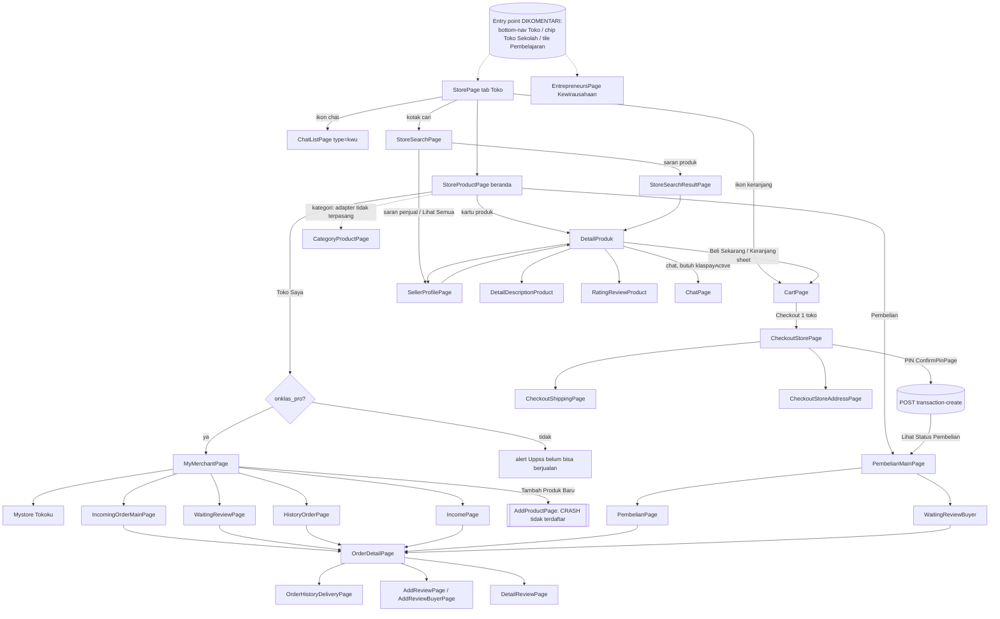
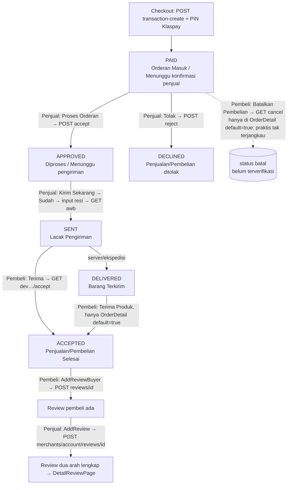

# 09 — Marketplace: Toko Sekolah (Pembeli) & Kewirausahaan (Penjual)

Dokumen ini menjelaskan cara kerja modul **Toko / Kewirausahaan (KWU)** di `android-portal` v2.1.40. Isinya dari sisi pembeli: beranda toko, kategori, pencarian, filter, detail produk, ulasan, profil penjual, keranjang, dan checkout. Dari sisi penjual: Toko Saya (buat/edit toko), daftar & tambah produk, orderan masuk/diproses/riwayat, input resi, lacak kiriman, pendapatan, dan ulasan penjual. Ada juga riwayat pembelian dan ulasan dari pembeli. **Temuan paling penting: seluruh modul ini tidak bisa dibuka (dormant) di aplikasi sekarang.** Semua titik masuknya sudah dijadikan komentar, walaupun Activity, layout, ViewModel, tabel Room, dan endpoint-nya masih ada di kode (lihat §0). Semua perilaku di bawah ditulis dari kode apa adanya, supaya kalau modul ini diaktifkan lagi, hasilnya bisa dibuat sama persis.

**Singkatan path** (semua relatif dari root `android-portal`):
`@/` = `app/src/main/java/id/diskola/app/` · `L/` = `app/src/main/res/layout/` · `N/` = `app/src/main/res/navigation/` · `M/` = `app/src/main/AndroidManifest.xml`.
Endpoint ditulis dengan ID `E##` yang merujuk ke tabel induk di §7.

## Daftar isi
- [0. Status modul & keputusan awal](#0-status-modul--keputusan-awal)
- [1. Syarat akses & flag](#1-syarat-akses--flag)
- [2. Peta layar & alur global](#2-peta-layar--alur-global)
- [3. Toko sekolah — sisi pembeli](#3-toko-sekolah--sisi-pembeli)
  - [3.1 Tab Toko & Beranda Toko](#31-tab-toko-storepage--beranda-toko-storeproductpage)
  - [3.2 Kategori](#32-kategori-categorypage--categoryproductpage)
  - [3.3 Lihat semua per kartu](#33-lihat-semua-per-kartu-seeallproduct)
  - [3.4 Pencarian](#34-pencarian-storesearchpage--storesearchresultpage)
  - [3.5 Filter & urutan](#35-filter--urutan)
  - [3.6 Detail produk, deskripsi, rating](#36-detail-produk-deskripsi-rating--sheet-tambah-keranjang)
  - [3.7 Profil penjual](#37-profil-penjual-sellerprofilepage)
- [4. Keranjang & checkout](#4-keranjang--checkout)
  - [4.1 Keranjang](#41-keranjang-cartpage)
  - [4.2 Checkout](#42-checkout-checkoutstorepage)
  - [4.3 Opsi pengiriman](#43-opsi-pengiriman-checkoutshippingpage)
  - [4.4 Alamat pengiriman](#44-alamat-pengiriman-checkoutstoreaddresspage--checkoutstorelocdialog)
- [5. Kewirausahaan — sisi penjual](#5-kewirausahaan--sisi-penjual)
  - [5.1 Toko Saya](#51-toko-saya-mymerchantpage)
  - [5.2 Hub Kewirausahaan lama](#52-hub-kewirausahaan-lama-entrepreneurspage)
  - [5.3 Tokoku — daftar produk](#53-tokoku--daftar-produk-mystore--productpage)
  - [5.4 Tambah/Edit produk (NONAKTIF)](#54-tambahedit-produk-nonaktif)
  - [5.5 Orderan Masuk / Diproses](#55-orderan-masuk--diproses-incomingordermainpage)
  - [5.6 Detail order & lacak pengiriman](#56-detail-order-orderdetailpage--lacak-pengiriman)
  - [5.7 Riwayat Orderan](#57-riwayat-orderan-historyorderpage)
  - [5.8 Pendapatan & penarikan](#58-pendapatan-incomepage--penarikan)
  - [5.9 Ulasan oleh penjual](#59-ulasan-oleh-penjual)
- [6. Pembelian — pembeli pasca-checkout](#6-pembelian--pembeli-pasca-checkout)
- [7. Status pesanan & transisi](#7-status-pesanan--transisi)
- [8. Kontrak API (tabel induk)](#8-kontrak-api-tabel-induk)
- [9. Data lokal](#9-data-lokal)
- [10. Perilaku perangkat/latar](#10-perilaku-perangkatlatar)
- [11. Aturan bisnis & edge case lintas layar](#11-aturan-bisnis--edge-case-lintas-layar)
- [12. Catatan migrasi Compose](#12-catatan-migrasi-compose)
- [Selisih dengan dokumen lama](#selisih-dengan-dokumen-lama)
- [Checklist paritas](#checklist-paritas)

---

## 0. Status modul & keputusan awal

| Titik masuk yang dulu ada | Status sekarang | Rujukan |
|---|---|---|
| Item bottom-nav "Toko" di Home (`menu_toko` → `action_global_storePage`) | Dijadikan komentar | `@/pages/home/HomePage.kt:251`, `app/src/main/res/menu/main_bot_menu.xml:27` |
| Chip "Toko" di tab Sekolah (`binding.menuToko` → `action_global_storePage`) | Dijadikan komentar (layout & listener) | `@/pages/sekolah/SekolahPage.kt:149-166`, `L/sekolah_page.xml:149` |
| Tile ke-7 di menu Pembelajaran → `EntrepreneursPage` (khusus `is_student`) | Dijadikan komentar | `@/pages/pembelajaran/PembelajaranPage.kt:703-711` |
| Notifikasi FCM / deep link | Tidak ada routing ke modul ini | (tidak ditemukan di `@/services/`) |

Akibatnya, **tidak ada jalur yang bisa ditempuh pengguna** menuju `StorePage` atau `EntrepreneursPage`. Semua Activity masih terdaftar di manifest (`M/:120-227`, blok komentar "klasbisnis pages"), **kecuali `AddProductPage` yang entri manifest-nya dijadikan komentar** (`M/:205-207`) dan isi kelasnya kosong (seluruh kode dijadikan komentar, `@/pages/entrepreneurs/myMerchant/addProduct/AddProductPage.kt:31-285`).

Bagian yang juga dormant di dalam modul (walaupun modulnya diaktifkan, bagian ini tetap tidak bisa dicapai atau hanya berisi data dummy):
- `CategoryPage`, `SeeAllProduct`, `StoreFilter`, `ChooseDeliveryPage`, fragmen `StoreSearchResult`, dan `StoreServicePage` tidak punya pemanggil.
- Semua tab/halaman **"Jasa"** (service) memakai daftar dummy atau kosong.
- `ReviewPage` (review/…) memakai `dummyList`.
- Kotak "Pembelian Terakhir" selalu kosong.
- Metode Pengiriman & Lokasi Pemasaran saat tambah produk hanya mockup.

> ✅ **Diputuskan (30-09-2026, Q-09-1 — `docs/FLOW_QUESTIONS.md` bagian A / `01-peta-fitur-dan-rencana.md` §4):**
> modul Toko/KWU **tidak dibangun ulang**. Paritas dengan aplikasi saat ini berarti **modul ini tidak
> tampil sama sekali** — jangan buat entry point apa pun ke `StorePage`/`EntrepreneursPage`. Dokumen ini
> tetap dipertahankan lengkap sebagai spesifikasi siap pakai kalau nanti modul ini diaktifkan (di balik
> feature flag default `false`). Keputusan per bug (§12.3, termasuk Q-09-2 s.d. Q-09-13) baru relevan
> kalau modul benar-benar diaktifkan nanti — **belum perlu dijawab sekarang**.

---

## 1. Syarat akses & flag

| Flag / key | Sumber | Dipakai untuk | Rujukan |
|---|---|---|---|
| `onklas_pro` (Boolean pref) | Respons login `product_school.onklas_pro`, default `false` | Boleh berjualan (masuk Toko Saya). Kalau `false`: ikon PRO tampil di beranda toko, lalu muncul dialog "Uppss, kamu belum bisa berjualan!" | `@/pages/login/LoginViewModel.kt:302`, `@/pages/login/LoginModels.kt:320`, `@/pages/sekolah/store/StoreProductPage.kt:86-101` |
| `has_store` (Boolean pref) | Diisi **hanya** oleh `fetchMerchant()`: `true` jika `GET merchants/account/profile` sukses; `false` hanya bila HTTP **400**. Error lain tidak mengubah nilainya | Kalau `false`: dialog "Masukkan Nama Toko" (buat toko), dan menu penjual tidak bisa diklik | `@/pages/entrepreneurs/EntrepreneursVM.kt:469-515` (476, 506-508) |
| `merchantId` (**String** pref) | `fetchMerchant()` → `pref.putString("merchantId", data.id.toString())` | Menyembunyikan tombol beli untuk produk milik sendiri; `DetailProduk` membacanya dengan `getString("merchantId","0").toInt()` | `@/pages/entrepreneurs/EntrepreneursVM.kt:477`, `@/pages/sekolah/store/DetailProduk.kt:85` |
| `klaspayActive` (Boolean pref) | Login / aktivasi Klaspay (lihat `08-keuangan-pembayaran-klaspay-ppob.md`) | Chat penjual dari detail produk; badge chat di toolbar toko | `@/pages/sekolah/store/DetailProduk.kt:188`, `@/pages/sekolah/store/StorePage.kt:125` |
| `screen_x`, `screen_y` (Int pref) | Global | Lebar kartu produk dihitung dari lebar layar | `@/pages/sekolah/store/StoreVm.kt:289-290,338` |
| `student` (String JSON `StudentItem`) | Global; ditulis ulang oleh checkout | Isian awal & cache alamat pengiriman | `@/pages/sekolah/store/CheckoutStoreViewModel.kt:40-66`, `@/pages/sekolah/store/CheckoutAddressViewModel.kt:28-56,172` |
| `dialogEntrepreneurs` | `EntrepreneursPage` (selalu di-set `true` lalu langsung dibaca → dialog tips selalu muncul) | Dialog "Mau Tips Jualan Pasti Laris ?" | `@/pages/entrepreneurs/EntrepreneursPage.kt:71-87` |

Ada kesalahan tipe: `merchantId` disimpan sebagai **String**, tetapi di beberapa tempat dibaca dengan `pref.getInt("merchantId")`. SharedPreferences melempar `ClassCastException`, lalu `PreferenceClass` menelannya dan mengembalikan **0** (`@/utils/PreferenceClass.kt:38-44`). Akibatnya ringkasan toko, cache produk, dan cache tambah produk selalu disimpan dan dibaca dengan `merchantId = 0`. Hasilnya tetap konsisten, tetapi hanya kebetulan (`@/pages/entrepreneurs/EntrepreneursVM.kt:620,635,660`, `@/pages/entrepreneurs/myMerchant/mystore/ProductViewModel.kt:29`, `@/pages/entrepreneurs/myMerchant/addProduct/AddProductViewModel.kt:254,285`, `@/pages/entrepreneurs/myMerchant/income/IncomeProductPage.kt:82`).

`DetailDescriptionProduct` dan `RatingReviewProduct` memanggil `pref.getString("merchantId").toInt()` **tanpa default**. Bagi pengguna yang belum pernah memuat profil toko, nilainya `""`, sehingga terjadi **crash `NumberFormatException`** saat layar dibuka (`@/pages/sekolah/store/DetailDescriptionProduct.kt:68`, `@/pages/sekolah/store/RatingReviewProduct.kt:73`). Sebenarnya `StorePage` selalu memanggil `loadMerchantUser()` saat dibuka (`StorePage.kt:108`), tetapi untuk pengguna tanpa toko pref ini tetap kosong.

Pengguna: kode tidak membatasi peran. Tile lama di Pembelajaran khusus `is_student`, sedangkan jalur Home/Sekolah terbuka untuk semua peran. Satu-satunya pembatas untuk berjualan adalah `onklas_pro` dan `has_store`.

---

## 2. Peta layar & alur global

| # | Layar | Tipe | File | Layout | Keterangan |
|---|---|---|---|---|---|
| 1 | Tab Toko | Fragment (di `sekolah_nav`) | `@/pages/sekolah/store/StorePage.kt` | `L/store_page.xml` | Host `N/store_page_nav.xml` |
| 2 | Beranda toko | Fragment | `StoreProductPage.kt` | `L/store_product_page.xml` | start `store_page_nav` |
| 3 | Jasa (dummy) | Fragment | `StoreServicePage.kt` | `L/store_service_page.xml` | tidak dipakai |
| 4 | Hasil filter | Fragment | `StoreSearchResult.kt` | `L/store_search_result.xml` | tidak bisa dicapai |
| 5 | Kategori | Activity | `CategoryPage.kt` | `L/category_page.xml` | tanpa pemanggil |
| 6 | Produk per kategori | Activity | `CategoryProductPage.kt` | `L/category_product_page.xml` | |
| 7 | Lihat semua | Activity | `SeeAllProduct.kt` | `L/see_all_product.xml` | tanpa pemanggil |
| 8 | Cari | Activity | `StoreSearchPage.kt` | `L/store_search_page.xml` | + sheet `L/bottom_seet_all_seller.xml` |
| 9 | Hasil cari | Activity | `StoreSearchResultPage.kt` | `L/store_search_result_page.xml` | |
| 10 | Filter | Activity | `StoreFilter.kt` | `L/store_filter.xml` | tanpa pemanggil |
| 11 | Detail produk | Activity | `DetailProduk.kt` | `L/detail_produk.xml` | + sheet `L/bottom_sheet_add_cart.xml` |
| 12 | Deskripsi produk | Activity | `DetailDescriptionProduct.kt` | `L/detail_description_product.xml` | |
| 13 | Review & rating produk | Activity | `RatingReviewProduct.kt` | `L/rating_review_product.xml` | |
| 14 | Profil penjual | Activity | `SellerProfilePage.kt` | `L/seller_profile_page.xml` | host `N/sellerprofile_nav.xml` |
| 14a | Produk penjual | Fragment | `SellerProductPage.kt` | `L/seller_product_page.xml` | + sheet `L/seller_profile_filter.xml` |
| 14b | Penjualan penjual | Fragment | `SellerPenjualanPage.kt` | `L/seller_penjualan_page.xml` | |
| 15 | Keranjang | Activity | `CartPage.kt` | `L/cart_page.xml` | |
| 16 | Checkout | Activity | `CheckoutStorePage.kt` | `L/checkout_store_page.xml` | |
| 16a | Opsi pengiriman | DialogFragment (full) | `CheckoutShippingPage.kt` | `L/checkout_shipping_page.xml` | |
| 16b | Alamat pengiriman | Activity | `CheckoutStoreAddressPage.kt` | `L/checkout_store_address_page.xml` | |
| 16c | Pilih prov/kota/kec | DialogFragment | `CheckoutStoreLocDialog.kt` | `L/checkout_store_loc_dialog.xml` | |
| 16d | Pilih metode kirim | Activity | `ChooseDeliveryPage.kt` | `L/choose_delivery_page.xml` | kosong, tanpa pemanggil |
| 17 | Toko Saya | Activity | `@/pages/entrepreneurs/myMerchant/MyMerchantPage.kt` | `L/my_merchant_page.xml` | hub penjual yang aktif (dari beranda toko) |
| 18 | Kewirausahaan | Activity | `@/pages/entrepreneurs/EntrepreneursPage.kt` | `L/entrepreneurs_page.xml` | hub lama; host `N/entrepreneurs_nav.xml` |
| 18a/b | Penjualan / Pembelian | Fragment | `EntrepreneursPenjualan.kt` / `EntrepreneursPembelian.kt` | `L/entrepreneurs_penjualan_page.xml` / `L/entrepreneurs_pembelian_page.xml` | |
| 19 | Tokoku | Activity | `myMerchant/mystore/Mystore.kt` | `L/mystore_page.xml` | host `N/mystore_nav.xml` |
| 19a | Produk saya | Fragment | `mystore/ProductPage.kt` | `L/product_page.xml` | |
| 19b | Jasa saya | Fragment | `mystore/ServicesPage.kt` | `L/services_page.xml` | kosong |
| 20 | Tambah/Edit produk | Activity | `addProduct/AddProductPage.kt` | `L/add_product_page2.xml` | **kelas kosong + tidak ada di manifest → crash** |
| 20a | Deskripsi produk (input) | Activity | `addProduct/ProductDescriptionPage.kt` | `L/product_description_page.xml` | |
| 20b | Kategori produk | Activity | `addProduct/AddProductCategoryListPage.kt` | `L/add_product_category_list_page.xml` | |
| 20c | Metode pengiriman | Activity | `addProduct/AddProductMetodePengiriman.kt` | `L/add_product_metode_pengiriman.xml` | mockup |
| 20d | Lokasi pemasaran | Activity | `addProduct/AddProductMarketingLocationPage.kt` | `L/add_product_marketing_location_page.xml` | mockup dummy |
| 21 | Orderan Masuk | Activity | `myMerchant/IncomingOrder/IncomingOrderMainPage.kt` | `L/incoming_order_main_page.xml` | host `N/incoming_order_main_nav.xml` |
| 21a–d | Masuk-Produk / Masuk-Jasa / Diproses-Produk / Diproses-Jasa | Fragment | `incomingOrderPage/IncomingProductPage.kt`, `IncomingServicePage.kt`, `procesedOrderPage/ProcessedProductOrderPage.kt`, `ProcessedServiceOrderPage.kt` | `L/incoming_product_page.xml`, `L/incoming_service_page.xml`, `L/processed_product_order_page.xml`, `L/processed_service_order_page.xml` | Jasa = dummy |
| 22 | Detail order | Activity | `@/pages/entrepreneurs/OrderDetailPage.kt` | `L/order_detail_page.xml` | dipakai penjual & pembeli |
| 23 | Detail pengiriman | Activity | `OrderHistoryDeliveryPage.kt` | `L/order_history_delivery_page.xml` | |
| 24 | Riwayat Orderan | Activity | `myMerchant/RiwayatOrder/HistoryOrderPage.kt` (+ `HistoryProductPage`, `HistoryServicePage`) | `L/history_order_page.xml` | host `N/order_history_nav.xml` |
| 25 | Total Pendapatan | Activity | `myMerchant/income/IncomePage.kt` (+ `IncomeProductPage`, `IncomeServicePage`) | `L/income_page.xml`, `L/income_product_page.xml` | host `N/income_nav.xml` |
| 26 | Menunggu Review (penjual) | Activity | `myMerchant/Review/WaitingReviewPage.kt` | `L/waiting_review_page.xml` | |
| 27 | Review Penjualan (penjual) | Activity | `myMerchant/Review/AddReviewPage.kt` | `L/add_review_page.xml` | |
| 28 | Review Produk (lihat) | Activity | `@/pages/entrepreneurs/DetailReviewPage.kt` | `L/detail_review_page.xml` | |
| 29 | Menunggu Review (dummy) | Activity | `review/ReviewPage.kt` (+ `ReviewProductList`, `ReviewServiceList`) | `L/review_page.xml` | host `N/review_nav.xml` |
| 30 | Pembelian (ringkasan) | Activity | `pembelian/PembelianMainPage.kt` | `L/pembelian_main_page.xml` | |
| 31 | Pembelian (daftar) | Activity | `pembelian/purchase/PembelianPage.kt` (+ `process/PembelianProductProcess`, `PembelianServiceProcess`, `done/PembelianProductDone`, `PembelianServiceDone`) | `L/pembelian_page.xml` | host `N/pembelian_nav.xml` |
| 32 | Menunggu Review (pembeli) | Activity | `pembelian/review/WaitingReviewBuyer.kt` | `L/waiting_review_buyer.xml` | |
| 33 | Review (pembeli) | Activity | `pembelian/review/AddReviewBuyerPage.kt` | `L/add_review_buyer_page.xml` | |



---

## 3. Toko sekolah — sisi pembeli

### 3.1 Tab Toko (`StorePage`) & Beranda Toko (`StoreProductPage`)

**Ringkasan.** Etalase produk hasil wirausaha siswa. Dulu tab Toko menjadi salah satu fragmen `sekolah_nav` (`N/sekolah_nav.xml`, destinasi `storePage`). Semua peran boleh melihat, tetapi untuk berjualan wajib `onklas_pro`.

**Titik masuk.** Hanya `action_global_storePage`, dan saat ini sudah dijadikan komentar (§0). Tidak ada argumen.

**Detail `StorePage`** (`@/pages/sekolah/store/StorePage.kt`):
- Toolbar memuat menu `R.menu.menu_home_store`, berisi item `menu_chat` dan `menu_cart` dengan actionView bernomor (`:62`).
  - Badge keranjang = `CartViewModel.countCart`; jika ≥100 tampil `"99+"` (`:64-68`). Klik → `CartPage` (`:69-71,83-85`).
  - Klik chat → `ChatListPage` dengan extra `type="kwu"` (`:73-94`).
  - Badge chat: di `onResume`, **hanya jika** `klaspayActive && findItem(menu_chat) == null`. Karena menu sudah di-inflate, kondisi ini tidak pernah benar, sehingga badge chat tidak pernah diperbarui (`:125-139`). Bug, tetapi tidak terlihat oleh pengguna.
- Kotak cari (`search_lay` / `in_name`, placeholder `"Cari Produk......."`) → `StoreSearchPage` (`:96-101`).
- Saat dibuat: `CartViewModel.fetchCart()`, hitung badge dari Room, lalu `EntrepreneursVM.loadMerchantUser()`, yang juga mengisi `has_store` dan `merchantId` (`:103-109`). `onResume` memperbarui badge keranjang dari Room (`:120-122`).
- Tombol `btn_filter` bertuliskan `"Filter"` ada di layout (`L/store_page.xml:91-99`) tetapi **tidak punya listener**. Fungsi bottom sheet filter `bottomSeetFilter()` (`:145-210`) tidak pernah dipanggil (lihat §3.5).

**Detail `StoreProductPage`** (`@/pages/sekolah/store/StoreProductPage.kt`), dari atas ke bawah:
1. Dua aksi utama:
   - `"Pembelian"` → `PembelianMainPage` (`:103-105`).
   - `"Toko Saya"` → jika `onklas_pro` buka `MyMerchantPage`; jika tidak, tampil `prettyAlert` dengan gambar `img_bukan_pro`, judul `"Uppss, kamu belum bisa berjualan!"`, pesan `"Hubungi sekolah untuk berjualan produkmu dan dapatkan penghasilanmu sendiri"`, dan tombol `"Oke saya akan hubungi sekolah"` tanpa tombol batal (`:86-98`). Ikon `ic_pro` tampil jika **bukan** PRO (`:100-101`).
2. Bagian `"Kategori"` + `"Lihat Semua"` (`L/store_category_main.xml`): RecyclerView-nya `gone`, digantikan placeholder gambar `img_development` + `"Fitur dalam pengembangan"` / `"Menu ini sedang dalam proses pembangunan, ditunggu updatenya yah..."` (`L/store_category_main.xml:42-103`). `categoryAdapter` ada, tetapi tidak dipasang ke RecyclerView mana pun (`:109-113,116-123` dikomentari).
3. `"Produk Terpopuler"` → `rv_product_terpopuler` (vertikal, `store_product_item1`), berisi `populer` (`:200-207`). ⚠️ ViewHolder menimpa gambar, nama, dan `"Terjual  {n}"` dengan data **dummy** `viewmodel.product[position]` (4 item hardcoded, `StoreVm.kt:86-121`). Jika server mengirim lebih dari 4 item → **IndexOutOfBounds crash** (`:455-478`).
4. `"Produk Terbaru"` + `"Reload"`, `"Produk Terlaris"`, `"Harga Terbaik"`, `"Rekomendasi"`: LiveData-nya diisi (`:211-230,256-259`), tetapi **RecyclerView di dalam include tidak diberi adapter** (bagian "DEPRECATED" dikomentari, `:115-199`). Jadi yang tampil hanya header tanpa isi.
5. `"Produk sekolahmu"` + `rv_produk` grid 2 kolom (`store_product_item2_full_home_product`), berisi `other_vertical` (`:241-252`).
6. Semua klik kartu → `DetailProduk.open(goodieId = item.id)`.
- Pull-to-refresh → `loadHomePage()` (`:72-78`). `isRefreshing` dimatikan ketika LiveData apa pun terisi. Error hanya dicatat (`errorString` tidak diamati), jadi gagal memuat = spinner mati tanpa pesan.

**API:** E01 (on open & refresh), E60 via CartVM, E17 via KWU VM.

### 3.2 Kategori (`CategoryPage` → `CategoryProductPage`)

**`CategoryPage`** (tanpa pemanggil, `@/pages/sekolah/store/CategoryPage.kt`):
- Judul `"Kategori"` (`:63-64`). Kolom kiri berisi kategori induk (E02, disimpan ke `store_category`), kolom kanan berisi sub-kategori (E03, disimpan ke `store_categorySub`).
- Default memilih kategori id **1** (`:77`). Pull-to-refresh dimatikan (`:72`).
- Klik induk → tandai terpilih (latar putih, teks `colorPrimary`) lalu muat sub (`:171-230`).
- Klik sub → `CategoryProductPage.open(categorySubId=sub_id, categoryId=parent_id, title=name)` (`:278-285`).

**`CategoryProductPage`** (`@/pages/sekolah/store/CategoryProductPage.kt`):
- Extras: `categoryId`, `categorySubId`, `title`, dipakai sebagai judul toolbar (`:31-38,71-72`).
- Grid 2 kolom `store_product_item2_full`.
- Keadaan kosong: gambar `img_emp_riwayat_order`, `"Pencarian Tidak Ditemukan"` / `"Koreksi kata pencarian atau ubah menggunakan kata yang lainnya"` (`:61-64`).
- Memuat E04 lewat `fetchProduct(position="categoryProduct")` (`:74-77`), disimpan ke `store_product`, dibaca dengan filter `category_id` + `sub_category_id` (`StoreVm.kt:681-716,935-966`).
- ⚠️ Path E04 dirakit dari `"{categoryId}{categorySubId}"`:
  - Jika `categorySubId == 0`, `subUrl = "0"` → path menjadi `goodies/categories/50` untuk kategori 5. Ini salah; seharusnya `.../5`.
  - Jika tidak 0, `subUrl = "/subcategories/{id}"`, tetapi Retrofit meng-encode `/` pada `@Path` menjadi `%2F` (`StoreVm.kt:683-689`, `@/api/ApiService.kt:1048-1054`).
  - Query Room juga mensyaratkan `sub_category_id = 0` jika sub = 0, sehingga produk dari kategori induk (klik dari beranda) tidak pernah cocok (`StoreDao.kt:79-85`).
- Paging: callback akhir daftar memanggil `fetchProduct(0,…)` sehingga halaman berikutnya tidak pernah dimuat (`StoreVm.kt:950-962`).

### 3.3 Lihat semua per kartu (`SeeAllProduct`)
Tanpa pemanggil (semua pemanggil di beranda dijadikan komentar). Extras `titlePage` dan `filterCard` (`sekolah_lain|terpopuler|terbaru|terlaris`). Memuat E05 `card?filter=` dengan paging 20, grid 2 kolom (`@/pages/sekolah/store/SeeAllProduct.kt:29-35,94-104`, `StoreVm.kt:600-626`).

### 3.4 Pencarian (`StoreSearchPage` → `StoreSearchResultPage`)

**`StoreSearchPage`** (`@/pages/sekolah/store/StoreSearchPage.kt`):
- Fokus otomatis ke input (`hint "Cari Produk......."`) dan keyboard dipaksa tampil (`:47-49`). Tombol X mengosongkan teks (`:63-65`).
- Setiap perubahan teks menjadwalkan (`Handler.postDelayed` 800 ms, **tanpa pembatalan**, jadi setiap ketikan memicu satu panggilan) dua permintaan: saran produk E09 (`take=5`) dan saran penjual E08 (`take=50`) (`:51-59`, `StoreVm.kt:893-915`).
- Daftar saran produk hanya berisi nama. Klik → `StoreSearchResultPage.open(keyword = nama saran)` (`:133-141`). **Tidak ada aksi IME/Enter**: pengguna hanya bisa mencari lewat saran.
- Daftar penjual: header `"Penjual "` + `"Lihat Semua"`. Item berisi avatar, nama, dan `school_name`. Klik → `SellerProfilePage.open(name, id)` (`:171-186`).
  - Kode hanya mengambil 5 pertama lewat `for (i in 0 until 5)`. Jika hasil **kurang dari 5**, terjadi exception yang ditelan dan daftar **tidak diperbarui** (`:73-84`).
  - `"Lihat Semua"` membuka bottom sheet penuh berjudul `"Penjual"` yang menampilkan semua hasil memakai adapter yang sama (`:193-228`).
- Keadaan kosong (`ic_emp_suggest`, `"Pencarian Tidak Ditemukan"` / `"Koreksi kata pencarian atau ubah menggunakan kata yang lainnya"`) hanya dihitung sekali saat awal (`allEmpty = true`, `:60,87-93`). `"Produk tidak ditemukan"` tampil jika saran produk kosong (`L/store_search_page.xml:142-146`).

**`StoreSearchResultPage`** (`@/pages/sekolah/store/StoreSearchResultPage.kt`):
- Extra `keyword`, ditampilkan di kotak atas. Klik kotak → `finish()` (`:63-68`).
- Tab `"Terkait"`, `"Terbaru"`, `"Terlaris"`, `"Harga"` hanya logging, **tidak mengubah urutan** (`:84-91,195-208`).
- Menu filter (`menu_product_filter`): klik item apa pun menjalankan `finish()` (`:55-58`).
- Grid 2 kolom `store_search_product_item` (nama, `"Rp …"`, rating, `"Terjual n"`, `"Belum ada review"`).
- Memuat E10 `search?keyword=` dengan paging 20 (`:77-82`, `StoreVm.kt:654-680`). Pull-to-refresh memuat ulang.
- Klik → `DetailProduk`.

### 3.5 Filter & urutan

| Tempat | Opsi (label → kode) | Aksi "Tampilkan" | Status |
|---|---|---|---|
| Sheet filter beranda `StorePage.bottomSeetFilter` / Activity `StoreFilter` | `"Semua Produk"`→`semua` (default), `"Terpopuler"`→`terpopuler`, `"Terbaru"`→`terbaru`, `"Harga Terbaik"`→`harga_terbaik` (`StoreVm.kt:258-269`) | Tombol berlabel `"Tampilkan {n} Produk"` dengan n dari E06 `filter/count?filter=` (saat bind item terpilih). Klik → navigasi ke fragmen `StoreSearchResult` dengan arg `selectedFilter`, yang memuat E07 `filter/list` (`StorePage.kt:176-191`, `StoreSearchResult.kt:56,98`). `StoreFilter` mengirim broadcast lokal `OnklasBroadcast{openResult, filterCode}` yang **tidak punya penerima** (`StoreFilter.kt:102-114`) | Tidak bisa dicapai. `"Reset filter"` mengembalikan ke default |
| Sheet filter profil penjual (`SellerProductPage`) | Urutan: `"A-Z"`(default), `"Z-A"`, `"Terlaris"`, `"Terpopuler"`, `"Termurah"`, `"Termahal"`. Tampilan: `"Grid"`(default), `"List"` (`StoreVm.kt:271-287`) | Tombol `"terapkan"` → **listener kosong** (`SellerProductPage.kt:236-237`) | Bisa dibuka, tetapi tidak berefek |
| Filter bintang review (`RatingReviewProduct`) | `"Semua"`→`all`, `"1"`…`"5"`. ⚠️ label `"3"` memakai kode `"4"` (`StoreVm.kt:441-446`) | Memuat ulang E13 `?star=` | Berfungsi (dengan bug) |
| Filter tanggal (penjual & pembeli) | Ikon kalender → `DatePickerDialog` (maxDate hari ini), format `yyyy-MM-dd` | Lihat §5.5 | Berfungsi |

### 3.6 Detail produk, deskripsi, rating & sheet tambah keranjang

**`DetailProduk`** (`@/pages/sekolah/store/DetailProduk.kt`). Extra `goodieId` (Int).
- Judul `"Detail Produk"`. Menu keranjang (`menu_cart`) → `CartPage` (`:50-59,124-125`).
- On open: E11 `goodies/{id}/detail` (`:67-69`). Pull-to-refresh memanggilnya ulang dan menambah observer baru setiap kali (`:93-117`, observer bertumpuk).
- UI dari atas: ViewPager2 gambar + penanda `"{posisi}/{total}"` (`:75,128-136`), nama, `"Rp {harga}"`, rating ★ `limitComma(rating)` | `"Terjual {sold}"`, atau `"Belum ada review"` jika rating kosong, `"| Stok {stock}"`, tautan `"Lihat Review"` (disembunyikan jika rating `""`/`"0"`, `:86-90`), `"Deskripsi Produk"` + `"Lihat Deskripsi"`, lalu kartu penjual (avatar, nama, nama sekolah pemilik, `"Profil Penjual "`) (`L/detail_produk.xml:148-408`).
- Bar bawah (chat | keranjang | `"Beli Sekarang"`) **disembunyikan jika `item.merchant.id == merchantId` milik sendiri** (`L/detail_produk.xml:496`).
- `"Beli Sekarang"` / ikon keranjang: jika `stock > 0` buka sheet (judul `"Beli Produk"` atau `"Tambah ke Keranjang"`); jika tidak, tampil `alert "Stok produk Kosong"` (`:151-175`).
- Chat: jika `klaspayActive`, loading `"Memproses permintaan"` → E59 `payment/merchant/id/{merchantId}` → `ChatPage` dengan extras `with=chat_id`, `name`, `image`, dan `payload_productId/Name/Image/Price`. Payload tidak dibaca oleh `ChatPage` (`@/pages/chat/ChatPage.kt:44-47` dikomentari). Error ditelan (`:187-213`). Jika tidak aktif, tampil `prettyAlert` `"Aktivasi Wallet Lebih Dahulu"` / `"Kamu belum mengaktifkan Wallet Payment, silahkan aktifkan Wallet Payment terlebih dahulu"`, tombol `"Aktivasi Sekarang"` → `KlaspayAktivasiPage` (`:214-230`). Untuk chat lihat `04-sosial-feed-chat-pengumuman.md`.
- Semua error `apiWrapper.errorString` ditampilkan sebagai pesan statis `"Produk ini sudah mencapai batas stok di keranjang anda"` (`:181-185`).
- Profil penjual → `SellerProfilePage.open(namaMerchant, merchantId)` (`:177-179`).

**Sheet tambah keranjang** (`L/bottom_sheet_add_cart.xml`; logika di `DetailProduk.kt:274-340`, disalin identik di `DetailDescriptionProduct.kt:98-166` dan `RatingReviewProduct.kt:281-349`):
- Gambar pertama, nama, `"Rp{harga}"` (tanpa spasi), `"stok {n}"`, `"Jumlah Pembelian"`, qty awal `"1"`, tombol `"Masukkan Keranjang"`.
- `−` hanya jika qty > 1. `+` hanya jika qty < stok; jika tidak, tampil `alert "Jumlah barang tidak dapat melebihi stok"`.
- Kirim: loading `"memproses permintaan"` → E61 `POST carts {enterpreneur_goodies_id, quantity}` (`@/utils/ApiWrapper.kt:486-493`). Sheet ditutup **baik sukses maupun gagal**. Untuk mode `"Beli Produk"`, `CartPage` dibuka 800 ms kemudian (`:313-331`).

**`DetailDescriptionProduct`**: extras `goodiesId, stock, fullDesc, merchantId`. Menampilkan deskripsi penuh + bar beli yang sama. Memuat E11 lagi untuk data sheet (`@/pages/sekolah/store/DetailDescriptionProduct.kt:24-96`). Crash jika pref `merchantId` kosong (§1).

**`RatingReviewProduct`** (`@/pages/sekolah/store/RatingReviewProduct.kt`): extras `goodieId, stock, merchantId`. Judul `"Review dan Rating"`.
- E12 `goodies/{id}/review` menyediakan `average_rating` (`limitComma` + RatingBar) dan `jumlah_reviewer` (`:75-84`).
- Chip filter bintang horizontal (terpilih = border emas).
- Daftar E13 `listreview?star=`. Item berisi nama pengguna, rating, komentar, dan tanggal `yyyy-MM-dd'T'HH:mm:ss.SSS'Z'` → `dd-MM-yyyy`. Parse gagal = crash, karena tidak ada try (`:172-182`).
- Bar beli dan sheet sama seperti di atas.

### 3.7 Profil penjual (`SellerProfilePage`)
`@/pages/sekolah/store/SellerProfilePage.kt`. Extras `sellerName`, `sellerId`. Judul `"Profil Penjual"`. Memuat E14 `merchants/{sellerId}` (avatar, nama) (`:54-70`). Dua tab ikon di atas NavHost `sellerprofile_nav`:
- **Produk** (`SellerProductPage`, default): grid `merchant_product_item_full` (gambar, overlay `"Produk Habis"` jika `stock == 0`, nama, rating, `"Terjual n"` / `"Belum ada review"`, `"Rp. {harga}"`). Klik → `DetailProduk` (`SellerProductPage.kt:164-191`). Tombol `"Filter"` hanya tampil di tab ini dan mengirim broadcast `FilterSellerProduct` untuk membuka sheet (§3.5) (`SellerProfilePage.kt:71-100`).
- **Penjualan** (`SellerPenjualanPage`): `"{amount_of_reviewer} review"`, rating penjualan, `"Penjualan berhasil"`, lalu daftar `"Produk Terlaris"`. Keadaan kosong: `ic_belum_ada_penjualan`, `"Belum Ada Penjualan"` / `"Yuk tambah produkmu dan mulai berjualan"` (`SellerPenjualanPage.kt:47-75`).
- ⚠️ Kedua tab memanggil `listProductMerchant(id, "all")`, dan di `StoreVm` cabang `"all"` justru memanggil **E16 best-seller**. Cabang `"bestSeller"` (tidak pernah dipakai) memanggil E15 goodies-all. Selain itu `skip` selalu 0 (`StoreVm.kt:795-866`). Jadi kedua tab menampilkan data best-seller.

---

## 4. Keranjang & checkout

### 4.1 Keranjang (`CartPage`)

**Titik masuk:** ikon keranjang di `StorePage`/`DetailProduk`/`EntrepreneursPage`, atau `"Beli Sekarang"` dari sheet. Tanpa extras (`@/pages/sekolah/store/CartPage.kt:31-35`).

**Penggabungan per toko.** `fetchCart()` memanggil E60 `GET carts`, yang mengembalikan `[{merchant{id,name,avatar}, goodies[{goodie{id,name,price,stock,image{image}}, quantity}]}]`. Lalu dalam satu transaksi Room (`@/pages/sekolah/store/CartViewModel.kt:46-89`):
1. `cart.clear()`, sehingga **semua centang hilang setiap kali fetch**.
2. Untuk setiap goodie, insert `CartTable(merchant_id, merchant_name, product_id, quantity)` dan upsert produk ke `store_product` (`ProductTable(CartItem)` dengan id `"{id}-{name}"`).
3. Untuk setiap merchant, insert baris **header toko** `CartTable(product_id=0, showItem=false)`.
- Daftar dibaca `order by merchant_id, created desc, product_id` (`CartDao.kt:49-51`). Header ditulis paling akhir sehingga `created` terbaru → muncul di atas item-item tokonya. Urutan ini rapuh.

**UI** (`L/cart_page.xml`):
- Judul `"Keranjang Belanja"` + `" ({countCart})"` jika > 0.
- Baris header toko (`cart_item_store`): checkbox + nama toko. Klik baris → `SellerProfilePage` (`:172-188`).
- Baris item (`cart_item_good`): checkbox, gambar, nama, `"Rp {harga}"`, `−`/qty/`+`, `"Stok sisa: {stock}"` (hanya jika stok ≤ 10). Klik baris → `DetailProduk` (`:203-245`).
- Footer: `"Harga Produk"` + total `"Rp {Σ qty×harga item terpilih}"` atau `"-"`, tombol `"Checkout"` + `" ({countSelected})"`, aktif hanya jika ada item terpilih (`L/cart_page.xml:70-108`, `CartPage.kt:93-100`).
- Keadaan kosong (`cart_emp_layout`): `"Belum Ada Pembelian"` / `"Bantu lariskan produk yang dijual oleh teman kamu"`, tombol `"Lihat Produknya"` → `finish()` (`:117-119`).
- Pull-to-refresh hanya aktif jika item pertama terlihat penuh (`:61-73`).

**Aksi:**
- **Centang** (`CartViewModel.kt:100-117`): centang header = semua item toko itu ikut. Centang item: jika semua item toko terpilih, header ikut tercentang; jika item terakhir dilepas, header ikut lepas.
- **`+`**: jika `qty < stock` → loading `"memproses permintaan"`, tulis ke Room, lalu E62 `PUT carts/goodies/{productId} {quantity}`. Jika tidak, tampil `alert "Jumlah barang tidak dapat melebihi stok"`. **`−`** jika qty > 1 bekerja sama. ⚠️ `updateCart` tidak dibungkus try: error jaringan membuat coroutine crash (`CartPage.kt:211-239`, `ApiWrapper.kt:495-496`).
- **`−` saat qty = 1** → dialog (`entrepreneurs_costom_dialog`, gambar `img_danger`) `"Konfirmasi Hapus"` / `"Produk akan dihapus dari keranjang belanja"`, tombol `"Batalkan"` | `"Hapus"`. Hapus: loading `"Proses menghapus"` → hapus baris Room (dan header jika tinggal header) → E63 `DELETE carts/goodies/{productId}`. Error E63 ditelan, sehingga data lokal & server bisa tidak sinkron (`:255-291`).
- **Checkout**: jika `merchantSelected() > 1` (jumlah `DISTINCT merchant_id` yang `selected`, header ikut dihitung) → toast `"Maaf checkout hanya per 1 toko"`. Jika tidak → `startActivityForResult(CheckoutStorePage, 243)`. Hasil `RESULT_OK` → `CartPage` ditutup (`:102-129`).
- `errorString` → toast (`:115`).

### 4.2 Checkout (`CheckoutStorePage`)

`@/pages/sekolah/store/CheckoutStorePage.kt` + `CheckoutStoreViewModel.kt`. Judul toolbar XML `"Pilih Metode Pengiriman"` (`L/checkout_store_page.xml:29`). Pembayaran memakai saldo & PIN **Klaspay**. Detail PIN, saldo, dan topup ada di `08-keuangan-pembayaran-klaspay-ppob.md`.

Urutan saat dibuka:
1. `init` Activity memanggil E65 `payment/wallet`, lalu `klaspayBalance`. Error ditelan (`:27-34`).
2. `init` VM (`CheckoutStoreViewModel.kt:47-73`): `getSelected()` (item `showItem=1 & selected=1`). `countItem` = jumlah item. ⚠️ **`subtotal` = Σ harga TANPA kuantitas** (`:53`), padahal keranjang menghitung qty×harga.
3. E67 `GET shipping-address`. Jika ada: `address` di-set, pref `student.user.*` diperbarui (⚠️ `city` diisi `province.name`, `:63`), lalu `fetchShipments()`.
4. `fetchShipments()` (`:75-103`): E57 `GET checkouts/shipping-fee-list?product[]=…`, lalu **otomatis memilih ongkir termurah** (`minByOrNull cost`). Daftar dikelompokkan per `courier_name` menjadi baris induk + baris layanan. `total = subtotal + cost`.
5. Selama `isLoading` tampil loading `"Menampilkan data"` (`:78-83`).

UI (`L/checkout_store_page.xml`), dari atas:
- Kartu saldo Klaspay `"Rp"` + saldo.
- Daftar item (`checkout_item_item`: gambar, nama, `"Rp harga"`, `"{qty}x"`). Header toko `checkout_store_item` tidak pernah muncul karena `getSelected` mengecualikan header.
- `"Alamat Pengiriman"`: teks `address + "\n" + kecamatan + ", " + kota + ", " + provinsi`, atau `"Isi alamat pengiriman"`. Klik → alamat (`:60-61,88-89`).
- `"Opsi Pengiriman"`: nama kurir, `"Estimasi tiba " + estimation_day.lowercase()`, `"Rp ongkir"`. Klik bagian mana pun → sheet ongkir (`:55-58,132-134`).
- `"Total Pesanan ({countItem})"` + `"Rp subtotal"`, lalu `"Total Pembayaran"` + `"Rp total"`.
- Tombol `"Lakukan Pembayaran"`.

Aksi bayar (`:63-74,98-127`):
- Jika `address == null` → `prettyAlert` `"Alamat Pengiriman"` / `"Mohon isikan alamat pengiriman lengkap terlebih dahulu"`, tombol `"Isi Alamat"` → buka alamat.
- Jika tidak → `ConfirmPinPage.getPin(this)` (RC `4281`, `@/pages/pembayaran/ConfirmPinPage.kt:189-197`). Hasil OK → loading `"memproses permintaan"` → E58 `POST checkouts/transaction-create`.
  - Body `{shipping_fee_id, pin, "product[]": productId}`. ⚠️ `product[]` dimasukkan berulang ke `Map`, sehingga **hanya produk terakhir yang terkirim**. Kuantitas tidak dikirim (`CheckoutStoreViewModel.kt:121-137`).
  - Sukses → `prettyAlert` sukses `"Pembelian produk berhasil"` / `"Penjual akan segera memproses orderan kamu, mohon ditunggu ya"`:
    - `"Lihat Status Pembelian"` → `PembelianMainPage`, lalu `setResult(OK)` + finish.
    - `"Kembali ke Beranda"` → `setResult(OK)` + finish.
  - Gagal → toast `errorString`.
- Setelah alamat disimpan (RC `283` OK): loading `"memproses data"` + `fetchShipments()` saja. ⚠️ `address` tidak diperbarui, sehingga pengguna yang sebelumnya belum punya alamat tetap mendapat alert alamat sampai layar dibuka ulang (belum terverifikasi: tergantung respons E67 saat alamat kosong) (`:91-97`).

### 4.3 Opsi pengiriman (`CheckoutShippingPage`)
DialogFragment penuh, judul `"Opsi Pengiriman"`, memakai VM activity yang sama (`@/pages/sekolah/store/CheckoutShippingPage.kt`).
- Baris induk (`shipping_name_item`): nama kurir + panah (rotasi 180° saat terpilih). Klik → tandai induk.
- Baris layanan (`shipping_type_item`): radio, `"Rp cost"`, `name`, `"TIBA DALAM " + estimation_day.uppercase()`. Memilih → menandai layanan & induknya (`:53-112`).
- `"Konfirmasi"` → `selectedShip` = layanan terpilih, `total = subtotal + cost`, lalu tutup (`:39-45`).

### 4.4 Alamat pengiriman (`CheckoutStoreAddressPage` + `CheckoutStoreLocDialog`)
Judul `"Alamat Pengiriman"`. Isian: `"Alamat Lengkap"` (two-way `inputAddress`), `"Provinsi"`, `"Kota"`, `"Kecamatan"`, tombol `"Simpan Alamat"` (`L/checkout_store_address_page.xml`). Nilai awal diambil dari pref `student.user` (`CheckoutAddressViewModel.kt:40-56`).
- Pilih provinsi, kota, atau kecamatan → dialog berjudul `"Pilih Provinsi"`/`"Pilih Kota"`/`"Pilih Kecamatan"`. Dialog kota/kecamatan menampilkan header nama induk. Kota hanya bisa dibuka jika provinsi sudah terisi, kecamatan jika kota sudah terisi. Memilih item langsung menutup dialog (`CheckoutStoreAddressPage.kt:58-88`, `CheckoutStoreLocDialog.kt:38-42,90-96`). ⚠️ Mengganti provinsi **tidak** mengosongkan kota/kecamatan.
- Sumber data (disimpan di Room `province`/`city`/`district`, diurutkan menurut nama):
  - E68 `location/province`.
  - E69 `location/city?province_id&limit=20&offset=` ⚠️ yang dikirim sebagai `offset` adalah **nomor halaman** (1, 2, …).
  - E70 `location/district?city_id&limit=20&page=`.
  - Halaman berikutnya hanya dimuat jika `count > 20`, padahal halaman pertama pas 20, sehingga **daftar berhenti di 20 item**.
  - `fetchDistrict` mengisi `lastPageCity` alih-alih `lastPageDistrict` (`CheckoutAddressViewModel.kt:77-153`).
- Simpan: loading `"menyimpan data alamat"` → E71 `POST shipping-address {province_id, city_id, sub_district_id, address}` → pref `student` → `RESULT_OK` + finish. **Tidak ada validasi field kosong.** Error → `errorString`, tetapi tidak diamati di layar ini, jadi gagal tanpa pesan (`CheckoutAddressViewModel.kt:155-179`, `CheckoutStoreAddressPage.kt:42-53`).

`ChooseDeliveryPage`: layar kosong berjudul `"Pilih Metode Pengiriman"`, tanpa pemanggil (`@/pages/sekolah/store/ChooseDeliveryPage.kt:35-36`).

---

## 5. Kewirausahaan — sisi penjual

### 5.1 Toko Saya (`MyMerchantPage`)

**Titik masuk:** `"Toko Saya"` di beranda toko, jika `onklas_pro` (§3.1). Judul toolbar XML `"Toko Saya"`. Menu `menu_pro` (ikon `ic_bg_pro`, **hanya tampil jika bukan PRO**) (`@/pages/entrepreneurs/myMerchant/MyMerchantPage.kt:59-67`).

**Syarat punya toko & aktivasi toko:**
- `onCreate`:
  - Jika `!onklas_pro` → dialog `kwu_bukkanpro_dialog`: `"Uppss, kamu belum bisa berjualan!"` / `"Hubungi sekolah untuk berjualan produkmu, dan dapatkan penghasilanmu sendiri"`, tombol `"Oke saya akan hubungi sekolah"` (`:210-213,495-505`).
  - Jika `!has_store` → dialog **buat toko** (`:214-216`). ⚠️ Pref ini dibaca **sebelum** `loadMerchantUser()` selesai (dijalankan di `onPostResume`/`onResume`), sehingga pada pembukaan pertama di perangkat baru dialog bisa muncul walaupun toko sebenarnya ada.
- Dialog `edit_merchant_dialog` (`:456-492`):
  - Judul `"Masukkan Nama Toko"` (buat) atau `"Edit Nama Toko"` (edit). Hint `"Masukkan Nama Toko"`, prefill = nama toko sekarang.
  - Tombol `"Konfirmasi"` | `"Batal"`. Keyboard otomatis tampil.
  - Validasi: nama tidak boleh kosong → toast `"Nama Toko Tidak Boleh Kosong"`.
  - Buat → E18 `POST merchants?name=`. Edit → E19 `PUT merchants/account/profiles?name=`.
  - Respons sukses memicu `loadMerchantUser()` untuk refresh header (`:176-196`). Setelah itu `fetchMerchant` mengisi `has_store=true`.
- Tombol `"Edit"` (tampil jika nama toko tidak kosong) → dialog edit (`:172-174`).
- Klik avatar → dialog izin galeri `"Akses Galeri Diperlukan"` → Photo Picker/SAF → uCrop (1:1, maks 720×720, JPEG 80, judul `"Atur Gambar"`) → E20 multipart `file` (`:200-202,220-256`, `@/utils/IntentUtil.kt:263-297`).

**UI** (`L/my_merchant_page.xml`, dari atas):
- Avatar, nama toko, `"{product} Produk"`, `"Edit"`.
- Rating penjualan: `"{amount_of_review} review"`, `sales_rating`, `"Penjualan berhasil"` = `success_transaction` (`:273-286`).
- Tombol `"Tambah Produk Baru"`.
- Menu (`entrepreneurs_penjualan_menu_item`) dengan nilai dari E24 summary (`:98-153`):

| Posisi | Ikon | Label | Nilai | Tujuan |
|---|---|---|---|---|
| 0 | `ic_mystore` | `"Toko ku"` | `"{product} Produk"` | `Mystore` |
| 1 | `ic_income` | `"Total pendapatan"` | `"Rp {incoming_amount}"` | `IncomePage` |
| 2 | `ic_incoming_orders` | `"Orderan Masuk"` | `"{incoming_order}"` | `IncomingOrderMainPage` |
| 3 | `ic_review` | `"Lihat Review"` | `"{review} "` | `WaitingReviewPage` |
| 4 | `ic_order_history` | `"Riwayat Orderan"` | `"{history_order} "` | `HistoryOrderPage` |

  (`EntrepreneursVM.kt:68-76`, `MyMerchantPage.kt:419-454`). Klik menu: jika `!has_store` → dialog buat toko; menu baru bisa dibuka jika `onklas_pro && has_store` (`:307-317`).
- `"Penjualan Terlaris"`: daftar produk sendiri (`merchant_product_item_1`) dari E21 goodies-all (`skip` selalu 0, 20 item). Klik → `DetailProduk` (`:333-417`).
- `"Tambah Produk Baru"`: jika `has_store` → `AddProductPage` → **crash `ActivityNotFoundException`** (§5.4). Jika tidak → dialog buat toko (`:164-170`).
- Loading global hanya pada kemunculan pertama (`:87-96`). `errorString` → toast (`:203-208`).
- Fetch berulang: `loadMerchantUser()` dipanggil di `onPostResume` **dan** `onResume` (dua kali per resume, masing-masing memicu `fetchMerchant` dua kali, `EntrepreneursVM.kt:404-418`).

### 5.2 Hub Kewirausahaan lama (`EntrepreneursPage`)
Tanpa titik masuk (tile Pembelajaran dijadikan komentar). Judul `"Kewirausahaan"`. Header toko (avatar, nama, `"{product} Produk"`, `"Edit"`). Tab `"Penjualan"` | `"Pembelian"` (NavHost `entrepreneurs_nav`). Menu keranjang → `CartPage`. Dialog tips `"Mau Tips Jualan Pasti Laris ?"` / `"Ngga pake ribet, ngga pake nunggu lama, mudah ditiru buat kamu yang baru jualan "` (`"Nanti Saja"` | `"Cari tau"`, keduanya hanya menutup) **selalu tampil**. `"Edit"` hanya menampilkan toast `"test konfirmasi "` (`@/pages/entrepreneurs/EntrepreneursPage.kt:71-155`).
- `EntrepreneursPenjualan`: sama dengan menu Toko Saya, kecuali posisi 3 → `ReviewPage` (dummy). `"Tambah Produk Baru"` → `AddProductPage` (crash) (`EntrepreneursPenjualan.kt:115-117,250-285`).
- `EntrepreneursPembelian`: saldo Klaspay (E65) + `"Topup Saldo"` → `KlaspayTopupPage`. Menu `"Pembelian"` → `PembelianPage`, `"Menunggu Review"` → `ReviewPage` (dummy). ⚠️ Jika `payment/wallet` merespons `status != "success"`, **pengguna di-logout** (`intentUtil.logOutAndNavigateToLogin`) (`EntrepreneursPembelian.kt:66-77,200-217`, `EntrepreneursVM.kt:679-691`).

### 5.3 Tokoku — daftar produk (`Mystore` → `ProductPage`)
Judul `"Toko ku"` (`Mystore.kt:46-47`). Tab Produk/Jasa dijadikan komentar, jadi hanya `ProductPage` yang tampil (`N/mystore_nav.xml`).
- Sumber: E21 `account/profile/goodies-all?take=20&skip=` → Room `store_product` (`productPosition="mystore"`, `merchant_id=0` karena bug pref) → paging (`ProductViewModel.kt:31-77`). Pull-to-refresh = `refresh()`.
- Item `mystore_product_item`:
  - Gambar. Overlay `"DITOLAK"` hanya tampil jika `status == REJECTED`. Label status mengikuti `ACCEPTED→"Ditayangkan"`, `REJECTED→"Ditolak"`, `CHECKED→"Menunggu Verifikasi"`, lainnya `"Nonaktif"`.
  - Nama, `"Rp harga"`, `"Stok n"` (merah + ikon bahaya jika 0), switch `published` (`L/mystore_product_item.xml:36-150`, `StoreEntities.kt:69-74`).
- `"Atur"` (txtEdit) → pilihan `"Edit"` | `"Hapus"`:
  - Edit → `AddProductPage` dengan extra `productId` (RC 320, crash).
  - Hapus → `prettyAlert "Konfirmasi Hapus"` / `"Hapus produk ini?"` tombol `"Hapus"` **tanpa aksi**, sehingga E53 `deleteGood` tidak pernah dipanggil (`ProductPage.kt:113-131`).
- Switch tayang → loading `"memproses permintaan"` → E50 `PUT goodies/publish/{id} {published: Boolean}`. Error ditelan. ⚠️ Listener dipasang **sebelum** binding men-set `checked`, sehingga recycle/scroll bisa memicu API publish tanpa disengaja (`ProductPage.kt:133-157`).
- Keadaan kosong: `product_emp_layout` `"Belum Ada Produk"` / `"Tambah produk dan mulai jual ke semua orang di sekolahmu"`. Tombol `"Tambah Produk Baru"` → `AddProductPage` (crash) (`L/product_page.xml`, `ProductPage.kt:58-60`). `isEmptyProduct` tidak pernah di-set, jadi keadaan kosong tidak pernah tampil.

### 5.4 Tambah/Edit produk (NONAKTIF)
**Status:** `AddProductPage` kosong dan tidak terdaftar di manifest. Setiap tombol "Tambah Produk"/"Upload Produk"/"Edit" akan crash (`M/:205-207`). Spesifikasi di bawah diambil dari kode yang dijadikan komentar (`AddProductPage.kt:31-285`) dan `AddProductViewModel` yang masih aktif. Ini adalah **perilaku rancangan, bukan perilaku saat ini**.

Layout `L/add_product_page2.xml`, judul `"Tambah Produk"`:

| Field | Label / hint | Aturan |
|---|---|---|
| Foto | 6 slot (`add_product_item`, slot kosong = `"Tambah foto"`) | Maks **6** foto (`productImages = 6 × ""`, `AddProductViewModel.kt:49`). Tap slot kosong → galeri → uCrop 1:1, 720×720, JPEG 80. Tap slot terisi → `"Atur Gambar"`: `"Hapus Gambar"` (konfirmasi `"Hapus Gambar"` / `"Anda yakin akan menghapus gambar?"` `"Hapus"`/`"Batal"`) atau `"Ganti Gambar"`. **Wajib ≥1**, jika tidak: toast `"mohon isi gambar produk terlebih dahulu"` |
| Nama | `"Nama Produk *"`, hint `"Ketik nama produk"` | maxLength 100, wajib |
| Status penayangan | `"Status penayangan"`, switch `"Ditayangkan"`/`"Tidak ditayangkan"` | default `true` |
| Deskripsi | `"Deskripsi Produk *"`, placeholder `"Ketik deskripsi produk"` | Dibuka di `ProductDescriptionPage` (judul `"Deskripsi Produk"`, maxLength 2000, `"Simpan"` aktif jika tidak kosong; hasil lewat RC 281) |
| Harga | `"Harga *"`, prefix `"Rp"` | inputType number, wajib |
| Stok | `"Stok *"` | inputType number, wajib |
| Kategori | `"Kategori *"` | `AddProductCategoryListPage` (judul `"Kategori"`): daftar induk (E02) → tap → daftar sub (E03, paging 20) dengan header nama induk + tombol kembali. Tap sub → hasil `categoryId`, `categoryName`, `parentId` (RC 293) (`AddProductCategoryListPage.kt:67-186`) |
| Tombol | `"Tambahkan"` (baru) / `"Simpan"` (edit) | Validasi `allowSave()`: nama, deskripsi, harga, stok tidak kosong dan sub-kategori > 0, jika tidak: toast `"mohon lengkapi data yang diperlukan"`. Sukses: toast `"berhasil menyimpan produk"` + `RESULT_OK` |

- **Varian produk: tidak ada.** Berat produk tidak dikirim (E11 membaca `weight`, tetapi form tidak memilikinya).
- **Metode pengiriman & lokasi pemasaran** hanya ada di layout lama `L/add_product_page.xml` (`"Lokasi Pemasaran"` `"(maks 3)"`, `"Metode Pengiriman"`, `"1 Terpilih"`) dan halaman mockup:
  - `AddProductMetodePengiriman`: judul `"Metode Pengiriman"`, opsi `"Gratis"`/`"Koperasi Sekolah"` `"* sesama sekolah"`/`"Kirim Sendiri "`/`"Tentukan Onkir"`/`"Kurir antar"` `"Harga flat jauh dekat akan diantar oleh jasa kurir"`, tombol `"Simpan"` tanpa logika.
  - `AddProductMarketingLocationPage`: judul (salah) `"Metode Pengiriman"`, hint `"Cari Wilayah"`, daftar dummy `"SMA Onklas 1..4"` dengan badge `"Wajib"`.
  - Keduanya tidak dikirim ke API mana pun (`AddProductMetodePengiriman.kt:23-24`, `AddProductMarketingLocationPage.kt:30-35`, `EntrepreneursVM.kt:357-385`).
- **Simpan baru** (`AddProductViewModel.kt:216-257`): E45 multipart `createGood`.
  - Part teks `name, description, price, stock, published("true"/"false"), enterpreneur_category_id(parent), enterpreneur_sub_category_id(sub)`.
  - File `file[0..n]` untuk slot yang terisi.
  - Respons dimasukkan ke `store_product`.
- **Edit** (`:65-103,258-320`):
  - E44 `viewGood` mengisi form, gambar diurutkan menurut `sequence`.
  - Simpan: E49 `PUT goodies/update/{id}` (JSON `name, description, price(Int), stock(Int), published(Bool), enterpreneur_category_id, enterpreneur_sub_category_id`).
  - Lalu gambar: E51 delete untuk id terhapus, E46 add untuk id 0, E47 update untuk gambar yang berubah (part `file`).
  - ⚠️ `hasChange()` selalu `true` karena `isInitialized ||`. `imagesCurrent` berbagi objek dengan `imagesSource`, sehingga penggantian/penghapusan gambar tidak terdeteksi dan hanya penambahan gambar baru yang terkirim (`:87-93,198-206,293`).
- Error memuat detail → `alert "Gagal menampilkan data produk"` lalu finish. Loading `"menampilkan detail barang"`.

> ❓ **Q-09-2:** jika modul diaktifkan, apakah tambah/edit produk ikut dihidupkan (padahal saat ini selalu crash)? Kalau ya, apakah Metode Pengiriman & Lokasi Pemasaran dibangun beneran (butuh API baru) atau dihilangkan?

### 5.5 Orderan Masuk / Diproses (`IncomingOrderMainPage`)
`@/pages/entrepreneurs/myMerchant/IncomingOrder/IncomingOrderMainPage.kt`. Judul `"Orderan Masuk"`.
- Segmen atas: `"Orderan Masuk (n)"` | `"Diproses (n)"`. n dihitung dari Room (`countIncomingIn`, `countIncomingProcessed`) dan diperbarui saat paging (`L/incoming_order_main_page.xml:47,65`, `OrderVM.kt:42-76`).
- Tab bawah: `"Produk"` | `"Jasa"` (Jasa = dummy).
- Segmen aktif memakai latar `fill_blue_radius6` dan teks putih. Pindah segmen → `dateFilter` di-reset ke `""` (`:119-207`).
- **Filter tanggal**: menu kalender → `DatePickerDialog` (maxDate = sekarang) → `dateFilterLiveData = "yyyy-MM-dd"`. Fragmen memuat ulang dengan query `date=` **dan** filter lokal `date_formater2 LIKE %tgl%`. `TimePickerDialog` dibuat tetapi tidak pernah ditampilkan (`:68-95`). Filter hilang saat pull-to-refresh (`initData()` tanpa tanggal).

**Masuk-Produk (`IncomingProductPage`)**: E26 `transactions/incoming?take=50&skip&date` → Room `kwu_order` (`page="incoming"`, `role="seller"`), paging 50 (`OrderVM.kt:22,93-155`).
- Kartu `income_product_item`: tanggal `date_formater` (`dd MMMM yyyy`), `"Pembayaran"`, nama pembeli, `"Lihat Detail "`, produk pertama (gambar, nama, `"Rp.harga"`, `"{qty}x"`), `"+{n-1} produk lainya"` (disembunyikan jika 1), `"Subtotal Produk "` = sub_total, `"Pengiriman - {courier}"` = ongkir, total.
- Status `PAID` → tombol `"Tolak "` | `"Proses Orderan"` (`IncomingProductPage.kt:170-230`).
  - Proses → dialog (`img_pay_success`) `"Terima Orderan"` / `"Terima orderan sekarang juga"` [`"Terima Orderan"` | `"Batalkan"`] → E31 `POST …/{id}/accept`.
  - Tolak → dialog (`img_danger`) `"Tolak Orderan"` / `"Orderan yang ditolak berpotensi mengecewakan pembeli"` [`"Tolak Orderan"` | `"Batalkan"`] → E32 `POST …/{id}/reject` (`:268-311`).
- Hasil (diamati di Activity, `:222-240`):
  - `APPROVED` → dialog `"Orderan Sudah Diterima"` / `"Orderan dari {buyer} sudah berhasil diterima"` [`"Oke, Terimakasih"`] → pindah otomatis ke segmen Diproses.
  - `DECLINED` → `"Orderan Sudah Ditolak"` / `"Orderan dari {buyer} sudah berhasil ditolak"`.
  - Keduanya memicu refresh daftar incoming & processed.
- Keadaan kosong: `img_emp_incoming_order`, `"Belum Ada Orderan"` / `"Upload produk dan berilah deskripsi yang lengkap untuk menarik pembeli"`, tombol `"Upload Produk"` → `AddProductPage` (crash) (`:62-69`).
- `"Lihat Detail "` → `OrderDetailPage(title "Detail Orderan Masuk", role "seller")` (default=false, read-only, §5.6).

**Diproses-Produk (`ProcessedProductOrderPage`)**: E27 `transactions/processed` (`page="processed"`). Tombol per status (`:196-265`):
- `APPROVED` → `"Kirim Sekarang"` → dialog `"Konfirmasi Pengiriman"` / `"Apa kamu sudah mengantar produk ke lokasi pengiriman ?"` [`"Sudah"` | `"Belum"`] → dialog resi `entrepreneurs_dialog_masukan_resi`:
  - Judul `"Resi Pengiriman"`, `"Metode Pengiriman :"` = kurir, `"Metode Pengiriman :"` (label salah, isinya alamat), hint `"Resi Pengiriman"`, tombol `"Konfirmasi"`/`"Batal"`.
  - Resi kosong → toast `"Nomor resi tidak boleh kosong"`.
  - Kirim → E42 `GET transactions/awb/{id}?waybill=&courier={courier_name}` (`:344-368`).
  - Jika `error` kosong → dialog `"Konfirmasi Pengiriman"` / `"Kami akan memberitahukan kepada pembeli bahwa sedang dalam pengiriman"`. ⚠️ Jika server mengirim `"error":"false"` (bukan kosong), dialog sukses **tidak** tampil dan daftar tidak di-refresh (belum terverifikasi) (`IncomingOrderMainPage.kt:242-253`).
- `SENT` → `"Lacak Pengiriman "` → `OrderHistoryDeliveryPage`. `"Review Penjualan"` disembunyikan, `"Terima"` tetap terlihat tetapi tanpa listener.
- Selain itu (`DELIVERED`) → `"Lacak Pengiriman "` + `"Review Penjualan"` abu-abu (tanpa aksi). `"Terima"` disembunyikan.
- `"Lihat Detail "` → `OrderDetailPage("Detail Order", "seller")`.

Tab Jasa (`IncomingServicePage`, `ProcessedServiceOrderPage`): daftar dummy `["1"×5]` dengan gambar placeholder, tombol `"Tolak Orderan"`/`"Review Penjualan"`/konfirmasi `"Konfirmasi Penyelesaian"`, tanpa API. **Tidak perlu dibangun** kecuali diputuskan lain.

### 5.6 Detail order (`OrderDetailPage`) & lacak pengiriman
`@/pages/entrepreneurs/OrderDetailPage.kt`. `open(transaksiId, title, role, default=false, onReview=false)` → `startActivityForResult(…, 310)`. Tombol back selalu mengembalikan `RESULT_OK` (`:39-56,473-477`).

| `role` | Endpoint detail | Dipakai dari |
|---|---|---|
| `seller` | E36 `merchants/account/transactions/{id}` | Orderan Masuk/Diproses/Riwayat/Pendapatan |
| `sellerReview` | E38 `merchants/account/reviews/transactions/{id}` (+ review_user/review_merchant → `kwu_review_data`) | Menunggu Review penjual |
| `buyer` | E39 `transactions/purchases/{id}` (pakai `date`, `shipping_name`, `shipping_fee`, `merchant.name/avatar`) | Pembelian Dalam Proses/Selesai |
| `buyerReview` | E37 `reviews/transactions/{id}` | Menunggu Review pembeli |

(`EntrepreneursVM.kt:711-977`). Data ditulis ke `kwu_detail_order` + `kwu_product`, lalu diamati sebagai `Flow` (`:192-446`).

UI (`L/order_detail_page.xml`):
- Info atas (`include_top`, default gone).
- `"ID Transaksi"` / `"Tanggal Transaksi"` (`getDateTime2` → `dd MMMM yyyy HH:mm`).
- `"Pembeli"`/`"Penjual"` + nama. Avatar hanya untuk pembeli yang melihat penjual.
- Kalimat `"Berikan review setelah semua produk di review pembeli"` (jika `onReview && role=="sellerReview"`). Judul daftar `"Review Produk"`/`"Produk"`.
- Daftar produk.
- `"Metode Pengirman"` (salah ketik asli, hanya status PAID).
- Blok lacak: nama kurir, status terakhir `"({datetime}) {description}"` dari E41, `"Lihat Detail"` → `OrderHistoryDeliveryPage`.
- `"Alamat Pengiriman"`, `"Subtotal Produk"`, `"Ongkir"`, `"Total Pembayaran"`.
- Tombol aksi.

⚠️ **Tombol aksi dan info atas hanya dirender jika `default == true`** (`:217`). Komentar di kode justru menyatakan default = "tanpa button". Dalam aplikasi, `default=true` hanya dipakai dari Pendapatan (`IncomeProductPage.kt:174-178`) dan Menunggu Review pembeli (`WaitingReviewBuyer.kt:180-187`). Semua pemanggil lain menampilkan detail **read-only**. Isi saat `default=true`:

| Role | Status | Info atas (warna) | Tombol |
|---|---|---|---|
| `buyer` | `PAID` | `"Menunggu Konfirmasi Penjual"` (kuning) | `"Batalkan Pembelian"` → dialog `"Pembatalan Pembelian"` / `"Apa kamu yakin ingin membatalkan pembelian ?"` [`"Iya Batalkan "`/`"Tidak Jadi"`] → E34 cancel |
| `buyer` | `APPROVED` | `"Menunggu Pengiriman"` (blue2) | — |
| `buyer` | `SENT`/`DELIVERED` | — | `"Terima Produk"` → dialog `"Produk Sudah Kamu Terima"` / `"Pastikan kamu menerima produk dalam keadaan baik sesuai pesanan. Uang akan diteruskan ke penjual jika kamu mengkonfirmasi penerimaan produk"` [`"Sudah Saya Terima"`/`"Batalkan"`] → E33 accept |
| `buyer` | `ACCEPTED` | `"Pembelian Selesai"` (blue2) | — |
| `buyer` | lainnya | `"Pembelian ditolak Pembeli"` (red2), ikon chat disembunyikan | — |
| selain `buyer` (termasuk `buyerReview`!) | `PAID` | `"Segera proses sebelum {tanggal+24 jam}"` (blue2) + metode kirim | `"Tolak "`/`"Proses Orderan"` (dialog sama seperti §5.5) |
| | `SENT` | — | lacak (`"Review Penjualan"` abu-abu) |
| | `DELIVERED` | — | lacak berlabel `"Barang Terkirim"` |
| | `APPROVED` | `"Segera proses sebelum …"` (red2), blok lacak disembunyikan | `"Kirim Sekarang"` → resi (§5.5) |
| | `ACCEPTED` | `"Penjualan Selesai"` | `"Lihat Review"` (listener kosong) |
| | `DECLINED` | `"Penjualan Ditolak"` (red2) | — |

(`:217-439`). Hasil aksi menampilkan dialog sukses yang sama seperti §5.5, lalu memuat ulang detail 400 ms kemudian (`:142-185,686-728`). `BuyerActResponse` memicu refresh detail.

**Mode review** (`onReview=true`): item memakai `kwu_review_product_item`. Latar biru jika rating pembeli 0; jika sudah dinilai tampil `"Sudah direview "` + RatingBar. Aturan klik item (`:541-624`):
- `buyerReview`: jika rating pembeli > 0 → `DetailReviewPage`; jika tidak → `AddReviewBuyerPage` (RC 311).
- `sellerReview`: jika pembeli & penjual keduanya > 0 → `DetailReviewPage`; jika hanya pembeli > 0 → `AddReviewPage` (RC 312); jika tidak → `DetailProduk`.
- Lainnya → `DetailProduk`.
- RC 311/312 OK → muat ulang detail (`:761-772`).

**`OrderHistoryDeliveryPage`**: extra `transactionId`. Judul `"Detail Pengiriman"`. E41 `trackings/{id}` → `kwu_tracking_detail` (dihapus lalu diisi ulang). Timeline `"({datetime}) {description}"`, titik pertama berwarna `colorPrimary`, sisanya abu (`@/pages/entrepreneurs/OrderHistoryDeliveryPage.kt:25-104`).

### 5.7 Riwayat Orderan (`HistoryOrderPage`)
Judul `"Riwayat Orderan"`. Tab Produk/Jasa. Menu kalender di-inflate **dua kali** (`toolbar.inflateMenu` + `onCreateOptionsMenu`), sehingga ikon bisa ganda (`HistoryOrderPage.kt:55-58,91-96`).
- `HistoryProductPage`: E28 `transactions/completed` (`page="completed"`).
  - Status `ACCEPTED` → label `"Penjualan Selesai"`. Lainnya → `"Penjualan Ditolak"`.
  - ⚠️ Teks `"+{n} produk lainya"` memakai n = jumlah total (bukan n−1) dan selalu tampil.
  - Keadaan kosong: `img_emp_riwayat_order`, `"Belum Ada Orderan"` / `"Semua orderan yang sudah selesai akan di tampilkan disini"`.
  - Detail → `OrderDetailPage("Detail Histori Order","seller")` (`HistoryProductPage.kt:55-57,164-201`).

### 5.8 Pendapatan (`IncomePage`) & penarikan
Judul `"Total Pendapatan"`, tab Produk/Jasa, filter tanggal (`IncomePage.kt:56-119`).
- Teks atas `"Total Seluruh Pendapatan : Rp {incoming_amount}"`, dibaca dari summary lokal (`IncomeProductPage.kt:81-89`).
- Daftar: `listIncome("complete","seller","ACCEPTED")` (`:107`). ⚠️ `initData` mengambil `page="incoming"`, padahal daftar membaca `page="complete"`, halaman yang tidak dikenal `fetchListSellerOrder`, sehingga jatuh ke cabang *else* = E29 `merchants/account/reviews` (`OrderVM.kt:254-302`). Akibatnya isi daftar = transaksi dari endpoint review berstatus `ACCEPTED`, dan hasilnya tergantung balapan antara dua fetch (`lastProduct`). Observer menulis `LoadingShow = isEmpty`, sehingga **spinner tidak berhenti** selama daftar kosong (`:113-116`).
- Kartu tanpa `"+n produk"`. Detail → `OrderDetailPage("Detail Order","seller", default=true)`.
- Keadaan kosong: `img_emp_income`, `"Belum Ada Pendapatan"` / `"Upload Produk dan mulai berjualan ke sesama sekolah atau luar sekolah"`, tombol `"Upload Produk"` → crash.
- **Penarikan / pencairan dana: tidak ada** di kode (tidak ada UI maupun endpoint). Uang penjualan diteruskan ke penjual oleh server setelah pembeli menekan "Terima" (teks dialog §5.6). Saldo penjual dikelola oleh Klaspay (lihat `08-keuangan-pembayaran-klaspay-ppob.md`).

> ❓ **Q-09-3:** sumber daftar pendapatan di kode lama rusak/tidak deterministik. Jika dibangun ulang, pakai E28 `completed` dengan filter `ACCEPTED`? (Mengubah isi yang dilihat penjual.)

### 5.9 Ulasan oleh penjual
- **`WaitingReviewPage`**: judul `"Menunggu Review"` + kalender.
  - E29 `merchants/account/reviews` (`page="review"`).
  - Kartu berlabel `"Penjualan Selesai"` (`ACCEPTED`) atau `"Penjualan Ditolak"`.
  - Keadaan kosong: `img_emp_waiting_review`, `"Belum Ada Review"` / `"Lakukan pemberian review kepada produk dan pembeli atas pembelian yang mereka lakukan"`.
  - Detail → `OrderDetailPage("Review Produk","sellerReview", onReview=true)` (`WaitingReviewPage.kt:48-57,83-204`).
- **`AddReviewPage`**: extras `TransaksiId`, `TransaksiSubId` (= `goody_review_id`), `role`. Judul `"Review penjualan"`.
  - Menampilkan produk, `"Rating"` + `"Review Produk"` + tanggal + komentar pembeli, lalu `"Rating Penjual "` `"Beri Rating"` 5 bintang (emas/abu), `"Berikan Review Terhadap Pembeli"` (hint `"Ketik review"`), tombol `"Kirim Review"`.
  - Validasi: bintang 0 atau komentar kosong → toast `"rating dan komentar tidak boleh kosong "`.
  - Kirim → E40 `POST merchants/account/reviews/{goodyReviewId}?rating&comment`.
  - Sukses → dialog `"Review Berhasil Dikirim"` / `"Selamat melakukan penjualan kepada pembeli berikutnya ya"` [`"Oke Terimakasih"`] → `RESULT_OK` (`AddReviewPage.kt:25-202`).
- **`DetailReviewPage`**: extras `role, TransaksiId, TransaksiSubId, goodyId`. Judul `"Review Produk"`. Menampilkan review pembeli (rating, tanggal, komentar) dan review penjual (avatar, nama, rating, komentar, atau `"Penjual belum memberikan review"`), semuanya dari Room (`DetailReviewPage.kt:41-97`).
- **`ReviewPage`** (dummy, dari hub lama): judul `"Menunggu Review"`, tab Produk/Jasa berisi daftar dummy.

---

## 6. Pembelian — pembeli pasca-checkout

**`PembelianMainPage`** (`@/pages/entrepreneurs/pembelian/PembelianMainPage.kt`). Titik masuk: `"Pembelian"` di beranda toko, atau `"Lihat Status Pembelian"` setelah checkout. Judul `"Pembelian"`.
- Kartu pengguna dari `ProfileViewModel.getUserData()`: avatar, `"@username"`, nama, label peran, kelas (siswa) (`:135-148`, `L/pembelian_main_page.xml:72-156`).
- `"Rating Pembelian"`, saldo Klaspay (E65 di `onPostResume`) + `"Topup Saldo"` → `KlaspayTopupPage` (`:115-132,152-157`).
- Menu dari E25 summary-purchase:
  - `"Pembelian"` = `purchase` → `PembelianPage`.
  - `"Menunggu Review"` = `reviewable_order` → `WaitingReviewBuyer` (`:67-92,272-292`, `EntrepreneursVM.kt:78-83`).
- `"Pembelian Terakhir"`: adapter dibuat dengan `emptyList()` sehingga **selalu kosong** (`:124-127`).

**`PembelianPage`**: judul XML `"Pembelian"`, kalender. Segmen `"Dalam Proses (n)"` | `"Selesai (n)"` (n dari Room `countOutcomingProcessed/Done`), tab `"Produk"`|`"Jasa"` (`L/pembelian_page.xml:57-117`). ⚠️ Di segmen Selesai, tombol `"Produk"` justru membuka **processedService** (`PembelianPage.kt:164-172`). RC 310 OK → refresh done & processed (`:187-205`).
- **Dalam Proses** (`PembelianProductProcess`): E35 `purchases-processed?take=20` (`page="processed"`, `role="buyer"`, `PembelianVM.kt:72-137`). Kartu memakai nama **penjual** (`seller_name`). Status (`:184-229`):
  - `PAID` → `"Menunggu konfirmasi penjual"`.
  - `APPROVED` → `"Menunggu pengiriman"`.
  - `SENT` → `"Lacak Pengiriman "` + `"Terima"` → dialog `"Produk Sudah Kamu Terima"` / `"Pastikan kamu menerima produk dalam keadaan baik sesuai pesanan. Uang akan diteruskan ke penjual jika kamu mengkonfirmasi penerimaan produk"` [`"Sudah Saya Terima"`/`"Batalkan"`] → E33 `GET https://dev.api.diskola.id/api/mobile/enterpreneur/transactions/{id}/accept`. Sukses → daftar dimuat ulang.
  - Lainnya (`DELIVERED`) → lacak + `"Review Penjualan"` (tanpa aksi). ⚠️ `"Terima"` disembunyikan, jadi pembeli **tidak bisa** menerima barang berstatus DELIVERED dari daftar. Visibilitas tidak di-reset saat item di-recycle.
  - Detail → `OrderDetailPage("Detail Orderan Diproses","buyer")` (read-only).
  - Keadaan kosong: `pembelian_emp_layout` (`img_emp_pembelian`) `"Belum Ada Pembelian"` / `"Bantu lariskan produk yang dijual oleh teman kamu"`.
- **Selesai** (`PembelianProductDone`): E34b `purchases-done` (`page="done"`). `ACCEPTED` → `"Pembelian selesai"`, lainnya → `"Pembelian ditolak"`. Detail → `"Detail Orderan Selesai"` (`PembelianProductDone.kt:84,166-184`).
- Tab Jasa: dummy/kosong.

**Ulasan pembeli:**
- **`WaitingReviewBuyer`**: judul `"Menunggu Review"`.
  - E30 `reviews` (`page="review"`, `role="buyer"`). Keadaan kosong `"Belum Ada Review"` / `"Lakukan pemberian review kepada produk dan pembeli atas pembelian yang mereka lakukan"`.
  - Label kartu memakai teks penjual `"Penjualan Selesai"`/`"Penjualan Ditolak"`.
  - Detail → `OrderDetailPage("Review Produk","buyerReview", onReview=true, default=true)`. Karena `default=true` dan role ≠ `buyer`, **tabel status penjual (§5.6) ikut dirender untuk pembeli** (`WaitingReviewBuyer.kt:44-54,83-199`).
- **`AddReviewBuyerPage`**: extras `TransaksiId`, `TransaksiSubId`, `role`. Judul `"Review penjualan"`.
  - UI: `"Produk"`, `"Beri Rating"` 5 bintang, `"Berikan Review Terhadap Pembeli"` (label salah konteks, dari aslinya), hint `"Ketik review"`, `"Kirim Review"`.
  - Validasi & dialog sukses sama dengan versi penjual (`"Review Berhasil Dikirim"` / `"Selamat melakukan penjualan kepada pembeli berikutnya ya"`).
  - Kirim → E40b `POST reviews/{goodyReviewId}?rating&comment` (`AddReviewBuyerPage.kt:24-36,64-65,91-95,175-184`).

---

## 7. Status pesanan & transisi

Nilai status yang dibaca kode: `PAID`, `APPROVED`, `SENT`, `DELIVERED`, `ACCEPTED`, `DECLINED`. Status setelah pembatalan oleh pembeli tidak pernah dicek secara eksplisit dan tampil sebagai "lainnya" (belum terverifikasi). Pemetaan menurut komentar kode: masuk = `PAID`; diproses = `APPROVED`,`SENT`,`DELIVERED`; selesai = `DECLINED`,`ACCEPTED` (`OrderDetailPage.kt:289-291`, `ProcessedProductOrderPage.kt:223-226`).



| Daftar | Endpoint | Status yang muncul |
|---|---|---|
| Penjual · Orderan Masuk | E26 incoming | PAID |
| Penjual · Diproses | E27 processed | APPROVED / SENT / DELIVERED |
| Penjual · Riwayat | E28 completed | ACCEPTED / lainnya |
| Penjual · Menunggu Review | E29 reviews | ACCEPTED / lainnya |
| Pembeli · Dalam Proses | E35 purchases-processed | PAID / APPROVED / SENT / DELIVERED |
| Pembeli · Selesai | E34b purchases-done | ACCEPTED / lainnya |
| Pembeli · Menunggu Review | E30 reviews | ACCEPTED / lainnya |

---

## 8. Kontrak API (tabel induk)

Semua path relatif terhadap base URL, kecuali E33. Semua respons dibungkus `data`, kecuali E42 dan E49. Sumber: `@/api/ApiService.kt`.

| ID | Method | Path | Param/body | Field respons yang dipakai UI | Dipanggil dari | Baris |
|---|---|---|---|---|---|---|
| E01 | GET | `mobile/enterpreneur/homepage` | — | `category[]{id,name,icon}`, `populer/newest/bestseller/bestprice/other_horizontal/other_vertical/recomendation[]{id,name,description,price,stock,image}` | StoreProductPage open/refresh | 1033 |
| E02 | GET | `mobile/enterpreneur/category` | — | `[]{id,name,icon}` | CategoryPage, AddProductCategoryList | 1036 |
| E03 | GET | `mobile/enterpreneur/category/{categoryId}/detail` | take, skip | `[]{id,name}` | CategoryPage (skip selalu 0), AddProductCategoryList (paging 20) | 1039 |
| E04 | GET | `mobile/enterpreneur/goodies/categories/{categoryId}{categorySubId}` | take, skip | `[]{id,name,price,image,category{id},sub_category{id}}` | CategoryProductPage (path rusak, §3.2) | 1048 |
| E05 | GET | `mobile/enterpreneur/card` | take, skip, filter=`sekolah_lain\|terpopuler\|terbaru\|terlaris` | `[]{id,name,price,rating,product_sold,main_image[0].image}` | SeeAllProduct | 1061 |
| E06 | GET | `mobile/enterpreneur/filter/count` | filter | `data` (String jumlah) | sheet filter (tidak bisa dicapai) | 1086 |
| E07 | GET | `mobile/enterpreneur/filter/list` | take, skip, filter | sama dengan E05 | StoreSearchResult fragmen | 1091 |
| E08 | GET | `mobile/enterpreneur/search-merchants` | take=50, skip=0, keyword | `[]{id,name,avatar,school_name}` | StoreSearchPage | 1098 |
| E09 | GET | `mobile/enterpreneur/search-goodies-suggestion` | take=5, skip=0, keyword | `[]{id,name}` | StoreSearchPage | 1105 |
| E10 | GET | `mobile/enterpreneur/search` | take=20, skip, keyword | `[]{id,name,price,image}` | StoreSearchResultPage | 1113 |
| E11 | GET | `mobile/enterpreneur/goodies/{goodieId}/detail` | — | `{id,name,description,price,stock,weight,rating,sold,image[]{id,sequence,image},merchant{id,name,avatar,owner.school.name}}` | DetailProduk, DetailDescription, RatingReview | 1068 |
| E12 | GET | `mobile/enterpreneur/goodies/{goodieId}/review` | — | `{average_rating,jumlah_reviewer}` | RatingReviewProduct | 1073 |
| E13 | GET | `mobile/enterpreneur/goodies/{goodieId}/listreview` | star=`all\|1..5` | `[]{user{name,avatar},date,rating,comment}` | RatingReviewProduct | 1078 |
| E14 | GET | `mobile/enterpreneur/merchants/{sellerId}` | — | `{id,name,avatar,sales_rating,amount_of_reviewer,success_transactions}` | SellerProfilePage | 1122 |
| E15 | GET | `mobile/enterpreneur/merchants/{sellerId}/goodies-all` | take, skip | `[]{id,name,description,price,stock,image,sold,rating}` | tidak terpakai (cabang tertukar) | 1127 |
| E16 | GET | `mobile/enterpreneur/merchants/{sellerId}/goodies-best-seller` | take=20, skip=0 | idem | kedua tab profil penjual | 1134 |
| E16b | GET | `mobile/enterpreneur/merchants/{sellerId}/summary` | — | — | tidak dipakai | 1141 |
| E17 | GET | `mobile/enterpreneur/merchants/account/profile` | — | idem E14 + `owner{name,roles[0],school,class{major}}` | StorePage, MyMerchant, EntrepreneursPage. **Mengisi `has_store`/`merchantId`; 400 → `has_store=false`** | 1147 |
| E18 | POST | `mobile/enterpreneur/merchants` | query `name` | MerchantResponse | buat toko | 1150 |
| E19 | PUT | `mobile/enterpreneur/merchants/account/profiles` | query `name` | MerchantResponse | edit nama toko | 1155 |
| E20 | POST multipart | `mobile/enterpreneur/merchants/account/profiles/image` | part `file` | MerchantResponse | avatar toko | 1161 |
| E21 | GET | `mobile/enterpreneur/merchants/account/profile/goodies-all` | take=20, skip (EntrepreneursVM: selalu 0) | `[]{…, status, published}` | MyMerchant, Tokoku | 1167 |
| E22 | GET | `mobile/enterpreneur/merchants/account/profile/goodies-best-seller` | take, skip | idem | tidak terpakai | 1173 |
| E24 | GET | `mobile/enterpreneur/merchants/account/profile/summary` | — | `{product,incoming_order,incoming_amount,review,history_order}` | MyMerchant, EntrepreneursPage | 1179 |
| E25 | GET | `mobile/enterpreneur/merchants/account/profile/summary-purchase` | — | `{purchase,reviewable_order}` | PembelianMainPage | 1182 |
| E26 | GET | `mobile/enterpreneur/merchants/account/transactions/incoming` | take=50, skip, date=`yyyy-MM-dd`\|"" | `TransaksiItem[]{id,buyer_name,status,date,goodies[]{id,goody_id,goody_image,goody_name,goody_price,goody_quantity},goodies_count,sub_total,courier_name,courier_fee,total,destination_address,merchant{name,avatar}}` | IncomingProductPage | 1186 |
| E27 | GET | `…/merchants/account/transactions/processed` | idem | idem | ProcessedProductOrderPage | 1195 |
| E28 | GET | `…/merchants/account/transactions/completed` | idem | idem | HistoryProductPage | 1202 |
| E29 | GET | `mobile/enterpreneur/merchants/account/reviews` | idem | idem | WaitingReviewPage (+ Pendapatan, §5.8) | 1214 |
| E30 | GET | `mobile/enterpreneur/reviews` | take=20, skip, date | idem (+ `goodies[].id` = goody_review_id) | WaitingReviewBuyer | 1221 |
| E31 | POST | `…/merchants/account/transactions/{TransaksiId}/accept` | — | `data.status` (`APPROVED`) | penjual Proses Orderan | 1231 |
| E32 | POST | `…/merchants/account/transactions/{TransaksiId}/reject` | — | `data.status` (`DECLINED`) | penjual Tolak | 1236 |
| E33 | GET | **`https://dev.api.diskola.id/api/mobile/enterpreneur/transactions/{TransaksiId}/accept`** (URL absolut ke host dev) | — | `AcceptCancleBuyerResponse` (tidak dibaca, hanya memicu refresh) | pembeli Terima | 1244 |
| E34 | GET | `mobile/enterpreneur/transactions/{TransaksiId}/cancel` | — | idem | pembeli Batalkan (praktis tak terjangkau) | 1249 |
| E34b | GET | `mobile/enterpreneur/transactions/purchases-done` | take=20, skip, date | TransaksiItem[] | PembelianProductDone | 1257 |
| E35 | GET | `mobile/enterpreneur/transactions/purchases-processed` | idem | idem | PembelianProductProcess | 1264 |
| E36 | GET | `mobile/enterpreneur/merchants/account/transactions/{transaksiId}` | — | `DetailTransaksiItem{id,transaction_date,buyer_name,courier_name,sub_total,courier_fee,total,status,destination_*,goodies[]}` | OrderDetail role seller | 1278 |
| E37 | GET | `mobile/enterpreneur/reviews/transactions/{transaksiId}` | — | + `date, merchant{name,avatar}, goodies[].review_user/review_merchant{id,rating,comment,date,user{name,avatar}}` | role buyerReview | 1283 |
| E38 | GET | `mobile/enterpreneur/merchants/account/reviews/transactions/{transaksiId}` | — | idem | role sellerReview | 1288 |
| E39 | GET | `mobile/enterpreneur/transactions/purchases/{transaksiId}` | — | `date, shipping_name, shipping_fee, merchant{name,avatar}, …` | role buyer | 1293 |
| E40b | POST | `mobile/enterpreneur/reviews/{goodyReviewId}` | query rating(Int), comment | Any (sukses = tidak ada exception) | AddReviewBuyerPage | 1298 |
| E40 | POST | `mobile/enterpreneur/merchants/account/reviews/{goodyReviewId}` | query rating, comment | Any | AddReviewPage | 1305 |
| E41 | GET | `mobile/enterpreneur/trackings/{transaksiId}` | — | `[]{code,description,datetime}` | OrderDetail (baris terakhir), OrderHistoryDeliveryPage | 1313 |
| E42 | GET | `mobile/enterpreneur/transactions/awb/{transaksiId}` | query waybill, courier=`courier_name` | top-level `{error,message,waybill,courier}`; sukses bila `error` kosong | input resi | 1318 |
| E44 | GET | `mobile/enterpreneur/merchants/account/goodies/{goodieId}` | — | `{id,name,description,status,price,stock,published,category{id},sub_category{id,name},image[]{id,sequence,image}}` | AddProduct edit (nonaktif) | 1326 |
| E45 | POST multipart | `…/merchants/account/goodies/create` | PartMap `name,description,price,stock,published,enterpreneur_category_id,enterpreneur_sub_category_id` + `file[i]` | `data{id,name,description,price(String),stock(String)}` | AddProduct baru (nonaktif) | 1329 |
| E46 | POST multipart | `…/goodies/create/{goodieId}/image` | part `file` | Any | edit gambar (nonaktif) | 1336 |
| E47 | POST multipart | `…/goodies/update/{goodieId}/image/{imageId}` | part `file` | Any | edit gambar (nonaktif) | 1340 |
| E50 | PUT | `…/goodies/publish/{goodieId}` | JSON `{"published": Boolean}` | Any (diabaikan) | switch Tokoku | 1348 |
| E51 | DELETE | `…/goodies/delete/{goodieId}/image/{imageId}` | — | Any | edit gambar (nonaktif) | 1351 |
| E49 | PUT | `…/goodies/update/{goodieId}` | JSON `{name,description,price,stock,published,enterpreneur_category_id,enterpreneur_sub_category_id}` | top-level `UpadateProductData` | edit produk (nonaktif) | 1354 |
| E53 | DELETE | `…/goodies/delete/{goodieId}` | — | (Unit) | **tidak dipakai** | 1360 |
| E60 | GET | `mobile/enterpreneur/carts` | — | `[]{merchant{id,name,avatar},goodies[]{goodie{id,name,price,stock,image{image}},quantity}}` | CartVM init, StorePage, refresh | 1365 |
| E61 | POST | `mobile/enterpreneur/carts` | JSON `{enterpreneur_goodies_id, quantity}` | Any | sheet tambah keranjang | 1368 |
| E62 | PUT | `mobile/enterpreneur/carts/goodies/{goods}` | JSON `{quantity}` | Any | +/− keranjang | 1371 |
| E63 | DELETE | `mobile/enterpreneur/carts/goodies/{goods}` | — | Any | hapus item | 1374 |
| E57 | GET | `mobile/enterpreneur/checkouts/shipping-fee-list` | `product[]` (berulang) | `[]{id,courier_id,courier_name,name,description,cost,estimation_day,note,information}` | Checkout | 1386 |
| E58 | POST | `mobile/enterpreneur/checkouts/transaction-create` | JSON `{shipping_fee_id, pin, "product[]"}` (§4.2) | Any | Checkout bayar | 1389 |
| E59 | GET | `payment/merchant/id/{merchantId}` | — | `{rc,rd,data{wallet_id,merchant_id,chat_id}}` | chat penjual | 1402 |
| E68 | GET | `mobile/enterpreneur/location/province` | — | `[]{id,name}` | alamat | 1405 |
| E69 | GET | `mobile/enterpreneur/location/city` | province_id, limit=20, offset=**halaman** | `[]{id,name,province_id}` | alamat | 1408 |
| E70 | GET | `mobile/enterpreneur/location/district` | city_id, limit=20, page | `[]{id,name,city_id,province_id}` | alamat | 1415 |
| E67 | GET | `mobile/app/accounts/user/shipping-address` | — | `{address,province{id,name},city{id,name},sub_district{id,name}}` | Checkout | 1422 |
| E71 | POST | `mobile/app/accounts/user/shipping-address` | JSON `{province_id,city_id,sub_district_id,address}` | Any | simpan alamat | 1425 |
| E65 | GET | `payment/wallet` | — | `status`, `data.balance` | Checkout, Pembelian, hub (lihat dok. 08) | 767 |

Penanganan error: semua pemanggilan `try/catch` → `errorString`. Toast hanya muncul di layar yang mengamati `errorString` (Cart, Checkout, MyMerchant, EntrepreneursPage, OrderDetail, IncomingOrderMain, AddReview, PembelianMain/Process). Satu-satunya perlakuan khusus kode HTTP adalah E17: 400 → `has_store=false`. Pesan dan penanganan 401 global mengikuti interceptor (lihat `10-infrastruktur-api-data-latar.md`).

---

## 9. Data lokal

Room `MemoryDB` (walau namanya "memory", ini file `diskola.db` dengan `fallbackToDestructiveMigration`, versi 46; `@/di/modules/DbModules.kt:101-104`, `@/db/MemoryDB.kt:65,141-164`):

| Tabel (entity) | DAO | Isi & kunci | Dipakai |
|---|---|---|---|
| `store_category` (`CategoryTable`) | `store()` | id, name, icon, is_selected | kategori |
| `store_categorySub` (`CategorySubTable`) | `store()` | ⚠️ id = `parent_id + sub_id` (StoreVm) **atau** `sub_id` (AddProductVM): dua skema dalam satu tabel | sub-kategori |
| `store_product` (`ProductTable`) | `store()` | id String (`"{id}, {name}"` / `"{id}-{name}"` / `"{id}"`), productFilter, productPosition (`card_homepage`, `filter_homepage`, `searchKey`, `categoryProduct`, `mystore`), price, rating, product_sold, stock, image, category_id, sub_category_id, merchant_id, publish_status, published | hasil list, cache keranjang, Tokoku |
| `store_merchant_product` (`ProductMerchantTable`) | `store()` | id `"{merchantId}, {name}"` (produk bernama sama saling menimpa) | profil penjual, Toko Saya |
| `cart` (`CartTable`) | `cart()` | id auto, merchant_id, merchant_name, product_id (0 = header toko), quantity, selected, showItem, created | keranjang, checkout |
| `province`/`city`/`district` | `checkoutAddress()` | id String | alamat |
| `kwu_merchant` (`MerchantTable`) | `kwu()` | 1 baris (dihapus sebelum insert) | header toko |
| `kwu_merchant_summary` (`MerchantSummaryTable`) | `kwu()` | PK summaryCode (`MyMerchant`\|`Purchase`), merchantId (selalu 0) | ringkasan |
| `kwu_order` (`TransaksiTable`) | `kwu()` | id, page (`incoming`,`processed`,`completed`,`review`,`complete`,`done`), role (`seller`\|`buyer`), date, date_formater (`dd MMMM yyyy`), date_formater2 (`yyyy-MM-dd`), … ; dihapus per (page, role) saat skip=0 | semua daftar pesanan |
| `kwu_product` (`TransaksiProductTable`) | `kwu()` | id = hash(`"{orderId} {goody_name}"`), goody_review_id | item pesanan |
| `kwu_detail_order` (`DetailTransaksi`) | `kwu()` | per order | detail |
| `kwu_review_data` (`ReviewData`) | `kwu()` | tipe `buyer`\|`merchant`, goody_review_id, order_id, goody_id | review |
| `kwu_tracking_detail` (`TrackingDetail`) | `kwu()` | per transaksi | lacak |
| `kwu_review_user`, `kwu_review_merchant` | — | tidak dipakai | — |

Relasi Room `CartPaging.product` memakai `product_id` → `store_product` yang **tidak unik** (satu produk bisa punya beberapa baris dengan id berbeda), sehingga harga/stok yang tampil bisa diambil dari baris lama (`CartModels.kt:65-73`).

SharedPreferences: lihat §1 (`onklas_pro`, `has_store`, `merchantId`, `klaspayActive`, `student`, `screen_x/y`, `dialogEntrepreneurs`). Tidak ada file cache tambahan selain hasil crop uCrop di `cacheDir/{timestamp}.jpg`.

---

## 10. Perilaku perangkat/latar

| Aspek | Perilaku | Rujukan |
|---|---|---|
| Galeri | Dialog `"Akses Galeri Diperlukan"` (`"Setuju"`/`"Batal"`), lalu `ACTION_PICK_IMAGES` (API 33+) atau `ACTION_OPEN_DOCUMENT image/*`. Tanpa izin storage | `@/utils/IntentUtil.kt:263-297` |
| Crop | uCrop 1:1, 720×720, JPEG 80, toolbar putih `"Atur Gambar"` | `MyMerchantPage.kt:237-256` |
| Upload | Multipart (avatar `file`; produk `file[i]` / `file`) | §8 |
| Date picker | wdullaer `DatePickerDialog` (accent `colorPrimary`, maxDate hari ini) | `IncomingOrderMainPage.kt:73-92` |
| Keyboard | Dipaksa tampil di Cari & dialog nama toko | `StoreSearchPage.kt:47-49`, `MyMerchantPage.kt:469` |
| Broadcast lokal | `OnklasBroadcast` (`FilterSellerProduct`; `openResult` tanpa penerima) | `SellerProfilePage.kt:96-100`, `SellerProductPage.kt:97-100,193-203` |
| Notifikasi/socket/worker | Tidak ada yang khusus untuk modul ini. Chat memakai modul Chat (dok. 04) | — |

---

## 11. Aturan bisnis & edge case lintas layar

- **Mata uang**: `StringUtil.formatCurrency2`, yaitu `NumberFormat` locale `id` tanpa simbol dan tanpa desimal (mis. `85.000`). Prefiks ditulis manual dan tidak seragam: `"Rp "`, `"Rp."`, `"Rp. "`, `"Rp"` (`@/utils/StringUtil.kt:192-210`). Rating: `limitComma` → pola `#.#`.
- **Tanggal pesanan**: `DateUtil.formatDate` memakai `OffsetDateTime.parse` (minSdk 27), yang mewajibkan ISO-8601 dengan offset. Gagal parse → 0 → tampil `01 Januari 1970` (`@/utils/DateUtil.kt:21-29,51-79`). Urutan daftar `order by date_formater DESC` adalah string `dd MMMM yyyy`, sehingga urutannya **menurut tanggal hari** (bukan kronologis) (`EnterepreneurDao.kt:21`).
- **Batas proses penjual**: `"Segera proses sebelum {tanggal transaksi + 24 jam}"` (`dd MMMM yyyy HH:mm`), hanya informasi tanpa penegakan (`DateUtil.kt:81-89`).
- **Stok**: jumlah di sheet dan keranjang dibatasi 1..stok dari data lokal. Server boleh menolak tambah keranjang, dan UI selalu menampilkan `"Produk ini sudah mencapai batas stok di keranjang anda"`.
- **Checkout 1 toko**: dicek di keranjang (`merchantSelected() > 1`). Subtotal checkout mengabaikan qty; hanya produk terakhir yang dikirim ke E58.
- **Ongkir**: default = termurah. Opsi dikelompokkan per kurir.
- **Pembayaran**: potong saldo Klaspay dengan PIN. Saldo tidak divalidasi di klien (penolakan ditentukan server, lalu toast).
- **Produk sendiri**: tombol beli/chat disembunyikan jika `merchant.id == pref merchantId`.
- **Offline**: semua daftar dibaca dari Room. Setelah kunjungan pertama, data lama tetap tampil saat offline. Aksi tulis gagal dengan toast `e.message`. Keranjang lokal bisa berbeda dari server kalau DELETE/PUT gagal.
- **Paging**: StoreVm 20 (banyak jalur memakai `skip=0` berulang), OrderVM 50, PembelianVM 20. `lastProduct` dipakai bersama semua daftar dalam satu VM, sehingga membuka tab lain bisa memblokir fetch (`start == lastProduct`).
- **Review dua arah**: penjual baru bisa menulis review setelah pembeli memberi rating (> 0) untuk item itu. Satu review per `goody_review_id` (per item transaksi).

---

## 12. Catatan migrasi Compose

### 12.1 Route & komponen (hanya jika Q-09-1 = dibangun)
```kotlin
@Serializable object StoreHome            // tab di SekolahScreen, bukan bottom-nav (parity dulu)
@Serializable data class ProductDetail(val goodieId: Int)
@Serializable data class ProductDescription(val goodieId: Int)
@Serializable data class ProductReviews(val goodieId: Int)
@Serializable data class SellerProfile(val sellerId: Int, val sellerName: String)
@Serializable data class StoreSearchResult(val keyword: String)
@Serializable object StoreSearch; @Serializable object Cart; @Serializable object Checkout; @Serializable object ShippingAddress
@Serializable object MyStore; @Serializable object MyProducts; @Serializable data class ProductForm(val productId: Int = 0)
@Serializable data class SellerOrders(val segment: Segment = Segment.INCOMING) // INCOMING|PROCESSED
@Serializable object SellerHistory; @Serializable object SellerIncome; @Serializable object SellerWaitingReview
@Serializable data class OrderDetail(val id: Int, val title: String, val role: OrderRole, val showActions: Boolean, val reviewMode: Boolean)
@Serializable data class OrderTracking(val id: Int)
@Serializable data class WriteReview(val orderId: Int, val goodyReviewId: Int, val asSeller: Boolean)
@Serializable data class ReadReview(val orderId: Int, val goodyReviewId: Int, val goodyId: Int, val role: OrderRole)
@Serializable object Purchases; @Serializable data class PurchaseList(val segment: Segment); @Serializable object BuyerWaitingReview
```
- ViewModel: `StoreHomeViewModel`, `ProductDetailViewModel` (satu VM untuk detail, deskripsi, dan review karena memuat E11 yang sama), `StoreSearchViewModel`, `SellerProfileViewModel`, `CartViewModel`, `CheckoutViewModel` (shared graph-scoped dengan sheet ongkir), `AddressViewModel`, `MyStoreViewModel`, `ProductFormViewModel`, `SellerOrdersViewModel`, `OrderDetailViewModel`, `PurchasesViewModel`, `ReviewViewModel`. Masing-masing punya `UiState` data class + `Effect` (dialog/toast/navigasi).
- Komponen pengganti:
  - RecyclerView/PagedList + BoundaryCallback → `LazyColumn`/`LazyVerticalGrid(2)` + Paging 3 `RemoteMediator` (atau offset sederhana).
  - ViewPager2 gambar → `HorizontalPager` + penanda `"{i}/{n}"`.
  - SwipeRefreshLayout → `PullToRefreshBox`.
  - BottomSheetDialog (tambah keranjang, filter, semua penjual) → `ModalBottomSheet` (full-height untuk filter dan penjual).
  - DialogFragment (ongkir, lokasi) → layar penuh / `Dialog(usePlatformDefaultWidth=false)`.
  - AlertDialog custom `entrepreneurs_costom_dialog` → satu Composable `KwuDialog(image, title, desc, primary, secondary)`.
  - Glide → Coil.
  - `startActivityForResult` (PIN 4281, alamat 283, deskripsi 281, kategori 293, review 311/312, detail 310) → `rememberLauncherForActivityResult` / hasil `SavedStateHandle` antar-route.
  - LocalBroadcast → callback/state bersama.
  - uCrop → tetap uCrop via launcher (atau crop Compose).
  - Galeri → `PickVisualMedia`. wdullaer DatePicker → M3 `DatePickerDialog` (tanpa time picker).
- Pakai satu `ChatRoute(with, name, image)` dari modul Chat (dok. 04). PIN & saldo pakai komponen dok. 08.

### 12.2 Anti-pattern teknis (boleh diperbaiki diam-diam, tidak mengubah perilaku yang terlihat)
- Fetch ganda: `loadMerchantUser()` di `onPostResume` + `onResume` (MyMerchant) dan `StorePage` + `MyMerchantPage`. Daftar pesanan memanggil `fetchListSellerOrder(0)` manual **dan** `BoundaryCallback.onZeroItemsLoaded`. Observer ditambah setiap refresh (`DetailProduk.kt:98`, `SellerProductPage.kt:78`, `SellerPenjualanPage.kt:64`).
- `lastProduct`/`hasNextProduct` dipakai bersama antar-daftar dalam satu VM (balapan). Paging dengan `skip` tetap 0.
- Handler debounce tanpa pembatalan di pencarian (gunakan `debounce(800)` pada Flow).
- `pref.getInt("merchantId")` pada String pref: gunakan satu tipe (Int) di DataStore. Crash `NumberFormatException` di DetailDescription/RatingReview.
- `updateCart` tanpa try (crash). Parse tanggal review tanpa try (crash). `viewmodel.product[position]` dummy di beranda (crash > 4 item). `item.product.get(0)` saat produk kosong (crash).
- Visibilitas tombol tidak di-reset saat recycle (IncomingProduct `tolakProses`, PembelianProcess `btnTerima`, `txtCountProduct`). Di Compose ini tertangani otomatis karena status diturunkan dari state.
- Listener switch publish sebelum set `checked` (API terpicu tanpa sengaja). Menu kalender di-inflate dua kali (Riwayat). `TimePickerDialog` dibuat tanpa ditampilkan.
- `categoryAdapter` & adapter terbaru/terlaris/harga/rekomendasi tidak terpasang. `store_categorySub` memakai dua skema id. Path `@Path` dengan `/` ter-encode.
- `order by date_formater DESC` berbasis string, jadi urutkan dengan epoch.
- `acceptTransaksiBuyer` memakai URL absolut **host dev**: di app baru pakai path relatif (dengan asumsi backend produksi punya endpoint yang sama, belum terverifikasi).

### 12.3 ❓ Perlu keputusan user (mengubah perilaku yang dilihat pengguna, berlaku bila modul diaktifkan)
| # | Perilaku lama | Opsi |
|---|---|---|
| Q-09-1 | Modul tidak bisa diakses sama sekali | **✅ Diputuskan: tetap tersembunyi/tidak dibangun** (paritas) |
| Q-09-2 | Tambah/Edit produk crash; metode kirim & lokasi pemasaran hanya mockup | Hidupkan form (tanpa varian, maks 6 foto) / tetap nonaktif; buang atau bangun dua mockup |
| Q-09-3 | Daftar Pendapatan kosong/salah sumber, spinner tak berhenti | Pakai E28 + filter ACCEPTED |
| Q-09-4 | Subtotal checkout mengabaikan qty; E58 hanya mengirim produk terakhir | Hitung qty×harga & kirim semua `product[]` (butuh konfirmasi kontrak backend) |
| Q-09-5 | Tombol aksi di `OrderDetailPage` hanya tampil jika `default=true` (terbalik); `buyerReview` memakai tabel penjual | Tampilkan aksi sesuai role & status di semua entry / pertahankan |
| Q-09-6 | Pembeli tidak bisa "Terima" status DELIVERED dari daftar; "Batalkan Pembelian" praktis tak terjangkau | Sediakan di daftar & detail / pertahankan |
| Q-09-7 | Profil penjual: tab Produk & Penjualan sama-sama best-seller; filter penjual `"terapkan"` tanpa efek; tab urutan di hasil cari tanpa efek; menu filter hasil cari menutup layar | Perbaiki (goodies-all + sort) / pertahankan |
| Q-09-8 | Kategori di beranda = placeholder "Fitur dalam pengembangan"; beberapa section (Terbaru, Terlaris, Harga Terbaik, Rekomendasi) tampil header tanpa isi | Isi dari E01 / sembunyikan section kosong / pertahankan |
| Q-09-9 | Saran penjual tidak diperbarui bila hasil < 5; tidak ada pencarian via Enter | Perbaiki / pertahankan |
| Q-09-10 | Hapus produk hanya dialog tanpa aksi (E53 tak dipakai) | Hubungkan ke E53 / pertahankan |
| Q-09-11 | Alamat: tidak ada validasi, provinsi/kota/kecamatan terpotong 20, kota tidak di-reset saat provinsi diganti, city pref diisi nama provinsi | Perbaiki paging & validasi |
| Q-09-12 | Sub-halaman `EntrepreneursPembelian`: `payment/wallet` status ≠ success → **logout** | Pertahankan / ganti dengan pesan aktivasi |
| Q-09-13 | Dialog tips KWU selalu muncul; label `"Berikan Review Terhadap Pembeli"` di review pembeli; teks `"+n produk lainya"` salah hitung di Riwayat/Menunggu Review | Pertahankan teks asli / rapikan |

---

## Selisih dengan dokumen lama

Dokumen lama: `docs/repo lama/api/05-entrepreneurs-toko.md`.
1. **Status modul** sama: memang tidak aktif. Dokumen ini menambahkan bukti titik masuk yang dijadikan komentar (`HomePage.kt:251`, `SekolahPage.kt:149-166`, `PembelajaranPage.kt:703-711`) serta fakta `AddProductPage` kosong & tidak terdaftar di manifest.
2. **Cakupan endpoint**: dokumen lama hanya meriset baris 1083–1352 (45 endpoint). Endpoint modul sebenarnya ada di `ApiService.kt:1033-1426` (≈64 endpoint + `payment/wallet`). Yang tidak tercakup di dokumen lama: homepage, category, category detail, goodies per kategori, card, detail/review/listreview produk, filter count/list, search-merchants, search-goodies-suggestion (1033-1111), shipping-fee-list, transaction-create, `payment/merchant/id`, location province/city/district, dan shipping-address GET/POST.
3. **Duplikasi `MerchantItem`**: dokumen lama menyebut field `merchant` pada `TransaksiItem`/`DetailTransaksiItem` bertipe `entrepreneurs.MerchantItem`. **Itu keliru**: `EntrepreneursModels.kt:7` meng-import `pages.sekolah.store.MerchantItem`, dan import eksplisit mengalahkan deklarasi se-paket, sehingga field tersebut bertipe **store.MerchantItem** (id, name, avatar, owner, …). Karena itu `EntrepreneursVM`/`OrderVM` bisa membaca `merchant?.name/avatar`. `entrepreneurs.MerchantItem` (baris 179) adalah kelas mati.
4. **Nilai status**: contoh di dokumen lama (`menunggu_konfirmasi`, `diproses`, `selesai`, `ditolak`, `diterima_pembeli`, `dibatalkan`) tidak ada di kode. Kode memakai `PAID`, `APPROVED`, `SENT`, `DELIVERED`, `ACCEPTED`, `DECLINED`.
5. **Body yang sebelumnya ditebak**, sekarang pasti:
   - `addToCart` = `{enterpreneur_goodies_id, quantity}` (bukan `goodie_id`).
   - `updateCart` = `{quantity}`.
   - `publishGood` = `{published: Boolean}`.
   - `createGood` part = `name, description, price, stock, published, enterpreneur_category_id, enterpreneur_sub_category_id` + `file[i]`.
   - `updateGood` JSON memakai key yang sama.
   - `inputResi.courier` = `courier_name` pesanan.
   - `buyProduct` = `{shipping_fee_id, pin, product[]}`.
6. `deleteGood` tidak dipakai UI (hapus produk hanya dialog). `summaryMerchantGoodie`, `productBestSellerMerchantUser`, dan `goodies-all` publik juga tidak terpakai (yang terakhir karena cabang tertukar).
7. `payment/bill/list` (Dana Partisipasi) di dokumen lama bukan bagian modul ini; lihat dok. 08.

## Checklist paritas
- [ ] Tidak ada entry point ke Toko/KWU di Home, Sekolah, maupun Pembelajaran (paritas v2.1.40) — final per Q-09-1 (30-09-2026).
- [ ] (Jika diaktifkan) Beranda toko: `"Pembelian"`, `"Toko Saya"` (gate `onklas_pro` + alert `"Uppss, kamu belum bisa berjualan!"`), ikon PRO untuk non-PRO, Terpopuler, Produk sekolahmu, placeholder kategori.
- [ ] Badge keranjang `"99+"` untuk ≥100. Ikon chat → daftar chat `kwu`.
- [ ] Cari: debounce 800 ms, saran produk (5) & penjual (≤5 + `"Lihat Semua"` sheet `"Penjual"`), klik saran → hasil dengan keyword.
- [ ] Detail produk: galeri `"i/n"`, `"Lihat Review"` hanya jika rating ≠ 0/kosong, bar beli disembunyikan untuk produk sendiri, `"Stok produk Kosong"`, chat butuh Klaspay (dialog `"Aktivasi Wallet Lebih Dahulu"`).
- [ ] Sheet tambah keranjang: qty 1..stok, `"Jumlah barang tidak dapat melebihi stok"`, `"Beli Produk"` membuka keranjang 800 ms kemudian.
- [ ] Review produk: rata-rata, jumlah reviewer, filter bintang, tanggal `dd-MM-yyyy`.
- [ ] Profil penjual: header, tab produk (overlay `"Produk Habis"`), tab penjualan (`"n review"`, `"Penjualan berhasil"`, `"Produk Terlaris"`), tombol Filter hanya di tab produk.
- [ ] Keranjang: dikelompokkan per toko dengan header bercheckbox, centang header ↔ item, total qty×harga, `"Checkout (n)"` aktif jika ada terpilih, `"Maaf checkout hanya per 1 toko"`, dialog hapus saat qty 1, `"Stok sisa: n"` untuk stok ≤ 10, keadaan kosong.
- [ ] Checkout: saldo Klaspay, alamat/`"Isi alamat pengiriman"`, ongkir termurah otomatis, sheet ongkir per kurir, alert alamat kosong, PIN, dialog `"Pembelian produk berhasil"` dengan 2 tombol, keranjang tertutup setelah sukses.
- [ ] Alamat: 3 dialog bertingkat + judul, simpan → kembali & muat ulang ongkir.
- [ ] Toko Saya: dialog buat toko jika `has_store=false`, validasi `"Nama Toko Tidak Boleh Kosong"`, edit nama, ganti avatar (crop 1:1), 5 menu + nilai ringkasan, menu terkunci tanpa toko/PRO.
- [ ] Tokoku: label status (Ditayangkan/Ditolak/Menunggu Verifikasi/Nonaktif), overlay DITOLAK, stok 0 merah, switch tayang → API publish.
- [ ] Orderan Masuk: segmen dengan jumlah, filter tanggal, PAID → Tolak/Proses + dialog, hasil `"Orderan Sudah Diterima/Ditolak"` → pindah ke Diproses.
- [ ] Diproses: APPROVED → Kirim Sekarang → konfirmasi → resi (wajib diisi) → dialog `"Konfirmasi Pengiriman"`. SENT/DELIVERED → lacak.
- [ ] Detail order: field & format tanggal, blok lacak baris terakhir, tabel tombol per role/status (termasuk perilaku `default`), mode review (`"Sudah direview "`, aturan klik).
- [ ] Lacak pengiriman: timeline, titik pertama berwarna primary.
- [ ] Riwayat & Menunggu Review (penjual/pembeli): label status, keadaan kosong, navigasi ke detail.
- [ ] Review penjual/pembeli: 5 bintang, validasi `"rating dan komentar tidak boleh kosong "`, dialog `"Review Berhasil Dikirim"`, detail muat ulang.
- [ ] Pembelian: kartu profil, saldo + Topup, menu Pembelian/Menunggu Review dengan angka, segmen Dalam Proses/Selesai dengan jumlah, "Terima" untuk SENT, `"Pembelian selesai"`/`"Pembelian ditolak"`.
- [ ] Pendapatan: `"Total Seluruh Pendapatan : Rp …"` dan daftar sesuai keputusan Q-09-3. Tidak ada fitur penarikan.
