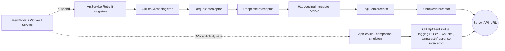
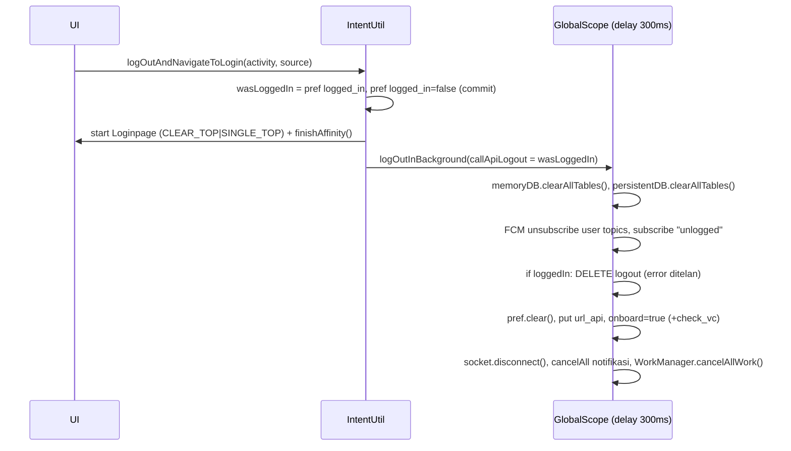

# Infrastruktur: Build, API, Data Lokal & Proses Latar

Dokumen ini adalah spesifikasi **infrastruktur** aplikasi lama `android-portal` (versionName `2.1.40`, versionCode `79`) yang harus dipahami sebelum membangun ulang fitur di `Diskola-App-New` (Compose + Hilt). Cakupannya: konfigurasi Gradle & dependency (beserta padanan di stack baru), `AndroidManifest.xml`, lapisan jaringan (Retrofit/OkHttp, interceptor, format respons, paging, **indeks lengkap 314 + 3 endpoint**), Dependency Injection (Dagger 2 → Hilt), data lokal (Room & SharedPreferences, termasuk apa yang dihapus saat logout), proses latar (Worker, Service, socket, FCM, feature gate, App init), utilitas bersama, serta resource & tema. Semua rujukan `path:baris` relatif terhadap root `android-portal/` (kode: `app/src/main/java/id/diskola/app/…`, disingkat `…/app/` hanya bila jelas). Detail perilaku per fitur (login, AKM, presensi, routing notifikasi, dsb.) ditulis di dokumen fitur masing-masing; di sini cukup kontrak lintas-fitur.

> Konvensi: `J/` = `app/src/main/java/id/diskola/app/`, `R/` = `app/src/main/res/`. ❓ = perlu keputusan user (mengubah perilaku). ⚠️ = bug/risiko di kode lama.

## Daftar isi

1. [Build & konfigurasi](#1-build--konfigurasi)
2. [Manifest](#2-manifest)
3. [Networking](#3-networking)
4. [Dependency Injection](#4-dependency-injection)
5. [Data lokal](#5-data-lokal)
6. [Proses latar belakang](#6-proses-latar-belakang)
7. [Utilitas bersama](#7-utilitas-bersama)
8. [Resource & tema](#8-resource--tema)
9. [Pemetaan teknologi lama → baru & anti-pattern](#9-pemetaan-teknologi-lama--baru--anti-pattern)
10. [Selisih dengan dokumen lama](#10-selisih-dengan-dokumen-lama)
11. [Checklist paritas](#11-checklist-paritas)

---

## 1. Build & konfigurasi

### 1.1 Toolchain

| Item | Lama (`android-portal`) | Rujukan | Baru (`Diskola-App-New`) |
|---|---|---|---|
| Gradle wrapper | 8.7 | `gradle/wrapper/gradle-wrapper.properties` | (lihat wrapper project baru) |
| AGP | 8.5.2 | `build.gradle:10` | 8.8.2 (`libs.versions.toml` `agp`) |
| Kotlin | 1.9.24 (+ `kotlin-stdlib` eksplisit) | `build.gradle:3,11`, `app/build.gradle:124` | 2.1.0 + plugin Compose compiler |
| Plugin | `com.android.application`, `google-services`, `kotlin-android`, `navigation.safeargs`, `kotlin-kapt`, `firebase.crashlytics`, `secrets-gradle-plugin`, `kotlin-parcelize` | `app/build.gradle:1-8` | android.application, kotlin.android, kapt, **ksp**, hilt, kotlin.serialization, crashlytics, google-services, compose.compiler (`app/build.gradle.kts:3-13`) |
| Repositori | google, mavenCentral, **jitpack** | `build.gradle:20-25` | — |
| JVM target | Java/Kotlin **1.8** | `app/build.gradle:105-112` | 11 |
| compile/target/min SDK | 36 / 36 / 27 | `app/build.gradle:12,32-33` | 36 / 36 / 27 |
| `gradle.properties` | `org.gradle.jvmargs=-Xmx3g`, `kotlin.daemon.jvmargs=-Xmx4g`, `android.enableJetifier=true`, `android.jetifier.ignorelist = moshi-1.13.0`, `android.enableResourceOptimizations=true`, `kapt.verbose=true`, `android.ndkVersion=28.0.12433566` | `gradle.properties` | — |
| Build features | `buildConfig`, `dataBinding`, `viewBinding` | `app/build.gradle:99-103` | `compose`, `buildConfig` |

### 1.2 applicationId, build type & `BuildConfig`

- `namespace`/`applicationId` = `id.diskola.app`; debug menambah `applicationIdSuffix ".debug"` → `id.diskola.app.debug` (`app/build.gradle:11,31,82`).
- Nama APK: `${applicationId}-${versionName}.apk` (`app/build.gradle:40-45`).
- **Tidak ada product flavor.** Ada source set `app/src/staging/res/values/strings.xml` (`app_name` = "Diskola Staging") tetapi **tidak ada build type `staging`** → source set mati.
- `local.properties` dibaca manual (`app/build.gradle:16-19`). Nilai `buildConfigField` diambil apa adanya → nilai di `local.properties` **harus sudah berkutip** (`"\"…\""`); default `''` membuat build gagal bila key hilang.

| `BuildConfig` field | release ← key `local.properties` | debug ← key `local.properties` | Dipakai di |
|---|---|---|---|
| `API_URL` | `API_URL_PROD` | `API_URL_DEV` | base URL Retrofit `J/di/modules/ApiModules.kt:33`, `J/api/ApiService2.kt:36`; disalin ke pref `url_api` saat logout `J/utils/IntentUtil.kt:589` |
| `ASSETS_URL` | `ASSETS_URL_PROD` | `ASSETS_URL_DEV` | prefix path aset relatif: `J/worker/AkmDownloader.kt:94,114,171,184,197`, `J/pages/homework/HomeWorkModels.kt:247` |
| `CLIENT_ID` | `CLIENT_ID_PROD` | `CLIENT_ID_DEV` | Google Sign-In `requestIdToken`/`requestServerAuthCode` `J/pages/login/LoginForm.kt:149,152` (layar lain memakai `R.string.default_web_client_id` hasil plugin google-services: `J/pages/home/HomePage.kt:94`, `J/pages/akun/AkunPage2.kt:59`) |
| `SOCKET_URL` | **`SOCKET_URL`** (bukan `_PROD`) | `SOCKET_URL_DEV` | `J/socket/SocketClass.kt:50` |
| `PORTAL_URL` | `PORTAL_URL_PROD` | `PORTAL_URL_DEV` | **tidak dipakai** — `J/feature/FeaturePortalUrl.kt:10-26` meng-hardcode URL portal |
| manifestPlaceholder `MAPS_API_KEY` | `MAPS_API_KEY` | sama | `R/../AndroidManifest.xml:76-78` (`com.google.android.geo.API_KEY`) |

Key lain di `local.properties` yang ada tapi tidak dipakai Gradle: `API_URL_STAGING` (baris dikomentari juga ada untuk `API_URL_DEV` alternatif).

Release: `minifyEnabled true`, `debuggable false`, `proguard-android-optimize.txt` + `proguard-rules.pro` (`app/build.gradle:71-74`). Debug: `minifyEnabled false`, `debuggable true` (`:83-84`).

### 1.3 Signing

`signingConfigs.config` membaca key `signing_keyAlias`, `signing_keyPassword`, `signing_storeFile`, `signing_storePassword` dari `local.properties` (`app/build.gradle:21-28`) dan dipasang di `defaultConfig` (**debug & release sama-sama ditandatangani key rilis**, `:36`). File `keystore.jks` ada di root dan `app/`.

**Keputusan kritis (update in-place):** project baru memakai `applicationId "id.diskola.app"` yang sama tetapi `versionCode = 1` dan **tanpa `signingConfigs`** (`Diskola-App-New/app/build.gradle.kts:27-31`). Untuk dirilis sebagai *update* aplikasi lama di Play Store, versionCode harus **> 79** dan ditandatangani key yang sama. Data lama di perangkat: SharedPreferences (`id.diskola.app.xml`) **✅ diputuskan (30-09-2026, `docs/FLOW_QUESTIONS.md` bagian C/Q9): dibaca ulang / migrasi**, siswa tetap login setelah update. Untuk `diskola.db` v46 & file AKM di `filesDir`: **❓ masih belum diputuskan** (`docs/FLOW_QUESTIONS.md` bagian B) — jangan diasumsikan dibaca ulang atau dihapus, tanyakan lagi mendekati rilis. Lihat §5.6.

### 1.4 ABI filter & 16 KB page size

- `ndk.abiFilters "armeabi-v7a", "arm64-v8a"` — x86/x86_64 dibuang agar tidak membawa `.so` yang tidak align 16 KB (`app/build.gradle:48-51`).
- `externalNativeBuild.cmake.cppFlags "-Wl,-z,max-page-size=16384"` (`:52-56`) — tidak ada CMakeLists, jadi efektif no-op.
- `packaging.jniLibs.excludes` membuang `librsjni_androidx.so`, `librsjni.so`, `libRSSupport.so` (RenderScript) (`:60-68`).
- `bundle.abi.enableSplit = false` → AAB tidak dipecah per ABI (`:93-97`).

Catatan migrasi: pertahankan `abiFilters` yang sama; setiap library ber-`.so` baru (ML Kit, CameraX, dsb.) wajib dicek alignment 16 KB.

### 1.5 ProGuard/R8 (`app/proguard-rules.pro`)

| Blok | Baris | Isi penting |
|---|---|---|
| Glide | 23-34 | keep `GlideModule`/`AppGlideModule`, `ImageHeaderParser`, `ParcelFileDescriptorRewinder` |
| Google Sign-In / GMS | 36-49 | keep **seluruh** `com.google.android.gms.**`, `com.google.api.client.**`, `com.google.api.services.**` (sangat lebar) |
| Gson | 51-56 | keep `com.google.gson.**`, `TypeToken`, `Signature`, `*Annotation*` |
| OkHttp | 58-60, 123-134 | keep `okhttp3.**`, publicsuffix, dontwarn conscrypt/bouncycastle/openjsse |
| Dagger | 62-65 | keep `dagger.**`, `javax.inject.**` |
| Retrofit | 67-118 | aturan resmi R8 full-mode (keep interface ber-anotasi `@retrofit2.http.*`, `Continuation`, `retrofit2.Response`) |

Model respons dilindungi lewat anotasi `@Keep` + `@JsonClass(generateAdapter = true)` di tiap model (mis. `J/viewmodels/GeneralViewModel.kt:64-89`), bukan lewat aturan ProGuard.

### 1.6 Firebase (`app/google-services.json`)

File ada di `app/google-services.json` (juga sudah ada di `Diskola-App-New/app/`). Isinya file multi-klien (19 klien Android dalam satu project Firebase) yang mencakup `id.diskola.app` dan `id.diskola.app.debug`. Isi tidak disalin di sini. Layanan yang dipakai: Messaging (FCM), Crashlytics, Analytics, In-App Messaging, Storage (upload log), Installations; Remote Config & Auth ada di dependency tapi tidak dipakai (§1.7).

### 1.7 Dependency lengkap → rekomendasi stack Compose

Legenda status di project baru: ✅ = sudah ada di `app/build.gradle.kts`; 📦 = hanya ada di `libs.versions.toml` (belum dipakai); ❌ = belum ada.

| Baris (`app/build.gradle`) | Dependency & versi | Dipakai untuk (lama) | Status baru | Rekomendasi |
|---|---|---|---|---|
| 120 | `fileTree(libs/*.jar)` | tidak ada folder `libs/` | — | Buang |
| 121 | `firebase-inappmessaging-display-ktx:21.0.0` | render pesan FIAM (listener `onFiamClick` di `J/pages/BasePage.kt:40-46`) | ❌ (baru hanya `firebase-inappmessaging` inti) | Tambah `firebase-inappmessaging-display` via BoM bila FIAM dipertahankan |
| 124 | `kotlin-stdlib:1.9.24` | stdlib | implisit | Buang (otomatis dari plugin) |
| 125 | `firebase-auth:23.0.0` | **tidak ada import** | ✅ 24.0.0 | Buang kecuali ada rencana Firebase Auth |
| 126, 357 | `androidx.activity:activity(-ktx):1.10.1` | Activity Result API | ✅ `activity`, `activity-compose` | Pertahankan (`activity-compose`) |
| 127 | kapt `com.android.databinding:compiler:3.1.4` | DataBinding (sangat usang) | — | Buang (Compose) |
| 130 | `kotlinpoet:1.14.2` | tidak dipakai | — | Buang |
| 133 | `kotlinx-metadata-jvm:0.6.2` | tidak dipakai | — | Buang |
| 136-138 | `moshi:1.15.1`, `moshi-kotlin:1.14.0` (**versi campur**), kapt `moshi-kotlin-codegen:1.15.1` | JSON utama Retrofit + adapter khusus (§3.7) | ✅ moshi 1.15.1 + codegen via **ksp** | Pertahankan Moshi **atau** pindah `kotlinx.serialization` (📦/✅ ada) — pilih satu (rules-global #4) |
| 141-143 | `kotlinx-coroutines-core:1.4.1` + `-android:1.7.3` (**versi campur**) | coroutine | transitif | Tambah eksplisit `kotlinx-coroutines-android` versi tunggal |
| 146 | `core-ktx:1.13.1` | — | ✅ 1.16.0 | Pertahankan |
| 147 | `appcompat:1.7.0` | Activity/AlertDialog | ✅ 1.7.1 | Hanya perlu untuk Activity pihak ketiga (uCrop/zxing); boleh dibuang bila semua Compose |
| 148 | `multidex:2.0.1` | `App : MultiDexApplication` (`J/App.kt:20`) | ✅ | Buang (minSdk 27 sudah native multidex) |
| 149 | `legacy-support-v4:1.0.0` | — | — | Buang |
| 152 | `documentfile:1.0.1` | tidak dipakai | — | Buang |
| 155 | `recyclerview:1.3.2` | semua list | — | `LazyColumn/LazyRow/LazyVerticalGrid` |
| 156 | `swiperefreshlayout:1.1.0` | ±87 file | — | `PullToRefreshBox` (Material3) |
| 157 | `constraintlayout:2.1.4` | layout XML | 📦 2.2.1 | Buang (opsional `constraintlayout-compose`) |
| 161-164 | `lifecycle-runtime-ktx`/`livedata-ktx`/`lifecycle-service` 2.8.6, `lifecycle-extensions:2.2.0` (deprecated) | LiveData, `LifecycleService` (`J/pages/akm/AkmViolationReportingService.kt`) | ✅ runtime-ktx 2.9.2, viewmodel-compose, runtime-compose; ❌ `lifecycle-service` | LiveData → `StateFlow`; **tambah `lifecycle-service`** untuk service AKM; buang `extensions` |
| 166 | `paging-runtime-ktx:2.1.2` | ±96 file (`PagedList`, `DataSource.Factory`, `toLiveData`, `BoundaryCallback`) | ❌ | Paging 3 (`paging-runtime` + `paging-compose` + `RemoteMediator`) atau paging manual `LazyColumn` (§3.10) |
| 176-179 | `room-runtime/ktx:2.6.1`, **annotationProcessor + kapt** compiler | Room | ✅ 2.7.2 + ksp | Pertahankan (ksp saja) |
| 182 | `firebase-bom:26.1.1` | BoM | ✅ 32.7.1 | Naikkan BoM agar `firebase-messaging` ≥ 24.1.2 (lama mengunci 24.1.2 eksplisit, `:186-188`; BoM 32.7.1 kemungkinan memberi 23.x — belum terverifikasi) |
| 183 | `firebase-config-ktx` | kode Remote Config dikomentari (`J/App.kt:108-161`) | ✅ | Buang bila tidak dipakai |
| 184 | `firebase-analytics-ktx` | 1 file | ✅ | Pertahankan |
| 185 | `firebase-crashlytics` | otomatis | ✅ | Pertahankan |
| 188 | `firebase-messaging:24.1.2` | FCM (`J/services/NotifService.kt`) | ✅ (versi BoM) | Pertahankan |
| 189 | `firebase-inappmessaging` | FIAM | ✅ | Pertahankan (+display) |
| 190 | `firebase-storage-ktx` | upload log (`J/worker/LogUploader.kt:33-39`) | ✅ | Pertahankan hanya bila upload log dipertahankan (❓ §3.5) |
| 194-195 | `play:feature-delivery(-ktx):2.1.0` | **tidak dipakai** (0 `splitinstall`) | — | Buang |
| 196-197 | `play:review(-ktx):2.0.1` | `J/utils/PlayInAppReview.kt:9-20` | ❌ | Tambah `review-ktx` |
| 198-199 | `play:app-update(-ktx):2.1.0` | `J/App.kt:71-93` (alur mati, §6.8) | ✅ | Pertahankan (❓ aktifkan atau tidak) |
| 201 | `play-services-location:21.3.0` | fused location + geofencing presensi/magang | ✅ | Pertahankan |
| 202 | `play-services-maps:19.0.0` | peta (12 file) | ✅ 19.2.0 | + `maps-compose` ❌ |
| 204 | `play-services-auth:20.5.0` | Google Sign-In (7 file) | ✅ 21.4.0 | Credential Manager (✅ `credentials`, `googleid`); `play-services-auth` hanya bila masih butuh API lama |
| 205 | `play-services-identity:18.1.0` | tidak dipakai | ✅ | Buang |
| 210-211 | `navigation-fragment/ui-ktx:2.8.1` + safeargs | 44 nav graph XML (`R/navigation/`) | 📦 | `navigation-compose` 2.9.6 ✅ type-safe `@Serializable` |
| 215-216 | `work-runtime(-ktx):2.9.1` | Worker (§6.1) | ✅ 2.10.2 + `hilt-work` ✅ | Pertahankan; pakai `HiltWorkerFactory` |
| 219 | `material:1.12.0` (MDC) | tema XML, BottomSheet, Chip, dsb. | ✅ | Material3 Compose ✅; MDC hanya untuk tema Activity interop |
| 222 | `wdullaer:materialdatetimepicker:4.2.3` | 7 file | — | `DatePicker`/`TimePicker` Material3 |
| 225 | `getbase:floatingactionbutton:1.10.1` | FAB menu (3 file) | — | `FloatingActionButton`/`SmallFloatingActionButton` |
| 228 | `krokyze:ucropnedit:2.2.6` (uCrop) | crop foto profil `J/pages/akun/ProfilePicturePage.kt:143-144` | ❌ | uCrop via `rememberLauncherForActivityResult` atau cropper Compose |
| 232 | `chochanaresh:filepicker:0.2.5` | `J/utils/IntentUtil.kt:640-655` | ❌ | `PickVisualMedia`/`PickMultipleVisualMedia` + `OpenMultipleDocuments` |
| 247 | `otaliastudios:cameraview:2.7.2` (`api`) | kamera kustom (CameraPage, offsite, jurnal) | ❌ | CameraX (`camera-camera2`, `camera-lifecycle`, `camera-view`/`camera-compose`) |
| 252-253 | `sdp-android`/`ssp-android:1.0.6` | seluruh dimensi XML | 📦 1.1.0 | Token `dp/sp` Compose (`ui/theme/Spacing.kt`, `Adaptive.kt` sudah ada) |
| 257-258 | `dagger:2.52` + compiler | DI | 📦 | Hilt ✅ 2.56.2; hapus dagger dari catalog |
| 272-273 | `chucker:3.5.2` / `-no-op` | inspeksi HTTP debug | ✅ | Pertahankan |
| 276 | `timber:4.7.1` | log | ✅ 5.0.1 | Pertahankan (plant hanya di debug, ❓ §3.5) |
| 283-284 | `glide:4.12.0` + kapt compiler | gambar (`J/GlideModule.kt`, `J/utils/BindingAdapters.kt`, `GlideApp` di `J/utils/NotifUtil.kt:13`) | ✅ glide 4.15.1 + compiler **4.13.1 (tidak cocok)** | Coil (`coil-compose` ✅); buang Glide setelah semua pindah |
| 287 | `chrisbanes:PhotoView:2.3.0` | zoom gambar (12 file) | ❌ | Zoom Compose (`Modifier.transformable`/library zoomable) |
| 288 | `okaybroda:ImageZoom:1.1.0` | pinch-zoom (4 file) | ❌ | Sama seperti di atas |
| 294 | `karumi:dexter:6.2.2` | runtime permission (16 file) | ✅ (sebaiknya dibuang) | `accompanist-permissions` ✅ / `RequestPermission` contract |
| 297-300 | `okhttp:4.11.0`, `logging-interceptor`, `retrofit:2.9.0`, `converter-moshi` | jaringan | ✅ 4.12 / 2.11 | Pertahankan |
| 304 | `tbuonomo:dotsindicator:4.3` | indikator pager (4 file) | ❌ | `HorizontalPager` + indikator kustom |
| 317 | `osmdroid-android:6.1.8` | peta OSM di `R/layout/presensi_masuk_page.xml` | ❌ | ❓ `maps-compose` atau osmdroid via `AndroidView` |
| 323 | `socket.io-client:2.0.0` (exclude `org.json`) | chat realtime (`J/socket/SocketClass.kt`) | ❌ | Pertahankan library (Hilt singleton) |
| 328 | `vanniktech:emoji-google:0.7.0` | emoji chat (`J/App.kt:54`, ChatPage) | ❌ | `androidx.emoji2` / picker Compose |
| 331 | `jsoup:1.13.1` | link preview (`J/utils/LinkPreview.kt:48`) | ❌ | Pertahankan (versi terbaru) bila link preview feed dipertahankan |
| 335 | `frhnfrq:MathView:1.2` | **tidak dipakai** | — | Buang (JLatexMath ✅ menggantikan) |
| 342 | `flexbox:3.0.0` | 4 file (chip/tag) | ❌ | `FlowRow` |
| 345-346 | `zxing-android-embedded:4.2.0` (transitive=false) + `zxing:core:3.4.1` | scan QR (Klaspay QR pay, presensi QR, topup) & generate QR | ❌ | Scan: CameraX + ML Kit Barcode; generate: `zxing:core` |
| 348 | `owner-java8:1.0.12` | tidak dipakai | — | Buang |
| 352 | `skydoves:powerspinner:1.2.7` | 2 file | — | `ExposedDropdownMenuBox` |
| 353 | `relex:circleindicator:2.1.6` | 2 file | — | indikator pager kustom |
| 355-356 | `gson:2.8.9` + `converter-gson` | `J/db/DbConverter.kt`, converter Retrofit kedua | ✅ gson 2.10.1 | Buang (satu lib JSON) |
| 360 | `jlatexmath-android:0.2.0` | render LaTeX soal (`J/utils/HtmlMathRenderer.kt`) | ✅ | Pertahankan |
| 337-339, 363-365 | junit, androidx test, espresso, uiautomator | test | ✅ sebagian | — |

Yang **perlu ditambahkan** ke project baru untuk paritas: `lifecycle-service`, `review-ktx`, Paging 3 (opsional), CameraX + ML Kit barcode, `zxing:core`, socket.io-client, emoji2, jsoup, uCrop (atau cropper lain), `maps-compose`, `firebase-inappmessaging-display`, `core-splashscreen` (pengganti `LoginTheme` splash), plugin `kotlin-parcelize` (📦 belum di-apply) bila memakai `@Parcelize`.

---

## 2. Manifest

Sumber: `app/src/main/AndroidManifest.xml` (738 baris).

### 2.1 Permission

| Permission | Baris | Dipakai untuk (fitur) |
|---|---|---|
| `READ_CONTACTS` | 6 | pilih nomor dari kontak di PPOB Pulsa (`J/pages/ppob/pulsa/PulsaPage.kt`), dengan disclosure pref `contacts_disclosure_accepted` (`J/pages/BasePage.kt:78-83`) |
| `POST_NOTIFICATIONS` | 7 | diminta di HomePage/LoginSso/verifikasi; `NotifService` diam bila tidak diberi (`J/services/NotifService.kt:223-230`) |
| `INTERNET`, `ACCESS_NETWORK_STATE` | 8-9 | API, cek koneksi (`J/utils/Utils.kt:19-41`) |
| `RECORD_AUDIO` | 10 | diminta bersama kamera di `openCameraFragment` (`J/utils/IntentUtil.kt:809-813`) |
| `CAMERA` | 11 | foto profil, QR scan, presensi dinas luar, foto jurnal KBM, kamera post |
| `ACCESS_FINE/COARSE_LOCATION` | 12-13 | presensi (masuk/kelas/dinas luar), jurnal, agenda mingguan, magang, onboarding |
| `ACCESS_BACKGROUND_LOCATION` | 14 | geofence presensi & magang (`PresensiMasukPage`, `PresensiAbsenPage`, `MagangAttendPage`) |
| `HIDE_OVERLAY_WINDOWS` | 21 | `setHideOverlayWindows(true)` di halaman ujian AKM (komentar `:16-20`) |
| `FOREGROUND_SERVICE`, `FOREGROUND_SERVICE_DATA_SYNC` | 24-25 | `AkmViolationReportingService` |
| `DETECT_SCREEN_CAPTURE` | 33 | deteksi screenshot ujian (Android 14+) `J/pages/akm/AkmViolationDetector.kt` |
| `READ_MEDIA_IMAGES/VIDEO`, `READ/WRITE_EXTERNAL_STORAGE`, `MANAGE_EXTERNAL_STORAGE` | 36-40 | **dihapus** (`tools:node="remove"`) — app memakai Photo Picker/SAF |
| `<uses-feature camera required=false>` | 42-44 | — |
| `<queries>` `IMAGE_CAPTURE` | 46-50 | kamera sistem. ⚠️ Tidak ada `<queries>` untuk `mailto:` padahal `openEmail` memakai `queryIntentActivities` (`J/utils/IntentUtil.kt:123-197`) → di Android 11+ kemungkinan daftar kosong (belum terverifikasi) |

### 2.2 Komponen

`<application>`: `name=".App"`, `allowBackup="true"` (⚠️ token & flag login ikut ter-backup), `theme=@style/AppTheme`, `supportsRtl=true` (`:52-59`). Tidak ada `networkSecurityConfig`/`usesCleartextTraffic`/`dataExtractionRules`.

| Jenis | Jumlah / nama | Baris |
|---|---|---|
| Activity | **162** (termasuk `com.canhub.cropper.CropImageActivity` pihak ketiga — tidak ada import `com.canhub` di kode, kemungkinan sisa) | 60-668 |
| Service | `.services.NotifService` (intent-filter `com.google.firebase.MESSAGING_EVENT`), `.services.ExamStopService`, `.services.DirectReplyChat` (IntentService), `.pages.akm.CountDownService`, `.pages.akm.AkmViolationReportingService` (`foregroundServiceType="dataSync"`) | 674-687, 723, 731-734 |
| Receiver | `.pages.presensi.GeofenceBroadcastReceiver`, `.pages.magang.GeofenceBroadcastReceiver` (tidak exported default) | 720-721 |
| Provider | `.utils.OnKlasFileProvider` authority `${applicationId}`; `androidx.core.content.FileProvider` authority `${applicationId}.provider` — keduanya `@xml/file_paths` | 699-717 |

`R/xml/file_paths.xml`: `files-path name="files" path="."`, `external-files-path name="images" path="."`, `external-cache-path name="cache" path="."`. ⚠️ Dua authority dipakai tidak konsisten: kamera Activity memakai `"${packageName}.provider"` (`J/utils/IntentUtil.kt:252-256`), sedangkan `openFile` & `openCameraFragment` memakai `BuildConfig.APPLICATION_ID` (`:443`, `:842-846`). Di app baru cukup satu FileProvider — tetapi jika URI lama tersimpan (mis. di Room) perlu dicek.

### 2.3 Activity dengan atribut khusus

| Activity | Atribut | Baris |
|---|---|---|
| `.pages.login.Loginpage` | `exported=true`, `resizeableActivity=false`, `theme=@style/LoginTheme` (window background `@drawable/splash_drawable`), `windowSoftInputMode=adjustResize`, intent-filter **MAIN + VIEW** + LAUNCHER dalam satu filter | 233-245 |
| `.pages.DeepLinkPage` | `exported=true`, `parentActivityName=HomePage`, App Links `autoVerify` (§2.4) | 246-273 |
| `.pages.pembayaran.qrscan.CaptureActivityPortrait` | `screenOrientation=sensorPortrait`, `stateNotNeeded`, `theme=@style/zxing_CaptureTheme`, `stateAlwaysHidden` | 92-98 |
| `.pages.pembayaran.qrscan.QrScanActivity` | `portrait` | 99-102 |
| `.pages.presensi.PortraitCaptureActivity` | `portrait`, `zxing_CaptureTheme`, `tools:replace="android:theme"` (tanpa `exported`) | 664-668 |
| `.pages.presensi.PresensiOffsiteCameraPage`, `.pages.presensi.JournalCaptureCameraPage` | `portrait`, `AppTheme` | 416-426 |
| `.pages.akm.AkmExamPrimingPage` | `portrait` | 477-480 |
| `.pages.akm.AkmTakeResumePage`, `.pages.akm.AkmQuestionsPage` | `portrait`, `resizeableActivity=false`, `supportsPictureInPicture=false` | 481-495 |
| `com.canhub.cropper.CropImageActivity` | `theme=@style/AppThemeLightStatusBar` | 336-338 |
| `adjustResize` | Loginpage, CommentPage, SettingAkunPage, UploadMateriPage, AgendaMingguanCheckPage, PresensiAddIzinPage, PresensiOffsitePage, MagangAddIzinPage, CreateHomeworkPage, ConfirmPinPage, SetPinKlaspayPage, PulsaPage, ListrikPage, AirPage, InternetPage, GamePage, BpjsPage, SelectContactChatPage | lihat manifest |
| `adjustPan` | ChangePassPage, ResetPassPage, SettingContactPage, PartisipasiAmountPage | 339-354, 553-555 |
| `parentActivityName=HomePage` | DeepLinkPage, CommentPage, SppPaymentPage | 249, 281, 539 |

Tema `AppTheme` juga menaruh `android:screenOrientation=portrait` di style (`R/values/styles.xml:16`) — atribut ini tidak berlaku lewat tema (belum terverifikasi di runtime); orientasi potret efektif hanya untuk Activity yang menyatakan di manifest. ❓ App baru: kunci potret global (`screenOrientation` di satu `MainActivity`) atau hanya layar tertentu?

### 2.4 Intent-filter & deep link

`DeepLinkPage` (`:250-272`), `https` + `autoVerify`:

| Host | pathPrefix |
|---|---|
| `portal.diskola.id`, `dev.portal.diskola.id` | `/verify-email` |
| `api.diskola.id`, `dev.api.diskola.id` | `/api/payment/reset-pin/token` |

Launcher: `Loginpage` (`:239-244`). Komentar menunjukkan share-target `CreatePostPage`/`UploadEbookPage` (ACTION_SEND) sudah dinonaktifkan (`:283-308`).

### 2.5 meta-data

| meta-data | Nilai | Baris |
|---|---|---|
| `com.google.android.geo.API_KEY` | `${MAPS_API_KEY}` | 76-78 |
| `preloaded_fonts` | `@array/preloaded_fonts` (= `@font/lato`) | 670-672 |
| `com.google.firebase.messaging.default_notification_icon` | `@drawable/ic_logo_notif` | 689-691 |
| `…default_notification_color` | `@color/colorPrimary` (#08A497) | 692-694 |
| `…default_notification_channel_id` | `@string/fcm_default_channel_id` = `diskola_fcm` | 695-697 |

Catatan migrasi: App Compose idealnya satu `MainActivity` (+ Activity terpisah hanya untuk ujian AKM terkunci, kamera/QR bila perlu). Deep link dipindah ke `navDeepLink` pada route type-safe; `autoVerify` + `assetlinks.json` tetap. Bila `HiltWorkerFactory` dipakai, tambahkan `<provider androidx.startup…>` dengan `tools:node="remove"` untuk `WorkManagerInitializer`.

---

## 3. Networking

### 3.1 Arsitektur klien



- `ApiService` dibuat di `ApiModules.provideApiService` (`J/di/modules/ApiModules.kt:28-39`): `baseUrl(BuildConfig.API_URL)`, `CallAdapter.Factory` kustom, **`MoshiConverterFactory` lalu `GsonConverterFactory`** (Gson praktis tidak terjangkau karena Moshi menangani semua tipe — belum terverifikasi per tipe).
- `ApiService2` (`J/api/ApiService2.kt:16-55`): Retrofit terpisah, dibuat lazy di companion object, `MoshiConverterFactory.create()` **dua kali** tanpa instance Moshi kustom, OkHttp baru (logging BODY + Chucker). Header `Authorization` dikirim manual `"Bearer ${pref.getString("user_token")}"` (`J/pages/pembayaran/qrscan/QrScanActivity.kt:140-143`). Tidak ada cek offline / pemetaan error. Body berisi `pin` → ⚠️ ter-log penuh di logcat (juga release).

### 3.2 `RequestInterceptor` (`J/api/RequestInterceptor.kt`)

| Perilaku | Baris |
|---|---|
| Jika `Utils.isInternetAvailable()` false → lempar `ApiException("Terjadi gangguan pada koneksi internet Anda, silahkan ulangi beberapa saat lagi", 0)` **sebelum** request (responseCode `0` = sentinel offline) | 12-17 |
| Header `Accept: application/json` | 21 |
| Header `Authorization: Bearer <pref user_token>` — selalu ditambahkan, walau token kosong (menjadi `"Bearer "`) | 23 |
| ETag/`If-none-match` dikomentari | 22 |

**Tidak ada** header versi app, device id, client id, bahasa, atau User-Agent kustom. Header khusus hanya per-endpoint: `X-Device-Fingerprint` (= `Settings.Secure.ANDROID_ID`, `J/utils/DeviceFingerprint.kt:16-21`) di `checkPasswordUjianSchool` & `uploadJawabanUjianSchool` (`J/api/ApiService.kt:938,965`); `Accept: */*` pada `download` (`:83`).

`isInternetAvailable` hanya cek `NET_CAPABILITY_INTERNET` (bukan `VALIDATED`) — sengaja tidak diperketat (`J/utils/Utils.kt:19-41`).

### 3.3 `ResponseInterceptor` & `ApiException` (`J/api/ResponseInterceptor.kt`)

```mermaid
flowchart TD
  A[response] --> B{kode 2xx?}
  B -- ya --> C{JSON punya key status<br/>DAN status as String != 'success'?}
  C -- ya --> E1[throw ApiException(pesan, kode 2xx, errorTypes)]
  C -- tidak --> OK[teruskan response]
  B -- tidak --> D{503 / 504?}
  D -- ya --> DLG[coba tampilkan dialog 'Perbaikan Sistem'<br/>⚠️ praktis gagal & ditelan catch]
  D --> F[parse message/error/errors/data/error_code]
  DLG --> F
  F --> G{401, 403, 500?}
  G -- ya --> PASS[kembalikan response apa adanya<br/>→ Retrofit melempar HttpException]
  G -- tidak --> H[baca Retry-After → throw ApiException(pesan, kode, errorTypes, data, retryAfter, errorCode)]
```

Detail:
- Pesan backend: `resolveBackendMessage` → `"$message. $error"` bila keduanya ada, else salah satu, else fallback (`:39-51`). Fallback 2xx = pesan koneksi di atas; fallback non-2xx = `"Mohon maaf, terjadi kesalahan"` (`:140`).
- 2xx: bila root JSON punya key `status` dan nilainya **bukan String `"success"`** (termasuk boolean/angka) → error (`:83-88`). `errorTypes` = key dari objek `errors` (`:77-82`). Respons non-JSON/array → map kosong → lolos.
- 503/504: membuat `AlertDialog.Builder(context)` dengan **application context dari thread OkHttp**, layout `DialogActivateKlaspayBinding`, judul `"Perbaikan Sistem"`, pesan `"Kami sedang melakukan perbaikan sistem untuk meningkatkan layanan kami kepada Anda. Kami akan segera kembali."`, tombol `"OK"` (`:92-112`). ⚠️ Dengan app context + non-main thread, dialog hampir pasti gagal dan hanya tercatat `Timber.e("failed to open maintenance dialog…")` (belum terverifikasi di perangkat). ❓ App baru: tampilkan dialog maintenance sungguhan (perilaku berubah) atau tetap hanya pesan error?
- 401/403/500 **tidak dilempar sebagai `ApiException`** (`:145-147`) → pemanggil menerima `retrofit2.HttpException`. **Tidak ada refresh token, tidak ada force-logout global.** `GlobalErrorBus` (`J/utils/GlobalErrorBus.kt:5-13`) di-import tapi tidak pernah di-emit/di-collect (kode mati).
- 429: `Retry-After` (detik) → `ApiException.retryAfterSeconds` (`:149-153`, `:171-172`).
- `error_code` top-level (mis. `"DEVICE_CONFLICT"` untuk 409 single-device-login) → `ApiException.errorCode` (`:133-137`, `:173-174`).
- `ApiException(message, responseCode, errorTypes, data, retryAfterSeconds, errorCode) : IOException` (`:166-175`) — karena `IOException`, coroutine yang menangkap `Exception` juga menangkapnya.

### 3.4 Penanganan sesi (401 / perangkat lain)

Satu-satunya pemeriksaan sesi terpusat: `Fragment.verifyCurrentUserSession()` (`J/pages/SessionGuard.kt:18-60`), dipanggil dari `AkunPage2` (`:351`), `PembelajaranPage` (`:113`), `PembayaranPage` (`:450`):
- `GET mobile/app/authentication/current-user`; bila `single_device_login_enabled && device_id != null && device_id != ANDROID_ID` → dialog judul `"Perangkat Lain Terdeteksi"`, deskripsi `"Akun Anda sedang aktif di perangkat lain. Silakan logout dari perangkat tersebut terlebih dahulu."`, catatan `"Catatan: Silahkan hubungi admin sekolah untuk menjalankan reset perangkat pengguna"`, tombol `"Mengerti"` → `logOutAndNavigateToLogin` (`:23-39`).
- `HttpException` 401 → dialog `"Sesi Berakhir"` / `"Sesi Anda telah berakhir. Silakan login kembali."` / tombol `"Masuk Kembali"` → logout (`:41-53`). Error lain ditelan.
- Di luar itu, 401 ditangani per layar (mis. toast `"Sesi kadaluarsa. Silakan login ulang."` di `J/pages/pembayaran/spp/SppViewModel.kt:50,147`, `J/pages/partisipasi/PartisipasiViewModel.kt:127`).

**✅ Diputuskan (30-09-2026, `docs/FLOW_QUESTIONS.md` bagian C/Q6):** project baru **tetap** memasang
penanganan 401 **terpusat** (bukan ditiru per-layar seperti di atas) — arah `ResponseInterceptor`
(`Diskola-App-New/…/apiservice/ResponseInterceptor.kt:46-67`) sudah benar. Yang **wajib diperbaiki**:
logout yang dipicunya harus lewat satu fungsi logout yang mengecek dulu blokir ujian AKM (unfinished
**atau** FINISHED-belum-terunggah, dokumen 06 §15/§23.3#2) sebelum `clearAllTables()` — saat ini tidak
ada pengecekan itu sama sekali (§5.6 & `02a` R10).

### 3.5 `LogFileInterceptor` & log file

- Hanya aktif untuk method Retrofit bertanda `@LogFile` (dibaca via `Invocation` tag) (`J/api/LogFileInterceptor.kt:22-57`): menulis `requesting: [METHOD] url`, **semua header termasuk `Authorization`**, body request (bila UTF-8), lalu `response: [kode - METHOD] url` + body.
- Tulis ke `filesDir/<user_id>_<yyyy-MM-dd>.txt` dengan prefix `[HH:mm:ss]:` (`J/utils/Utils.kt:43-63`).
- Endpoint `@LogFile`: `downloadExam`, `answerExam`, `endExam`, `uploadJawabanAkm`, `uploadJawabanUjianSchool`, `uploadJawabanTryOut`, `reportAkmViolations`, `reportAkmErrorReport` (lihat §3.11).
- `LogUploader` (periodik 6 jam, §6.1) meng-upload file hari ini ke Firebase Storage `logs/<nama file>`.
- `HttpLoggingInterceptor` level **BODY** tanpa syarat build type, tag `API_REQUEST` (`J/di/modules/ApiModules.kt:77-82`), dan `Timber.plant(DebugTree())` juga di release (`J/App.kt:28-30`) → seluruh body (PIN, token) masuk logcat release. `SocketClass` bahkan me-log token (`J/socket/SocketClass.kt:54-55`).

**✅ Diputuskan (30-09-2026, 08 Q14):** matikan `HttpLoggingInterceptor` level BODY dan `Timber.DebugTree`
di build **release** (nyalakan hanya di debug); redaksi field `pin`/`Authorization` kalau logging tetap
dipertahankan di debug. Ini murni perbaikan keamanan, tidak mengubah perilaku yang terlihat pengguna.
Upload log ujian ke Firebase Storage (`LogUploader`) masih **belum diputuskan** apakah dipertahankan
tanpa header `Authorization`, atau dihentikan — jangan diasumsikan, tanyakan bila menyentuh bagian ini.

### 3.6 Timeout, cache, Chucker

| Item | Nilai | Rujukan |
|---|---|---|
| connect / read / write timeout | **120 s** / 120 s / 120 s | `J/di/modules/ApiModules.kt:112-114` |
| `@Timeout(value, unit)` per method | CallAdapter kustom mengatur `call.timeout()` (timeout total call); dipakai `payInvoice` `@Timeout(5, MINUTES)` | `ApiModules.kt:44-72`, `J/api/ApiService.kt:717` |
| HTTP cache | `Cache(cacheDir, 10 MB)` (efektif hanya bila server kirim header cache) | `ApiModules.kt:115` |
| Chucker | `ChuckerInterceptor.Builder(context).build()`; release pakai `library-no-op` | `ApiModules.kt:118-122`, `app/build.gradle:272-273` |
| Urutan interceptor | Request → Response → Logging → LogFile → Chucker (Chucker paling dalam) | `ApiModules.kt:107-111` |

❓ Project baru memakai 30/30/120 s (`Diskola-App-New/…/di/module/ApiModule.kt:147-149`) — upload jawaban/ujian di jaringan lambat bisa timeout lebih cepat daripada app lama.

### 3.7 Adapter Moshi/Gson khusus (`J/di/modules/MoshiModule.kt`)

| Adapter | Perilaku | Baris |
|---|---|---|
| `@ObjectToList` (field `List<T>`) | Jika JSON bukan array → dibungkus `listOf(obj)`; `toJson` tidak menulis apa-apa | 32-49, 94-107, 125-128 |
| `@NullToEmptyString` | `null` → `""` | 52-67, 109-111 |
| `@FlexibleToString` | angka → `toString()`, string apa adanya, null/lainnya → `""` (mis. `year` presensi by-year) | 70-90, 121-123 |
| `Moshi` di-provide `@Reusable` (bukan singleton) | — | 13-16 |
| Room `DbConverter` (Gson) | `Long?↔Date` (null → **`Date()` sekarang**, `Date?`→`0`), `List<String>↔JSON`, `Page?↔JSON` | `J/db/DbConverter.kt:13-49` |

Model tidak memakai `KotlinJsonAdapterFactory` (hanya codegen `@JsonClass(generateAdapter = true)`); default nilai di constructor data class = nilai fallback bila field hilang.

### 3.8 `ApiWrapper` (`J/utils/ApiWrapper.kt`)

Kelas pembungkus (tidak di-scope → instance baru tiap injeksi) yang menggabungkan panggilan API + tulis pref/Room:

| Fungsi | Efek samping | Baris |
|---|---|---|
| `checkAccount(nisn, schoolId)` | body `{nisn_nik, school_id}` (atau hanya `school_id`); `pref default_pass` (commit), perbarui JSON `user` & `school` | 47-71 |
| `checkEmail(email, name, photo, deviceId)` | SSO; membangun `UserTable(id=1…)` dan menulis `user`/`school` | 73-127 |
| `login(uuid, password, schoolId, deviceId)` | body `{uuid, password, device_id}`; tulis `user` | 129-145 |
| `loginSso(schoolUuid)` | body `{school_id}` | 147-158 |
| `uploadProfilePicture(file)` | multipart `file` `image/jpeg`; `user.user_avatar_image = file.path` (path lokal!) | 164-175 |
| `updateAccount`, `changePassword` (`default_pass=false`), `resetPass` (`{user_id, email}`) | — | 177-204 |
| feed: `createPost`, `createEbook`, `getFeedComment`, `getFeedLike`, `likeFeed`, `unlikeFeed`, `commentFeed`, `deleteFeed` | insert/hapus Room `feed` | 206-292 |
| `createTheory` | multipart `name, description, link, school_subject_id, grade?, school_classes_id?, school_major_id?, file?` | 294-341 |
| `startClass`/`attendClass` (`school_subject_schedule_id, lat, lng`), `endClass`, `leaveClass` | — | 386-414 |
| `downloadExam`, `startExam`, `answerExam` (jawaban dari **PersistentDB**) | — | 416-434 |
| `payInvoice`, `paySpp`, `paySppChannel` | — | 436-459 |
| `updateFcm()` / `updateFcmAsync()` | body `{uuid, user_fcm_token}` dari pref `user_uuid` & `token` | 463-483 |
| `addToCart` | memposting `addToCartResponse`/`errorString` LiveData | 485-496 |

⚠️ `userTable` di-parse sekali saat konstruksi (`:42-45`) dan `LiveData` state (`transactionIdInquiry`, `channelSelected`, `errorString`, `addToCartResponse`, `:38-40,485`) hidup di objek tanpa scope → state tidak terbagi antar-ViewModel.

### 3.9 `NetworkState`, `ConnectionLiveData`

- `NetworkState(state, msg)` dengan `NETWORK_LOADING=0` ("Loading data"), `NETWORK_SUCCESS=1` ("Success"), `NETWORK_FAILED=2` ("Failed to load") (`J/utils/NetworkState.kt:3-11`) — dipakai `PagingAdapter` untuk baris load-more/retry (`J/utils/PagingAdapter.kt:45-100`).
- `ConnectionLiveData(context) : LiveData<Boolean>` — daftar `registerDefaultNetworkCallback` saat ada observer, nilai = `INTERNET && VALIDATED`, `postValue` hanya bila berubah (`J/utils/ConnectionLiveData.kt:21-70`). Dipakai AKM (retry video, flush pelanggaran).
- Padanan Compose: `Flow<Boolean>` dari `callbackFlow` + `stateIn`, dikonsumsi `collectAsStateWithLifecycle()`; `UiState` sealed (`Loading/Success/Error`) menggantikan `NetworkState`.

### 3.10 Format respons standar & paging

- **Tidak ada envelope tunggal.** Pola umum: `{ "data": … }` (mis. `AnnouncementResponse(data: List<…>)` `J/pages/announcement/AnnouncementModels.kt:23-25`, `SekolahResponse(data)` `J/pages/login/LoginModels.kt:16`); auth menambah `meta.token`, `is_verified`, `rule_label`, `is_klaspay_activated`, `product_school`… (`LoginResponse`, `LoginModels.kt:285-293`). Error: `message`, `error`, `errors{field:[…]}`, `data`, `error_code`, dan opsional `status` (lihat §3.3).
- **Paging** ada tiga gaya:
  1. `take`/`skip` (offset) — sebagian besar modul sekolah (feed, pengumuman, materi, tugas, perpustakaan, AKM, KWU). Pola: Room `DataSource.Factory` → `toLiveData(pageSize, BoundaryCallback)`; `onZeroItemsLoaded` → fetch skip 0; `onItemAtEndLoaded` → fetch `skip = count(Room)` bila `nextDataAvailable && count >= pageSize` (contoh `J/pages/announcement/AnnouncementViewmodel.kt:26-72`, `pageSize = 20`). Ukuran halaman di codebase: 20 (23×), 10 (7×), 50 (2×), 1 (1×).
  2. `page`/`limit` atau `page`/`pageSize` — tagihan sekolah, notifikasi, riwayat Klaspay, izin (`J/api/ApiService.kt:104-108,698-715,815-819,627-638`).
  3. `limit`/`offset` / `limit`/`page` — lokasi (kota/kecamatan) `:1408-1420`.
- `nextDataAvailable` ditentukan fungsi `OnKlasDbUtil.processXxx` (return Boolean) yang juga menulis ke Room (`J/db/OnKlasDbUtil.kt`, mis. `processAnnouncementResponse` `:192`).
- Migrasi: Paging 3 `RemoteMediator` (Room sebagai source of truth) meniru BoundaryCallback 1:1; jaga guard dedup `isRun/prevStart` (`AnnouncementViewmodel.kt:48-71`) agar tidak fetch ganda (rules-global §1.2).

### 3.11 Indeks lengkap endpoint

`ApiService.kt` (1639 baris) memuat **314 endpoint aktif** (+ 24 anotasi yang dikomentari, hampir semuanya varian `mock/…`), ditambah **3 endpoint `ApiService2.kt`**. Kolom "Baris" = baris anotasi HTTP di `J/api/ApiService.kt`. Path param terlihat di kolom Path; "Q" = `@Query`, "Part" = `@Part`, "Body" = `@Body` (hampir semua bertipe `Any`/`Map`, lihat rules-global #5). Pengelompokan per fitur di bawah dibuat dari lokasi & path (komentar pengelompokan di file sumber banyak yang menyesatkan, mis. endpoint AKM berada di bawah komentar `// klaspay`).

#### Utilitas, konfigurasi app & kebijakan (6)

| Method | Path | Fungsi | Baris | Param / catatan | Return |
|---|---|---|---|---|---|
| GET | `@Url` (URL penuh) | `download` | 83 | Accept */* | `ResponseBody` |
| GET | `@Url` (URL penuh) | `downloadString` | 86 |  | `Any` |
| GET | `mobile/app/config/check-android-version` | `checkVersion` | 89 |  | `CheckVersionResponse` |
| GET | `mobile/app/check-feature-availability` | `checkFeatureAvailability` | 92 | Q: name | `FeatureAvailabilityResponse` |
| GET | `mobile/app/policy` | `policy` | 750 |  | `PolicyResponse` |
| GET | `mobile/app/accounts/user/{userId}/get-layout-about` | `about` | 753 |  | `PolicyResponse` |

#### Autentikasi, SSO, verifikasi & sesi perangkat (17)

| Method | Path | Fungsi | Baris | Param / catatan | Return |
|---|---|---|---|---|---|
| GET | `mobile/app/authentication/schools` | `listSekolah` | 97 | Q: take, skip, name | `SekolahResponse` |
| POST | `mobile/app/authentication/check-account` | `checkAccount` | 129 | Body | `UserResponse` |
| POST | `mobile/app/authentication/login-sso` | `checkEmail` | 133 | Body | `UserSsoResponseData` |
| GET | `mobile/app/authentication/login-sso/classes` | `getClasses` | 137 | Q: take, skip, name | `SchoolClassResponse` |
| GET | `mobile/app/roles` | `getRoles` | 144 | Q: take, skip, name | `UserRoleResponse` |
| POST | `mobile/app/authentication/login-account` | `login` | 151 | Body | `LoginResponse` |
| GET | `mobile/app/authentication/current-user` | `currentUser` | 154 |  | `CurrentUserResponse` |
| POST | `mobile/app/authentication/login-sso/school` | `loginSso` | 158 | Body | `LoginSsoResponse` |
| POST | `mobile/app/authentication/login-sso/check-nisn` | `checkNisn` | 162 | Body | `CheckNisnResponseData` |
| POST | `mobile/app/authentication/login-sso/verification` | `verifNisn` | 166 | Body | `LoginSsoResponse` |
| POST | `mobile/app/authentication/requesting-student` | `submitStudentApproval` | 169 | Body | `UserSsoResponseData` |
| POST | `mobile/app/authentication/requesting-teacher` | `submitTeacherApproval` | 172 | Body | `UserSsoResponseData` |
| GET | `mobile/gmail/verify/{google_token}` | `verifyEmail` | 175 |  | `Any` |
| DELETE | `logout` | `logout` | 178 |  | `Unit` |
| DELETE | `sessions/others` | `logoutOthers` | 181 |  | `Unit` |
| DELETE | `sessions/{id}` | `logoutDevice` | 184 |  | `Unit` |
| GET | `sessions` | `listSessions` | 187 | Q: limit, take, skip | `SessionResponse` |

#### Token FCM (2)

| Method | Path | Fungsi | Baris | Param / catatan | Return |
|---|---|---|---|---|---|
| POST | `sosmed/setting/setup-user-fcm` | `updateFcm` | 194 | Body | `Any` |
| POST | `sosmed/setting/setup-user-fcm` | `updateFcmAsync` | 197 | Body; non-suspend `Call`; path sama dgn `updateFcm` | `Call<String>` |

#### Notifikasi (inbox) (4)

| Method | Path | Fungsi | Baris | Param / catatan | Return |
|---|---|---|---|---|---|
| GET | `mobile/notification` | `getNotifications` | 104 | Q: wallet_id, page, limit | `NotificationResponse` |
| GET | `mobile/notification/{id}` | `getNotificationDetail` | 111 |  | `NotificationResponseData` |
| POST | `mobile/notification/{id}` | `markNotificationAsRead` | 116 | Body | `NotificationResponse` |
| GET | `mobile/notification/summary` | `getsummaryNotifications` | 123 | Q: wallet_id | `summaryNotificationsResponse` |

#### Akun, profil & pairing orang tua (13)

| Method | Path | Fungsi | Baris | Param / catatan | Return |
|---|---|---|---|---|---|
| GET | `mobile/app/accounts/user/{userId}` | `getUser` | 200 |  | `GetUserResp` |
| GET | `mobile/app/accounts/get-username/{username}` | `getUsername` | 203 |  | `FeedUsernameResponse` |
| GET | `mobile/app/accounts/user/{userId}/feed-post` | `getUserPost` | 206 | Q: take, skip | `FeedResponse` |
| GET | `mobile/app/accounts/user/{userId}/feed-image` | `getUserImage` | 213 | Q: take, skip | `FeedResponse` |
| GET | `mobile/app/accounts/user/{userId}/feed-ebook` | `getUserEbook` | 220 | Q: take, skip | `FeedResponse` |
| POST | `mobile/app/accounts/user/{userUuid}/change-avatar` | `uploadProfilePicture` | 228 | Part: file; multipart | `Any` |
| PUT | `mobile/app/accounts/user/{userUuid}/change-profile` | `updateAccount` | 234 | Body | `Any` |
| GET | `mobile/email/verify` | `sendEmailVerification` | 237 |  | `Any` |
| PUT | `mobile/app/accounts/user/{userUuid}/change-password` | `changePassword` | 240 | Body | `Any` |
| POST | `mobile/app/authentication/reset-password` | `resetPass` | 243 | Body | `Any` |
| GET | `mobile/app/accounts/search-username` | `searchUsername` | 246 | Q: params | `FeedUserResponse` |
| GET | `mobile/app/accounts/parent/pair-lists` | `pairingList` | 1474 |  | `listPairingResponse` |
| POST | `mobile/app/accounts/parent/accept-pair/{id}` | `acceptPairing` | 1477 |  | `acceptPairingResponse` |

#### Feed sosial sekolah & Jelajah (legacy) (14)

| Method | Path | Fungsi | Baris | Param / catatan | Return |
|---|---|---|---|---|---|
| POST | `mobile/app/schools/feed-posts` | `createPost` | 250 | Part: PartMap, file; multipart | `Any` |
| POST | `mobile/app/schools/feed-ebooks` | `createEbook` | 257 | Part: PartMap, file; multipart | `Any` |
| GET | `mobile/app/schools/feed-posts` | `feeds` | 263 | Q: take, skip | `FeedResponse` |
| GET | `mobile/app/schools/feed-ebooks` | `ebooks` | 266 | Q: take, skip | `FeedResponse` |
| GET | `mobile/app/schools/feeds/{feedId}` | `feedDetail` | 269 |  | `FeedSingleResponse` |
| GET | `mobile/app/schools/feeds/{feedId}/comment` | `feedComment` | 272 | Q: take, skip | `FeedCommentResponse` |
| GET | `mobile/app/schools/feeds/{feedId}/like` | `feedLike` | 279 | Q: take, skip | `FeedLikeResponse` |
| POST | `mobile/app/schools/feed-posts/send-like` | `likeFeed` | 286 | Body | `Any` |
| DELETE | `mobile/app/schools/feed-posts/{feedId}/unlike` | `unlikeFeed` | 289 |  | `Any` |
| POST | `mobile/app/schools/feed-posts/{feedId}/comment` | `commentFeed` | 292 | Body | `Any` |
| DELETE | `mobile/app/schools/feeds/{feedId}` | `deleteFeed` | 295 |  | `Any` |
| GET | `mobile/app/schools/explore/feed` | `exploreFeed` | 298 | Q: take, skip, params | `FeedResponse` |
| GET | `mobile/app/schools/explore/user` | `exploreUser` | 305 | Q: take, skip, params | `FeedUserResponse` |
| GET | `mobile/app/schools/explore/hastag` | `exploreHashtag` | 312 | Q: take, skip, params | `HashtagResponse` |

#### Pengumuman (1)

| Method | Path | Fungsi | Baris | Param / catatan | Return |
|---|---|---|---|---|---|
| GET | `mobile/app/learning/announcements` | `announcement` | 319 | Q: take, skip | `AnnouncementResponse` |

#### Materi (theory) siswa & guru (15)

| Method | Path | Fungsi | Baris | Param / catatan | Return |
|---|---|---|---|---|---|
| GET | `mobile/app/learning/theories/students/subjects` | `studentSubject` | 325 | Q: take, skip | `MapelResponse` |
| GET | `mobile/app/learning/theories/students/subjects/{subjectId}/theories` | `studentTheoryBySubject` | 331 | Q: take, skip | `MateriResponse` |
| GET | `mobile/app/learning/theories/students/subjects/{subjectId}/theories/{theoryId}` | `studentTheoryDetail` | 338 |  | `DetailMateriResponse` |
| GET | `mobile/teacher/school-class-room` | `teacherClassRoom` | 343 |  | `ClassRoomResponse` |
| GET | `mobile/app/learning/theories/teachers/subjects` | `teacherSubject` | 346 | Q: take, skip | `MapelResponse` |
| GET | `mobile/app/learning/theories/teachers/subjects` | `teacherSubjectTeach` | 352 | path sama dengan `teacherSubject` tanpa paging | `MapelResponse` |
| GET | `mobile/teacher/school-subject` | `teacherSubjectTeach2` | 355 |  | `MapelResponse` |
| GET | `mobile/app/learning/theories/teachers/school-majors` | `teacherMajor` | 358 | Q: take | `MajorResponse` |
| GET | `mobile/app/learning/theories/teachers/theories` | `teacherTheory` | 361 | Q: take, skip, school_subject, school_class | `MateriResponse` |
| GET | `mobile/app/learning/theories/teachers/subjects/{subjectId}/theories` | `teacherTheoryBySubject` | 369 | Q: take, skip | `MateriResponse` |
| GET | `mobile/app/learning/theories/teachers/subjects/{subjectId}/theories/{theoryId}` | `teacherTheoryDetail` | 376 |  | `DetailMateriResponse` |
| POST | `mobile/app/learning/theories/teachers/theories` | `createTheory` | 382 | Part: PartMap, file; multipart | `Any` |
| POST | `mobile/app/learning/theories/teachers/theories/update/{id}` | `updateTheory` | 389 | Part: PartMap, file; multipart | `Any` |
| DELETE | `mobile/app/learning/theories/teachers/theories/{id}` | `deleteTheory` | 396 |  | `Any` |
| GET | `mobile/teacher/school-grade` | `gradeTeach` | 399 |  | `GradeResponse` |

#### Tugas (assignment) (16)

| Method | Path | Fungsi | Baris | Param / catatan | Return |
|---|---|---|---|---|---|
| GET | `mobile/app/learning/assignment/students/backlog` | `studentTaskTodo` | 402 | Q: take, skip | `HomeworkResponse` |
| GET | `mobile/app/learning/assignment/teachers/backlog` | `teacherTaskTodo` | 408 | Q: take, skip | `HomeworkResponse` |
| GET | `mobile/app/learning/assignment/students/done` | `studentTaskDone` | 414 | Q: take, skip | `HomeworkResponse` |
| GET | `mobile/app/learning/assignment/students/scored` | `studentTaskScored` | 420 | Q: take, skip | `HomeworkResponse` |
| POST | `mobile/app/learning/assignment/students/{id}/collect` | `answerHomework` | 427 | Part: PartMap, file; multipart | `CollectHomeworkResponse` |
| GET | `mobile/app/learning/assignment/students/{subjectAssignmentId}/collect/{studentAssignmentId}` | `studentAssignmentCollectDetail` | 434 |  | `StudentCollectDetailResponse` |
| GET | `mobile/app/learning/assignment/teachers/class` | `assignmentClass` | 440 |  | `ClassRoomResponse` |
| GET | `mobile/app/learning/assignment/teachers/schedule-day` | `assignmentDay` | 443 |  | `AssignmentDayResp` |
| GET | `mobile/app/learning/assignment/teachers/schedule` | `assignmentScheduleClass` | 446 | Q: school_class_id, day | `AssignmentScheduleResp` |
| POST | `mobile/app/learning/assignment/teachers/create` | `createAssignment` | 453 | Part: PartMap, file; multipart | `Any` |
| POST | `mobile/app/learning/assignment/teachers/update/{id}` | `updateAssignment` | 460 | Part: PartMap, file; multipart | `Any` |
| DELETE | `mobile/app/learning/assignment/teachers/delete/{id}` | `deleteAssignment` | 467 |  | `Any` |
| GET | `mobile/app/learning/assignment/teachers/backlog` | `teacherAssignment` | 470 | QueryMap (`filter[i][j]`); path sama dgn `teacherTaskTodo` | `HomeworkResponse` |
| GET | `mobile/app/learning/assignment/teachers/scored` | `assignmentCollected` | 475 | Q: take, skip | `HomeworkCollectedResponse` |
| POST | `mobile/app/learning/assignment/teachers/scored/{colledtedId}/student-assignment/{assignmentId}` | `scoreAssignment` | 481 | Body | `Any` |
| GET | `mobile/app/learning/assignment/teachers/scored/{id}` | `assignmentDetail` | 488 |  | `AssignmentResponse` |

#### Presensi, jurnal KBM & presensi QR (38)

| Method | Path | Fungsi | Baris | Param / catatan | Return |
|---|---|---|---|---|---|
| GET | `mobile/attendance/schedule` | `schedule` | 491 | Q: date, school_class_id, school_subject_id, limit | `PresensiListResponse` |
| GET | `mobile/attendance/teacher-data-scope` | `teacherDataScope` | 499 |  | `TeacherDataScopeResponse` |
| GET | `mobile/attendance/data/{month}/{year}` | `attendance` | 502 |  | `AbsensiResponse` |
| GET | `mobile/attendance/summary/{year}` | `attendanceSummary` | 508 |  | `RekapAbsensiResponse` |
| GET | `mobile/attendance/schedule/{id}` | `attendanceSchedule` | 513 |  | `ScheduleDetailResponse` |
| GET | `mobile/attendance/schedule/{id}/list-student` | `listAttendanceSchedule` | 518 |  | `ScheduleListAttendance` |
| POST | `mobile/attendance/start` | `startClass` | 523 | Body | `Any` |
| POST | `mobile/attendance/attend` | `attendClass` | 526 | Body | `Any` |
| POST | `mobile/attendance/end` | `endClass` | 529 | Body | `Any` |
| POST | `mobile/attendance/leave` | `leaveClass` | 532 | Body | `Any` |
| GET | `mobile/attendance/student/by-month` | `studentMonthlyAttendance` | 535 | Q: year, month | `AbsensiResponse` |
| GET | `mobile/attendance/student/by-year` | `studentAnnualAttendance` | 541 | Q: year | `RekapAbsensiResponse` |
| GET | `mobile/attendance/staff/by-month` | `teacherMonthlyAttendance` | 544 | Q: year, month | `AbsensiResponse` |
| GET | `mobile/attendance/staff/by-year` | `teacherAnnualAttendance` | 550 | Q: year | `RekapAbsensiResponse` |
| GET | `mobile/attendance/staff/check` | `teacherCheckPresensi` | 553 |  | `CheckAbsenResponse` |
| GET | `mobile/attendance/setting/me/today` | `attendanceSettingMeToday` | 574 |  | `TodaySettingResponse` |
| POST | `mobile/attendance/check-in` | `teacherCheckIn` | 577 | Body | `Any` |
| POST | `mobile/attendance/staff/check-out` | `teacherCheckOut` | 580 | Body | `Any` |
| GET | `mobile/attendance/student/check` | `studentCheckPresensi` | 583 |  | `CheckAbsenResponse` |
| PUT | `mobile/attendance/student/journal-update` | `studentCheckIn` | 586 | Body | `Any` |
| POST | `mobile/attendance/staff/check-in` | `teacherCheckInSchool` | 589 | Body | `Any` |
| POST | `mobile/attendance/student/check-in` | `studentCheckInSchool` | 592 | Body | `Any` |
| POST | `mobile/attendance/student/check-out` | `studentCheckOut` | 595 | Body | `Any` |
| GET | `mobile/attendance/staff/offsite/check` | `offsiteCheckPresensi` | 598 |  | `OffsiteCheckResponse` |
| POST | `mobile/attendance/staff/offsite/check-in` | `offsiteCheckIn` | 602 | Part: lat, lng, address, note, file; multipart | `OffsiteSubmitResponse` |
| POST | `mobile/attendance/staff/offsite/check-out` | `offsiteCheckOut` | 612 | Part: lat, lng, address, note, file; multipart | `OffsiteSubmitResponse` |
| GET | `mobile/attendance/list-class` | `listClass` | 1570 | Q: take, skip, name | `ListClassItemResponse` |
| GET | `mobile/attendance/list-subject` | `listSubject` | 1577 | Q: take, skip, name | `ListSubjectItemResponse` |
| GET | `mobile/attendance/list-teacher` | `listTeacher` | 1584 | Q: take, skip, name | `ListTeacherItemResponse` |
| GET | `mobile/attendance/list-plot` | `listPlot` | 1591 |  | `ListPlotItemResponse` |
| GET | `mobile/attendance/journal-capture-scope` | `journalCaptureScope` | 1594 |  | `JournalCaptureScopeResponse` |
| POST | `mobile/attendance/journal` | `postJournalTeacher` | 1598 | Part: school_time_plot_id[], school_subject_id, school_class_id, learning_objective, file; multipart | `JournalCreateResponse` |
| GET | `mobile/attendance/journal/{scheduleId}` | `journalPreview` | 1607 | Q: date | `JournalPreviewResponse` |
| POST | `mobile/attendance/journal/save` | `saveAttendanceJournal` | 1613 | Body | `JournalSaveResponse` |
| POST | `mobile/attendance/student/journal-student` | `postJournalStudent` | 1617 | Part: school_time_plot_id[], school_subject_id, teacher_id, school_class_id, status, lat, lng, file; multipart | `JournalCreateResponse` |
| POST | `mobile/attendance/student/journal-check-in` | `studentJournalCheckIn` | 1629 | Body | `Any` |
| POST | `mobile/attendance/student/learning/qr` | `postQrAttendance` | 1632 | Body; Body; return `Response<Unit>` (tidak melempar HttpException) | `Response<Unit>` |
| POST | `mobile/attendance/check-in/student` | `teacherPresent` | 1636 | Body | `Any` |

#### Izin / leave request (staf & siswa) (6)

| Method | Path | Fungsi | Baris | Param / catatan | Return |
|---|---|---|---|---|---|
| GET | `mobile/attendance/staff/leave-request/today` | `staffLeaveRequestToday` | 621 |  | `LeaveRequestResponse` |
| GET | `mobile/attendance/student/leave-request/today` | `studentLeaveRequestToday` | 624 |  | `LeaveRequestResponse` |
| GET | `mobile/attendance/staff/leave-request` | `staffLeaveRequestHistory` | 627 | Q: page, approval_status | `LeaveRequestListResponse` |
| GET | `mobile/attendance/student/leave-request` | `studentLeaveRequestHistory` | 633 | Q: page, approval_status | `LeaveRequestListResponse` |
| POST | `mobile/attendance/staff/leave-request` | `staffSubmitLeaveRequest` | 640 | Part: status, note, file; multipart | `LeaveRequestSubmitResponse` |
| POST | `mobile/attendance/student/leave-request` | `studentSubmitLeaveRequest` | 648 | Part: status, note, file; multipart | `LeaveRequestSubmitResponse` |

#### Agenda mingguan staf (4)

| Method | Path | Fungsi | Baris | Param / catatan | Return |
|---|---|---|---|---|---|
| GET | `mobile/attendance/staff/agendas` | `staffAgendas` | 556 | Q: date | `StaffAgendasResponse` |
| GET | `mobile/attendance/staff/agendas/today` | `staffAgendasToday` | 561 |  | `StaffAgendasResponse` |
| POST | `mobile/attendance/staff/agendas/check` | `staffAgendaCheck` | 564 | Body | `StaffAgendaCheckResponse` |
| POST | `mobile/attendance/staff/agendas/check-out` | `staffAgendaCheckOut` | 569 | Body | `StaffAgendaCheckResponse` |

#### Ujian klasik (examinations, legacy) (8)

| Method | Path | Fungsi | Baris | Param / catatan | Return |
|---|---|---|---|---|---|
| GET | `mobile/app/learning/examinations/students/exams-list` | `listExam` | 655 | Q: date, take, skip | `TestStudentResponse` |
| GET | `mobile/app/learning/examinations/students/exams-scored` | `examScored` | 662 | Q: take, skip | `TestStudentResponse` |
| PUT | `mobile/app/learning/examinations/students/exams/{id}/download` | `downloadExam` | 669 | Body; `@LogFile` | `DownloadSoalResponse` |
| GET | `mobile/app/learning/examinations/students/exams/{id}/detail` | `detailExam` | 674 | Q: is_show_correct | `TestDetailResponse` |
| PUT | `mobile/app/learning/examinations/students/exams/{id}/start` | `startExam` | 680 | Body | `Any` |
| POST | `mobile/app/learning/examinations/students/exams/{id}/answer` | `answerExam` | 686 | Body; `@LogFile` | `Any` |
| PUT | `mobile/app/learning/examinations/students/exams/{id}/stop` | `endExam` | 692 | `@LogFile` | `Any` |
| PUT | `mobile/app/learning/examinations/students/exams/{id}/stop` | `endExamAsync` | 695 | non-suspend `Call`; path sama dgn `endExam` | `Call<Any>` |

#### Tagihan sekolah (transaction/school-invoice) (5)

| Method | Path | Fungsi | Baris | Param / catatan | Return |
|---|---|---|---|---|---|
| GET | `transaction/school-invoice/unpaid` | `unpaidInvoice` | 698 | Q: page, limit | `SppResponse` |
| GET | `transaction/school-invoice/paid` | `paidInvoice` | 704 | Q: page, limit | `SppResponse` |
| GET | `transaction/school-invoice/process` | `processInvoice` | 710 | Q: page, limit | `SppProcessListResponse` |
| POST | `transaction/school-invoice/pay` | `payInvoice` | 717 | Body; `@Timeout(5 menit)` | `CheckoutResponse` |
| GET | `transaction/payment-service` | `paymentServices` | 720 |  | `PaymentTypeResponse` |

#### Perpustakaan (pustaka) (7)

| Method | Path | Fungsi | Baris | Param / catatan | Return |
|---|---|---|---|---|---|
| GET | `mobile/app/learning/pustaka/students/homepage-banner` | `perpusBanner` | 723 |  | `PerpusBannerResponse` |
| GET | `mobile/app/learning/pustaka/students/homepage-book-newest` | `bookNewest` | 726 |  | `BookResponse` |
| GET | `mobile/app/learning/pustaka/students/homepage-book-famous` | `bookBest` | 729 |  | `BookResponse` |
| GET | `mobile/app/learning/pustaka/students/search-books` | `searchBook` | 732 | Q: name | `BookResponse` |
| GET | `mobile/app/learning/pustaka/students/books/{id}/available` | `bookStock` | 735 |  | `BookStockRespones` |
| GET | `mobile/app/learning/pustaka/students/rent-archives` | `rentHistory` | 738 | Q: take, skip | `BookRentResponse` |
| GET | `mobile/app/learning/pustaka/students/rents` | `rentOngoing` | 744 | Q: take, skip | `BookRentResponse` |

#### Klaspay (dompet, topup, toppers, PIN, riwayat, SPP via Klaspay) (25)

| Method | Path | Fungsi | Baris | Param / catatan | Return |
|---|---|---|---|---|---|
| POST | `mobile/app/payment/check` | `klaspayCheck` | 758 |  | `KlaspayCheckResponse` |
| POST | `mobile/app/payment/activate` | `klaspayActivate` | 761 | Body | `Unit` |
| GET | `payment/wallet` | `klaspayWallet` | 766 |  | `KlaspayWalletResponse` |
| POST | `payment/toppers/register` | `toppersActivate` | 769 | Body | `Any` |
| POST | `payment/toppers/unregister` | `toppersDeactivate` | 772 | Body | `Any` |
| POST | `payment/transaction/transfer_inq` | `toppersTopupInq` | 775 | Body | `ToppersInqResponse` |
| POST | `payment/transaction/transfer_trx` | `toppersTopupTrx` | 778 | Body | `ToppersInqResponse` |
| GET | `payment/user/campaign/point` | `paymentCampaign` | 781 |  | `PaymentCampaignResponse` |
| GET | `payment/channel/topup` | `paymentChannel` | 784 |  | `PaymentChannelResponse` |
| POST | `payment/reset-pin` | `resetPinKlaspay` | 787 | Body | `ResetPinResponse` |
| POST | `payment/reset-pin/setpin` | `setPinKlaspay` | 790 | Body | `ResetPinResponse` |
| POST | `payment/transaction/topup_inq` | `klaspayTopupInq` | 793 | Body | `KlaspayTopupInqResponse` |
| POST | `payment/transaction/topup_trx` | `klaspayTopupTrx` | 799 | Body | `KlaspayBayarResponse` |
| GET | `payment/channel/guide/{channelMethodName}` | `payGuide` | 802 |  | `GuidanceResponse` |
| GET | `payment/transaction/invoice` | `klaspayInvoice` | 806 |  | `KlaspayInvoiceResponse` |
| POST | `payment/transaction/spp_cancel_invoice` | `klaspayCancelInvoice` | 809 | Body | `Any` |
| POST | `payment/transaction/transaction_spp` | `klaspaySppInq` | 812 | Body | `Any` |
| GET | `payment/transaction/history` | `paymentHistory` | 815 | Q: page, pageSize | `PaymentHistoryResponse` |
| GET | `payment/transaction/history/id/{id}` | `paymentHistoryDetail` | 822 |  | `InqCheckResponse` |
| GET | `payment/channel/spp` | `sppPaymentChannels` | 826 |  | `PaymentChannelResponse` |
| GET | `payment/transaction/history_school` | `sppInvoice` | 830 |  | `KlaspayTagihanSppResult` |
| POST | `payment/transaction/spp_trx` | `paySpp` | 834 | Body | `Any` |
| POST | `payment/transaction/spp_trx` | `paySppChannel` | 837 | Body; path sama dgn `paySpp` (beda tipe return) | `KlaspayBayarResponse` |
| POST | `payment/transaction/bill_trx` | `payBill` | 841 | Body | `KlaspayBayarResponse` |
| GET | `payment/merchant/id/{merchantId}` | `merchantKlaspay` | 1402 |  | `MerchantKlaspayInfoResponse` |

#### PPOB (pulsa, listrik, PDAM, internet, BPJS, game, streaming) (14)

| Method | Path | Fungsi | Baris | Param / catatan | Return |
|---|---|---|---|---|---|
| GET | `payment/product/list/pulsa/{phone}` | `providerPulsa` | 844 |  | `ListProviderResponse` |
| GET | `payment/product/list/pulsa_pasca/{phone}` | `providerPulsaPasca` | 847 |  | `ListProviderResponse` |
| GET | `payment/product/list/pln_prabayar` | `listTokenListrik` | 850 |  | `ListPlnResponse` |
| GET | `payment/product/list/pln_pascabayar` | `listListrikPasca` | 853 |  | `ListPlnResponse` |
| GET | `payment/product/list/pdam` | `listPdam` | 856 |  | `PdamResponse` |
| GET | `payment/product/list/internet` | `listInternet` | 859 |  | `PdamResponse` |
| GET | `payment/product/list/bpjs` | `listBpjs` | 862 |  | `PdamResponse` |
| GET | `payment/product/list/game` | `listGame` | 865 |  | `ListGameResponse` |
| GET | `payment/product/list/game/voucher` | `listVoucherGame` | 868 |  | `ListGameResponse` |
| GET | `payment/product/list/streaming` | `listStream` | 871 |  | `ListGameResponse` |
| POST | `payment/transaction/ppob/trx` | `buyPulsa` | 876 | Body | `InqCheckResponse` |
| POST | `payment/transaction/ppob/inq` | `ppobInquiry` | 880 | Body | `InqResponse` |
| POST | `payment/transaction/ppob/inq_check` | `ppobInquiryCheck` | 884 | Body | `InqCheckResponse` |
| POST | `payment/transaction/ppob/inq_pay` | `ppobPay` | 888 | Body | `InqCheckResponse` |

#### AKM / Ujian sekolah (asesmen) (16)

| Method | Path | Fungsi | Baris | Param / catatan | Return |
|---|---|---|---|---|---|
| GET | `mobile/app/learning/akm/schedules` | `listAkm` | 891 | Q: take, skip | `ListAkmResponse` |
| GET | `mobile/app/learning/akm/scored` | `listScoreAkm` | 897 | Q: take, skip | `ListAkmResponse` |
| GET | `mobile/app/learning/akm/schedules/{id}` | `detailAkm` | 903 |  | `DetailAkmResponse` |
| GET | `mobile/app/learning/akm/exam-schedules/{id}` | `detailUjianSekolah` | 907 | Q: gov_schedule | `DetailAkmResponse` |
| GET | `mobile/app/learning/akm/student/exam/{id}/review` | `reviewAkm` | 916 |  | `Any` |
| GET | `mobile/app/learning/akm/student/exam/{id}/download` | `downloadSoalAkm` | 922 |  | `AkmDownloadResponse` |
| GET | `mobile/setting-akm` | `settingAkmpenalty` | 925 |  | `ResponsePenaltyTimes` |
| GET | `mobile/app/learning/akm/student/exam-school/{id}/download` | `downloadSoalUjianSchool` | 929 | Q: gov_schedule | `AkmDownloadResponse` |
| POST | `mobile/app/learning/akm/student/exam-school/{id}/check-password` | `checkPasswordUjianSchool` | 935 | Body; Header: X-Device-Fingerprint | `ExamPasswordCheckResponse` |
| GET | `mobile/app/learning/akm/exam-schedules-scored/{id}/explains` | `downloadExamSchoolExplanation` | 942 | Q: gov_schedule | `AkmExplanationResponse` |
| POST | `mobile/app/learning/akm/student/exam/{akm_id}/answer/{student_id}` | `uploadJawabanAkm` | 952 | Body; `@LogFile` | `Any` |
| POST | `mobile/app/learning/akm/student/exam-school/{akm_id}/answer/{student_id}` | `uploadJawabanUjianSchool` | 961 | Q: gov_schedule; Body; Header: X-Device-Fingerprint; `@LogFile` | `Any` |
| POST | `mobile/app/learning/akm/student/exam-school/{id}/violations/{studentExam}` | `reportAkmViolations` | 980 | Body; `@LogFile` | `Any` |
| POST | `mobile/app/learning/akm/student/exam-school/{id}/error-reports/{studentExam}` | `reportAkmErrorReport` | 997 | Body; `@LogFile` | `Any` |
| GET | `mobile/app/learning/akm/exam-schedules` | `listUjian` | 1005 | Q: date, take, skip | `ListAkmResponse` |
| GET | `mobile/app/learning/akm/exam-schedules-scored` | `listUjianScored` | 1025 | Q: take, skip | `ListAkmResponse` |

#### Try Out (8)

| Method | Path | Fungsi | Baris | Param / catatan | Return |
|---|---|---|---|---|---|
| GET | `mobile/app/learning/try-out/schedules/{id}` | `detailTryOut` | 913 |  | `DetailAkmResponse` |
| GET | `mobile/app/learning/try-out/scored/{id}` | `reviewTryout` | 919 |  | `Any` |
| GET | `mobile/app/learning/try-out/student/training/{id}/download` | `downloadSoalUjianTryout` | 948 |  | `AkmDownloadResponse` |
| POST | `mobile/app/learning/try-out/student/training/{akm_id}/answer/{student_id}` | `uploadJawabanTryOut` | 972 | Body; `@LogFile` | `Any` |
| GET | `mobile/app/learning/try-out/schedules` | `listTryOutSchedule` | 1012 | Q: take, skip | `ListTryoutResponse` |
| GET | `mobile/app/learning/try-out/scored` | `listTryOutScored` | 1018 | Q: take, skip | `ListTryoutResponse` |
| GET | `mobile/app/learning/try-out/passing-grade` | `listUniversity` | 1510 |  | `UniversityResponse` |
| GET | `mobile/app/learning/try-out/scored/{id}/explanation` | `getTryoutExplanation` | 1513 |  | `ListTryoutExplanationResponse` |

#### Entrepreneurs / Toko sekolah (KWU), keranjang, checkout, alamat (63)

| Method | Path | Fungsi | Baris | Param / catatan | Return |
|---|---|---|---|---|---|
| GET | `mobile/enterpreneur/homepage` | `loadHomepage` | 1033 |  | `HomepageResponse` |
| GET | `mobile/enterpreneur/category` | `loadCategory` | 1036 |  | `CategoryResponse` |
| GET | `mobile/enterpreneur/category/{categoryId}/detail` | `loadCategorySub` | 1039 | Q: take, skip | `CategorySubResponse` |
| GET | `mobile/enterpreneur/goodies/categories/{categoryId}{categorySubId}` | `loadCategoryProduct` | 1048 | Q: take, skip; ⚠️ `{categorySubId}` (String) ditempel langsung setelah `{categoryId}` tanpa `/` — pemanggil harus mengirim sufiks sendiri | `CategoryProductResponse` |
| GET | `mobile/enterpreneur/card` | `loadGoodieCartDetail` | 1061 | Q: take, skip, filter | `GoodieCardDetailResponse` |
| GET | `mobile/enterpreneur/goodies/{goodieId}/detail` | `loadGoodieDetail` | 1068 |  | `GoodieDetailResponse` |
| GET | `mobile/enterpreneur/goodies/{goodieId}/review` | `loadGoodieDetailReview` | 1073 |  | `DetailReviewResponse` |
| GET | `mobile/enterpreneur/goodies/{goodieId}/listreview` | `loadGoodieReview` | 1078 | Q: star | `ListReviewResponse` |
| GET | `mobile/enterpreneur/filter/count` | `LoadCountProductFilter` | 1086 | Q: filter | `CountProductFilterResponse` |
| GET | `mobile/enterpreneur/filter/list` | `LoadResultFilterGoodies` | 1091 | Q: take, skip, filter | `ResultGooidesFilterResponse` |
| GET | `mobile/enterpreneur/search-merchants` | `suggestMerchant` | 1098 | Q: take, skip, keyword | `SuggestMerchantResponse` |
| GET | `mobile/enterpreneur/search-goodies-suggestion` | `suggestProduct` | 1105 | Q: take, skip, keyword | `SuggestProductResponse` |
| GET | `mobile/enterpreneur/search` | `searchResult` | 1113 | Q: take, skip, keyword | `SearchResultResponse` |
| GET | `mobile/enterpreneur/merchants/{sellerId}` | `loadMerchantGoodie` | 1122 |  | `MerchantResponse` |
| GET | `mobile/enterpreneur/merchants/{sellerId}/goodies-all` | `productMerchantGoodie` | 1127 | Q: take, skip | `MerchantProductResponse` |
| GET | `mobile/enterpreneur/merchants/{sellerId}/goodies-best-seller` | `productBestSellerMerchantGoodie` | 1134 | Q: take, skip | `MerchantProductResponse` |
| GET | `mobile/enterpreneur/merchants/{sellerId}/summary` | `summaryMerchantGoodie` | 1141 |  | `MerchantSummary` |
| GET | `mobile/enterpreneur/merchants/account/profile` | `loadMerchantUser` | 1147 |  | `MerchantResponse` |
| POST | `mobile/enterpreneur/merchants` | `createMerchantUser` | 1150 | Q: name | `MerchantResponse` |
| PUT | `mobile/enterpreneur/merchants/account/profiles` | `editMerchantUser` | 1155 | Q: name | `MerchantResponse` |
| POST | `mobile/enterpreneur/merchants/account/profiles/image` | `editImgMerchantUser` | 1161 | Part: file; multipart | `MerchantResponse` |
| GET | `mobile/enterpreneur/merchants/account/profile/goodies-all` | `productMerchantUser` | 1167 | Q: take, skip | `MerchantProductResponse` |
| GET | `mobile/enterpreneur/merchants/account/profile/goodies-best-seller` | `productBestSellerMerchantUser` | 1173 | Q: take, skip | `MerchantProductResponse` |
| GET | `mobile/enterpreneur/merchants/account/profile/summary` | `summaryMerchant` | 1179 |  | `MerchantSummary` |
| GET | `mobile/enterpreneur/merchants/account/profile/summary-purchase` | `summaryMerchantPembelian` | 1182 |  | `MerchantPembelianSummary` |
| GET | `mobile/enterpreneur/merchants/account/transactions/incoming` | `IncomingOrder` | 1186 | Q: take, skip, date | `TransaksiResponse` |
| GET | `mobile/enterpreneur/merchants/account/transactions/processed` | `ProcessedTransaksi` | 1195 | Q: take, skip, date | `TransaksiResponse` |
| GET | `mobile/enterpreneur/merchants/account/transactions/completed` | `CompletedTransaksi` | 1202 | Q: take, skip, date | `TransaksiResponse` |
| GET | `mobile/enterpreneur/merchants/account/reviews` | `ReviewTransaksiSeller` | 1214 | Q: take, skip, date | `TransaksiResponse` |
| GET | `mobile/enterpreneur/reviews` | `ReviewTransaksiBuyer` | 1221 | Q: take, skip, date | `TransaksiResponse` |
| POST | `mobile/enterpreneur/merchants/account/transactions/{TransaksiId}/accept` | `acceptTransaction` | 1231 |  | `AcceptRejectResponse` |
| POST | `mobile/enterpreneur/merchants/account/transactions/{TransaksiId}/reject` | `rejectTransaction` | 1236 |  | `AcceptRejectResponse` |
| GET | `https://dev.api.diskola.id/api/mobile/enterpreneur/transactions/{TransaksiId}/accept` | `acceptTransaksiBuyer` | 1244 | ⚠️ URL absolut **dev** di-hardcode (juga dipanggil di build release) | `AcceptCancleBuyerResponse` |
| GET | `mobile/enterpreneur/transactions/{TransaksiId}/cancel` | `cancleTransactionBUyer` | 1249 |  | `AcceptCancleBuyerResponse` |
| GET | `mobile/enterpreneur/transactions/purchases-done` | `ListPurchasesDone` | 1257 | Q: take, skip, date | `TransaksiResponse` |
| GET | `mobile/enterpreneur/transactions/purchases-processed` | `ListPurchasesProcess` | 1264 | Q: take, skip, date | `TransaksiResponse` |
| GET | `mobile/enterpreneur/merchants/account/transactions/{transaksiId}` | `detailTransaksi` | 1278 |  | `DetailTransaksiResponse` |
| GET | `mobile/enterpreneur/reviews/transactions/{transaksiId}` | `detailReviewBuyerTransaksi` | 1283 |  | `DetailTransaksiResponse` |
| GET | `mobile/enterpreneur/merchants/account/reviews/transactions/{transaksiId}` | `detailReviewSellerTransaksi` | 1288 |  | `DetailTransaksiResponse` |
| GET | `mobile/enterpreneur/transactions/purchases/{transaksiId}` | `detailTransaksiPembelian` | 1293 |  | `DetailTransaksiResponse` |
| POST | `mobile/enterpreneur/reviews/{goodyReviewId}` | `postReviewBuyer` | 1298 | Q: rating, comment | `Any` |
| POST | `mobile/enterpreneur/merchants/account/reviews/{goodyReviewId}` | `postReviewSeller` | 1305 | Q: rating, comment | `Any` |
| GET | `mobile/enterpreneur/trackings/{transaksiId}` | `trackingDetail` | 1313 |  | `TrackingDetailResponse` |
| GET | `mobile/enterpreneur/transactions/awb/{transaksiId}` | `inputResi` | 1318 | Q: waybill, courier | `InputResiResponse` |
| GET | `mobile/enterpreneur/merchants/account/goodies/{goodieId}` | `viewGood` | 1326 |  | `MyProductResponse` |
| POST | `mobile/enterpreneur/merchants/account/goodies/create` | `createGood` | 1330 | Part: PartMap, file; multipart | `CreateProductResponse` |
| POST | `mobile/enterpreneur/merchants/account/goodies/create/{goodieId}/image` | `addImageGood` | 1337 | Part: file; multipart | `Any` |
| POST | `mobile/enterpreneur/merchants/account/goodies/update/{goodieId}/image/{imageId}` | `updateImageGood` | 1341 | Part: file; multipart | `Any` |
| PUT | `mobile/enterpreneur/merchants/account/goodies/publish/{goodieId}` | `publishGood` | 1348 | Body | `Any` |
| DELETE | `mobile/enterpreneur/merchants/account/goodies/delete/{goodieId}/image/{imageId}` | `deleteImageGood` | 1351 |  | `Any` |
| PUT | `mobile/enterpreneur/merchants/account/goodies/update/{goodieId}` | `updateGood` | 1354 | Body | `UpadateProductData` |
| DELETE | `mobile/enterpreneur/merchants/account/goodies/delete/{goodieId}` | `deleteGood` | 1360 |  | `Unit` |
| GET | `mobile/enterpreneur/carts` | `loadCart` | 1365 |  | `CartResponse` |
| POST | `mobile/enterpreneur/carts` | `addToCart` | 1368 | Body | `Any` |
| PUT | `mobile/enterpreneur/carts/goodies/{goods}` | `updateCart` | 1371 | Body | `Any` |
| DELETE | `mobile/enterpreneur/carts/goodies/{goods}` | `deleteCart` | 1374 |  | `Any` |
| GET | `mobile/enterpreneur/checkouts/shipping-fee-list` | `getShipping` | 1386 | Q: product[] | `ListShipResponse` |
| POST | `mobile/enterpreneur/checkouts/transaction-create` | `buyProduct` | 1389 | Body | `Any` |
| GET | `mobile/enterpreneur/location/province` | `listProvinces` | 1405 |  | `ProvinceResponse` |
| GET | `mobile/enterpreneur/location/city` | `listCities` | 1408 | Q: province_id, limit, offset | `CityResponse` |
| GET | `mobile/enterpreneur/location/district` | `listDistrict` | 1415 | Q: city_id, limit, page | `DistrictResponse` |
| GET | `mobile/app/accounts/user/shipping-address` | `getUserAddress` | 1422 |  | `AddressResponse` |
| POST | `mobile/app/accounts/user/shipping-address` | `setUserAddress` | 1425 | Body | `Any` |

#### Dana partisipasi & daftar kontak Klaspay (3)

| Method | Path | Fungsi | Baris | Param / catatan | Return |
|---|---|---|---|---|---|
| GET | `payment/bill/list` | `listDanaPartisipasi` | 1377 |  | `ListPartisipasiResponse` |
| GET | `payment/bill/history/id/{id}` | `listPaymentDanaPartisipasi` | 1380 |  | `ListPartisipasiDetailResponse` |
| GET | `dana-partisipasi/school/{schoolId}/student` | `getListStudentKlaspay` | 1383 |  | `ContactResponse` |

#### Kartu pelajar (2)

| Method | Path | Fungsi | Baris | Param / catatan | Return |
|---|---|---|---|---|---|
| GET | `mobile/app/accounts/student-card-template` | `idCardTemplate` | 1392 |  | `TemplateResponse` |
| POST | `mobile/app/accounts/user/student-card` | `updateCard` | 1396 | Part: PartMap, file; multipart | `Any` |

#### Prokes (protokol kesehatan, legacy) (13)

| Method | Path | Fungsi | Baris | Param / catatan | Return |
|---|---|---|---|---|---|
| GET | `mobile/app/learning/health-protocols/student-form-early-detection` | `getformProkesStudent` | 1430 |  | `ResponseEarlyDetectionProkes` |
| POST | `mobile/app/learning/health-protocols/save-report` | `sendProksesStudent` | 1433 | Body | `ResponseCheckReport` |
| GET | `mobile/app/learning/health-protocols/check-report` | `cekProkesStudent` | 1436 |  | `ResponseCheckReport` |
| GET | `mobile/app/learning/health-protocols/check-vaccinated` | `cekVaksinasi` | 1439 |  | `ResponseCheckReport` |
| POST | `mobile/app/learning/health-protocols/save-vaccinated` | `saveVaksinasi` | 1442 | Body | `ResponseCheckReport` |
| GET | `mobile/app/learning/health-protocols/check-vaccinated-teacher` | `cekVaksinasiTeacher` | 1447 |  | `ResponseCheckReport` |
| POST | `mobile/app/learning/health-protocols/save-vaccinated-teacher` | `saveVaksinasiTeacher` | 1450 | Body | `ResponseCheckReport` |
| GET | `mobile/app/learning/health-protocols/list-school-class-teacher` | `listClass` | 1453 |  | `ListClassResponse` |
| GET | `mobile/app/learning/health-protocols/list-school-class-student/{idClass}` | `listStudent` | 1456 |  | `ListStudentResponse` |
| GET | `mobile/app/learning/health-protocols/teacher-form-early-detection` | `teacherFormEarlyDetetion` | 1459 |  | `ResponseEarlyDetectionProkes` |
| POST | `mobile/app/learning/health-protocols/save-history-report/{studentId}` | `saveScreening` | 1462 | Body | `SaveScreeningResp` |
| GET | `mobile/app/learning/health-protocols/check-screening-student` | `screeningCheck` | 1465 |  | `ScreeningCheckResponse` |
| GET | `mobile/app/learning/health-protocols/check-history-report/{studentId}` | `historyReportStudent` | 1468 |  | `ResponseCheckReport` |

#### Magang (internship) (6)

| Method | Path | Fungsi | Baris | Param / catatan | Return |
|---|---|---|---|---|---|
| GET | `mobile/internship/schedule` | `magangSchedule` | 1481 |  | `MagangResponse` |
| POST | `mobile/internship/attend` | `attendMagang` | 1484 | Body | `Unit` |
| GET | `mobile/internship/attendance` | `magangReport` | 1487 |  | `MagangReportResp` |
| POST | `mobile/internship/leave` | `reportMagang` | 1491 | Part: id, daily_report, file; multipart | `Unit` |
| POST | `mobile/internship/leave-request` | `magangSubmitLeaveRequest` | 1499 | Part: id, status, note, file; multipart | `id.diskola.app.pages.magang.MagangLeaveRequestSubmitResponse` |
| DELETE | `mobile/internship/leave-request/{id}` | `magangDeleteLeaveRequest` | 1507 |  | `Unit` |

#### Konseling / Poin siswa (8)

| Method | Path | Fungsi | Baris | Param / catatan | Return |
|---|---|---|---|---|---|
| GET | `mobile/konseling/list-violation` | `listViolation` | 1518 | Q: take, skip, name | `ListViolationResponse` |
| GET | `mobile/konseling/list-achievement` | `listAchievement` | 1525 | Q: take, skip, name | `ListAchievementResponse` |
| GET | `mobile/konseling/list-handling` | `listHandling` | 1532 | Q: take, skip, name | `ListHandlingResponse` |
| GET | `mobile/konseling/score-student` | `getScoredPoinStudent` | 1539 |  | `StudentPoinListResponse` |
| GET | `mobile/konseling/score` | `searchScoredPoinStudent` | 1543 | Q: nisn, name | `SearchPoinStudentResponse` |
| POST | `mobile/konseling/create/violation` | `postStudentViolation` | 1550 | Part: user_id, school_violation_id, violation_message, file; multipart | `Unit` |
| POST | `mobile/konseling/create/achievement` | `postStudentAchievement` | 1559 | Part: user_id, school_achievement_id, achievement_message, file; multipart | `Unit` |
| POST | `mobile/konseling/create/calling-student` | `postStudentHandling` | 1567 | Body | `Unit` |

#### `ApiService2` (3) — `J/api/ApiService2.kt`

| Method | Path | Fungsi | Baris | Param / catatan | Return |
|---|---|---|---|---|---|
| POST | `payment/v2/canteen/transaction/pay` | `postQrPay` | 19 | Header `Authorization` manual; Body `{id, nominal, note, pin, type:"SCAN"}` | `Response<Any>` |
| POST | `payment/v2/canteen/transaction/pay/qrmerchant` | `postQrPayMerchant` | 23 | Header `Authorization`; Body (`merchant_id`, …) | `Response<Any>` |
| POST | `payment/canteen/calculate-total-price` | `getMerchantFeeAndTotal` | 27 | Header `Authorization`; Body | `Response<Any>` (model `FeeTotalResponse(nominal, canteen_id)` `:57-60`) |

### 3.12 Anomali endpoint (untuk kontrak di app baru)

| Temuan | Rujukan |
|---|---|
| ⚠️ `acceptTransaksiBuyer` memakai URL absolut `https://dev.api.diskola.id/api/…` → build release memanggil server **dev** | `J/api/ApiService.kt:1244`; dipanggil `J/pages/entrepreneurs/PembelianVM.kt:254` |
| ⚠️ `loadCategoryProduct` path `{categoryId}{categorySubId}` tanpa pemisah | `:1048` |
| Nama fungsi dobel beda parameter: `listClass()` (prokes, `:1453`) vs `listClass(take, skip, name)` (presensi, `:1570`) | — |
| Path sama dipakai dua fungsi: `teacherSubject`/`teacherSubjectTeach` (`:346,352`), `teacherTaskTodo`/`teacherAssignment` (`:408,470`), `paySpp`/`paySppChannel` (`:834,837`), `updateFcm`/`updateFcmAsync` (`:194,197`), `endExam`/`endExamAsync` (`:692,695`) | — |
| Endpoint FCM berada di prefix legacy `sosmed/setting/setup-user-fcm` | `:194` |
| `logout`, `sessions/*` berada di root (tanpa prefix `mobile/`) | `:178-187` |
| `postQrAttendance` mengembalikan `Response<Unit>` (tidak melempar pada non-2xx; tetap melewati `ResponseInterceptor`) | `:1632` |
| Endpoint `DELETE`/`POST` tanpa tipe return (Unit): `logout`, `logoutOthers`, `logoutDevice`, `klaspayActivate`, `deleteGood`, `attendMagang`, `reportMagang`, `magangDeleteLeaveRequest`, `postStudentViolation/Achievement/Handling` | — |

---

## 4. Dependency Injection

### 4.1 Komponen Dagger

- Satu komponen `@Singleton AppComponent` dengan modul `MoshiModule`, `PreferenceModule`, `DbModules`, `ApiModules`; `@Component.Factory create(@BindsInstance appContext: Context, @BindsInstance appInstance: App)` (`J/di/AppComponent.kt:87-104`).
- Dibuat lazy di `App.appComponent` (`J/App.kt:22`). Akses lewat extension `Activity/Fragment/Service/CoroutineWorker/Worker.component` (`J/di/AppComponent.kt:187-191`).
- `inject(NotifService)` (`:106`). ⚠️ `NotifService.onCreate` membuat **komponen Dagger baru** `DaggerAppComponent.factory().create(...)` (`J/services/NotifService.kt:62`) → graf singleton kedua: instance Room `MemoryDB` kedua, `SocketClass` kedua, OkHttp kedua di proses yang sama.
- 63 properti `ViewModelFactory<XxxViewModel>` diekspos manual (`:108-170`); `ViewModelFactory<VM>(Provider<VM>)` generik (`J/di/ViewModelFactory.kt:16-22`). Pemakaian: `by viewModels { component.xxxVmFactory }`.
- Diekspos juga: `preference, moshi, memoryDB, persistentDB, intentUtil, utils, stringUtil, fileUtils, apiWrapper, apiService, socketClass, notifUtil` (`:172-184`).

### 4.2 Yang di-provide & scope

| Tipe | Sumber | Scope |
|---|---|---|
| `Moshi` | `MoshiModule.instance()` | `@Reusable` |
| `SharedPreferences` (file = `packageName`) | `PreferenceModule.instance()` (`J/di/modules/PreferenceModule.kt:11-14`) | `@Reusable` |
| `PreferenceClass` | `@Inject constructor(SharedPreferences)` | tanpa scope |
| `MemoryDB` (`diskola.db`), `PersistentDB` (**juga `diskola.db`**) | `DbModules` (`J/di/modules/DbModules.kt:95-113`) | `@Singleton` |
| `ApiService`, `CallAdapter.Factory`, `HttpLoggingInterceptor`, `OkHttpClient`, `ChuckerInterceptor` | `ApiModules` | `@Singleton` |
| `RequestInterceptor`, `ResponseInterceptor`, `LogFileInterceptor` | `@Inject constructor` | tanpa scope (dipakai sekali oleh OkHttp singleton) |
| `SocketClass`, `NotifUtil` | `@Inject @Singleton` | `@Singleton` |
| `Utils`, `IntentUtil`, `ApiWrapper`, `OnKlasDbUtil`, `StringUtil`, `FileUtils`, `DateUtil`, `NumberUtil` | `@Inject constructor` | **tanpa scope** (instance baru tiap injeksi) |
| 63 ViewModel | `@Inject constructor` | per `ViewModelStore` |

### 4.3 Usulan pemetaan ke Hilt

| Lama | Hilt (baru) | Catatan |
|---|---|---|
| `AppComponent` + Factory | `@HiltAndroidApp class App` + `SingletonComponent`, `@ApplicationContext` | hapus accessor `component` |
| `MoshiModule` | `@Module @InstallIn(SingletonComponent) object SerializationModule` `@Singleton` | port 3 adapter khusus (§3.7) atau ganti kotlinx-serialization (serializer `ObjectToList`, `NullToEmptyString`, `FlexibleToString`) |
| `PreferenceModule` + `PreferenceClass` | `PreferenceModule` (sudah ada di baru, file tetap `packageName`) → bungkus `SessionStore`/`UserPrefs` bertipe; opsional DataStore dengan `SharedPreferencesMigration` | nama file & key harus sama bila update in-place (❓ §1.3) |
| `DbModules` (2 @Database 1 file) | `DatabaseModule` satu `@Database` per file + DAO `@Provides` | lihat §5.1 |
| `ApiModules` | `NetworkModule` (OkHttp, Retrofit, `@Timeout` CallAdapter, interceptor) + `ApiServiceModule` per domain (baru sudah dipecah: `AuthApiService`, `AbsensiApiService`, …) | `ApiService2` digabung memakai client utama; ganti `addHeader("Authorization")` menjadi `header()` agar tidak dobel |
| `ViewModelFactory` + 63 factory | `@HiltViewModel` + `hiltViewModel()` | — |
| `NotifService` `inject()` | `@AndroidEntryPoint class NotifService : FirebaseMessagingService` | hilangkan komponen kedua |
| Worker `component` | `@HiltWorker` + `@AssistedInject` + `HiltWorkerFactory` (`Configuration.Provider` di App) | matikan initializer default WorkManager |
| Service `component` (ExamStopService, DirectReplyChat, AKM services) | `@AndroidEntryPoint` | `IntentService` (deprecated) → Worker/`JobIntentService`-free |
| `SocketClass`, `NotifUtil` | `@Singleton` class; identitas (`klaspay_id`, token) dibaca **saat dipakai**, bukan `by lazy` | §9.2 |
| `ApiWrapper`, `OnKlasDbUtil`, `IntentUtil` (god class) | Repository per domain (`AuthRepository`, `FeedRepository`, `AkmRepository`, …) + `SessionManager.logout()` | rules-global #8 |

---

## 5. Data lokal

### 5.1 Database Room

| @Database | File | Versi | exportSchema | Migrasi | Fallback | Entity | Rujukan |
|---|---|---|---|---|---|---|---|
| `MemoryDB` (nama menyesatkan — **persisten**, `inMemoryDatabaseBuilder` dikomentari) | `diskola.db` | **46** | false | `MIGRATION_42_43` (tabel `akm_violation` + 2 index), `43_44` (`akm_problem_report` + 3 index), `44_45` (`is_system_fault_confirmed`), `45_46` (`android_release`, `logcat`) | `fallbackToDestructiveMigration()` | **93** | `J/db/MemoryDB.kt:64-236`, `J/di/modules/DbModules.kt:21-105` |
| `PersistentDB` | **`diskola.db` (file yang sama)** | 6 | false | — | `fallbackToDestructiveMigration()` | 4 (`ExamTable, QuestionTable, AnswerTable, MyAnswerTable` — juga terdaftar di MemoryDB) | `J/db/PersistentDB.kt:8-21`, `DbModules.kt:107-113` |

⚠️ Dua `@Database` dengan versi berbeda (46 vs 6) pada satu file: saat `PersistentDB` pertama kali dibuka (dipakai `ApiWrapper.answerExam` `J/utils/ApiWrapper.kt:423`, `ExamEndWorker`, `ExamStopService`, `UjianViewModel`, dan `IntentUtil.performLogout` `J/utils/IntentUtil.kt:567`), Room melihat `user_version` 46 ≠ 6 → karena `fallbackToDestructiveMigration()` berlaku juga untuk downgrade, tabel dapat **dihapus & dibuat ulang**, lalu `MemoryDB` pada start berikutnya melihat versi 6 → destruktif lagi. Dampak persis belum terverifikasi di runtime, tetapi berisiko menghapus data AKM yang belum terunggah. App baru: **satu file = satu @Database** (rules-global #3). Semua tabel di atas bersifat cache server kecuali tabel antrean lokal (lihat kolom "Sumber kebenaran" di bawah).

TypeConverter: `DbConverter` (§3.7).

### 5.2 Tabel & DAO per fitur

Accessor DAO di `MemoryDB` (`J/db/MemoryDB.kt:199-235`). "Lokal-saja" = data yang **tidak bisa diambil ulang dari server** dan wajib dipertahankan/diunggah.

| Fitur | Accessor → DAO (file) | Tabel (`tableName` ← entity) | Catatan |
|---|---|---|---|
| Login/sekolah/role/sesi | `login()` → `LoginDao` (`J/pages/login/LoginDao.kt`) | `school`←SekolahItem, `role`←UserRole, `sessions`←SessionData, `class`←ClassItem (`J/pages/verification/VerificationModels.kt:22`) | cache |
| Sosmed/feed | `feed()` → `FeedDao` (`J/pages/sekolah/sosmed/FeedDao.kt`) | `feed`, `feed_file`, `feed_comment`, `feed_like`←FeedUserCrossRef, `user`←UserTable, `hashtag` | `user` juga dipakai ChatDao sebagai kontak |
| Jelajah | `explore()` → `JelajahDao` | `explore_feed` | cache |
| Pengumuman | `announcement()` → `AnnouncementDao` | `announcement` | paging |
| Materi | `theory()` → `TheoryDao` | `mapel`, `mapel_teacher`, `materi`, `materi_link`, `teacher`, `grade`, `major`←MajorItem | cache |
| Tugas | `homework()` → `HomeworkDao` | `homework`, `homework_link`, `homework_collected`, `homework_student_file`, `classroom` | cache |
| Presensi/jurnal | `schedule()` → `PresensiDao` | `schedule`, `schedule_detail`, `schedule_attendance`, `absensi`, `leave_request`, `rekap_absensi`, `class_journal_item` | cache |
| Ujian klasik | `ujian()` → `UjianDao` (juga di PersistentDB) | `exam`, `exam_questions`, `exam_answers`, `exam_my_answers` | **lokal-saja**: `exam_my_answers` (jawaban belum terkirim) |
| AKM | `akm()` → `AkmDao`; `akmViolation()` → `AkmViolationDao`; `akmProblemReport()` → `AkmProblemReportDao` | `akm`, `akm_exams`, `akm_instruction`, `akm_question`, `akm_answer`, `akm_question_media`, `akm_settings`, `akm_violation`, `akm_problem_report` | **lokal-saja**: jawaban (`akm_answer`), status unggah (`akm.status`), antrean pelanggaran & laporan masalah; `akm_settings` = cache `mobile/setting-akm` TTL 12 jam (`J/pages/akm/SettingAkmCache.kt:25-60`) |
| Try Out | `tryout()` → `TryOutDao` | `university`, `quiz_instruction`, `quiz_answer` | — |
| Perpustakaan | `perpus()` → `PerpusDao` | `perpus_banner`, `book`, `book_rent` | cache |
| Tagihan/SPP | `spp()` → `SppDao`; `payment()` → `PaymentDao` | `spp`, `spp_payment`, `spp_payment_cross_ref`, `payment_invoice`, `pay_guide_channel`, `pay_guide_item` | cache |
| PPOB | `ppob()` → `PpobDao` | `ppob` | cache |
| Dana partisipasi | `partisipasi()` → `PartisipasiDao` | `partisipasi`, `partisipasi_payment` | cache |
| Chat | `chat()` → `ChatDao`; `socket()` → `SocketDao` | `chat`, `conversation`, (`user`), `socket_queue` | **lokal-saja**: chat belum terkirim & antrean emit |
| Toko/KWU | `store()` → `StoreDao`; `kwu()` → `EnterepreneurDao`; `cart()` → `CartDao`; `checkoutAddress()` → `CheckoutAddressDao` | `store_category`, `store_categorySub`, `store_product`, `store_merchant_product`, `kwu_merchant`, `kwu_merchant_summary`, `kwu_order`, `kwu_product`, `kwu_detail_order`, `kwu_review_user`, `kwu_review_merchant`, `kwu_review_data`, `kwu_tracking_detail`, `cart`, `province`, `city`, `district` | cache |
| Prokes | `prokes()` → `ProkesDao` | `list_class`, `list_student_item`, `choice_table` | cache |
| Pairing | `pairing()` → `PairingDao` | `pairingTable` | cache |
| Magang | `magang()` → `MagangDao` | `magang_company`, `magang_schedule`, `magang_report`, `magang_leave_request` | cache |
| Poin | `poin()` → `PoinDao` | `poin_student`, `poin_item_student`, `poin_student_handling` | cache |
| Notifikasi | `notification()` → `NotificationDao` | `notification` (kolom `Page` via converter) | cache |
| Agenda mingguan | `agendaMingguan()` → `AgendaMingguanDao` | `staff_agenda_day`, `staff_agenda_item` | cache |

Kode mati: `PostDao` (`J/pages/sekolah/PostDao.kt`, tabel `post`) dan entity `Person` (`J/pages/sekolah/Models.kt:9`), `MajorTable` (`J/pages/homework/HomeWorkModels.kt:29`), `SessionData` kedua di `J/pages/poin/PoinModels.kt:339` — ada di kode tapi tidak terdaftar di `MemoryDB`. `OnKlasDbUtil` (`J/db/OnKlasDbUtil.kt`, 1204 baris) memetakan respons API → entity untuk hampir semua fitur dan juga menjadwalkan `AkmUploader` (`:986-1009`, `:1136-1158`).

### 5.3 File lokal lain

| Lokasi | Isi | Rujukan |
|---|---|---|
| `filesDir/<user_id>_<yyyy-MM-dd>.txt` | log API `@LogFile` | `J/utils/Utils.kt:43-63` |
| `filesDir/akm-exam<examId>/q<qid>.jpg`, `q<qid>_m<mediaId>.<ext>`, gambar opsi jawaban | soal AKM offline (resume jika file >0 byte) | `J/worker/AkmDownloader.kt:97-131,249-295` |
| `getExternalFilesDir(DOWNLOADS)` via `DownloadManager` | unduhan materi/lampiran; toast `"proses download <tipe> akan dimulai sesaat lagi"` / `"<tipe> tidak tersedia, mohon ulangi beberapa saat lagi"` | `J/utils/IntentUtil.kt:339-371` |
| `getExternalFilesDir(PICTURES)/JPEG_<ts>_*.jpg` | foto kamera sistem | `IntentUtil.kt:235-261,809-872` |
| `Pictures/onklas/` (publik, fallback app dir) | simpan bitmap + broadcast media scanner | `J/utils/FileUtils.kt:56-81` |
| `cacheDir/<nama>` | salinan file dari SAF bila path MediaStore gagal | `IntentUtil.kt:778-807` |
| `cacheDir` OkHttp cache 10 MB, Glide disk cache (`DiskCacheStrategy.ALL`) | — | `ApiModules.kt:115`, `J/GlideModule.kt:21-30` |

### 5.4 SharedPreferences — file

| File | Cara akses | Isi |
|---|---|---|
| `shared_prefs/<packageName>.xml` (`id.diskola.app` / `id.diskola.app.debug`) | `PreferenceModule` → `PreferenceClass` (`J/di/modules/PreferenceModule.kt:14`, `J/utils/PreferenceClass.kt:7-77`); `putX` memakai `edit {}` (apply), `getString` default `""`, `getInt` default 0; semua getter menelan exception (tipe salah → default) | sesi, role, flag fitur |
| `shared_prefs/<packageName>_preferences.xml` (default) | `PreferenceManager.getDefaultSharedPreferences` (deprecated) di AKM: `J/worker/AkmUploader.kt:44`, `J/pages/akm/CountDownService.kt:40`, `AkmQuestionsPage.kt:220`, `AkmTakeResumePage.kt:553,868`, `AkmViewModel.kt:669`, `AkmPenaltyDialog.kt:42`, `AkmScorePage.kt:311-316` | state penalti ujian |

### 5.5 Daftar lengkap key

**File utama (`PreferenceClass`)**

| Key | Tipe | Arti | Ditulis | Dibaca (contoh) |
|---|---|---|---|---|
| `logged_in` | Boolean | status login | `J/pages/login/LoginViewModel.kt:295,348,356`; `false` di `IntentUtil.kt:515` | `J/pages/BasePage.kt:55`, `J/pages/login/Loginpage.kt:68`, Worker notif (`J/worker/ExamEndWorker.kt:49`) |
| `user_token` | String | bearer token API & socket | `LoginViewModel.kt:253,294,347` | `J/api/RequestInterceptor.kt:23`, `J/socket/SocketClass.kt:40,54`, `QrScanActivity.kt:142` |
| `user_id` | Int | id user | `LoginViewModel.kt:107,250,269,319` | 44 lokasi (nama file log `Utils.kt:49`, topik `Klaspay-US-`) |
| `user_uuid` | String | uuid user | `LoginViewModel.kt:271,322` | `ApiWrapper.kt:165,178,191,466`, topik FCM |
| `user` | String (JSON `UserTable`) | profil ringkas | `ApiWrapper.kt:64,94,111,125,144,173,186`, `J/pages/sekolah/SosmedViewModel.kt:332`, `HomePage.kt:453-456`, `AkunPage2.kt:304-306` | `NotifUtil.kt:43`, `ApiWrapper.kt:42`, … |
| `school` | String (JSON `SekolahItem`) | sekolah aktif | `LoginViewModel.kt:289-292,342-345`, `ApiWrapper.kt:65-68,95-98`, `SosmedViewModel.kt:333-335` | `J/db/OnKlasDbUtil.kt:56`, `AkmViewModel.kt:65`, … (13 lokasi) |
| `school_uuid` | String | uuid sekolah | `LoginViewModel.kt:293,346` | topik FCM (`HomePage.kt:227`), kontak chat (`ChatIncomingHandler.kt:267`) |
| `class_id` | Int | kelas siswa | `LoginViewModel.kt:280,330`, `SosmedViewModel.kt:296`, `VerificationViewModel.kt:239` | topik FCM (`HomePage.kt:228-231`) |
| `student` / `teacher` | String (JSON) | data siswa / guru | `LoginViewModel.kt:279,284,329,334`, `SosmedViewModel.kt:295,302,311-312`, `VerificationViewModel.kt:230,242` | `AkmViewModel.kt:73`, `ProfileViewModel.kt:41,48`, `TheoryViewModel.kt:37` |
| `is_student` / `is_teacher` | Boolean | role (gate menu) | `LoginViewModel.kt:277,283,327,333,337-338`, `SosmedViewModel.kt:292,301,308-309`, `VerificationViewModel.kt:251` | `J/pages/BaseRepo.kt:12-13`, `J/feature/FeatureGate.kt:29,61,96` (46 & 16 lokasi) |
| `is_having_class` | Boolean | punya kelas | Login/Sosmed/Verification (10×) | `J/pages/pembelajaran/PembelajaranPage.kt:134,164,195,213` |
| `has_student_class` | Boolean | `student_class` terisi | `SosmedViewModel.kt:294` | `PembelajaranPage.kt:166` |
| `role_label` | String | "Student"/"Teacher"/"Guest"/label login | `LoginViewModel.kt:249`, `SosmedViewModel.kt:297,303,313` | `PembelajaranPage.kt:116,165`, `KlaspayTopupViewModel.kt:300` |
| `roles` | String | `rule_label` login / "Student"/"Teacher"/"Guest" SSO | `LoginViewModel.kt:287,341` | `KlaspayTopupViewModel.kt:301` |
| `is_active` | Boolean | akun aktif | `LoginViewModel.kt:108,349,357`, `SosmedViewModel.kt:284`, `KlaspayAktivasiViewmodel.kt:67` | `SosmedViewModel.kt:87` |
| `is_verified` | Boolean | akun terverifikasi | `LoginViewModel.kt:297,351`, `SosmedViewModel.kt:281`, `NotifService.kt:163` (menu `email_verified`) | `SettingAkunViewmodel.kt:41` |
| `is_email_verified` / `is_email_verifying` | Boolean | status verifikasi email | `LoginViewModel.kt:252,298,352`, `DeepLinkPage.kt:46-47`, `HomePage.kt:449-450`, `SosmedViewModel.kt:282-283` | `HomeDialog.kt:64,76`, `SettingAkunViewmodel.kt:42-43`, `ConfirmPinPage.kt:54` |
| `default_pass` | Boolean | masih pakai password default (commit sinkron) | `ApiWrapper.kt:54,195`, `SosmedViewModel.kt:280` | `HomeDialog.kt:66,78` (9 lokasi) |
| `klaspayActive` | Boolean | dompet Klaspay aktif | `LoginViewModel.kt:251,299,353`, `VerificationViewModel.kt:254`, `KlaspayAktivasiViewmodel.kt:64`, `EntrepreneursVM.kt:683` | `HomePage.kt:101`, `HomeDialog.kt:62`, `PartisipasiPage.kt:285` |
| `klaspay_id` | String | wallet id — juga **identitas chat** | `HomePage.kt:106`, `PembayaranPage.kt:89` | `NotifUtil.kt:38`, `SocketClass.kt:35`, Chat worker |
| `isToppers` / `toppersStatus` | Boolean / String | status Toppers | `HomePage.kt:107-108`, `KlaspayTopupViewModel.kt:52-53`, `PaymentViewModel.kt:105-106`, `KlaspayTopupPayment.kt:313` | `KlaspayTopupViewModel.kt:34-35` |
| `onklas_pro` | Boolean | paket premium sekolah | `LoginViewModel.kt:302` | `MyMerchantPage.kt:65,210-211,311` |
| `onklas_lite`, `klastime` | Boolean | paket sekolah | `LoginViewModel.kt:301,303` | **tidak pernah dibaca** |
| `has_store` | Boolean | user punya toko | `EntrepreneursVM.kt:476,507` | `MyMerchantPage.kt:165,214,308` |
| `merchantId` | **String** | id toko | `EntrepreneursVM.kt:477` | `getString` `:410`; ⚠️ `getInt("merchantId")` `:620` → selalu 0 (tipe salah ditelan) |
| `dialogEntrepreneurs` | Boolean | dialog intro KWU | `EntrepreneursPage.kt:71-73` | `EntrepreneursVM.kt:50` |
| `token` | String | token FCM | `App.kt:105`, `NotifService.kt:315` | `ApiWrapper.kt:467,478` |
| `firebase_id` | String | Firebase Installation ID | `App.kt:101` | tidak dibaca |
| `notif_data`, `notif_goto` | String | payload/menu notif terakhir | `NotifService.kt:129,295` | tidak dibaca (tulis-saja) |
| `isSso` | Boolean | login via SSO | `LoginViewModel.kt:268,318` | tidak dibaca dari pref (yang dibaca extra Intent) |
| `onboard` | Boolean | onboarding selesai | `OnBoardPage.kt:109`; `true` saat logout `IntentUtil.kt:590` | `BasePage.kt:53`, `DeepLinkPage.kt:102`, `Loginpage.kt:227` |
| `url_api` | String | salinan `API_URL` | logout `IntentUtil.kt:589`, `PaymentViewModel.kt:341` | `CreatePostViewmodel.kt:54`, `JelajahViewModel.kt:30`, `CreateHomeworkVm.kt:63` (⚠️ kosong sebelum logout pertama) |
| `check_vc` | Boolean | ditulis saat logout dari notif `logout` | `IntentUtil.kt:591` | tidak dibaca |
| `screen_x` / `screen_y` | Int | ukuran layar | `HomePage.kt:536-537` | `HomePage.kt:531-532`, `StoreVm.kt:289-290` |
| `contacts_disclosure_accepted` | Boolean | disclosure kontak PPOB | `BasePage.kt:82` | `BasePage.kt:79` |
| `onboarding_magang_filter_done` | Boolean | coach-mark magang | `MagangPage.kt:298` | `MagangPage.kt:273` |
| `hw_sa_<homeworkId>` | Int | id student-assignment tugas | `HomeWorkViewModel.kt:390` | `HomeWorkViewModel.kt:407` |
| `setting_akm_last_fetch` | Long | waktu fetch `setting-akm` (TTL 12 jam) | `SettingAkmCache.kt:28` | sama |
| `teacher_master_data_scope` | String | cakupan data guru presensi | `PresensiViewModel.kt:153` | `:121,156` (konstanta `:1433`) |
| `journal_capture_required` | Boolean | wajib foto jurnal | `PresensiViewModel.kt:167` | `:128,170` (konstanta `:1434`) |

**File default (AKM)** — tidak dihapus saat logout:

| Key | Tipe | Arti | Rujukan |
|---|---|---|---|
| `data_<akmId>` | String (datetime) | waktu mulai penalti | tulis `AkmTakeResumePage.kt:422,1119`, `AkmQuestionsPage.kt:528`; baca `AkmTakeResumePage.kt:557`, `CountDownService.kt:82` |
| `hours_<akmId>` | String (menit) | durasi penalti | tulis `AkmTakeResumePage.kt:628`, `AkmQuestionsPage.kt:1071`; baca `CountDownService.kt:58,87` |
| `state_penalty_<akmId>`, `state_penalty_pending_<akmId>` | Boolean | penalti aktif/tertunda | `AkmViewModel.kt:670-671`, `AkmTakeResumePage.kt:319,450`, `AkmQuestionsPage.kt:862`, `CountDownService.kt:97,102` |
| `finish_<akmId>` | Boolean | ujian selesai | `CountDownService.kt:96,101`, `AkmTakeResumePage.kt:561`, `AkmQuestionsPage.kt:228` |
| `penalty_end_<akmId>` | — | hanya di-`remove` | `AkmUploader.kt:134` |
| `akm_upload_cooldown_<id>` | Long | batas cooldown unggah ulang | `AkmScorePage.kt:312,317` |
| `akm_problem_report_last_submit_at` | Long | cooldown laporan masalah | `AkmPenaltyDialog.kt:162,191,249` |

Setelah unggah AKM, `AkmUploader` me-reset `state_penalty_*=false`, `finish_*=true`, menghapus `data_/hours_/penalty_end_` dan menghentikan `CountDownService` (`J/worker/AkmUploader.kt:128-135`).

Bukan SharedPreferences (jangan tertukar): `diskola_process_token` (Bundle, `J/utils/ProcessRestoreState.kt:22`), `inputData` Worker (`id`, `name`, `manual_submit`, `student_exam_id`, `resp`, `with`, `reply`, `chatId`), argumen Fragment (`history_id`, `emailArg`).

### 5.6 Logout — apa yang dihapus

Ada **dua implementasi** logout:



- `IntentUtil.logOutAndNavigateToLogin` → `performLogout` (`J/utils/IntentUtil.kt:512-600`). Varian: `logOut(context)` dari FCM menu `logout` (`J/services/NotifService.kt:162`) memakai `includeCheckVc = true` (`IntentUtil.kt:547-549`).
- `PaymentViewModel.logOut()` (`J/pages/pembayaran/PaymentViewModel.kt:311-362`) dipakai tombol logout di `PembayaranPage` (`J/pages/pembayaran/PembayaranPage.kt:140-150`, lalu start `Loginpage` `NEW_TASK|CLEAR_TASK`): `db.clearAllTables()` (MemoryDB saja — **PersistentDB tidak dibersihkan**), unsubscribe topik yang sama, `DELETE logout` bila `logged_in`, `pref.clear()` + `url_api` + `onboard=true`, `socketClass.disconnect()`, `cancelAll()` notifikasi, `cancelAllWork()` (`:345-357`). Berbeda dari `IntentUtil`: dijalankan **sinkron di UI coroutine sebelum** navigasi (bukan background + delay 300 ms) dan `logged_in` tidak di-set false lebih dulu.
- Topik yang di-unsubscribe: `school-leave-request-approved-<uuid>`, `school-leave-request-rejected-<uuid>`, `diskola-notification-user-<uuid>`, `Klaspay-US-<userId>`, `attendance-<classId>`, `loggedin` (`IntentUtil.kt:569-577`). ⚠️ Topik yang di-subscribe saat login tapi **tidak** di-unsubscribe: `diskola-notification-school-<schoolUuid>`, `diskola-notification-theory-<classId>`, `diskola-notification-task-<classId>`, `topics/diskola-notification-user-<uuid>` (`J/pages/home/HomePage.kt:223-234`) → notifikasi sekolah/materi/tugas bisa tetap datang setelah logout. ❓
- Yang **tidak** dihapus: file default prefs AKM (§5.5), file log & file soal AKM di `filesDir`, cache Glide/OkHttp, unduhan.
- `WorkManager.cancelAllWork()` ikut membatalkan `AkmUploader` → jawaban AKM yang belum terkirim hilang bila siswa logout (Room juga dikosongkan).

Paritas: app baru harus mereplikasi urutan ini (terutama `logged_in=false` sinkron **sebelum** navigasi dan pembersihan di background agar Flow Room tidak crash — komentar `IntentUtil.kt:508-511`). **✅ Diputuskan (30-09-2026, 02 Q7):** kebocoran topik FCM **diperbaiki** — kelola subscribe/unsubscribe dari satu titik berdasarkan status sesi, dan saat logout unsubscribe **semua** topik milik sesi tersebut (termasuk `-school-*`, `-theory-*`, `-task-*`, `topics/…` yang di kode lama luput).

---

## 6. Proses latar belakang

### 6.1 Worker (`J/worker/*`)

| Worker | Tipe | Tugas | Trigger / penjadwal | Unique name & policy | Constraint / retry |
|---|---|---|---|---|---|
| `AkmDownloader` | CoroutineWorker | unduh paket soal AKM/ujian sekolah/try out (`downloadSoalUjianSchool`/`downloadSoalAkm`/`downloadSoalUjianTryout`), simpan ke Room + media ke `filesDir/akm-exam<id>/`, notifikasi progres `"Sinkronisasi soal AKM - <nama>"` / `"Proses sinkronisasi soal (x/n)"`, gagal `"Gagal mendownload soal"`; status `DOWNLOADING→DOWNLOADED` / kembali `NEW` (`:28-236`) | `AkmViewModel.downloadSoal` (`J/pages/akm/AkmViewModel.kt:510-535`) | `akm_downloader_<id>`, KEEP | CONNECTED, backoff LINEAR; gagal → `Result.failure(message)` (dibaca UI via `outputData "message"`, `AkmDetailPage.kt:212`) |
| `AkmExplanationDownloader` | CoroutineWorker | unduh pembahasan ujian sekolah (`downloadExamSchoolExplanation`), notif `"Sinkronisasi pembahasan AKM - <nama>"`, gagal `"Gagal mendownload pembahasan"` | `AkmViewModel.kt:540-559` | `akm_explanation_downloader_<id>` | CONNECTED, LINEAR |
| `AkmUploader` | CoroutineWorker | unggah jawaban (TRYOUT/SCHOOL/AKM endpoint), flush antrean pelanggaran, reset state penalti, notif `"\"Jawaban berhasil terkirim\""` (judul memang berkutip) / `"Jawaban gagal terkirim"`, konten `"Jawaban ujian <nama> telah berhasil dikirim"` / `"… gagal dikirim"`; tap → `AkmPage` (atau Login) extra `goto`, `isSchoolScope`. Force-submit terlalu cepat (>5 dtk sebelum `date_end`) dijadwal ulang (`:56-69,223-251`) | `OnKlasDbUtil.kt:986-1009,1136-1158` (initialDelay = sisa waktu ujian), `AkmPage.kt:148-170`, `TryOutPage.kt:165-187`, `AkmViewModel.kt:575-598,714-735` | `exam_uploader_<akmId>`, REPLACE | CONNECTED, LINEAR, retry ≤ 10 (`MAX_UPLOAD_ATTEMPTS`) |
| `AkmViolationUploader` | CoroutineWorker | jaring pengaman flush `akm_violation` | `AkmTakeResumePage.kt:1046-1051` (periodik 15 mnt) | unique periodic | CONNECTED, retry ≤ 10 |
| `AkmProblemReportUploader` | CoroutineWorker | flush `akm_problem_report` global | `AkmTakeResumePage.kt:703-707`, `AkmQuestionsPage.kt:1035-1039` (periodik 15 mnt) | unique periodic | CONNECTED, retry ≤ 10 |
| `ExamEndWorker` | CoroutineWorker | ujian klasik: notif `"Mengumpulkan Ujian"` / `"Proses mendapatkan nilai dari Ujian <nama>"`, `endExam` + `answerExam`, hapus ujian dari PersistentDB | `UjianViewModel.kt:309-334`, `ExamStopService.kt:78-104` | `ujian_<id>`, KEEP | CONNECTED, LINEAR, retry tanpa batas |
| `ChatIncomingHandler` | CoroutineWorker | proses pesan masuk socket/FCM (`cmd` `ack` 1=sent 2=delivered 3=read, pesan baru, notif grup), ambil kontak `getListStudentKlaspay` | `SocketClass.kt:118-141` (`chat_incoming_handler_<cmd>_<id>`), `NotifService.kt:204-216` (`chat_incoming_handler_<id>`) | REPLACE | CONNECTED |
| `ChatOutgoingHandler` | CoroutineWorker | kirim balasan direct-reply via socket; bila socket putus → init/connect + `retry` | `DirectReplyChat.kt:31-53` | `chat_outgoing_handler_<chatId>`, REPLACE | CONNECTED |
| `ChatSender` | CoroutineWorker | emit ulang chat belum terkirim | `SocketClass.kt:85-90` saat socket connect | `chat_sender`, KEEP, **periodik 1 menit** (dipaksa WorkManager menjadi ≥15 menit) | — |
| `LogUploader` | Worker (sinkron `Tasks.await`) | upload log hari ini ke Firebase Storage `logs/` (`J/worker/LogUploader.kt:20-44`) | `Loginpage.onCreate` (`J/pages/login/Loginpage.kt:115-120`) | `upload_log`, KEEP, periodik 6 jam | tanpa constraint |

⚠️ `ExamEndWorker` membaca `inputData.getString("id")` (`J/worker/ExamEndWorker.kt:23`) padahal semua penjadwal mengirim **Int** (`workDataOf("id" to id)` — `UjianViewModel.kt:317-319`, `ExamStopService.kt:86-88`) → `getString` mengembalikan null → worker langsung `Result.success()` tanpa mengirim jawaban. ❓ Memperbaikinya mengubah perilaku (jawaban ujian klasik yang tertunda akan benar-benar terkirim).

Channel notifikasi Worker = string `app_name` ("Diskola") atau `"Diskola.silent"` (`AkmDownloader`/`AkmExplanationDownloader`).

### 6.2 Service (`J/services/*` + AKM)

| Service | Ringkas | Rujukan |
|---|---|---|
| `NotifService : FirebaseMessagingService, LifecycleOwner` | membuat channel `Diskola` & `diskola_fcm`; judul/isi dari blok `notification` (payload v2) atau `data.title/body`; simpan `data.data` ke pref `notif_data`; routing: `menu == "NOTIFICATION-USER"` → detail notifikasi (`child_id`); `data.page` (JSON `NotifPage{id,menu,uuid,subId,detail}` string/angka) → `logout` = logout, `email_verified` = `is_verified=true`, lainnya → `NotifRouter.intentFor`; `data.body` JSON chat → `ChatIncomingHandler`; `PendingIntent` requestCode `(menu.hashCode() xor id) & 0x7fffffff`; bila belum login → `Loginpage` + simpan `notif_goto`. `onNewToken` hanya menyimpan pref `token` (**tidak** memanggil API). Detail routing: dokumen notifikasi. | `J/services/NotifService.kt:43-353`, `J/services/NotifRouter.kt` |
| `ExamStopService` (started, non-foreground) | ujian klasik berakhir: `endExam` + `answerExam`; gagal → salin ke PersistentDB + `ExamEndWorker`; notif `"Ujian Berakhir"` / `"Ujian <nama> telah berakhir"`; menutup `TakeUjianPage` bila sedang tampil. Dipicu `TakeUjianPage.kt:467`. `GlobalScope`, tanpa `stopSelf`. | `J/services/ExamStopService.kt:21-121` |
| `DirectReplyChat : IntentService` | menerima `RemoteInput "reply_message"` dari notif chat (label `"Tulis pesan..."`, `NotifUtil.kt:51-53`), membuat `chatId = md5("$myId-$with-$now")`, enqueue `ChatOutgoingHandler` | `J/services/DirectReplyChat.kt:12-54` |
| `CountDownService` | timer penalti AKM berbasis default prefs | `J/pages/akm/CountDownService.kt` (dokumen AKM) |
| `AkmViolationReportingService : LifecycleService` | foreground `dataSync`, notif `"Ujian sedang berlangsung"` / `"Sistem pemantauan ujian aktif di latar belakang"` (channel `Diskola`), loop kirim pelanggaran 30-60 dtk + trigger saat koneksi pulih | `J/pages/akm/AkmViolationReportingService.kt:20-134` |
| `GeofenceBroadcastReceiver` (presensi / magang) | channel `GeofenceChannel` ("Channel1") / `GeofenceChannel2` ("Channel2"), IMPORTANCE_HIGH | `J/pages/presensi/GeofenceBroadcastReceiver.kt:21-29`, `J/pages/magang/GeofenceBroadcastReceiver.kt:21-29` |

### 6.3 Socket (`J/socket/*`)

- `SocketClass` `@Singleton`: `IO.socket(BuildConfig.SOCKET_URL, auth {token: user_token}, reconnection=true, path "/api/messenger/socket.io", transport WebSocket saja)` (`SocketClass.kt:39-61`). Tidak init bila sudah ada instance atau token kosong (`:40-42`).
- Event: `Presence` (update presence kontak di Room), `Msg` (→ `ChatIncomingHandler`) (`:102-143,195-198`). `EVENT_CONNECT` → emit ulang chat belum terkirim + antrean `socket_queue`, daftarkan `ChatSender` (`:63-91`).
- `emitData` saat tidak terhubung → simpan ke `socket_queue`, init + connect (`:151-172`).
- Init dipanggil hanya dari `ChatViewModel` (`J/pages/chat/ChatViewModel.kt:37`) dan worker chat; `disconnect()` saat logout tidak me-`null`-kan socket → token lama tetap dipakai bila user lain login di proses yang sama (⚠️, §9.2).
- Migrasi: pertahankan `socket.io-client`; ekspos `StateFlow<ConnectionState>` + `SharedFlow` event; scope `@ApplicationScope` (bukan `GlobalScope`).

### 6.4 FCM topik

| Aksi | Topik | Rujukan |
|---|---|---|
| Setiap start proses (`App.onCreate`) | subscribe `unlogged` | `J/App.kt:97` |
| Masuk Home setelah login | subscribe `school-leave-request-approved-<uuid>`, `school-leave-request-rejected-<uuid>`, `topics/diskola-notification-user-<uuid>`, `diskola-notification-user-<uuid>`, `diskola-notification-school-<schoolUuid>`, `diskola-notification-theory-<classId>`, `diskola-notification-task-<classId>`, `Klaspay-US-<userId>`, `attendance-<classId>`, `loggedin`; unsubscribe `unlogged` | `J/pages/home/HomePage.kt:223-234` |
| `AkunPage2` | subset yang sama | `J/pages/akun/AkunPage2.kt:75-83` |
| Logout | lihat §5.6 | `IntentUtil.kt:569-577`, `PaymentViewModel.kt:318-326` |
| Token ke server | `updateFcm()` setelah login password & SSO | `LoginViewModel.kt:305,360` |

⚠️ Karena `unlogged` di-subscribe ulang setiap proses dibuat, perangkat yang proses-nya dibangunkan FCM/Worker tanpa membuka Home akan ter-subscribe `unlogged` **dan** `loggedin` sekaligus. **✅ Diputuskan (30-09-2026, 02 Q7):** dengan pengelolaan topik satu titik berbasis status sesi (bukan di `App.onCreate` yang jalan tiap proses), masalah ini otomatis tidak berulang — `unlogged` hanya di-subscribe saat memang belum/sudah logout, bukan di setiap start proses.

### 6.5 Channel notifikasi

| Channel id | Nama | Importance | Dibuat di |
|---|---|---|---|
| `Diskola` (= `@string/app_name`) | Diskola | DEFAULT | `J/pages/login/Loginpage.kt:79-87`, `NotifService.kt:91-95` |
| `diskola_fcm` (`@string/fcm_default_channel_id`) | Diskola | DEFAULT | `Loginpage.kt:88-96`, `NotifService.kt:96-104` |
| `Diskola.silent` | Diskola.silent | MIN, tanpa suara/lampu/getar | `Loginpage.kt:99-110` |
| `GeofenceChannel`, `GeofenceChannel2` | Channel1, Channel2 | HIGH | receiver geofence |

Channel dibuat di `Loginpage.onCreate` **setelah** early-return jalur klik notifikasi (`Loginpage.kt:68-72`) — pada instalasi baru yang langsung membuka dari notifikasi, channel `Diskola` bisa belum ada sebelum Worker/Service memakainya (belum terverifikasi). App baru: buat semua channel di `Application.onCreate`, id tetap sama (pengguna sudah punya setelan per channel).

### 6.6 `feature/*` — gerbang ketersediaan fitur (bukan Play Feature Delivery)

- `launchFeature(featureKey, intent)` untuk Activity/Fragment: tampilkan loading `"Memeriksa ketersediaan fitur…"`, panggil `GET mobile/app/check-feature-availability?name=<key>`, bila `available` → buka Intent; bila tidak → `FeatureUnavailableBottomSheet` (`J/feature/FeatureGate.kt:19-78`).
- `guardFeatureOnCreate` (deep link/notifikasi): bila tidak tersedia → bottom sheet yang menutup host saat dismiss (`finishHostOnDismiss = true`) (`:84-116`).
- **Fail-open**: error jaringan/format → dianggap tersedia (`J/viewmodels/GeneralViewModel.kt:48-60`).
- Pesan: guru = pesan API (fallback `DEFAULT_UNAVAILABLE_MESSAGE` `"Fitur ini sedang diperbarui. Silakan gunakan website terlebih dahulu."`); siswa = `"Fitur ini sedang diperbarui. Silakan coba lagi nanti."` (`FeatureGate.kt:118-138`, `J/feature/FeatureAvailabilityModels.kt:11-12`, `R/values/strings.xml:223`). Tombol `"Buka Website"` hanya untuk guru, `"Kembali"`; judul `"Fitur Belum Tersedia di Aplikasi"`, badge `"Sedang diperbarui"` (`strings.xml:221-226`).
- Key: `jurnal-kbm` → portal `/jurnal-kbm/presensi-kelas`; `presensi` → `/presensi/presensi-guru-staff/presensi` (hanya guru); base URL portal di-hardcode per build type (`J/feature/FeaturePortalUrl.kt:5-27`).
- Compose: `FeatureGate` sebagai use-case di ViewModel pemanggil + `ModalBottomSheet`; navigasi hanya setelah hasil diterima.

### 6.7 `widgets/*` (custom view, bukan App Widget)

| Kelas | Fungsi | Dipakai | Padanan Compose |
|---|---|---|---|
| `AdaptivePinView : LinearLayout` | input PIN/OTP N kotak (default 6, password, simbol `•`, `autoFocusEnabled`), lebar kotak `layout_weight` sama | `R/layout/confirm_pin_page.xml`, `klaspay_aktivasi_pin.xml`, `pairing_otp_dialog.xml` (`J/widgets/AdaptivePinView.kt`, attr `R/values/attrs.xml`) | `BasicTextField` + `Row` of boxes (`PinInput`) |
| `MonthYearPickerDialog : DialogFragment` | pilih bulan (Januari…Desember) & tahun | presensi/rekap | `AlertDialog` + dua picker/`LazyColumn` |
| `OnboardingGuide` | coach-mark overlay bertahap (target view, judul, deskripsi, padding 8dp, radius 16dp) | AkmList, Pairing, Klaspay PIN, AgendaMingguan, Magang, Presensi | overlay Compose (`Modifier.onGloballyPositioned` + `Canvas`) |

### 6.8 `App.kt` — inisialisasi

| Langkah | Detail | Baris |
|---|---|---|
| Kelas | `App : MultiDexApplication(), ActivityLifecycleCallbacks` | 20 |
| DI | `appComponent` lazy | 22 |
| Timber | `plant(DebugTree())` **tanpa syarat** (release juga) | 28-30 |
| Kunci ujian | daftar `examLockdownLeakGuard`: bila `ExamLockdown.desired` dan Activity yang resume bukan `AkmTakeResumePage`/`AkmQuestionsPage` → `ExamLockdown.release(activity, "leak_guard:<Nama>")` | 48, 177-190 |
| In-app update | `appUpdateManager.appUpdateInfo`; bila tersedia & `IMMEDIATE` diizinkan → `startUpdateFlowForResult(..., 126)` pada `currentAct`. ⚠️ `currentAct` hanya diisi oleh callback milik `App` sendiri yang **tidak pernah didaftarkan** (komentar `:173-175`) → selalu null → alur update tidak pernah jalan. Update yang efektif = dialog versi dari API di Loginpage (`"Update Tersedia"` / `"Silahkan update ke versi terbaru aplikasi"` / `"Update"`, tidak bisa dibatalkan, `Loginpage.kt:124-163`) | 23, 50, 71-93, 192-207 |
| Firebase | subscribe `unlogged`; simpan Installation ID ke `firebase_id`, token FCM ke `token`; Remote Config dikomentari | 95-162 |
| Emoji | `EmojiManager.install(GoogleEmojiProvider())` | 54 |
| `onTerminate` | socket `off()` + `disconnect()` (tidak pernah dipanggil di perangkat nyata) | 57-62 |
| `onTrimMemory` | `Runtime.gc()` saat RUNNING_LOW/CRITICAL | 64-69 |
| Glide | `AppGlideModule`: log ERROR, `ARGB_8888`, `disallowHardwareConfig`, `DiskCacheStrategy.ALL` | `J/GlideModule.kt:14-31` |

❓ App baru: aktifkan in-app update IMMEDIATE (perilaku baru) atau tetap hanya dialog versi API?

---

## 7. Utilitas bersama

| Utilitas | Fungsi & perilaku yang harus dipertahankan | Rujukan | Padanan modern |
|---|---|---|---|
| `DateUtil.formatDate(iso)` | `OffsetDateTime.parse` → **epoch detik**; gagal → 0 (cabang <O memakai milidetik, tidak pernah aktif karena minSdk 27) | `J/utils/DateUtil.kt:21-30` | `java.time` `Instant`/`OffsetDateTime` |
| `DateUtil.getDateTime(s)`, `getDateTime3`, `getDateTimeTomorrow` | input epoch **detik**; format `dd MMMM yyyy`, `yyyy-MM-dd`, `dd MMMM yyyy HH:mm` (+24 jam), `Locale("id","ID")`, zona waktu perangkat; gagal → `e.toString()` sebagai teks | `:51-90` | `DateTimeFormatter.ofPattern(…, Locale("id","ID"))` |
| `DateUtil.formatString` | ⚠️ bug (memformat `DAY_OF_YEAR` sebagai Date, logika "Kemarin" terbalik) — **tidak dipakai** | `:32-49` | jangan port |
| `DateUtil.isTimeAutomatic/isTimeZoneAutomatic` | `Settings.System.AUTO_TIME(_ZONE)`; bila salah satu mati → dialog tidak bisa ditutup `"Peringatan"` / `"Harap atur tanggal dan waktu ponsel ke \"Otomatis\""` / `"Buka Pengaturan"` (HomePage, AkmList, AkmExplanation, TryOut, MagangSchedule, Jurnal, Presensi) | `:13-19`, `J/pages/home/HomePage.kt:180-200` | `Settings.Global.AUTO_TIME` + dialog Compose di `onResume` (`LifecycleResumeEffect`) |
| Zona waktu | Tidak ada zona tetap `Asia/Jakarta`; pembayaran/PPOB/partisipasi mem-parse string server sebagai **UTC** lalu tampil di zona perangkat (`KlaspayRiwayatViewModel.kt:32-38`, `PaymentViewModel.kt:48-53`, `SppViewModel.kt:190-196`, `PpobViewModel.kt:28-33`) | — | pertahankan per layar |
| Format tanggal umum | `yyyy-MM-dd` (21×), `HH:mm:ss` (15×), `yyyy-MM-dd'T'HH:mm:ss.SSS'Z'` (11×), `MMMM yyyy` (11×), `dd MMMM yyyy, HH:mm` (9×), `dd MMM yyyy` (9×), `dd MMMM yyyy` (8×), `HH:mm` (7×) — mayoritas `Locale("id")` | grep `SimpleDateFormat` | konstanta formatter bersama |
| `NumberUtil.formatCurrency(Int)` / `StringUtil.formatCurrency2(Int)` | `NumberFormat.getCurrencyInstance(Locale("id"))`, simbol dikosongkan, 0 desimal → `10.000`; prefix `"Rp"` ditambah pemanggil (umumnya tanpa spasi, cek per layar) | `J/utils/NumberUtil.kt:10-20`, `J/utils/StringUtil.kt:192-210` | fungsi `formatRupiah()` tunggal |
| `StringUtil.formatCurrency(Double/Int)` | sama tetapi maks **2 desimal** (`10.000,5`) | `StringUtil.kt:184-206` | idem |
| `StringUtil.buildUserContentComment/Post` | Spannable: username bold (`textBlack`), hashtag regex `(?<![a-zA-Z0-9_])#(?=[0-9a-zA-Z])[a-zA-Z0-9_]+`, mention `@\S*` (bold hitam, klik), URL `Patterns.WEB_URL` | `StringUtil.kt:30-182` | `AnnotatedString` + `LinkAnnotation` |
| `StringUtil.md5`, `numOnly`, `conversationDateFormat`, `limitComma` | md5 hex 32; ambil digit → Int (dipakai notif id chat); tanggal chat: hari ini `HH:mm`, tahun sama `dd MMM`, lain `dd MMM yyyy`; `#.#` | `:212-244` | Kotlin murni |
| `FileUtils` | `cropToSquare`, `resizeBitmap`, `bitmapToFile` (**PNG** quality 0), `bitmapToExternalFile` (`Pictures/onklas`), `downloadImage/downloadFile` via `ApiService.download`, `getStringSizeLengthFile` (`0.00` + " Kb"/" Mb"/" Gb") , `getPath` (paulburke) | `J/utils/FileUtils.kt:27-272` | Coil/`ImageDecoder`, `ContentResolver` streams |
| `IntentUtil` (894 baris) | WhatsApp (`https://wa.me/<phone>?text=` paket `com.whatsapp`), dial (`tel: `), SMS (`sms: ` + `sms_body`), chooser email `"Buka email dengan"`, kamera & galeri dengan dialog izin (`"Akses Kamera Diperlukan"`, `"Akses Galeri Diperlukan"`, `"Akses File Diperlukan"`, tombol `"Setuju"`/`"Batal"`, toast `"Izin ditolak, fitur kamera tidak dapat digunakan"`), `rotateImage` (EXIF), `compressBitmap` (JPEG q80 turun 5), `downloadFile` (DownloadManager), `openFile/openPdf` (→ `PdfPage` extra `file_path`,`title`), `pickImage/pickFile` (MIME pdf, jpeg, png, image/*, doc/docx, xls/xlsx, ppt/pptx; multiple), `handleResult`, `getFileInfo`, `copyText`, **logout** (§5.6); RC `RC_PDF_PICKER=8329`, `RC_CAMERA=4382`, `RC_GALLERY_PHOTO=1321`, `RC_FILE_PICKER=2020` | `J/utils/IntentUtil.kt:74-893` | pecah: `ExternalIntents`, `MediaPickers` (ActivityResult), `SessionManager` |
| `NotifUtil` `@Singleton` | notif chat MessagingStyle per percakapan, grup `chat_group`, `RemoteInput` `"Tulis pesan..."`, konten `"<n> pesan baru"`, avatar via Glide | `J/utils/NotifUtil.kt:28-304` | `NotificationCompat` + Coil `ImageLoader` |
| `KeyboardHelper` | `hideKeyboard()` (Fragment/Activity/Context), `showKeyboard()` (`SHOW_FORCED`) | `J/utils/KeyboardHelper.kt:9-27` | `LocalSoftwareKeyboardController`, `FocusRequester` |
| `BindingAdapters` | `app:textStyle`, `app:tint`, `layout_marginTop`; Glide: `imageUrl` (thumbnail 0.1), `imageUrlWithLoading` (CircularProgress warna primary, stroke 5, radius 30), `imageFitUrl`/`imageFitUrlRounded` (rounded `_8sdp`), `imageCenterUrl`, `imageCenterCropUrl`, `imageCircleUrl` (circleCrop, error `ic_baseline_account_circle_24`); `thumbnail(url,width)` mengganti host `assets.diskola.id/` → `thumbnail.diskola.id/` + `width=` (fungsi tersedia tapi pemanggil dikomentari) | `J/utils/BindingAdapters.kt:20-134` | `AsyncImage` (Coil) dengan placeholder/error/`CircleShape`/`RoundedCornerShape` |
| `RomanNumber.toRoman` | angka → romawi (instruksi AKM) | `J/utils/RomanNumber.kt:5-30` | Kotlin murni |
| `DeviceFingerprint.get` | `ANDROID_ID` (login 1-akun-1-device & ujian) | `J/utils/DeviceFingerprint.kt:16-21` | sama persis (nilai harus identik agar server mengenali perangkat) |
| `DeviceInfo.snapshot` | model, manufaktur, `"Android <release> (API <sdk>)"`, versionName/Code | `J/utils/DeviceInfo.kt:7-24` | sama |
| `NetworkSettingsIntent.build` | `Settings.Panel.ACTION_INTERNET_CONNECTIVITY` (Q+) → data roaming → wireless → settings | `J/utils/NetworkSettingsIntent.kt:14-28` | sama |
| `PlayInAppReview.launch` | review flow Play | `J/utils/PlayInAppReview.kt:7-21` | `review-ktx` |
| `LoadingDialogue` / `BasePage.loading()` | dialog loading transparan tidak bisa dibatalkan (`R/layout/dialogue_loading.xml`) | `J/utils/LoadingDialogue.kt:11-25` | `Dialog` Compose / overlay |
| `ConnectionLiveData`, `NetworkState` | §3.9 | — | Flow |
| `HtmlMathRenderer.setTextWithMath` | HTML → Spanned + LaTeX `$$…$$`, `\(...\)`, `\[...\]` via JLatexMath | `J/utils/HtmlMathRenderer.kt:22-119` | `AndroidView(TextView)` atau renderer bitmap JLatexMath di Compose |
| `OffsitePhotoUtil` | foto dinas luar: maks 2 MB, target 500 KB, sisi maks 1600, watermark (alamat ≤200 karakter, `lat,lng` 6 desimal, `dd MMM yyyy HH:mm`) | `J/utils/OffsitePhotoUtil.kt:23-160` | port apa adanya |
| `ExamLockdown` | screen pinning ujian (lock task), `desired`, `arm/requestLock/release/consumeBreach/watchdogCheck` | `J/utils/ExamLockdown.kt:28-367` | port apa adanya (dokumen AKM) |
| `ProcessRestoreState` | token proses di Bundle untuk deteksi proses mati | `J/utils/ProcessRestoreState.kt:20-39` | `SavedStateHandle` + sama |
| `WindowUtil.setAppearanceLightStatusBars` | ikon status bar terang/gelap | `J/utils/WindowUtil.kt:8-18` | `enableEdgeToEdge(SystemBarStyle…)` |
| `LinkPreview` (FrameLayout + jsoup) | pratinjau link feed | `J/utils/LinkPreview.kt:16-124` | Composable + jsoup di repository |
| `PagingAdapter`, `PagedListBoundaryCallback` | §3.10 | `J/utils/PagingAdapter.kt`, `J/utils/PagedListBoundaryCallback.kt` | Paging 3 / `LazyColumn` |
| `pdfviewer/*` | viewer PDF in-app berbasis `PdfRenderer` + RecyclerView zoomable | `J/utils/pdfviewer/` | `PdfRenderer` + `LazyColumn` + zoom |
| View kustom lain | `ImageZoomHelper`, `ImagePostView`, `SquareImageView`, `SquareRelativeLayout`, `ViewMainSlave.java`, `TopSheetBehavior.java`, `GridSpacingItemDecoration`, `LinearSpaceDecoration`, `SnapOnScrollListener`, `NoFilterArrayAdapter`, `UsernameAdapter`, `FontAweasomeTextView` (⚠️ memuat `assets/fontawesome.ttf` yang tidak ada; tidak dipakai layout) | `J/utils/*`, `J/FontAweasomeTextView.kt` | `Modifier.aspectRatio`, `Arrangement.spacedBy`, snapping `rememberSnapFlingBehavior`, `ExposedDropdownMenu` |
| Kode mati | `ViewUtil` (kosong), `PdfVerticalViewPager` (dikomentari), `GlobalErrorBus`, `Quadruple` | — | jangan port |

---

## 8. Resource & tema

### 8.1 Tema (`R/values/styles.xml`, tidak ada `values-night`)

- `AppTheme` parent `Theme.MaterialComponents.Light.NoActionBar`: `colorPrimary` = **putih** (toolbar putih), `colorPrimaryDark` = `#026068`, `colorAccent` = `#026068`, `colorControlActivated` = `#08A497`, status bar `#026068` dengan ikon terang (`windowLightStatusBar=false`), `windowOptOutEdgeToEdgeEnforcement=true` (API 35) — **app lama tidak edge-to-edge** (`:11-40`).
- Font default Lato untuk TextView/EditText/Button/menu; tombol `_12ssp`, padding vertikal `_8sdp`, `letterSpacing 0.01`, tanpa all-caps; toolbar judul Lato bold hitam (`:53-125`).
- `LoginTheme` = AppTheme + `windowBackground @drawable/splash_drawable` (splash) (`:42-44`); `DialogTheme` (MaterialAlertDialog, tombol positif/negatif kustom) (`:133-150`); style lain: `AppCalendar`, `AppTimePicker`, `ThemeDatePicker` (Material3 time picker), `ChipStyle`, `AppTabLayout`, `StatusToggleButton`, `latoBlackBold/latoGray/latoDefault/rubikDefault/rubikBlackBold`, dsb. (`:152-344`).
- **Tidak ada dark mode** (tanpa `values-night`, tema Light). `CameraTheme` DayNight tidak dipakai (Activity kamera dikomentari di manifest).

❓ Dark mode di app baru: fitur baru (bukan paritas). Bila diterapkan, tetap uji terpisah (REBUILD_PROMPT).

### 8.2 Palet utama (`R/values/colors.xml`)

| Peran | Token lama | Hex |
|---|---|---|
| Primary (teal) | `colorPrimary`, `attendance_cta_in` | `#08A497` |
| Primary gelap / status bar | `colorPrimaryDark`, `attendance_banner_icon` | `#026068` |
| Primary transparan | `colorPrimaryLight` / `primary_soft` | `#3308A497` / `#1F08A497` |
| Accent (biru muda) | `colorAccent` | `#DCF4FF` |
| Biru "brand" (layar baru) | `primary` / `primary_dark` / `primary_light` | `#2563EB` / `#1D4ED8` / `#DBEAFE` |
| Teks | `textBlack` `#424242`, `textBlack1` `#1B2C38`, `textBlack2` `#828282`, `Black2` `#323F4B`, `text_primary` `#111827`, `text_secondary` `#4B5563`, `text_hint` `#6B7280`, `text_disabled` `#9CA3AF` | — |
| Latar | `background` `#F9FAFB`, `surface` `#FFFFFF`, `surface_soft`/`gray_100` `#F3F4F6`, `lightGray` `#F4F4F4`, `ltgray` `#E8E8E8` | — |
| Status | `success` `#16A34A`, `warning` `#F59E0B`, `error` `#DC2626`, `green` `#00BE4C`, `red` `#E00000`, `red1` `#FF4B4B`, `orange` `#FF891C`, `gold` `#FFC42B` | — |
| Presensi | `status_hadir`=success, `status_izin`=`blue1` `#2C51B0`, `status_sakit`=warning, `status_alpha`=error; izin approved `#08978B`, rejected `#F62A2A`, pending `#EDDC25` | — |
| Tugas (redesign) | `hw_teal_900…500` `#0B3D38…#16A690`, `hw_mint_100/50`, `hw_ink_*`, `hw_orange` `#FF6A3D`, `hw_bg` `#F4F7F6` | `colors.xml:135-153` |

Project baru sudah punya `ui/theme/Color.kt`, `Type.kt`, `Shape.kt`, `Spacing.kt` — petakan: `primary = #08A497`, `onPrimary = #FFFFFF`, `primaryContainer`/status bar `#026068`, `background #F9FAFB`, `error #DC2626`; top app bar lama berwarna **putih** dengan teks hitam.

### 8.3 Tipografi, dimensi, aset

- Font: `R/font/lato.ttf` (bundled, `preloaded_fonts`), `R/font/rubik.xml` (Google Fonts downloadable via GMS provider, `font_certs.xml`), `R/font/fontawesome.ttf` (ikon via `FontAwsomeStyle`, string ikon `&#xf005;` dsb. di `strings.xml:9-12`). Compose: `FontFamily(Font(R.font.lato))`, Rubik via `ui-text-google-fonts` (✅ ada di catalog).
- Dimensi: sepenuhnya `sdp/ssp` (`@dimen/_12sdp`, `_12ssp`) — skala mengikuti smallest-width layar; tidak ada `dimens.xml` sendiri. Compose: token spacing tetap + penyesuaian `Adaptive.kt`.
- Layout: 618 file (`R/layout/`), 44 nav graph, 19 menu, `animator/animator_post_love.xml` (animasi like), 14 color-state list.
- **Tidak ada animasi Lottie** di app lama (tidak ada dependency/JSON Lottie). `R/raw/pristine.ogg` (suara chat, pemanggil dikomentari `ChatIncomingHandler.kt:222`), `R/raw/img_profile_def.png`.
- Drawable berat (hindari sebagai bitmap penuh, rules-global #2): `drawable/bgsuccespage.png` **7.5 MB**, `drawable-nodpi/ic_codm.png` 3.1 MB, `drawable/bg_colorpayment.png` 1.35 MB, `drawable/ic_tagihan_emptyy.png` 0.99 MB, banner produk/cashback 0.2-0.5 MB, ikon game PPOB 0.16-0.4 MB. Total `drawable` 13 MB + `drawable-nodpi` 10 MB. Konversi ke WebP/vector atau ambil dari server.
- Launcher icon terpisah per build type (`app/src/debug/res/mipmap-*`, `app/src/release/res/mipmap-*`).

---

## 9. Pemetaan teknologi lama → baru & anti-pattern

### 9.1 Tabel pemetaan ringkas

| Area | Lama | Baru (Compose stack) |
|---|---|---|
| UI | 162 Activity + Fragment, 618 XML, DataBinding/ViewBinding | Single-Activity Compose + Material3 |
| Navigasi | Navigation Fragment XML + SafeArgs, `startActivity`, extra `goto` + `Class.forName` (`J/pages/BasePage.kt:55-68`) | `navigation-compose` type-safe `@Serializable` route; pemetaan `goto`/menu notif → route |
| DI | Dagger 2 komponen tunggal + 63 factory | Hilt (`@HiltViewModel`, `@HiltWorker`, `@AndroidEntryPoint`) |
| State | LiveData, `MutableLiveData` di util | `StateFlow`/`UiState`, `collectAsStateWithLifecycle` |
| Jaringan | Retrofit 2.9 + OkHttp 4.11 + Moshi(+Gson), 2 instance | Retrofit 2.11 + OkHttp 4.12, satu client, API per domain, satu lib JSON |
| Paging | Paging 2 + BoundaryCallback | Paging 3 `RemoteMediator` / paging manual |
| DB | Room 2.6 kapt, 2 @Database 1 file, destructive | Room 2.7 ksp, satu DB/file, migrasi eksplisit + `exportSchema` |
| Prefs | SharedPreferences string-key tersebar | `SessionStore` bertipe (SharedPreferences/DataStore, key sama) |
| Background | WorkManager + `GlobalScope` + IntentService | WorkManager + `HiltWorkerFactory`, scope terkelola, foreground service bertipe |
| Gambar | Glide + BindingAdapter | Coil `AsyncImage` |
| Izin | Dexter | Accompanist Permissions / ActivityResult |
| Kamera/QR | CameraView otaliastudios, zxing-embedded | CameraX + ML Kit Barcode (+ zxing core untuk generate) |
| Picker file | filepicker lib + SAF + `startActivityForResult` | `PickVisualMedia` / `OpenMultipleDocuments` via `rememberLauncherForActivityResult` |
| List/refresh | RecyclerView, SwipeRefreshLayout, ViewPager, Flexbox | LazyColumn, `PullToRefreshBox`, `HorizontalPager`, `FlowRow` |
| Date/time picker | wdullaer | Material3 `DatePicker`/`TimePicker` |
| Login Google | GoogleSignIn (`play-services-auth`) | Credential Manager + `googleid` |
| Splash | `LoginTheme` window background | `core-splashscreen` |
| Dimensi | sdp/ssp | token dp/sp |
| Log | Timber DebugTree selalu + HTTP BODY | **✅ Diputuskan:** Timber & logging BODY hanya di build debug (30-09-2026, 08 Q14) |

### 9.2 Anti-pattern infrastruktur yang ditemukan

1. ⚠️ **Dua `@Database` di file `diskola.db` (v46 & v6)** + `fallbackToDestructiveMigration` — risiko penghapusan data (`J/di/modules/DbModules.kt:98-113`).
2. ⚠️ **Komponen Dagger kedua** dibuat di `NotifService.onCreate` (`J/services/NotifService.kt:62`) → dua instance Room/OkHttp/Socket.
3. ⚠️ **Identitas di-cache `by lazy` di singleton**: `SocketClass.myId` + token socket (`SocketClass.kt:35,40-55`), `NotifUtil.myId`/`userTable` (`NotifUtil.kt:38-48`), `ChatSender`/`ChatOutgoingHandler`/`ChatIncomingHandler.myId` — basi bila user berganti tanpa proses mati; socket tidak di-reset saat logout.
4. ⚠️ `ApiWrapper`/`OnKlasDbUtil`/`IntentUtil`/`PreferenceClass` tanpa scope padahal menyimpan state (`ApiWrapper.kt:38-45,485`).
5. `GlobalScope.launch` di logout, socket, NotifUtil, ExamStopService (`IntentUtil.kt:531`, `SocketClass.kt:67,79,107,155`, `NotifUtil.kt:60`, `ExamStopService.kt:33`) — rules-global #1.
6. UI dari interceptor jaringan (dialog maintenance di thread OkHttp dengan app context) — `ResponseInterceptor.kt:92-112`.
7. Tidak ada penanganan 401 global; `GlobalErrorBus` mati.
8. ⚠️ URL dev di-hardcode di endpoint produksi (`ApiService.kt:1244`); portal URL di-hardcode walau ada `BuildConfig.PORTAL_URL`.
9. `ApiService2` sebagai Retrofit kedua tanpa interceptor standar, `MoshiConverterFactory` ganda, logging PIN.
10. ⚠️ Logging sensitif di release: Timber DebugTree + HTTP BODY + token socket; log file berisi header `Authorization` di-upload ke Firebase Storage.
11. Dua library JSON (Moshi + Gson) dan converter Gson yang tidak terjangkau; `@Body Any` di ~semua POST (rules-global #4-#5).
12. Versi dependency campur (`moshi` 1.15.1 vs `moshi-kotlin` 1.14.0, coroutines 1.4.1 vs 1.7.3, Glide 4.15.1 vs compiler 4.13.1 di project baru); Room compiler didaftarkan via `annotationProcessor` **dan** `kapt`; dependency tak terpakai (kotlinpoet, kotlinx-metadata, owner, MathView, documentfile, feature-delivery, firebase-auth, identity).
13. ⚠️ `ExamEndWorker` membaca `id` sebagai String padahal Int → worker no-op.
14. `PeriodicWorkRequest` 1 menit (`SocketClass.kt:89`) — efektif 15 menit.
15. Pref key salah tipe (`merchantId` String vs `getInt`), key tulis-saja (`onklas_lite`, `klastime`, `firebase_id`, `notif_data`, `notif_goto`, `check_vc`, `isSso`), dua file SharedPreferences (default prefs AKM tidak dibersihkan saat logout).
16. Topik FCM bocor setelah logout; `unlogged` di-subscribe ulang tiap start proses.
17. In-app update mati karena callback lifecycle tidak didaftarkan (`App.kt:78,192-207`).
18. Channel notifikasi dibuat di Activity login, bukan di Application; channel id = teks `app_name`.
19. `allowBackup="true"` tanpa aturan ekstraksi → token ter-backup/ter-restore.
20. Dua FileProvider dengan authority berbeda dipakai tidak konsisten.
21. `DbConverter.fromTimestamp(null)` → `Date()` (sekarang), bukan null — nilai tanggal kosong tampil sebagai waktu sekarang.
22. Bitmap 7.5 MB sebagai background (`drawable/bgsuccespage.png`).
23. `IntentService` (deprecated) untuk direct reply; `PreferenceManager` deprecated.
24. Nama menyesatkan: `MemoryDB` persisten; komentar pengelompokan di `ApiService.kt` tidak sesuai isi (endpoint AKM di bawah `// klaspay`, konseling/presensi di bawah `// magang endpoint`).

---

## 10. Selisih dengan dokumen lama

| Dokumen lama (`docs/repo lama/…`, v2.1.37) | Kode sekarang (v2.1.40) |
|---|---|
| `REBUILD_PROMPT.md:16` versionName 2.1.37, 75 rilis | 2.1.40, versionCode 79 (`app/build.gradle:34-35`) |
| `REBUILD_PROMPT.md:22` "101 tabel Room (2 database: cache **in-memory** + persistent)" | 93 entity di `MemoryDB` yang **persisten** (`databaseBuilder`, bukan in-memory) + 4 entity duplikat di `PersistentDB`, **keduanya di file `diskola.db`**; ~96 anotasi `@Entity` termasuk yang tidak terdaftar |
| `REBUILD_PROMPT.md:21` "~355 endpoint"; `api/README.md` "311 endpoint dari ~355 anotasi" | 314 endpoint aktif + 24 dikomentari di `ApiService.kt` (338 anotasi) + 3 di `ApiService2.kt` |
| `REBUILD_PROMPT.md:28` compileSdk 35 | compileSdk 36 (`app/build.gradle:12`) |
| `REBUILD_PROMPT.md:41` "161 Activity … 612 layout XML" | 162 Activity (`AndroidManifest.xml`), 618 layout |
| `rules-global.md` anti-pattern #3 menyebut `MemoryDB`(v42) | `MemoryDB` sekarang v46 dengan 4 migrasi manual 42→46 (`DbModules.kt:21-93`) |
| `REBUILD_PROMPT.md:164` splash cek versi `check-android-version` | masih benar, tetapi dilakukan di `Loginpage` (`Loginpage.kt:124-163`); in-app update Play di `App.kt` tidak aktif |
| — (belum didokumentasikan) | endpoint baru sejak 2.1.37 yang terlihat di kode: `check-feature-availability` (feature gate), `current-user`, `sessions/*`, AKM `check-password`, `violations`, `error-reports`, `exam-schedules-scored/{id}/explains`, presensi offsite, `journal-capture-scope`, `journal/save`, agenda mingguan (`staff/agendas*`) — cocokkan dengan dokumen fitur |

---

## 11. Checklist paritas

**Build & rilis**
- [ ] `applicationId`/suffix debug sama; versionCode baru **> 79**; ditandatangani keystore & alias yang sama. Sesi (SharedPreferences) dimigrasi (✅ final). Migrasi `diskola.db`/file AKM: ❓ **masih terbuka**, jangan diasumsikan — lihat §1.3.
- [ ] `BuildConfig` `API_URL`, `ASSETS_URL`, `CLIENT_ID`, `SOCKET_URL` dibaca dari key `local.properties` yang sama (`*_PROD`/`*_DEV`, `SOCKET_URL` untuk release).
- [ ] `abiFilters armeabi-v7a, arm64-v8a`; semua `.so` baru align 16 KB.
- [ ] `MAPS_API_KEY` placeholder & meta-data FCM (icon `ic_logo_notif`, warna `#08A497`, channel `diskola_fcm`).
- [ ] Deep link `portal.diskola.id`/`dev.portal.diskola.id` `/verify-email` dan `api.diskola.id`/`dev.api.diskola.id` `/api/payment/reset-pin/token` dengan `autoVerify`.
- [ ] Permission set identik (termasuk `HIDE_OVERLAY_WINDOWS`, `DETECT_SCREEN_CAPTURE`, `FOREGROUND_SERVICE_DATA_SYNC`, background location) dan penghapusan izin storage.
- [ ] Layar ujian AKM potret, non-resizeable, tanpa PiP.

**Jaringan**
- [ ] Header `Accept: application/json` + `Authorization: Bearer <user_token>` di semua request; `X-Device-Fingerprint` = `ANDROID_ID` di endpoint ujian sekolah.
- [ ] Offline → error dengan pesan `"Terjadi gangguan pada koneksi internet Anda, silahkan ulangi beberapa saat lagi"` sebelum request (kode 0).
- [ ] 2xx dengan `status != "success"` diperlakukan error; pesan `message. error`; fallback `"Mohon maaf, terjadi kesalahan"`.
- [ ] 401/403/500 tidak dipetakan ke `ApiException`; 401 memaksa logout hanya di jalur `SessionGuard` (❓ bila memilih auto-logout global).
- [ ] Dialog `"Perangkat Lain Terdeteksi"` & `"Sesi Berakhir"` dengan teks & tombol persis.
- [ ] `Retry-After` (429) dan `error_code` (409 `DEVICE_CONFLICT`) tersedia untuk layar.
- [ ] Timeout 120 s (❓ baru 30 s) dan 5 menit untuk `payInvoice`.
- [ ] Adapter JSON: objek-tunggal→list, null→"", angka→string.
- [ ] `acceptTransaksiBuyer` — ❓ tetap memanggil host dev atau diperbaiki.
- [ ] Paging `take/skip` dengan `pageSize` sama per layar dan syarat `count >= pageSize`.

**Data lokal & sesi**
- [ ] Semua key §5.5 dengan nama & tipe sama (bila data lama dipertahankan).
- [ ] Logout: `logged_in=false` sinkron → ke Login → background: kosongkan DB, unsubscribe topik, `DELETE logout` (bila tadinya login), `pref.clear()` + `url_api` + `onboard=true`, putus socket, batalkan notifikasi & semua Work.
- [ ] State penalti AKM (default prefs) tetap bertahan lintas logout seperti lama (atau ❓ dibersihkan).
- [ ] Antrean lokal (jawaban AKM, pelanggaran, laporan masalah, chat belum terkirim, `socket_queue`) tidak hilang saat restart app.

**Latar & notifikasi**
- [ ] Channel `Diskola`, `diskola_fcm`, `Diskola.silent`, `GeofenceChannel`, `GeofenceChannel2` dengan id sama.
- [ ] Topik FCM subscribe/unsubscribe persis (§6.4) — ❓ perbaikan kebocoran.
- [ ] `AkmUploader` unique `exam_uploader_<id>` REPLACE, delay sampai akhir ujian, retry ≤ 10, notifikasi hasil dengan teks persis.
- [ ] `AkmDownloader` KEEP `akm_downloader_<id>`, notifikasi progres `(x/n)`, pesan gagal diteruskan ke UI.
- [ ] Periodik: `upload_log` 6 jam (❓), `chat_sender`, uploader pelanggaran/laporan 15 menit.
- [ ] Foreground service pemantauan ujian dengan notifikasi `"Ujian sedang berlangsung"`.
- [ ] Feature gate fail-open, pesan guru vs siswa, tombol `"Buka Website"` hanya guru.
- [ ] Dialog `"Peringatan"` tanggal/waktu otomatis di layar yang sama.
- [ ] Dialog versi `"Update Tersedia"` tidak bisa ditutup, membuka Play Store.

**Tampilan**
- [ ] Primary teal `#08A497`, status bar `#026068` ikon terang, toolbar putih teks hitam bold Lato, tanpa dark mode (❓).
- [ ] Format Rupiah `10.000` (0 desimal) / maks 2 desimal sesuai util yang dipakai layar; tanggal `Locale("id")`.
